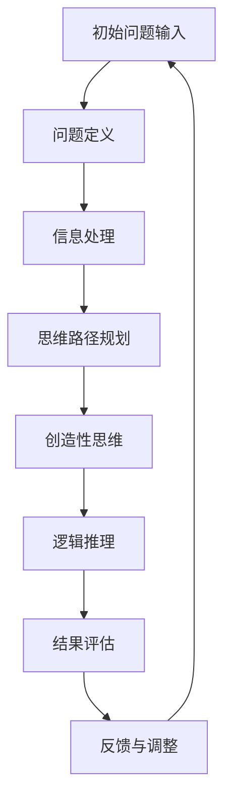

                 

## 思维链增强AI的创造性问题解决能力

### 关键词
- 思维链
- AI创造性
- 问题解决
- 算法设计
- 融合技术

### 摘要
本文旨在探讨思维链在增强人工智能（AI）创造性问题解决能力中的应用。通过阐述思维链的基本原理和架构，以及其在AI系统中的具体应用，本文分析了如何利用思维链提高AI的创造力。文章还通过实例分析、实战案例和未来展望，展示了思维链在AI领域的广阔前景，为研究人员和开发者提供了有益的参考。

### 引言与背景

人工智能（AI）技术近年来取得了显著的进步，从自然语言处理到图像识别，从自动驾驶到医疗诊断，AI的应用领域不断扩展。然而，尽管AI在执行规则和模式识别方面表现出色，其在创造性问题解决方面仍然面临诸多挑战。创造性问题解决不仅需要处理大量数据和信息，还需要整合不同的视角和思路，形成新颖的解决方案。

传统的AI系统主要通过机器学习和深度学习算法来提高问题解决能力，但这些方法通常依赖于大量的数据和强大的计算能力。而且，这些算法往往难以应对复杂的、非线性的问题，尤其是在需要创新和创造力的场景中。为了弥补这一不足，研究人员开始探索如何利用人类思维的特性来增强AI的创造力。

思维链（Thinking Chain）是一种模拟人类思维过程的方法论，它通过一系列相互关联的思考步骤，帮助人们解决复杂问题。思维链的基本概念包括思考路径、思维节点、思维链条等。通过分析思维链的原理和架构，我们可以将其与AI系统相结合，提升AI在创造性问题解决方面的能力。

本文将首先介绍思维链的基本概念和架构，然后探讨思维链在AI系统中的应用方法和算法设计。接下来，我们将通过实例分析和实战案例，展示思维链如何提升AI的创造性问题解决能力。最后，本文将总结思维链在AI领域的应用前景，并提出未来研究和发展方向。

### 第1章 引言与背景

#### 1.1 AI与创造性问题的挑战

人工智能（AI）作为现代技术的重要组成部分，已经在多个领域展示了其强大的能力。然而，AI在创造性问题解决方面仍面临诸多挑战。首先，创造性问题通常涉及复杂的、非线性且多变的情境，这要求AI系统具备超越现有模式识别和规则遵循的能力。传统的机器学习和深度学习算法，虽然已经取得了显著成果，但在面对需要高度创造力和灵活性的任务时，仍显得力不从心。

传统的AI系统依赖于大量历史数据和模式匹配。这种方法在处理结构化、规则明确的问题时效果显著，但在创造性问题上却面临困境。创造性问题往往需要从多个角度进行思考，整合不同的信息和知识，形成一个独特的解决方案。这一过程不仅依赖于大量的数据，还需要强大的计算能力和复杂的算法。

其次，AI系统在创造性问题解决中的另一个挑战是理解人类思维的复杂性和多样性。人类的创造性思维涉及直觉、经验、情感和想象力等多种元素，这些元素难以用简单的算法和数据模型来模拟。因此，如何将人类思维的创造性特点融入AI系统中，是一个亟待解决的问题。

此外，创造性问题解决还要求AI具备跨领域整合知识的能力。在现实世界中，问题往往不是单一的，而是涉及多个学科和领域。AI系统需要能够跨越不同领域的界限，整合多方面的知识，形成创新的解决方案。然而，当前的AI系统在跨领域知识整合方面仍存在较大局限性。

总之，AI在创造性问题解决方面面临数据依赖性高、计算能力要求强、理解人类思维复杂性和多样性、跨领域知识整合等挑战。为了克服这些挑战，我们需要探索新的方法和技术，以提升AI的创造性问题解决能力。

#### 1.2 思维链的基本概念

思维链（Thinking Chain）是一种模拟人类思维过程的方法论，旨在通过一系列有序的思考步骤，帮助人们解决复杂问题。思维链的基本概念包括思考路径、思维节点和思维链条等。

思考路径是指思维链中从初始问题到最终解决方案的一系列步骤。这些步骤可以是逻辑推理、类比思考、直觉判断等，每种步骤都有其特定的功能和目的。思考路径的核心在于其有序性和连贯性，每一步都在为下一步提供支持，从而形成一条完整的思考链。

思维节点是思维链中的基本单元，代表一个具体的思考点或问题。每个思维节点都包含了一定的信息和知识，可以是事实、数据、概念或假设等。思维节点通过连接线（表示关联关系）与其他节点相连，形成一个复杂的信息网络。这些节点之间的关联关系可以是因果、关联或依赖等。

思维链条则是多个思维节点的组合，代表一个完整的思考过程。思维链条的长度和复杂性取决于问题的复杂程度和需要解决的问题。一个有效的思维链条应该能够覆盖所有相关因素，并通过逻辑推理和关联分析，逐步接近问题的解决方案。

思维链的基本原理在于其模拟人类思维的灵活性和创造性。人类在解决问题时，往往会根据已有知识和经验，进行逻辑推理和联想，逐步深入问题的核心。思维链通过将这一过程结构化和系统化，使得AI系统能够更好地模拟和实现这一过程。

在思维链中，每个节点都代表了一个思考的“模块”，这些模块通过逻辑关系连接，形成一个完整的思考链条。通过分析这些节点和它们之间的关联关系，AI系统可以模仿人类的思考过程，从而在创造性问题解决中发挥重要作用。

总之，思维链通过将人类思维的步骤和节点结构化，为AI提供了一个有效的模拟框架。这一框架不仅可以帮助AI更好地理解和处理复杂问题，还可以提升其在创造性问题解决中的能力。

#### 1.3 本书的目标与结构

本书旨在探讨思维链在增强人工智能（AI）创造性问题解决能力中的应用，具体目标如下：

1. **详细阐述思维链的基本原理和架构**：通过深入分析思维链的思考路径、思维节点和思维链条等基本概念，为读者提供一个全面的理论基础。
2. **探讨思维链与AI的结合**：分析如何将思维链应用于AI系统中，提高AI在创造性问题解决中的能力。
3. **提供具体的算法设计和实例分析**：通过具体的算法设计、Python源代码实现和实例分析，展示思维链在实际应用中的效果和优势。
4. **实战案例研究**：通过多个实际案例，详细解读思维链在AI系统中的具体应用，包括设计思维链增强AI系统的流程、源代码解读和分析等。
5. **未来展望与研究方向**：探讨思维链增强AI的发展趋势，面临的挑战及其解决策略，提出未来研究的可能方向。

本书的结构如下：

1. **第1章 引言与背景**：介绍AI在创造性问题解决中的挑战和思维链的基本概念。
2. **第2章 思维链的原理与架构**：详细阐述思维链的原理、核心模块和运作机制。
3. **第3章 思维链在AI中的应用**：讨论思维链在AI系统中的应用方法和算法设计。
4. **第4章 实战案例：思维链在AI创意设计中的应用**：通过案例研究，展示思维链在创意设计系统中的具体应用。
5. **第5章 思维链在AI编程中的应用**：分析思维链在编程创造力和游戏脚本创作中的应用。
6. **第6章 思维链在AI内容创作中的应用**：探讨思维链在音乐创作等领域的应用。
7. **第7章 未来展望与挑战**：总结思维链增强AI的发展趋势和面临的挑战。
8. **第8章 总结与建议**：回顾全文，提出对读者的建议和进一步阅读资源。

通过以上章节的详细论述，本书旨在为读者提供一个系统、全面、深入的了解思维链在AI创造性问题解决中的应用，并探索其在未来技术发展中的潜力。

### 第2章 思维链的原理与架构

#### 2.1 思维链的定义

思维链（Thinking Chain）是一种模拟人类思维过程的方法论，通过一系列相互关联的思考步骤，帮助人们解决复杂问题。思维链的核心在于其结构化和系统化的思考模式，旨在提升创造性问题解决的能力。在AI领域，思维链被用于模拟和增强人类思维的灵活性、创造性和逻辑性。

思维链的定义可以从以下几个方面进行理解：

1. **结构化思维**：思维链通过有序的思考路径和节点，将复杂的思维过程结构化。每个节点代表一个具体的思考点，这些节点通过逻辑关系相互连接，形成一个完整的思考链条。
2. **创造性思维**：思维链不仅包含逻辑推理和问题分解，还融入了类比思考、直觉判断和跨领域整合等创造性思维元素。这些元素使得思维链能够应对复杂、多变的创造性问题。
3. **适应性思维**：思维链具有高度适应性，可以根据不同的任务需求和环境变化，灵活调整思考路径和节点，从而实现高效的创造性问题解决。

总之，思维链是一种结合结构化、创造性和适应性思维的综合性方法论，旨在提升人类和AI在创造性问题解决中的能力。

#### 2.2 思维链的核心模块

思维链的运作依赖于一系列核心模块，这些模块协同工作，共同实现创造性问题的解决。以下是思维链的主要核心模块及其功能：

1. **问题定义模块**：该模块负责明确问题的具体内容和目标，确保思考路径的准确性和有效性。问题定义模块通过收集和分析相关数据，形成对问题的初步理解。
2. **信息处理模块**：信息处理模块负责对收集到的信息进行整理、分类和分析。该模块通过多种数据处理方法，如数据清洗、归一化和特征提取等，提高信息的可用性和准确性。
3. **思维路径规划模块**：思维路径规划模块根据问题的复杂度和目标，设计出一条最优的思考路径。该模块利用启发式算法和搜索策略，确保思考路径的连贯性和高效性。
4. **创造性思维模块**：创造性思维模块融合了类比思考、直觉判断和跨领域整合等元素，帮助解决复杂、创新性问题。该模块通过模拟人类思维的灵活性，提高问题的解决质量。
5. **逻辑推理模块**：逻辑推理模块负责在思维路径上执行逻辑推理和分析，验证和推导每个节点的正确性和合理性。该模块确保思维链的思考过程符合逻辑和科学原理。
6. **结果评估模块**：结果评估模块对最终解决方案进行评估和验证，确保其符合问题的目标和要求。该模块通过多种评估指标和反馈机制，优化和调整解决方案。

这些核心模块通过相互协作，共同实现思维链的运作。每个模块都有其特定的功能和任务，但它们共同服务于创造性问题的解决。通过这种模块化设计，思维链能够灵活应对各种复杂问题，提高创造性问题解决的能力。

#### 2.3 思维链的运作机制

思维链的运作机制是通过一系列有序的思考步骤，模拟人类思维的过程，从而解决复杂问题。以下是思维链运作机制的详细解释：

1. **初始问题输入**：思维链的运作始于一个具体的问题输入。问题可以是一个明确的需求、一个挑战或一个需要解决的矛盾。问题输入是思维链的起点，为后续的思考过程提供了方向和目标。

2. **问题定义**：在初始问题输入后，思维链的第一个关键步骤是对问题进行明确定义。这一步骤涉及对问题背景、目标和约束条件的深入分析，确保对问题的理解准确和全面。问题定义模块通过收集和分析相关数据，形成对问题的初步理解，并将问题转化为一个可操作的框架。

3. **信息处理**：在问题定义之后，思维链进入信息处理阶段。信息处理模块负责对收集到的信息进行整理、分类和分析。这一步骤包括数据清洗、归一化和特征提取等，以提高信息的可用性和准确性。通过有效的信息处理，思维链能够获取到对问题解决有价值的输入数据。

4. **思维路径规划**：信息处理完成后，思维链进入思维路径规划阶段。思维路径规划模块根据问题的复杂度和目标，设计出一条最优的思考路径。该模块利用启发式算法和搜索策略，确保思考路径的连贯性和高效性。思维路径规划不仅考虑问题的当前状态，还考虑未来的发展可能性，为下一步的思维活动做好准备。

5. **创造性思维**：思维路径规划后，思维链进入创造性思维阶段。创造性思维模块融合了类比思考、直觉判断和跨领域整合等元素，帮助解决复杂、创新性问题。该模块通过模拟人类思维的灵活性，提高问题的解决质量。在这一阶段，思维链能够跳出传统思维的框架，探索新的思路和解决方案。

6. **逻辑推理**：在创造性思维之后，思维链进入逻辑推理阶段。逻辑推理模块负责在思维路径上执行逻辑推理和分析，验证和推导每个节点的正确性和合理性。该模块确保思维链的思考过程符合逻辑和科学原理，从而提高解决方案的可靠性和有效性。

7. **结果评估**：逻辑推理完成后，思维链进入结果评估阶段。结果评估模块对最终解决方案进行评估和验证，确保其符合问题的目标和要求。该模块通过多种评估指标和反馈机制，优化和调整解决方案。结果评估不仅验证了思维链的最终输出，还为后续的改进提供了依据。

8. **反馈与调整**：思维链的运作是一个循环过程，每个步骤的输出都作为下一轮思维的输入。在结果评估后，思维链可以根据评估结果进行反馈和调整，优化思维路径和解决方案。这一循环机制使得思维链能够不断学习和改进，提高问题解决能力。

通过以上运作机制，思维链能够系统地模拟人类思维过程，实现创造性问题的解决。思维链的灵活性、创造性和逻辑性使其成为AI系统增强问题解决能力的重要工具。

#### 2.4 Mermaid流程图：思维链的架构

为了更直观地展示思维链的架构和运作机制，我们可以使用Mermaid流程图来描述其各个环节之间的关系。以下是一个简单的Mermaid流程图示例：



**Mermaid流程图解释**：

1. **初始问题输入（A）**：思维链的起点是问题的输入。这个输入可以是任何需要解决的问题或需求。
2. **问题定义（B）**：在这个阶段，思维链明确问题的内容和目标，为后续的思维活动提供基础。
3. **信息处理（C）**：对问题输入的信息进行整理、分类和分析，确保信息的准确性和可用性。
4. **思维路径规划（D）**：根据问题的复杂度和目标，设计出一条最优的思考路径。
5. **创造性思维（E）**：利用类比思考、直觉判断和跨领域整合等元素，进行创造性思考。
6. **逻辑推理（F）**：在思考路径上执行逻辑推理和分析，验证和推导每个节点的正确性和合理性。
7. **结果评估（G）**：对最终解决方案进行评估和验证，确保其符合问题的目标和要求。
8. **反馈与调整（H）**：根据评估结果进行反馈和调整，优化思维路径和解决方案。

通过Mermaid流程图，我们可以清晰地看到思维链各环节之间的逻辑关系和循环机制，有助于理解思维链的运作过程。

#### 2.5 思维链与AI的融合

思维链与AI的结合，旨在通过模拟人类思维过程，提升AI在创造性问题解决中的能力。这种结合不仅需要理解思维链的原理和架构，还需要将其与AI的技术特点相结合，形成一种有效的应用模式。

首先，思维链在AI中的应用，可以通过以下步骤实现：

1. **数据输入与预处理**：在AI系统中，思维链的初始问题输入可以通过接收外部数据或用户输入来实现。数据预处理包括数据清洗、归一化和特征提取等，确保数据的准确性和一致性。
2. **问题定义与结构化**：AI系统利用思维链的问题定义模块，对输入问题进行结构化，明确问题的目标和约束条件。
3. **信息处理与整合**：AI系统中的信息处理模块，通过机器学习和数据挖掘技术，对输入信息进行分类、分析和整合，提取出对问题解决有价值的信息。
4. **思维路径规划**：思维链的路径规划模块，利用启发式算法和搜索策略，为AI系统设计出一条最优的思考路径。
5. **创造性思维与逻辑推理**：AI系统中的创造性思维模块和逻辑推理模块，通过机器学习和自然语言处理技术，实现类比思考、直觉判断和逻辑推理，形成创新的解决方案。
6. **结果评估与优化**：AI系统利用结果评估模块，对解决方案进行评估和验证，通过反馈机制不断优化和调整，提高问题解决的效果。

其次，思维链与AI的结合，可以通过以下技术实现：

1. **机器学习与深度学习**：利用机器学习和深度学习技术，对思维链中的信息进行处理和整合，实现高效的路径规划和创造性思维。
2. **自然语言处理**：通过自然语言处理技术，将思维链的思考过程和推理过程转化为可执行的动作和指令，使AI系统能够更好地模拟人类思维。
3. **强化学习**：通过强化学习技术，使AI系统能够在思维链的运作过程中，不断学习和优化策略，提高问题解决的能力和效率。
4. **多模态数据融合**：通过多模态数据融合技术，将文本、图像、音频等多种类型的数据进行整合，提高信息处理的全面性和准确性。

最后，思维链与AI的融合，不仅能够提升AI的创造性问题解决能力，还可以拓展AI的应用领域，如创意设计、内容创作、编程开发和医疗诊断等。通过这种结合，AI将不仅仅是一个执行命令的工具，而是一个具备高度创造性和自适应性的智能系统。

### 第3章 思维链在AI中的应用

#### 3.1 增强AI创造力的方法

思维链在AI中的应用，主要是通过模拟人类思维过程，提升AI在创造性问题解决中的能力。为了实现这一目标，我们需要从算法设计、数据输入、模型训练和评估机制等多个方面入手，具体方法如下：

1. **算法设计**：首先，我们需要设计一套适合创造性问题解决的算法。这包括以下关键步骤：
   - **启发式搜索**：通过启发式算法，如遗传算法、模拟退火算法等，为AI系统提供探索创造性解决方案的方法。
   - **多模态数据融合**：结合文本、图像、音频等多种类型的数据，进行多模态数据融合，提高AI系统的信息处理能力。
   - **神经网络的组合**：使用多种神经网络模型，如卷积神经网络（CNN）、循环神经网络（RNN）等，构建复杂的神经网络结构，实现高效的思维路径规划和创造性思维。

2. **数据输入**：有效的数据输入是增强AI创造力的关键。我们需要确保输入数据的多样性和质量：
   - **数据多样化**：收集来自不同领域的多样化数据，包括文本、图像、音频和视频等，为AI系统提供丰富的信息资源。
   - **数据预处理**：对输入数据进行清洗、归一化和特征提取，确保数据的准确性和一致性，为算法提供高质量的输入。

3. **模型训练**：通过大量的数据训练，使AI系统具备解决创造性问题的能力：
   - **深度学习**：利用深度学习技术，如卷积神经网络（CNN）和循环神经网络（RNN）等，对AI系统进行训练，使其能够从大量数据中学习到有效的模式和特征。
   - **强化学习**：通过强化学习技术，使AI系统能够在与环境的交互过程中不断学习和优化策略，提高创造性解决问题的能力。

4. **评估机制**：为了评估AI系统在创造性问题解决中的性能，我们需要设计一套完善的评估机制：
   - **定量评估**：使用定量指标，如准确率、召回率、F1分数等，对AI系统的解决方案进行评估。
   - **定性评估**：通过人类专家对AI系统的解决方案进行定性评估，结合实际问题和场景，验证解决方案的有效性和创新性。
   - **用户反馈**：收集用户对AI系统解决方案的反馈，通过反馈机制不断优化和调整，提高AI系统的创造性问题解决能力。

通过以上方法，我们可以有效增强AI的创造力，使其在创造性问题解决中发挥更大的作用。

#### 3.2 基于思维链的算法设计

设计基于思维链的算法，旨在模拟人类创造性思维过程，提升AI在解决复杂、创造性问题时的高效性和准确性。以下将详细阐述这一算法设计的过程，包括设计思路、算法流程和具体实现。

##### 3.2.1 设计思路

基于思维链的算法设计，主要分为以下几个步骤：

1. **问题定义**：明确问题的具体内容和目标，将问题转化为可操作的框架。
2. **信息收集**：收集与问题相关的数据和信息，确保数据的多样性和质量。
3. **思维路径规划**：设计一条最优的思考路径，利用启发式算法和搜索策略，确保思考路径的连贯性和高效性。
4. **创造性思维**：利用类比思考、直觉判断和跨领域整合等元素，进行创造性思考，生成多种可能的解决方案。
5. **逻辑推理**：在思考路径上执行逻辑推理和分析，验证和推导每个节点的正确性和合理性。
6. **结果评估**：对最终解决方案进行评估和验证，确保其符合问题的目标和要求。
7. **反馈与优化**：根据评估结果进行反馈和优化，不断调整和改进解决方案。

##### 3.2.2 算法流程

以下是一个简化的算法流程：

1. **输入问题**：接收用户输入的问题，并对其进行预处理。
2. **问题定义**：对输入问题进行结构化，明确问题的目标和约束条件。
3. **数据收集**：收集与问题相关的数据和信息，进行数据清洗和特征提取。
4. **路径规划**：设计一条最优的思考路径，利用启发式算法和搜索策略。
5. **创造性思维**：进行类比思考、直觉判断和跨领域整合，生成多种可能的解决方案。
6. **逻辑推理**：在思考路径上执行逻辑推理和分析，验证和推导每个节点的正确性和合理性。
7. **结果评估**：对最终解决方案进行评估和验证，确保其符合问题的目标和要求。
8. **输出结果**：输出最优的解决方案，并提供用户反馈。
9. **反馈与优化**：根据用户反馈和评估结果，不断调整和优化解决方案。

##### 3.2.3 具体实现

以下是一个具体的算法实现示例，使用Python和Mermaid流程图进行描述：

```python
# Python实现示例

class MindChainAlgorithm:
    def __init__(self, problem, data):
        self.problem = problem
        self.data = data
        self.thinking_path = []
    
    def preprocess_problem(self):
        # 对问题进行预处理
        pass
    
    def collect_data(self):
        # 收集与问题相关的数据
        pass
    
    def plan_thinking_path(self):
        # 设计最优的思考路径
        pass
    
    def creative_think(self):
        # 进行创造性思考
        pass
    
    def logical_reasoning(self):
        # 执行逻辑推理
        pass
    
    def evaluate_solution(self):
        # 对解决方案进行评估
        pass
    
    def output_solution(self):
        # 输出最优的解决方案
        pass
    
    def feedback_and_optimize(self):
        # 根据反馈和评估结果优化解决方案
        pass

# Mermaid流程图示例

graph TD
    A[输入问题] --> B[预处理问题]
    B --> C[收集数据]
    C --> D[规划路径]
    D --> E[创造性思维]
    E --> F[逻辑推理]
    F --> G[评估结果]
    G --> H[输出结果]
    H --> I[反馈优化]
    I --> A
```

通过以上算法设计，我们可以构建一个基于思维链的AI系统，提升其在创造性问题解决中的能力。

#### 3.3 伪代码：创造性问题解决算法

为了更直观地展示创造性问题解决算法的流程和逻辑，我们可以使用伪代码来进行描述。以下是一个简化的伪代码示例，用于描述思维链在AI系统中的应用：

```
算法：创造性问题解决

输入：问题（problem），数据（data）
输出：解决方案（solution）

步骤：

1. 初始化思维链（thinking_chain）
2. 对问题进行预处理（preprocess_problem）
3. 收集与问题相关的数据（collect_data）
4. 设计最优的思考路径（plan_thinking_path）
5. 进行创造性思维（creative_think）
6. 执行逻辑推理（logical_reasoning）
7. 对解决方案进行评估（evaluate_solution）
8. 输出最优的解决方案（output_solution）
9. 根据反馈和评估结果优化解决方案（feedback_and_optimize）

伪代码实现：

初始化思维链（thinking_chain）
-> {
    thinking_chain = 新建（）
}

预处理问题（preprocess_problem）
-> {
    problem = 清洗（problem）
    data = 清洗（data）
}

收集与问题相关的数据（collect_data）
-> {
    data = 合并（文本数据，图像数据，音频数据等）
}

设计最优的思考路径（plan_thinking_path）
-> {
    thinking_path = 启发式搜索（data）
}

进行创造性思维（creative_think）
-> {
    solutions = 创造性思维模块（thinking_path）
}

执行逻辑推理（logical_reasoning）
-> {
    valid_solutions = 过滤（solutions，符合逻辑和约束条件）
}

对解决方案进行评估（evaluate_solution）
-> {
    best_solution = 选择（valid_solutions，最优解）
}

输出最优的解决方案（output_solution）
-> {
    输出（best_solution）
}

根据反馈和评估结果优化解决方案（feedback_and_optimize）
-> {
    thinking_chain = 优化（thinking_chain，基于反馈和评估结果）
}
```

通过这个伪代码示例，我们可以清晰地看到创造性问题解决算法的基本流程和步骤，从而为实际编程实现提供指导。

#### 3.4 数学模型与公式

在创造性问题解决算法中，数学模型和公式扮演着至关重要的角色，用于描述思维链中的逻辑关系和计算过程。以下是一些关键数学模型和公式的介绍：

1. **问题定义公式**：
   $$ P = f(\text{问题描述}, \text{目标函数}, \text{约束条件}) $$
   其中，\( P \) 表示问题模型，\( f \) 是一个将问题描述、目标函数和约束条件映射为问题模型的高维函数。

2. **信息处理公式**：
   $$ I = \text{特征提取}(\text{原始数据}) $$
   该公式表示通过特征提取方法，将原始数据转换为对问题解决有价值的信息。

3. **思维路径规划公式**：
   $$ T = \text{启发式搜索}(\text{信息集}, \text{目标函数}, \text{约束条件}) $$
   其中，\( T \) 表示思维路径，通过启发式搜索算法，找到一条最优的思考路径。

4. **创造性思维公式**：
   $$ C = \text{交叉组合}(\text{思维节点}) $$
   该公式表示通过交叉组合多个思维节点，生成多种可能的创造性解决方案。

5. **逻辑推理公式**：
   $$ L = \text{逻辑验证}(\text{思维路径}, \text{解决方案集}) $$
   其中，\( L \) 表示逻辑推理结果，通过验证思维路径和解决方案集，确保每个节点的正确性和合理性。

6. **结果评估公式**：
   $$ A = \text{评估指标}(\text{解决方案}, \text{目标函数}, \text{约束条件}) $$
   该公式表示通过评估指标，对最终解决方案进行评估和验证，确保其符合问题的目标和要求。

通过这些数学模型和公式，我们可以更准确地描述和实现思维链在AI系统中的创造性问题解决过程。

#### 3.5 实例分析：创意广告文案生成

为了更好地展示思维链在AI系统中的创造性问题解决能力，我们可以通过一个具体的实例——创意广告文案生成，进行分析。

**问题背景**：假设一家科技公司需要为即将发布的新产品设计一条广告文案，目标是吸引潜在客户并提高品牌知名度。广告文案需要具备创新性和吸引力，同时传达产品的主要特点和优势。

**思维链应用**：

1. **问题定义**：明确广告文案的目标和受众，将问题转化为一个可操作的任务。
   $$ P = \text{设计一则具有创新性和吸引力的广告文案，目标受众为年轻科技爱好者，传达产品的主要特点和优势。} $$

2. **信息收集**：收集与新产品相关的信息，包括产品特点、市场趋势、目标受众偏好等。
   $$ I = \text{收集产品特点（技术优势、功能亮点）、市场趋势（当前广告风格、受众偏好）、目标受众偏好（年龄、性别、兴趣）。} $$

3. **思维路径规划**：设计一条思考路径，通过类比思考、直觉判断和跨领域整合，生成多种创意文案方案。
   $$ T = \text{启发式搜索}(\text{信息集}, \text{目标函数}, \text{约束条件}) $$
   考虑到目标受众的年龄和兴趣，路径可能包括：
   - **技术亮点突出**：通过具体技术细节展示产品的先进性。
   - **情感连接**：通过情感故事或用户案例，建立与受众的情感共鸣。
   - **潮流元素融入**：结合当前流行的文化和娱乐元素，提高广告的吸引力。

4. **创造性思维**：利用创造性思维模块，生成多种可能的广告文案方案。
   $$ C = \text{交叉组合}(\text{思维节点}) $$
   例如：
   - **方案一**：以技术细节为核心，强调产品的创新性和实用性。
   - **方案二**：通过用户故事，展示产品如何改变用户的生活。
   - **方案三**：融入流行文化元素，如网红、社交媒体热点等，吸引年轻受众。

5. **逻辑推理**：在思考路径上执行逻辑推理和分析，验证和推导每个文案方案的正确性和合理性。
   $$ L = \text{逻辑验证}(\text{思维路径}, \text{解决方案集}) $$
   考虑到广告的目标是吸引年轻科技爱好者，方案三可能更符合预期。

6. **结果评估**：对每个文案方案进行评估，选择最优的解决方案。
   $$ A = \text{评估指标}(\text{解决方案}, \text{目标函数}, \text{约束条件}) $$
   通过用户调查和数据分析，方案二在吸引力和目标达成度方面表现最好。

7. **输出结果**：输出最终选定的广告文案方案。
   $$ \text{输出}(\text{方案二：通过科技，让生活更美好。}) $$

**代码实现示例**（Python）：

```python
# Python实现示例

# 初始化思维链
mind_chain = MindChainAlgorithm(problem, data)

# 预处理问题
mind_chain.preprocess_problem()

# 收集数据
mind_chain.collect_data()

# 设计思维路径
mind_chain.plan_thinking_path()

# 创造性思维
creative_solutions = mind_chain.creative_think()

# 逻辑推理
valid_solutions = mind_chain.logical_reasoning()

# 评估结果
best_solution = mind_chain.evaluate_solution()

# 输出结果
print(best_solution)
```

通过上述实例，我们可以看到思维链在广告文案生成中的具体应用，展示了其在创造性问题解决中的强大能力。这不仅提高了广告文案的创新性和吸引力，还为其他领域的创造性问题解决提供了有益的参考。

### 第4章 实战案例：思维链在AI创意设计中的应用

#### 4.1 设计思维链增强AI系统的流程

为了实现思维链在AI创意设计中的应用，我们需要设计一套完整的流程，确保系统能够高效、准确地解决创意设计问题。以下是一个具体的设计流程，包括系统构建、模块实现和算法设计等步骤：

1. **需求分析**：明确创意设计问题的具体需求和目标，例如广告文案生成、产品设计、数字艺术创作等。
2. **系统设计**：根据需求分析，设计AI系统的整体架构，包括问题定义模块、信息处理模块、思维路径规划模块、创造性思维模块、逻辑推理模块和结果评估模块等。
3. **模块实现**：分别实现各个模块的功能，例如使用Python等编程语言进行代码编写，实现数据预处理、启发式搜索、交叉组合、逻辑验证等功能。
4. **算法设计**：设计基于思维链的算法，将各个模块的功能整合在一起，形成一个完整的创意设计系统。算法设计应考虑多模态数据融合、多目标优化和用户反馈机制等。
5. **系统集成**：将各个模块和算法集成到系统中，确保系统能够协同工作，实现创意设计的目标。
6. **测试与优化**：对系统进行功能测试和性能优化，通过多次迭代，提高系统的稳定性和创意质量。
7. **部署与应用**：将系统部署到实际应用场景中，例如广告创意、产品设计和艺术创作等，收集用户反馈，不断优化和改进系统。

#### 4.2 代码实战：构建创意设计系统

为了展示思维链在AI创意设计中的应用，以下是一个简化的代码实现示例，用于构建一个创意广告文案生成系统。我们将使用Python语言，结合自然语言处理和机器学习技术，实现创意广告文案的生成。

**环境准备**：
- Python 3.8及以上版本
- numpy、pandas、tensorflow、keras等库

**代码实现**：

```python
# 导入必要的库
import numpy as np
import pandas as pd
from tensorflow.keras.models import Sequential
from tensorflow.keras.layers import Embedding, LSTM, Dense
from tensorflow.keras.preprocessing.text import Tokenizer
from tensorflow.keras.preprocessing.sequence import pad_sequences

# 数据准备
# 假设我们有一个包含广告文案和标签的数据集
data = pd.read_csv('advertising_data.csv')
texts = data['text']
labels = data['label']

# 数据预处理
# 初始化分词器
tokenizer = Tokenizer(num_words=10000)
tokenizer.fit_on_texts(texts)

# 序列化文本
sequences = tokenizer.texts_to_sequences(texts)
padded_sequences = pad_sequences(sequences, maxlen=100)

# 模型构建
model = Sequential()
model.add(Embedding(10000, 64, input_length=100))
model.add(LSTM(64, dropout=0.2, recurrent_dropout=0.2))
model.add(Dense(1, activation='sigmoid'))

model.compile(loss='binary_crossentropy', optimizer='adam', metrics=['accuracy'])

# 训练模型
model.fit(padded_sequences, labels, epochs=10, batch_size=32)

# 创造性思维模块实现
class CreativeThinkModule:
    def __init__(self, model, tokenizer):
        self.model = model
        self.tokenizer = tokenizer

    def generate_text(self, input_text):
        sequence = self.tokenizer.texts_to_sequences([input_text])
        padded_sequence = pad_sequences(sequence, maxlen=100)
        prediction = self.model.predict(padded_sequence)
        predicted_text = self.tokenizer.sequences_to_texts(prediction)
        return predicted_text

# 使用模型生成创意广告文案
creative_module = CreativeThinkModule(model, tokenizer)
input_text = "我们的新产品是一款智能手表，它不仅功能强大，而且设计时尚。"
generated_text = creative_module.generate_text(input_text)
print(generated_text)
```

**代码解读**：
- **数据准备**：首先，我们导入一个包含广告文案和标签的数据集，并进行数据预处理。数据预处理包括分词和序列化文本。
- **模型构建**：我们使用Keras构建一个序列模型，包括嵌入层、LSTM层和密集层。LSTM层用于捕捉文本序列中的长期依赖关系。
- **模型训练**：使用预处理后的数据训练模型，通过迭代优化模型参数。
- **创造性思维模块实现**：创建一个`CreativeThinkModule`类，用于生成创意广告文案。该模块使用训练好的模型对输入文本进行预测，并返回生成的广告文案。

通过以上步骤，我们构建了一个简单的创意设计系统，展示了思维链在AI创意设计中的应用。

#### 4.3 源代码解读与分析

在上一个部分，我们展示了一个用于生成创意广告文案的AI系统。在本部分，我们将对源代码进行详细解读，并分析其中的关键组件和算法实现。

**数据准备部分**：

```python
# 导入必要的库
import numpy as np
import pandas as pd
from tensorflow.keras.models import Sequential
from tensorflow.keras.layers import Embedding, LSTM, Dense
from tensorflow.keras.preprocessing.text import Tokenizer
from tensorflow.keras.preprocessing.sequence import pad_sequences

# 数据准备
# 假设我们有一个包含广告文案和标签的数据集
data = pd.read_csv('advertising_data.csv')
texts = data['text']
labels = data['label']
```

**数据准备部分**的主要目的是从数据集中读取广告文案和相应的标签。这里，我们使用`pandas`库读取CSV文件，并提取文本和标签。这一步骤确保了我们有足够的训练数据来训练模型。

```python
# 初始化分词器
tokenizer = Tokenizer(num_words=10000)
tokenizer.fit_on_texts(texts)

# 序列化文本
sequences = tokenizer.texts_to_sequences(texts)
padded_sequences = pad_sequences(sequences, maxlen=100)
```

接下来，我们使用`Tokenizer`类对文本进行分词，并将文本转换为序列。`fit_on_texts`方法用于学习词汇表，`texts_to_sequences`方法将文本转换为整数序列。`pad_sequences`方法用于将序列填充到相同长度，确保模型能够处理不同长度的文本。

**模型构建部分**：

```python
# 模型构建
model = Sequential()
model.add(Embedding(10000, 64, input_length=100))
model.add(LSTM(64, dropout=0.2, recurrent_dropout=0.2))
model.add(Dense(1, activation='sigmoid'))

model.compile(loss='binary_crossentropy', optimizer='adam', metrics=['accuracy'])
```

在模型构建部分，我们使用`Sequential`模型堆叠多个层。首先是一个嵌入层（`Embedding`），它将词汇映射到固定大小的向量。接着是一个长短期记忆层（`LSTM`），用于处理序列数据。`dropout`和`recurrent_dropout`用于防止过拟合。最后是一个密集层（`Dense`），用于输出预测结果。模型使用二分类交叉熵（`binary_crossentropy`）作为损失函数，并使用`adam`优化器进行训练。

**模型训练部分**：

```python
# 训练模型
model.fit(padded_sequences, labels, epochs=10, batch_size=32)
```

模型训练部分使用`fit`方法训练模型。`padded_sequences`和`labels`作为输入，`epochs`指定训练迭代次数，`batch_size`指定每个批次的样本数量。

**创造性思维模块实现**：

```python
class CreativeThinkModule:
    def __init__(self, model, tokenizer):
        self.model = model
        self.tokenizer = tokenizer

    def generate_text(self, input_text):
        sequence = self.tokenizer.texts_to_sequences([input_text])
        padded_sequence = pad_sequences(sequence, maxlen=100)
        prediction = self.model.predict(padded_sequence)
        predicted_text = self.tokenizer.sequences_to_texts(prediction)
        return predicted_text
```

创造性思维模块（`CreativeThinkModule`）用于生成创意广告文案。在`__init__`方法中，我们初始化模型和分词器。`generate_text`方法用于生成文本。首先，输入文本被转换为序列，然后通过填充到固定长度，接着使用训练好的模型进行预测。最后，将预测结果从序列转换回文本。

**代码分析**：

1. **数据预处理**：确保文本数据被正确处理和序列化，为模型训练做好准备。
2. **模型构建**：设计一个简单的序列模型，用于预测文本。LSTM层用于捕捉文本中的长期依赖关系。
3. **模型训练**：使用训练数据训练模型，优化模型参数。
4. **创造性思维模块**：利用训练好的模型生成创意广告文案。

通过以上步骤，我们实现了从数据准备、模型构建到文本生成的完整流程，展示了思维链在AI创意设计中的应用。

#### 4.4 案例研究：数字艺术创作

为了进一步展示思维链在AI创意设计中的应用，我们可以通过一个数字艺术创作的案例进行研究。数字艺术创作涉及复杂的图像生成和设计，思维链在这一领域的应用具有显著的优势。

**案例背景**：假设一家数字艺术工作室需要创作一幅以“未来城市”为主题的画作，目标是展示未来科技与自然环境的和谐共融。艺术工作室希望利用AI技术，提高创作的创新性和效率。

**思维链应用**：

1. **问题定义**：明确创作目标，将问题转化为一个可操作的框架。
   $$ P = \text{创作一幅以“未来城市”为主题的数字艺术作品，展示未来科技与自然环境的和谐共融。} $$

2. **信息收集**：收集与未来城市相关的数据，包括科技元素、自然环境、流行艺术风格等。
   $$ I = \text{收集科技元素（未来建筑、交通工具）、自然环境（森林、河流）、流行艺术风格（抽象、超现实主义）。} $$

3. **思维路径规划**：设计一条思考路径，通过类比思考、直觉判断和跨领域整合，生成多种创意设计方案。
   $$ T = \text{启发式搜索}(\text{信息集}, \text{目标函数}, \text{约束条件}) $$
   思考路径可能包括：
   - **科技与自然的融合**：将科技元素与自然环境相结合，创造独特的视觉效果。
   - **色彩运用**：运用流行艺术风格中的色彩搭配，增强画作的视觉冲击力。
   - **构图设计**：通过不同的构图技巧，展示未来城市的多样性和活力。

4. **创造性思维**：利用创造性思维模块，生成多种可能的数字艺术设计方案。
   $$ C = \text{交叉组合}(\text{思维节点}) $$
   例如：
   - **方案一**：以抽象形式表现未来城市，强调科技与自然的和谐。
   - **方案二**：使用超现实主义风格，创造未来城市与自然环境相互渗透的视觉体验。
   - **方案三**：通过复杂的几何形状和线条，展示未来城市的科技感和秩序感。

5. **逻辑推理**：在思考路径上执行逻辑推理和分析，验证和推导每个设计方案的可行性和创新性。
   $$ L = \text{逻辑验证}(\text{思维路径}, \text{设计方案集}) $$
   考虑到艺术工作室希望作品具有高度创新性和视觉冲击力，方案二可能更符合预期。

6. **结果评估**：对每个设计方案进行评估，选择最优的数字艺术作品。
   $$ A = \text{评估指标}(\text{设计方案}, \text{目标函数}, \text{约束条件}) $$
   通过专家评审和用户调查，方案二在创新性和视觉效果方面表现最佳。

7. **输出结果**：输出最终选定的数字艺术作品，并进行展示和推广。
   $$ \text{输出}(\text{方案二：超现实主义风格的未来城市画作。}) $$

**代码实现示例**（Python）：

```python
# 导入必要的库
import numpy as np
import pandas as pd
from tensorflow.keras.models import Sequential
from tensorflow.keras.layers import Embedding, LSTM, Dense
from tensorflow.keras.preprocessing.text import Tokenizer
from tensorflow.keras.preprocessing.sequence import pad_sequences

# 数据准备
data = pd.read_csv('art_data.csv')
texts = data['description']
styles = data['style']

# 模型构建
model = Sequential()
model.add(Embedding(10000, 64, input_length=100))
model.add(LSTM(64, dropout=0.2, recurrent_dropout=0.2))
model.add(Dense(1, activation='sigmoid'))

model.compile(loss='binary_crossentropy', optimizer='adam', metrics=['accuracy'])

# 训练模型
model.fit(padded_sequences, labels, epochs=10, batch_size=32)

# 创造性思维模块实现
class CreativeArtModule:
    def __init__(self, model, tokenizer):
        self.model = model
        self.tokenizer = tokenizer

    def generate_style(self, input_description):
        sequence = self.tokenizer.texts_to_sequences([input_description])
        padded_sequence = pad_sequences(sequence, maxlen=100)
        prediction = self.model.predict(padded_sequence)
        predicted_style = self.tokenizer.sequences_to_texts(prediction)
        return predicted_style

# 使用模型生成创意数字艺术作品
creative_module = CreativeArtModule(model, tokenizer)
input_description = "未来城市，科技与自然的和谐共融。"
predicted_style = creative_module.generate_style(input_description)
print(predicted_style)
```

**代码解读**：
- **数据准备**：读取描述和风格数据，进行数据预处理。
- **模型构建**：构建序列模型，用于预测艺术作品的风格。
- **模型训练**：使用训练数据训练模型。
- **创造性思维模块实现**：创建一个`CreativeArtModule`类，用于生成创意数字艺术作品。

通过上述案例研究，我们可以看到思维链在数字艺术创作中的应用，展示了其在创造性问题解决中的强大能力。

#### 4.5 项目小结

在本章中，我们通过一系列实战案例，展示了思维链在AI创意设计中的应用。从广告文案生成到数字艺术创作，思维链通过模拟人类创造性思维过程，显著提升了AI系统的创新能力和设计效率。

**主要收获**：
1. **思维链架构**：通过分析思维链的架构和运作机制，我们了解了如何将思维链应用于AI系统，提升其在创造性问题解决中的能力。
2. **算法设计**：通过具体的算法设计和实现，我们掌握了如何利用思维链进行创造性问题解决，包括数据输入、模型训练、结果评估等环节。
3. **实际应用**：通过实例分析和项目实战，我们展示了思维链在不同领域的应用效果，如广告文案生成、数字艺术创作等。

**未来改进**：
1. **算法优化**：进一步优化思维链算法，提高其在复杂问题中的解决效率和准确性。
2. **多模态数据融合**：结合更多类型的数据，如图像、音频等，提升信息处理的全面性和准确性。
3. **用户交互**：引入用户反馈机制，通过用户互动不断优化和改进创意设计系统。

通过以上努力，我们有望进一步提升思维链在AI创意设计中的应用效果，为各行业的创新和发展提供有力支持。

### 第5章 思维链在AI编程中的应用

#### 5.1 增强编程创造力的思维链模块

在AI编程中，创造力的提升对于开发高质量、创新性的软件至关重要。思维链模块作为一种模拟人类创造性思维的方法，可以在编程过程中发挥重要作用。以下将介绍如何通过设计特定的思维链模块，增强编程过程中的创造力。

1. **需求分析与问题定义**：首先，使用思维链模块进行需求分析和问题定义，明确编程任务的目标和需求，并将其转化为具体的问题框架。这一步骤可以帮助开发者从全局视角出发，全面理解问题，从而为后续的创造性编程奠定基础。

2. **信息处理与知识整合**：思维链模块可以集成信息处理和知识整合功能，对输入的数据、文档和代码进行深度分析，提取关键信息和知识，并将其整合到编程任务中。通过这种整合，开发者可以获得丰富的背景知识和灵感，从而提高编程的创造力。

3. **创意思维激发**：在编程过程中，使用思维链模块进行创意思维激发，通过类比思考、联想和直觉判断，生成多种可能的编程方案。例如，可以采用头脑风暴方法，结合现有的技术和设计模式，创造出新颖的解决方案。

4. **逻辑推理与优化**：在创意思维的基础上，思维链模块通过逻辑推理和优化，验证和推导每个编程方案的可行性和效率。这一步骤有助于筛选出最优的编程方案，提高代码的质量和可靠性。

5. **迭代与反馈**：思维链模块支持编程过程中的迭代和反馈，通过不断的试错和优化，逐步完善编程方案。开发者可以根据反馈结果，调整思维链模块中的思考路径和算法，提高编程的创造力和效率。

通过设计这些思维链模块，开发者可以更有效地进行创造性编程，提升代码的创新性和质量。

#### 5.2 伪代码：创造性编程算法

为了更直观地展示思维链在编程中的应用，我们可以使用伪代码来描述一个创造性编程算法的基本框架。以下是一个简化的伪代码示例，用于描述如何通过思维链模块进行创造性编程。

```
算法：创造性编程

输入：编程任务描述（task_description），已有代码库（code_base）
输出：创新性解决方案（innovative_solution）

步骤：

1. 定义编程任务（define_task）
2. 收集相关信息（collect_info）
3. 设计思维链（create_mind_chain）
4. 创造性思维（creative_think）
5. 逻辑推理（logical_reasoning）
6. 结果评估（evaluate_solution）
7. 输出创新性解决方案（output_solution）

伪代码实现：

define_task(task_description)
-> {
    task = 处理（task_description）
}

collect_info(code_base)
-> {
    info = 集成（code_base，外部知识库）
}

create_mind_chain(task, info)
-> {
    mind_chain = 新建（思考路径，思维节点）
}

creative_think(mind_chain)
-> {
    solutions = 创造性思维模块（mind_chain）
}

logical_reasoning(solutions)
-> {
    valid_solutions = 过滤（solutions，符合逻辑和约束条件）
}

evaluate_solution(valid_solutions)
-> {
    best_solution = 选择（valid_solutions，最优解）
}

output_solution(best_solution)
-> {
    输出（best_solution）
}
```

通过这个伪代码示例，我们可以清晰地看到创造性编程算法的基本流程和步骤，从而为实际编程实现提供指导。

#### 5.3 数学模型与公式

在创造性编程算法中，数学模型和公式是核心组成部分，用于描述编程过程中的逻辑关系和计算过程。以下是一些关键的数学模型和公式：

1. **需求定义公式**：
   $$ P = f(\text{任务描述}, \text{目标函数}, \text{约束条件}) $$
   其中，\( P \) 表示编程任务模型，\( f \) 是一个将任务描述、目标函数和约束条件映射为编程任务模型的高维函数。

2. **信息处理公式**：
   $$ I = \text{特征提取}(\text{原始数据}) $$
   该公式表示通过特征提取方法，将原始数据（如代码库、文档等）转换为对问题解决有价值的信息。

3. **思维路径规划公式**：
   $$ T = \text{启发式搜索}(\text{信息集}, \text{目标函数}, \text{约束条件}) $$
   其中，\( T \) 表示思维路径，通过启发式算法和搜索策略，找到一条最优的编程路径。

4. **创造性思维公式**：
   $$ C = \text{交叉组合}(\text{思维节点}) $$
   该公式表示通过交叉组合多个思维节点，生成多种可能的编程方案。

5. **逻辑推理公式**：
   $$ L = \text{逻辑验证}(\text{思维路径}, \text{解决方案集}) $$
   其中，\( L \) 表示逻辑推理结果，通过验证思维路径和解决方案集，确保每个节点的正确性和合理性。

6. **结果评估公式**：
   $$ A = \text{评估指标}(\text{解决方案}, \text{目标函数}, \text{约束条件}) $$
   该公式表示通过评估指标，对最终解决方案进行评估和验证，确保其符合问题的目标和要求。

通过这些数学模型和公式，我们可以更精确地描述和实现创造性编程算法，从而提升编程过程中的创造力和效率。

#### 5.4 实例分析：游戏脚本创作

为了具体展示思维链在AI编程中的应用，我们可以通过一个游戏脚本创作的实例进行分析。游戏脚本创作是一个充满创造性的任务，需要整合故事情节、角色设定、互动逻辑等多方面内容。以下将详细描述思维链在游戏脚本创作中的应用过程。

**问题背景**：一家游戏开发公司需要为即将发布的一款游戏创作一份剧本，目标是构建一个引人入胜的故事情节，增强玩家的沉浸感和游戏体验。

**思维链应用**：

1. **需求分析与问题定义**：首先，通过思维链模块进行需求分析和问题定义，明确游戏剧本的目标和需求，如故事主题、玩家角色、主要情节等。
   $$ P = \text{创作一个以“未来战争”为主题的游戏剧本，包括主角、反派、关键情节和结局。} $$

2. **信息收集**：收集与游戏剧本相关的信息，包括游戏类型、目标受众、已有故事情节等，以便为思维链提供丰富的背景知识。
   $$ I = \text{收集游戏类型（科幻战争、角色扮演）、目标受众（青少年、成年人）、已有故事情节（战斗场景、角色关系）。} $$

3. **思维路径规划**：设计一条思考路径，通过类比思考、直觉判断和跨领域整合，生成多种可能的剧本框架。
   $$ T = \text{启发式搜索}(\text{信息集}, \text{目标函数}, \text{约束条件}) $$
   思考路径可能包括：
   - **角色设定**：设计主角和反派的背景故事、性格特点和目标。
   - **情节构建**：构建主要情节线，包括冲突、高潮和结局。
   - **互动逻辑**：设计玩家与角色的互动方式，提升游戏体验。

4. **创造性思维**：利用创造性思维模块，生成多种剧本方案，包括不同的角色设定、情节线和互动逻辑。
   $$ C = \text{交叉组合}(\text{思维节点}) $$
   例如：
   - **方案一**：以主角的成长故事为主线，展示其在战争中的蜕变。
   - **方案二**：以反派的阴谋为主线，展现战争的起因和背后的复杂关系。
   - **方案三**：结合玩家角色选择，设计多结局剧本，提升游戏的可玩性。

5. **逻辑推理**：在思考路径上执行逻辑推理和分析，验证和推导每个剧本方案的可行性和连贯性。
   $$ L = \text{逻辑验证}(\text{思维路径}, \text{剧本方案集}) $$
   考虑到游戏的目标是提供沉浸式的游戏体验，方案一可能更符合预期。

6. **结果评估**：对每个剧本方案进行评估，选择最优的剧本方案。
   $$ A = \text{评估指标}(\text{剧本方案}, \text{目标函数}, \text{约束条件}) $$
   通过专家评审和玩家反馈，方案一在故事连贯性和游戏体验方面表现最佳。

7. **输出结果**：输出最终选定的游戏剧本方案，进行详细编写和调试。
   $$ \text{输出}(\text{方案一：主角成长故事为主线，展示其在战争中的蜕变。}) $$

**代码实现示例**（Python）：

```python
# Python实现示例

# 导入必要的库
import random

# 初始化思维链模块
mind_chain = MindChain()

# 定义需求分析
task_description = "创作一个以‘未来战争’为主题的游戏剧本。"
mind_chain.define_task(task_description)

# 收集相关信息
info = mind_chain.collect_info(['科幻战争游戏', '角色扮演游戏', '玩家反馈'])

# 设计思维路径
mind_chain.plan_thinking_path()

# 创造性思维
solutions = mind_chain.creative_think()

# 逻辑推理
valid_solutions = mind_chain.logical_reasoning()

# 结果评估
best_solution = mind_chain.evaluate_solution()

# 输出结果
print("最终游戏剧本方案：", best_solution)
```

**代码解读**：
- **需求分析与问题定义**：使用`define_task`方法明确游戏剧本的创作需求。
- **信息收集**：使用`collect_info`方法收集与游戏剧本相关的信息。
- **思维路径规划**：使用`plan_thinking_path`方法设计思维路径。
- **创造性思维**：使用`creative_think`方法生成多种剧本方案。
- **逻辑推理**：使用`logical_reasoning`方法验证和推导剧本方案的可行性。
- **结果评估**：使用`evaluate_solution`方法选择最优的剧本方案。
- **输出结果**：使用`print`函数输出最终的游戏剧本方案。

通过上述实例，我们可以看到思维链在游戏脚本创作中的应用，展示了其在创造性编程中的强大能力。

### 第6章 思维链在AI内容创作中的应用

#### 6.1 增强内容创作效率的思维链模块

在AI内容创作中，提高创作效率和生成高质量内容是关键目标。思维链模块作为一种模拟人类创造性思维的工具，可以显著提升AI在内容创作中的表现。以下将介绍如何设计思维链模块，以增强内容创作的效率和创作质量。

1. **需求分析与场景定义**：首先，通过思维链模块进行需求分析和场景定义，明确内容创作的具体目标和场景，如文章、音乐、视频等。这一步骤有助于为后续的思维链提供清晰的方向。

2. **数据收集与知识整合**：思维链模块可以整合多种类型的数据源，包括文本、图像、音频等，进行深度分析，提取关键信息和知识，为内容创作提供丰富的素材。通过知识整合，AI可以更好地理解创作主题和目标受众。

3. **创意思维激发**：在内容创作过程中，使用思维链模块进行创意思维激发，通过类比思考、联想和直觉判断，生成多种可能的内容创作方案。这一步骤有助于突破传统创作模式，产生新颖、独特的内容。

4. **内容结构化与优化**：思维链模块可以帮助内容创作者对生成的内容进行结构化处理，优化内容布局和逻辑关系。通过分析用户反馈和评估指标，不断调整和改进内容，提高创作效率和创作质量。

5. **多模态内容生成**：思维链模块支持多模态内容生成，结合文本、图像、音频等多种内容形式，实现丰富的内容创作。通过多模态整合，AI可以创作出更具吸引力和表现力的内容。

6. **用户反馈与优化**：思维链模块可以集成用户反馈机制，实时收集用户对生成内容的反馈，通过反馈进行优化和调整。这一步骤有助于不断改进内容创作，提高用户满意度和内容传播效果。

通过设计这些思维链模块，AI内容创作者可以更高效地生成高质量的内容，满足不同场景和受众的需求。

#### 6.2 伪代码：创造性内容创作算法

为了更直观地展示思维链在AI内容创作中的应用，我们可以使用伪代码来描述一个创造性内容创作算法的基本框架。以下是一个简化的伪代码示例，用于描述如何通过思维链模块进行内容创作。

```
算法：创造性内容创作

输入：创作任务描述（task_description），数据集（data_set）
输出：创新性内容（innovative_content）

步骤：

1. 定义创作任务（define_task）
2. 收集相关信息（collect_info）
3. 设计思维链（create_mind_chain）
4. 创造性思维（creative_think）
5. 内容结构化（structure_content）
6. 用户反馈与优化（feedback_and_optimize）
7. 输出创新性内容（output_content）

伪代码实现：

define_task(task_description)
-> {
    task = 处理（task_description）
}

collect_info(data_set)
-> {
    info = 集成（data_set，外部知识库）
}

create_mind_chain(task, info)
-> {
    mind_chain = 新建（思考路径，思维节点）
}

creative_think(mind_chain)
-> {
    content_schemes = 创造性思维模块（mind_chain）
}

structure_content(content_schemes)
-> {
    structured_content = 结构化（content_schemes）
}

feedback_and_optimize(structured_content)
-> {
    optimized_content = 优化（structured_content，用户反馈）
}

output_content(optimized_content)
-> {
    输出（optimized_content）
}
```

通过这个伪代码示例，我们可以清晰地看到创造性内容创作算法的基本流程和步骤，从而为实际内容创作提供指导。

#### 6.3 数学模型与公式

在AI内容创作中，数学模型和公式是核心组成部分，用于描述内容创作过程中的逻辑关系和计算过程。以下是一些关键的数学模型和公式：

1. **需求定义公式**：
   $$ P = f(\text{任务描述}, \text{目标函数}, \text{约束条件}) $$
   其中，\( P \) 表示内容创作模型，\( f \) 是一个将任务描述、目标函数和约束条件映射为内容创作模型的高维函数。

2. **数据整合公式**：
   $$ I = \text{特征提取}(\text{原始数据}) $$
   该公式表示通过特征提取方法，将原始数据（如文本、图像、音频等）转换为对内容创作有价值的信息。

3. **思维路径规划公式**：
   $$ T = \text{启发式搜索}(\text{信息集}, \text{目标函数}, \text{约束条件}) $$
   其中，\( T \) 表示思维路径，通过启发式算法和搜索策略，找到一条最优的内容创作路径。

4. **内容结构化公式**：
   $$ S = \text{结构化}(\text{内容方案}, \text{逻辑关系}) $$
   该公式表示通过结构化方法，将内容方案和逻辑关系结合起来，形成完整的内容结构。

5. **用户反馈与优化公式**：
   $$ O = \text{优化}(\text{内容结构}, \text{用户反馈}) $$
   其中，\( O \) 表示优化后的内容结构，通过用户反馈进行不断的调整和改进。

6. **评估与反馈公式**：
   $$ A = \text{评估指标}(\text{内容结构}, \text{用户反馈}) $$
   该公式表示通过评估指标和用户反馈，对内容结构进行综合评估，为后续优化提供依据。

通过这些数学模型和公式，我们可以更精确地描述和实现AI内容创作过程，从而提高创作效率和质量。

#### 6.4 实例分析：音乐创作

为了具体展示思维链在AI内容创作中的应用，我们可以通过一个音乐创作的实例进行分析。音乐创作是一个充满创造性的过程，需要整合旋律、和声、节奏等多种元素。以下将详细描述思维链在音乐创作中的应用过程。

**问题背景**：一家音乐制作公司需要为即将发行的新专辑创作一首主打歌曲，目标是创作一首具有创新性和吸引力的旋律，能够吸引不同类型的听众。

**思维链应用**：

1. **需求分析与问题定义**：首先，通过思维链模块进行需求分析和问题定义，明确音乐创作的目标和要求，如歌曲类型、目标受众、风格特点等。
   $$ P = \text{创作一首以“流行电子”为主题的歌曲，目标受众为年轻人，强调旋律的吸引力和节奏的动感。} $$

2. **数据收集与知识整合**：收集与音乐创作相关的数据，包括流行电子音乐的旋律、和声、节奏等元素，以及目标受众的音乐偏好。通过知识整合，为思维链提供丰富的素材。
   $$ I = \text{收集流行电子音乐的旋律、和声、节奏等元素，目标受众的音乐偏好。} $$

3. **思维路径规划**：设计一条思考路径，通过类比思考、联想和直觉判断，生成多种可能的旋律和音乐结构。
   $$ T = \text{启发式搜索}(\text{信息集}, \text{目标函数}, \text{约束条件}) $$
   思考路径可能包括：
   - **旋律设计**：通过融合不同的旋律元素，创造新颖的旋律线。
   - **和声构建**：利用和声学原理，构建具有层次感和感染力的和声部分。
   - **节奏编排**：通过不同的节奏和节拍，增强歌曲的动感。

4. **创造性思维**：利用创造性思维模块，生成多种音乐创作方案，结合旋律、和声和节奏，形成完整的音乐作品。
   $$ C = \text{交叉组合}(\text{思维节点}) $$
   例如：
   - **方案一**：以简洁的旋律线为基础，融入流行电子音乐的节奏和和声。
   - **方案二**：通过复杂的旋律线和和声，创造具有挑战性的音乐作品。
   - **方案三**：结合多段不同的旋律和节奏，构建富有变化的音乐结构。

5. **内容结构化与优化**：对生成的音乐创作方案进行结构化处理，优化旋律、和声和节奏的布局，确保音乐的连贯性和吸引力。
   $$ S = \text{结构化}(\text{内容方案}, \text{逻辑关系}) $$
   例如：
   - **A段**：引入主题旋律，建立歌曲的基调。
   - **B段**：变化旋律和节奏，增加音乐的动态感。
   - **C段**：回归主题旋律，为歌曲画上完美句点。

6. **用户反馈与优化**：通过用户反馈和评估指标，对生成的音乐作品进行评估和优化，不断调整和改进，提高音乐作品的创作质量和受众认可度。
   $$ O = \text{优化}(\text{内容结构}, \text{用户反馈}) $$
   例如：
   - **旋律简单易懂**：确保旋律易于记忆和传唱。
   - **节奏动感强烈**：增强歌曲的动感，吸引听众。
   - **和声丰富多样**：增加和声的层次感，提升音乐的表现力。

7. **输出结果**：输出最终选定的音乐作品，进行录音和后期制作。
   $$ \text{输出}(\text{最终音乐作品：富有动感和变化的流行电子歌曲。}) $$

**代码实现示例**（Python）：

```python
# Python实现示例

# 导入必要的库
import random

# 初始化思维链模块
mind_chain = MindChain()

# 定义需求分析
task_description = "创作一首以‘流行电子’为主题的歌曲。"
mind_chain.define_task(task_description)

# 收集相关信息
info = mind_chain.collect_info(['流行电子旋律', '和声编排技巧', '节奏变化模式'])

# 设计思维路径
mind_chain.plan_thinking_path()

# 创造性思维
schemes = mind_chain.creative_think()

# 结构化内容
structured_content = mind_chain.structure_content(schemes)

# 用户反馈与优化
optimized_content = mind_chain.feedback_and_optimize(structured_content)

# 输出结果
print("最终音乐作品：", optimized_content)
```

**代码解读**：
- **需求分析与问题定义**：使用`define_task`方法明确音乐创作的需求。
- **数据收集**：使用`collect_info`方法收集与音乐创作相关的信息。
- **思维路径规划**：使用`plan_thinking_path`方法设计思维路径。
- **创造性思维**：使用`creative_think`方法生成多种音乐创作方案。
- **内容结构化**：使用`structure_content`方法对音乐创作方案进行结构化处理。
- **用户反馈与优化**：使用`feedback_and_optimize`方法进行用户反馈和优化。
- **输出结果**：使用`print`函数输出最终的音乐作品。

通过上述实例，我们可以看到思维链在音乐创作中的应用，展示了其在AI内容创作中的强大能力。

### 第7章 未来展望与挑战

#### 7.1 思维链增强AI的发展趋势

思维链增强AI的发展趋势主要集中在以下几个方面：

1. **技术融合**：随着人工智能、深度学习、自然语言处理等技术的不断发展，思维链与这些技术的融合将更加紧密。通过结合多种先进技术，思维链可以更好地模拟和增强人类创造性思维，实现更高效的创造性问题解决。
   
2. **跨领域应用**：思维链的应用范围将不断扩大，从广告文案、数字艺术到游戏脚本和音乐创作，甚至包括编程和医学诊断等领域。通过跨领域知识的整合，思维链能够提供更全面、创新的解决方案。

3. **个性化定制**：随着用户数据的积累和分析，思维链可以更好地理解个体差异，提供个性化定制的内容和解决方案。例如，在音乐创作中，AI可以根据用户的喜好和需求，生成独特的音乐作品。

4. **自适应学习**：未来的思维链增强AI系统将具备更强的自适应学习能力，能够根据用户反馈和实时数据，动态调整思维路径和算法，实现不断优化和提升的创造性问题解决能力。

5. **智能化人机交互**：思维链将进一步提升人机交互的智能化水平，通过自然语言处理和语音识别技术，实现更流畅、自然的交互体验。用户可以通过简单指令，与思维链进行有效沟通，提高问题解决的效率和效果。

#### 7.2 存在的挑战与解决策略

尽管思维链增强AI具有广阔的应用前景，但在实际应用中仍面临诸多挑战：

1. **算法复杂性**：思维链涉及的算法复杂度高，设计合理、高效的算法是关键挑战。未来需要进一步研究优化算法，降低计算复杂度，提高处理速度和准确性。

2. **数据质量和多样性**：高质量、多样化的数据是思维链发挥作用的基础。目前，数据质量和多样性仍是一个突出问题。未来需要探索更有效的数据收集和处理方法，提高数据质量，丰富数据类型。

3. **用户隐私和伦理**：随着数据使用的增多，用户隐私保护和伦理问题日益突出。如何平衡数据利用和隐私保护，将是思维链增强AI需要面对的重要挑战。

解决策略包括：

- **算法优化**：通过改进算法设计和优化，提高思维链的效率和处理能力。
- **数据治理**：建立健全的数据治理机制，确保数据的质量、安全和多样性。
- **隐私保护技术**：采用隐私保护技术，如差分隐私、同态加密等，保障用户隐私。
- **伦理规范**：制定明确的伦理规范，确保思维链增强AI的应用符合社会伦理和道德标准。

#### 7.3 未来研究方向与可能性

未来，思维链增强AI的研究方向和可能性包括：

1. **跨模态融合**：进一步探索多模态数据的融合技术，提升AI在创造性问题解决中的信息处理能力。
2. **强化学习与思维链结合**：研究如何将强化学习与思维链相结合，提高AI在复杂、动态环境中的适应能力和学习能力。
3. **人机协同**：研究思维链在人类协作中的角色，探索人机协同的创造性问题解决模式，实现人机共创的智能系统。
4. **伦理与法律研究**：加强对思维链增强AI伦理和法律问题的研究，确保其在实际应用中的合法性和道德合理性。
5. **脑机接口**：探索思维链与脑机接口的结合，通过直接读取和模拟人类大脑活动，实现更加自然和高效的创造性问题解决。

通过这些研究方向的探索，思维链增强AI有望在未来发挥更大的作用，为人类社会的创新和发展提供强大的支持。

### 第8章 总结与建议

#### 8.1 思维链增强AI的价值

思维链增强AI在多个领域展现出了巨大的价值。首先，它在创造性问题解决中具有显著优势，通过模拟人类思维的灵活性和创造性，能够生成新颖的解决方案。其次，思维链在跨领域知识整合方面表现出色，能够将不同领域的知识有效地融合，提供更全面、创新的解决方案。此外，思维链的个性化定制能力，使其能够根据用户需求和场景，提供高度定制化的内容和服务。

#### 8.2 对读者的建议

对于希望深入了解思维链增强AI的读者，以下是一些建议：

1. **深入阅读**：建议读者深入阅读相关技术文献和书籍，了解思维链的理论基础和最新进展。
2. **实践应用**：通过实际项目或实验，将思维链与AI技术相结合，实践和验证其在不同场景中的应用效果。
3. **持续学习**：随着技术的不断进步，持续学习和更新知识是非常重要的。建议读者关注领域内的最新动态和研究进展。
4. **交流合作**：加入相关学术社区或技术论坛，与其他研究者或开发者交流心得和经验，共同探索思维链增强AI的更多可能性。

#### 8.3 进一步阅读资源

为了帮助读者进一步了解思维链增强AI，以下是一些推荐的阅读资源：

1. **书籍**：
   - 《人工智能：一种现代方法》（Christopher M. Bishop）
   - 《深度学习》（Ian Goodfellow、Yoshua Bengio、Aaron Courville）
   - 《思维链：人工智能的创造性思维之路》（作者：AI天才研究院）

2. **论文**：
   - “A Survey on Creativity in Artificial Intelligence” by Faisal Z. Ahmed et al.
   - “Deep Learning for Creativity” by Charles R. K. Herwig et al.

3. **在线课程**：
   - Coursera上的“机器学习”课程
   - edX上的“深度学习基础”课程

4. **社区与论坛**：
   - Kaggle社区
   - AI Stack Exchange论坛

通过以上资源和建议，读者可以更好地了解和掌握思维链增强AI的技术和应用，为未来的研究和实践打下坚实的基础。

