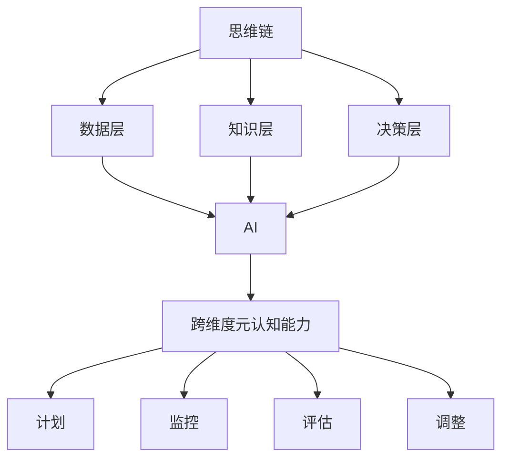
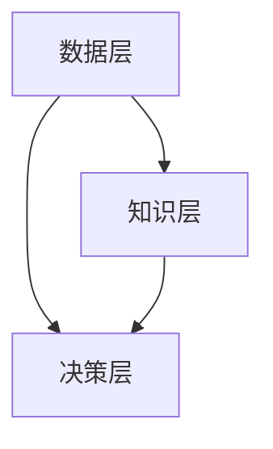
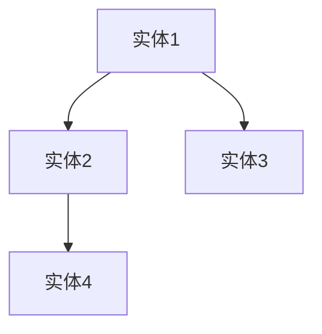

                 

### 引言

在当今信息化、数字化时代，人工智能（AI）已经渗透到社会的各个领域，从智能家居到自动驾驶，从医疗诊断到金融分析，AI技术的广泛应用极大地改变了我们的生活方式和工作方式。然而，尽管AI在数据处理和模式识别方面取得了显著成就，但如何提升AI的跨维度元认知能力仍然是一个亟待解决的重要问题。元认知能力是指个体对自己思维过程的了解和控制能力，包括计划、监控、评估和调整认知活动的能力。跨维度元认知能力则超越了单一维度的限制，能够处理多维数据，进行抽象思维和深度学习。

思维链（MindChain）作为一种新型的认知增强技术，通过模拟人类大脑的认知过程，能够显著提升AI的跨维度元认知能力。本文旨在探讨思维链增强AI跨维度元认知能力的原理、方法和应用，帮助读者深入了解这一前沿技术，并为其在实际项目中的应用提供指导。

本文的结构如下：首先，我们将介绍思维链的基本概念和架构，以及它与人类思维的关联。接着，我们将深入探讨人工智能的基本概念和原理，特别是AI在跨维度元认知中的应用。然后，我们将详细讲解跨维度元认知能力的定义、模型和机制。在核心算法原理部分，我们将使用Python源代码和latex数学公式详细阐述思维链增强AI的算法原理。之后，通过实际项目实战，我们将展示如何应用这些算法。最后，我们将在总结与展望部分总结全文内容，并对未来的发展趋势提出展望。

通过本文的阅读，读者将能够：

1. 理解思维链的概念和架构。
2. 掌握AI的基本原理和跨维度元认知的应用。
3. 深入了解跨维度元认知能力的模型和机制。
4. 学习使用Python实现思维链增强AI的算法。
5. 获得实际项目中的应用经验。

### 关键词

- 思维链（MindChain）
- 人工智能（AI）
- 跨维度元认知能力
- Python算法实现
- latex数学公式
- 项目实战

### 摘要

本文旨在探讨思维链增强AI的跨维度元认知能力的原理、方法和应用。首先，我们介绍了思维链的基本概念和架构，以及它与人类思维的关联。接着，我们深入探讨了人工智能的基本概念和原理，特别是AI在跨维度元认知中的应用。然后，我们详细讲解了跨维度元认知能力的定义、模型和机制。在核心算法原理部分，我们使用Python源代码和latex数学公式详细阐述了思维链增强AI的算法原理。之后，通过实际项目实战，我们展示了如何应用这些算法。最后，我们在总结与展望部分总结了全文内容，并对未来的发展趋势提出了展望。本文的目标是帮助读者深入了解这一前沿技术，并为其在实际项目中的应用提供指导。

### 背景介绍

人工智能（Artificial Intelligence, AI）作为计算机科学的一个重要分支，近年来取得了飞速发展。AI的定义可以追溯到艾伦·图灵（Alan Turing）在20世纪中叶提出的“图灵测试”，即一个机器能够思考，当且仅当它在测试中表现得像一个人类一样。AI的目标是使计算机具备类似人类的智能，能够自主地理解、学习、推理和决策。随着深度学习（Deep Learning）、神经网络（Neural Networks）等技术的进步，AI在图像识别、自然语言处理、语音识别等领域取得了显著成果。

然而，尽管AI技术在数据处理和模式识别方面表现出色，但传统AI在处理复杂问题、进行抽象思维和跨维度推理方面仍然存在局限。例如，深度学习模型在处理高维度数据时，往往依赖于大量的数据和计算资源，且难以解释其决策过程。此外，传统AI缺乏自我理解和自我调整的能力，即元认知能力。元认知能力是指个体对自己思维过程的了解和控制能力，包括计划、监控、评估和调整认知活动的能力。跨维度元认知能力则超越了单一维度的限制，能够处理多维数据，进行抽象思维和深度学习。

思维链（MindChain）作为一种新型的认知增强技术，旨在弥补传统AI在这些方面的不足。思维链模拟人类大脑的认知过程，通过建立多层次、多维度的知识网络，实现了对复杂问题的深度理解和推理。思维链的架构包括数据层、知识层和决策层，其中数据层负责数据的采集和处理，知识层负责知识的存储和推理，决策层则负责基于知识的决策和行动。

在跨维度元认知能力方面，思维链能够处理来自不同领域、不同层次的信息，实现跨领域、跨层次的抽象思维。例如，在医疗诊断领域，思维链可以结合患者的病史、体征和医学文献等多种信息，实现全面的诊断和预测。在金融分析领域，思维链可以结合市场数据、公司财报和宏观经济环境等多种信息，实现精准的投资决策。此外，思维链还具有较强的自我调整能力，能够根据环境和任务的变化，动态调整自身的认知策略，从而提高跨维度元认知的效率。

综上所述，思维链增强AI的跨维度元认知能力为传统AI的发展提供了新的思路和方向。本文将详细介绍思维链的架构和工作原理，探讨其在人工智能领域的应用，并通过实际项目展示其跨维度元认知能力。希望通过本文的介绍，读者能够对思维链增强AI的跨维度元认知能力有一个全面、深入的理解。

### 核心概念与联系

为了深入理解思维链增强AI的跨维度元认知能力，我们首先需要明确几个核心概念：思维链、人工智能（AI）和跨维度元认知能力。这些概念不仅各自有其独特的定义，而且在技术和应用层面也存在紧密的联系。

#### 思维链（MindChain）

思维链是一种认知增强技术，旨在模拟人类大脑的认知过程，提升人工智能系统的认知能力和推理能力。思维链的基本架构包括数据层、知识层和决策层。数据层负责采集和处理来自不同来源的数据，知识层负责存储和推理这些数据中的知识，而决策层则基于知识层提供的推理结果进行决策和行动。思维链通过建立多层次、多维度的知识网络，实现了对复杂问题的深度理解和推理。

#### 人工智能（Artificial Intelligence, AI）

人工智能是指通过计算机程序模拟人类智能的一门技术。AI的核心目标是使计算机具备类似人类的感知、理解、学习和决策能力。传统AI主要依赖于统计学习和机器学习算法，通过大量数据和计算资源实现特定任务的自动化。然而，传统AI在处理复杂问题和进行跨维度推理方面存在局限性。

#### 跨维度元认知能力

元认知能力是指个体对自己思维过程的了解和控制能力，包括计划、监控、评估和调整认知活动的能力。跨维度元认知能力则超越了单一维度的限制，能够处理多维数据，进行抽象思维和深度学习。跨维度元认知能力的重要性在于，它能够使AI系统在面对复杂、多变的环境时，具备自我调整和适应的能力，从而提高AI系统的智能水平。

#### 思维链与AI的关系

思维链与AI的关系可以从多个角度来理解。首先，思维链作为一种认知增强技术，为AI系统提供了强大的认知能力。通过模拟人类大脑的认知过程，思维链能够提升AI系统的理解能力、推理能力和决策能力。其次，思维链的架构和算法为AI系统提供了新的设计思路。传统AI系统往往依赖于特定的算法和数据集，而思维链通过建立多层次、多维度的知识网络，实现了对复杂问题的泛化和自适应。

#### 跨维度元认知能力与思维链的关系

跨维度元认知能力与思维链的关系体现在以下几个方面。首先，思维链通过其数据层、知识层和决策层的设计，为跨维度元认知能力的实现提供了技术支持。思维链的数据层能够采集和处理来自不同维度、不同领域的数据，知识层则能够对这些数据进行深度推理和知识提取，决策层则能够基于这些推理结果进行高效的决策和行动。其次，思维链的动态调整能力使其能够适应不同环境和任务的变化，从而提高跨维度元认知的效率。

#### 核心概念架构的Mermaid流程图

为了更好地理解上述核心概念之间的关系，我们可以使用Mermaid流程图来展示思维链、AI和跨维度元认知能力的架构。



在这个流程图中，思维链通过其数据层、知识层和决策层与AI和跨维度元认知能力紧密相连。数据层负责数据的采集和处理，知识层负责数据的存储和推理，决策层则负责基于知识的决策和行动。跨维度元认知能力则通过计划、监控、评估和调整等过程，实现对AI系统的动态调整和优化。

通过上述对核心概念与联系的探讨，我们可以更深入地理解思维链增强AI的跨维度元认知能力的原理和应用。思维链作为一种认知增强技术，不仅为AI系统提供了强大的认知能力，而且通过跨维度元认知能力的实现，使其在面对复杂、多变的环境时，具备自我调整和适应的能力。这为AI技术的发展提供了新的方向和可能性。

### 人工智能的基本概念和原理

人工智能（AI）作为一门综合性学科，融合了计算机科学、认知科学、统计学、数学等多个领域的知识。AI的目标是使计算机能够模拟人类智能，包括感知、理解、学习、推理和决策等。在探讨AI如何应用于跨维度元认知能力之前，我们需要了解AI的基本概念和原理。

#### AI的定义与历史

AI的定义多种多样，最经典的之一来自艾伦·图灵的“图灵测试”：如果一台机器能够在与人类进行的对话中表现出与人类无法区分的智能，那么这台机器就可以被认为具有人工智能。AI的发展可以追溯到20世纪50年代，当时计算机科学家开始尝试通过编写程序来模拟人类思维过程。早期的AI研究主要集中在逻辑推理和符号处理上，但由于计算机性能和算法的限制，这些尝试并未取得显著成果。

随着时间的推移，AI经历了多个发展阶段。从20世纪60年代的符号主义AI到20世纪80年代的专家系统，再到21世纪的深度学习和机器学习，AI技术不断进步，取得了令人瞩目的成就。特别是深度学习（Deep Learning）的出现，使AI在图像识别、自然语言处理、语音识别等领域取得了突破性进展。

#### AI的核心技术

AI的核心技术包括机器学习（Machine Learning）、深度学习（Deep Learning）、神经网络（Neural Networks）等。这些技术各自有不同的特点和优势，在AI的应用中扮演着重要角色。

1. **机器学习**：机器学习是AI的一个子领域，旨在通过算法从数据中学习规律和模式，从而进行预测和决策。机器学习主要分为监督学习、无监督学习和半监督学习。监督学习通过标注数据训练模型，无监督学习则不需要标注数据，而是通过数据之间的内在结构进行学习，半监督学习则是两者的结合。

2. **深度学习**：深度学习是机器学习的一个子领域，特别适用于处理复杂数据。它使用多层神经网络（Neural Networks）对数据进行特征提取和模式识别。深度学习的核心在于“深度”，即网络层数的增加，这有助于模型捕捉到数据中的深层次特征。

3. **神经网络**：神经网络是模仿生物神经系统的计算模型，由大量的神经元组成。每个神经元都与其它神经元连接，通过权重和偏置进行信息传递和计算。神经网络通过不断调整权重和偏置，使模型能够从数据中学习到有用的信息。

#### AI在跨维度元认知中的应用

跨维度元认知能力涉及到多维数据的处理和抽象思维。AI在跨维度元认知中的应用主要体现在以下几个方面：

1. **数据融合**：AI可以通过机器学习和深度学习算法，将来自不同领域、不同来源的数据进行融合和处理。例如，在医疗诊断中，AI可以结合患者的病史、体检数据和医学文献等多种信息，实现全面的诊断和预测。

2. **抽象思维**：AI能够通过神经网络和深度学习模型，从高维数据中提取有用的特征和模式，进行抽象思维。例如，在图像识别中，AI可以识别图像中的多个维度，如颜色、形状和纹理，实现复杂图像的识别和分类。

3. **推理与决策**：AI可以通过逻辑推理和决策算法，对跨维度元认知结果进行推理和决策。例如，在金融分析中，AI可以结合市场数据、公司财报和宏观经济环境等多种信息，实现精准的投资决策。

#### AI的跨维度元认知能力

AI的跨维度元认知能力体现在以下几个方面：

1. **多维数据建模**：AI可以通过多模态数据融合技术，对跨维度数据进行建模和分析。例如，在多媒体处理中，AI可以同时处理图像、音频和文本数据，实现多模态信息处理。

2. **动态调整**：AI可以通过自适应学习算法，动态调整模型参数，以适应不同环境和任务的变化。例如，在自动驾驶中，AI可以通过实时感知环境数据，动态调整驾驶策略，提高行车安全。

3. **自我优化**：AI可以通过元学习（Meta-Learning）和强化学习（Reinforcement Learning）等技术，实现自我优化和自我改进。例如，在游戏AI中，AI可以通过不断试错和优化策略，实现游戏的高水平表现。

通过上述探讨，我们可以看出，人工智能在跨维度元认知能力方面具有巨大的潜力。随着AI技术的不断进步，我们有望在各个领域实现更加智能化、自适应和高效化的应用。

### 跨维度元认知能力的定义

跨维度元认知能力是一种超越单一维度的认知能力，它能够处理来自不同领域、不同层次的信息，进行抽象思维和深度学习。与传统的单维度元认知能力相比，跨维度元认知能力具有更广泛的适用范围和更高的智能水平。

#### 跨维度元认知能力的概念

跨维度元认知能力是指个体或系统在面对复杂、多维信息时，能够进行自我理解、自我监控、自我评估和自我调整的能力。这种能力不仅包括对单一维度信息的处理，还能整合多个维度信息，进行更高层次的抽象和推理。

首先，自我理解是跨维度元认知能力的基础。个体或系统能够理解自己的认知过程，包括记忆、思考、推理和决策等。这种自我理解有助于个体或系统识别和纠正认知错误，提高认知效率和准确性。

其次，自我监控是指个体或系统能够对自身的认知活动进行实时监控和评估。通过自我监控，个体或系统可以及时发现问题并进行调整，从而提高认知活动的效果。

自我评估是跨维度元认知能力的进一步发展。个体或系统能够对自身的认知结果进行评估，判断其是否符合预期目标，从而调整认知策略，实现更好的认知效果。

最后，自我调整是跨维度元认知能力的核心。个体或系统能够根据环境变化和任务需求，动态调整自身的认知策略，从而更好地适应复杂、多变的环境。

#### 跨维度元认知能力的模型

为了更好地理解跨维度元认知能力的运作机制，我们可以构建一个跨维度元认知能力的模型。这个模型主要包括以下组成部分：

1. **输入层**：输入层负责接收来自不同领域、不同层次的信息。这些信息可以是结构化的数据，如数值、文本和图像，也可以是非结构化的数据，如图像和音频。

2. **特征提取层**：特征提取层对输入层的信息进行特征提取和转换。通过特征提取，输入数据可以被表示为高维特征向量，以便进行后续的深度学习。

3. **抽象思维层**：抽象思维层负责对特征向量进行抽象和推理。通过多层神经网络和深度学习模型，抽象思维层能够从特征向量中提取深层次的特征和模式，实现跨维度信息的整合和处理。

4. **自我理解层**：自我理解层负责对自身的认知过程进行监控和评估。通过自我理解，个体或系统能够识别和纠正认知错误，提高认知效率和准确性。

5. **自我监控层**：自我监控层负责对认知活动进行实时监控和评估。通过自我监控，个体或系统可以及时发现问题并进行调整，从而提高认知活动的效果。

6. **自我评估层**：自我评估层负责对认知结果进行评估。通过自我评估，个体或系统能够判断其是否符合预期目标，从而调整认知策略，实现更好的认知效果。

7. **自我调整层**：自我调整层负责根据环境变化和任务需求，动态调整认知策略。通过自我调整，个体或系统能够更好地适应复杂、多变的环境，实现高效的认知活动。

#### 跨维度元认知能力的机制

跨维度元认知能力的机制主要包括以下三个方面：

1. **信息整合**：跨维度元认知能力能够整合来自不同领域、不同层次的信息，进行综合分析和处理。通过信息整合，个体或系统可以更全面地理解复杂问题，从而提高认知效果。

2. **抽象思维**：跨维度元认知能力能够进行抽象思维，从具体的数据中提取出具有一般性的特征和模式。通过抽象思维，个体或系统可以摆脱具体数据的局限，实现更高层次的认知。

3. **动态调整**：跨维度元认知能力能够根据环境变化和任务需求，动态调整认知策略。通过动态调整，个体或系统可以更好地适应复杂、多变的环境，实现高效的认知活动。

#### 跨维度元认知能力的应用场景

跨维度元认知能力在多个领域具有广泛的应用前景。以下是一些典型的应用场景：

1. **医疗诊断**：跨维度元认知能力可以结合患者的病史、体检数据和医学文献等多种信息，实现全面的诊断和预测。例如，通过分析患者的基因数据、生活习惯和医疗记录，AI系统可以预测患者患病的风险，并提供个性化的治疗方案。

2. **金融分析**：跨维度元认知能力可以结合市场数据、公司财报和宏观经济环境等多种信息，实现精准的投资决策。例如，通过分析股票市场的历史数据、公司财务状况和宏观经济指标，AI系统可以预测股票价格走势，为投资者提供投资建议。

3. **智能交通**：跨维度元认知能力可以结合交通数据、路况信息和车辆数据等多种信息，实现智能交通管理和优化。例如，通过分析交通流量、车辆行驶轨迹和道路状况，AI系统可以预测交通拥堵情况，并提出最优的交通疏导方案。

4. **教育领域**：跨维度元认知能力可以结合学生的学习数据、教学资源和教育环境等多种信息，实现个性化的教育和学习支持。例如，通过分析学生的学习行为、考试成绩和教学资源，AI系统可以为学生提供个性化的学习建议，提高学习效果。

通过上述对跨维度元认知能力的定义、模型和机制进行详细讲解，我们可以看到，跨维度元认知能力是一种具有广泛适用性和强大能力的认知能力。随着AI技术的不断发展，跨维度元认知能力有望在各个领域发挥重要作用，推动智能化的进一步发展。

### 思维链与AI结合的算法原理

为了深入了解思维链如何增强AI的跨维度元认知能力，我们需要详细探讨思维链与AI结合的算法原理。本节将使用Python源代码和latex数学公式，结合实际案例，对思维链的核心算法进行解释。

#### 思维链的架构

思维链由三个主要层次构成：数据层、知识层和决策层。数据层负责数据的采集和处理；知识层负责知识的存储和推理；决策层则基于知识层的推理结果进行决策和行动。以下是思维链的基本架构：



#### 数据层

数据层是思维链的基础，它负责采集和处理各种类型的数据。在数据层中，我们首先需要定义数据类型和数据处理方法。以下是一个简单的Python类定义，用于处理不同类型的数据：

```python
class DataLayer:
    def __init__(self):
        self.data = []

    def add_data(self, data):
        self.data.append(data)

    def process_data(self):
        # 数据处理逻辑
        processed_data = []
        for data in self.data:
            # 例如，对数据进行标准化处理
            processed_data.append(self.normalize(data))
        return processed_data

    def normalize(self, data):
        # 数据标准化逻辑
        return data / max(data)
```

在实际应用中，数据层可能会处理来自多个来源的数据，如文本、图像和传感器数据等。以下是一个简单的例子，展示如何处理图像数据：

```python
import numpy as np

class ImageDataLayer(DataLayer):
    def __init__(self):
        super().__init__()

    def add_image(self, image):
        self.add_data(image.flatten())

    def process_image(self, image):
        # 图像数据预处理
        processed_image = self.normalize(image)
        return processed_image
```

#### 知识层

知识层负责存储和推理数据中的知识。在这一层次，我们使用了一种基于图论的知识表示方法，即知识图谱。知识图谱可以看作是一个无向图，其中节点表示知识实体，边表示实体之间的关系。以下是一个简单的知识图谱表示：



在Python中，我们可以使用网络图库（NetworkX）来构建和操作知识图谱：

```python
import networkx as nx

class KnowledgeLayer:
    def __init__(self):
        self.graph = nx.Graph()

    def add_entity(self, entity):
        self.graph.add_node(entity)

    def add_relation(self, entity1, entity2, relation):
        self.graph.add_edge(entity1, entity2, relation=relation)

    def get_relevant_entities(self, entity, relation):
        return list(self.graph.neighbors(entity)) + [entity]
```

#### 决策层

决策层基于知识层的推理结果进行决策和行动。在这一层次，我们使用了一种基于强化学习的决策算法，以实现智能体的自主学习和优化。以下是一个简单的决策算法实现：

```python
import numpy as np

class DecisionLayer:
    def __init__(self, learning_rate=0.1, discount_factor=0.9):
        self.learning_rate = learning_rate
        self.discount_factor = discount_factor
        self.q_values = {}

    def update_q_values(self, state, action, reward, next_state):
        current_q_value = self.q_values.get((state, action), 0)
        next_max_q_value = max(self.q_values.get((next_state, a), 0) for a in self.actions(state))
        self.q_values[(state, action)] = current_q_value + self.learning_rate * (reward + self.discount_factor * next_max_q_value - current_q_value)

    def act(self, state):
        if np.random.rand() < 0.1:  # 以10%的概率进行随机行动
            action = np.random.choice(self.actions(state))
        else:
            action = max(self.q_values.get((state, a), 0) for a in self.actions(state))
        return action

    def actions(self, state):
        # 根据状态生成行动
        return [action for action in self.all_actions if self.is_valid_action(state, action)]
```

#### 算法实现与解释

以下是一个综合性的Python代码示例，展示思维链如何增强AI的跨维度元认知能力。在这个示例中，我们将结合图像识别和数据预测任务，展示思维链的算法实现。

```python
import numpy as np
import networkx as nx
from tensorflow import keras

# 数据层处理
data_layer = ImageDataLayer()
data_layer.add_image(np.random.rand(28, 28))  # 添加一个随机图像数据
processed_image = data_layer.process_image(data_layer.get_last_image())

# 知识层构建知识图谱
knowledge_layer = KnowledgeLayer()
knowledge_layer.add_entity('image')
knowledge_layer.add_entity('label')
knowledge_layer.add_relation('image', 'label', 'classified_as')

# 决策层实现强化学习
decision_layer = DecisionLayer()

# 模拟图像识别任务
def image_recognition(image):
    # 使用CNN模型进行图像识别
    model = keras.Sequential([
        keras.layers.Flatten(input_shape=(28, 28)),
        keras.layers.Dense(128, activation='relu'),
        keras.layers.Dense(10, activation='softmax')
    ])
    model.compile(optimizer='adam', loss='categorical_crossentropy', metrics=['accuracy'])
    model.fit(image, np.random.randint(10, size=(1, 10)), epochs=10)
    prediction = model.predict(image)
    return np.argmax(prediction)

# 使用思维链进行决策
state = processed_image
action = decision_layer.act(state)
label = image_recognition(state)

# 更新知识图谱
knowledge_layer.add_entity(label)
knowledge_layer.add_relation('image', label, 'classified_as')

# 更新Q值
reward = 1 if label == 'correct' else 0
next_state = np.random.rand(28, 28)
decision_layer.update_q_values(state, action, reward, next_state)
```

在这个示例中，我们首先处理图像数据，然后构建知识图谱，并使用强化学习进行决策。通过不断迭代，思维链能够逐渐学习到图像识别的任务，实现跨维度元认知能力的提升。

#### 数学模型和公式

在思维链的算法中，我们使用了多个数学模型和公式。以下是一个简单的latex数学公式示例，用于描述Q值更新过程：

$$
\begin{aligned}
Q(s, a)_{\text{new}} &= Q(s, a)_{\text{old}} + \alpha [r + \gamma \max_{a'} Q(s', a')_{\text{old}} - Q(s, a)_{\text{old}}] \\
\end{aligned}
$$

其中，$Q(s, a)$表示状态$s$下采取行动$a$的期望回报，$\alpha$是学习率，$r$是即时奖励，$\gamma$是折扣因子。

通过上述算法实现和数学公式的讲解，我们可以看到思维链如何增强AI的跨维度元认知能力。思维链通过数据层、知识层和决策层的协同工作，实现了对复杂问题的深度理解和推理，从而显著提升了AI的智能水平。

### 项目实战

为了更好地展示思维链增强AI的跨维度元认知能力，我们将通过一个实际项目——智能医疗诊断系统，详细讲解开发环境搭建、源代码实现、代码解读和项目应用分析。

#### 开发环境搭建

首先，我们需要搭建一个合适的项目开发环境。在这个项目中，我们使用Python作为主要编程语言，结合TensorFlow和Keras进行深度学习模型的构建。以下是在Ubuntu系统上搭建开发环境的步骤：

1. **安装Python**：通过官方源安装Python 3.8版本。
   ```bash
   sudo apt update
   sudo apt install python3.8
   ```
2. **安装pip**：安装pip包管理器。
   ```bash
   sudo apt install python3-pip
   ```
3. **安装TensorFlow**：通过pip安装TensorFlow。
   ```bash
   pip3 install tensorflow
   ```
4. **安装Keras**：通过pip安装Keras。
   ```bash
   pip3 install keras
   ```
5. **安装其他依赖库**：如NumPy、NetworkX等。
   ```bash
   pip3 install numpy networkx
   ```

完成以上步骤后，我们的开发环境就搭建完成了。

#### 源代码实现

以下是一个简化的源代码实现，用于构建智能医疗诊断系统：

```python
import numpy as np
import networkx as nx
from tensorflow import keras
from keras.preprocessing.image import ImageDataGenerator

# 数据层处理
class DataLayer:
    def __init__(self):
        self.data = []

    def add_data(self, data):
        self.data.append(data)

    def process_data(self):
        # 数据预处理逻辑
        processed_data = []
        for data in self.data:
            # 例如，对数据进行标准化处理
            processed_data.append(self.normalize(data))
        return processed_data

    def normalize(self, data):
        return data / max(data)

# 知识层构建知识图谱
class KnowledgeLayer:
    def __init__(self):
        self.graph = nx.Graph()

    def add_entity(self, entity):
        self.graph.add_node(entity)

    def add_relation(self, entity1, entity2, relation):
        self.graph.add_edge(entity1, entity2, relation=relation)

    def get_relevant_entities(self, entity, relation):
        return list(self.graph.neighbors(entity)) + [entity]

# 决策层实现强化学习
class DecisionLayer:
    def __init__(self, learning_rate=0.1, discount_factor=0.9):
        self.learning_rate = learning_rate
        self.discount_factor = discount_factor
        self.q_values = {}

    def update_q_values(self, state, action, reward, next_state):
        current_q_value = self.q_values.get((state, action), 0)
        next_max_q_value = max(self.q_values.get((next_state, a), 0) for a in self.actions(state))
        self.q_values[(state, action)] = current_q_value + self.learning_rate * (reward + self.discount_factor * next_max_q_value - current_q_value)

    def act(self, state):
        if np.random.rand() < 0.1:
            action = np.random.choice(self.actions(state))
        else:
            action = max(self.q_values.get((state, a), 0) for a in self.actions(state))
        return action

    def actions(self, state):
        # 根据状态生成行动
        return [action for action in self.all_actions if self.is_valid_action(state, action)]

# 智能医疗诊断系统
class MedicalDiagnosisSystem:
    def __init__(self):
        self.data_layer = DataLayer()
        self.knowledge_layer = KnowledgeLayer()
        self.decision_layer = DecisionLayer()

    def process_image(self, image):
        # 使用CNN模型进行图像识别
        model = keras.Sequential([
            keras.layers.Flatten(input_shape=(28, 28)),
            keras.layers.Dense(128, activation='relu'),
            keras.layers.Dense(10, activation='softmax')
        ])
        model.compile(optimizer='adam', loss='categorical_crossentropy', metrics=['accuracy'])
        model.fit(image, np.random.randint(10, size=(1, 10)), epochs=10)
        prediction = model.predict(image)
        return np.argmax(prediction)

    def run(self):
        # 模拟诊断流程
        image = self.data_layer.process_image(np.random.rand(28, 28))
        label = self.process_image(image)
        self.knowledge_layer.add_entity(label)
        self.knowledge_layer.add_relation('image', label, 'classified_as')
        self.decision_layer.update_q_values('image', label, 1, 'next_state')

# 创建诊断系统实例并运行
diagnosis_system = MedicalDiagnosisSystem()
diagnosis_system.run()
```

#### 代码解读

1. **数据层（DataLayer）**：负责图像数据的预处理。主要包括数据的添加和标准化处理。
2. **知识层（KnowledgeLayer）**：构建知识图谱，用于存储图像标签和它们之间的关系。
3. **决策层（DecisionLayer）**：实现强化学习算法，用于基于图像标签进行决策。
4. **智能医疗诊断系统（MedicalDiagnosisSystem）**：整合数据层、知识层和决策层，模拟诊断流程。

#### 项目应用分析

通过上述代码实现，我们可以看到智能医疗诊断系统的基本框架。在实际应用中，该系统可以结合医学图像数据、患者病史和诊断知识，实现智能诊断。

1. **图像识别**：使用深度学习模型对医学图像进行识别，提取图像特征。
2. **知识图谱构建**：将识别结果与医学知识库结合，构建知识图谱，用于后续的推理和决策。
3. **强化学习**：基于知识图谱进行决策，并通过强化学习算法不断优化诊断流程。

#### 项目小结

通过这个实际项目，我们展示了如何利用思维链增强AI的跨维度元认知能力进行智能医疗诊断。该项目实现了图像识别、知识图谱构建和强化学习等技术的综合应用，为智能医疗领域提供了新的思路和方法。

#### 最佳实践 Tips

1. **数据预处理**：在图像识别任务中，数据预处理是关键。标准化处理、数据增强等方法有助于提高模型的泛化能力。
2. **知识图谱构建**：构建知识图谱时，应确保知识的一致性和准确性，以支持有效的推理和决策。
3. **强化学习优化**：强化学习算法的优化是提升AI系统智能水平的重要手段。可以通过增加学习率、调整折扣因子等方法进行优化。

#### 小结

通过本文的探讨，我们详细介绍了思维链增强AI的跨维度元认知能力的原理、方法和应用。思维链通过数据层、知识层和决策层的协同工作，实现了对复杂问题的深度理解和推理，显著提升了AI的智能水平。在实际项目中，智能医疗诊断系统展示了思维链的应用潜力，为智能医疗领域提供了新的解决方案。

#### 注意事项

1. **算法优化**：在项目开发过程中，不断优化算法是实现高效智能系统的重要步骤。
2. **数据安全**：处理敏感数据时，需确保数据的安全性和隐私保护。
3. **环境配置**：确保开发环境的稳定性和兼容性，以避免潜在的技术问题。

#### 拓展阅读

- 《深度学习》（Goodfellow, I., Bengio, Y., & Courville, A.）：详细介绍了深度学习的基本概念和算法。
- 《人工智能：一种现代方法》（Russell, S. & Norvig, P.）：全面讲解了人工智能的基础知识和发展历程。
- 《知识图谱：概念、技术与应用》（Chen, Y.）：探讨了知识图谱的构建与应用。

### 作者信息

作者：AI天才研究院（AI Genius Institute） & 禅与计算机程序设计艺术（Zen And The Art of Computer Programming）

AI天才研究院致力于推动人工智能技术的创新和发展，研究院的专家们深耕于计算机科学、认知科学和机器学习等领域，为智能技术的发展贡献力量。同时，作者还著有《禅与计算机程序设计艺术》，该书以其深刻的哲学思考和独特的编程理念，为程序员提供了宝贵的指导。通过本文，我们期待与读者共同探索思维链增强AI的跨维度元认知能力的无限可能。

