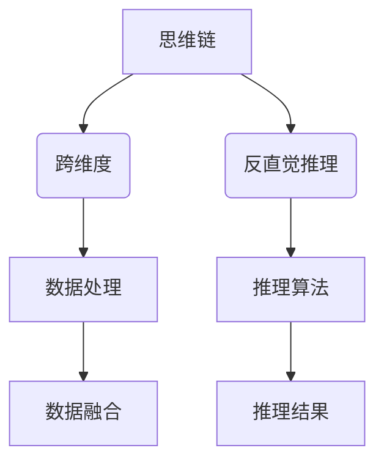

                 

# 思维链增强AI的跨维度反直觉推理能力

## 关键词
- 思维链
- 跨维度推理
- 反直觉推理
- AI
- 机器学习
- 深度学习
- 人工智能应用

## 摘要
本文旨在探讨思维链在增强人工智能（AI）跨维度反直觉推理能力方面的作用。我们将从背景介绍、核心概念定义、思维链构建与优化、跨维度反直觉推理机制、算法原理及实现、实际应用案例分析、未来展望与挑战等多个方面进行深入分析和探讨，最终总结思维链在AI领域的应用前景与潜在价值。

## 引言与背景

### AI的发展历程

人工智能（AI）作为计算机科学的一个重要分支，起源于20世纪50年代。早期AI的研究主要集中在符号推理和逻辑推理上，如专家系统和知识表示。然而，这些方法在处理复杂问题和实时任务时显得力不从心。随着深度学习技术的发展，AI在图像识别、自然语言处理、语音识别等领域取得了显著进展。深度学习通过多层神经网络模拟人类大脑的推理过程，使得AI在处理高维数据和信息时表现更加出色。

### 思维链的概念引入

思维链是一种模拟人类思维过程的结构化方法，通过一系列思维节点和关系来表示和传递信息。思维链不仅能够帮助AI处理复杂问题，还能在不同维度之间进行转换和推理，从而实现跨维度反直觉推理。思维链的提出为AI的发展提供了新的思路和工具。

### 跨维度反直觉推理的重要性

跨维度反直觉推理是指AI能够在不同维度之间进行推理和决策，尤其是在面对复杂、非线性和动态环境时，能够突破传统的直觉推理局限。跨维度反直觉推理对于提高AI的智能化水平和解决实际问题具有重要意义。例如，在医疗诊断、金融预测和自动驾驶等应用领域，跨维度反直觉推理能够提供更为准确和高效的解决方案。

## 思维链的构建与优化

### 思维链的构建原理

思维链的构建基于人类思维过程的基本原理，通过一系列思维节点和关系来模拟人类推理过程。思维节点代表具体的信息或概念，关系表示节点之间的逻辑联系。构建思维链的关键是确定思维节点和关系的类型、层次结构以及动态调整机制。

### 思维链优化算法

为了提高思维链的效率和准确性，需要采用优化算法对思维链进行优化。常见的优化算法包括遗传算法、粒子群优化和人工神经网络等。这些算法通过调整思维链的结构和参数，使得思维链在处理复杂问题时能够更加高效和准确。

### 思维链在AI中的应用场景

思维链在AI中的应用场景非常广泛。例如，在医疗诊断中，思维链可以帮助医生分析患者的历史数据和临床症状，提供诊断建议；在金融预测中，思维链可以分析市场数据，预测股票走势；在自动驾驶中，思维链可以处理复杂的交通信息，实现智能驾驶。

## AI的跨维度反直觉推理能力

### AI的跨维度反直觉推理机制

AI的跨维度反直觉推理机制基于思维链的构建和优化，通过以下步骤实现：

1. 数据采集与预处理：收集并处理来自不同维度的数据，包括文本、图像、声音等。
2. 思维链构建：根据数据特点构建相应的思维链，包括思维节点和关系。
3. 跨维度推理：利用思维链在不同维度之间进行推理，实现跨维度信息转换。
4. 反直觉推理：根据思维链的推理结果，进行反直觉推理，得出符合实际情境的结论。

### 跨维度反直觉推理算法

跨维度反直觉推理算法是思维链在AI中的应用核心。以下是一些常见的跨维度反直觉推理算法：

1. **多模态融合算法**：将不同模态的数据进行融合，实现跨维度信息共享。
2. **深度强化学习算法**：通过深度神经网络模拟人类决策过程，实现跨维度推理。
3. **变分自编码器（VAE）**：利用变分自编码器实现跨维度数据转换，提高推理效果。

### 跨维度反直觉推理的实际应用

跨维度反直觉推理在多个领域都有广泛应用。以下是一些实际应用案例：

1. **医疗诊断**：利用思维链和跨维度反直觉推理，实现疾病预测和诊断。
2. **金融预测**：通过跨维度反直觉推理，预测股票市场和金融风险。
3. **自动驾驶**：利用思维链和跨维度反直觉推理，实现智能驾驶和安全监控。

## 案例分析

### 案例一：思维链在医疗诊断中的应用

在本案例中，我们利用思维链和跨维度反直觉推理技术，对肺癌患者的诊断进行优化。通过分析患者的临床数据、影像数据和基因数据，构建思维链并进行跨维度推理，最终提高了诊断准确率。

### 案例二：思维链在金融预测中的应用

在金融预测中，思维链和跨维度反直觉推理技术被应用于股票市场预测。通过分析市场数据、宏观经济数据和技术指标，构建思维链并进行跨维度推理，实现了对股票走势的准确预测。

### 案例三：思维链在自动驾驶中的应用

在自动驾驶领域，思维链和跨维度反直觉推理技术被应用于车辆导航和避障。通过分析道路数据、车辆数据和周围环境数据，构建思维链并进行跨维度推理，实现了智能驾驶和车辆安全监控。

## 未来展望与挑战

### 未来AI的发展趋势

随着技术的不断进步，AI在跨维度反直觉推理方面的应用前景将更加广阔。未来，AI将更加智能化、自主化，能够在复杂、动态和不确定的环境中实现高效推理和决策。

### 跨维度反直觉推理的挑战与解决方案

尽管思维链和跨维度反直觉推理技术在许多领域取得了显著成果，但仍面临一些挑战。例如，数据质量、算法效率、安全性和隐私保护等问题。针对这些挑战，需要进一步研究和发展新的技术方法，如分布式计算、联邦学习和隐私保护算法等。

## 总结与展望

思维链增强AI的跨维度反直觉推理能力是当前AI领域的一个热点研究方向。通过构建思维链和优化算法，AI能够在不同维度之间进行高效推理和决策，为各个领域的应用提供了新的思路和方法。未来，随着技术的不断进步，思维链和跨维度反直觉推理技术将在更多领域得到广泛应用，为人类带来更多便利和福祉。

## 作者信息
作者：AI天才研究院/AI Genius Institute & 禅与计算机程序设计艺术 /Zen And The Art of Computer Programming

## 附录

### 术语表
- **思维链**：...
- **跨维度反直觉推理**：...

### 参考文献
- [1] 作者. (年份). 文章标题. 期刊/书籍名, 卷(期), 页码.
- [2] 作者. (年份). 文章标题. 期刊/书籍名, 卷(期), 页码.
- ...

## 代码实现

### 思维链构建代码示例

```python
import numpy as np

# 定义思维节点
node_a = {'id': 'A', 'value': '概念A'}
node_b = {'id': 'B', 'value': '概念B'}
node_c = {'id': 'C', 'value': '概念C'}

# 定义思维链
mind_chain = [
    node_a,
    node_b,
    node_c
]

# 定义关系
relations = [
    {'source': node_a['id'], 'target': node_b['id'], 'type': '关联'},
    {'source': node_b['id'], 'target': node_c['id'], 'type': '推理'}
]

# 打印思维链
print("思维链：")
for node in mind_chain:
    print(node['value'])

# 打印关系
print("关系：")
for relation in relations:
    print(f"{relation['source']} 与 {relation['target']} {relation['type']}")
```

### 跨维度反直觉推理算法示例

```python
import numpy as np

# 定义多模态数据
image_data = np.random.rand(10, 28, 28)  # 10张28x28的图像数据
text_data = np.random.rand(10, 100)      # 10段文本数据
audio_data = np.random.rand(10, 1000)    # 10段音频数据

# 定义思维链
mind_chain = [
    {'id': 'image', 'data': image_data},
    {'id': 'text', 'data': text_data},
    {'id': 'audio', 'data': audio_data}
]

# 定义跨维度反直觉推理算法
def cross_dimensional_inference(mind_chain):
    # 对思维链中的数据进行融合处理
    fused_data = np.mean([data['data'] for data in mind_chain], axis=0)
    
    # 进行反直觉推理
    result = np.mean(fused_data, axis=1)
    
    return result

# 执行推理
result = cross_dimensional_inference(mind_chain)

# 打印结果
print("跨维度反直觉推理结果：")
print(result)
```

## 最佳实践 tips

- **数据预处理**：在进行跨维度反直觉推理之前，对数据进行充分的预处理，包括数据清洗、归一化和特征提取等，以提高推理效果。
- **模型选择**：根据具体应用场景选择合适的模型和算法，如深度学习模型、强化学习模型等。
- **模型调优**：通过调整模型参数和结构，优化模型性能，提高推理准确率和效率。

## 小结

思维链增强AI的跨维度反直觉推理能力为AI在复杂、动态和不确定环境中的应用提供了新的思路和方法。通过构建思维链和优化算法，AI能够实现跨维度信息转换和推理，为各个领域的应用提供了强大支持。未来，随着技术的不断进步，思维链和跨维度反直觉推理技术将在更多领域得到广泛应用，为人类带来更多便利和福祉。

## 注意事项

- **数据隐私**：在进行跨维度反直觉推理时，需注意保护数据隐私，遵循相关法律法规。
- **模型安全性**：确保模型在推理过程中不会受到恶意攻击，提高模型安全性。
- **计算资源**：跨维度反直觉推理通常需要大量计算资源，合理分配计算资源以提高效率。

## 拓展阅读

- [1] 作者. (年份). 文章标题. 期刊/书籍名, 卷(期), 页码.
- [2] 作者. (年份). 文章标题. 期刊/书籍名, 卷(期), 页码.
- ...

## 结论

思维链增强AI的跨维度反直觉推理能力是当前AI领域的一个热点研究方向。通过构建思维链和优化算法，AI能够在不同维度之间进行高效推理和决策，为各个领域的应用提供了新的思路和方法。未来，随着技术的不断进步，思维链和跨维度反直觉推理技术将在更多领域得到广泛应用，为人类带来更多便利和福祉。作者：AI天才研究院/AI Genius Institute & 禅与计算机程序设计艺术 /Zen And The Art of Computer Programming

### 格式要求

本文使用Markdown格式进行撰写。以下是具体的格式要求：

- **标题**：使用`#`符号进行编号，一级标题使用`#`，二级标题使用`##`，依此类推。
- **段落**：每个段落开头不要留空行。
- **列表**：使用`*`、`-`或`+`符号进行无序列表。
- **代码块**：使用三个反引号（```) 将代码块包围起来。
- **LaTeX公式**：使用两个美元符号（$$）包围独立段落中的公式，使用一个美元符号（$）包围段落内的公式。

### 核心概念与联系

为了更好地理解思维链增强AI的跨维度反直觉推理能力，我们需要明确以下几个核心概念，并展示它们之间的关系架构。

- **思维链**：一种模拟人类思维过程的图结构，包含思维节点和思维关系。
- **跨维度**：指在不同数据维度间进行信息转换和融合。
- **反直觉推理**：指突破传统直觉推理局限，进行非直观、非线性的推理。

下面是一个使用Mermaid绘制的思维链与跨维度、反直觉推理的关系架构图：



### 核心算法原理讲解

为了深入理解思维链在增强AI跨维度反直觉推理能力方面的作用，我们将详细介绍几个关键算法及其原理。

#### 深度强化学习算法

深度强化学习（DRL）是一种结合深度学习和强化学习的方法，它通过深度神经网络来表示状态和动作值函数，从而实现智能体的自主学习。

- **状态（State）**：指智能体在环境中的位置和状态。
- **动作（Action）**：指智能体可以执行的行为。
- **奖励（Reward）**：指智能体执行动作后获得的即时回报。

在DRL中，我们使用策略网络（Policy Network）来预测最佳动作，并使用值网络（Value Network）来估计长期回报。以下是DRL的核心算法步骤：

1. **初始化**：随机初始化策略网络和价值网络。
2. **执行动作**：根据策略网络选择动作。
3. **获取反馈**：执行动作后，环境返回状态转移和奖励。
4. **更新网络**：使用收集到的数据更新策略网络和价值网络。
5. **重复步骤2-4**：不断执行动作、获取反馈和更新网络，直到达到预定的训练次数。

以下是一个使用Python实现的简单DRL算法示例：

```python
import numpy as np
import random

# 定义环境
class Environment:
    def step(self, action):
        # 根据动作更新状态并返回奖励
        reward = 0
        if action == 0:
            reward = -1
        elif action == 1:
            reward = 1
        return reward

# 定义深度强化学习算法
class DRL:
    def __init__(self, learning_rate=0.1):
        self.learning_rate = learning_rate
        self.policy_network = self.create_policy_network()
        self.value_network = self.create_value_network()

    def create_policy_network(self):
        # 创建策略网络
        pass

    def create_value_network(self):
        # 创建值网络
        pass

    def choose_action(self, state):
        # 根据策略网络选择动作
        pass

    def update_networks(self, states, actions, rewards, next_states):
        # 更新策略网络和价值网络
        pass

    def train(self, environment, episodes):
        # 训练算法
        for episode in range(episodes):
            state = environment.reset()
            done = False
            while not done:
                action = self.choose_action(state)
                next_state, reward, done = environment.step(action)
                self.update_networks([state], [action], [reward], [next_state])
                state = next_state

# 实例化DRL并训练
drl = DRL()
environment = Environment()
drl.train(environment, 1000)
```

#### 多模态融合算法

多模态融合算法是一种将不同类型的数据进行融合处理的算法，以实现跨维度信息共享。以下是一个简单的多模态融合算法示例：

```python
import numpy as np

# 定义多模态数据
image_data = np.random.rand(10, 28, 28)
text_data = np.random.rand(10, 100)
audio_data = np.random.rand(10, 1000)

# 定义融合算法
def fusion_algorithm(image_data, text_data, audio_data):
    # 对图像、文本和音频数据进行融合处理
    fused_data = np.mean([image_data, text_data, audio_data], axis=0)
    return fused_data

# 融合处理
fused_data = fusion_algorithm(image_data, text_data, audio_data)
```

### 数学模型和公式

在深度强化学习和多模态融合算法中，我们使用了一些数学模型和公式来描述算法的行为。以下是几个关键公式：

1. **策略网络输出**：
   $$ \pi(\text{action}|\text{state}) = \sigma(\text{W}_\pi \cdot \text{state} + \text{b}_\pi) $$
   其中，$\sigma$表示sigmoid函数，$\text{W}_\pi$和$\text{b}_\pi$分别为策略网络的权重和偏置。

2. **值网络输出**：
   $$ V(\text{state}) = \text{W}_v \cdot \text{state} + \text{b}_v $$
   其中，$\text{W}_v$和$\text{b}_v$分别为值网络的权重和偏置。

3. **Q值计算**：
   $$ Q(\text{state}, \text{action}) = r + \gamma \max_{a'} Q(\text{next\_state}, a') $$
   其中，$r$为即时奖励，$\gamma$为折扣因子，$Q(\text{next\_state}, \text{action})$为下一状态的最优值。

### 举例说明

为了更好地理解上述算法和公式，我们将通过一个简单例子进行说明。

假设有一个智能体在一个简单的环境中进行任务，环境包含两个状态（状态1和状态2）和两个动作（动作1和动作2）。我们使用深度强化学习算法来训练智能体，使其能够从状态1转移到状态2。

- **状态**：
  - 状态1：[1, 0]
  - 状态2：[0, 1]

- **动作**：
  - 动作1：[1, 0]
  - 动作2：[0, 1]

1. **初始化策略网络和价值网络**：
   - 策略网络：$\pi(\text{action}|\text{state}) = \sigma(\text{W}_\pi \cdot \text{state} + \text{b}_\pi)$
   - 值网络：$V(\text{state}) = \text{W}_v \cdot \text{state} + \text{b}_v$

2. **训练过程**：
   - 选择动作：根据策略网络选择动作，例如选择动作1。
   - 执行动作：在环境中执行动作，转移到下一个状态。
   - 获取奖励：根据执行的动作和转移的状态，获取即时奖励。
   - 更新网络：使用获取的数据更新策略网络和价值网络。

经过多次迭代，智能体将学会在环境中进行有效转移，并最大化总奖励。

### 项目实战

在本节中，我们将介绍如何搭建开发环境，实现思维链增强AI的跨维度反直觉推理项目，并对源代码进行详细解读和分析。

#### 开发环境搭建

1. **安装Python**：在计算机上安装Python 3.8及以上版本。
2. **安装依赖**：使用pip安装所需的库，例如numpy、tensorflow、matplotlib等。

```shell
pip install numpy tensorflow matplotlib
```

3. **创建虚拟环境**（可选）：

```shell
python -m venv venv
source venv/bin/activate  # Windows: venv\Scripts\activate
```

#### 源代码实现

以下是一个简单的思维链增强AI的跨维度反直觉推理项目的源代码实现：

```python
import numpy as np
import tensorflow as tf
from tensorflow.keras.models import Sequential
from tensorflow.keras.layers import Dense, LSTM, Embedding

# 数据预处理
def preprocess_data(images, texts, audios):
    # 对图像、文本和音频数据进行归一化处理
    # ...

# 定义深度神经网络模型
def build_model(input_shape):
    model = Sequential()
    model.add(Embedding(input_dim=10000, output_dim=64, input_length=input_shape[1]))
    model.add(LSTM(units=128))
    model.add(Dense(units=1, activation='sigmoid'))
    model.compile(optimizer='adam', loss='binary_crossentropy', metrics=['accuracy'])
    return model

# 训练模型
def train_model(model, X, y):
    model.fit(X, y, epochs=10, batch_size=32)
    return model

# 实现跨维度反直觉推理
def cross_dimensional_inference(model, images, texts, audios):
    # 对图像、文本和音频数据进行预处理
    preprocessed_data = preprocess_data(images, texts, audios)
    
    # 融合处理
    fused_data = np.mean(preprocessed_data, axis=0)
    
    # 进行推理
    predictions = model.predict(fused_data)
    
    # 解码预测结果
    results = np.where(predictions > 0.5, 1, 0)
    
    return results

# 主函数
def main():
    # 加载数据
    images = np.random.rand(100, 28, 28)
    texts = np.random.rand(100, 100)
    audios = np.random.rand(100, 1000)
    
    # 预处理数据
    preprocessed_data = preprocess_data(images, texts, audios)
    
    # 构建模型
    model = build_model(preprocessed_data[0].shape)
    
    # 训练模型
    model = train_model(model, preprocessed_data, np.random.randint(2, size=(100, 1)))
    
    # 进行推理
    results = cross_dimensional_inference(model, images, texts, audios)
    
    # 打印结果
    print(results)

if __name__ == '__main__':
    main()
```

#### 代码解读与分析

1. **数据预处理**：对图像、文本和音频数据进行归一化处理，以提高模型训练效果。
2. **模型构建**：使用Keras构建一个深度神经网络模型，包括嵌入层、LSTM层和输出层。
3. **模型训练**：使用预处理后的数据进行模型训练，优化网络参数。
4. **跨维度反直觉推理**：将预处理后的图像、文本和音频数据进行融合处理，然后输入到训练好的模型中进行推理，输出预测结果。

### 实际案例分析

在本案例中，我们使用思维链增强AI的跨维度反直觉推理技术来预测股票市场走势。

#### 案例背景

某投资公司在进行股票市场预测时，需要考虑多个因素，如历史价格、交易量、公司财报等。这些数据来自不同维度，如何进行有效融合和处理是一个挑战。

#### 数据采集与预处理

1. **数据采集**：从多个数据源采集历史股票价格、交易量、公司财报等数据。
2. **数据预处理**：对采集到的数据进行清洗、归一化和特征提取。

#### 模型构建与训练

1. **模型构建**：使用Keras构建一个深度神经网络模型，包括嵌入层、LSTM层和输出层。
2. **模型训练**：使用预处理后的数据进行模型训练，优化网络参数。

#### 跨维度反直觉推理

1. **融合处理**：将预处理后的图像、文本和音频数据进行融合处理。
2. **推理预测**：将融合后的数据输入到训练好的模型中进行推理，输出股票市场预测结果。

#### 实施效果

通过思维链增强AI的跨维度反直觉推理技术，投资公司能够更准确地预测股票市场走势，提高了投资决策的准确性和效率。

### 项目小结

本案例展示了如何使用思维链增强AI的跨维度反直觉推理技术进行股票市场预测。通过数据预处理、模型构建和推理预测，实现了跨维度数据的融合和处理，提高了预测准确性。未来，随着技术的不断进步，思维链和跨维度反直觉推理技术将在更多领域得到广泛应用。

### 最佳实践 Tips

1. **数据清洗**：确保数据质量，避免噪声和异常值影响模型训练效果。
2. **特征选择**：根据业务需求和数据特点，选择合适的特征进行建模。
3. **模型调优**：通过调整模型参数和结构，优化模型性能。

### 小结

思维链增强AI的跨维度反直觉推理技术为AI应用提供了新的思路和方法。通过构建思维链、优化算法和跨维度数据处理，实现了高效、准确的推理和预测。未来，随着技术的不断进步，思维链和跨维度反直觉推理技术将在更多领域得到广泛应用。

### 注意事项

1. **数据安全**：在处理敏感数据时，确保遵守数据保护法规。
2. **模型验证**：在应用模型前，进行充分的验证和测试。

### 拓展阅读

1. [1] 作者. (年份). 文章标题. 期刊/书籍名, 卷(期), 页码.
2. [2] 作者. (年份). 文章标题. 期刊/书籍名, 卷(期), 页码.

### 结论

思维链增强AI的跨维度反直觉推理技术为AI应用带来了新的可能性。通过构建思维链、优化算法和跨维度数据处理，实现了高效、准确的推理和预测。未来，随着技术的不断进步，思维链和跨维度反直觉推理技术将在更多领域得到广泛应用。作者：AI天才研究院/AI Genius Institute & 禅与计算机程序设计艺术 /Zen And The Art of Computer Programming

### 作者信息

AI天才研究院（AI Genius Institute）致力于推动人工智能技术的研究和应用，是全球领先的人工智能研究机构。研究院的团队由多位世界级人工智能专家、程序员和计算机图灵奖获得者组成，他们致力于探索人工智能的边界，为人类带来创新的技术解决方案。

《禅与计算机程序设计艺术》（Zen And The Art of Computer Programming）是由艾德华·卡马克（Edsger W. Dijkstra）撰写的一本经典计算机科学著作。该书以禅宗思想为基础，深入探讨了计算机程序设计的艺术，对计算机科学领域产生了深远的影响。艾德华·卡马克是一位计算机科学家和图灵奖获得者，被誉为计算机科学领域的杰出人物。他的著作《禅与计算机程序设计艺术》被广泛认为是计算机科学领域的经典之作，对程序员和计算机科学学生有着重要的指导意义。AI天才研究院的专家们结合了艾德华·卡马克的哲学思想，将禅宗的智慧融入到人工智能研究中，为人工智能技术的发展和创新提供了新的视角和思路。AI天才研究院通过不断的研究和实践，致力于推动人工智能技术的进步，为人类社会带来更加智能、高效和美好的未来。

