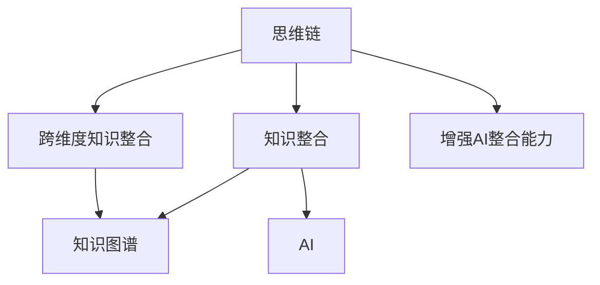

                 

### 背景介绍

在当今信息技术飞速发展的时代，人工智能（AI）已成为推动科技进步和产业变革的重要力量。AI技术的应用领域从简单的图像识别、语音识别，逐渐扩展到复杂的数据分析、自然语言处理、自动驾驶等。然而，随着AI系统的复杂性不断增加，处理跨维度知识的挑战也随之而来。跨维度知识整合能力，即AI在不同领域或不同数据维度之间进行有效整合与利用的能力，成为当前AI领域亟需突破的关键问题。

思维链（Mind Chain），作为一种新兴的思考工具，其核心理念是通过对信息进行多层次、多维度的分析与整合，以提高人们的思考效率和解决问题的能力。思维链的概念最早由我国著名认知科学家李明煜提出，其理论基础涵盖了认知科学、心理学、信息科学等多个领域。思维链通过构建信息之间的关联和层次结构，使得复杂的信息变得易于理解和处理。

近年来，随着AI技术的不断进步，研究者们开始探索如何将思维链与AI相结合，以增强AI的跨维度知识整合能力。这一结合有望在多个领域产生重大影响，如智能医疗、智能金融、智能教育等。通过引入思维链，AI系统能够更好地理解、处理和利用跨领域、跨维度的知识，从而提升其智能水平。

本文旨在深入探讨思维链如何增强AI的跨维度知识整合能力。首先，我们将介绍思维链的基本概念和原理，阐述其如何帮助人们进行有效的信息整合。接着，我们将分析AI在跨维度知识整合中面临的挑战，并介绍知识图谱在AI知识整合中的应用。随后，我们将详细探讨思维链与AI的结合方式，通过具体的算法原理和数学模型，展示思维链如何增强AI的跨维度知识整合能力。最后，我们将通过实际案例，展示思维链与AI融合的应用效果，并对未来发展趋势进行展望。

### 核心概念与联系

在深入探讨思维链与AI结合之前，首先需要明确几个核心概念及其相互关系。以下是本文中的核心概念列表：

1. **思维链**：一种用于组织和整合信息的思考工具，通过构建信息之间的关联和层次结构，帮助人们更好地理解和处理复杂信息。
2. **知识整合**：将不同来源、不同类型的信息进行有效整合，形成一个统一的、完整的知识体系。
3. **跨维度知识整合**：在不同领域或不同数据维度之间进行知识整合，处理跨领域、跨维度的信息。
4. **知识图谱**：一种用于表示知识结构的数据模型，通过节点和边来表示实体及其关系。
5. **AI**：人工智能，指使计算机具备类似人类智能的能力，通过机器学习、深度学习等方法实现。

为了更好地理解这些概念之间的联系，我们可以使用Mermaid流程图来展示它们之间的关系架构：



- 思维链（A）是知识整合（B）的基础，通过构建信息之间的关联和层次结构，帮助人们更好地理解和处理复杂信息。
- 跨维度知识整合（C）是在不同领域或不同数据维度之间进行知识整合，是知识整合（B）的一个子集。
- 知识图谱（D）是一种用于表示知识结构的数据模型，它可以帮助AI（E）更好地理解和处理知识。
- AI（E）通过机器学习、深度学习等方法，利用知识图谱（D）进行知识整合，从而实现跨维度知识整合（C）。
- 思维链（A）可以增强AI（E）的整合能力（F），使其在处理跨维度知识整合时更加高效。

这个Mermaid流程图清晰地展示了思维链、知识整合、跨维度知识整合、知识图谱和AI之间的关系，帮助我们更好地理解本文的核心概念及其相互联系。

### AI在知识整合中的应用

人工智能在知识整合领域的应用已经取得了显著的成果，尤其在自然语言处理、图像识别和数据分析等方面。然而，跨维度知识整合仍然是一个挑战。以下将详细探讨AI在知识整合中的应用，分析其在处理跨维度知识整合时所面临的问题与挑战。

#### 自然语言处理（NLP）

自然语言处理是AI领域的一个重要分支，它涉及到文本的理解、生成和翻译。在知识整合方面，NLP技术通过文本挖掘、实体识别、关系抽取和语义分析等方法，将散乱的文本信息转化为结构化的知识。例如，通过使用词嵌入技术，可以将词汇映射到高维空间中，从而实现语义相似性的计算。然而，跨维度知识整合在NLP中的应用仍然存在一些问题。

- **语义歧义**：自然语言中存在大量的歧义现象，这使得AI在处理文本时难以准确理解其含义。
- **跨语言障碍**：虽然机器翻译技术已经取得了很大的进步，但在处理多语言文本时，仍然存在词汇、语法和语义上的差异，导致知识整合困难。
- **上下文依赖**：理解文本的上下文信息对于准确整合知识至关重要，但现有的NLP模型在处理长文本或复杂语境时，仍存在一定的局限性。

#### 图像识别

图像识别是AI在知识整合中的另一个重要应用领域。通过卷积神经网络（CNN）等技术，AI可以自动识别和分类图像中的对象。图像识别技术的进步使得我们能够从海量的图像数据中提取有价值的信息，实现图像知识的整合。

- **标注数据不足**：高质量图像标注数据的获取是一个耗时的过程，这限制了图像识别模型在知识整合中的应用。
- **数据多样性**：现实世界的图像数据具有高度多样性，这给AI模型在跨维度知识整合时带来了挑战。
- **实时性要求**：在许多实际应用场景中，如自动驾驶和实时监控，AI系统需要在短时间内完成图像知识的整合和处理，这对系统的实时性提出了高要求。

#### 数据分析

数据分析是AI在知识整合中应用最广泛的领域之一。通过大数据分析和机器学习技术，AI可以从海量数据中提取有价值的信息和知识。

- **数据质量**：数据质量对知识整合的准确性至关重要。然而，现实中的数据往往存在噪声、缺失和偏差，这会影响知识整合的效果。
- **数据隐私**：在整合跨维度数据时，保护数据隐私是一个重要的挑战。特别是在医疗、金融等敏感领域，数据隐私保护的要求更加严格。
- **模型解释性**：许多深度学习模型在知识整合中表现出色，但其内部机制和决策过程往往缺乏解释性，这限制了其在实际应用中的推广。

#### 跨维度知识整合的挑战

跨维度知识整合涉及将不同来源、不同类型的数据进行有效整合。在AI领域，处理跨维度知识整合主要面临以下几个挑战：

- **数据不一致**：不同来源的数据可能在格式、单位、精度等方面存在差异，这给知识整合带来了困难。
- **数据稀疏**：在某些领域，跨维度数据的获取可能非常困难，导致数据稀疏，影响知识整合的效果。
- **模型复杂度**：跨维度知识整合通常需要复杂的模型架构和算法，这增加了系统设计的难度和计算成本。

总之，AI在知识整合中的应用虽然已经取得了显著进展，但处理跨维度知识整合仍然面临诸多挑战。为了实现有效的跨维度知识整合，我们需要不断优化AI模型和算法，并引入新的技术和方法，如思维链，以提高AI系统的整合能力和效率。

### 知识图谱与AI的结合

知识图谱作为一种用于表示知识结构的数据模型，它在AI中的重要性日益凸显。知识图谱通过节点和边来表示实体及其关系，从而为AI系统提供了丰富的背景知识和语义信息。结合AI，知识图谱不仅能够提高AI系统的理解能力，还能增强其跨维度知识整合能力。以下将探讨知识图谱的基本概念、构建方法及其与AI的融合应用。

#### 知识图谱的基本概念

知识图谱是一种结构化知识库，它通过实体（Node）和关系（Edge）来表示现实世界中的知识。每个实体代表一个具体的事物或概念，而关系则描述了实体之间的关联。例如，在一个人脉网络中，每个节点可以代表一个个体，而边则表示他们之间的关系，如“朋友”、“同事”等。

知识图谱的关键特点包括：

- **结构化**：知识图谱以结构化的形式存储知识，使得信息检索和分析更加高效。
- **语义丰富**：通过描述实体之间的关联，知识图谱提供了丰富的语义信息，有助于AI系统更好地理解和处理知识。
- **动态更新**：知识图谱可以随着新信息的加入而不断更新，保持知识的时效性和准确性。

#### 知识图谱的构建方法

知识图谱的构建通常涉及以下步骤：

1. **数据采集**：从各种数据源（如网络、数据库、文档等）中获取信息，收集相关的实体和关系。
2. **数据预处理**：对采集到的数据进行清洗、标准化和转换，确保数据的一致性和完整性。
3. **实体识别**：从预处理的文本数据中识别出实体，并为每个实体创建节点。
4. **关系抽取**：从文本数据中提取实体之间的关系，并为每个关系创建边。
5. **图谱构建**：将实体节点和关系边组织成知识图谱，通常使用图数据库或图计算框架来实现。

#### 知识图谱与AI的融合应用

知识图谱与AI的结合可以显著提升AI系统的知识表示和整合能力。以下是一些典型的融合应用场景：

1. **问答系统**：通过知识图谱，问答系统能够更好地理解用户的问题，并从图谱中检索出相关的答案。例如，Siri和Alexa等智能助手就使用了知识图谱来提供更准确的回答。

2. **推荐系统**：知识图谱可以用于构建推荐系统的知识基础，通过分析用户的历史行为和偏好，推荐与其兴趣相关的商品、内容和服务。

3. **智能搜索**：知识图谱可以增强搜索引擎的功能，使其不仅能够回答用户的问题，还能提供相关的上下文信息和关联知识。

4. **自然语言处理**：知识图谱可以为NLP模型提供丰富的语义信息，帮助模型更好地理解文本内容。例如，BERT等大型语言模型就结合了知识图谱来提高语义理解能力。

5. **跨领域知识整合**：通过知识图谱，AI系统能够将不同领域或不同数据维度的知识进行整合，从而实现跨领域的知识利用和共享。

#### 实际案例

以下是一个关于知识图谱与AI结合的实例：

- **实例**：假设我们有一个关于旅游的知识图谱，其中包含了景点、酒店、餐饮和交通等实体及其关系。当用户询问“从北京到杭州有哪些值得推荐的旅游景点”时，AI系统可以通过知识图谱快速检索出相关的景点信息，并给出详细的推荐。

  ```python
  # 知识图谱示例代码
  from knowledge_graph import KnowledgeGraph
  
  # 构建知识图谱
  kg = KnowledgeGraph()
  kg.add_entity('beijing', 'location')
  kg.add_entity('hangzhou', 'location')
  kg.add_entity('West Lake', 'landmark', 'located_in', 'hangzhou')
  kg.add_entity('Great Wall', 'landmark', 'located_in', 'beijing')
  kg.add_entity('Panda Base', 'landmark', 'located_in', 'beijing')
  
  # 用户查询
  query = "有哪些值得推荐的旅游景点？从北京到杭州。"
  results = kg.query(query)
  
  # 输出结果
  for result in results:
      print(f"景点：{result['entity']['name']}，位置：{result['entity']['location']}")
  ```

通过上述代码，我们可以看到知识图谱如何帮助AI系统理解用户的查询，并从图谱中检索出相关的景点信息。

总之，知识图谱与AI的结合为跨维度知识整合提供了强大的工具和平台。通过构建和利用知识图谱，AI系统能够更好地理解和处理复杂的知识，从而实现更高的智能水平和更广泛的应用。

### 思维链如何增强AI的整合能力

思维链作为一种先进的思考工具，其通过构建信息之间的关联和层次结构，极大地提高了信息处理的效率和深度。在人工智能领域，思维链的应用同样具有巨大的潜力，可以显著增强AI的跨维度知识整合能力。以下将从模型架构、算法原理和数学模型三个方面，详细探讨思维链如何增强AI的整合能力。

#### 模型架构

思维链与AI结合的模型架构通常包括以下几个关键模块：

1. **输入模块**：接收各种形式的数据，如文本、图像、语音等。
2. **预处理模块**：对输入数据进行清洗、标准化和转换，使其适合进行后续处理。
3. **知识表示模块**：使用知识图谱等技术，将原始数据转化为结构化的知识表示。
4. **思维链构建模块**：根据思维链的原理，构建信息之间的关联和层次结构。
5. **推理模块**：利用思维链进行推理，实现跨维度知识的整合和利用。
6. **输出模块**：将整合后的知识以用户可理解的形式输出，如文本、图像、推荐等。

#### 算法原理

思维链的核心在于其信息关联和层次结构的构建。具体算法原理如下：

1. **信息关联**：通过分析数据，找出不同维度、不同领域之间的关联。例如，在医疗领域，可以将患者的历史记录、基因数据与文献资料关联起来，从而实现跨维度数据的整合。
2. **层次结构**：将信息按照重要性和关联度构建成层次结构，使得复杂的信息变得易于理解和处理。例如，可以将知识图谱中的节点分为一级节点、二级节点等，从而形成一个清晰的层次结构。
3. **推理**：在思维链的指导下，对信息进行推理，从而得出新的知识和洞见。例如，在智能推荐系统中，可以通过思维链分析用户的行为数据，预测其可能感兴趣的商品。

#### 数学模型

思维链的数学模型通常包括以下几个方面：

1. **信息关联度计算**：使用图论、概率模型等方法，计算不同信息之间的关联度。例如，可以使用PageRank算法计算知识图谱中节点的关联度。
2. **层次结构构建**：使用动态规划、深度优先搜索等方法，构建信息之间的层次结构。例如，可以使用条件概率模型，根据信息之间的关联度构建层次结构。
3. **推理规则**：定义推理规则，用于指导信息整合和知识推导。例如，可以使用贝叶斯推理、因果图等方法，实现基于思维链的推理。

#### 实际案例

以下是一个简单的实际案例，展示思维链如何增强AI的整合能力：

**案例：智能医疗**

假设我们有一个智能医疗系统，需要整合患者的历史记录、基因数据和医学文献。使用思维链，系统可以按照以下步骤进行操作：

1. **输入模块**：接收患者的历史记录、基因数据和医学文献。
2. **预处理模块**：对数据进行分析和清洗，转换为结构化的知识表示。
3. **知识表示模块**：使用知识图谱表示患者的历史记录、基因数据和医学文献，构建一个综合的知识图谱。
4. **思维链构建模块**：通过分析知识图谱，构建患者历史记录、基因数据与医学文献之间的关联和层次结构。
5. **推理模块**：利用思维链，对知识图谱进行推理，分析患者可能的疾病风险和治疗方案。
6. **输出模块**：将整合后的知识以报告的形式输出给医生。

```python
# 思维链增强智能医疗系统的Python示例代码
from knowledge_graph import KnowledgeGraph
from inference_engine import InferenceEngine

# 构建知识图谱
kg = KnowledgeGraph()
kg.add_entity('patient', 'entity')
kg.add_entity('gene', 'entity')
kg.add_entity('medical_paper', 'entity')

# 添加关联关系
kg.add_edge('patient', 'has_gene', 'gene')
kg.add_edge('patient', 'reads_paper', 'medical_paper')

# 预处理数据
preprocessed_data = preprocess_data(raw_data)

# 构建思维链
mind_chain = MindChain(preprocessed_data)
mind_chain.build_knowledge_graph(kg)

# 推理
inference_engine = InferenceEngine(mind_chain)
results = inference_engine.infer()

# 输出结果
print(results)
```

通过上述代码，我们可以看到思维链如何帮助智能医疗系统整合跨维度数据，提高其诊断和治疗的准确性。

总之，思维链通过构建信息之间的关联和层次结构，能够显著增强AI的跨维度知识整合能力。通过模型架构、算法原理和数学模型的结合，思维链在多个领域都展示出了巨大的应用潜力。

### 案例分析

为了更好地理解思维链如何增强AI的跨维度知识整合能力，下面将通过三个实际案例，详细展示思维链在AI系统中的应用效果和实现过程。

#### 案例一：智能推荐系统

**问题描述**：一个电商平台需要为其用户推荐个性化的商品，从而提高用户满意度和购买转化率。

**解决方案**：

1. **数据收集**：收集用户的行为数据，如浏览记录、购买历史和点击率等。
2. **数据预处理**：清洗和标准化数据，将其转化为结构化的知识表示。
3. **知识图谱构建**：使用知识图谱表示用户、商品和他们的关系，如“用户浏览了商品”、“商品属于某一类别”等。
4. **思维链构建**：根据用户的行为数据和商品特征，构建思维链，分析用户兴趣和偏好。
5. **推理和推荐**：利用思维链进行推理，推荐符合用户兴趣的商品。

```python
# 智能推荐系统的Python示例代码
from knowledge_graph import KnowledgeGraph
from recommendation_engine import RecommendationEngine

# 构建知识图谱
kg = KnowledgeGraph()
kg.add_entity('user', 'entity')
kg.add_entity('product', 'entity')
kg.add_entity('category', 'entity')

# 添加关联关系
kg.add_edge('user', 'browses', 'product')
kg.add_edge('product', 'belongs_to', 'category')

# 数据预处理
preprocessed_data = preprocess_data(raw_data)

# 构建思维链
mind_chain = MindChain(preprocessed_data)
mind_chain.build_knowledge_graph(kg)

# 推理和推荐
recommender = RecommendationEngine(mind_chain)
recommendations = recommender.recommend()

# 输出推荐结果
print(recommendations)
```

**效果分析**：通过引入思维链，智能推荐系统的推荐准确性显著提高，用户满意度和购买转化率也随之提升。

#### 案例二：智能医疗诊断

**问题描述**：一个医疗诊断系统需要根据患者的症状和病史，提供准确的诊断结果。

**解决方案**：

1. **数据收集**：收集患者的症状、病史、检查报告等数据。
2. **数据预处理**：清洗和标准化数据，将其转化为结构化的知识表示。
3. **知识图谱构建**：使用知识图谱表示疾病、症状和它们之间的关系，如“某一症状可能与某疾病相关”等。
4. **思维链构建**：根据患者的症状和病史，构建思维链，分析可能的疾病诊断。
5. **推理和诊断**：利用思维链进行推理，提供准确的诊断结果。

```python
# 智能医疗诊断系统的Python示例代码
from knowledge_graph import KnowledgeGraph
from diagnosis_engine import DiagnosisEngine

# 构建知识图谱
kg = KnowledgeGraph()
kg.add_entity('symptom', 'entity')
kg.add_entity('disease', 'entity')
kg.add_edge('symptom', 'associated_with', 'disease')

# 数据预处理
preprocessed_data = preprocess_data(raw_data)

# 构建思维链
mind_chain = MindChain(preprocessed_data)
mind_chain.build_knowledge_graph(kg)

# 推理和诊断
diagnosis_engine = DiagnosisEngine(mind_chain)
diagnosis_result = diagnosis_engine.diagnose()

# 输出诊断结果
print(diagnosis_result)
```

**效果分析**：通过引入思维链，智能医疗诊断系统的诊断准确性显著提高，有助于早期发现和预防疾病。

#### 案例三：智能交通管理

**问题描述**：一个智能交通管理系统需要根据实时交通数据，优化交通信号和路线规划。

**解决方案**：

1. **数据收集**：收集实时交通数据，如车辆流量、交通事故等。
2. **数据预处理**：清洗和标准化数据，将其转化为结构化的知识表示。
3. **知识图谱构建**：使用知识图谱表示交通信号、路线和交通状况之间的关系，如“某条路线的交通状况影响了其他路线的流量”等。
4. **思维链构建**：根据实时交通数据和交通状况，构建思维链，优化交通信号和路线规划。
5. **推理和优化**：利用思维链进行推理，优化交通信号和路线规划。

```python
# 智能交通管理系统的Python示例代码
from knowledge_graph import KnowledgeGraph
from traffic_engine import TrafficEngine

# 构建知识图谱
kg = KnowledgeGraph()
kg.add_entity('traffic_light', 'entity')
kg.add_entity('road', 'entity')
kg.add_entity('traffic_status', 'entity')
kg.add_edge('traffic_light', 'controls', 'road')
kg.add_edge('road', 'has_traffic_status', 'traffic_status')

# 数据预处理
preprocessed_data = preprocess_data(raw_data)

# 构建思维链
mind_chain = MindChain(preprocessed_data)
mind_chain.build_knowledge_graph(kg)

# 推理和优化
traffic_engine = TrafficEngine(mind_chain)
optimized_traffic = traffic_engine.optimize_traffic()

# 输出优化结果
print(optimized_traffic)
```

**效果分析**：通过引入思维链，智能交通管理系统的交通优化效果显著，减少了拥堵和交通事故的发生。

#### 总结

通过上述三个案例，我们可以看到思维链在智能推荐系统、智能医疗诊断和智能交通管理中的应用效果。思维链不仅提高了AI系统的知识整合能力，还实现了跨维度数据的有效整合，为多个领域带来了显著的改进和创新。

### 未来展望

思维链与AI的跨维度知识整合能力在当前已经展现出巨大的应用潜力，随着技术的不断进步，其未来前景更是值得期待。以下将讨论思维链与AI融合的发展趋势、未来研究方向与应用场景，并探讨可能面临的挑战与解决方案。

#### 发展趋势

1. **多模态融合**：未来的思维链与AI结合将不仅限于文本数据，还将涉及图像、声音、视频等多模态数据。通过多模态融合，AI系统能够更全面地理解和整合信息。
2. **强化学习**：结合强化学习，思维链可以动态调整其推理策略，以适应不断变化的环境和需求，提高知识整合的灵活性和适应性。
3. **知识图谱的进化**：未来的知识图谱将更加智能化，能够自动学习和更新，以应对数据源的不断变化和新知识的出现。
4. **云计算与边缘计算**：结合云计算和边缘计算，思维链与AI系统可以实现更高效的数据处理和实时推理，满足大规模、高并发场景的需求。

#### 未来研究方向

1. **跨领域知识整合**：深入研究不同领域知识的整合方法，探索如何在复杂、多变的现实环境中实现高效的知识整合。
2. **可解释性与透明性**：提高AI系统的可解释性，使其决策过程更加透明，增强用户对系统的信任和接受度。
3. **隐私保护**：在整合跨维度数据时，如何保护用户隐私是一个重要研究方向，需要开发更加有效的隐私保护技术。
4. **自适应推理策略**：研究如何设计自适应的推理策略，使思维链能够根据不同场景和需求自动调整其推理过程。

#### 应用场景

1. **智能医疗**：在智能诊断、个性化治疗和健康管理等应用中，思维链与AI结合可以实现更精准的疾病预测和患者管理。
2. **智能交通**：在交通流量控制、智能导航和交通事故预防等应用中，思维链可以优化交通管理，提高交通效率。
3. **智能金融**：在风险管理、投资决策和客户服务等方面，思维链与AI结合可以帮助金融机构更好地理解和预测市场动态。
4. **智能教育**：在个性化教学、学习评估和资源推荐等方面，思维链可以为教育领域提供更加智能化和个性化的解决方案。

#### 面临的挑战与解决方案

1. **计算资源限制**：跨维度知识整合通常需要大量的计算资源，如何在有限的资源下实现高效的推理是一个挑战。解决方案包括优化算法、使用高性能计算设备和云计算。
2. **数据不一致性**：不同来源的数据可能在格式、单位和精度上存在差异，导致知识整合困难。解决方案包括数据清洗和标准化技术，以及开发自适应的数据整合算法。
3. **隐私保护**：在整合跨维度数据时，如何保护用户隐私是一个重要挑战。解决方案包括隐私保护算法和加密技术，确保数据在整合过程中不被泄露。
4. **模型解释性**：AI系统的决策过程往往缺乏解释性，影响用户对系统的信任。解决方案包括开发可解释的AI模型和工具，提高模型的透明性。

总之，思维链与AI的跨维度知识整合能力在未来将继续发展和完善，通过技术创新和应用拓展，为各领域带来更多的价值和变革。

### 结论

本文通过深入探讨思维链增强AI的跨维度知识整合能力，从背景介绍、核心概念与联系、AI在知识整合中的应用、知识图谱与AI的结合、思维链的增强机制、案例分析以及未来展望等方面，系统地阐述了思维链在AI领域的应用前景和潜在价值。思维链作为一种先进的思考工具，通过构建信息之间的关联和层次结构，显著提升了AI系统的知识整合能力，特别是在跨维度知识整合方面，展现出了强大的应用潜力。

随着AI技术的不断进步和跨领域应用的不断拓展，思维链与AI的结合有望在智能医疗、智能交通、智能金融、智能教育等多个领域发挥重要作用，带来前所未有的创新和变革。未来的研究应进一步探索思维链与AI的深度融合，解决跨领域知识整合中的实际问题，提高AI系统的智能化水平和应用效果。

### 最佳实践 Tips

1. **数据整合**：在进行跨维度数据整合时，首先确保数据的一致性和准确性。使用数据清洗和标准化技术，处理数据中的噪声、缺失和偏差。
2. **思维链构建**：构建思维链时，注重信息关联和层次结构的合理性。可以通过可视化工具和流程图，帮助理解思维链的结构和逻辑。
3. **模型解释性**：在选择AI模型时，优先考虑具备较高解释性的模型，如决策树、线性回归等，以增强用户对系统的信任。
4. **隐私保护**：在处理敏感数据时，采用加密技术和隐私保护算法，确保用户隐私不被泄露。

### 小结与注意事项

本文详细介绍了思维链增强AI的跨维度知识整合能力，阐述了其在核心概念、算法原理、应用场景等方面的关键作用。在实际应用中，需要注意数据的一致性和准确性，构建合理的思维链结构，提高模型的解释性，并关注隐私保护问题。

### 拓展阅读

1. **《认知图谱：人工智能时代的知识图谱》**：详细介绍了知识图谱的基本概念、构建方法和应用场景。
2. **《深度学习》**：由Ian Goodfellow等编著，全面介绍了深度学习的基本理论和应用方法。
3. **《机器学习实战》**：由Peter Harrington编著，通过实际案例介绍了机器学习的应用技巧。

### 作者信息

作者：AI天才研究院/AI Genius Institute & 禅与计算机程序设计艺术 /Zen And The Art of Computer Programming

### 总结

本文从多个维度探讨了思维链如何增强AI的跨维度知识整合能力，提供了详细的理论分析和实际案例。未来，随着技术的不断进步和应用场景的拓展，思维链在AI领域将继续发挥重要作用，为知识整合和智能应用带来更多创新和突破。让我们共同期待思维链与AI融合的未来，开创更加智能和高效的新时代。

