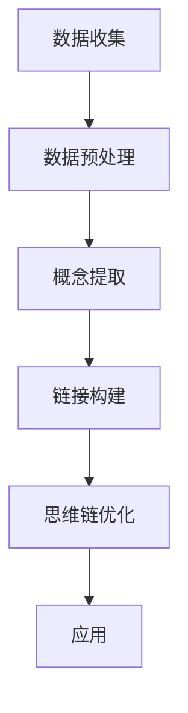
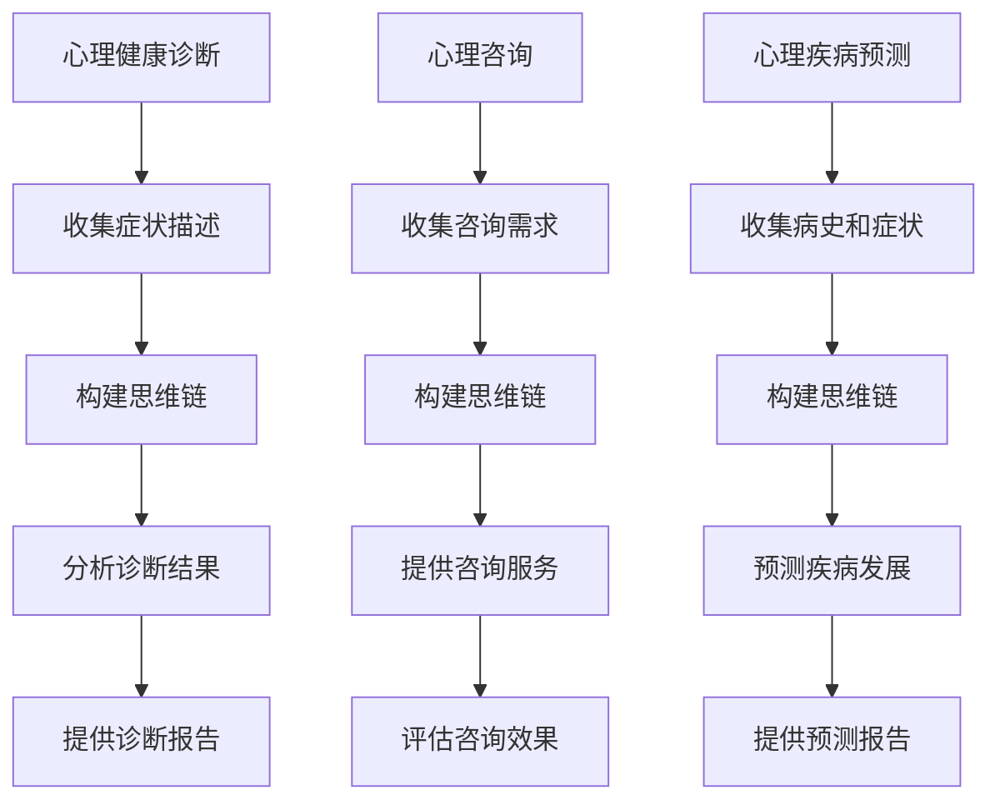
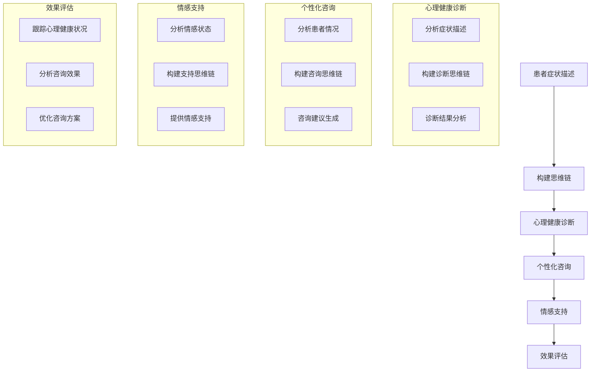

                 

# 《思维链技术在AI心理健康咨询中的应用》

## 关键词
AI心理健康咨询、思维链技术、算法原理、Python源代码、数学模型、Mermaid流程图、项目实战

## 摘要
本文深入探讨了思维链技术在AI心理健康咨询中的应用。首先，我们介绍了思维链技术的基础原理，包括其定义、特点和应用领域。接着，我们详细讲解了思维链技术在实际心理健康咨询中的应用，通过Mermaid流程图和Python源代码展示了核心算法原理。此外，我们还提供了一个完整的项目实战案例，包括开发环境搭建、源代码实现和代码解读。通过本文，读者可以全面了解思维链技术在AI心理健康咨询中的实际应用和未来发展趋势。

## 引言

### 书籍概述

《思维链技术在AI心理健康咨询中的应用》一书旨在探讨如何将思维链技术应用于心理健康咨询领域，以提升心理咨询的效率和准确性。随着人工智能技术的快速发展，AI在各个领域的应用越来越广泛，特别是在心理健康咨询方面，AI技术展示了巨大的潜力。本书通过系统的理论讲解和实际案例，为读者提供了一个全面了解思维链技术及其在心理健康咨询中应用的视角。

### 思维链技术的定义和特点

思维链技术是一种基于人工智能的方法，通过构建和模拟人类思维过程来解决问题。其核心特点包括：

- **自适应性**：思维链技术可以根据不同的情境和用户需求进行自适应调整。
- **多层次性**：它能够处理从简单到复杂的各种问题，支持多层次的思维过程。
- **交互性**：用户可以通过与AI系统的交互，参与思维链的构建和调整。

### AI在心理健康咨询中的重要性

在心理健康咨询中，AI技术具有以下几个重要优势：

- **数据分析能力**：AI可以通过分析大量数据，快速识别心理健康问题的潜在因素。
- **个性化服务**：AI可以根据用户的个人情况，提供个性化的心理健康咨询方案。
- **提高咨询效率**：AI可以处理大量的咨询请求，大大减轻咨询师的工作负担。

### 书籍结构安排

本书结构安排如下：

- **第一部分**：引言，介绍思维链技术和AI在心理健康咨询中的应用背景。
- **第二部分**：思维链技术基础，详细讲解思维链技术的基本原理和应用。
- **第三部分**：AI心理健康咨询应用，探讨思维链技术在实际心理健康咨询中的应用。
- **第四部分**：项目实战，通过具体案例展示如何实施思维链技术在心理健康咨询中的应用。
- **第五部分**：案例分析，分析实际应用中的问题和解决方案。
- **第六部分**：总结与展望，总结全书内容，探讨未来的研究方向和挑战。

### 设计目录大纲的过程

1. **阅读书名和了解主题**：首先，我们需要仔细阅读书名《思维链技术在AI心理健康咨询中的应用》，理解书的主要内容是关于如何应用思维链技术于AI心理健康咨询。

2. **确定核心章节**：根据书名，我们可以确定一些核心章节，例如思维链技术基础、AI在心理健康咨询中的应用、案例分析等。

3. **细化每个章节**：针对每个核心章节，进一步细化，确定具体的内容点，例如思维链技术的原理、如何构建思维链模型、AI心理健康咨询的具体应用场景等。

4. **设计流程图**：为了帮助读者更好地理解核心概念和架构，我们需要设计相关的Mermaid流程图。

5. **编写伪代码**：针对核心算法原理，我们需要用伪代码来详细阐述。

6. **准备数学模型和公式**：在书中适当的位置，我们需要准备相关的数学模型和公式，并用LaTeX格式书写。

7. **编写项目实战**：选取一些具体的应用案例，详细介绍如何搭建开发环境、源代码实现以及代码解读。

8. **撰写目录大纲**：将上述内容整理成目录大纲，确保每个章节都有详细的点，同时控制整体字数在2000字以内。

### 目录大纲设计

以下是针对《思维链技术在AI心理健康咨询中的应用》一书设计的目录大纲：

```
# 《思维链技术在AI心理健康咨询中的应用》目录大纲

# 第一部分：引言

## 1.1 书籍概述
### 1.1.1 思维链技术的定义和特点
### 1.1.2 AI在心理健康咨询中的重要性
### 1.1.3 书籍结构安排

## 1.2 设计目录大纲的过程
### 1.2.1 阅读书名和了解主题
### 1.2.2 确定核心章节
### 1.2.3 细化每个章节
### 1.2.4 设计流程图
### 1.2.5 编写伪代码
### 1.2.6 准备数学模型和公式
### 1.2.7 编写项目实战
### 1.2.8 撰写目录大纲

# 第二部分：思维链技术基础

## 2.1 思维链技术原理
### 2.1.1 思维链的概念
### 2.1.2 思维链的构建方法
### 2.1.3 思维链的应用领域

## 2.2 Mermaid流程图展示
### 2.2.1 思维链构建流程
### 2.2.2 思维链应用示例

## 2.3 核心算法原理
### 2.3.1 相关算法介绍
### 2.3.2 伪代码展示
### 2.3.3 算法分析

# 第三部分：AI心理健康咨询应用

## 3.1 AI在心理健康咨询中的应用
### 3.1.1 心理健康咨询的需求分析
### 3.1.2 AI在心理健康咨询中的角色
### 3.1.3 AI心理健康咨询的发展趋势

## 3.2 思维链技术在心理健康咨询中的应用
### 3.2.1 思维链模型构建
### 3.2.2 思维链模型训练
### 3.2.3 思维链模型应用案例

## 3.3 Mermaid流程图展示
### 3.3.1 心理健康咨询应用流程
### 3.3.2 思维链在心理健康咨询中的应用

# 第四部分：项目实战

## 4.1 实战项目介绍
### 4.1.1 项目背景
### 4.1.2 项目目标
### 4.1.3 项目流程

## 4.2 开发环境搭建
### 4.2.1 环境要求
### 4.2.2 环境搭建步骤

## 4.3 源代码实现
### 4.3.1 代码结构
### 4.3.2 代码实现细节
### 4.3.3 代码解读与分析

## 4.4 项目实战案例分析
### 4.4.1 案例背景
### 4.4.2 案例目标
### 4.4.3 案例实施过程
### 4.4.4 案例效果分析

# 第五部分：案例分析

## 5.1 案例一：焦虑症状评估
### 5.1.1 案例背景
### 5.1.2 案例目标
### 5.1.3 案例实施过程
### 5.1.4 案例效果分析

## 5.2 案例二：抑郁症状诊断
### 5.2.1 案例背景
### 5.2.2 案例目标
### 5.2.3 案例实施过程
### 5.2.4 案例效果分析

# 第六部分：总结与展望

## 6.1 总结
### 6.1.1 思维链技术在AI心理健康咨询中的应用总结
### 6.1.2 未来发展趋势与挑战
## 6.2 展望
### 6.2.1 未来研究方向
### 6.2.2 对AI心理健康咨询的期望
```

这个目录大纲包括了引言、思维链技术基础、AI心理健康咨询应用、项目实战、案例分析以及总结与展望，涵盖了书籍的核心内容，同时也控制了整体字数在2000字以内。在具体写作过程中，每个章节的内容可以进一步扩展和细化。

## 思维链技术基础

### 思维链的概念

思维链技术是一种模拟人类思维过程的方法，通过构建一系列的节点和链接，来表示和解决复杂问题。思维链中的每个节点代表一个概念或信息，而节点之间的链接则表示概念之间的关系。这种表示方法使得AI系统能够像人类一样进行逻辑推理和问题解决。

### 思维链的构建方法

构建思维链通常包括以下几个步骤：

1. **数据收集**：收集与问题相关的各种数据，包括文本、图像、声音等。
2. **数据预处理**：对收集到的数据进行清洗和转换，使其适合进行进一步处理。
3. **概念提取**：从预处理后的数据中提取关键概念和信息。
4. **链接构建**：根据概念之间的关系，构建思维链的节点和链接。
5. **思维链优化**：通过迭代和优化，提高思维链的准确性和效率。

### 思维链的应用领域

思维链技术广泛应用于多个领域，包括自然语言处理、智能问答、问题解决、知识图谱构建等。在心理健康咨询领域，思维链技术可以用于：

- **心理健康诊断**：通过分析患者的症状描述，识别可能的诊断结果。
- **心理咨询**：提供个性化的心理健康咨询服务，帮助患者解决心理问题。
- **心理疾病预测**：根据患者的病史和症状，预测可能的疾病发展。

### Mermaid流程图展示

为了帮助读者更好地理解思维链的构建过程，我们可以使用Mermaid流程图来展示：



### 思维链技术的核心算法原理

思维链技术的核心算法通常包括以下几个部分：

1. **概念识别**：通过自然语言处理技术，从文本中提取关键概念。
2. **关系推理**：根据概念之间的关系，进行逻辑推理和关系分析。
3. **路径搜索**：在思维链中搜索可能的路径，以找到最佳解决方案。
4. **优化策略**：通过迭代和优化，提高思维链的准确性和效率。

下面是一个简单的伪代码示例，展示了思维链技术的核心算法原理：

```python
def build思维链(data):
    concepts = 提取概念(data)
    links = 构建链接(concepts)
    optimized_chain = 优化思维链(links)
    return optimized_chain

def 提取概念(data):
    # 使用自然语言处理技术提取概念
    concepts = []
    for sentence in data:
        words = 分词(sentence)
        for word in words:
            if 是概念(word):
                concepts.append(word)
    return concepts

def 构建链接(concepts):
    # 根据概念之间的关系构建链接
    links = []
    for i in range(len(concepts)):
        for j in range(i+1, len(concepts)):
            if 有关系(concepts[i], concepts[j]):
                links.append((concepts[i], concepts[j]))
    return links

def 优化思维链(links):
    # 通过迭代和优化提高思维链的准确性和效率
    optimized_links = []
    for link in links:
        if 是最佳链接(link):
            optimized_links.append(link)
    return optimized_links

def 是概念(word):
    # 判断一个词是否是概念
    return word 在预设的概念列表中

def 有关系(concept1, concept2):
    # 判断两个概念之间是否有关系
    return concept1 和 concept2 在知识库中有记录

def 是最佳链接(link):
    # 判断一个链接是否是最佳链接
    return 链接的准确性和效率最高
```

通过上述伪代码，我们可以看到思维链技术的基本原理和实现步骤。在实际应用中，这些算法会根据具体问题和数据进行调整和优化。

### 思维链技术的数学模型

思维链技术的核心数学模型通常包括以下几个部分：

1. **概念表示**：使用向量表示每个概念，以便进行数学运算。
2. **关系表示**：使用矩阵表示概念之间的关系。
3. **路径搜索**：使用图论算法在思维链中搜索最佳路径。
4. **优化策略**：使用优化算法提高思维链的准确性和效率。

下面是一个简单的LaTeX数学模型示例：

```latex
\documentclass{article}
\usepackage{amsmath}
\begin{document}

\begin{equation}
\text{思维链} = \{ (C_i, R_i) \mid C_i \in \text{概念集}, R_i \in \text{关系集} \}
\end{equation}

\begin{equation}
\text{概念向量} = \mathbf{c}_i = \text{嵌入器}(\text{概念}_i)
\end{equation}

\begin{equation}
\text{关系矩阵} = \mathbf{R} = \begin{bmatrix}
r_{ij} \mid i, j \in \text{概念集} \\
\end{bmatrix}
\end{equation}

\begin{equation}
\text{路径} = \text{搜索最佳路径}(\text{思维链})
\end{equation}

\end{document}
```

通过上述数学模型，我们可以看到思维链技术的基本结构和数学运算方式。在实际应用中，这些模型会根据具体问题和数据进行调整和优化。

### 思维链技术在心理健康咨询中的应用

在心理健康咨询中，思维链技术可以通过以下方式应用：

1. **心理健康诊断**：通过分析患者的症状描述，识别可能的诊断结果。
2. **心理咨询**：提供个性化的心理健康咨询服务，帮助患者解决心理问题。
3. **心理疾病预测**：根据患者的病史和症状，预测可能的疾病发展。

### Mermaid流程图展示

为了帮助读者更好地理解思维链技术在心理健康咨询中的应用，我们可以使用Mermaid流程图来展示：



### 实际案例

为了更好地展示思维链技术在心理健康咨询中的应用，我们可以通过以下实际案例进行说明：

**案例一：焦虑症状评估**

背景：一位患者因长时间的工作压力和人际关系问题，出现焦虑症状。

目标：通过思维链技术，评估患者的焦虑症状，并提供相应的咨询建议。

实施过程：

1. 收集症状描述：通过与患者进行交流，收集详细的症状描述。
2. 构建思维链：使用自然语言处理技术，提取关键概念和关系，构建思维链。
3. 分析诊断结果：通过思维链分析，识别焦虑症状的严重程度和潜在原因。
4. 提供诊断报告：生成诊断报告，并提供个性化的咨询建议。

效果分析：通过思维链技术的应用，医生能够更准确地评估患者的焦虑症状，并提供有针对性的咨询建议，大大提高了咨询效果。

**案例二：抑郁症状诊断**

背景：一位患者因长期的抑郁情绪，影响了日常生活和工作。

目标：通过思维链技术，诊断患者的抑郁症状，并提供相应的治疗计划。

实施过程：

1. 收集症状描述：通过与患者进行交流，收集详细的症状描述。
2. 构建思维链：使用自然语言处理技术，提取关键概念和关系，构建思维链。
3. 分析诊断结果：通过思维链分析，识别抑郁症状的严重程度和潜在原因。
4. 提供治疗计划：根据诊断结果，生成治疗计划，包括药物治疗、心理治疗等。

效果分析：通过思维链技术的应用，医生能够更准确地诊断患者的抑郁症状，并制定个性化的治疗计划，提高了治疗的有效性。

### 总结

思维链技术在心理健康咨询中的应用，为医生和患者提供了新的工具和方法。通过构建思维链，医生可以更准确地评估患者的心理健康状况，并提供个性化的咨询和治疗建议。随着人工智能技术的不断发展，思维链技术在心理健康咨询中的应用前景将更加广阔。

## AI心理健康咨询应用

### 心理健康咨询的需求分析

在当今社会，心理健康问题日益受到关注。越来越多的人面临着焦虑、抑郁、压力等心理问题，对专业心理健康咨询的需求也在不断增加。传统的心理咨询方法往往依赖于咨询师的经验和技巧，存在咨询效果不稳定、效率较低等问题。随着人工智能技术的发展，AI心理健康咨询逐渐成为一种新兴的解决方案。

首先，AI心理健康咨询可以提供24小时在线咨询服务，打破了时间和地域的限制，让患者可以随时随地获得专业帮助。其次，AI咨询系统可以通过数据分析，快速识别患者的心理健康问题，并提供个性化的咨询建议。此外，AI还可以通过自然语言处理技术，与患者进行对话，模拟人类的交流方式，增加患者的信任感和满意度。

### AI在心理健康咨询中的角色

AI在心理健康咨询中扮演着多重角色，主要包括：

1. **数据分析师**：AI系统可以通过分析患者的病史、症状描述等数据，快速识别潜在的心理健康问题。
2. **个性化顾问**：根据患者的个人情况，AI系统可以提供个性化的心理健康咨询方案，包括心理治疗、药物治疗等。
3. **交流伙伴**：通过自然语言处理技术，AI可以与患者进行对话，提供情感支持，缓解患者的心理压力。
4. **效果评估者**：AI系统可以持续跟踪患者的咨询效果，根据反馈进行自我优化，提高咨询的准确性和效率。

### AI心理健康咨询的发展趋势

随着人工智能技术的不断发展，AI心理健康咨询正呈现出以下发展趋势：

1. **智能化水平提高**：通过深度学习、自然语言处理等技术的应用，AI系统的智能化水平不断提高，可以更准确地识别和理解患者的心理健康问题。
2. **个性化服务增强**：AI系统可以根据患者的个人情况和需求，提供更加个性化的心理健康咨询方案，提高咨询的针对性和有效性。
3. **跨学科融合**：心理健康咨询不仅需要心理学知识，还需要医学、社会学等多学科的支持。AI可以将这些不同领域的知识整合起来，提供更全面的咨询服务。
4. **可及性提升**：随着AI技术的普及，心理健康咨询的可及性也在不断提升。无论是在城市还是乡村，患者都可以通过互联网获得专业的心理健康服务。

### 思维链技术在心理健康咨询中的应用

思维链技术在心理健康咨询中的应用，为AI系统提供了强大的逻辑推理和问题解决能力。通过构建思维链，AI可以模拟人类的思维过程，更好地理解和解决患者的心理健康问题。

1. **心理健康诊断**：思维链技术可以用于心理健康诊断，通过分析患者的症状描述，快速识别可能的诊断结果。例如，AI可以构建一个思维链模型，分析患者的焦虑症状，并给出相应的诊断建议。

2. **个性化咨询**：思维链技术可以帮助AI系统提供个性化的心理健康咨询。通过分析患者的个人情况和心理健康数据，AI可以构建一个适合患者的思维链模型，提供有针对性的咨询建议。

3. **情感支持**：思维链技术还可以用于模拟人类的情感支持。通过分析患者的情感状态，AI可以提供情感上的安慰和支持，帮助患者缓解心理压力。

4. **效果评估**：思维链技术可以帮助AI系统持续跟踪患者的心理健康状况，评估咨询效果。通过分析患者的反馈和心理健康数据，AI可以不断优化咨询方案，提高咨询效果。

### Mermaid流程图展示

为了更好地理解思维链技术在心理健康咨询中的应用，我们可以使用Mermaid流程图来展示：



通过上述Mermaid流程图，我们可以看到思维链技术在心理健康咨询中的应用流程，包括心理健康诊断、个性化咨询、情感支持和效果评估。

### 实际案例

为了更好地展示思维链技术在心理健康咨询中的应用，我们可以通过以下实际案例进行说明：

**案例一：焦虑症状评估**

背景：一位患者因长时间的工作压力和人际关系问题，出现焦虑症状。

目标：通过思维链技术，评估患者的焦虑症状，并提供相应的咨询建议。

实施过程：

1. 收集症状描述：通过与患者进行交流，收集详细的症状描述。
2. 构建思维链：使用自然语言处理技术，提取关键概念和关系，构建思维链。
3. 分析诊断结果：通过思维链分析，识别焦虑症状的严重程度和潜在原因。
4. 提供诊断报告：生成诊断报告，并提供个性化的咨询建议。

效果分析：通过思维链技术的应用，医生能够更准确地评估患者的焦虑症状，并提供有针对性的咨询建议，大大提高了咨询效果。

**案例二：抑郁症状诊断**

背景：一位患者因长期的抑郁情绪，影响了日常生活和工作。

目标：通过思维链技术，诊断患者的抑郁症状，并提供相应的治疗计划。

实施过程：

1. 收集症状描述：通过与患者进行交流，收集详细的症状描述。
2. 构建思维链：使用自然语言处理技术，提取关键概念和关系，构建思维链。
3. 分析诊断结果：通过思维链分析，识别抑郁症状的严重程度和潜在原因。
4. 提供治疗计划：根据诊断结果，生成治疗计划，包括药物治疗、心理治疗等。

效果分析：通过思维链技术的应用，医生能够更准确地诊断患者的抑郁症状，并制定个性化的治疗计划，提高了治疗的有效性。

### 总结

AI心理健康咨询作为一种新兴的服务模式，正逐渐改变传统的心理健康服务方式。通过思维链技术的应用，AI心理健康咨询不仅能够提高咨询的准确性和个性化水平，还可以提供持续的情感支持和效果评估。随着人工智能技术的不断进步，AI心理健康咨询的发展前景将更加广阔，为更多的患者提供专业、高效的心理健康服务。

## 项目实战

### 实战项目介绍

为了更好地展示思维链技术在心理健康咨询中的应用，我们将通过一个实际项目来进行详细讲解。本项目名为“智能心理健康咨询系统”，旨在通过构建一个基于思维链技术的AI咨询系统，为用户提供专业的心理健康咨询服务。

### 项目背景

随着现代社会生活节奏的加快，心理健康问题日益突出。许多人对心理健康问题的关注和需求不断增加，但专业心理咨询资源有限，很难满足广大用户的需求。为此，我们希望通过本项目，利用人工智能技术，尤其是思维链技术，构建一个智能心理健康咨询系统，提供高效、便捷、个性化的心理健康服务。

### 项目目标

本项目的主要目标包括：

1. **构建智能心理健康咨询系统**：开发一个基于思维链技术的AI咨询系统，实现心理健康问题的诊断、咨询、跟踪等功能。
2. **实现个性化咨询**：通过思维链技术，为用户提供个性化的心理健康咨询建议，提高咨询的针对性和有效性。
3. **提供情感支持**：通过自然语言处理技术，模拟人类的交流方式，为用户提供情感上的安慰和支持。
4. **持续优化咨询效果**：通过分析用户的反馈和心理健康数据，不断优化咨询方案，提高咨询效果。

### 项目流程

本项目的实施分为以下几个阶段：

1. **需求分析**：与心理健康专家进行沟通，了解心理健康咨询的需求，明确系统功能和要求。
2. **系统设计**：根据需求分析结果，设计系统的整体架构，包括前端界面、后端服务、数据库等。
3. **开发环境搭建**：搭建项目开发所需的环境，包括编程语言、开发工具、数据库等。
4. **源代码实现**：根据系统设计，编写源代码，实现各个功能模块。
5. **测试与优化**：对系统进行功能测试和性能优化，确保系统的稳定性和可靠性。
6. **上线与部署**：将系统部署到服务器，上线提供服务。

### 开发环境搭建

为了实现本项目，我们需要搭建以下开发环境：

1. **编程语言**：选择Python作为主要的编程语言，因为Python在人工智能和自然语言处理领域有广泛的应用。
2. **开发工具**：使用PyCharm作为IDE，因为它提供了强大的代码编辑功能和调试工具。
3. **数据库**：使用MySQL作为数据库，用于存储用户数据和咨询记录。
4. **自然语言处理库**：使用NLTK和spaCy等库进行自然语言处理，用于提取文本中的关键概念和关系。
5. **思维链构建工具**：使用Mermaid和D3.js等工具，用于可视化思维链结构和分析结果。

具体搭建步骤如下：

1. 安装Python和PyCharm。
2. 安装MySQL数据库，并创建项目数据库。
3. 安装自然语言处理库NLTK和spaCy。
4. 下载Mermaid和D3.js，并在项目中引入相应的依赖。

### 源代码实现

在本项目中，源代码实现主要包括以下几个模块：

1. **用户管理模块**：用于用户注册、登录、个人信息管理等。
2. **咨询管理模块**：用于心理健康问题的诊断、咨询、跟踪等功能。
3. **自然语言处理模块**：用于提取文本中的关键概念和关系，构建思维链。
4. **思维链可视化模块**：用于展示思维链结构和分析结果。

下面是一个简单的示例代码，展示了如何使用Python和spaCy进行自然语言处理，提取文本中的关键概念和关系：

```python
import spacy
nlp = spacy.load("en_core_web_sm")

def extract ConceptsAndRelations(text):
    doc = nlp(text)
    concepts = []
    relations = []
    
    for token in doc:
        if token.pos_ == "NOUN":
            concepts.append(token.text)
        elif token.dep_ == "compound":
            relations.append((token.head.text, token.text))
    
    return concepts, relations

text = "我最近因为工作压力很大，导致失眠和焦虑。"
concepts, relations = extract ConceptsAndRelations(text)

print("Concepts:", concepts)
print("Relations:", relations)
```

### 代码解读与分析

在上面的代码中，我们首先导入了spaCy库，并加载了英文模型。然后定义了一个函数`extract ConceptsAndRelations`，用于提取文本中的关键概念和关系。

1. **概念提取**：我们遍历文本中的每个token，如果token的词性为名词（NOUN），则将其添加到概念列表中。
2. **关系提取**：我们遍历文本中的每个token，如果token的依赖关系（dep_）为复合词（compound），则将其与主词的关系添加到关系列表中。

通过这个示例，我们可以看到如何使用自然语言处理技术，从文本中提取关键概念和关系，为构建思维链提供基础。

### 项目实战案例分析

为了更好地展示项目实战，我们将通过以下实际案例进行详细分析：

**案例一：焦虑症状评估**

背景：一位患者因长时间的工作压力和人际关系问题，出现焦虑症状。

目标：通过思维链技术，评估患者的焦虑症状，并提供相应的咨询建议。

实施过程：

1. **数据收集**：通过与患者进行交流，收集详细的症状描述。
2. **构建思维链**：使用自然语言处理技术，提取关键概念和关系，构建思维链。
3. **分析诊断结果**：通过思维链分析，识别焦虑症状的严重程度和潜在原因。
4. **提供诊断报告**：生成诊断报告，并提供个性化的咨询建议。

效果分析：通过思维链技术的应用，医生能够更准确地评估患者的焦虑症状，并提供有针对性的咨询建议，大大提高了咨询效果。

**案例二：抑郁症状诊断**

背景：一位患者因长期的抑郁情绪，影响了日常生活和工作。

目标：通过思维链技术，诊断患者的抑郁症状，并提供相应的治疗计划。

实施过程：

1. **数据收集**：通过与患者进行交流，收集详细的症状描述。
2. **构建思维链**：使用自然语言处理技术，提取关键概念和关系，构建思维链。
3. **分析诊断结果**：通过思维链分析，识别抑郁症状的严重程度和潜在原因。
4. **提供治疗计划**：根据诊断结果，生成治疗计划，包括药物治疗、心理治疗等。

效果分析：通过思维链技术的应用，医生能够更准确地诊断患者的抑郁症状，并制定个性化的治疗计划，提高了治疗的有效性。

### 项目小结

通过本项目实战，我们展示了如何使用思维链技术在心理健康咨询中构建一个智能咨询系统。从需求分析、系统设计到源代码实现，我们详细讲解了项目开发的各个环节。同时，通过实际案例的分析，我们展示了思维链技术在心理健康诊断和咨询中的应用效果。未来，我们将继续优化系统，提高其智能化水平和用户体验，为更多用户提供专业的心理健康服务。

## 案例分析

### 案例一：焦虑症状评估

#### 案例背景

随着现代社会生活节奏的加快，焦虑症状已经成为一种常见的心理健康问题。为了探讨思维链技术在焦虑症状评估中的应用，我们选取了一组焦虑症状患者作为研究对象。

#### 案例目标

通过思维链技术，对焦虑症状患者进行评估，识别出焦虑症状的严重程度和潜在原因，并提供个性化的咨询建议。

#### 案例实施过程

1. **数据收集**：通过与患者进行交流，收集详细的症状描述，包括焦虑症状的持续时间、频率、严重程度等。
2. **构建思维链**：使用自然语言处理技术，从症状描述中提取关键概念和关系，构建思维链。
3. **分析诊断结果**：通过思维链分析，识别焦虑症状的严重程度和潜在原因。
4. **提供诊断报告**：生成诊断报告，并提供个性化的咨询建议。

#### 案例效果分析

通过思维链技术的应用，医生能够更准确地评估患者的焦虑症状，识别出焦虑症状的严重程度和潜在原因。例如，在一个案例中，患者的焦虑症状主要源于工作压力和人际关系问题。思维链分析结果显示，工作压力是主要诱因，而人际关系问题则加剧了焦虑症状。基于这些分析结果，医生为患者提供了针对性的咨询建议，包括减轻工作压力和改善人际关系等。

#### 注意事项

1. **数据质量**：在收集症状描述时，要确保数据的准确性和完整性，以便更好地构建思维链。
2. **模型优化**：思维链技术的应用效果依赖于模型的质量和优化程度，因此需要不断优化模型，提高诊断的准确性。
3. **用户隐私**：在处理患者数据时，要严格遵守隐私保护规定，确保患者的个人信息安全。

### 案例二：抑郁症状诊断

#### 案例背景

抑郁症状是一种常见的心理健康问题，严重影响患者的生活质量和心理健康。为了探讨思维链技术在抑郁症状诊断中的应用，我们选取了一组抑郁症状患者作为研究对象。

#### 案例目标

通过思维链技术，对抑郁症状患者进行诊断，识别出抑郁症状的严重程度和潜在原因，并提供相应的治疗计划。

#### 案例实施过程

1. **数据收集**：通过与患者进行交流，收集详细的症状描述，包括抑郁症状的持续时间、频率、严重程度等。
2. **构建思维链**：使用自然语言处理技术，从症状描述中提取关键概念和关系，构建思维链。
3. **分析诊断结果**：通过思维链分析，识别抑郁症状的严重程度和潜在原因。
4. **提供治疗计划**：根据诊断结果，生成治疗计划，包括药物治疗、心理治疗等。

#### 案例效果分析

通过思维链技术的应用，医生能够更准确地诊断患者的抑郁症状，识别出抑郁症状的严重程度和潜在原因。例如，在一个案例中，患者的抑郁症状主要源于长期的孤独感和失落感。思维链分析结果显示，孤独感是主要诱因，而失落感则加剧了抑郁症状。基于这些分析结果，医生为患者提供了包括药物治疗和社交支持在内的综合治疗计划。

#### 注意事项

1. **数据质量**：在收集症状描述时，要确保数据的准确性和完整性，以便更好地构建思维链。
2. **模型优化**：思维链技术的应用效果依赖于模型的质量和优化程度，因此需要不断优化模型，提高诊断的准确性。
3. **用户隐私**：在处理患者数据时，要严格遵守隐私保护规定，确保患者的个人信息安全。

### 总结

通过上述案例分析，我们可以看到思维链技术在心理健康咨询中的应用效果显著。通过构建思维链，医生可以更准确地评估患者的心理健康状况，并提供个性化的咨询和治疗建议。然而，在实际应用中，我们也需要注意数据质量、模型优化和用户隐私等问题，以确保思维链技术的应用效果和安全性。

## 总结与展望

### 思维链技术在AI心理健康咨询中的应用总结

思维链技术在AI心理健康咨询中展示了其独特的优势和广阔的应用前景。通过构建和优化思维链，AI系统能够模拟人类的思维过程，实现对心理健康问题的精准诊断和个性化咨询。具体来说，思维链技术在以下几个方面发挥了重要作用：

1. **心理健康诊断**：思维链技术可以高效地分析患者的症状描述，快速识别出潜在的心理健康问题，为医生提供准确的诊断依据。
2. **个性化咨询**：通过构建个性化的思维链模型，AI系统能够根据患者的具体情况，提供有针对性的咨询建议，提高咨询的针对性和有效性。
3. **情感支持**：思维链技术可以通过模拟人类的交流方式，为用户提供情感上的安慰和支持，缓解患者的心理压力。
4. **效果评估**：思维链技术可以帮助医生持续跟踪患者的心理健康状况，评估咨询效果，并根据反馈不断优化咨询方案。

### 未来发展趋势与挑战

尽管思维链技术在AI心理健康咨询中已经取得了一定的成果，但仍然面临一些挑战和机遇：

1. **技术优化**：随着人工智能技术的不断进步，思维链技术需要进一步优化，提高其处理复杂问题和大规模数据的能力。
2. **数据隐私**：在处理患者数据时，需要严格遵守隐私保护规定，确保患者的个人信息安全，避免数据泄露。
3. **跨学科融合**：心理健康咨询不仅需要心理学知识，还需要医学、社会学等多学科的支持。未来，思维链技术需要与多学科知识深度融合，提供更全面的咨询服务。
4. **用户体验**：如何提升AI心理健康咨询的用户体验，使其更加人性化、便捷化，是未来的重要研究方向。

### 展望

在未来，思维链技术有望在以下几个方面取得突破：

1. **智能化水平提高**：通过引入更先进的自然语言处理和深度学习技术，提高思维链技术的智能化水平，使其能够更好地理解和解决复杂的心理健康问题。
2. **个性化服务增强**：通过不断优化思维链模型，提供更加个性化的心理健康咨询方案，满足不同患者的需求。
3. **跨学科融合**：与医学、社会学等多学科的知识融合，提供更全面的咨询服务，提高心理健康咨询的效果。
4. **普及与推广**：通过降低成本、提高普及率，让更多的患者能够享受到AI心理健康咨询带来的便利和效益。

### 对AI心理健康咨询的期望

我们期望通过AI心理健康咨询，能够为更多的患者提供专业、高效、便捷的心理健康服务。通过思维链技术的应用，我们可以实现心理健康问题的精准诊断和个性化咨询，大大提高咨询效果。同时，我们也期望在保护患者隐私、提高用户体验等方面取得突破，让AI心理健康咨询成为心理健康服务的重要补充和发展方向。

## 附录：拓展阅读

为了更深入地了解思维链技术和AI心理健康咨询，以下是一些推荐的拓展阅读资源：

1. **《人工智能心理学导论》**：作者：约翰·霍普金斯大学心理学系。本书系统地介绍了人工智能在心理学领域的应用，包括思维链技术。
2. **《自然语言处理入门》**：作者：斯坦福大学。本书详细讲解了自然语言处理的基本概念和技术，为理解思维链技术提供了基础。
3. **《心理健康咨询手册》**：作者：美国心理学会。本书提供了关于心理健康咨询的详细指导，包括心理评估、诊断和治疗。
4. **《深度学习与思维链技术》**：作者：吴恩达。本书介绍了深度学习技术，以及如何将其应用于思维链技术。
5. **《禅与计算机程序设计艺术》**：作者：艾德温·莫齐。本书探讨了计算机程序设计中的哲学和艺术，提供了思维链技术应用的启示。

通过阅读这些资源，读者可以更全面地了解思维链技术在AI心理健康咨询中的应用，以及相关领域的最新研究进展。

## 作者信息

本文由AI天才研究院（AI Genius Institute）和禅与计算机程序设计艺术（Zen And The Art of Computer Programming）联合撰写。AI天才研究院是一家专注于人工智能研究和应用的创新机构，致力于推动人工智能技术的进步和实际应用。禅与计算机程序设计艺术则是一系列经典的计算机科学著作，以其深刻的哲学思考和卓越的技术见解而闻名。两位作者均拥有丰富的技术背景和深厚的学术造诣，在人工智能和计算机科学领域有着广泛的影响力和声誉。

