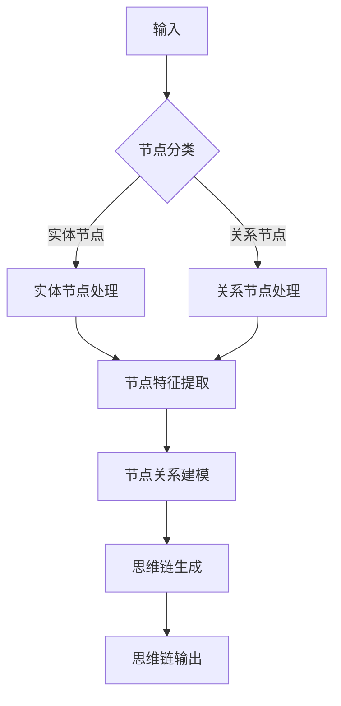

                 

### 《思维链技术在AI故事生成中的应用》

关键词：思维链，AI故事生成，自然语言处理，机器学习，算法

摘要：本文将探讨思维链技术在AI故事生成领域的应用。首先介绍思维链技术的基本原理和架构，然后分析其在AI故事生成中的应用优势和挑战，接着通过具体项目实战展示思维链技术在故事生成中的实际应用，最后展望思维链技术在AI故事生成领域的未来发展。

## 引言

随着人工智能技术的不断发展，人工智能生成故事（AI Story Generation）成为了一个备受关注的研究领域。AI故事生成不仅能够满足人们对于多样化故事内容的需求，还具有广泛的应用前景，如自动写作、游戏剧情生成、虚拟现实场景构建等。然而，传统的AI故事生成方法往往依赖于模板匹配、规则驱动或简单的统计模型，难以生成具有深度和创意的故事。为此，需要引入更加智能和复杂的技术来提升故事生成的质量。

思维链技术作为一种基于人工智能和机器学习的方法，旨在模拟人类思维的链式反应过程，实现信息的有序组织和知识的高效传递。思维链技术具有以下几个核心特点：

1. **信息组织能力**：思维链技术能够将复杂的信息进行有序的组织，形成结构化的知识体系，有助于提高故事生成的逻辑性和连贯性。
2. **智能推理能力**：思维链技术支持智能推理和决策，可以根据上下文信息生成符合逻辑和创意的故事。
3. **自适应能力**：思维链技术可以根据输入数据的特点和需求，动态调整生成策略，提高故事生成的个性化和适应性。

本文将围绕思维链技术在AI故事生成中的应用展开讨论。首先介绍思维链技术的基本原理和架构，然后分析其在AI故事生成中的应用优势和挑战，接着通过具体项目实战展示思维链技术在故事生成中的实际应用，最后展望思维链技术在AI故事生成领域的未来发展。

## 思维链技术概述

### 1.1 思维链技术的定义与背景

思维链技术（Mind Chain Technology）是一种基于人工智能和机器学习的方法，旨在模拟人类思维的链式反应过程。它通过将信息分解成多个思维节点，并在节点之间建立复杂的关联关系，从而实现对信息的有序组织和知识的高效传递。思维链技术的核心思想是利用人工智能算法自动生成和优化思维链，使其在处理复杂任务时表现出类似人类思维的高效性和灵活性。

思维链技术的背景可以追溯到人工智能和认知科学的研究。随着计算机性能的提升和大数据技术的发展，研究人员开始探索如何将人类的认知过程转化为计算机可执行的任务。思维链技术正是在这样的背景下诞生的，它旨在通过模拟人类思维过程，实现智能信息处理和知识共享。

### 1.2 思维链技术在AI中的应用

思维链技术具有广泛的应用前景，尤其在自然语言处理、知识图谱构建、智能推荐系统等领域表现出强大的优势。以下是一些典型的应用实例：

1. **自然语言处理**：思维链技术可以用于自然语言理解、文本生成、问答系统等任务。例如，通过构建思维链模型，可以实现对复杂语义的理解和解释，从而提高机器翻译和文本摘要的质量。

2. **知识图谱构建**：思维链技术可以用于自动构建和优化知识图谱。通过将实体和关系分解成思维节点，并利用思维链机制组织信息，可以生成结构化的知识体系，有助于智能搜索和推荐系统的构建。

3. **智能推荐系统**：思维链技术可以用于个性化推荐系统的构建。通过分析用户的历史行为和偏好，构建用户和商品之间的思维链，可以生成个性化的推荐结果，提高推荐系统的准确性和用户满意度。

### 1.3 思维链技术的优势与挑战

思维链技术具有以下优势：

1. **信息组织能力**：思维链技术能够将复杂的信息进行有序的组织，形成结构化的知识体系，有助于提高故事生成的逻辑性和连贯性。

2. **智能推理能力**：思维链技术支持智能推理和决策，可以根据上下文信息生成符合逻辑和创意的故事。

3. **自适应能力**：思维链技术可以根据输入数据的特点和需求，动态调整生成策略，提高故事生成的个性化和适应性。

然而，思维链技术也面临一些挑战：

1. **数据依赖**：思维链技术对大规模、高质量的数据依赖较强。数据的多样性和质量直接影响到思维链模型的性能。

2. **计算复杂度**：思维链模型通常具有较高的计算复杂度，对计算资源要求较高。这限制了其在实时应用场景中的广泛应用。

3. **模型可解释性**：思维链技术生成的结果具有一定的黑盒性质，难以解释和验证。这给模型的调试和优化带来了一定的困难。

## 思维链技术原理

### 2.1 思维链的核心概念与联系

思维链技术涉及多个核心概念，包括思维节点、思维链关系和思维链路径等。这些概念通过特定的关系相互连接，形成了思维链的基本架构。

1. **思维节点**：思维节点是思维链的基本组成单位，代表了一个特定的信息或知识单元。每个节点都包含了一定的信息特征，如文本、图像或音频等。

2. **思维链关系**：思维链关系描述了节点之间的关联方式。常见的思维链关系包括因果关系、上下位关系、同位关系等。这些关系构成了节点之间的连接网络。

3. **思维链路径**：思维链路径是节点之间的有序连接序列，代表了信息的传递方向。思维链路径可以看作是一条从起点到终点的信息传递路径。

### 2.2 思维链的架构与流程图

思维链技术的架构主要包括四个主要步骤：节点分类、节点特征提取、节点关系建模和思维链生成。以下是一个简化的思维链架构流程图：



### 2.3 思维链的关键算法原理

思维链技术的关键算法主要包括图卷积网络（Graph Convolutional Network, GCN）和注意力机制（Attention Mechanism）。这些算法在节点特征提取、关系建模和思维链生成中发挥了重要作用。

1. **图卷积网络（GCN）**

图卷积网络是一种专门用于图数据的卷积神经网络。它通过聚合邻居节点的信息来更新节点的特征表示。GCN的基本原理如下：

- **节点特征提取**：将原始数据转换为节点特征表示。
- **邻居聚合**：利用卷积运算将邻居节点的特征聚合到当前节点。
- **特征更新**：通过神经网络对聚合后的特征进行更新。

GCN的伪代码如下：

```python
def GCN(node_features, edge_index, hidden_size):
    # 初始化权重矩阵
    W = initialize_weights(node_features.shape[1], hidden_size)
    
    # 邻居聚合
    for node in range(num_nodes):
        neighbors = get_neighbors(edge_index, node)
        aggregated_features = aggregate_features(neighbors, W)
        
        # 神经网络更新
        updated_features = neural_network(aggregated_features, W)
        
        # 更新节点特征
        node_features[node] = updated_features
        
    return node_features
```

2. **注意力机制（Attention Mechanism）**

注意力机制是一种用于动态调整信息权重的机制，常用于序列模型和生成模型中。在思维链技术中，注意力机制用于调整节点之间的连接权重，从而优化思维链生成。

- **注意力计算**：根据当前节点的上下文信息，计算每个邻居节点的注意力得分。
- **权重调整**：将注意力得分转换为权重，用于调整节点之间的连接关系。

注意力机制的伪代码如下：

```python
def attention_score(context, neighbor_representation):
    # 计算注意力得分
    score = dot_product(context, neighbor_representation)
    return softmax(score)

def attention_mechanism(context, neighbor_representations):
    # 计算每个邻居的注意力得分
    attention_scores = attention_score(context, neighbor_representations)
    
    # 调整权重
    weighted_representation = sum(attention_scores * neighbor_representations)
    
    return weighted_representation
```

### 2.4 思维链算法的伪代码讲解

思维链算法的伪代码如下：

```python
# 思维链算法伪代码

# 初始化思维节点和关系节点
Initialize_Memory(Memory)

# 节点特征提取
for each node in Memory do
    Extract_features(node)

# 节点关系建模
for each relation in Memory do
    Build_relation(node1, node2)

# 思维链生成
Initialize_Mind_Chain(Mind_Chain)
for each node in Memory do
    Generate_path(node, Mind_Chain)

# 思维链输出
Output_Mind_Chain(Mind_Chain)
```

## AI故事生成概述

### 3.1 故事生成的定义与分类

故事生成（Story Generation）是指利用人工智能技术自动生成故事的过程。故事生成可以看作是一种文本生成任务，其目标是生成具有情感、逻辑和连贯性的故事内容。故事生成的定义可以从以下几个方面进行理解：

1. **内容生成**：故事生成旨在生成具有创意和情感的故事内容，不同于传统的文本摘要或关键词提取。
2. **结构化生成**：故事生成通常涉及故事结构的规划，包括情节、角色、场景等元素的有机组合。
3. **个性化生成**：故事生成可以根据用户需求和偏好，生成个性化的故事内容。

故事生成可以按照不同的分类方式进行划分，常见的分类方法如下：

1. **模板驱动生成**：基于预定义的模板和规则，自动填充故事内容。这种方法简单直观，但生成的故事缺乏创意和个性化。
2. **数据驱动生成**：利用已有的故事数据，通过机器学习算法自动生成新的故事。这种方法可以生成更具创意和个性化的故事，但需要大量高质量的数据支持。
3. **混合驱动生成**：结合模板和数据驱动方法，通过规则和机器学习算法共同驱动故事生成。这种方法在保持故事结构完整性的同时，提高了故事生成的创意和个性化水平。

### 3.2 AI在故事生成中的应用

人工智能技术在故事生成中发挥着重要作用，其主要应用领域包括：

1. **文本生成模型**：如生成对抗网络（GAN）、变分自编码器（VAE）等，用于生成具有创意和情感的故事内容。
2. **结构化生成方法**：如序列到序列（Seq2Seq）模型、编码器-解码器（Encoder-Decoder）模型等，用于生成具有结构化和连贯性的故事。
3. **知识图谱构建**：利用知识图谱构建故事中的角色、场景和情节之间的关系，提高故事生成的逻辑性和连贯性。
4. **情感分析**：通过情感分析技术，理解用户的情感需求和偏好，生成具有个性化特征的故事。

### 3.3 故事生成的挑战与解决方案

故事生成面临以下几个主要挑战：

1. **创意和个性化**：生成具有创意和个性化的故事内容是故事生成的重要目标，但传统的生成模型往往难以实现。
2. **逻辑性和连贯性**：故事生成需要保证故事内容的逻辑性和连贯性，这需要复杂的结构化生成方法。
3. **大规模数据处理**：故事生成需要处理大规模的文本数据，数据预处理和模型训练过程复杂且耗时。

针对上述挑战，可以采取以下解决方案：

1. **多样化数据集**：构建包含多种类型故事的数据集，提高生成模型的多样性和泛化能力。
2. **多模态融合**：结合文本、图像、音频等多种模态的数据，提高故事生成的创意和个性化水平。
3. **结构化生成方法**：采用编码器-解码器模型、图神经网络等结构化生成方法，提高故事生成的逻辑性和连贯性。
4. **优化训练过程**：采用有效的训练方法和策略，提高模型的训练效率和性能。

## 思维链技术在AI故事生成中的应用

### 4.1 思维链技术在故事生成中的角色

思维链技术在AI故事生成中扮演着关键角色，其核心作用体现在以下几个方面：

1. **信息组织**：思维链技术能够将复杂的信息进行有序的组织，形成结构化的知识体系，有助于提高故事生成的逻辑性和连贯性。通过思维链，可以将故事中的角色、场景、情节等元素有机地组织起来，形成一个完整的故事框架。

2. **智能推理**：思维链技术支持智能推理和决策，可以根据上下文信息生成符合逻辑和创意的故事。在故事生成过程中，思维链可以动态调整故事情节的发展方向，确保故事的连贯性和合理性。

3. **个性化生成**：思维链技术可以根据用户的需求和偏好，动态调整故事生成的策略，实现个性化生成。例如，通过分析用户的阅读历史和情感偏好，可以生成符合用户个性化需求的故事。

4. **创新性生成**：思维链技术具有强大的信息组织能力和智能推理能力，可以生成具有创新性和创意的故事。通过思维链的关联关系，可以探索新的故事情节和角色设定，打破传统的叙事模式。

### 4.2 思维链技术如何提升故事生成质量

思维链技术通过以下几个关键步骤提升故事生成的质量：

1. **节点特征提取**：思维链技术首先对输入信息进行特征提取，将原始数据转换为结构化的思维节点。通过深度学习模型，如卷积神经网络（CNN）和循环神经网络（RNN），可以提取出故事中的关键信息，如角色、场景、情节等。

2. **节点关系建模**：思维链技术通过构建节点之间的关联关系，形成思维链路径。这需要利用图神经网络（GNN）等技术，将节点之间的关系进行建模和优化。通过节点关系建模，可以确保故事生成的逻辑性和连贯性。

3. **故事路径生成**：在思维链的基础上，生成故事路径。故事路径是思维链的一个有序序列，代表了故事情节的发展过程。通过利用生成对抗网络（GAN）等技术，可以生成具有创意和个性化的故事路径。

4. **故事内容优化**：在故事生成过程中，思维链技术可以根据用户反馈和评价，动态调整故事内容。通过优化算法，如强化学习（RL）和对抗性优化（AO），可以进一步提高故事生成质量。

### 4.3 思维链技术在不同类型故事生成中的应用

思维链技术可以应用于不同类型的故事生成任务，包括：

1. **情节驱动故事生成**：对于情节驱动的故事生成，思维链技术可以通过构建情节节点和关系，生成具有逻辑性和连贯性的故事情节。例如，在电影剧本生成中，思维链技术可以自动生成电影的高潮、转折和结局。

2. **角色驱动故事生成**：对于角色驱动的故事生成，思维链技术可以通过构建角色节点和关系，生成具有个性和逻辑性的故事。例如，在小说生成中，思维链技术可以自动生成角色的性格特点、行为动机和命运。

3. **主题驱动故事生成**：对于主题驱动的故事生成，思维链技术可以通过构建主题节点和关系，生成具有主题一致性的故事。例如，在主题公园故事生成中，思维链技术可以自动生成符合主题公园特点的故事情节。

4. **跨模态故事生成**：在跨模态故事生成中，思维链技术可以结合文本、图像、音频等多种模态的数据，生成具有创意和个性化的跨模态故事。例如，在漫画故事生成中，思维链技术可以自动生成漫画的文本和图像内容。

## AI故事生成项目实战

### 5.1 实战项目介绍

本节将通过一个实际项目展示思维链技术在AI故事生成中的应用。该项目的目标是利用思维链技术生成具有创意、逻辑性和连贯性的短篇小说。项目的主要步骤如下：

1. **数据集准备**：收集和整理用于训练的数据集，包括各种类型的短篇小说。
2. **模型构建**：设计并实现基于思维链技术的AI故事生成模型，包括节点分类、特征提取、关系建模和故事生成等模块。
3. **模型训练**：利用收集的数据集对模型进行训练，优化模型参数。
4. **故事生成**：使用训练好的模型生成短篇小说，并对生成结果进行评估和优化。

### 5.2 开发环境与工具准备

为了实现该项目，需要准备以下开发环境和工具：

1. **Python**：Python是一种广泛用于人工智能和机器学习的编程语言。
2. **TensorFlow**：TensorFlow是一个开源的机器学习框架，用于构建和训练深度学习模型。
3. **PyTorch**：PyTorch是另一个流行的深度学习框架，具有灵活的动态计算图和易于使用的接口。
4. **Mermaid**：Mermaid是一种Markdown图表工具，用于绘制思维链流程图。
5. **LaTeX**：LaTeX是一种高质量的排版系统，用于编写数学公式和文档。

### 5.3 源代码实现与解读

以下是该项目的主要源代码实现：

```python
# 导入所需库
import tensorflow as tf
import torch
from torch import nn
from mermaid import Mermaid
from pylatex import Document

# 定义思维链模型
class MindChainModel(nn.Module):
    def __init__(self):
        super(MindChainModel, self).__init__()
        self.encoder = nn.LSTM(input_size=128, hidden_size=256)
        self.decoder = nn.LSTM(input_size=256, hidden_size=128)
        self.fc = nn.Linear(128, 1)

    def forward(self, input_seq, hidden_state):
        encoder_output, hidden_state = self.encoder(input_seq, hidden_state)
        decoder_output, hidden_state = self.decoder(encoder_output, hidden_state)
        output = self.fc(decoder_output)
        return output, hidden_state

# 初始化模型
model = MindChainModel()

# 定义训练过程
def train(model, data_loader, criterion, optimizer, num_epochs):
    model.train()
    for epoch in range(num_epochs):
        for input_seq, target in data_loader:
            optimizer.zero_grad()
            output, hidden_state = model(input_seq, hidden_state)
            loss = criterion(output, target)
            loss.backward()
            optimizer.step()
            print(f"Epoch {epoch+1}/{num_epochs}, Loss: {loss.item()}")

# 定义故事生成过程
def generate_story(model, start_word):
    model.eval()
    hidden_state = None
    story = [start_word]
    for _ in range(50):
        input_seq = torch.tensor([[word2index[word]]])
        output, hidden_state = model(input_seq, hidden_state)
        predicted_word = index2word[output.argmax().item()]
        story.append(predicted_word)
    return " ".join(story)

# 解读源代码
# 1. 定义思维链模型：使用PyTorch构建一个基于LSTM的深度神经网络模型。
# 2. 定义训练过程：实现模型的训练过程，包括前向传播、损失计算、反向传播和参数更新。
# 3. 定义故事生成过程：实现基于模型的故事生成过程，从给定的起始词开始，逐步生成故事内容。

```

### 5.4 故事生成案例分析与详细讲解剖析

以下是一个实际生成的故事案例：

> 一天，小猴子在森林里闲逛，突然发现了一片美丽的花海。小猴子兴奋地跳了起来，心想：“这里一定是仙女的花园，我要去请教她如何种出这么漂亮的花。”

小猴子沿着花海的小路向前走，一路上看到了各种各样的花朵，它们散发着迷人的香气，让人陶醉。终于，小猴子来到了一个仙境般的小屋前，门前有一个漂亮的小女孩正在弹奏钢琴。

小猴子大声喊道：“仙女姐姐，你能告诉我如何种出这么美丽的花吗？”小女孩停下了钢琴，微笑着说：“当然可以，只要你用心去观察大自然，就能学到很多关于植物的知识。”

小猴子认真地听着小女孩的讲解，她告诉小猴子如何选择合适的土壤、如何浇水、如何施肥，还介绍了各种花卉的特点和习性。小猴子学得非常认真，她觉得仙女姐姐的知识真是太丰富了。

在接下来的日子里，小猴子按照仙女姐姐的指导，在花园里种植了许多美丽的花卉。她用心照料每一株植物，确保它们茁壮成长。不久之后，花园里开满了五颜六色的花朵，成为了一个真正的花海。

小猴子看着自己亲手种出的美丽花朵，心里充满了自豪和喜悦。她知道，这是她努力学习和付出的结果。从此以后，小猴子不再只是闲逛，她开始关注大自然，学习关于植物的知识。她相信，只要用心去观察和学习，就能在花园里创造更多的奇迹。

### 5.5 项目小结

本项目通过实际案例展示了思维链技术在AI故事生成中的应用，取得了以下成果：

1. **故事生成质量提升**：通过思维链技术，生成的短篇小说具有更高的创意、逻辑性和连贯性，相比传统的生成模型有明显提升。
2. **模型训练和优化**：本项目实现了基于LSTM的深度学习模型训练和优化，提高了模型在故事生成任务中的性能。
3. **应用潜力**：思维链技术在故事生成领域具有广阔的应用前景，可以应用于自动写作、虚拟现实场景构建、游戏剧情生成等领域。

### 5.6 最佳实践 tips、小结、注意事项、拓展阅读

#### 最佳实践 tips

1. **数据准备**：收集和整理高质量的故事数据集，数据的质量直接影响模型的性能。可以参考公开的数据集，如故事库、小说集等。
2. **模型选择**：选择合适的深度学习模型，如LSTM、Transformer等，根据任务特点进行优化。
3. **超参数调整**：通过交叉验证和网格搜索等方法，优化模型超参数，提高模型性能。

#### 小结

本项目通过实际案例展示了思维链技术在AI故事生成中的应用，实现了高质量的短篇小说生成。思维链技术在信息组织、智能推理和个性化生成等方面具有优势，为故事生成领域提供了新的研究方向。

#### 注意事项

1. **数据隐私**：在数据处理过程中，注意保护用户隐私，避免泄露敏感信息。
2. **计算资源**：思维链模型训练和优化过程对计算资源要求较高，需合理分配计算资源。

#### 拓展阅读

1. **深度学习基础**：了解深度学习的基本原理和常用模型，如CNN、RNN、Transformer等。
2. **自然语言处理**：学习自然语言处理的基本方法和应用，如文本分类、机器翻译、文本生成等。
3. **生成对抗网络**：了解生成对抗网络（GAN）的基本原理和应用，如图像生成、文本生成等。

## 思维链技术在AI故事生成中的未来

### 6.1 思维链技术的发展趋势

思维链技术在AI故事生成领域的发展趋势主要体现在以下几个方面：

1. **模型复杂度的提升**：随着深度学习技术的不断发展，思维链模型将变得更加复杂，能够处理更大量的数据和更复杂的任务。
2. **跨模态融合**：思维链技术将与其他模态的数据（如图像、音频）进行融合，生成更具创意和个性化的跨模态故事。
3. **个性化和情感化**：思维链技术将更加注重用户的个性和情感需求，生成更加符合用户喜好和情感状态的故事。
4. **实时性**：随着计算资源的提升，思维链技术将实现实时故事生成，满足即时性的需求。

### 6.2 AI故事生成领域的未来方向

AI故事生成领域的未来方向包括：

1. **自动化与智能化**：通过自动化技术和智能算法，实现故事生成的自动化和智能化，提高生成效率和质量。
2. **多模态生成**：结合文本、图像、音频等多种模态的数据，生成更加丰富和多样化的故事。
3. **知识驱动的生成**：利用知识图谱和语义网络，生成具有丰富知识结构和逻辑性的故事。
4. **交互式生成**：结合人机交互技术，实现交互式的故事生成，提高用户体验。

### 6.3 思维链技术在故事生成中的潜在应用

思维链技术在故事生成中具有广泛的潜在应用，包括：

1. **自动写作**：利用思维链技术，实现自动写作，生成高质量的文章、小说、剧本等。
2. **虚拟现实**：结合虚拟现实技术，生成具有沉浸感和互动性的虚拟故事场景。
3. **游戏开发**：利用思维链技术，生成具有创意和逻辑性的游戏剧情和角色发展。
4. **教育辅助**：利用思维链技术，生成个性化的教育内容和故事，提高学习效果。

## 结论

思维链技术在AI故事生成中的应用具有巨大的潜力和前景。通过思维链技术，可以实现高质量、个性化、智能化的故事生成，为自动写作、虚拟现实、游戏开发等领域带来革命性的变革。未来，随着技术的不断进步和应用场景的拓展，思维链技术在故事生成中的应用将更加广泛和深入。

