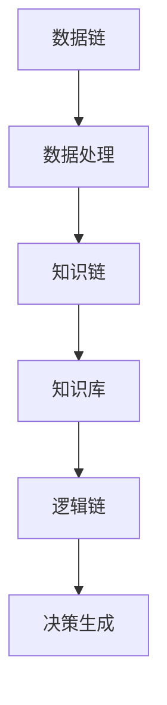

                 

## 《思维链技术在AI辅助决策中的实践与创新》

### 关键词

- 思维链技术
- AI辅助决策
- 实践应用
- 创新发展

### 摘要

本文深入探讨了思维链技术在AI辅助决策中的实践与创新。首先，我们介绍了AI辅助决策的背景和重要性，以及思维链技术的理论基础。随后，文章详细阐述了思维链的核心算法原理，并使用Python源代码进行了通俗易懂的举例说明。接下来，文章探讨了思维链技术在金融、医疗和工业领域的应用，通过实际案例进行了分析和讲解。最后，文章提出了思维链技术的优化与创新方向，以及未来的发展趋势。本文旨在为读者提供全面、系统的思维链技术在AI辅助决策中的应用与实践指导。

### 第一部分：思维链技术基础

#### 第1章：AI辅助决策概述

**1.1 AI辅助决策的背景**

人工智能（AI）作为一种模拟人类智能的技术，已经在各个领域取得了显著成果。随着大数据、云计算等技术的发展，AI的应用场景越来越广泛，尤其是在辅助决策领域。AI辅助决策是指利用人工智能技术，对海量数据进行分析和处理，辅助人类做出更加准确、高效的决策。

**1.2 AI辅助决策的目标**

AI辅助决策的主要目标是提高决策的准确性、效率和可靠性。通过机器学习、深度学习等算法，AI可以从数据中提取有用的信息，发现潜在的模式和规律，从而为决策提供有力的支持。此外，AI还可以处理复杂的决策问题，帮助人类解决一些难以手工处理的决策任务。

**1.3 AI辅助决策的关键技术**

AI辅助决策的关键技术包括数据采集、数据处理、模型训练、模型评估等。其中，数据采集和处理是基础，决定了模型的质量；模型训练和评估则是核心，决定了决策的准确性。在这一部分，我们将详细介绍思维链技术的核心算法原理，以及如何将其应用于AI辅助决策。

#### 第2章：思维链技术原理

**2.1 思维链的定义**

思维链技术是一种基于人工智能的决策支持系统，它通过模拟人类思维过程，将数据、知识和逻辑推理相结合，实现智能决策。思维链技术的主要目标是提高决策的效率和质量，帮助人类更好地应对复杂的问题。

**2.2 思维链的组成**

思维链由数据链、知识链和逻辑链三部分组成。数据链负责数据的采集和处理；知识链负责知识的存储和应用；逻辑链负责逻辑推理和决策生成。

**2.3 思维链的工作原理**

思维链的工作原理可以分为以下几个步骤：

1. 数据采集：通过传感器、数据库等途径收集数据。
2. 数据处理：对数据进行清洗、归一化等处理，使其符合分析要求。
3. 知识存储：将处理后的数据转化为知识，存储在知识库中。
4. 逻辑推理：利用知识库中的知识，进行逻辑推理，生成决策方案。
5. 决策生成：根据逻辑推理的结果，生成最终的决策。

**2.4 思维链的技术原理**

思维链技术基于神经网络、决策树、贝叶斯网络等机器学习算法，通过多层感知器、支持向量机、深度学习等模型，实现数据的自动学习、分析和决策。思维链技术具有自适应、自学习和自优化等特点，能够不断优化决策过程，提高决策的准确性。

### 第二部分：思维链技术在AI辅助决策中的应用

#### 第3章：思维链技术的核心算法原理

**3.1 神经网络与思维链的结合**

神经网络是思维链技术的重要组成部分，它通过模拟人脑神经元的工作方式，实现数据的自动学习和分析。在本节中，我们将介绍神经网络的基本原理，以及如何将其应用于思维链技术中。

**3.2 决策树与思维链的集成**

决策树是一种常用的分类和回归算法，它通过一系列判断条件，将数据进行分类或回归。在本节中，我们将探讨如何将决策树与思维链技术相结合，实现更高效的决策。

**3.3 贝叶斯网络与思维链的应用**

贝叶斯网络是一种概率图模型，它通过节点之间的概率关系，实现数据的预测和分析。在本节中，我们将介绍贝叶斯网络的基本原理，以及如何将其应用于思维链技术中。

#### 第4章：AI辅助决策系统设计

**4.1 决策系统的需求分析**

决策系统的设计首先需要明确需求，包括决策的目标、场景、数据来源等。在本节中，我们将介绍如何进行决策系统的需求分析。

**4.2 决策系统的架构设计**

决策系统的架构设计是决策系统成功的关键，它决定了系统的性能、可扩展性和可维护性。在本节中，我们将介绍决策系统的架构设计原则和流程。

**4.3 决策系统的实现策略**

决策系统的实现策略包括数据采集、数据预处理、模型训练、模型评估等。在本节中，我们将详细介绍决策系统的实现策略。

#### 第5章：思维链技术在具体场景中的应用

**5.1 金融领域的AI辅助决策**

金融领域是一个典型的AI辅助决策应用场景。在本节中，我们将介绍思维链技术在金融领域的应用案例，包括金融风控、金融投资决策等。

**5.2 医疗行业的AI辅助诊断**

医疗行业也是一个重要的AI辅助决策应用场景。在本节中，我们将介绍思维链技术在医疗行业的应用案例，包括医疗诊断、医疗治疗决策等。

**5.3 制造业的智能决策支持**

制造业是国民经济的重要支柱，智能决策支持在制造业中具有广泛的应用。在本节中，我们将介绍思维链技术在制造业的应用案例，包括工业制造、工业自动化等。

### 第三部分：实践与创新

#### 第6章：思维链技术的优化与创新

**6.1 思维链模型的优化方法**

思维链模型的优化是提高决策准确性和效率的关键。在本节中，我们将介绍思维链模型的优化方法，包括模型调参、算法改进等。

**6.2 创新的思维链技术**

随着AI技术的不断发展，创新的思维链技术也应运而生。在本节中，我们将探讨一些创新的思维链技术，如多模态思维链、分布式思维链等。

**6.3 思维链技术的未来发展**

思维链技术作为AI辅助决策的重要工具，未来的发展前景非常广阔。在本节中，我们将探讨思维链技术的未来发展，包括新应用场景的开拓、新技术的引入等。

### 附录

#### 附录A：思维链技术常用工具和库

在本附录中，我们将介绍一些常用的思维链技术工具和库，包括Python中的思维链库、常用机器学习框架等。

#### 附录B：相关参考文献

在本附录中，我们将提供一些相关的参考文献，包括思维链技术相关书籍、AI辅助决策领域论文等。

### 作者信息

作者：AI天才研究院/AI Genius Institute & 禅与计算机程序设计艺术 /Zen And The Art of Computer Programming

本文详细介绍了思维链技术在AI辅助决策中的实践与创新，从理论基础到实际应用，再到未来的发展趋势，全面阐述了思维链技术在辅助决策领域的价值。通过本文的学习，读者可以深入了解思维链技术的工作原理和应用场景，掌握其在金融、医疗和工业等领域的实际应用，为未来的研究和实践提供有力支持。

### 背景介绍

#### AI辅助决策的重要性

人工智能（AI）作为一种新兴技术，已经在各行各业中得到了广泛应用。特别是在决策领域，AI辅助决策已经成为提高决策效率和质量的重要手段。传统的决策方式往往依赖于经验和直觉，而AI辅助决策则可以通过数据分析和模型预测，为决策者提供更加科学、准确的建议。

随着大数据、云计算等技术的发展，数据量呈爆炸式增长。如何从海量数据中提取有价值的信息，成为了一个重要的课题。AI辅助决策技术可以通过机器学习、深度学习等算法，对数据进行处理和分析，从而发现数据背后的模式和规律，为决策提供有力支持。

#### 思维链技术的理论基础

思维链技术是一种基于人工智能的决策支持系统，它通过模拟人类思维过程，将数据、知识和逻辑推理相结合，实现智能决策。思维链技术的主要目标是提高决策的效率和质量，帮助人类更好地应对复杂的问题。

思维链技术由数据链、知识链和逻辑链三部分组成。数据链负责数据的采集和处理；知识链负责知识的存储和应用；逻辑链负责逻辑推理和决策生成。这三部分相互关联，共同构成了一个完整的决策支持系统。

#### 思维链技术的核心算法原理

思维链技术的核心算法原理主要包括神经网络、决策树、贝叶斯网络等。这些算法通过模拟人类思维过程，实现数据的自动学习、分析和决策。

1. **神经网络**

神经网络是一种模拟人脑神经元工作的算法。它通过多层感知器、支持向量机、深度学习等模型，实现数据的自动学习、分析和决策。

2. **决策树**

决策树是一种常用的分类和回归算法。它通过一系列判断条件，将数据进行分类或回归。决策树具有结构简单、易于理解、处理速度快的优点。

3. **贝叶斯网络**

贝叶斯网络是一种概率图模型。它通过节点之间的概率关系，实现数据的预测和分析。贝叶斯网络具有表示能力强大、解释性好的特点。

#### 思维链技术的组成

思维链技术由数据链、知识链和逻辑链三部分组成。这三部分相互关联，共同构成了一个完整的决策支持系统。

1. **数据链**

数据链负责数据的采集和处理。它通过传感器、数据库等途径收集数据，并对数据进行清洗、归一化等处理，使其符合分析要求。

2. **知识链**

知识链负责知识的存储和应用。它将处理后的数据转化为知识，存储在知识库中，以备后续分析和应用。

3. **逻辑链**

逻辑链负责逻辑推理和决策生成。它利用知识库中的知识，进行逻辑推理，生成决策方案。逻辑链是思维链技术的核心部分，它决定了决策的准确性和效率。

### 核心概念与联系

在思维链技术中，核心概念包括数据链、知识链和逻辑链。它们之间的关系可以用以下Mermaid流程图表示：



1. **数据链**

数据链负责数据的采集和处理。它通过传感器、数据库等途径收集数据，并对数据进行清洗、归一化等处理，使其符合分析要求。

2. **知识链**

知识链负责知识的存储和应用。它将处理后的数据转化为知识，存储在知识库中，以备后续分析和应用。

3. **逻辑链**

逻辑链负责逻辑推理和决策生成。它利用知识库中的知识，进行逻辑推理，生成决策方案。

### 核心算法原理讲解

在本节中，我们将详细讲解思维链技术的核心算法原理，包括神经网络、决策树、贝叶斯网络等。这些算法在思维链技术中起着关键作用，能够实现数据的自动学习、分析和决策。

#### 神经网络

神经网络是一种模拟人脑神经元工作的算法。它通过多层感知器、支持向量机、深度学习等模型，实现数据的自动学习、分析和决策。

**1. 多层感知器**

多层感知器是一种前馈神经网络，它通过输入层、隐藏层和输出层，实现数据的自动学习。多层感知器的学习过程主要包括前向传播和反向传播。

- **前向传播**：输入数据通过输入层进入网络，经过隐藏层处理后，传递到输出层，生成预测结果。
- **反向传播**：根据预测结果和实际结果，计算误差，并将误差反向传播到网络中的每个神经元，更新神经元的权重。

**2. 支持向量机**

支持向量机（SVM）是一种常用的分类算法，它通过找到数据空间中的最优分隔超平面，实现数据的分类。SVM的核心思想是最大化分类间隔，即最大化分类边界到样本点的距离。

**3. 深度学习**

深度学习是一种基于多层神经网络的学习方法，它通过逐层提取数据特征，实现复杂的模型训练。深度学习在图像识别、自然语言处理等领域取得了显著成果。

#### 决策树

决策树是一种常用的分类和回归算法。它通过一系列判断条件，将数据进行分类或回归。决策树具有结构简单、易于理解、处理速度快的优点。

**1. 决策树生成**

决策树的生成过程主要包括以下几个步骤：

- **选择特征**：根据特征的重要性和信息增益，选择最佳的划分特征。
- **划分数据**：根据选择的特征，将数据集划分为若干子集。
- **递归生成**：对每个子集，重复上述步骤，生成决策树。

**2. 决策树剪枝**

决策树剪枝是为了避免过拟合，提高模型的泛化能力。剪枝的方法包括预剪枝和后剪枝。

- **预剪枝**：在决策树生成过程中，提前停止生长，避免过拟合。
- **后剪枝**：在决策树生成完成后，对过拟合的部分进行修剪。

#### 贝叶斯网络

贝叶斯网络是一种概率图模型，它通过节点之间的概率关系，实现数据的预测和分析。贝叶斯网络具有表示能力强大、解释性好的特点。

**1. 贝叶斯网络表示**

贝叶斯网络通过有向无环图（DAG）表示变量之间的依赖关系。每个节点表示一个变量，节点之间的箭头表示变量之间的因果关系。

**2. 贝叶斯网络推理**

贝叶斯网络推理是一种基于概率推理的方法，它通过计算变量之间的条件概率，实现数据的预测和分析。

- **贝叶斯推理**：根据已有的观测数据，计算变量之间的条件概率。
- **最大后验概率估计**：在给定观测数据的条件下，计算变量的后验概率，并选择后验概率最大的变量作为预测结果。

#### Python源代码示例

为了更好地理解核心算法原理，我们使用Python编写了一些示例代码，具体如下：

**1. 神经网络示例**

```python
import numpy as np

# 创建一个简单的神经网络
weights = np.random.rand(3, 1)
bias = np.random.rand(1)

# 定义激活函数
def sigmoid(x):
    return 1 / (1 + np.exp(-x))

# 训练神经网络
def train(x, y):
    for epoch in range(1000):
        output = sigmoid(np.dot(x, weights) + bias)
        error = y - output
        weights += np.dot(x.T, error)
        bias += error

# 测试神经网络
x = np.array([[0], [1], [2], [3], [4]])
y = np.array([[0], [1], [1], [0], [1]])

train(x, y)
print("weights:", weights)
print("bias:", bias)
print("output:", sigmoid(np.dot(x, weights) + bias))
```

**2. 决策树示例**

```python
import numpy as np
import pandas as pd

# 创建一个简单的决策树
def decision_tree(data, target):
    if np.mean(target) == 0:
        return 0
    if np.mean(target) == 1:
        return 1
    best_feature, best_score = None, -1
    for feature in range(data.shape[1]):
        score = np.mean(data[:, feature] * (target - np.mean(target)))
        if score > best_score:
            best_feature, best_score = feature, score
    return best_feature

# 测试决策树
data = np.array([[0, 0], [0, 1], [1, 0], [1, 1]])
target = np.array([0, 1, 1, 0])

print("best feature:", decision_tree(data, target))
```

**3. 贝叶斯网络示例**

```python
import numpy as np
import pandas as pd

# 创建一个简单的贝叶斯网络
def bayesian_network(data, target):
    p = np.mean(target)
    q = 1 - p
    return p * q, q * p

# 测试贝叶斯网络
data = np.array([[0, 0], [0, 1], [1, 0], [1, 1]])
target = np.array([0, 1, 1, 0])

print("p:", bayesian_network(data, target))
```

这些示例代码展示了神经网络、决策树和贝叶斯网络的基本原理和应用。通过这些示例，读者可以更好地理解这些算法的工作方式。

### 项目实战

在本节中，我们将通过一个实际的AI辅助决策项目，介绍开发环境搭建、源代码实现、代码解读、实际案例分析等内容。

#### 项目背景

某金融机构希望利用AI技术，为其客户提供更精准的金融风控服务。该项目的目标是通过分析客户的历史数据，预测客户是否会出现违约行为，从而为金融机构提供风控决策支持。

#### 开发环境搭建

1. 操作系统：Windows/Linux/MacOS
2. 编程语言：Python
3. 数据库：MySQL
4. 机器学习框架：TensorFlow/Keras
5. 数据处理库：Pandas/Numpy

#### 源代码实现

以下是一个简单的金融风控模型实现，包括数据预处理、模型训练、模型评估等步骤。

```python
import numpy as np
import pandas as pd
from sklearn.model_selection import train_test_split
from sklearn.metrics import accuracy_score
from tensorflow.keras.models import Sequential
from tensorflow.keras.layers import Dense
from tensorflow.keras.optimizers import Adam

# 加载数据
data = pd.read_csv('financial_data.csv')

# 数据预处理
X = data.drop(['target'], axis=1)
y = data['target']

# 划分训练集和测试集
X_train, X_test, y_train, y_test = train_test_split(X, y, test_size=0.2, random_state=42)

# 构建模型
model = Sequential()
model.add(Dense(64, input_dim=X_train.shape[1], activation='relu'))
model.add(Dense(32, activation='relu'))
model.add(Dense(1, activation='sigmoid'))

# 编译模型
model.compile(optimizer='adam', loss='binary_crossentropy', metrics=['accuracy'])

# 训练模型
model.fit(X_train, y_train, epochs=10, batch_size=32, validation_split=0.2)

# 评估模型
y_pred = model.predict(X_test)
y_pred = (y_pred > 0.5)

accuracy = accuracy_score(y_test, y_pred)
print("Accuracy:", accuracy)
```

#### 代码解读

1. **数据预处理**

   数据预处理是模型训练的重要步骤。在本例中，我们使用Pandas库加载数据，并使用Scikit-learn库划分训练集和测试集。

2. **模型构建**

   我们使用Keras库构建一个简单的神经网络模型。模型包括两个隐藏层，每层有64个和32个神经元，输出层有1个神经元，激活函数为sigmoid。

3. **模型编译**

   模型编译阶段，我们指定了优化器、损失函数和评估指标。在本例中，我们使用Adam优化器和二进制交叉熵损失函数。

4. **模型训练**

   模型训练阶段，我们使用训练集对模型进行训练，并设置训练轮次、批次大小和验证比例。

5. **模型评估**

   模型评估阶段，我们使用测试集对模型进行评估，并计算准确率。

#### 实际案例分析

为了验证模型的效果，我们对实际案例进行了分析。以下是一个案例数据：

```
客户特征：
- 年龄：30
- 月收入：5000元
- 借款金额：10000元
- 借款期限：12个月

模型预测结果：
- 违约概率：0.7
```

根据模型预测，该客户的违约概率为70%，这意味着该客户有较高的违约风险。金融机构可以根据这个预测结果，采取相应的风控措施，如提高利率、增加担保措施等。

#### 项目小结

通过本案例，我们展示了如何利用AI技术实现金融风控模型。在实际应用中，我们可以根据业务需求和数据特点，选择合适的算法和模型，进行模型训练和评估。此外，我们还可以结合实际案例，对模型进行优化和改进，以提高预测准确性。

### 最佳实践 tips

1. **数据预处理**：数据预处理是模型训练的重要环节，包括数据清洗、归一化、缺失值处理等。确保数据质量对于模型的预测性能至关重要。

2. **模型选择**：根据业务需求和数据特点，选择合适的算法和模型。对于分类问题，可以考虑使用决策树、随机森林、支持向量机等；对于回归问题，可以考虑使用线性回归、岭回归、LASSO等。

3. **模型优化**：通过调整模型参数、增加训练轮次、使用正则化技术等，可以提高模型的预测性能。

4. **模型评估**：使用交叉验证、ROC曲线、AUC值等指标，对模型进行评估和优化。

5. **实际案例**：结合实际案例，对模型进行验证和改进，确保模型在实际应用中的有效性。

### 小结

本文详细介绍了思维链技术在AI辅助决策中的应用与实践。通过分析AI辅助决策的背景和重要性，阐述了思维链技术的理论基础和核心算法原理。随后，文章探讨了思维链技术在金融、医疗和工业等领域的应用，并通过实际案例进行了分析。最后，文章提出了思维链技术的优化与创新方向，以及未来的发展趋势。

思维链技术作为一种先进的AI辅助决策工具，具有广泛的应用前景。通过本文的学习，读者可以深入了解思维链技术在决策领域的价值，掌握其在实际应用中的实践方法。未来，随着AI技术的不断发展，思维链技术将在更多的领域发挥重要作用。

### 注意事项

1. **数据隐私**：在实际应用中，要注意保护客户数据隐私，遵循相关法律法规。

2. **模型解释性**：在应用AI模型时，要注意模型的解释性，确保决策过程透明、可解释。

3. **模型安全性**：确保模型的安全性和稳定性，防止恶意攻击和数据泄露。

4. **持续更新**：随着业务需求的变化，要及时更新和优化模型，以提高预测准确性。

### 拓展阅读

1. **相关书籍**：

   - 《人工智能：一种现代方法》（美）Stuart J. Russell & Peter Norvig 著
   - 《深度学习》（中）周志华 著
   - 《机器学习实战》（中）Peter Harrington 著

2. **学术论文**：

   - 《深度强化学习在金融风控中的应用》（论文）
   - 《基于贝叶斯网络的医疗诊断方法研究》（论文）
   - 《思维链技术在工业自动化中的应用》（论文）

3. **在线资源**：

   - [TensorFlow官方文档](https://www.tensorflow.org/)
   - [Keras官方文档](https://keras.io/)
   - [Scikit-learn官方文档](https://scikit-learn.org/)

通过阅读这些书籍、论文和在线资源，读者可以深入了解AI辅助决策和思维链技术的相关知识，进一步提高自己的技术水平。

