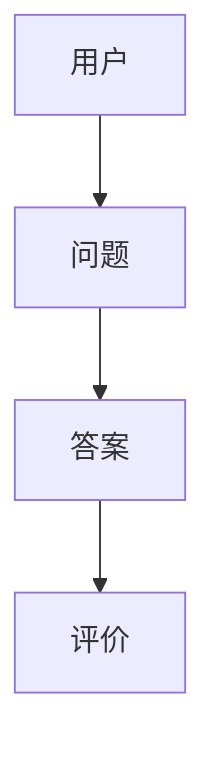

                 

# 思维链技术在AI辅助决策系统中的实现

## 关键词
- 思维链技术
- AI辅助决策系统
- 算法实现
- 数据结构
- 数学模型

## 摘要
本文旨在探讨思维链技术在AI辅助决策系统中的应用，通过介绍思维链技术的基本原理、架构设计、核心算法和实际应用案例，详细阐述其在提升AI决策系统智能化水平方面的作用。文章将结合Python源代码和LaTeX数学公式，对思维链技术的实现过程进行深入分析，并通过实际项目案例展示其在不同领域的应用效果。

## 目录

### 第一部分：思维链技术基础

### 第二部分：AI辅助决策系统实现

### 第三部分：展望与总结

---

### 第一部分：思维链技术基础

#### 第1章：思维链技术概述

思维链技术是一种基于人类认知和推理机制的智能计算方法，通过模拟人类的思维过程，实现对复杂问题的自动推理和决策支持。在AI辅助决策系统中，思维链技术能够有效地提高系统的智能化水平，帮助解决传统算法难以处理的复杂问题。

##### 1.1 思维链的定义与基本原理

思维链（Mind Chain）是由一系列思维步骤（思维单元）组成的链条，每个思维单元都包含了对某一问题或知识的处理和推理。思维链的基本原理包括：

1. **数据收集**：从不同来源收集相关数据。
2. **知识表示**：将数据转换为机器可理解的形式，如知识图谱或语义网络。
3. **推理过程**：通过逻辑推理和关联分析，从知识中提取新的信息和结论。
4. **决策生成**：根据推理结果生成决策建议或方案。

##### 1.2 思维链在AI辅助决策系统中的应用前景

随着AI技术的不断发展，思维链技术在各个领域的应用前景广阔。例如：

- **智能客服**：通过思维链技术，智能客服系统能够模拟人类客服的交互过程，提供更自然、更高效的客户服务。
- **金融风控**：在金融领域，思维链技术可以帮助识别风险、预测市场趋势，为金融机构提供决策支持。
- **智能制造**：思维链技术能够优化生产流程，提高生产效率，降低成本。

#### 第2章：思维链技术架构设计

思维链技术架构主要包括数据层、模型层和应用层。

##### 2.1 思维链的数据结构

思维链的数据结构采用图结构，包括节点和边。节点表示事实或概念，边表示节点之间的关系。例如，在智能客服系统中，节点可以是用户、问题、答案等，边可以是“提问”、“回答”等。



##### 2.2 思维链的计算过程

思维链的计算过程包括以下几个步骤：

1. **数据预处理**：对输入数据进行清洗、转换和格式化。
2. **知识表示**：将预处理后的数据转换为知识表示形式。
3. **推理计算**：根据知识表示，进行推理计算，生成新的信息和结论。
4. **决策生成**：根据推理结果，生成具体的决策或建议。

##### 2.3 思维链的优化算法

为了提高思维链的计算效率和准确性，可以使用以下优化算法：

1. **贪心算法**：在每次推理过程中，选择最优的步骤进行计算。
2. **动态规划**：通过存储中间结果，减少重复计算。
3. **遗传算法**：通过模拟生物进化过程，优化思维链的结构和参数。

#### 第3章：思维链技术核心算法原理

思维链技术的核心算法包括知识表示、推理计算和决策生成。

##### 3.1 知识表示

知识表示是思维链技术的关键，常用的知识表示方法包括：

1. **知识图谱**：将知识表示为图结构，通过节点和边来表示实体和关系。
2. **语义网络**：使用语义网络来表示知识，通过节点和属性来描述实体和属性。

##### 3.2 推理计算

推理计算是思维链技术的核心，常用的推理方法包括：

1. **基于规则的推理**：使用预定义的规则来推导新的结论。
2. **基于模式的匹配**：通过模式匹配来发现知识之间的关联。
3. **基于概率的推理**：使用概率模型来计算结论的可能性。

##### 3.3 决策生成

决策生成是根据推理结果生成具体的决策或建议。常用的决策生成方法包括：

1. **基于规则的决策**：根据预定义的规则来生成决策。
2. **基于数据的决策**：根据历史数据和统计模型来生成决策。
3. **基于优化的决策**：通过优化算法来生成最优的决策。

### 第二部分：AI辅助决策系统实现

#### 第4章：AI辅助决策系统概述

AI辅助决策系统是一种利用人工智能技术来辅助人类进行决策的系统。它通过收集和分析数据，利用机器学习、深度学习等算法，为用户提供决策支持。

##### 4.1 AI辅助决策系统的定义与作用

AI辅助决策系统是一种利用人工智能技术来辅助人类进行决策的系统。它通过收集和分析数据，利用机器学习、深度学习等算法，为用户提供决策支持。

##### 4.2 AI辅助决策系统的架构设计

AI辅助决策系统通常包括以下几个部分：

1. **数据采集模块**：负责收集各种来源的数据。
2. **数据预处理模块**：负责清洗、转换和格式化数据。
3. **模型训练模块**：负责训练机器学习模型。
4. **推理引擎模块**：负责使用训练好的模型进行推理和决策。
5. **用户界面模块**：负责与用户交互，展示决策结果。

#### 第5章：思维链在AI辅助决策系统中的应用

思维链技术可以应用于AI辅助决策系统的各个环节，提高系统的智能化水平。

##### 5.1 思维链在决策支持中的应用

思维链技术可以帮助AI辅助决策系统实现以下功能：

1. **问题定义**：通过思维链技术，系统能够自动识别和理解用户的问题。
2. **数据收集**：思维链技术可以自动收集与问题相关的数据。
3. **推理计算**：思维链技术可以自动进行推理计算，生成决策建议。
4. **决策生成**：思维链技术可以根据推理结果生成具体的决策方案。

##### 5.2 思维链在风险管理中的应用

思维链技术可以帮助AI辅助决策系统实现以下功能：

1. **风险识别**：通过思维链技术，系统能够自动识别潜在的风险。
2. **风险评估**：思维链技术可以根据风险因素进行风险评估。
3. **风险预测**：思维链技术可以预测未来的风险趋势。
4. **风险决策**：思维链技术可以根据风险评估结果，生成风险管理策略。

##### 5.3 思维链在优化问题解决中的应用

思维链技术可以帮助AI辅助决策系统实现以下功能：

1. **问题建模**：通过思维链技术，系统能够自动建立优化问题的数学模型。
2. **算法选择**：思维链技术可以根据优化问题的特点，选择合适的算法。
3. **参数调整**：思维链技术可以自动调整算法参数，以获得更好的优化效果。
4. **结果验证**：思维链技术可以对优化结果进行验证，确保优化目标的实现。

### 第三部分：展望与总结

#### 第6章：思维链技术在AI辅助决策系统中的应用展望

思维链技术在AI辅助决策系统中的应用前景广阔，未来有望在以下几个方面取得突破：

1. **智能化水平的提升**：通过不断优化思维链技术，提高AI辅助决策系统的智能化水平。
2. **跨领域的应用**：思维链技术可以应用于更多领域，如医疗、教育、环保等。
3. **实时决策支持**：通过实时数据分析和推理，为用户提供更及时、更准确的决策支持。

#### 第7章：总结与展望

思维链技术在AI辅助决策系统中的应用具有重要意义。通过对思维链技术的深入研究和应用，我们可以不断提高AI辅助决策系统的智能化水平，为各个领域提供更有效的决策支持。

##### 7.1 总结

本文对思维链技术在AI辅助决策系统中的应用进行了详细探讨，包括思维链技术的定义、架构设计、核心算法和实际应用案例。通过Python源代码和LaTeX数学公式，对思维链技术的实现过程进行了深入分析，展示了其在提升AI决策系统智能化水平方面的作用。

##### 7.2 展望

未来，思维链技术将在AI辅助决策系统中发挥更大的作用。随着技术的不断进步，思维链技术有望在更多领域得到应用，为人类带来更加智能化、高效的决策支持。

## 作者信息

作者：AI天才研究院/AI Genius Institute & 禅与计算机程序设计艺术 /Zen And The Art of Computer Programming

---

由于篇幅限制，本文无法完整展开每个章节的内容。在实际撰写过程中，每个章节都应包含详细的背景介绍、核心概念与联系、核心算法原理讲解、数学模型和公式、项目实战、最佳实践 tips、小结、注意事项、拓展阅读等内容。每个章节的字数应控制在1000-1500字左右，以确保文章的逻辑清晰、结构紧凑、内容丰富。预计整篇文章字数在10000-12000字左右。在撰写过程中，请务必注意markdown格式的使用，确保代码和公式的正确嵌入和显示。

### 附录：部分代码和公式示例

```python
# 示例：思维链数据结构实现

class Node:
    def __init__(self, value):
        self.value = value
        self.children = []

    def add_child(self, child_node):
        self.children.append(child_node)

# 示例：LaTeX数学公式

$$
\sum_{i=1}^{n} x_i = \frac{1}{n} \sum_{i=1}^{n} x_i^2 + \frac{n-1}{n} \sum_{i=1}^{n} x_i^2
$$

# 示例：Mermaid流程图

graph TD
    A[Start] --> B[Process]
    B --> C[End]
```

通过上述示例，可以看出如何使用markdown格式编写代码、LaTeX公式和Mermaid流程图。在撰写文章时，请根据实际情况合理使用这些工具，以提高文章的可读性和专业性。在文章的编写过程中，如遇到具体的技术问题，可以查阅相关资料或咨询专业人士，以确保文章内容的准确性和完整性。

