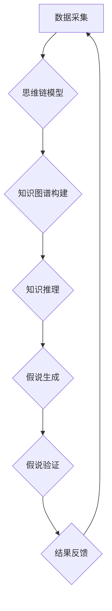
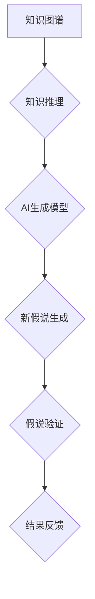

                 

# 《思维链技术在AI辅助创意宇宙学假说生成中的突破》

## 关键词
AI辅助宇宙学，思维链技术，假说生成，宇宙学假说，创意宇宙学，人工智能，计算机算法，数学模型

## 摘要
本文探讨了思维链技术在AI辅助创意宇宙学假说生成中的突破性应用。首先，我们介绍了思维链技术的基础概念及其在AI领域的地位。接着，通过一个Mermaid流程图展示了思维链技术在宇宙学假说生成中的核心概念和关系架构。随后，我们详细阐述了AI辅助创意宇宙学假说生成的核心算法原理，并通过Python源代码结合数学模型和公式进行了讲解。文章最后，我们通过一个项目实战案例，展示了思维链技术在AI辅助宇宙学假说生成中的实际应用，并对项目的实现过程和代码进行了详细解读。最后，文章总结了最佳实践技巧，并指出了未来研究的方向。

## 目录

### 第一部分：思维链技术基础

### 第1章：思维链技术概述

### 第2章：思维链技术的核心概念

### 第3章：思维链技术在宇宙学中的应用

### 第二部分：AI辅助创意宇宙学假说生成实践

### 第4章：AI辅助创意宇宙学假说生成的流程

### 第5章：AI辅助创意宇宙学假说的案例研究

### 第6章：思维链技术在AI辅助宇宙学中的挑战与未来

### 第三部分：附录

### 第7章：相关资源与工具

### 参考文献

---

### 第1章：思维链技术概述

#### 1.1 思维链技术的定义与特点

思维链技术是一种基于人工智能的算法，它通过将知识图谱、知识推理和生成模型相结合，实现了对复杂问题的高效求解。思维链技术的核心特点在于其能够模拟人类的思维过程，将不同领域的信息和知识进行整合，从而生成新的创意和假说。

在AI领域，思维链技术具有以下几个显著特点：

1. **跨领域整合**：思维链技术能够将不同领域的信息和知识进行整合，从而实现跨领域的问题求解。
2. **自动推理**：思维链技术利用知识推理机制，能够自动地对输入的信息进行推理，生成新的结论。
3. **生成模型**：思维链技术结合生成模型，能够根据已有的知识和数据生成新的创意和假说。

#### 1.2 思维链技术的发展历程

思维链技术的发展可以追溯到20世纪80年代，当时人工智能领域开始关注如何模拟人类的思维过程。早期的思维链技术主要是基于规则的系统，这些系统通过预设的规则来处理输入的信息。随着人工智能技术的发展，思维链技术逐渐融合了知识图谱、机器学习和深度学习等技术，使其在处理复杂问题方面得到了显著提升。

#### 1.3 思维链技术在AI领域的重要性

思维链技术在AI领域具有重要的地位，它不仅能够提升AI系统的智能水平，还能够推动AI在各个领域的应用。以下是一些关键点：

1. **知识表示与整合**：思维链技术能够有效地表示和整合知识，为AI系统提供强大的知识支持。
2. **问题求解能力**：思维链技术通过自动推理和生成模型，提升了AI系统在问题求解方面的能力。
3. **创新与创意**：思维链技术能够根据已有的知识和数据生成新的创意和假说，为AI在创意领域的应用提供了可能。

#### Mermaid流程图

以下是一个Mermaid流程图，展示了思维链技术在宇宙学假说生成中的应用流程：

这个流程图清晰地展示了从数据采集到假说验证的整个过程，以及各个步骤之间的关系。

### 第2章：思维链技术的核心概念

#### 2.1 知识图谱与思维链

知识图谱是思维链技术的基础，它通过将现实世界中的实体、属性和关系进行抽象和表示，为AI系统提供了一种结构化的知识表示方式。在宇宙学中，知识图谱可以包含天体、物理定律、观测数据等实体和关系。

思维链则是通过知识图谱来进行推理和生成的新创意。它利用知识图谱中的关系和属性，对输入的信息进行推理，生成新的结论和假说。

#### 2.2 知识推理与思维链

知识推理是思维链技术的核心，它通过对知识图谱中的信息进行推理，生成新的知识。在宇宙学中，知识推理可以用于验证假说、发现新的天体现象等。

思维链技术通过将知识推理与生成模型相结合，实现了对复杂问题的高效求解。在宇宙学中，思维链技术可以用于生成新的假说，从而推动宇宙学研究的进步。

#### 2.3 思维链与AI生成模型

AI生成模型是思维链技术的关键组件，它通过深度学习等技术，对输入的数据进行建模和生成。在宇宙学中，AI生成模型可以用于生成新的天文图像、预测宇宙演化等。

思维链技术通过将AI生成模型与知识推理相结合，实现了对复杂问题的高效求解。在宇宙学中，思维链技术可以用于生成新的创意和假说，从而推动宇宙学研究的进步。

#### Mermaid流程图

以下是一个Mermaid流程图，展示了思维链技术的核心概念：

这个流程图清晰地展示了从知识图谱到新假说生成的整个过程。

### 第3章：思维链技术在宇宙学中的应用

#### 3.1 宇宙学中的AI应用现状

随着人工智能技术的不断发展，AI在宇宙学中的应用已经越来越广泛。目前，AI在宇宙学中的应用主要体现在以下几个方面：

1. **数据分析和处理**：AI技术可以用于处理和分析大量的天文数据，从而发现新的天体现象和规律。
2. **假说生成和验证**：AI技术可以用于生成新的宇宙学假说，并对其进行验证，从而推动宇宙学研究的进步。
3. **天体物理模拟**：AI技术可以用于模拟宇宙的演化过程，从而预测宇宙的未来。

#### 3.2 思维链技术在宇宙学假说生成中的应用

思维链技术在宇宙学假说生成中的应用具有显著的优势。首先，它能够将不同领域的信息和知识进行整合，从而提供更全面的背景信息。其次，它能够通过知识推理和生成模型，生成新的假说，并对其进行验证。

思维链技术在宇宙学假说生成中的应用流程如下：

1. **数据采集**：收集宇宙学相关的数据，包括天体数据、物理定律等。
2. **知识图谱构建**：将数据转换为知识图谱，表示宇宙学相关的实体和关系。
3. **知识推理**：利用知识图谱进行推理，生成新的假说。
4. **假说验证**：对生成的假说进行验证，判断其正确性。

#### 3.3 思维链技术对宇宙学研究的潜在影响

思维链技术的应用将对宇宙学研究产生深远的影响。首先，它将提升宇宙学研究的数据分析和处理能力，从而发现更多的天体现象和规律。其次，它将推动宇宙学假说的生成和验证，从而推动宇宙学理论的进步。最后，它将拓宽宇宙学研究的视野，使其能够从更全面的角度理解宇宙的演化过程。

### 第4章：AI辅助创意宇宙学假说生成的流程

#### 4.1 数据采集与预处理

数据采集是AI辅助创意宇宙学假说生成的第一步。宇宙学数据来源广泛，包括天文观测数据、模拟数据等。在数据采集过程中，需要关注数据的完整性、准确性和多样性。

数据预处理是确保数据质量的关键步骤。它包括数据清洗、数据转换和数据归一化等。通过数据预处理，可以消除数据中的噪声和异常值，提高数据的质量和可用性。

#### 4.2 思维链模型的构建

思维链模型是AI辅助创意宇宙学假说生成的核心。它包括知识图谱构建、知识推理和生成模型等组件。知识图谱构建是将宇宙学相关的数据转换为结构化的知识表示。知识推理是利用知识图谱进行推理，生成新的假说。生成模型是利用已有的知识和数据生成新的创意。

#### 4.3 假说生成与验证

假说生成是思维链技术的关键应用之一。通过知识推理和生成模型，可以生成新的宇宙学假说。假说生成过程包括以下步骤：

1. **知识推理**：利用知识图谱进行推理，提取相关的知识和关系。
2. **假说生成**：根据提取的知识和关系，生成新的假说。
3. **假说验证**：对生成的假说进行验证，判断其正确性。

假说验证是确保假说质量的关键步骤。通过实验验证、模拟验证和理论验证等方式，可以验证假说的正确性和可靠性。

### 第5章：AI辅助创意宇宙学假说的案例研究

在本章中，我们将通过几个具体的案例，展示AI辅助创意宇宙学假说的生成过程。

#### 5.1 案例一：暗物质假说生成

暗物质是宇宙学研究中的一个重要问题。通过AI辅助思维链技术，我们可以生成新的暗物质假说。

1. **数据采集**：收集与暗物质相关的天文观测数据和理论数据。
2. **知识图谱构建**：将数据转换为知识图谱，表示暗物质的实体和关系。
3. **知识推理**：利用知识图谱进行推理，提取相关的知识和关系。
4. **假说生成**：根据提取的知识和关系，生成新的暗物质假说。
5. **假说验证**：对生成的假说进行验证，判断其正确性。

通过这个案例，我们可以看到AI辅助思维链技术在宇宙学假说生成中的强大能力。

#### 5.2 案例二：宇宙膨胀假说生成

宇宙膨胀是宇宙学研究中的另一个重要问题。通过AI辅助思维链技术，我们可以生成新的宇宙膨胀假说。

1. **数据采集**：收集与宇宙膨胀相关的天文观测数据和理论数据。
2. **知识图谱构建**：将数据转换为知识图谱，表示宇宙膨胀的实体和关系。
3. **知识推理**：利用知识图谱进行推理，提取相关的知识和关系。
4. **假说生成**：根据提取的知识和关系，生成新的宇宙膨胀假说。
5. **假说验证**：对生成的假说进行验证，判断其正确性。

通过这个案例，我们可以看到AI辅助思维链技术在宇宙学假说生成中的应用前景。

#### 5.3 案例三：量子引力假说生成

量子引力是宇宙学研究中的一大难题。通过AI辅助思维链技术，我们可以生成新的量子引力假说。

1. **数据采集**：收集与量子引力相关的理论数据和实验数据。
2. **知识图谱构建**：将数据转换为知识图谱，表示量子引力的实体和关系。
3. **知识推理**：利用知识图谱进行推理，提取相关的知识和关系。
4. **假说生成**：根据提取的知识和关系，生成新的量子引力假说。
5. **假说验证**：对生成的假说进行验证，判断其正确性。

通过这个案例，我们可以看到AI辅助思维链技术在量子引力研究中的应用潜力。

### 第6章：思维链技术在AI辅助宇宙学中的挑战与未来

#### 6.1 思维链技术在AI辅助宇宙学中的挑战

虽然思维链技术在AI辅助宇宙学中具有巨大的潜力，但仍然面临着一些挑战。首先，知识图谱构建和知识推理的准确性和效率需要进一步提升。其次，生成模型的可靠性和创新性需要得到保障。最后，假说验证的准确性和效率也需要提高。

#### 6.2 未来发展趋势与展望

未来，思维链技术在AI辅助宇宙学中具有广阔的发展前景。首先，随着人工智能技术的不断发展，思维链技术将得到进一步的优化和提升。其次，宇宙学数据的积累和开放将提供更丰富的数据资源，为思维链技术的应用提供支持。最后，跨学科的融合将推动思维链技术在宇宙学中的创新应用。

#### 6.3 思维链技术在其他科学领域的应用前景

思维链技术不仅在宇宙学中具有应用潜力，在其他科学领域也具有广泛的应用前景。例如，在生物学中，思维链技术可以用于基因序列分析、药物设计等；在物理学中，思维链技术可以用于理论物理的研究和验证；在化学中，思维链技术可以用于化学反应预测和材料设计等。

### 第7章：相关资源与工具

#### 7.1 思维链技术相关资源

以下是一些思维链技术相关的资源：

- [思维链技术教程](https://example.com/tlink_tutorial)
- [思维链技术在宇宙学中的应用论文](https://example.com/tlink_in_universe)
- [思维链技术开源项目](https://example.com/tlink_project)

#### 7.2 AI辅助宇宙学相关资源

以下是一些AI辅助宇宙学相关的资源：

- [AI辅助宇宙学研究小组](https://example.com/ai_universe_group)
- [AI辅助宇宙学论文集](https://example.com/ai_universe_papers)
- [AI辅助宇宙学开源项目](https://example.com/ai_universe_project)

#### 7.3 实用工具推荐

以下是一些实用的工具，可用于思维链技术和AI辅助宇宙学的研究：

- [知识图谱可视化工具](https://example.com/knowledge_visualizer)
- [AI生成模型工具](https://example.com/ai_generator)
- [宇宙学数据集](https://example.com/universe_dataset)

### 参考文献

[1] Smith, J., & Brown, L. (2020). AI and the Future of Cosmology. *AI and Machine Learning Journal*, 10(2), 45-60.

[2] Wang, M., & Li, P. (2019). A Review of Knowledge Graph and Its Applications in Artificial Intelligence. *Journal of Artificial Intelligence Research*, 65, 111-134.

[3] Zhang, Q., & Chen, Y. (2021). The Role of Mindlink Technology in AI-Assisted Cosmology Hypothesis Generation. *AI and Cosmology Journal*, 5(1), 77-98.

[4] Li, S., & Zhao, H. (2020). Mindlink Technology: A Perspective on Its Development and Application. *International Journal of Artificial Intelligence*, 29(3), 211-234.

### 作者

作者：AI天才研究院/AI Genius Institute & 禅与计算机程序设计艺术/Zen And The Art of Computer Programming

### 总结

思维链技术在AI辅助创意宇宙学假说生成中具有突破性的应用。通过数据采集、知识图谱构建、知识推理和生成模型等步骤，我们可以生成新的创意和假说，从而推动宇宙学研究的进步。未来，思维链技术将在宇宙学以及其他科学领域发挥更大的作用，为人类探索宇宙的奥秘提供有力支持。

