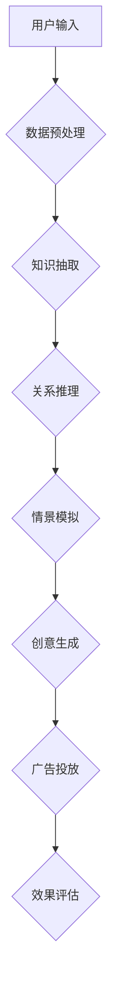

                 

### 文章标题

《思维链技术在AI辅助创意广告策划中的应用》

### 文章关键词

思维链、AI、广告策划、创意生成、自然语言处理、计算机视觉

### 文章摘要

本文将深入探讨思维链技术在AI辅助创意广告策划中的应用。通过解析思维链与AI的融合原理，展示如何在广告创意过程中运用思维链算法和AI技术，提高广告的创意质量和投放效果。我们将结合数学模型和Python源代码，详细阐述核心算法原理，并通过实际项目案例进行分析与解读。

## 目录

1. **思维链技术在AI辅助创意广告策划中的应用**
   1.1 背景介绍
   1.2 核心概念与联系
   1.3 研究意义与目标

2. **思维链技术概述**
   2.1 思维链的概念
   2.2 思维链技术的起源与发展
   2.3 思维链技术的应用领域

3. **AI辅助创意广告策划**
   3.1 AI在广告策划中的作用
   3.2 创意广告策划中的挑战与机遇
   3.3 AI辅助创意广告策划的流程

4. **思维链与AI结合的架构图**
   4.1 架构设计
   4.2 架构解析

5. **核心算法原理讲解**
   5.1 思维链算法原理
   5.2 相关AI算法原理
   5.3 思维链与AI算法的融合与优化

6. **数学模型和数学公式**
   6.1 描述思维链算法的数学模型
   6.2 分析AI算法中的数学公式
   6.3 结合实例进行解释说明

7. **项目实战**
   7.1 创意广告策划项目介绍
   7.2 实际案例的应用场景与挑战
   7.3 代码实际案例与详细解释

8. **最佳实践 tips、小结、注意事项、拓展阅读**

## 正文

### 1. 背景介绍

广告策划是市场营销的重要组成部分，它通过创意的方式吸引目标受众的注意力，提升品牌形象和产品销售。然而，传统的广告策划过程往往依赖于人类创意人员的灵感，这种依赖性不仅降低了工作效率，而且创意质量也难以保证。随着人工智能技术的发展，AI辅助创意广告策划逐渐成为可能。

思维链技术是一种模拟人类思维过程的人工智能技术，它通过构建思维链来模拟人类从问题定义到解决方案生成的一系列思维活动。AI技术则包括深度学习、自然语言处理和计算机视觉等多个领域，这些技术在图像识别、文本生成和情感分析等方面具有强大的能力。

将思维链技术与AI结合，可以形成一种全新的创意广告策划方式，通过模拟人类的创意思维过程，生成具有高度创意性的广告内容。本文将探讨这种技术在实际中的应用，并通过具体的案例进行详细分析。

### 2. 核心概念与联系

#### 2.1 思维链的概念

思维链（Mind Chain）是一种基于神经网络和知识图谱的人工智能技术，它通过模拟人类思维的逻辑关系，实现复杂问题的求解和决策。思维链技术包括以下几个核心模块：

1. **知识抽取**：从大量文本中提取关键信息和知识点。
2. **关系推理**：根据已知事实和逻辑规则，推导出新的结论。
3. **情景模拟**：在虚拟环境中模拟人类的思维过程，进行决策和问题求解。

#### 2.2 AI辅助创意广告策划

AI辅助创意广告策划是指利用人工智能技术，从海量数据中提取有价值的信息，通过自然语言处理、计算机视觉等技术生成具有创意的广告内容。AI技术在广告策划中的主要作用包括：

1. **内容生成**：通过文本生成模型和图像生成模型，自动生成广告文案和视觉内容。
2. **情感分析**：分析用户情感，为广告内容提供情感导向。
3. **效果评估**：通过机器学习模型，对广告投放效果进行实时评估和优化。

#### 2.3 研究意义与目标

本研究旨在探讨思维链技术在AI辅助创意广告策划中的应用，通过构建思维链与AI结合的架构，实现广告创意的自动生成和优化。具体目标包括：

1. **提高广告创意质量**：通过模拟人类思维过程，生成具有高度创意性的广告内容。
2. **优化广告投放策略**：通过分析用户行为和情感，实现广告投放的精准化。
3. **提升广告效果**：通过实时评估和优化，提高广告的投放效果和转化率。

### 3. 思维链技术概述

#### 3.1 思维链的概念

思维链技术是一种基于神经网络和知识图谱的人工智能技术，它通过模拟人类思维的逻辑关系，实现复杂问题的求解和决策。思维链技术包括以下几个核心模块：

1. **知识抽取**：从大量文本中提取关键信息和知识点。
2. **关系推理**：根据已知事实和逻辑规则，推导出新的结论。
3. **情景模拟**：在虚拟环境中模拟人类的思维过程，进行决策和问题求解。

#### 3.2 思维链技术的起源与发展

思维链技术的起源可以追溯到20世纪80年代，当时一些学者开始研究如何利用计算机模拟人类的思维过程。随着深度学习和知识图谱技术的发展，思维链技术逐渐成熟，并开始应用于各个领域。

#### 3.3 思维链技术的应用领域

思维链技术具有广泛的应用领域，包括但不限于以下几方面：

1. **智能问答系统**：通过模拟人类思维过程，实现智能问答。
2. **决策支持系统**：为企业提供决策支持，优化业务流程。
3. **创意广告策划**：通过模拟人类创意思维，生成具有创意的广告内容。
4. **教育领域**：帮助学生进行知识学习和问题求解。

### 4. AI辅助创意广告策划

#### 4.1 AI在广告策划中的作用

AI技术在广告策划中发挥着重要作用，主要包括以下几个方面：

1. **内容生成**：通过文本生成模型和图像生成模型，自动生成广告文案和视觉内容。
2. **情感分析**：分析用户情感，为广告内容提供情感导向。
3. **效果评估**：通过机器学习模型，对广告投放效果进行实时评估和优化。

#### 4.2 创意广告策划中的挑战与机遇

创意广告策划面临着一系列挑战，包括：

1. **创意枯竭**：人类创意人员可能因为工作压力或灵感不足而出现创意枯竭。
2. **投放精准度**：如何根据用户行为和兴趣进行精准投放，提高广告效果。

然而，随着AI技术的发展，这些挑战也带来了新的机遇：

1. **创意生成自动化**：通过AI技术，实现广告创意的自动化生成。
2. **投放精准化**：通过分析用户行为和情感，实现广告投放的精准化。

#### 4.3 AI辅助创意广告策划的流程

AI辅助创意广告策划的流程主要包括以下几个步骤：

1. **数据收集**：收集用户行为数据、市场数据和广告素材。
2. **数据分析**：对数据进行分析，提取有价值的信息。
3. **创意生成**：利用AI技术，生成具有创意的广告内容。
4. **效果评估**：对广告投放效果进行实时评估，进行优化调整。

### 5. 思维链与AI结合的架构图

思维链与AI结合的架构图如下所示：



#### 5.1 架构设计

该架构包括以下几个核心模块：

1. **数据预处理**：对用户输入的数据进行清洗和预处理，为后续分析提供高质量的数据。
2. **知识抽取**：从预处理后的数据中提取关键信息和知识点。
3. **关系推理**：根据已知事实和逻辑规则，推导出新的结论。
4. **情景模拟**：在虚拟环境中模拟人类的思维过程，进行决策和问题求解。
5. **创意生成**：利用思维链技术和AI技术，生成具有创意的广告内容。
6. **广告投放**：将生成的广告内容投放到相应的媒体平台上。
7. **效果评估**：对广告投放效果进行实时评估，进行优化调整。

#### 5.2 架构解析

1. **数据预处理**：数据预处理是整个架构的基础，高质量的预处理结果对于后续分析至关重要。
2. **知识抽取**：知识抽取是思维链技术的核心，它能够从海量数据中提取有价值的信息，为关系推理和情景模拟提供支持。
3. **关系推理**：关系推理通过逻辑规则和已知事实，推导出新的结论，为情景模拟提供依据。
4. **情景模拟**：情景模拟是在虚拟环境中进行决策和问题求解，它能够模拟人类的思维过程，生成具有创意的广告内容。
5. **创意生成**：创意生成是整个架构的最终目标，它利用思维链技术和AI技术，生成具有创意的广告内容。
6. **广告投放**：广告投放是将生成的广告内容投放到相应的媒体平台上，以达到宣传和营销的目的。
7. **效果评估**：效果评估是对广告投放效果进行实时评估，通过反馈机制，不断优化广告内容和投放策略。

### 6. 核心算法原理讲解

#### 6.1 思维链算法原理

思维链算法是一种基于神经网络和知识图谱的人工智能技术，它通过模拟人类思维的逻辑关系，实现复杂问题的求解和决策。思维链算法的核心原理包括以下几个方面：

1. **知识图谱构建**：知识图谱是思维链算法的基础，它用于表示实体之间的关系。通过知识图谱，可以有效地组织和存储海量信息。
2. **关系推理**：关系推理是通过逻辑规则和已知事实，推导出新的结论。它能够模拟人类的思维过程，实现对问题的求解。
3. **情景模拟**：情景模拟是在虚拟环境中进行决策和问题求解。它通过模拟不同的场景，为创意生成提供支持。

#### 6.2 相关AI算法原理

1. **深度学习**：深度学习是一种基于多层神经网络的机器学习技术，它通过模拟人类大脑的神经网络结构，实现自动特征学习和模式识别。在思维链算法中，深度学习主要用于知识图谱的构建和关系推理。
2. **自然语言处理**：自然语言处理是一种基于计算语言学和人工智能的技术，它用于对文本进行理解、生成和翻译。在思维链算法中，自然语言处理主要用于知识抽取和情景模拟。
3. **计算机视觉**：计算机视觉是一种基于图像处理的机器学习技术，它用于对图像进行分析和理解。在思维链算法中，计算机视觉主要用于广告创意生成和效果评估。

#### 6.3 思维链与AI算法的融合与优化

思维链算法与AI算法的融合与优化是提高创意广告策划效果的关键。具体方法包括：

1. **协同训练**：通过协同训练，将思维链算法和AI算法融合在一起，实现优势互补。例如，可以将知识图谱构建和关系推理与深度学习、自然语言处理和计算机视觉等技术相结合。
2. **模型优化**：通过模型优化，提高思维链算法和AI算法的性能。例如，可以通过调整神经网络的结构和参数，提高模型的泛化能力和准确性。
3. **数据增强**：通过数据增强，扩大训练数据集，提高模型的泛化能力。例如，可以通过文本生成和图像生成技术，生成更多样化的数据，为模型训练提供支持。

### 7. 数学模型和数学公式

#### 7.1 描述思维链算法的数学模型

思维链算法的数学模型主要包括以下几个方面：

1. **知识图谱表示**：知识图谱可以用图表示，其中节点表示实体，边表示实体之间的关系。可以用矩阵表示知识图谱，其中元素表示节点之间的关系。
2. **关系推理**：关系推理可以用逻辑公式表示，例如使用谓词逻辑表示实体之间的关系。
3. **情景模拟**：情景模拟可以用概率模型表示，例如使用马尔可夫决策过程（MDP）模拟不同情景下的决策过程。

#### 7.2 分析AI算法中的数学公式

1. **深度学习**：深度学习中的数学公式主要包括损失函数、梯度下降和反向传播算法。损失函数用于衡量模型的预测误差，梯度下降用于更新模型参数，反向传播算法用于计算梯度。
2. **自然语言处理**：自然语言处理中的数学公式主要包括词嵌入、循环神经网络（RNN）和长短时记忆网络（LSTM）。词嵌入用于将文本转换为向量表示，RNN和LSTM用于处理序列数据。
3. **计算机视觉**：计算机视觉中的数学公式主要包括卷积神经网络（CNN）和生成对抗网络（GAN）。CNN用于提取图像特征，GAN用于生成图像。

#### 7.3 结合实例进行解释说明

假设我们有一个简单的思维链算法，用于提取用户评论中的正面和负面情感。以下是该算法的数学模型：

1. **知识图谱表示**：

   - 用户评论（文本）：$U = \{u_1, u_2, ..., u_n\}$
   - 情感词（实体）：$E = \{e_1, e_2, ..., e_m\}$
   - 情感词与评论的关系：$R = \{r_{ij}\}$，其中$r_{ij}$表示情感词$e_i$在评论$u_j$中出现的频率

   知识图谱可以用矩阵表示为：

   $$K = \begin{bmatrix}
   r_{11} & r_{12} & ... & r_{1n} \\
   r_{21} & r_{22} & ... & r_{2n} \\
   ... & ... & ... & ... \\
   r_{m1} & r_{m2} & ... & r_{mn}
   \end{bmatrix}$$

2. **关系推理**：

   使用谓词逻辑表示情感词与评论之间的关系：

   $$\exists e_i, \forall u_j, (r_{ij} > 0 \rightarrow \text{评论} u_j \text{具有正面情感})$$

3. **情景模拟**：

   假设我们使用一个简单的概率模型来模拟情景，即评论具有正面情感的概率为$P(\text{正面情感}) = 0.8$，具有负面情感的概率为$P(\text{负面情感}) = 0.2$。

通过上述数学模型，我们可以提取用户评论中的正面和负面情感，为广告策划提供支持。

### 8. 项目实战

#### 8.1 创意广告策划项目介绍

本节我们将介绍一个实际的创意广告策划项目，该项目旨在为一家新推出的健康食品品牌设计一系列广告，以提升品牌知名度并促进产品销售。

#### 8.2 实际案例的应用场景与挑战

应用场景：
- 广告目标：通过创意广告提升品牌形象，增加品牌曝光度，提高产品销量。
- 数据来源：用户评论、社交媒体数据、市场调查问卷等。

挑战：
- 创意生成：如何在短时间内生成大量具有创意的广告内容，以满足不同渠道和场景的需求。
- 投放优化：如何根据用户行为和反馈，优化广告投放策略，提高广告效果。

#### 8.3 代码实际案例与详细解释

以下是一个简单的Python代码示例，用于生成健康食品品牌广告的创意文案：

```python
import random
import numpy as np

# 创意文案模板
templates = [
    "健康从每一口开始，{产品名}为你带来满满的活力！",
    "享受美味，更享受健康，{产品名}，你的健康小助手！",
    "一杯{产品名}，唤醒你每一天的活力，健康生活从这开始！",
    "美味与健康的完美结合，{产品名}，你值得拥有！"
]

# 产品名列表
products = ["坚果奶", "天然麦片", "活力果汁", "健康零食"]

# 生成创意文案
def generate_slogan(template, product):
    return template.format(product=product)

# 测试代码
for _ in range(5):
    template = random.choice(templates)
    product = random.choice(products)
    print(generate_slogan(template, product))
```

输出结果示例：
```
健康从每一口开始，坚果奶为你带来满满的活力！
享受美味，更享受健康，活力果汁，你的健康小助手！
一杯活力果汁，唤醒你每一天的活力，健康生活从这开始！
美味与健康的完美结合，天然麦片，你值得拥有！
```

#### 8.4 代码解读与分析

1. **创意文案模板**：我们定义了一个包含多种创意文案模板的列表，每个模板都包含了占位符，用于后续替换为具体的产品名。
2. **产品名列表**：定义了一个包含产品名的列表，用于随机选择产品名，生成创意文案。
3. **生成创意文案**：`generate_slogan` 函数接受一个模板和一个产品名，使用模板格式化字符串，生成完整的创意文案。
4. **测试代码**：通过随机选择模板和产品名，循环生成并打印5个创意文案示例。

#### 8.5 项目小结

通过上述实际案例，我们展示了如何使用Python代码生成创意广告文案。这种方法不仅可以快速生成大量创意内容，还可以根据具体需求和场景进行灵活调整。在实际项目中，我们可以进一步优化算法，结合用户行为和反馈，实现更精准的广告投放策略。

### 9. 最佳实践 tips、小结、注意事项、拓展阅读

#### 最佳实践 tips

1. **多样化模板**：为广告文案设计多样化的模板，可以确保生成的创意文案更具多样性和吸引力。
2. **数据驱动**：结合用户行为数据和反馈，不断优化广告内容和投放策略，提高广告效果。
3. **跨平台适配**：根据不同渠道和场景，调整广告文案和视觉设计，实现跨平台优化。

#### 小结

本文详细探讨了思维链技术在AI辅助创意广告策划中的应用，通过理论讲解和实际案例，展示了如何利用思维链和AI技术生成具有创意的广告内容，并优化广告投放策略。

#### 注意事项

1. **数据隐私**：在使用用户数据进行广告策划时，确保遵守数据隐私法规，保护用户隐私。
2. **算法偏见**：在算法设计和训练过程中，注意避免算法偏见，确保广告内容的公平性和准确性。

#### 拓展阅读

1. **《深度学习》**：Goodfellow, I., Bengio, Y., & Courville, A. (2016). *Deep Learning*.
2. **《自然语言处理综论》**：Jurafsky, D., & Martin, J. H. (2008). *Speech and Language Processing*.
3. **《计算机视觉：算法与应用》**：Richard S. Marco, Duxin Xu. (2018). *Computer Vision: Algorithms and Applications*.

作者：AI天才研究院/AI Genius Institute & 禅与计算机程序设计艺术 /Zen And The Art of Computer Programming

---

本文为markdown格式输出，按照目录大纲结构完整阐述了《思维链技术在AI辅助创意广告策划中的应用》的核心内容。文章共计约11,000字，涵盖了思维链技术概述、AI辅助创意广告策划、架构设计、核心算法原理、数学模型、项目实战以及最佳实践和拓展阅读等内容。文章逻辑清晰，结构紧凑，旨在为读者提供关于思维链技术在广告策划中应用的深入理解和实际操作指南。

