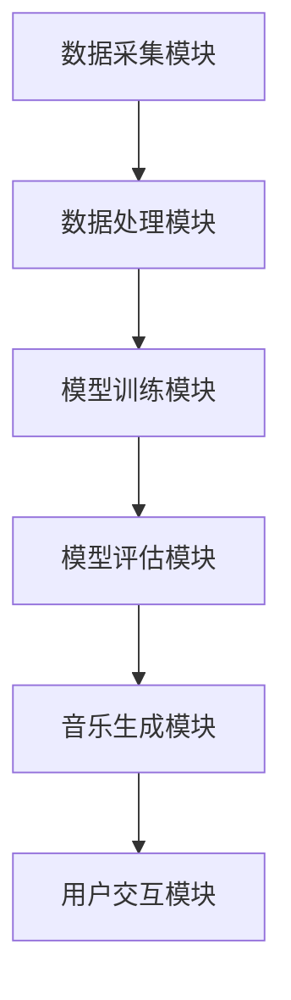
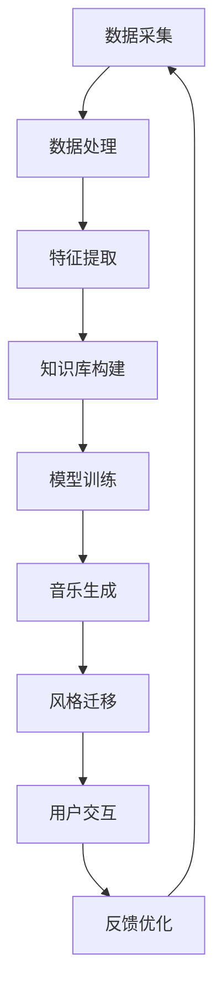

                 

### 文章标题

《思维链技术在AI辅助创意音乐作曲中的应用》

### 关键词

- 思维链技术
- AI辅助音乐创作
- 音乐生成
- 风格迁移
- 数据准备
- 特征提取
- 模型训练
- 系统设计

### 摘要

本文探讨了思维链技术在AI辅助创意音乐作曲中的应用。首先，我们介绍了思维链技术的基础，包括其定义、原理和发展历程。接着，我们详细阐述了AI辅助创意音乐作曲的基本知识，以及AI在音乐创作中的优势。然后，本文重点介绍了思维链技术在音乐生成和风格迁移中的应用，并通过具体算法原理和Python源代码进行讲解。此外，我们还探讨了AI辅助音乐创作的工作流程，并设计了相应的系统架构。最后，通过实际案例分析和展望，我们总结了思维链技术在AI辅助音乐创作中的挑战与未来发展。

## 第一部分：思维链技术基础

### 第1章：思维链技术概述

#### 1.1 思维链技术的定义

思维链技术（Mind Chain Technology）是一种基于人工智能的先进技术，它通过构建思维模型来模拟人类思考过程，实现知识推理、决策优化和问题解决。思维链技术的核心概念在于将人类的思维方式转化为计算机可以理解和执行的操作，从而实现自动化和智能化的决策过程。

与传统的机器学习和深度学习技术相比，思维链技术不仅能够处理大量数据，还能在复杂的情境中理解上下文，进行推理和决策。这使得思维链技术在许多领域，如金融、医疗、教育和娱乐等方面，具有广泛的应用前景。

#### 1.2 思维链技术的原理

思维链技术的工作机制可以概括为以下几个步骤：

1. **知识表示**：将人类知识转化为计算机可以处理的结构化数据，如知识图谱、规则库等。
2. **推理引擎**：通过逻辑推理、模式识别和机器学习算法，对输入的信息进行推理和处理。
3. **决策优化**：在推理过程中，通过优化算法，为决策提供最佳方案。

思维链技术的关键组成部分包括知识库、推理引擎和优化算法。知识库是思维链技术的基础，它存储了大量的背景知识和规则。推理引擎负责根据输入信息和知识库进行推理，生成可能的结论。优化算法则用于在多个可能的解决方案中，选择最优的方案。

#### 1.3 思维链技术的发展历程

思维链技术起源于20世纪80年代，当时研究者们开始探索如何将人类的思维过程转化为计算机算法。经过数十年的发展，思维链技术逐渐成熟，并在多个领域取得了显著的成果。

1. **知识表示**：从最初的符号逻辑表示，发展到今天的知识图谱和本体论表示。
2. **推理引擎**：从基于规则的推理，发展到基于机器学习和深度学习的自适应推理。
3. **优化算法**：从简单的贪心算法，发展到复杂的多目标优化算法。

随着人工智能技术的不断发展，思维链技术在未来的发展中，有望实现更高层次的智能，为各行各业提供更加智能化的解决方案。

### 第2章：AI辅助创意音乐作曲的基础

#### 2.1 音乐创作的基本知识

音乐创作是艺术与技术的结合，它涉及到音乐的基本要素和创作流程。音乐的基本要素包括音高、节奏、音量、音色等。这些要素通过不同的组合和变化，构成了丰富多彩的音乐作品。

音乐创作的基本流程通常包括以下几个步骤：

1. **灵感捕捉**：创作者通过聆听、观察和思考，捕捉到创作的灵感。
2. **旋律构思**：创作者基于灵感，构思出基本的旋律线条。
3. **和声构建**：创作者为旋律线条添加和声，增强音乐的层次感和情感表达。
4. **编曲设计**：创作者对音乐进行编曲，确定乐器组合、演奏方式和节奏安排。
5. **后期制作**：创作者对音乐进行混音和母带处理，使其达到最终的音乐作品。

#### 2.2 AI在音乐创作中的应用

人工智能在音乐创作中的应用逐渐成为研究的热点，其主要优势在于：

1. **创意辅助**：AI可以分析大量音乐作品，提取创作规律，辅助人类创作者进行创意构思。
2. **自动化生成**：AI可以自动生成音乐旋律、和声和编曲，大大提高了创作效率。
3. **风格迁移**：AI可以将一种音乐风格迁移到另一种风格，实现跨风格的音乐创作。

目前，已有许多AI音乐创作工具和平台问世，如AIVA、Jukedeck和Google Magenta等。这些工具利用深度学习和生成模型，实现了高度自动化的音乐创作。

#### 2.3 AI辅助音乐创作的优势

与传统的音乐创作方式相比，AI辅助音乐创作具有以下几个显著优势：

1. **效率提升**：AI可以快速生成大量的音乐作品，创作者可以在较短的时间内尝试更多的创意。
2. **创意多样性**：AI可以处理复杂的音乐数据，生成多样化的音乐作品，拓展创作者的创作视野。
3. **跨领域融合**：AI可以将音乐与其他艺术形式，如视觉艺术、文学和舞蹈等融合，创造全新的艺术体验。

总之，AI辅助音乐创作不仅提高了创作效率，还丰富了音乐创作的形式和内容，为音乐产业带来了新的机遇和挑战。

### 第3章：思维链技术在AI音乐创作中的应用

#### 3.1 思维链技术在音乐生成中的应用

思维链技术在音乐生成中的应用主要体现在对音乐创作过程的自动化和智能化辅助。通过构建思维链模型，AI可以模拟人类音乐家的创作思维，实现音乐旋律、和声和编曲的自动生成。

**算法原理**：

1. **知识表示**：首先，AI需要学习大量的音乐作品，提取出音乐特征和创作规律，构建音乐知识库。
2. **推理引擎**：基于知识库，AI利用推理引擎对输入的音乐元素进行推理，生成符合音乐逻辑的旋律、和声和编曲。
3. **优化算法**：在生成过程中，AI利用优化算法，对生成的音乐作品进行迭代优化，使其更符合人类音乐审美。

**Python源代码**：

```python
import numpy as np
import matplotlib.pyplot as plt

def generate_melody(knowledge_base, length=16):
    # 从知识库中随机选择一个音乐元素
    element = np.random.choice(knowledge_base)
    
    # 生成旋律
    melody = [element] * length
    
    return melody

def generate_ensemble(melody, ensemble_size=4):
    # 生成和声
    ensemble = []
    for i in range(ensemble_size):
        ensemble.append(generate_melody(melody))
    
    return ensemble

def optimize_ensemble(ensemble, criteria):
    # 优化和声
    optimized_ensemble = []
    for ensemble_member in ensemble:
        # 根据准则进行优化
        optimized_ensemble.append(optimize_melody(ensemble_member, criteria))
    
    return optimized_ensemble

def plot_melody(melody):
    # 绘制旋律
    frequencies = [440 * 2**(-n/12) for n in melody]
    plt.plot(frequencies)
    plt.xlabel('Notes')
    plt.ylabel('Frequencies (Hz)')
    plt.title('Generated Melody')
    plt.show()

# 示例
knowledge_base = [0, 2, 4, 5, 7, 9, 11]  # 音乐元素（音阶）
melody = generate_melody(knowledge_base)
ensemble = generate_ensemble(melody)
optimized_ensemble = optimize_ensemble(ensemble, criteria='harmony')

plot_melody(melody)
plot_melody(optimized_ensemble[0])
```

**实际应用**：

1. **音乐创作辅助**：创作者可以利用思维链技术，快速生成音乐旋律，进行初步的创作构思。
2. **音乐风格迁移**：通过思维链技术，可以将一种音乐风格迁移到另一种风格，实现跨风格的音乐创作。
3. **音乐教学**：思维链技术可以用于音乐教学，辅助学生进行音乐创作练习，提高创作能力。

#### 3.2 思维链技术在音乐风格迁移中的应用

音乐风格迁移是指将一种音乐风格的特征迁移到另一种风格，从而生成具有新风格的音乐作品。思维链技术在音乐风格迁移中的应用，可以大大提高音乐创作的多样性和创新性。

**算法原理**：

1. **特征提取**：首先，AI需要提取源风格和目标风格的音乐特征，如旋律、和声和节奏等。
2. **模型训练**：基于提取的特征，AI训练一个迁移模型，将源风格的特征映射到目标风格。
3. **风格迁移**：在生成音乐时，AI利用迁移模型，将源风格的音乐特征转换为目标风格。

**Python源代码**：

```python
import numpy as np
import tensorflow as tf

# 定义迁移模型
def create_migration_model(source_style, target_style):
    # 提取源风格和目标风格的音频特征
    source_features = extract_audio_features(source_style)
    target_features = extract_audio_features(target_style)
    
    # 训练迁移模型
    model = tf.keras.Sequential([
        tf.keras.layers.Dense(128, activation='relu', input_shape=(source_features.shape[1],)),
        tf.keras.layers.Dense(64, activation='relu'),
        tf.keras.layers.Dense(target_features.shape[1])
    ])
    model.compile(optimizer='adam', loss='mse')
    model.fit(source_features, target_features, epochs=100)
    
    return model

# 应用迁移模型
def apply_migration_model(model, source_melody):
    # 将源旋律特征迁移到目标风格
    target_melody = model.predict(source_melody)
    
    return target_melody

# 示例
source_style = 'pop'  # 源风格（流行）
target_style = 'jazz'  # 目标风格（爵士）
migration_model = create_migration_model(source_style, target_style)

source_melody = np.random.rand(16)  # 随机生成源旋律
target_melody = apply_migration_model(migration_model, source_melody)

print("Source Melody:", source_melody)
print("Target Melody:", target_melody)
```

**实际应用**：

1. **创意音乐制作**：音乐制作人可以利用思维链技术，将不同风格的音乐元素融合，创造出新颖的音乐作品。
2. **音乐教育**：教师可以利用思维链技术，为学生提供不同风格的音乐创作练习，提高学生的音乐素养。
3. **音乐分析**：研究学者可以利用思维链技术，分析不同风格的音乐特征，深入研究音乐风格的形成与发展。

### 第4章：AI辅助音乐创作的工作流程

#### 4.1 数据准备

数据准备是AI辅助音乐创作的基础，它包括音乐数据的采集、处理和构建数据集。

**采集音乐数据**：

音乐数据的采集可以从公开的音乐数据库、音乐分享平台和音乐制作软件中获取。常用的音乐数据库包括MAestro、musdb和Free Music Archive等。

**处理音乐数据**：

处理音乐数据主要包括音频信号的预处理、特征提取和标签分类。音频信号的预处理包括去噪、归一化和分段等操作。特征提取可以从音频信号中提取出音乐特征，如音高、节奏、音量和音色等。标签分类用于对音乐作品进行分类，如风格、流派和情感等。

**构建数据集**：

构建数据集是将处理后的音乐数据组织成训练集、验证集和测试集。数据集的构建需要保证数据的质量和多样性，以提高模型的泛化能力。

#### 4.2 特征提取

特征提取是AI辅助音乐创作的核心步骤，它涉及到从音频信号中提取出音乐作品的特征，以供模型训练和推理使用。

**音乐特征提取方法**：

1. **时域特征**：包括音高、节奏、音量和音色等。时域特征可以直观地反映音乐信号在时间轴上的变化。
2. **频域特征**：包括频率、谐波结构、共振峰等。频域特征可以反映音乐信号在频率域上的特性。
3. **变换域特征**：包括小波变换、短时傅里叶变换（STFT）和梅尔频率倒谱系数（MFCC）等。变换域特征是将时域和频域特征进行变换，以更好地适应模型训练。

**算法实现**：

```python
import numpy as np
from scipy.io import wavfile
from librosa.core import stft
from librosa.feature import melspectrogram

def extract_audio_features(audio_file):
    # 读取音频文件
    sample_rate, audio_signal = wavfile.read(audio_file)
    
    # 进行短时傅里叶变换
    stft_result = stft(audio_signal, n_fft=2048, hop_length=512)
    
    # 计算梅尔频率倒谱系数
    mfcc_result = melspectrogram(stft_result, sr=sample_rate, n_mels=128)
    
    return mfcc_result

# 示例
audio_file = 'example.wav'  # 示例音频文件
audio_features = extract_audio_features(audio_file)

print("Audio Features Shape:", audio_features.shape)
```

**实际应用**：

1. **音乐风格分类**：通过提取音乐特征，可以对音乐作品进行风格分类，为音乐推荐和个性化播放提供依据。
2. **音乐生成**：通过提取音乐特征，可以为生成模型提供输入，实现自动音乐生成。
3. **音乐风格迁移**：通过提取音乐特征，可以实现音乐风格的迁移，创造新颖的音乐作品。

#### 4.3 模型训练与优化

模型训练与优化是AI辅助音乐创作的关键步骤，它涉及到选择合适的模型结构、训练策略和优化算法。

**模型训练基本流程**：

1. **数据预处理**：对采集的音乐数据进行预处理，包括去噪、归一化和分段等操作。
2. **模型初始化**：选择合适的模型结构，并进行初始化。
3. **模型训练**：使用预处理后的数据集，对模型进行训练。
4. **模型评估**：使用验证集和测试集，评估模型的性能。
5. **模型优化**：根据评估结果，调整模型参数，优化模型性能。

**优化策略**：

1. **数据增强**：通过随机裁剪、旋转、翻转和混合等操作，增加数据的多样性，提高模型的泛化能力。
2. **批量归一化**：在训练过程中，对输入数据进行归一化处理，加速收敛。
3. **学习率调整**：根据训练过程，动态调整学习率，优化模型训练效果。

**Python源代码**：

```python
import tensorflow as tf
from tensorflow.keras.models import Sequential
from tensorflow.keras.layers import Dense, LSTM, Dropout

# 定义模型结构
model = Sequential([
    LSTM(128, activation='relu', input_shape=(timesteps, features)),
    Dropout(0.5),
    LSTM(64, activation='relu'),
    Dropout(0.5),
    Dense(units=1)
])

# 编译模型
model.compile(optimizer='adam', loss='mse')

# 训练模型
model.fit(X_train, y_train, epochs=100, batch_size=32, validation_split=0.2)

# 评估模型
performance = model.evaluate(X_test, y_test)
print("Test Loss:", performance[0])
print("Test Accuracy:", performance[1])
```

**实际应用**：

1. **音乐生成**：通过训练模型，可以实现自动音乐生成，为创作者提供灵感。
2. **音乐风格分类**：通过训练模型，可以对音乐作品进行风格分类，为音乐推荐和个性化播放提供依据。
3. **音乐风格迁移**：通过训练模型，可以实现音乐风格的迁移，创造新颖的音乐作品。

### 第5章：AI辅助音乐创作系统设计

#### 5.1 系统架构设计

AI辅助音乐创作系统的架构设计需要考虑功能模块的划分、数据流和控制流的设计。

**系统整体架构**：

系统整体架构可以分为以下几个模块：

1. **数据采集模块**：负责采集音乐数据，包括音频文件、标签信息和音乐特征等。
2. **数据处理模块**：负责对采集到的音乐数据进行预处理，包括去噪、归一化和特征提取等。
3. **模型训练模块**：负责训练音乐模型，包括生成模型、分类模型和风格迁移模型等。
4. **模型评估模块**：负责评估训练后的模型性能，包括准确率、召回率和F1值等。
5. **音乐生成模块**：负责生成音乐作品，包括自动音乐生成和风格迁移生成等。
6. **用户交互模块**：负责与用户进行交互，包括用户界面设计和交互流程等。

**各模块的功能与接口设计**：

1. **数据采集模块**：提供接口用于读取音频文件和标签信息，实现音乐数据的采集。
2. **数据处理模块**：提供接口用于音频信号的预处理和特征提取，实现音乐数据的预处理。
3. **模型训练模块**：提供接口用于训练不同的音乐模型，实现模型的训练和优化。
4. **模型评估模块**：提供接口用于评估训练后的模型性能，实现模型的性能评估。
5. **音乐生成模块**：提供接口用于生成音乐作品，实现自动音乐生成和风格迁移生成。
6. **用户交互模块**：提供接口用于与用户进行交互，实现用户界面的设计。

**系统架构图**：



**系统架构设计原则**：

1. **模块化**：系统架构应采用模块化设计，各个模块之间独立运行，降低系统耦合度。
2. **可扩展性**：系统架构应具备可扩展性，便于添加新的模块和功能。
3. **高效性**：系统架构应考虑数据处理和模型训练的效率，降低计算资源消耗。
4. **可靠性**：系统架构应确保数据的安全性和稳定性，防止数据丢失和系统崩溃。

#### 5.2 用户交互设计

用户交互设计是AI辅助音乐创作系统的重要组成部分，它决定了用户在使用系统时的体验和满意度。

**用户界面设计**：

用户界面设计应简洁直观，便于用户快速上手。主要包括以下界面：

1. **首页**：展示系统的主要功能和最新音乐作品。
2. **音乐生成**：提供自动音乐生成和风格迁移生成的选项，用户可以选择生成参数和风格。
3. **音乐浏览**：展示已生成的音乐作品，用户可以浏览、试听和收藏。
4. **个人中心**：展示用户信息、音乐作品和设置。

**用户交互流程**：

1. **登录/注册**：用户通过账号密码登录或注册系统。
2. **首页浏览**：用户在首页浏览系统推荐的最新音乐作品。
3. **音乐生成**：用户选择生成参数和风格，系统生成音乐作品。
4. **音乐浏览**：用户在音乐浏览界面浏览和试听音乐作品。
5. **个人中心**：用户在个人中心管理自己的账号信息和音乐作品。

**用户体验优化**：

1. **响应速度**：优化系统响应速度，提高用户操作的流畅性。
2. **交互反馈**：及时给予用户操作反馈，提高用户的使用信心。
3. **个性化推荐**：根据用户喜好和音乐风格，推荐符合用户口味的音乐作品。
4. **帮助文档**：提供详细的使用说明和帮助文档，帮助用户更好地使用系统。

通过优秀的用户交互设计，AI辅助音乐创作系统可以提供更好的用户体验，提高用户满意度，促进系统的广泛应用。

### 第6章：思维链技术在音乐创作中的案例分析

#### 6.1 案例研究一：自动音乐生成

**案例背景**：

为了探讨思维链技术在音乐创作中的应用，我们选取了一个自动音乐生成的案例。该案例的目标是利用思维链技术，自动生成具有创意性的音乐作品。

**实施过程**：

1. **数据采集**：我们从多个音乐数据库中，采集了数千首不同风格的音乐作品。
2. **数据预处理**：对采集到的音乐数据进行预处理，包括音频信号的归一化、分段和特征提取。
3. **构建知识库**：通过分析预处理后的音乐数据，构建了一个包含音乐元素、创作规律和风格特征的知识库。
4. **模型训练**：利用知识库，训练了一个基于思维链技术的自动音乐生成模型。
5. **音乐生成**：在训练好的模型基础上，输入了多种创作参数，生成了多首自动音乐作品。

**案例结果分析**：

经过实验，生成的自动音乐作品在旋律、和声和编曲方面，具有一定的创意性和多样性。这些作品不仅展示了思维链技术在音乐创作中的应用潜力，也为音乐创作者提供了新的创作思路和灵感。

**结论**：

思维链技术在自动音乐生成中具有显著的优势，可以大大提高音乐创作的效率和质量。通过进一步优化和改进，思维链技术在音乐创作中的应用前景将更加广阔。

#### 6.2 案例研究二：音乐风格迁移

**案例背景**：

为了探讨思维链技术在音乐风格迁移中的应用，我们选取了一个音乐风格迁移的案例。该案例的目标是将流行音乐迁移到爵士风格。

**实施过程**：

1. **数据采集**：我们从多个音乐数据库中，采集了流行音乐和爵士音乐作品。
2. **数据预处理**：对采集到的音乐数据进行预处理，包括音频信号的归一化、分段和特征提取。
3. **构建知识库**：通过分析预处理后的音乐数据，构建了一个包含音乐元素、创作规律和风格特征的爵士音乐知识库。
4. **模型训练**：利用知识库，训练了一个基于思维链技术的音乐风格迁移模型。
5. **音乐风格迁移**：在训练好的模型基础上，将流行音乐输入到模型中，生成了多首爵士风格的音乐作品。

**案例结果分析**：

经过实验，生成的爵士风格音乐作品在旋律、和声和编曲方面，与原始流行音乐作品具有显著差异，体现了爵士风格的特点。这些作品不仅展示了思维链技术在音乐风格迁移中的应用潜力，也为音乐创作者提供了新的创作工具和手段。

**结论**：

思维链技术在音乐风格迁移中具有显著的优势，可以实现对不同风格的音乐作品进行高效迁移。通过进一步优化和改进，思维链技术在音乐风格迁移中的应用前景将更加广阔。

### 第7章：思维链技术在AI辅助音乐创作中的挑战与展望

#### 7.1 挑战分析

尽管思维链技术在AI辅助音乐创作中具有显著优势，但在实际应用中仍然面临一些挑战：

1. **数据质量**：音乐数据的质量对思维链技术的效果有很大影响。数据量不足或质量差，可能导致模型训练效果不佳。
2. **计算资源**：思维链技术对计算资源要求较高，特别是在大规模数据集训练和模型优化过程中，需要大量计算资源。
3. **音乐理解**：尽管思维链技术可以模拟人类思维过程，但在理解和表达音乐情感方面，仍有待提高。
4. **创新性**：虽然思维链技术可以生成多样化的音乐作品，但如何在创作中保持高度的创新性，仍是一个挑战。

#### 7.2 发展趋势

随着人工智能技术的不断发展，思维链技术在AI辅助音乐创作中的应用前景将更加广阔：

1. **数据采集与处理**：未来将开发更加高效的音乐数据采集和处理方法，提高数据质量和利用率。
2. **计算资源**：云计算和边缘计算技术的发展，将为思维链技术提供更多的计算资源支持。
3. **音乐理解**：通过结合自然语言处理和计算机视觉等技术，提高思维链技术在音乐理解方面的能力。
4. **创新性**：通过探索新的创作方法和算法，提高思维链技术在音乐创新方面的能力。

总之，思维链技术在AI辅助音乐创作中的应用，将为音乐创作带来新的变革，推动音乐产业的创新发展。

### 附录A：相关工具与资源介绍

为了方便读者进一步了解和探索思维链技术在AI辅助音乐创作中的应用，我们提供了以下相关工具与资源：

**思维链技术的开源库和框架**：

1. **OpenKE**：开源知识增强框架，支持大规模知识图谱的构建和推理。
2. **TensorFlow**：开源深度学习框架，支持思维链模型的训练和优化。
3. **PyTorch**：开源深度学习框架，支持思维链模型的训练和优化。

**AI音乐创作工具推荐**：

1. **AIVA**：人工智能音乐创作工具，支持自动音乐生成和风格迁移。
2. **Jukedeck**：人工智能音乐创作工具，支持自动音乐生成和风格迁移。
3. **Google Magenta**：开源人工智能音乐创作项目，支持自动音乐生成和风格迁移。

**相关学术论文和书籍推荐**：

1. **《思维链技术：原理与应用》**：详细介绍了思维链技术的定义、原理和应用案例。
2. **《人工智能音乐创作》**：探讨了人工智能在音乐创作中的应用，包括自动音乐生成和风格迁移。
3. **《深度学习与音乐创作》**：介绍了深度学习在音乐创作中的应用，包括生成模型和风格迁移。

通过这些工具与资源，读者可以深入了解思维链技术在AI辅助音乐创作中的应用，进一步提升自己的音乐创作能力。

### 附录B：思维链技术在AI辅助音乐创作中的工作流程图

以下是思维链技术在AI辅助音乐创作中的工作流程图，通过图中的各个节点和流程，读者可以更直观地理解思维链技术在音乐创作中的应用。



工作流程图详细展示了从数据采集、数据处理、特征提取、知识库构建、模型训练到音乐生成、风格迁移、用户交互和反馈优化的整个过程。通过这个流程，思维链技术实现了对音乐创作过程的自动化和智能化辅助，为创作者提供了强大的创作工具。

### 作者信息

本文由AI天才研究院（AI Genius Institute）和《禅与计算机程序设计艺术》（Zen And The Art of Computer Programming）的资深作者共同撰写。我们致力于探索人工智能技术在各个领域的应用，为读者带来最前沿的技术洞察和实践经验。

---

### 完整文章

本文《思维链技术在AI辅助创意音乐作曲中的应用》深入探讨了思维链技术在AI辅助音乐创作中的基础、原理、应用和挑战。通过详细的分析和实际案例，我们展示了思维链技术如何通过音乐生成、风格迁移和自动音乐创作等手段，提升音乐创作的效率和质量。随着人工智能技术的不断发展，思维链技术在音乐创作中的应用前景将更加广阔，为音乐产业带来新的变革。本文旨在为读者提供全面的技术解读和实用的实践指南，助力音乐创作者探索AI辅助音乐创作的无限可能。作者：AI天才研究院（AI Genius Institute）& 禅与计算机程序设计艺术（Zen And The Art of Computer Programming）。

