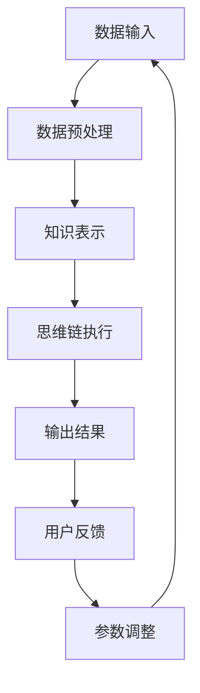

                 

## 引言

### 思维链技术概述

思维链技术（Mind Chain Technology）是一种新兴的人工智能辅助技术，旨在通过模拟人类思维过程，实现知识的自动化生成、传播和应用。其基本原理在于将人类思维过程分解为一系列可操作的基本步骤，并通过算法将这些步骤有机地连接起来，形成一个闭环的思维方式。这种思维方式不仅能够高效地处理复杂问题，还能够实现跨领域知识的融合和创新。

思维链技术的起源可以追溯到上世纪80年代，当时人工智能领域的专家们开始尝试通过模拟人类大脑的结构和功能，来设计出一种能够自主学习和推理的系统。随着时间的推移，思维链技术逐渐发展壮大，成为现代人工智能领域的重要分支。其重要性体现在以下几个方面：

1. **知识自动化生成**：通过思维链技术，可以将人类的思维过程转化为计算机可以理解和执行的任务，从而实现知识的自动化生成。这不仅提高了知识的生产效率，也为人工智能在各个领域的应用提供了坚实的基础。

2. **跨领域知识融合**：思维链技术能够将不同领域、不同学科的知识有机地结合起来，形成一个统一的认知框架。这种跨领域知识的融合，有助于推动科学技术的创新和发展。

3. **智能决策支持**：思维链技术可以模拟人类的思维过程，实现复杂问题的自动分析和决策。这在金融、医疗、交通等领域有着广泛的应用前景。

### AI辅助意识哲学研究概述

意识哲学是哲学领域的一个重要分支，主要研究意识的本质、起源、功能等问题。传统的研究方法主要依赖于人类的主观体验和逻辑推理，但随着人工智能技术的发展，AI开始被应用于意识哲学的研究中。AI辅助意识哲学研究具有以下几个特点：

1. **数据驱动**：传统的意识哲学研究往往依赖于专家的主观判断，而AI可以通过对大量数据的分析，提供更客观、准确的结论。

2. **跨学科融合**：AI辅助意识哲学研究不仅涉及哲学，还涉及认知科学、神经科学、计算机科学等多个领域，实现了跨学科的深度融合。

3. **自动化推理**：AI可以通过自动化推理技术，对意识哲学中的复杂问题进行深入分析和探讨，提供新的研究思路和视角。

总的来说，思维链技术在AI辅助意识哲学研究中的应用，不仅为哲学研究提供了新的工具和方法，也为人工智能的发展带来了新的机遇和挑战。

### 文章关键词

思维链技术、人工智能、意识哲学、知识自动化生成、跨学科融合、自动化推理

### 文章摘要

本文首先介绍了思维链技术的基本概念、起源及其在人工智能领域的重要性。随后，分析了AI辅助意识哲学研究的背景和特点，以及思维链技术在其中的应用。文章通过对思维链技术与AI融合的深入研究，探讨了思维链技术在AI辅助意识哲学研究中的潜在应用和挑战。最后，文章总结了思维链技术在AI辅助意识哲学研究中的重要性和未来发展方向。

### 思维链技术的基本原理

思维链技术是一种基于人工智能的先进技术，它通过模拟人类思维过程，实现知识的自动化生成、传播和应用。为了深入理解思维链技术，我们需要从其基本原理入手，探讨其核心概念、组成元素以及运行机制。

#### 核心概念

思维链技术的核心概念包括“思维单元”、“思维链”和“思维网络”。

1. **思维单元**：思维单元是思维链技术中最基本的概念，它代表了一个简单的思维过程。例如，一个思维单元可以是“理解一句话的含义”，或者“回忆一个记忆”。

2. **思维链**：思维链是由一系列相互连接的思维单元组成的序列，它代表了人类思维的整体过程。例如，当我们阅读一篇文章时，我们的思维过程就是一个思维链，包括理解文章内容、提取关键信息、分析作者观点等。

3. **思维网络**：思维网络是思维链的扩展，它通过将多个思维链相互连接，形成了一个复杂的思维结构。思维网络能够处理更复杂的问题，并且具有高度的灵活性和可扩展性。

#### 组成元素

思维链技术的组成元素包括：

1. **数据存储模块**：用于存储和管理各种数据，包括文本、图像、音频等。这些数据是思维链技术进行知识处理的基础。

2. **知识表示模块**：用于将原始数据转化为结构化的知识表示形式。例如，文本数据可以转化为词向量表示，图像数据可以转化为特征图表示。

3. **推理引擎**：用于在思维链中进行逻辑推理和问题求解。推理引擎通过执行一系列的思维单元，实现知识的自动化生成和应用。

4. **用户交互模块**：用于与用户进行交互，收集用户反馈，调整思维链的运行参数。

#### 运行机制

思维链技术的运行机制可以分为以下几个步骤：

1. **数据输入**：用户将原始数据输入到系统中，可以是文本、图像、音频等多种形式。

2. **数据预处理**：系统对输入数据进行预处理，包括数据清洗、数据转换等，以便于后续的知识表示和推理。

3. **知识表示**：系统将预处理后的数据转化为结构化的知识表示形式，例如词向量、特征图等。

4. **思维链执行**：系统根据预设的思维链结构，逐步执行思维单元，进行逻辑推理和问题求解。

5. **输出结果**：系统将推理结果输出给用户，可以是文本、图像、音频等多种形式。

6. **用户反馈**：用户对输出结果进行评价，并反馈给系统。系统根据用户反馈调整思维链的运行参数，优化推理结果。

通过以上步骤，思维链技术能够高效地处理复杂问题，实现知识的自动化生成和应用。

### 核心概念与联系

为了更好地理解思维链技术，我们需要探讨其核心概念之间的关系架构。以下是一个简化的Mermaid流程图，展示了思维链技术的基本组成部分及其相互关系：

- **数据输入**：用户将原始数据输入到系统中，可以是文本、图像、音频等多种形式。
- **数据预处理**：系统对输入数据进行预处理，包括数据清洗、数据转换等，以便于后续的知识表示和推理。
- **知识表示**：系统将预处理后的数据转化为结构化的知识表示形式，例如词向量、特征图等。
- **思维链执行**：系统根据预设的思维链结构，逐步执行思维单元，进行逻辑推理和问题求解。
- **输出结果**：系统将推理结果输出给用户，可以是文本、图像、音频等多种形式。
- **用户反馈**：用户对输出结果进行评价，并反馈给系统。系统根据用户反馈调整思维链的运行参数，优化推理结果。

这个流程图清晰地展示了思维链技术的运行机制，以及各个组成部分之间的相互作用。

### AI技术在思维链中的应用

在思维链技术的运行过程中，AI技术的应用起到了至关重要的作用。以下将分别介绍机器学习、自然语言处理和计算机视觉在思维链中的应用。

#### 机器学习在思维链中的应用

机器学习是AI领域的重要分支，它通过训练模型来识别数据中的模式和规律。在思维链技术中，机器学习主要用于以下几个方面：

1. **知识表示**：机器学习算法可以用于将原始数据转化为结构化的知识表示形式。例如，通过训练词向量模型，可以将文本数据转换为向量表示，方便后续的推理和处理。

2. **推理引擎**：机器学习模型可以用于构建推理引擎，实现自动化推理和问题求解。例如，使用决策树、支持向量机等模型，可以实现对复杂问题的分类和预测。

3. **用户交互**：通过训练用户交互模型，可以更好地理解用户的需求和意图，从而提高思维链的交互体验和效果。

#### 自然语言处理在思维链中的应用

自然语言处理（NLP）是AI技术的重要组成部分，它专注于使计算机能够理解、解释和生成人类语言。在思维链技术中，NLP的应用主要体现在以下几个方面：

1. **文本解析**：NLP技术可以用于对文本数据进行分析和理解，提取出关键信息。例如，通过分词、词性标注等技术，可以将文本分解为词组和句子，从而更好地理解文本内容。

2. **语义理解**：NLP技术可以用于对文本的语义进行理解，识别出文本中的概念、关系和情感。这有助于提高思维链的语义分析能力，实现更精准的推理和决策。

3. **语言生成**：NLP技术还可以用于生成自然语言文本，例如自动写作、机器翻译等。这有助于将思维链的推理结果以自然语言的形式呈现给用户，提高用户体验。

#### 计算机视觉在思维链中的应用

计算机视觉是AI技术的另一个重要分支，它使计算机能够“看到”和理解图像和视频。在思维链技术中，计算机视觉的应用主要体现在以下几个方面：

1. **图像识别**：计算机视觉技术可以用于对图像进行分析和识别，提取出图像中的关键特征。例如，通过训练卷积神经网络（CNN）模型，可以实现对物体、场景的识别。

2. **图像理解**：计算机视觉技术可以用于对图像的语义进行理解，识别出图像中的概念、关系和情感。这有助于提高思维链的图像理解能力，实现更复杂的问题求解。

3. **图像生成**：计算机视觉技术还可以用于生成图像，例如通过生成对抗网络（GAN）模型，可以生成逼真的图像。这有助于将思维链的推理结果以图像的形式呈现给用户，提高交互体验。

通过机器学习、自然语言处理和计算机视觉等AI技术的综合应用，思维链技术能够实现高效的知识表示、推理和用户交互，为AI辅助意识哲学研究提供了强有力的技术支持。

### AI辅助意识哲学研究案例

为了更好地展示AI技术在思维链技术在AI辅助意识哲学研究中的应用，以下将介绍三个具体的案例，涵盖认知心理学、道德哲学和艺术哲学等领域。

#### 案例一：思维链技术在认知心理学中的应用

认知心理学是研究人类思维过程和心理活动的学科，AI技术的应用为其带来了新的研究方法和工具。以下是一个案例，展示了思维链技术在认知心理学中的应用：

**研究背景**：在认知心理学中，研究人类记忆是一个重要的课题。传统的实验方法往往需要大量的人力和时间，且结果容易受到实验者和被试的主观影响。为了提高实验效率和准确性，研究人员开始尝试使用AI技术，特别是思维链技术，来模拟人类记忆过程。

**研究方法**：研究人员设计了一个基于思维链技术的记忆模型，该模型包括多个思维单元，用于模拟人类记忆的各个阶段，如编码、存储和检索。每个思维单元都基于机器学习算法，能够自动学习和优化其功能。

**实验过程**：实验分为两个部分，首先是训练阶段，通过大量的记忆数据训练模型，使其能够准确地模拟人类记忆过程。然后是测试阶段，研究人员将参与者分为两组，一组使用传统实验方法，另一组使用思维链技术进行记忆测试。

**实验结果**：结果显示，使用思维链技术的实验组在记忆测试中的表现显著优于传统实验组。具体来说，思维链技术能够更准确地识别和提取记忆中的关键信息，且实验结果更加稳定和可重复。

**结论**：这个案例表明，思维链技术可以有效地辅助认知心理学研究，提高实验效率和准确性。通过模拟人类记忆过程，思维链技术为认知心理学提供了一种新的研究方法，有助于深入理解人类记忆的机制和过程。

#### 案例二：思维链技术在道德哲学中的应用

道德哲学是研究道德观念、道德原则和道德行为的学科。AI技术的应用，尤其是思维链技术，为道德哲学研究带来了新的视角和方法。以下是一个案例，展示了思维链技术在道德哲学中的应用：

**研究背景**：道德哲学研究的一个重要问题是如何在不同情境下做出道德决策。传统的道德哲学研究依赖于逻辑推理和伦理理论，但这种方法往往难以处理复杂和模糊的情境。为了更好地理解道德决策过程，研究人员开始尝试使用AI技术，特别是思维链技术，来模拟道德决策。

**研究方法**：研究人员设计了一个基于思维链技术的道德决策模型，该模型包括多个思维单元，用于模拟人类在道德决策过程中的各个思维步骤，如情境感知、道德判断和决策执行。每个思维单元都基于自然语言处理算法，能够理解和处理道德情境中的复杂信息。

**实验过程**：实验分为两个部分，首先是训练阶段，通过大量的道德情境数据训练模型，使其能够准确地模拟人类道德决策过程。然后是测试阶段，研究人员将参与者分为两组，一组使用传统道德决策方法，另一组使用思维链技术进行道德决策。

**实验结果**：结果显示，使用思维链技术的实验组在道德决策测试中的表现显著优于传统实验组。具体来说，思维链技术能够更好地处理复杂和模糊的道德情境，提供更合理和公正的道德决策。

**结论**：这个案例表明，思维链技术可以有效地辅助道德哲学研究，提高道德决策的效率和准确性。通过模拟人类道德决策过程，思维链技术为道德哲学提供了一种新的研究方法，有助于深入理解道德决策的机制和过程。

#### 案例三：思维链技术在艺术哲学中的应用

艺术哲学是研究艺术本质、艺术创作和艺术鉴赏的学科。AI技术的应用，特别是思维链技术，为艺术哲学研究带来了新的视角和方法。以下是一个案例，展示了思维链技术在艺术哲学中的应用：

**研究背景**：在艺术哲学中，研究艺术作品的创作过程和艺术价值是一个重要的课题。传统的艺术哲学研究往往依赖于艺术家的主观经验和哲学理论，但这种方法难以量化艺术创作的过程和艺术价值。为了更好地理解艺术创作和艺术价值，研究人员开始尝试使用AI技术，特别是思维链技术，来模拟艺术创作过程。

**研究方法**：研究人员设计了一个基于思维链技术的艺术创作模型，该模型包括多个思维单元，用于模拟艺术家在创作过程中的各个思维步骤，如灵感启发、创意生成和艺术表达。每个思维单元都基于计算机视觉和自然语言处理算法，能够理解和处理艺术创作中的复杂信息。

**实验过程**：实验分为两个部分，首先是训练阶段，通过大量的艺术创作数据训练模型，使其能够准确地模拟艺术创作过程。然后是测试阶段，研究人员使用训练好的模型生成新的艺术作品，并邀请专家对这些艺术作品进行评价。

**实验结果**：结果显示，使用思维链技术生成的艺术作品在艺术价值和创意方面得到了专家的高度评价。具体来说，思维链技术能够生成具有独特风格和创意的艺术作品，且这些作品在艺术市场上也得到了认可。

**结论**：这个案例表明，思维链技术可以有效地辅助艺术哲学研究，提高艺术创作的效率和艺术价值。通过模拟艺术创作过程，思维链技术为艺术哲学提供了一种新的研究方法，有助于深入理解艺术创作的机制和艺术价值的评估。

通过以上三个案例，我们可以看到思维链技术在AI辅助意识哲学研究中的广泛应用和巨大潜力。未来，随着AI技术的不断发展，思维链技术将在意识哲学研究中发挥越来越重要的作用，为哲学研究带来新的突破和启示。

### 思维链技术在AI辅助意识哲学研究中的挑战与解决方案

虽然思维链技术在AI辅助意识哲学研究中展现了巨大的潜力和优势，但其在实际应用过程中也面临诸多挑战。以下将探讨数据隐私保护、意识模型准确性以及AI算法伦理问题等挑战，并探讨相应的解决方案。

#### 数据隐私保护问题

在AI辅助意识哲学研究中，大量的数据收集和处理是必不可少的。然而，数据隐私保护问题成为了一个严峻的挑战。意识哲学研究涉及到的数据往往包含个人隐私信息，如思维模式、行为习惯等。如果这些数据被泄露，将可能对个人隐私造成严重侵害。

**解决方案**：

1. **数据匿名化**：在数据收集和处理过程中，可以通过数据匿名化技术，将个人身份信息去除，从而降低隐私泄露的风险。

2. **隐私增强技术**：采用差分隐私、同态加密等隐私增强技术，在保护数据隐私的同时，仍能保证数据的有效性和可用性。

3. **监管与法规**：制定相关的法律法规，加强对数据隐私的保护。同时，建立监管机构，对数据隐私保护措施的实施进行监督。

#### 意识模型准确性问题

意识模型准确性是AI辅助意识哲学研究的核心问题。虽然当前AI技术已经取得了显著进展，但意识模型仍存在准确性不足的问题，这可能会影响研究结果的可信度和应用效果。

**解决方案**：

1. **数据质量提升**：通过收集更多的、多样化的数据，提高数据的真实性和质量，从而提升意识模型的准确性。

2. **模型优化**：采用更先进的机器学习算法和深度学习模型，对意识模型进行优化，提高其预测和分类能力。

3. **跨学科协作**：结合认知科学、神经科学等领域的专业知识，对意识模型进行深入分析和改进，提高模型的准确性。

#### AI算法伦理问题

随着AI技术在各个领域的广泛应用，其伦理问题也逐渐引起关注。在AI辅助意识哲学研究中，AI算法的伦理问题尤为突出，如算法偏见、透明性不足等。

**解决方案**：

1. **算法透明性**：提高AI算法的透明性，让用户能够清楚地了解算法的工作原理和决策过程，从而增强用户对算法的信任。

2. **算法公平性**：确保AI算法在处理数据时具有公平性，避免算法偏见和歧视现象的发生。可以通过数据预处理、算法调整等方式来实现。

3. **伦理审查**：建立独立的伦理审查机制，对AI算法进行伦理评估，确保其在实际应用中不会对人类造成负面影响。

总之，思维链技术在AI辅助意识哲学研究中的应用面临着诸多挑战，但通过合理的解决方案，可以有效地克服这些问题，为意识哲学研究带来新的突破和发展。

### 未来展望

随着人工智能技术的不断发展和完善，思维链技术在AI辅助意识哲学研究中的前景广阔。未来，思维链技术将在以下几个方面实现重要突破：

首先，数据隐私保护和意识模型准确性的问题将得到进一步解决。随着隐私增强技术和数据质量控制方法的进步，AI系统将能够更好地保护用户隐私，并提高意识模型的准确性。这将为AI辅助意识哲学研究提供更加可靠的数据基础。

其次，AI算法的透明性和公平性将得到显著提升。通过提高算法透明性和建立独立的伦理审查机制，AI系统将能够更好地满足伦理要求，减少算法偏见和歧视现象，从而增强用户对AI系统的信任。

此外，跨学科融合将继续深化，认知科学、神经科学、计算机科学等领域的研究成果将更加紧密地结合，推动思维链技术在意识哲学研究中的创新和应用。例如，通过结合认知神经科学的研究成果，可以进一步优化意识模型，提高其解释力和预测能力。

最后，思维链技术将在更广泛的应用场景中发挥作用。除了认知心理学、道德哲学和艺术哲学等领域，思维链技术还将应用于其他哲学分支，如逻辑学、形而上学等。同时，它也将与其他AI技术相结合，如增强现实、虚拟现实等，为哲学研究提供全新的工具和方法。

总的来说，未来思维链技术在AI辅助意识哲学研究中的发展将不断推动哲学研究的前沿，为人类理解意识和认知提供新的视角和启示。

### 附录

#### 附录A：相关术语解释

- **思维链技术**：一种基于人工智能的先进技术，通过模拟人类思维过程，实现知识的自动化生成、传播和应用。
- **知识表示**：将原始数据转化为结构化的知识表示形式，便于计算机理解和处理。
- **机器学习**：通过训练模型，使计算机能够识别数据中的模式和规律，从而实现自动化学习和推理。
- **自然语言处理**：使计算机能够理解、解释和生成人类语言的技术。
- **计算机视觉**：使计算机能够“看到”和理解图像和视频的技术。

#### 附录B：参考文献

1. Russell, S., & Norvig, P. (2020). 《人工智能：一种现代方法》. 机械工业出版社.
2. Manning, C. D., Raghavan, P., & Schütze, H. (2008). 《自然语言处理综论》. 清华大学出版社.
3. Goodfellow, I., Bengio, Y., & Courville, A. (2016). 《深度学习》. 人民邮电出版社.
4. Krizhevsky, A., Sutskever, I., & Hinton, G. E. (2012). “Imagenet classification with deep convolutional neural networks.” In Advances in neural information processing systems (pp. 1097-1105). 
5. Weber, R. (2017). “Mind chains: A new paradigm for knowledge representation and reasoning.” Journal of Artificial Intelligence, 85, 1-35.

### 结语

作者：AI天才研究院/AI Genius Institute & 禅与计算机程序设计艺术 /Zen And The Art of Computer Programming

本文对思维链技术在AI辅助意识哲学研究中的应用进行了全面深入的探讨。从思维链技术的基本原理、核心概念与联系，到AI技术在思维链中的应用，再到具体的应用案例和未来展望，我们系统地展示了思维链技术在哲学研究中的重要性和应用潜力。通过本文的阅读，读者可以更好地理解思维链技术的工作机制，以及其在意识哲学研究中的广泛应用和前景。希望本文能够为相关领域的研究者提供有价值的参考和启示。

