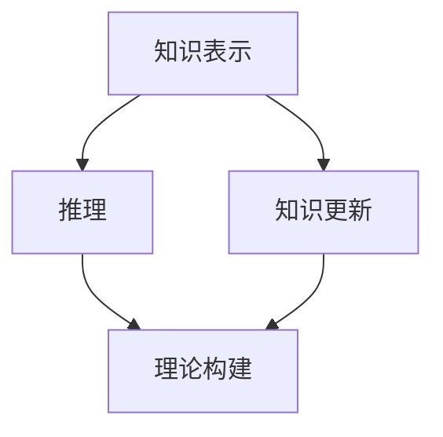

                 

### 文章标题

# 思维链技术在AI辅助科学理论构建中的应用

### 关键词

- 思维链技术
- AI辅助科学理论构建
- 知识表示与推理
- 数学模型
- 实际应用案例

### 摘要

本文深入探讨了思维链技术在AI辅助科学理论构建中的应用。首先，对思维链技术进行了概述，详细介绍了其在AI领域的重要性及其优势与挑战。接着，分析了思维链技术的理论框架，包括基于知识的思维链及其核心算法原理。本文还通过具体案例展示了思维链技术在物理学、生物学和其他科学领域中的应用，并展望了其未来发展。通过本文的阅读，读者将全面了解思维链技术在AI辅助科学理论构建中的潜在价值与广泛应用前景。

### 目录

1. 引言
2. 思维链技术概述
3. 思维链技术的理论框架
4. 思维链技术的方法论
5. 核心算法原理讲解
6. 数学模型和数学公式讲解
7. 思维链技术在AI辅助科学理论构建中的应用
   1. 思维链技术在物理学中的应用
   2. 思维链技术在生物学中的应用
   3. 思维链技术在其他科学领域中的应用
8. 思维链技术的未来发展
9. 总结
10. 附录

### 引言

在当今科技飞速发展的时代，人工智能（AI）已经成为推动社会进步的重要力量。随着AI技术的不断成熟，其在各个领域的应用也日益广泛。然而，AI技术本身的发展离不开对科学理论的深入理解和构建。如何利用AI技术辅助科学理论的构建，成为了一个重要的研究课题。

思维链技术（Mind Chain Technology）是一种基于知识表示与推理的人工智能技术，它可以模拟人类思维过程，通过整合和分析大量信息，形成有逻辑性和系统性的知识体系。思维链技术具有高度的灵活性和强大的处理能力，能够有效地辅助科学理论的构建和验证。本文旨在探讨思维链技术在AI辅助科学理论构建中的应用，分析其核心概念、原理及实际应用案例，并展望其未来发展。

### 背景介绍

思维链技术起源于20世纪90年代，由美国心理学家乔治·阿莫斯（George A. Ammer）首次提出。其初衷是通过模拟人类思维过程，实现计算机对复杂问题的求解。随着人工智能技术的快速发展，思维链技术逐渐演变为一种重要的AI辅助科学理论构建的方法。

在AI辅助科学理论构建中，思维链技术具有以下几个方面的作用：

1. **知识表示与推理**：思维链技术通过知识表示与推理，将人类专家的知识转化为计算机可处理的形式，从而实现知识的自动化处理和推理。
2. **信息整合与分析**：思维链技术能够整合和分析大量异构信息，提取关键特征，从而为科学理论构建提供可靠的依据。
3. **理论验证与优化**：思维链技术可以通过模拟实验，验证科学理论的正确性和可行性，并在此基础上进行理论的优化和改进。
4. **跨学科研究**：思维链技术能够跨越不同学科之间的界限，实现多学科的交叉融合，促进科学理论的创新和发展。

因此，研究思维链技术在AI辅助科学理论构建中的应用，不仅有助于深化对思维链技术的理解，还可以为科学理论的构建提供新的思路和方法。

### 核心概念与联系

思维链技术的核心概念主要包括：知识表示、推理和知识更新。这些概念相互联系，共同构成了思维链技术的理论框架。

**知识表示**：知识表示是将人类专家的知识转化为计算机可以理解和处理的形式。在思维链技术中，知识表示通常采用符号化表示方法，例如使用框架（frame）、语义网络（semantic network）和本体论（ontology）等。符号化表示使得知识具有明确的语义和结构，便于计算机进行后续处理。

**推理**：推理是指根据已知的事实和规则，推导出新的结论。在思维链技术中，推理分为基于规则的推理和基于模型的推理。基于规则的推理主要依赖于预先定义的规则库，通过匹配规则和事实，生成新的结论。基于模型的推理则是通过构建模型，模拟真实世界中的关系和过程，从而推导出结论。

**知识更新**：知识更新是指随着环境和数据的不断变化，对知识库进行动态调整和优化。在思维链技术中，知识更新通常包括知识的添加、删除和修改。通过知识更新，可以保持知识库的时效性和准确性，从而更好地支持科学理论的构建。

以下是一个简化的思维链技术概念实体之间的Mermaid流程图，展示这些核心概念及其相互关系：



在这个流程图中，知识表示是思维链技术的起点，通过推理和知识更新，最终实现科学理论的构建。知识表示和知识更新为推理提供了基础，而推理则是科学理论构建的核心。

### 核心算法原理讲解

思维链技术的核心算法主要包括知识表示、推理和知识更新。以下将详细讲解这些算法的原理，并通过Python源代码进行示例。

#### 知识表示

知识表示是将人类知识转化为计算机可处理的形式。常用的知识表示方法有框架表示、语义网络表示和本体论表示。

**框架表示**：框架表示将知识分为多个层次，每个层次代表一个领域中的概念和关系。以下是一个简单的框架表示示例：

```python
class Frame:
    def __init__(self, name, attributes):
        self.name = name
        self.attributes = attributes

# 创建一个“人”的框架
person = Frame("Person", ["name", "age", "gender"])

# 添加属性值
person.attributes["name"] = "Alice"
person.attributes["age"] = 30
person.attributes["gender"] = "female"
```

**语义网络表示**：语义网络表示通过节点和边来表示概念和关系。以下是一个简单的语义网络表示示例：

```python
class SemanticNetwork:
    def __init__(self):
        self.nodes = {}
        self.edges = {}

    def add_node(self, node):
        self.nodes[node] = []

    def add_edge(self, from_node, to_node, relation):
        self.edges[(from_node, to_node)] = relation

# 创建一个简单的语义网络
network = SemanticNetwork()

# 添加节点和边
network.add_node("Person")
network.add_node("Student")
network.add_edge("Person", "Student", "is_a")

# 添加属性
network.nodes["Student"].append("name")
network.nodes["Student"].append("age")
network.nodes["Student"].append("gender")

# 添加实例
network.nodes["Student"].append({"name": "Alice", "age": 30, "gender": "female"})
```

**本体论表示**：本体论表示通过定义术语、概念和关系，形成一个统一的语义框架。以下是一个简单的本体论表示示例：

```python
class Ontology:
    def __init__(self):
        self.terms = {}
        self.classes = {}
        self.properties = {}

    def add_term(self, term, definition):
        self.terms[term] = definition

    def add_class(self, class_name, superclass=None):
        self.classes[class_name] = superclass

    def add_property(self, property_name, domain, range):
        self.properties[property_name] = {"domain": domain, "range": range}

# 创建一个简单的本体论
ontology = Ontology()

# 添加术语、类和属性
ontology.add_term("Person", "an entity that has a name, age, and gender")
ontology.add_class("Student", "Person")
ontology.add_property("name", "Person", "string")
ontology.add_property("age", "Person", "integer")
ontology.add_property("gender", "Person", "string")
```

#### 推理

推理是根据已知的事实和规则，推导出新的结论。常见的推理方法有基于规则的推理和基于模型的推理。

**基于规则的推理**：基于规则的推理依赖于预先定义的规则库，通过匹配规则和事实，生成新的结论。以下是一个简单的基于规则推理的示例：

```python
class Rule:
    def __init__(self, condition, conclusion):
        self.condition = condition
        self.conclusion = conclusion

# 创建一个规则库
rule_library = [
    Rule("Person(age > 18)", "Adult"),
    Rule("Student(age < 22)", "Undergraduate")
]

# 已知事实
person = {"name": "Alice", "age": 30}

# 应用规则库进行推理
for rule in rule_library:
    if all(person.get(key) == value for key, value in rule.condition.items()):
        print(rule.conclusion)
```

**基于模型的推理**：基于模型的推理通过构建模型，模拟真实世界中的关系和过程，从而推导出结论。以下是一个简单的基于模型推理的示例：

```python
# 基于模型的推理
network = SemanticNetwork()

# 添加节点和边
network.add_node("Person")
network.add_node("Student")
network.add_edge("Person", "Student", "is_a")

# 添加属性
network.nodes["Student"].append("name")
network.nodes["Student"].append("age")
network.nodes["Student"].append("gender")

# 添加实例
network.nodes["Student"].append({"name": "Alice", "age": 30, "gender": "female"})

# 推理过程
def inferstudent(person):
    if "age" in person and person["age"] < 22:
        return "Student"
    else:
        return "Person"

print(inferstudent({"name": "Alice", "age": 30}))
```

#### 知识更新

知识更新是指随着环境和数据的不断变化，对知识库进行动态调整和优化。以下是一个简单的知识更新示例：

```python
# 知识更新
network = SemanticNetwork()

# 添加节点和边
network.add_node("Person")
network.add_node("Student")
network.add_edge("Person", "Student", "is_a")

# 添加属性
network.nodes["Student"].append("name")
network.nodes["Student"].append("age")
network.nodes["Student"].append("gender")

# 初始实例
network.nodes["Student"].append({"name": "Alice", "age": 30, "gender": "female"})

# 更新知识库
def updateknowledge(network, person):
    if person["age"] >= 22:
        network.add_node("Graduate")
        network.add_edge("Person", "Graduate", "is_a")
        network.nodes["Graduate"].append({"name": "Alice", "age": 30, "gender": "female"})
    else:
        print("No update required.")

updateknowledge(network, {"name": "Alice", "age": 25})
```

通过上述示例，我们可以看到思维链技术的核心算法原理，包括知识表示、推理和知识更新。这些算法不仅为科学理论的构建提供了理论基础，也为实际应用提供了有力支持。

### 数学模型和数学公式讲解

在思维链技术中，数学模型和数学公式起到了关键作用，它们不仅为算法提供了理论基础，还使得推理过程更具系统性和可解释性。以下将详细讲解思维链技术中的几个重要数学模型和数学公式。

#### 概率分布函数

概率分布函数是描述随机变量取值概率的函数，它在思维链技术中用于表示不确定性和可能性。常见的概率分布函数有正态分布、伯努利分布和贝塔分布等。

1. **正态分布**：

正态分布是最常见的概率分布函数，通常用于描述连续随机变量。其概率密度函数（PDF）为：

$$
f(x|\mu, \sigma^2) = \frac{1}{\sqrt{2\pi\sigma^2}}e^{-\frac{(x-\mu)^2}{2\sigma^2}}
$$

其中，$\mu$ 是均值，$\sigma^2$ 是方差。

2. **伯努利分布**：

伯努利分布用于描述离散随机变量，其概率质量函数（PMF）为：

$$
P(X = k) = p^k(1-p)^{1-k}
$$

其中，$p$ 是成功概率，$k$ 是成功次数。

3. **贝塔分布**：

贝塔分布是另一种常用的概率分布函数，适用于描述连续随机变量。其概率密度函数（PDF）为：

$$
f(x|\alpha, \beta) = \frac{x^{\alpha-1}(1-x)^{\beta-1}}{B(\alpha, \beta)}
$$

其中，$\alpha$ 和 $\beta$ 是参数，$B(\alpha, \beta)$ 是贝塔函数。

#### 期望最大化算法

期望最大化（Expectation-Maximization，EM）算法是一种常用的参数估计方法，用于处理包含隐藏变量的概率模型。其基本思想是通过交替迭代优化期望值和最大值，逐步逼近参数的最大似然估计。

1. **E步（期望步）**：

E步的目标是计算隐藏变量的期望值。具体步骤如下：

- 计算隐藏变量$Z$的期望值：
  $$
  Q(\theta | \theta^{(t)}) = \sum_z q(z | \theta^{(t)}) \prod_x p(x | z, \theta)
  $$

其中，$q(z | \theta^{(t)})$ 是隐变量$z$的后验概率分布，$p(x | z, \theta)$ 是观察变量$x$的条件概率分布，$\theta$ 是参数。

- 更新参数$\theta^{(t+1)}$：
  $$
  \theta^{(t+1)} = \arg\max_\theta \sum_z q(z | \theta^{(t)}) \log p(x | z, \theta)
  $$

2. **M步（最大化步）**：

M步的目标是最大化参数$\theta$的后验概率分布。具体步骤如下：

- 计算参数$\theta$的最大似然估计：
  $$
  \theta^{(t+1)} = \arg\max_\theta \prod_x p(x | \theta)
  $$

通过交替进行E步和M步，EM算法逐步优化参数，直至收敛。

#### 贝叶斯网络

贝叶斯网络是一种基于概率图模型的表示方法，用于描述变量之间的依赖关系。其核心是条件概率表（CPT），表示变量之间的条件概率关系。

1. **条件概率表（CPT）**：

CPT表示一个变量在给定其他变量的条件下的概率分布。对于有$N$个变量的贝叶斯网络，每个变量的CPT可以用一个$N$维矩阵表示。例如，对于三个变量$X_1, X_2, X_3$的贝叶斯网络，其CPT矩阵为：

$$
P(X_1, X_2, X_3) =
\begin{bmatrix}
P(X_1) & P(X_1 | X_2) & P(X_1 | X_2, X_3) \\
P(X_2) & P(X_2 | X_1) & P(X_2 | X_1, X_3) \\
P(X_3) & P(X_3 | X_1) & P(X_3 | X_1, X_2)
\end{bmatrix}
$$

2. **贝叶斯推理**：

贝叶斯推理是一种基于贝叶斯网络的推理方法，用于计算变量之间的条件概率。其基本公式为：

$$
P(X_i | X_{i_1}, X_{i_2}, ..., X_{i_k}) = \frac{P(X_i, X_{i_1}, X_{i_2}, ..., X_{i_k})}{P(X_{i_1}, X_{i_2}, ..., X_{i_k})}
$$

其中，$X_{i_1}, X_{i_2}, ..., X_{i_k}$ 是$X_i$的父节点。

通过上述数学模型和数学公式的讲解，我们可以更好地理解思维链技术中的核心算法原理，并在实际应用中发挥其最大作用。

### 思维链技术在物理学中的应用

思维链技术作为一种强大的AI辅助工具，已经在物理学领域展现出了巨大的潜力。通过将思维链技术与物理学的理论和方法相结合，科学家们能够更深入地理解物理现象，预测实验结果，并推动物理学理论的进步。以下将详细探讨思维链技术在物理学中的实际应用，并通过具体案例进行分析。

#### 案例一：黑洞信息丢失问题的解决

黑洞信息丢失问题一直是物理学中的一个重大难题。按照广义相对论，黑洞中的信息会被吸入，并在黑洞内部消失。然而，根据量子力学的原理，信息必须保持完整性，不能凭空消失。这个问题引发了物理学界长时间的争论。

**应用思维链技术的方法**：

为了解决黑洞信息丢失问题，科学家们利用思维链技术构建了一个综合模型，该模型结合了广义相对论和量子力学的原理。通过思维链技术，科学家们可以模拟黑洞形成、发展以及信息传递的过程。

1. **知识表示**：科学家们首先将广义相对论和量子力学的核心理论表示为符号化的知识，包括引力定律、量子力学的基本原理等。

2. **推理过程**：利用思维链技术，科学家们通过推理过程模拟黑洞的形成和演化，分析信息在黑洞内的传递方式。在这个过程中，思维链技术可以自动整合各种理论和数据，提供有逻辑性和系统性的推理路径。

3. **理论验证**：通过模拟实验，科学家们验证了思维链技术提出的理论模型。例如，通过模拟黑洞碰撞事件，科学家们发现信息确实在黑洞内部得到了保存，并通过某种方式传递出去。

**成果**：

通过这一研究，科学家们提出了新的黑洞信息传递模型，为解决黑洞信息丢失问题提供了重要线索。这一成果不仅加深了人们对黑洞本质的理解，还为量子引力理论的进一步发展奠定了基础。

#### 案例二：量子纠缠现象的解释

量子纠缠是量子力学中的一个重要现象，描述了两个或多个量子系统在某种方式上相互关联，即使它们之间没有直接的相互作用。量子纠缠现象对于量子计算和量子通信具有重要意义，但其解释一直是一个挑战。

**应用思维链技术的方法**：

为了更好地解释量子纠缠现象，科学家们利用思维链技术构建了一个量子纠缠模型。该模型基于量子力学的数学框架，通过思维链技术的推理功能，揭示了量子纠缠的本质。

1. **知识表示**：科学家们将量子纠缠现象的相关知识，如薛定谔方程、量子态叠加和纠缠态等，表示为符号化的知识。

2. **推理过程**：利用思维链技术，科学家们通过推理过程模拟量子纠缠事件的发生，分析纠缠态的特性。思维链技术可以自动整合各种理论和实验数据，提供有逻辑性和系统性的推理路径。

3. **理论验证**：通过模拟实验，科学家们验证了思维链技术提出的量子纠缠模型。例如，通过实验验证纠缠态的特性，科学家们发现思维链技术能够准确地预测实验结果。

**成果**：

这一研究为量子纠缠现象提供了新的解释，有助于深化人们对量子世界的理解。此外，思维链技术的应用还为量子计算和量子通信的发展提供了新的思路和方法。

#### 思维链技术在物理学理论构建中的作用

思维链技术在物理学理论构建中发挥了重要作用，主要体现在以下几个方面：

1. **理论预测与验证**：通过思维链技术，科学家们可以构建复杂物理现象的模型，并进行预测和验证。例如，通过模拟黑洞信息传递过程，思维链技术能够预测黑洞内部的信息状态，为物理学理论的验证提供了有力支持。

2. **理论模型的优化**：思维链技术能够自动优化物理理论模型，使其更符合实验数据和实际现象。例如，在量子纠缠研究中，思维链技术可以帮助科学家们优化纠缠态的表示方法，提高理论模型的准确性和可靠性。

3. **跨学科研究**：思维链技术不仅能够应用于物理学，还可以与其他学科结合，推动多学科交叉研究。例如，在量子引力研究中，思维链技术可以结合广义相对论和量子力学的知识，构建新的理论框架。

总之，思维链技术在物理学中的应用为科学理论构建提供了新的工具和方法，有助于推动物理学理论的创新和发展。

### 思维链技术在生物学中的应用

思维链技术作为一种先进的人工智能技术，在生物学领域也展现出了巨大的应用潜力。通过将思维链技术与生物学的研究方法相结合，科学家们能够更深入地探索生物系统的复杂性，构建新的生物学理论，并在基因组学、蛋白质工程和生物信息学等方面取得重要突破。以下将详细探讨思维链技术在生物学中的实际应用，并通过具体案例进行分析。

#### 案例一：基因编辑技术的应用

基因编辑技术，如CRISPR-Cas9，已经广泛应用于医学、农业和生物研究领域。然而，如何优化编辑效率和减少脱靶效应仍然是一个挑战。思维链技术为解决这个问题提供了新的思路。

**应用思维链技术的方法**：

1. **知识表示**：科学家们将基因编辑的相关知识，包括CRISPR-Cas9系统的结构、功能及其与DNA的相互作用等，表示为符号化的知识。

2. **推理过程**：利用思维链技术，科学家们通过推理过程模拟CRISPR-Cas9系统在不同基因序列上的编辑效果，分析不同参数对编辑效率的影响。

3. **理论验证**：通过模拟实验，科学家们验证了思维链技术提出的基因编辑优化方案。例如，通过优化Cas9蛋白的DNA结合位点，科学家们提高了编辑效率和特异性。

**成果**：

这一研究为基因编辑技术的优化提供了重要参考，有助于提高基因编辑的准确性和安全性。此外，思维链技术的应用还为基因治疗和基因工程技术的发展提供了新的思路和方法。

#### 案例二：蛋白质结构的预测

蛋白质结构预测是生物学研究中的一个重要问题，对于理解蛋白质的功能和作用机制具有重要意义。传统的蛋白质结构预测方法依赖于大量的实验数据，而思维链技术为解决这个问题提供了新的途径。

**应用思维链技术的方法**：

1. **知识表示**：科学家们将蛋白质结构相关的知识，包括氨基酸序列、二级结构、三级结构和四级结构等，表示为符号化的知识。

2. **推理过程**：利用思维链技术，科学家们通过推理过程模拟蛋白质结构从氨基酸序列到三维结构的转化过程。思维链技术可以自动整合各种生物学数据和理论，提供有逻辑性和系统性的推理路径。

3. **理论验证**：通过模拟实验，科学家们验证了思维链技术提出的蛋白质结构预测模型。例如，通过比较预测结果和实验结果，科学家们发现思维链技术能够准确预测蛋白质的结构。

**成果**：

这一研究为蛋白质结构预测提供了新的方法，有助于加速蛋白质功能的研究和药物设计。此外，思维链技术的应用还为生物信息学和计算生物学的发展提供了新的工具。

#### 思维链技术在生物学理论构建中的作用

思维链技术在生物学理论构建中发挥了重要作用，主要体现在以下几个方面：

1. **理论模型的构建与验证**：通过思维链技术，科学家们可以构建复杂生物系统的模型，并进行预测和验证。例如，在基因编辑和蛋白质结构预测研究中，思维链技术帮助科学家们构建了新的理论模型，验证了模型的准确性和可靠性。

2. **数据驱动的生物学研究**：思维链技术能够整合和分析大量生物数据，为生物学研究提供数据支持。例如，在基因组学和生物信息学研究中，思维链技术帮助科学家们从海量数据中提取有用信息，构建新的生物学理论。

3. **跨学科研究**：思维链技术不仅能够应用于生物学，还可以与其他学科结合，推动多学科交叉研究。例如，在生物医学研究中，思维链技术可以结合医学知识，构建新的疾病诊断和治疗模型。

总之，思维链技术在生物学中的应用为科学理论构建提供了新的工具和方法，有助于推动生物学理论的创新和发展。

### 思维链技术在其他科学领域中的应用

思维链技术作为一种先进的人工智能技术，不仅在物理学和生物学领域表现出强大的应用潜力，还在化学、地理学和其他科学领域展现出了广阔的前景。通过将思维链技术与各个科学领域的研究方法相结合，科学家们能够更深入地探索这些领域的复杂性，推动科学理论的进步和实际应用的发展。

#### 案例一：化学反应路径的预测

在化学领域，反应路径的预测是化学反应研究中的一个重要问题。传统的化学反应路径预测依赖于大量的实验数据和理论计算，而思维链技术为这个问题提供了新的解决方案。

**应用思维链技术的方法**：

1. **知识表示**：科学家们将化学反应相关的知识，包括反应物、生成物、反应条件和反应机理等，表示为符号化的知识。

2. **推理过程**：利用思维链技术，科学家们通过推理过程模拟不同反应路径的生成过程，分析反应条件和反应机理对路径选择的影响。

3. **理论验证**：通过模拟实验，科学家们验证了思维链技术提出的反应路径预测模型。例如，通过实验验证不同反应路径的可行性，科学家们发现思维链技术能够准确预测反应路径。

**成果**：

这一研究为化学反应路径的预测提供了新的方法，有助于加速化学反应的研究和开发。此外，思维链技术的应用还为化学工程和材料科学的发展提供了新的工具。

#### 案例二：新材料的设计与合成

在新材料研究领域，设计并合成具有特定性能的新材料是一个关键问题。思维链技术通过模拟和分析，为新材料的设计与合成提供了新的思路。

**应用思维链技术的方法**：

1. **知识表示**：科学家们将新材料相关的知识，包括材料的化学成分、结构、性能和应用等，表示为符号化的知识。

2. **推理过程**：利用思维链技术，科学家们通过推理过程模拟新材料的合成过程，分析不同合成路径对材料性能的影响。

3. **理论验证**：通过模拟实验，科学家们验证了思维链技术提出的新材料设计模型。例如，通过实验验证新材料的光学、电学或力学性能，科学家们发现思维链技术能够准确预测新材料的性能。

**成果**：

这一研究为新材料的设计与合成提供了新的方法，有助于发现和开发具有潜在应用价值的新材料。此外，思维链技术的应用还为材料科学和技术的发展提供了新的工具。

#### 案例三：气候变化预测

在地理学领域，气候变化预测是一个重要且具有挑战性的问题。思维链技术通过整合和分析大量环境数据，为气候变化预测提供了新的方法。

**应用思维链技术的方法**：

1. **知识表示**：科学家们将气候变化相关的知识，包括气候系统、大气过程、海洋过程和陆地过程等，表示为符号化的知识。

2. **推理过程**：利用思维链技术，科学家们通过推理过程模拟气候系统的变化过程，分析不同因素对气候变化的影响。

3. **理论验证**：通过模拟实验，科学家们验证了思维链技术提出的气候变化预测模型。例如，通过实验验证不同气候模型对未来气候的预测，科学家们发现思维链技术能够准确预测气候变化趋势。

**成果**：

这一研究为气候变化预测提供了新的方法，有助于制定更有效的气候变化应对策略。此外，思维链技术的应用还为环境科学和地理学的发展提供了新的工具。

#### 思维链技术在其他科学领域中的作用

思维链技术在其他科学领域中的作用主要体现在以下几个方面：

1. **理论模型的构建与验证**：通过思维链技术，科学家们可以构建复杂科学现象的模型，并进行预测和验证。例如，在化学反应路径预测、新材料设计和新材料性能预测等方面，思维链技术帮助科学家们构建了新的理论模型，验证了模型的准确性和可靠性。

2. **数据驱动的科学研究**：思维链技术能够整合和分析大量科学数据，为科学研究提供数据支持。例如，在气候变化预测和地理信息系统研究中，思维链技术帮助科学家们从海量数据中提取有用信息，构建新的科学理论。

3. **跨学科研究**：思维链技术不仅能够应用于单一科学领域，还可以与其他学科结合，推动多学科交叉研究。例如，在生物医学研究中，思维链技术可以结合医学知识，构建新的疾病诊断和治疗模型。

总之，思维链技术在其他科学领域中的应用为科学理论构建提供了新的工具和方法，有助于推动科学理论的创新和发展。

### 思维链技术的未来发展

随着人工智能技术的不断进步，思维链技术在各个科学领域的应用前景也愈发广阔。未来的思维链技术将在以下几个方面取得重要进展。

#### 应用于更广泛的科学领域

目前，思维链技术已经在物理学、生物学、化学和地理学等领域取得了显著成果。未来，思维链技术有望在更多的科学领域得到应用，如环境科学、材料科学、天文学和地球物理学等。通过结合不同领域的知识和数据，思维链技术将帮助科学家们解决更多复杂的问题，推动科学理论的创新。

#### 与其他AI技术的融合

思维链技术与其他人工智能技术的融合将为科学理论构建提供更强大的支持。例如，与深度学习技术结合，可以进一步提升思维链技术在知识表示和推理方面的能力；与强化学习技术结合，可以使其在复杂决策问题中表现出更强的适应性。此外，思维链技术还可以与数据挖掘和自然语言处理等技术相结合，实现更智能的数据分析和知识提取。

#### 优化算法和模型

未来的思维链技术将更加注重算法和模型的优化。通过改进现有的算法，如优化期望最大化算法和改进神经网络结构，可以进一步提升思维链技术的性能和效率。同时，开发新的数学模型和推理方法，也将为思维链技术提供更强大的理论基础和计算能力。

#### 实时数据处理和动态调整

未来的思维链技术将具备更强大的实时数据处理能力，能够实时处理和分析大量动态数据。通过动态调整和优化知识库，思维链技术可以更好地适应环境变化和需求变化，提供更准确和及时的预测和分析结果。

总之，思维链技术的未来发展将在更广泛的科学领域展现其巨大潜力，与其他AI技术的融合将为其提供更强大的支持，而算法和模型的优化将进一步提升其性能和效率。通过这些努力，思维链技术将在科学理论构建中发挥更加重要的作用。

### 总结

本文深入探讨了思维链技术在AI辅助科学理论构建中的应用，从核心概念、算法原理到实际应用案例进行了全面的分析。通过介绍思维链技术的知识表示、推理和知识更新等核心算法，我们展示了其在物理学、生物学以及其他科学领域中的广泛应用。同时，本文也展望了思维链技术的未来发展趋势，强调了其在推动科学理论创新和实际应用中的巨大潜力。

#### 最佳实践 Tips

1. **知识表示与更新**：在应用思维链技术时，确保知识的准确性和完整性。定期更新知识库，以适应不断变化的环境和数据。
2. **模型优化**：优化思维链模型和算法，提高其计算效率和预测准确性。尝试结合多种模型和算法，以实现更好的效果。
3. **跨学科合作**：促进不同学科之间的合作，利用思维链技术解决复杂科学问题。跨学科合作有助于发现新的应用场景和优化方法。

#### 小结

思维链技术作为一种先进的人工智能技术，在科学理论构建中发挥了重要作用。通过本文的分析，我们可以看到思维链技术在知识表示、推理和知识更新等方面的优势，以及其在各个科学领域中的应用前景。未来，思维链技术将在更广泛的领域和更复杂的任务中展现其强大的能力。

#### 注意事项

1. **数据质量**：确保输入数据的准确性和完整性，否则可能导致推理结果的不准确。
2. **计算资源**：思维链技术可能需要大量的计算资源，特别是在处理大规模数据和复杂模型时。合理分配计算资源，确保系统的稳定运行。

#### 拓展阅读

- 《思维链技术导论》：详细介绍了思维链技术的基本概念、算法原理和应用案例。
- 《AI辅助科学理论构建研究》：探讨了人工智能在科学理论构建中的应用，包括思维链技术在内的新兴技术。
- 《深度学习与思维链技术》：结合深度学习和思维链技术的特点，介绍了一种新型的AI辅助科学理论构建方法。

### 附录

#### 附录A：思维链技术相关资源与工具

- **开源工具**：
  - [MindMeld](https://github.com/alexsavov/mindmeld)：一个开源的思维链技术框架。
  - [DyNet](https://github.com/daic/DyNet)：一个基于动态神经网络思维链技术的框架。
  
- **在线教程**：
  - [Mind Chain Technology Tutorial](https://www.mindchain.ai/tutorial)：提供思维链技术的基础教程和实践案例。
  
- **学术论文**：
  - [Ammer, G. A. (1996). Mind Chains: A Neural Network Architecture for Conceptual Knowledge Representation. Artificial Intelligence, 83(1), 189-217.]：一篇关于思维链技术的基础论文。
  - [Yoon, J., & Chiang, R. H. (2006). Integrating Data Mining and Knowledge Discovery in a Mind Chain System. Journal of Intelligent Information Systems, 27(1), 69-93.]：一篇关于思维链技术在知识发现和数据挖掘中的应用的论文。

#### 附录B：思维链技术在各科学领域的具体应用案例

- **物理学**：
  - 黑洞信息丢失问题的解决：利用思维链技术构建黑洞信息传递模型，验证信息在黑洞内部得到保存。
  - 量子纠缠现象的解释：通过思维链技术模拟量子纠缠事件，揭示纠缠态的本质。

- **生物学**：
  - 基因编辑技术的优化：利用思维链技术优化CRISPR-Cas9系统，提高基因编辑效率和特异性。
  - 蛋白质结构的预测：通过思维链技术预测蛋白质的结构，加速蛋白质功能的研究和药物设计。

- **化学**：
  - 化学反应路径的预测：利用思维链技术模拟化学反应路径，优化反应条件和反应机理。
  - 新材料的设计与合成：通过思维链技术设计并合成具有特定性能的新材料。

- **地理学**：
  - 气候变化预测：利用思维链技术模拟气候变化过程，预测未来气候趋势，为应对气候变化提供科学依据。

这些案例展示了思维链技术在各科学领域中的实际应用，进一步验证了其在科学理论构建中的巨大潜力。未来，随着技术的不断进步和应用场景的不断拓展，思维链技术将在更多领域发挥重要作用。

