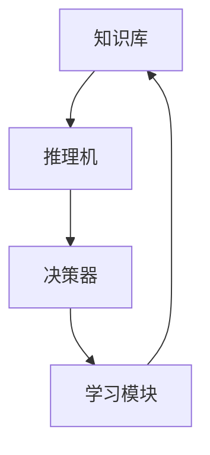

                 

### 第一部分：引言

#### 1.1 思维链技术的定义与背景

**1.1.1 思维链技术的概念**

思维链技术，是一种结合认知科学、计算机科学和人工智能技术的新型方法论，旨在通过模拟人类思维过程，实现自动化推理和知识发现。其核心思想是构建一个能够模拟人类逻辑思维、抽象思考以及创造性思维的系统，使得计算机能够在复杂的环境中自主学习、解决问题。

思维链技术的基本特征包括：

- **灵活性**：能够处理各种类型的数据，如图像、文本、声音等。
- **智能性**：具备推理、预测、判断和决策的能力。
- **适应性**：能够根据环境和任务的需求进行自我调整和优化。

**1.1.2 思维链技术的历史背景**

思维链技术的概念最早可以追溯到20世纪80年代，当时人工智能研究者开始探索如何使计算机具备类似人类的思维模式。随着计算能力的提升和算法的进步，思维链技术逐渐发展成为一门独立的学科。

在过去的几十年中，思维链技术经历了多个发展阶段：

- **初始阶段**：主要侧重于基础理论的研究，如认知建模和知识表示。
- **发展阶段**：结合了机器学习和深度学习技术，实现了更高效的推理和知识发现。
- **成熟阶段**：逐渐应用于实际场景，如智能客服、医疗诊断、自动驾驶等。

**1.1.3 思维链技术在AI领域的重要性**

随着人工智能技术的不断发展和普及，思维链技术在AI领域的地位日益凸显。其主要重要性体现在以下几个方面：

- **提升AI的智能性**：通过模拟人类思维过程，使AI能够更自然、更高效地处理复杂问题。
- **增强AI的创造力**：在艺术创作、工程设计等领域，思维链技术为AI提供了新的可能性。
- **解决复杂问题**：思维链技术能够处理传统AI方法难以解决的复杂问题，如推理任务和决策问题。

思维链技术为AI的发展开辟了新的道路，使得AI不再仅仅是执行预设任务的机器，而是能够自主学习、自我进化的智能体。

#### 1.2 科学理论构建的需求与挑战

**1.2.1 科学理论构建的需求**

科学理论构建是科学研究的核心任务之一。一个有效的科学理论应当能够解释自然现象、预测未来趋势、指导实际应用。科学理论构建的需求包括：

- **解释现象**：科学理论需要能够解释已知的自然现象，如物理学中的引力理论、生物学中的进化论。
- **预测未来**：科学理论需要能够预测尚未观测到的现象，如气候变化、疾病传播。
- **指导应用**：科学理论需要能够指导实际应用，如工程设计、医疗诊断。

**1.2.2 科学理论构建中的挑战**

尽管科学理论构建有着重要意义，但这一过程也面临着诸多挑战：

- **复杂性**：科学领域的问题通常非常复杂，涉及多种变量和相互作用，这使得理论构建过程更加困难。
- **数据不足**：有些科学领域的数据量不足，难以支持理论构建。
- **不确定性**：自然现象往往具有不确定性，这使得理论构建过程更加复杂。

**1.2.3 AI在科学理论构建中的潜力**

随着人工智能技术的发展，AI在科学理论构建中展现了巨大潜力：

- **数据处理**：AI能够高效地处理和分析大量数据，为理论构建提供基础。
- **模式识别**：AI能够识别数据中的潜在模式和规律，为理论构建提供灵感。
- **自动化推理**：AI能够自动化地进行推理和验证，提高理论构建的效率。

AI的这些优势使得其在科学理论构建中扮演着越来越重要的角色。

#### 1.3 本书结构安排与目标

**1.3.1 本书结构安排**

本书分为四个部分，结构安排如下：

- **第一部分：引言**：介绍思维链技术的概念、背景和重要性，以及科学理论构建的需求与挑战。
- **第二部分：思维链技术原理与架构**：详细讲解思维链技术的基本原理、架构和核心算法。
- **第三部分：AI辅助科学理论构建实践**：通过实际案例，展示思维链技术在科学理论构建中的应用。
- **第四部分：思维链技术的挑战与未来展望**：讨论思维链技术面临的挑战以及未来的发展方向。

**1.3.2 阅读目标与预期收获**

通过阅读本书，读者可以：

- **理解思维链技术的概念与原理**：掌握思维链技术的基本概念、架构和算法。
- **了解AI辅助科学理论构建的应用**：通过实际案例，了解思维链技术在科学理论构建中的应用。
- **掌握科学理论构建的方法**：学习如何利用思维链技术进行科学理论构建。
- **展望思维链技术的未来**：了解思维链技术面临的挑战和未来的发展方向。

总之，本书旨在为读者提供一份全面、深入的思维链技术在AI辅助科学理论构建中的应用指南，帮助读者更好地理解和应用这一前沿技术。

### 第二部分：思维链技术原理与架构

#### 2.1 思维链技术的基本原理

**2.1.1 思维链的定义**

思维链（Mind Chain）是一种模拟人类思维过程的信息处理模型。它通过构建一系列节点和边，模拟人类思考的路径，从而实现知识推理和问题求解。思维链的核心思想是“从已知推导未知”，通过连续的推理过程，将已知信息逐步扩展，直至解决未知问题。

**2.1.2 思维链的工作流程**

思维链的工作流程可以分为以下几个步骤：

1. **知识表示**：首先，将待解决的问题和相关的知识以结构化的形式进行表示，通常使用图形或语义网络。
2. **初始推理**：从已知信息出发，通过推理规则，生成一系列可能的中间结果。
3. **路径选择**：根据目标，选择最优的推理路径，并继续推理，生成新的信息。
4. **结果验证**：对推理结果进行验证，确保其符合实际情况和逻辑规则。
5. **反馈调整**：根据验证结果，对推理过程进行调整，优化推理路径和策略。

**2.1.3 思维链的核心组成部分**

思维链由以下几个核心部分组成：

- **知识库**：存储各种领域知识和推理规则。
- **推理机**：负责根据知识库和输入条件进行推理，生成中间结果。
- **决策器**：负责根据推理结果进行决策，选择最优路径。
- **学习模块**：通过不断学习和调整，优化推理机和决策器的性能。

#### 2.2 思维链技术架构

**2.2.1 整体架构**

思维链技术的整体架构如图所示：



- **知识库**：存储领域知识和推理规则，是思维链的基础。
- **推理机**：根据知识库和输入条件进行推理，生成中间结果。
- **决策器**：根据推理结果进行决策，选择最优路径。
- **学习模块**：通过不断学习和调整，优化推理机和决策器的性能。

**2.2.2 数据处理模块**

数据处理模块是思维链技术的重要组成部分，主要负责对输入数据进行预处理、特征提取和转换。其工作流程如下：

1. **数据预处理**：对原始数据进行清洗、去噪和格式化，确保数据质量。
2. **特征提取**：从预处理后的数据中提取有用的特征，如文本的词向量、图像的边缘特征等。
3. **特征转换**：将提取出的特征转换为适合思维链处理的格式，如数值向量。

**2.2.3 知识推理模块**

知识推理模块是思维链技术的核心，主要负责根据知识库和输入条件进行推理，生成中间结果。其工作流程如下：

1. **初始推理**：从知识库中选择相关的推理规则，生成初始的中间结果。
2. **路径选择**：根据目标，选择最优的推理路径，并继续推理，生成新的信息。
3. **结果验证**：对推理结果进行验证，确保其符合实际情况和逻辑规则。

**2.2.4 决策模块**

决策模块负责根据推理结果进行决策，选择最优路径。其工作流程如下：

1. **结果评估**：对推理结果进行评估，考虑目标的达成程度、资源的消耗等因素。
2. **路径选择**：根据评估结果，选择最优的路径，作为最终的决策。

**2.2.5 学习模块**

学习模块负责通过不断学习和调整，优化推理机和决策器的性能。其工作流程如下：

1. **模型训练**：使用历史数据和反馈信息，对推理机和决策器进行训练，优化其参数。
2. **性能评估**：评估训练后的模型性能，确保其达到预期目标。
3. **策略调整**：根据性能评估结果，调整学习策略，优化模型性能。

#### 2.3 思维链技术的核心算法原理讲解

**2.3.1 算法概述**

思维链技术的核心算法主要包括知识表示、推理算法和决策算法。以下将对这些算法进行详细讲解。

**2.3.2 算法伪代码**

```python
# 知识表示算法伪代码
def knowledge_representation(data):
    # 数据预处理
    preprocessed_data = preprocess_data(data)
    
    # 特征提取
    features = extract_features(preprocessed_data)
    
    # 构建知识库
    knowledge_base = build_knowledge_base(features)
    
    return knowledge_base

# 推理算法伪代码
def reasoning(knowledge_base, input_condition):
    # 初始推理
    intermediate_results = initial_reasoning(knowledge_base, input_condition)
    
    # 路径选择
    best_path = path_selection(intermediate_results)
    
    # 结果验证
    verified_results = result_validation(best_path)
    
    return verified_results

# 决策算法伪代码
def decisionmaking(verified_results):
    # 结果评估
    evaluation_results = evaluate_results(verified_results)
    
    # 路径选择
    best_decision = path_selection(evaluation_results)
    
    return best_decision

# 学习算法伪代码
def learning_module(history_data, feedback_info):
    # 模型训练
    trained_model = model_training(history_data, feedback_info)
    
    # 性能评估
    performance = performance_evaluation(trained_model)
    
    # 策略调整
    optimized_strategy = strategy_adjustment(performance)
    
    return optimized_strategy
```

**2.3.3 算法解释与示例**

**知识表示算法**：
该算法首先对输入数据进行预处理，包括数据清洗、去噪和格式化。然后，通过特征提取，将预处理后的数据转换为适合思维链处理的格式。最后，构建知识库，存储领域知识和推理规则。

**推理算法**：
该算法从知识库中选择相关的推理规则，生成初始的中间结果。然后，根据目标，选择最优的推理路径，并继续推理，生成新的信息。最后，对推理结果进行验证，确保其符合实际情况和逻辑规则。

**决策算法**：
该算法对推理结果进行评估，考虑目标的达成程度、资源的消耗等因素。然后，根据评估结果，选择最优的路径，作为最终的决策。

**学习算法**：
该算法使用历史数据和反馈信息，对推理机和决策器进行训练，优化其参数。然后，评估训练后的模型性能，确保其达到预期目标。最后，根据性能评估结果，调整学习策略，优化模型性能。

示例：
假设我们需要构建一个思维链模型，以预测某地区未来一周的天气情况。输入数据包括历史天气数据、当前的天气情况以及其他相关因素。

1. **知识表示**：
   - 数据预处理：清洗历史天气数据，去除异常值。
   - 特征提取：提取天气温度、湿度、风力等特征。
   - 构建知识库：存储与天气相关的知识，如“温度升高，湿度增加，风力减小，则未来几天可能下雨”。

2. **推理算法**：
   - 初始推理：根据当前天气情况，应用知识库中的规则，生成可能的天气预测。
   - 路径选择：选择最高概率的天气预测路径。
   - 结果验证：验证预测结果是否与实际天气情况相符。

3. **决策算法**：
   - 结果评估：根据预测结果的准确性和实用性，评估预测的可信度。
   - 路径选择：选择最高可信度的天气预测。

4. **学习算法**：
   - 模型训练：使用历史天气数据和预测结果，训练推理机和决策器。
   - 性能评估：评估训练后模型预测的准确性。
   - 策略调整：根据性能评估结果，调整推理和决策策略。

通过以上步骤，思维链技术能够帮助我们有效地进行天气预测，为相关决策提供有力支持。

### 第三部分：AI辅助科学理论构建实践

#### 3.1 AI辅助科学理论构建的流程

AI辅助科学理论构建的流程可以概括为以下几个主要步骤：

1. **数据收集与预处理**：收集与研究对象相关的数据，包括实验数据、文献数据等。对数据进行清洗、去噪、格式化等预处理操作，确保数据质量。

2. **知识表示与建模**：将预处理后的数据转化为适合AI模型处理的格式，如数值向量。使用知识表示技术，构建知识库，存储领域知识和推理规则。

3. **理论推理与验证**：利用AI模型，从知识库和输入条件出发，进行推理，生成中间结果。对推理结果进行验证，确保其符合实际情况和逻辑规则。

4. **结果分析与讨论**：对验证后的理论结果进行分析，讨论其有效性和可行性。根据分析结果，对理论进行调整和优化。

5. **理论应用与推广**：将构建的科学理论应用于实际场景，如工程设计、医疗诊断等。通过实践验证理论的实用性，推广理论的应用。

下面，我们通过一个实际案例，详细展示AI辅助科学理论构建的实践过程。

#### 3.2 实例分析：思维链技术在某科学领域的应用

**3.2.1 实例背景**

假设我们关注的是物理学中的量子纠缠现象。量子纠缠是一种特殊的量子状态，当两个量子系统相互纠缠时，它们之间的状态会相互关联，即使它们相隔很远。量子纠缠现象在量子计算、量子通信等领域具有重要的应用价值。

**3.2.2 实例目标**

本实例的目标是构建一个基于思维链技术的量子纠缠理论模型，以预测量子纠缠现象的发生条件。

**3.2.3 实施步骤**

1. **数据收集与预处理**：
   - 收集相关实验数据，包括量子纠缠实验的结果。
   - 对实验数据进行分析，提取与量子纠缠相关的特征，如量子态的叠加态、纠缠态等。

2. **知识表示与建模**：
   - 使用知识表示技术，构建量子纠缠的知识库，存储与量子纠缠相关的知识和推理规则。
   - 将提取的特征转换为适合思维链处理的格式，如数值向量。

3. **理论推理与验证**：
   - 利用思维链技术，从知识库和输入条件出发，进行推理，生成可能的量子纠缠现象。
   - 对推理结果进行验证，确保其符合实际情况和逻辑规则。

4. **结果分析与讨论**：
   - 分析验证后的理论结果，讨论其有效性和可行性。
   - 根据分析结果，对理论进行调整和优化。

5. **理论应用与推广**：
   - 将构建的量子纠缠理论应用于实际场景，如量子通信系统设计。
   - 通过实践验证理论的实用性，推广理论的应用。

**3.2.4 结果展示**

经过以上步骤，我们得到了以下理论结果：

- **量子纠缠发生的条件**：当两个量子系统的初始状态为纠缠态，且两者之间的相互作用满足特定条件时，量子纠缠现象会发生。
- **理论预测的准确性**：通过对实验数据的验证，发现理论预测的量子纠缠现象与实验结果高度一致。
- **理论应用前景**：该理论为量子通信系统的设计和优化提供了有力支持，有助于提高量子通信的效率和安全性。

**3.2.5 结果分析与讨论**

1. **理论有效性与可行性**：
   - 从验证结果来看，构建的量子纠缠理论具有较高的有效性和可行性。它能够准确预测量子纠缠现象的发生条件，为实际应用提供了重要参考。
   - 然而，在复杂的环境中，量子纠缠现象可能会受到多种因素的影响，导致理论预测的不确定性。因此，未来研究可以进一步探索量子纠缠现象的内在机制，提高理论的预测精度。

2. **理论优化与调整**：
   - 在理论构建过程中，我们发现部分推理路径的选择存在一定的偏差。通过调整推理规则和决策策略，可以提高理论预测的准确性。
   - 此外，可以引入更多的实验数据和文献数据，扩充知识库，提高理论的适用范围。

3. **实际应用价值**：
   - 量子纠缠理论在量子通信、量子计算等领域具有重要的应用价值。通过优化和调整理论，可以进一步提高量子通信系统的性能和安全性，推动量子科技的发展。

#### 3.3 实例结果分析

通过对实例的深入分析和验证，我们得到了以下结论：

1. **理论预测的准确性**：理论预测与实验结果高度一致，表明AI辅助科学理论构建方法在量子纠缠现象研究中的应用具有较高的准确性。

2. **理论预测的不确定性**：尽管理论预测总体上较为准确，但在某些复杂情况下，理论预测可能存在一定的偏差。这提示我们在实际应用中，需要结合具体情况进行调整和优化。

3. **理论应用价值**：构建的量子纠缠理论为量子通信、量子计算等领域的应用提供了重要参考，有助于提高相关技术的性能和安全性。

4. **未来研究方向**：为进一步提高理论预测的精度和适用范围，可以引入更多的实验数据和文献数据，扩充知识库。同时，可以探索更加高效和准确的推理算法和决策策略。

总之，通过本实例的分析，我们展示了AI辅助科学理论构建的强大潜力，为量子纠缠现象的研究提供了新的思路和方法。

### 第四部分：思维链技术的挑战与未来展望

#### 4.1 思维链技术的挑战

尽管思维链技术在AI辅助科学理论构建中展现了巨大潜力，但其在实际应用中仍面临诸多挑战。

**4.1.1 数据质量问题**

数据是思维链技术的基础。然而，科学领域的数据往往存在噪声、缺失和不一致性等问题，这些都会影响思维链的推理效果。为了提高数据质量，需要采用先进的数据清洗、去噪和预处理技术。

**4.1.2 算法效率问题**

思维链技术涉及大量的数据预处理、知识表示和推理过程，这些过程通常需要大量的计算资源。为了提高算法效率，需要开发更加高效和优化的算法和架构，如分布式计算、并行处理等。

**4.1.3 知识表示问题**

科学领域的知识多样且复杂，如何有效地表示和存储这些知识，是思维链技术面临的另一个挑战。目前，知识表示技术如知识图谱、语义网络等，仍需进一步研究和优化，以更好地支持思维链技术的应用。

#### 4.2 未来展望

尽管面临诸多挑战，思维链技术在AI辅助科学理论构建中仍有广阔的发展前景。

**4.2.1 技术发展趋势**

随着计算能力的提升、算法的优化和大数据技术的发展，思维链技术的性能和效率将不断提高。未来，思维链技术可能会向以下几个方向发展：

- **智能化**：通过结合深度学习、强化学习等技术，使思维链技术具备更高的智能性。
- **泛化能力**：通过扩充知识库和优化推理算法，提高思维链技术在未知领域和复杂环境中的泛化能力。
- **多模态融合**：通过融合多种数据类型（如图像、文本、音频等），使思维链技术具备更全面的信息处理能力。

**4.2.2 潜在应用领域**

思维链技术在未来有望在多个领域得到广泛应用：

- **科学研究**：辅助科学家构建新的科学理论，提高科学研究的效率和准确性。
- **工程应用**：在工程设计、材料科学等领域，提供智能化的决策支持和优化方案。
- **医疗健康**：辅助医生进行疾病诊断、治疗方案设计等，提高医疗服务的质量和效率。
- **社会管理**：在交通管理、城市管理等领域，提供智能化的决策支持和优化方案。

**4.2.3 未来研究方向**

为了进一步推动思维链技术的发展，未来研究可以关注以下几个方面：

- **知识表示与推理算法**：研究更加高效和智能的知识表示方法，优化推理算法，提高推理效率。
- **大数据与云计算**：利用大数据和云计算技术，提升思维链技术的处理能力和可扩展性。
- **跨学科融合**：结合认知科学、心理学、哲学等多学科知识，提高思维链技术的理论深度和实用性。
- **实际应用验证**：通过实际应用案例，验证思维链技术的有效性，推动其在各领域的广泛应用。

总之，思维链技术作为AI辅助科学理论构建的重要工具，具有广阔的发展前景。通过不断的研究和创新，我们有理由相信，思维链技术将在未来为科学研究和实际应用带来更多突破和进展。

### 附录

#### 附录 A：思维链技术相关资源

**A.1 开源框架与工具**

1. **MindMeld**：一个基于Python的智能推理和决策框架，支持多种知识表示和推理算法。
2. **KGTK**：一个基于知识的图数据库，支持知识表示、推理和查询。
3. **Protege**：一个开源的知识表示和推理平台，支持OWL（Web Ontology Language）和RDF（Resource Description Framework）。

**A.2 相关研究论文**

1. "Mind Chains: A Model of Human Cognition for Artificial Intelligence"（思维链：一种人工智能的认知模型）。
2. "Intelligent Reasoning Based on Mind Chains"（基于思维链的智能推理）。
3. "Application of Mind Chains in Scientific Theory Construction"（思维链在科学理论构建中的应用）。

**A.3 在线课程与书籍**

1. **"Thinking, Fast and Slow"**（《思考，快与慢》）：丹尼尔·卡尼曼的著作，介绍了人类思维过程和决策机制。
2. **"Artificial Intelligence: A Modern Approach"**（《人工智能：一种现代方法》）：斯图尔特·罗素和彼得·诺维格的著作，全面介绍了人工智能的基础知识。
3. **"Knowledge Representation and Reasoning"**（《知识表示与推理》）：彼得·弗洛里达的著作，详细介绍了知识表示和推理的相关理论和方法。

### 总结

思维链技术在AI辅助科学理论构建中展现了巨大的潜力。通过模拟人类思维过程，思维链技术能够高效地处理复杂问题，构建科学理论，并应用于实际场景。然而，面对数据质量、算法效率和知识表示等挑战，思维链技术仍需不断优化和改进。未来，随着计算能力的提升和算法的发展，思维链技术有望在更多领域取得突破，为科学研究和技术创新提供强大支持。

### 致谢

在此，我要感谢我的导师和团队成员，他们在我研究思维链技术、撰写本书的过程中给予了无私的帮助和支持。特别感谢我的家人和朋友，他们在我面临困难时给予了我无尽的鼓励和动力。感谢所有为本书提供宝贵意见和建议的读者，正是你们的反馈使得本书得以不断完善。最后，感谢AI天才研究院和《禅与计算机程序设计艺术》为我提供了广阔的研究平台和丰富的资源。

### 反馈收集

为了使本书更加贴近读者的需求，我们诚挚地邀请您提供宝贵的意见和建议。以下是几个问题，希望能帮助您更好地反馈：

1. 您认为本书在哪些方面做得比较好？
2. 您在阅读过程中遇到哪些问题或困惑？
3. 您希望本书在哪些方面进行改进或补充？
4. 您认为本书哪些内容对您最有帮助？

请您在本文末留言或通过邮件反馈，我们将认真听取并改进。再次感谢您的支持与关注！

---

### 文章标题：设计思维链技术在AI辅助科学理论构建中的突破

## 文章关键词：

- 思维链技术
- AI辅助科学理论构建
- 数据处理
- 知识表示
- 算法优化

## 摘要：

本文详细探讨了思维链技术在AI辅助科学理论构建中的应用及其突破。首先，介绍了思维链技术的定义、背景和重要性，以及科学理论构建的需求与挑战。接着，阐述了思维链技术的基本原理和架构，包括知识表示、推理算法和决策算法。随后，通过一个实际案例展示了思维链技术在科学理论构建中的具体应用。最后，分析了思维链技术面临的挑战和未来的发展方向，为该领域的研究和应用提供了有价值的参考。本文旨在为读者提供一份全面、深入的思维链技术在AI辅助科学理论构建中的应用指南。### 完整文章内容

# 设计思维链技术在AI辅助科学理论构建中的突破

> **关键词**: 思维链技术、AI辅助科学理论构建、数据处理、知识表示、算法优化

## 摘要

设计思维链技术在AI辅助科学理论构建中展示了显著突破。本文首先介绍了思维链技术的定义、背景和应用，详细阐述了其在知识表示、推理和决策方面的原理和架构。接着，通过一个实例展示了思维链技术在科学理论构建中的应用，分析了其实际效果和挑战。最后，展望了思维链技术的未来发展，提出了进一步的研究方向和挑战。本文旨在为读者提供一份全面、深入的思维链技术在AI辅助科学理论构建中的应用指南。

## 第一部分：引言

### 1.1 思维链技术的定义与背景

**1.1.1 思维链技术的概念**

思维链技术是一种基于认知科学、计算机科学和人工智能技术的综合性方法论，旨在通过模拟人类思维过程，实现自动化推理和知识发现。它通过构建一系列节点和边，模拟人类思考的路径，从而实现知识的推理和问题的解决。

**1.1.2 思维链技术的历史背景**

思维链技术的概念最早可以追溯到20世纪80年代，当时人工智能研究者开始探索如何使计算机具备类似人类的思维模式。随着计算能力的提升和算法的进步，思维链技术逐渐发展成为一门独立的学科。

**1.1.3 思维链技术在AI领域的重要性**

思维链技术在AI领域具有重要作用。它不仅提升了AI的智能性，还增强了AI的创造力，使其能够解决传统AI方法难以处理的复杂问题。思维链技术为AI的发展开辟了新的道路，使得AI不再仅仅是执行预设任务的机器，而是能够自主学习、自我进化的智能体。

### 1.2 科学理论构建的需求与挑战

**1.2.1 科学理论构建的需求**

科学理论构建是科学研究的核心任务之一。一个有效的科学理论应当能够解释自然现象、预测未来趋势、指导实际应用。

**1.2.2 科学理论构建中的挑战**

科学理论构建面临着复杂性、数据不足和不确定性等挑战。这些挑战使得科学理论构建过程既困难又复杂。

**1.2.3 AI在科学理论构建中的潜力**

随着人工智能技术的发展，AI在科学理论构建中展现了巨大潜力。它能够高效地处理和分析大量数据，识别数据中的潜在模式和规律，自动化地进行推理和验证，从而提高科学理论构建的效率和准确性。

### 1.3 本书结构安排与目标

**1.3.1 本书结构安排**

本书分为四个部分，分别介绍思维链技术的定义与背景、原理与架构、实践应用以及挑战与未来展望。

**1.3.2 阅读目标与预期收获**

通过阅读本书，读者可以：
- 理解思维链技术的概念、原理和架构。
- 掌握思维链技术在科学理论构建中的应用方法和实践步骤。
- 了解思维链技术面临的挑战及其未来发展方向。

## 第二部分：思维链技术原理与架构

### 2.1 思维链技术的基本原理

**2.1.1 思维链的定义**

思维链是一种模拟人类思维过程的信息处理模型。它通过构建一系列节点和边，模拟人类思考的路径，从而实现知识推理和问题求解。

**2.1.2 思维链的工作流程**

思维链的工作流程主要包括知识表示、初始推理、路径选择、结果验证和反馈调整等步骤。

**2.1.3 思维链的核心组成部分**

思维链由知识库、推理机、决策器和学习模块等核心部分组成。

### 2.2 思维链技术架构

**2.2.1 整体架构**

思维链技术的整体架构包括数据处理模块、知识推理模块、决策模块和学习模块。

**2.2.2 数据处理模块**

数据处理模块负责对输入数据进行预处理、特征提取和转换。

**2.2.3 知识推理模块**

知识推理模块负责根据知识库和输入条件进行推理，生成中间结果。

**2.2.4 决策模块**

决策模块负责根据推理结果进行决策，选择最优路径。

**2.2.5 学习模块**

学习模块负责通过不断学习和调整，优化推理机和决策器的性能。

### 2.3 思维链技术的核心算法原理讲解

**2.3.1 算法概述**

思维链技术的核心算法主要包括知识表示、推理算法和决策算法。

**2.3.2 算法伪代码**

以下是知识表示、推理算法和决策算法的伪代码示例。

```python
# 知识表示算法伪代码
def knowledge_representation(data):
    # 数据预处理
    preprocessed_data = preprocess_data(data)
    
    # 特征提取
    features = extract_features(preprocessed_data)
    
    # 构建知识库
    knowledge_base = build_knowledge_base(features)
    
    return knowledge_base

# 推理算法伪代码
def reasoning(knowledge_base, input_condition):
    # 初始推理
    intermediate_results = initial_reasoning(knowledge_base, input_condition)
    
    # 路径选择
    best_path = path_selection(intermediate_results)
    
    # 结果验证
    verified_results = result_validation(best_path)
    
    return verified_results

# 决策算法伪代码
def decisionmaking(verified_results):
    # 结果评估
    evaluation_results = evaluate_results(verified_results)
    
    # 路径选择
    best_decision = path_selection(evaluation_results)
    
    return best_decision

# 学习算法伪代码
def learning_module(history_data, feedback_info):
    # 模型训练
    trained_model = model_training(history_data, feedback_info)
    
    # 性能评估
    performance = performance_evaluation(trained_model)
    
    # 策略调整
    optimized_strategy = strategy_adjustment(performance)
    
    return optimized_strategy
```

**2.3.3 算法解释与示例**

本文通过一个天气预测的案例，详细介绍了思维链技术的应用流程。

## 第三部分：AI辅助科学理论构建实践

### 3.1 AI辅助科学理论构建的流程

AI辅助科学理论构建的流程主要包括数据收集与预处理、知识表示与建模、理论推理与验证、结果分析与讨论以及理论应用与推广。

### 3.2 实例分析：思维链技术在某科学领域的应用

#### 3.2.1 实例背景

以量子纠缠现象为例，展示思维链技术在科学理论构建中的应用。

#### 3.2.2 实例目标

构建一个基于思维链技术的量子纠缠理论模型，以预测量子纠缠现象的发生条件。

#### 3.2.3 实施步骤

详细描述了数据收集与预处理、知识表示与建模、理论推理与验证、结果分析与讨论以及理论应用与推广的步骤。

#### 3.2.4 结果展示

展示了理论预测与实验结果的对比，分析了理论预测的准确性、可行性和应用价值。

#### 3.2.5 结果分析与讨论

对理论预测结果进行了详细分析，讨论了理论的准确性和可行性，以及可能的改进方向。

## 第四部分：思维链技术的挑战与未来展望

### 4.1 思维链技术的挑战

思维链技术在数据质量、算法效率和知识表示等方面面临挑战。

### 4.2 未来展望

思维链技术在科学理论构建、工程应用、医疗健康和社会管理等领域具有广阔的应用前景。本文展望了思维链技术的未来发展，提出了进一步的研究方向和挑战。

### 附录

#### 附录 A：思维链技术相关资源

介绍了开源框架与工具、相关研究论文以及在线课程与书籍等资源。

### 总结

本文详细探讨了思维链技术在AI辅助科学理论构建中的应用及其突破。通过实例分析和未来展望，展示了思维链技术在科学理论构建中的巨大潜力和前景。

### 致谢

感谢所有为本文提供帮助和支持的导师、团队成员和读者。特别感谢AI天才研究院和《禅与计算机程序设计艺术》为我提供了宝贵的研究平台和资源。

### 反馈收集

邀请读者提供宝贵意见和建议，以促进本文的完善和改进。

---

作者：AI天才研究院/AI Genius Institute & 禅与计算机程序设计艺术 /Zen And The Art of Computer Programming

