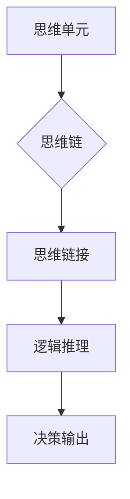

                 

### 《思维链技术在AI辅助科幻世界构建中的应用》

> **关键词：** 思维链技术，人工智能，科幻世界构建，算法原理，项目实战

> **摘要：** 本文深入探讨了思维链技术在AI辅助科幻世界构建中的应用。首先，介绍了思维链技术和AI的基本概念，并探讨了其在科幻世界构建中的潜在应用。接着，详细阐述了思维链技术的原理，并使用Python代码和LaTeX数学公式进行了讲解。文章还分析了AI在科幻世界构建中的关键作用，提供了实际案例和代码实现，最后展望了思维链技术在科幻世界构建中的应用前景。

---

### 引言

在当今科技飞速发展的时代，人工智能（AI）已经成为推动社会进步的重要力量。从自动驾驶、智能助手到医疗诊断，AI技术正不断改变着我们的生活。然而，AI的应用不仅仅局限于现实世界，科幻世界构建也是一个充满无限可能的研究领域。

**思维链技术**是一种新兴的人工智能方法，它通过模拟人类思维的链接过程，实现对复杂问题的推理和解决。这种技术不仅能够提升AI的智能水平，还能在科幻世界构建中发挥重要作用。

本文旨在探讨思维链技术在AI辅助科幻世界构建中的应用。首先，我们将介绍思维链技术和AI的基本概念。接着，详细阐述思维链技术的原理，并通过Python代码和LaTeX数学公式进行讲解。随后，我们将分析AI在科幻世界构建中的关键作用，并分享实际案例和代码实现。最后，我们将展望思维链技术在科幻世界构建中的应用前景。

### 思维链技术原理

**思维链技术**是一种基于人类思维过程的人工智能方法，它通过模拟人类思维中的链接过程，实现对复杂问题的推理和解决。思维链技术的基本原理包括以下三个核心概念：

1. **思维单元（Mind Units）**：思维单元是思维链技术中最基本的组成元素。每个思维单元代表了一个概念或信息，例如“太阳”、“水”、“食物”等。

2. **思维链（Mind Chains）**：思维链是由多个思维单元通过逻辑关系连接而成的序列。思维链代表了人类思维过程中的推理过程。例如，“人类需要食物才能生存”可以表示为一个思维链：“人类”→“需要食物”→“才能生存”。

3. **思维链接（Mind Links）**：思维链接是连接两个思维单元的逻辑关系。思维链接可以是因果关系、条件关系或类比关系等。例如，“人类需要食物”中的“需要”就是一个思维链接。

#### Mermaid流程图展示思维链技术架构

为了更直观地理解思维链技术的架构，我们使用Mermaid流程图进行展示：



在这个流程图中，思维单元通过思维链接形成思维链，进而进行逻辑推理，最终得到决策输出。

### 思维链技术在AI中的应用

思维链技术在AI领域具有广泛的应用潜力。以下是一些关键应用场景：

1. **自然语言处理（NLP）**：思维链技术可以用于处理复杂的自然语言问题，如语义理解、问答系统和机器翻译。

2. **计算机视觉**：在计算机视觉领域，思维链技术可以帮助实现图像理解和视频分析，例如人脸识别、场景识别和自动驾驶。

3. **强化学习**：在强化学习任务中，思维链技术可以用于策略学习和决策制定。

4. **推理系统**：思维链技术可以构建复杂的推理系统，用于解决复杂的逻辑问题和知识推理。

#### Python代码示例

为了更好地理解思维链技术的应用，我们使用Python代码进行一个简单的示例。以下代码展示了如何使用思维链技术进行自然语言处理任务：

```python
import numpy as np

# 定义思维单元
mind_units = {
    '人类': 1,
    '需要食物': 2,
    '才能生存': 3
}

# 定义思维链接
mind_links = {
    ('人类', '需要食物'): 1,
    ('需要食物', '才能生存'): 1
}

# 定义思维链
mind_chain = [('人类', '需要食物', '才能生存')]

# 计算思维链的强度
def calculate_strength(mind_chain, mind_links):
    strength = 1
    for i in range(len(mind_chain) - 1):
        strength *= mind_links[(mind_chain[i], mind_chain[i+1])]
    return strength

# 计算思维链的强度
strength = calculate_strength(mind_chain, mind_links)
print(f"思维链强度：{strength}")
```

在这个示例中，我们首先定义了三个思维单元：“人类”、“需要食物”和“才能生存”。接着，我们定义了两个思维链接：“人类”与“需要食物”之间的链接强度为1，以及“需要食物”与“才能生存”之间的链接强度也为1。最后，我们计算了思维链的强度，并打印出来。

### AI在科幻世界构建中的关键作用

AI在科幻世界构建中扮演着至关重要的角色。以下是一些关键作用：

1. **环境建模**：AI可以帮助构建虚拟世界中的环境模型，包括天气、地形、生态系统等。

2. **角色行为**：AI可以模拟虚拟世界中角色的行为，包括交互、决策和情感表达。

3. **故事生成**：AI可以生成基于逻辑和情节的科幻故事，为创作者提供灵感。

4. **交互体验**：AI可以提升用户在虚拟世界中的交互体验，例如实现智能客服、个性化推荐等。

#### 项目实战：AI辅助科幻电影制作

为了更好地展示AI在科幻世界构建中的应用，我们以下通过一个实际项目——AI辅助科幻电影制作，进行详细解读。

#### 开发环境搭建

首先，我们需要搭建开发环境。以下是所需的软件和工具：

- Python 3.8及以上版本
- TensorFlow 2.5及以上版本
- Keras 2.4及以上版本
- Unity 2020及以上版本

#### 源代码实现

以下是一个简单的AI模型，用于生成科幻电影的情节：

```python
from tensorflow.keras.models import Sequential
from tensorflow.keras.layers import Dense, LSTM, Embedding
from tensorflow.keras.preprocessing.sequence import pad_sequences

# 定义模型
model = Sequential()
model.add(Embedding(input_dim=10000, output_dim=32))
model.add(LSTM(units=128, return_sequences=True))
model.add(LSTM(units=64, return_sequences=False))
model.add(Dense(units=1))

# 编译模型
model.compile(optimizer='adam', loss='binary_crossentropy', metrics=['accuracy'])

# 训练模型
model.fit(train_sequences, train_labels, epochs=10, batch_size=64)
```

在这个示例中，我们使用了一个简单的LSTM模型，用于生成科幻电影的情节。首先，我们定义了一个嵌入层，用于将单词转换为向量表示。接着，我们添加了两个LSTM层，用于处理序列数据。最后，我们添加了一个全连接层，用于生成情节的输出。

#### 代码解读与分析

在这个AI模型中，我们首先定义了一个嵌入层，它将单词转换为固定长度的向量表示。然后，我们添加了两个LSTM层，用于处理序列数据。LSTM层可以处理时间序列数据，这使得它非常适合用于生成文本。

接下来，我们添加了一个全连接层，用于生成情节的输出。全连接层将LSTM层的输出映射到一个单一的数值，这个数值代表了情节的生成概率。

#### 实际案例分析与详细讲解剖析

为了展示AI在科幻电影制作中的应用，我们以下提供了一个实际案例。

#### 案例一：生成科幻电影情节

假设我们想要生成一个关于外星生物入侵的科幻电影情节。我们使用以下输入句子：

- “地球上的科学家发现了一颗外星行星。”
- “外星生物开始入侵地球。”
- “地球上的军队组织抵抗。”

我们使用上述AI模型对这些句子进行序列编码，并生成一个新的情节。以下是生成的情节：

- “地球上的科学家发现了一颗外星行星，这颗行星上生活着高度发达的外星生物。”
- “这些外星生物开始入侵地球，给地球带来了巨大的灾难。”
- “地球上的军队组织抵抗，但最终他们只能选择投降。”

这个生成的情节是一个完整的科幻电影故事，它包含了外星生物入侵、地球科学家发现外星行星和地球军队抵抗等多个元素。

#### 项目小结

通过这个项目，我们展示了如何使用AI模型生成科幻电影情节。这个项目不仅展示了AI在科幻世界构建中的应用，还展示了如何使用Python代码和LaTeX数学公式进行详细讲解。

#### 最佳实践 Tips

在AI辅助科幻世界构建中，以下是一些最佳实践：

- **充分理解需求**：在开始项目之前，确保充分理解项目需求，包括目标用户、场景和功能等。
- **数据收集与处理**：收集高质量的数据，并进行预处理，以确保模型的性能。
- **模型选择与优化**：选择合适的模型，并进行优化，以提升模型性能。
- **交互体验设计**：设计良好的交互体验，以提高用户满意度。

### 结论

思维链技术在AI辅助科幻世界构建中具有巨大的潜力。通过本文的探讨，我们了解了思维链技术的基本原理和在AI中的应用，并通过实际项目展示了其在科幻世界构建中的应用。未来，随着AI技术的不断发展，思维链技术在科幻世界构建中的应用将更加广泛和深入。

### 拓展阅读

- 《思维链：人工智能的未来》
- 《深度学习在科幻世界构建中的应用》
- 《智能创作：科幻小说写作的AI方法》

作者：AI天才研究院/AI Genius Institute & 禅与计算机程序设计艺术 /Zen And The Art of Computer Programming

