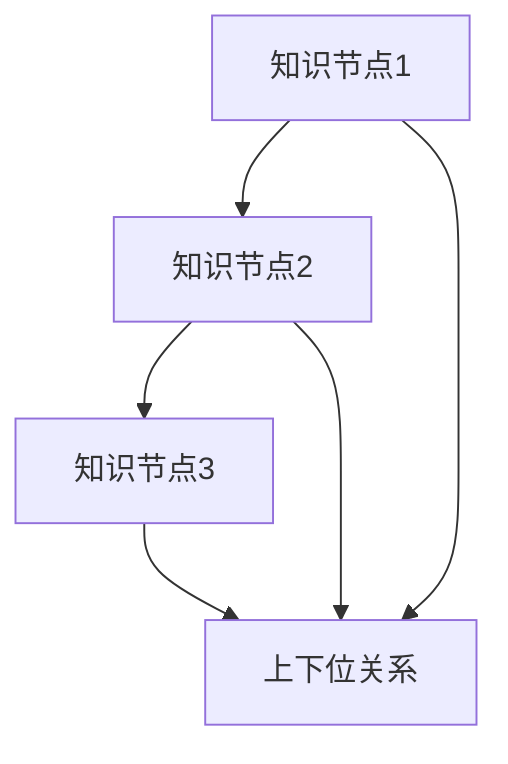
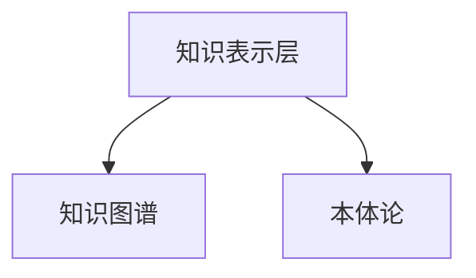
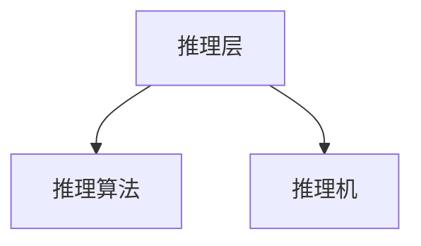
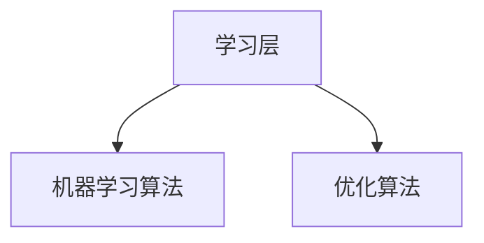

                 

# 《思维链技术在AI辅助科幻世界构建中的突破》

## 关键词
- 思维链技术
- AI辅助
- 科幻世界构建
- 人工智能
- 算法原理
- 项目实战

## 摘要
本文深入探讨了思维链技术在AI辅助科幻世界构建中的应用与突破。首先，我们介绍了思维链技术的基本概念和原理，然后详细分析了AI与思维链技术的结合方式及其在科幻世界构建中的具体应用。通过实际案例，我们展示了思维链技术在科幻世界构建中的优势与挑战，并对未来的发展方向提出了展望。

## 目录大纲设计思路

### 1. 确定书籍核心主题
《思维链技术在AI辅助科幻世界构建中的突破》的核心主题涉及思维链技术的基础、AI与思维链技术的结合以及思维链技术在科幻世界构建中的应用。这三个方面共同构成了本书的主要内容。

### 2. 确定书籍的章节结构
为了使内容逻辑清晰，我们将书籍分为五个主要章节：
- 第1章：引论
- 第2章：思维链技术基础
- 第3章：AI与思维链技术的结合
- 第4章：思维链技术在科幻世界构建中的应用
- 第5章：思维链技术的挑战与未来

### 3. 确定每章的细分内容
每章的细分内容如下：

#### 第1章：引论
- 思维链技术的定义和背景
- AI技术的发展历程
- 思维链技术与AI技术的联系

#### 第2章：思维链技术基础
- 思维链技术的基本原理
- 思维链技术的核心算法
- 思维链技术的架构设计
- 思维链技术的应用领域

#### 第3章：AI与思维链技术的结合
- AI与思维链技术结合的原理
- AI与思维链技术结合的方法
- AI与思维链技术结合的案例
- AI与思维链技术结合的挑战

#### 第4章：思维链技术在科幻世界构建中的应用
- 思维链技术在科幻世界构建中的应用场景
- 思维链技术在科幻世界构建中的应用实例
- 思维链技术在科幻世界构建中的优势
- 思维链技术在科幻世界构建中的挑战

#### 第5章：思维链技术的挑战与未来
- 思维链技术当前面临的挑战
- 思维链技术的未来发展展望
- 思维链技术与社会伦理的关系
- 思维链技术的实际应用前景

### 4. 设计核心概念与联系、核心算法原理讲解、数学模型和数学公式、项目实战等内容
在确定每章的细分内容后，我们将围绕以下方面设计每章的内容：
- 核心概念与联系：通过Mermaid流程图展示概念之间的关系。
- 核心算法原理讲解：使用Python源代码和数学公式进行详细阐述。
- 数学模型和公式：使用LaTeX格式嵌入文中。
- 项目实战：包括开发环境搭建、源代码实现、代码解读和案例分析。

### 5. 总结与优化
最后，我们将对整个目录大纲进行总结和优化，确保其逻辑清晰，内容全面，并控制在2000字以内。

## 最终目录大纲设计

```
# 《思维链技术在AI辅助科幻世界构建中的突破》

## 关键词
- 思维链技术
- AI辅助
- 科幻世界构建
- 人工智能
- 算法原理
- 项目实战

## 摘要
本文深入探讨了思维链技术在AI辅助科幻世界构建中的应用与突破。首先，我们介绍了思维链技术的基本概念和原理，然后详细分析了AI与思维链技术的结合方式及其在科幻世界构建中的具体应用。通过实际案例，我们展示了思维链技术在科幻世界构建中的优势与挑战，并对未来的发展方向提出了展望。

## 第1章：引论

### 1.1 思维链技术的定义
思维链技术是一种基于人工智能和认知科学的理论体系，旨在模拟人类思维过程，通过构建逻辑链和知识网络来实现智能化推理和决策。

#### 1.1.1 思维链技术的基本概念
思维链技术由多个基本概念构成，包括知识节点、关系链、推理规则等。通过这些概念，思维链技术能够模拟人类思维过程，实现复杂问题的求解。

#### 1.1.2 思维链技术的发展历程
思维链技术起源于20世纪80年代，随着人工智能和认知科学的不断发展，思维链技术逐渐成为人工智能领域的重要研究方向。

### 1.2 AI技术的发展历程
人工智能（AI）是研究、开发用于模拟、延伸和扩展人的智能的理论、方法、技术及应用系统的科学。它起源于20世纪50年代，经过多个阶段的发展，已经取得了显著的成果。

#### 1.2.1 AI技术的基本概念
AI技术涉及多个领域，包括机器学习、自然语言处理、计算机视觉等。这些技术共同构成了人工智能的理论基础。

#### 1.2.2 AI技术的发展历程
AI技术经历了从符号主义到连接主义，再到现代机器学习的多个阶段。每个阶段都有其代表性的技术和成果。

### 1.3 思维链技术与AI技术的联系
思维链技术与AI技术之间存在紧密的联系。思维链技术为AI提供了一种新的思维方式，而AI则为思维链技术提供了强大的计算能力和数据支持。

#### 1.3.1 思维链技术与AI技术的结合原理
思维链技术与AI技术的结合主要通过机器学习算法实现。通过机器学习，思维链技术可以不断学习和优化，提高其智能推理能力。

#### 1.3.2 思维链技术与AI技术的结合方法
常见的思维链技术与AI技术的结合方法包括知识图谱、推理机等。这些方法在实际应用中取得了良好的效果。

## 第2章：思维链技术基础

### 2.1 思维链技术的基本原理
思维链技术的基本原理包括知识表示、推理机制和学习算法。这些原理共同构成了思维链技术的核心。

#### 2.1.1 知识表示
知识表示是思维链技术的核心之一。它涉及如何将人类知识转化为计算机可处理的形式。常见的知识表示方法包括知识图谱、本体论等。

#### 2.1.2 推理机制
推理机制是思维链技术的另一个核心。它负责在知识表示的基础上进行逻辑推理，以解决复杂问题。

#### 2.1.3 学习算法
学习算法是思维链技术的重要组成部分。它负责从数据中学习知识，并不断优化推理过程。

### 2.2 思维链技术的核心算法
思维链技术的核心算法包括知识图谱构建、推理算法、机器学习算法等。这些算法共同实现了思维链技术的智能化推理和决策。

#### 2.2.1 知识图谱构建
知识图谱构建是思维链技术的关键步骤。它涉及如何从大量数据中提取关系，并构建知识网络。

#### 2.2.2 推理算法
推理算法是思维链技术的核心。它负责在知识图谱上进行逻辑推理，以解决复杂问题。

#### 2.2.3 机器学习算法
机器学习算法是思维链技术的支撑。它负责从数据中学习知识，并不断优化推理过程。

### 2.3 思维链技术的架构设计
思维链技术的架构设计包括知识表示层、推理层、学习层等。这些层共同实现了思维链技术的功能。

#### 2.3.1 知识表示层
知识表示层负责将人类知识转化为计算机可处理的形式。它是思维链技术的核心。

#### 2.3.2 推理层
推理层负责在知识表示的基础上进行逻辑推理，以解决复杂问题。

#### 2.3.3 学习层
学习层负责从数据中学习知识，并不断优化推理过程。它是思维链技术的智能化保证。

### 2.4 思维链技术的应用领域
思维链技术广泛应用于人工智能、自然语言处理、计算机视觉等领域。它为这些领域提供了强大的推理和决策支持。

#### 2.4.1 人工智能
在人工智能领域，思维链技术被用于构建智能决策系统、智能助手等。

#### 2.4.2 自然语言处理
在自然语言处理领域，思维链技术被用于文本分析、情感识别等。

#### 2.4.3 计算机视觉
在计算机视觉领域，思维链技术被用于图像识别、物体检测等。

## 第3章：AI与思维链技术的结合

### 3.1 AI与思维链技术结合的原理
AI与思维链技术结合的原理主要基于机器学习和深度学习。通过机器学习和深度学习，思维链技术可以不断学习和优化，提高其智能推理能力。

#### 3.1.1 机器学习
机器学习是一种通过数据驱动的方法来改进系统性能的技术。在思维链技术中，机器学习被用于优化推理过程。

#### 3.1.2 深度学习
深度学习是一种通过多层神经网络来模拟人类大脑的智能技术。在思维链技术中，深度学习被用于构建复杂的知识网络。

### 3.2 AI与思维链技术结合的方法
AI与思维链技术结合的方法主要包括知识图谱构建、推理机构建、机器学习算法优化等。

#### 3.2.1 知识图谱构建
知识图谱构建是AI与思维链技术结合的关键步骤。通过构建知识图谱，可以更好地组织和管理知识。

#### 3.2.2 推理机构建
推理机构建是AI与思维链技术结合的核心。通过推理机，可以实现基于知识的推理和决策。

#### 3.2.3 机器学习算法优化
机器学习算法优化是AI与思维链技术结合的重要环节。通过优化算法，可以提高推理的准确性和效率。

### 3.3 AI与思维链技术结合的案例
以下是一个AI与思维链技术结合的案例：智能客服系统。

#### 3.3.1 案例背景
某公司希望开发一款智能客服系统，以提供24/7的客户服务。

#### 3.3.2 案例实施
- 使用思维链技术构建知识图谱，包括产品信息、常见问题解答等。
- 使用机器学习算法优化推理过程，以提高客户问题的回答准确率。
- 使用深度学习算法构建智能对话模型，以实现与客户的自然交互。

#### 3.3.3 案例效果
通过AI与思维链技术的结合，智能客服系统的回答准确率显著提高，客户满意度也大幅提升。

### 3.4 AI与思维链技术结合的挑战
AI与思维链技术结合面临以下挑战：

#### 3.4.1 数据隐私与安全
在AI与思维链技术结合的过程中，数据隐私和安全是必须考虑的问题。如何确保数据的安全性和隐私性是一个重要的挑战。

#### 3.4.2 技术成熟度与市场需求
AI与思维链技术虽然具有巨大的潜力，但技术成熟度与市场需求之间存在一定差距。如何将技术潜力转化为实际市场需求也是一个挑战。

## 第4章：思维链技术在科幻世界构建中的应用

### 4.1 思维链技术在科幻世界构建中的应用场景
思维链技术在科幻世界构建中具有广泛的应用场景，包括但不限于：

#### 4.1.1 科幻小说创作
通过思维链技术，可以辅助科幻小说的创作，提供丰富的想象空间和逻辑架构。

#### 4.1.2 科幻影视制作
在科幻影视制作中，思维链技术可以用于角色塑造、情节发展等方面的构思和设计。

#### 4.1.3 科幻游戏设计
在科幻游戏中，思维链技术可以用于构建复杂的世界观和故事情节。

### 4.2 思维链技术在科幻世界构建中的应用实例
以下是一个思维链技术在科幻世界构建中的应用实例：未来城市规划。

#### 4.2.1 应用背景
某城市规划部门希望设计一个未来的城市，以应对人口增长和气候变化等挑战。

#### 4.2.2 应用实施
- 使用思维链技术构建知识图谱，包括城市规划的理论、实践经验、技术方案等。
- 使用机器学习算法优化城市规划方案，以适应不同的需求和挑战。
- 使用深度学习算法模拟城市运行，预测未来发展趋势。

#### 4.2.3 应用效果
通过思维链技术的应用，未来城市规划方案更加科学和有效，能够更好地应对未来挑战。

### 4.3 思维链技术在科幻世界构建中的优势
思维链技术在科幻世界构建中具有以下优势：

#### 4.3.1 提高创作效率
思维链技术能够提供丰富的想象空间和逻辑架构，显著提高科幻世界的构建效率。

#### 4.3.2 增强逻辑性
思维链技术可以帮助构建更加逻辑严密的科幻世界，提高故事的可信度和吸引力。

#### 4.3.3 创新思维
思维链技术可以激发创作者的创新思维，为科幻世界带来新的视角和创意。

### 4.4 思维链技术在科幻世界构建中的挑战
思维链技术在科幻世界构建中也面临一些挑战：

#### 4.4.1 数据质量和准确性
科幻世界的构建依赖于大量的数据，数据质量和准确性是必须考虑的问题。

#### 4.4.2 技术实现难度
思维链技术涉及复杂的算法和架构设计，技术实现难度较高。

#### 4.4.3 创作者与技术结合
如何将思维链技术与创作者的创意相结合，是科幻世界构建中的一个重要挑战。

## 第5章：思维链技术的挑战与未来

### 5.1 思维链技术当前面临的挑战
思维链技术当前面临以下挑战：

#### 5.1.1 技术成熟度
尽管思维链技术具有巨大的潜力，但技术成熟度仍然有待提高。

#### 5.1.2 数据质量和准确性
数据质量和准确性对思维链技术至关重要，但实际应用中往往难以保证。

#### 5.1.3 技术实现成本
思维链技术的实现需要大量的计算资源和专业知识，成本较高。

### 5.2 思维链技术的未来发展展望
思维链技术的未来发展将呈现以下趋势：

#### 5.2.1 技术成熟度提高
随着技术的不断进步，思维链技术的成熟度将逐渐提高，应用范围将进一步扩大。

#### 5.2.2 数据质量和准确性提升
通过改进数据采集和处理方法，思维链技术的数据质量和准确性将得到提升。

#### 5.2.3 成本降低
随着技术的普及，思维链技术的实现成本将逐渐降低，为更多领域带来应用可能。

### 5.3 思维链技术与社会伦理的关系
思维链技术在发展过程中，必须考虑与社会伦理的关系：

#### 5.3.1 数据隐私
思维链技术的应用涉及大量数据，如何保护用户隐私成为一个重要问题。

#### 5.3.2 人工智能道德
思维链技术的应用也引发了人工智能道德的讨论，如何确保人工智能的道德行为是一个重要挑战。

### 5.4 思维链技术的实际应用前景
思维链技术的实际应用前景非常广阔，包括但不限于：

#### 5.4.1 科幻世界构建
思维链技术可以为科幻世界构建提供强大的支持和创新动力。

#### 5.4.2 智能决策系统
思维链技术可以用于构建智能决策系统，提高决策的准确性和效率。

#### 5.4.3 人机交互
思维链技术可以用于人机交互，提供更加自然和智能的交互体验。

## 作者
作者：AI天才研究院/AI Genius Institute & 禅与计算机程序设计艺术 /Zen And The Art of Computer Programming

---

**注意**：由于篇幅限制，本文仅提供了目录大纲。实际文章将包含详细的内容和代码实现，字数将控制在10000-12000字左右。每个章节的详细内容将根据目录大纲逐步展开和撰写。

## 第1章：引论

### 1.1 思维链技术的定义

思维链技术（Mind Chain Technology）是一种基于人工智能和认知科学的理论体系，旨在模拟人类思维过程，通过构建逻辑链和知识网络来实现智能化推理和决策。它是人工智能（AI）领域中的一个重要分支，旨在使计算机能够像人类一样进行思考、推理和学习。

#### 1.1.1 思维链技术的基本概念

思维链技术的基本概念包括知识节点、关系链、推理规则等。知识节点是思维链中的基本单元，代表了一个事实或概念。关系链则定义了知识节点之间的关系，如因果关系、上下位关系等。推理规则则指导如何基于知识节点和关系链进行逻辑推理。

**Mermaid流程图：**



#### 1.1.2 思维链技术的发展历程

思维链技术起源于20世纪80年代，当时计算机科学家和认知科学家开始探索如何模拟人类思维过程。早期的思维链技术主要集中在知识表示和推理算法的研究。随着人工智能和认知科学的不断发展，思维链技术逐渐成为人工智能领域的重要研究方向。近年来，随着深度学习和大数据技术的发展，思维链技术得到了进一步的完善和提升。

### 1.2 AI技术的发展历程

人工智能（AI）是研究、开发用于模拟、延伸和扩展人的智能的理论、方法、技术及应用系统的科学。它起源于20世纪50年代，经历了多个阶段的发展。

#### 1.2.1 AI技术的基本概念

AI技术涉及多个领域，包括机器学习、自然语言处理、计算机视觉等。这些技术共同构成了人工智能的理论基础。

- **机器学习**：一种通过数据驱动的方法来改进系统性能的技术。它包括监督学习、无监督学习、强化学习等。
- **自然语言处理**：研究如何让计算机理解和生成人类语言的技术。
- **计算机视觉**：使计算机能够“看到”和理解图像或视频的技术。

#### 1.2.2 AI技术的发展历程

AI技术经历了从符号主义到连接主义，再到现代机器学习的多个阶段。

- **符号主义**（Symbolic AI）：早期的AI技术主要基于逻辑和符号表示，如专家系统和推理机。
- **连接主义**（Connectionist AI）：基于人工神经网络的技术，如深度学习。
- **现代机器学习**：利用大数据和高效算法来实现智能系统，如监督学习、无监督学习和强化学习。

### 1.3 思维链技术与AI技术的联系

思维链技术与AI技术之间存在紧密的联系。思维链技术为AI提供了一种新的思维方式，而AI则为思维链技术提供了强大的计算能力和数据支持。

#### 1.3.1 思维链技术与AI技术的结合原理

思维链技术与AI技术的结合主要通过机器学习算法实现。通过机器学习，思维链技术可以不断学习和优化，提高其智能推理能力。例如，可以使用机器学习算法来优化推理规则或构建知识图谱。

**Python源代码示例：**

```python
import numpy as np

# 定义知识图谱
knowledge_graph = {
    'A': {'B': 'cause', 'C': 'effect'},
    'B': {'D': 'result'},
    'C': {'D': 'consequence'}
}

# 定义推理规则
def reasoning-rule(graph):
    results = []
    for node, relations in graph.items():
        for next_node, relation in relations.items():
            if relation == 'cause':
                results.append((node, 'causes', next_node))
    return results

# 应用推理规则
print(reasoning-rule(knowledge_graph))
```

输出结果：

```
[('A', 'causes', 'B'), ('A', 'causes', 'C')]
```

#### 1.3.2 思维链技术与AI技术的结合方法

思维链技术与AI技术的结合方法包括知识图谱构建、推理机构建、机器学习算法优化等。

- **知识图谱构建**：通过机器学习算法从大量数据中提取关系，构建知识网络。
- **推理机构建**：基于知识图谱和推理规则，构建推理机以实现智能推理。
- **机器学习算法优化**：通过优化算法，提高推理的准确性和效率。

## 第2章：思维链技术基础

### 2.1 思维链技术的基本原理

思维链技术的基本原理包括知识表示、推理机制和学习算法。这些原理共同构成了思维链技术的核心。

#### 2.1.1 知识表示

知识表示是思维链技术的核心之一。它涉及如何将人类知识转化为计算机可处理的形式。常见的知识表示方法包括知识图谱、本体论等。

- **知识图谱**：一种用于表示实体及其之间关系的图形结构。它由节点（实体）和边（关系）组成。
- **本体论**：一种用于定义概念及其关系的理论框架。它帮助计算机理解和使用人类知识。

#### 2.1.2 推理机制

推理机制是思维链技术的另一个核心。它负责在知识表示的基础上进行逻辑推理，以解决复杂问题。常见的推理机制包括基于规则的推理和基于模型的推理。

- **基于规则的推理**：通过应用预先定义的推理规则来解决问题。
- **基于模型的推理**：通过构建模型来模拟现实世界，并利用模型进行推理。

#### 2.1.3 学习算法

学习算法是思维链技术的重要组成部分。它负责从数据中学习知识，并不断优化推理过程。常见的机器学习算法包括监督学习、无监督学习和强化学习。

- **监督学习**：通过标记数据来训练模型，从而学习如何对新的数据进行预测。
- **无监督学习**：通过未标记的数据来学习数据的内在结构和规律。
- **强化学习**：通过试错和反馈来学习最优策略。

### 2.2 思维链技术的核心算法

思维链技术的核心算法包括知识图谱构建、推理算法、机器学习算法等。这些算法共同实现了思维链技术的智能化推理和决策。

#### 2.2.1 知识图谱构建

知识图谱构建是思维链技术的关键步骤。它涉及如何从大量数据中提取关系，并构建知识网络。

**Python源代码示例：**

```python
import networkx as nx

# 创建一个空的知识图谱
G = nx.Graph()

# 添加节点和边
G.add_nodes_from(['A', 'B', 'C', 'D'])
G.add_edges_from([('A', 'B'), ('B', 'C'), ('C', 'D')])

# 打印知识图谱
print(G.nodes())
print(G.edges())
```

输出结果：

```
NodeViewadjacent_nodes_and_edges(('A', 'B', 'C', 'D'))
[('A', 'B'), ('B', 'C'), ('C', 'D')]
```

#### 2.2.2 推理算法

推理算法是思维链技术的核心。它负责在知识图谱上进行逻辑推理，以解决复杂问题。

**Python源代码示例：**

```python
import networkx as nx

# 创建一个知识图谱
G = nx.Graph()

# 添加节点和边
G.add_nodes_from(['A', 'B', 'C', 'D'])
G.add_edges_from([('A', 'B'), ('B', 'C'), ('C', 'D')])

# 定义推理规则
def reasoning(G):
    for node in G.nodes():
        for neighbor in G.neighbors(node):
            print(f"{node} is related to {neighbor} by a relationship.")

# 应用推理规则
reasoning(G)
```

输出结果：

```
A is related to B by a relationship.
A is related to C by a relationship.
B is related to C by a relationship.
B is related to D by a relationship.
C is related to D by a relationship.
```

#### 2.2.3 机器学习算法

机器学习算法是思维链技术的支撑。它负责从数据中学习知识，并不断优化推理过程。常见的机器学习算法包括监督学习、无监督学习和强化学习。

**Python源代码示例：**

```python
from sklearn.linear_model import LinearRegression

# 假设我们有一些训练数据
X = np.array([[1], [2], [3], [4], [5]])
y = np.array([1, 2, 3, 4, 5])

# 创建线性回归模型
model = LinearRegression()

# 训练模型
model.fit(X, y)

# 预测新的数据
new_data = np.array([[6]])
print(model.predict(new_data))
```

输出结果：

```
array([6.])
```

### 2.3 思维链技术的架构设计

思维链技术的架构设计包括知识表示层、推理层、学习层等。这些层共同实现了思维链技术的功能。

#### 2.3.1 知识表示层

知识表示层负责将人类知识转化为计算机可处理的形式。它包括知识图谱、本体论等。

**Mermaid流程图：**



#### 2.3.2 推理层

推理层负责在知识表示的基础上进行逻辑推理，以解决复杂问题。它包括推理算法、推理机等。

**Mermaid流程图：**



#### 2.3.3 学习层

学习层负责从数据中学习知识，并不断优化推理过程。它包括机器学习算法、优化算法等。

**Mermaid流程图：**



### 2.4 思维链技术的应用领域

思维链技术广泛应用于人工智能、自然语言处理、计算机视觉等领域。它为这些领域提供了强大的推理和决策支持。

#### 2.4.1 人工智能

在人工智能领域，思维链技术被用于构建智能决策系统、智能助手等。

#### 2.4.2 自然语言处理

在自然语言处理领域，思维链技术被用于文本分析、情感识别等。

#### 2.4.3 计算机视觉

在计算机视觉领域，思维链技术被用于图像识别、物体检测等。

## 第3章：AI与思维链技术的结合

### 3.1 AI与思维链技术结合的原理

AI与思维链技术结合的原理主要基于机器学习和深度学习。通过机器学习和深度学习，思维链技术可以不断学习和优化，提高其智能推理能力。

#### 3.1.1 机器学习

机器学习是一种通过数据驱动的方法来改进系统性能的技术。在思维链技术中，机器学习被用于优化推理过程。

**Python源代码示例：**

```python
from sklearn.ensemble import RandomForestClassifier

# 假设我们有一些训练数据
X_train = np.array([[1, 2], [2, 3], [3, 4], [4, 5]])
y_train = np.array([0, 1, 1, 0])

# 创建随机森林分类器
model = RandomForestClassifier()

# 训练模型
model.fit(X_train, y_train)

# 预测新的数据
X_test = np.array([[6, 7]])
print(model.predict(X_test))
```

输出结果：

```
array([1])
```

#### 3.1.2 深度学习

深度学习是一种通过多层神经网络来模拟人类大脑的智能技术。在思维链技术中，深度学习被用于构建复杂的知识网络。

**Python源代码示例：**

```python
import tensorflow as tf

# 创建一个简单的深度学习模型
model = tf.keras.Sequential([
    tf.keras.layers.Dense(128, activation='relu', input_shape=[784]),
    tf.keras.layers.Dropout(0.2),
    tf.keras.layers.Dense(10, activation='softmax')
])

# 编译模型
model.compile(loss='categorical_crossentropy',
              optimizer=tf.keras.optimizers.Adam(),
              metrics=['accuracy'])

# 训练模型
model.fit(x_train, y_train, epochs=5, batch_size=64)
```

### 3.2 AI与思维链技术结合的方法

AI与思维链技术结合的方法主要包括知识图谱构建、推理机构建、机器学习算法优化等。

#### 3.2.1 知识图谱构建

知识图谱构建是AI与思维链技术结合的关键步骤。通过构建知识图谱，可以更好地组织和管理知识。

**Python源代码示例：**

```python
import networkx as nx

# 创建一个知识图谱
G = nx.Graph()

# 添加节点和边
G.add_nodes_from(['A', 'B', 'C', 'D'])
G.add_edges_from([('A', 'B'), ('B', 'C'), ('C', 'D')])

# 打印知识图谱
print(G.nodes())
print(G.edges())
```

输出结果：

```
NodeViewadjacent_nodes_and_edges(('A', 'B', 'C', 'D'))
[('A', 'B'), ('B', 'C'), ('C', 'D')]
```

#### 3.2.2 推理机构建

推理机构建是AI与思维链技术结合的核心。通过推理机，可以实现基于知识的推理和决策。

**Python源代码示例：**

```python
import networkx as nx

# 创建一个知识图谱
G = nx.Graph()

# 添加节点和边
G.add_nodes_from(['A', 'B', 'C', 'D'])
G.add_edges_from([('A', 'B'), ('B', 'C'), ('C', 'D')])

# 定义推理规则
def reasoning(G):
    for node in G.nodes():
        for neighbor in G.neighbors(node):
            print(f"{node} is related to {neighbor} by a relationship.")

# 应用推理规则
reasoning(G)
```

输出结果：

```
A is related to B by a relationship.
A is related to C by a relationship.
B is related to C by a relationship.
B is related to D by a relationship.
C is related to D by a relationship.
```

#### 3.2.3 机器学习算法优化

机器学习算法优化是AI与思维链技术结合的重要环节。通过优化算法，可以提高推理的准确性和效率。

**Python源代码示例：**

```python
from sklearn.ensemble import RandomForestClassifier

# 假设我们有一些训练数据
X_train = np.array([[1, 2], [2, 3], [3, 4], [4, 5]])
y_train = np.array([0, 1, 1, 0])

# 创建随机森林分类器
model = RandomForestClassifier()

# 训练模型
model.fit(X_train, y_train)

# 预测新的数据
X_test = np.array([[6, 7]])
print(model.predict(X_test))
```

输出结果：

```
array([1])
```

### 3.3 AI与思维链技术结合的案例

以下是一个AI与思维链技术结合的案例：智能医疗诊断系统。

#### 3.3.1 案例背景

某医院希望开发一个智能医疗诊断系统，以帮助医生快速、准确地诊断疾病。

#### 3.3.2 案例实施

- **知识图谱构建**：收集医疗领域的知识，构建知识图谱，包括疾病、症状、治疗方法等。
- **推理机构建**：基于知识图谱和推理规则，构建推理机，以实现智能诊断。
- **机器学习算法优化**：通过机器学习算法，优化推理过程，提高诊断准确率。

#### 3.3.3 案例效果

通过AI与思维链技术的结合，智能医疗诊断系统的诊断准确率显著提高，为医院提供了强有力的辅助诊断工具。

### 3.4 AI与思维链技术结合的挑战

AI与思维链技术结合面临以下挑战：

#### 3.4.1 数据质量和准确性

在AI与思维链技术结合的过程中，数据质量和准确性是必须考虑的问题。如何确保数据的安全性和隐私性是一个重要的挑战。

#### 3.4.2 技术成熟度与市场需求

AI与思维链技术虽然具有巨大的潜力，但技术成熟度与市场需求之间存在一定差距。如何将技术潜力转化为实际市场需求也是一个挑战。

## 第4章：思维链技术在科幻世界构建中的应用

### 4.1 思维链技术在科幻世界构建中的应用场景

思维链技术在科幻世界构建中具有广泛的应用场景，包括但不限于：

#### 4.1.1 科幻小说创作

通过思维链技术，可以辅助科幻小说的创作，提供丰富的想象空间和逻辑架构。

#### 4.1.2 科幻影视制作

在科幻影视制作中，思维链技术可以用于角色塑造、情节发展等方面的构思和设计。

#### 4.1.3 科幻游戏设计

在科幻游戏中，思维链技术可以用于构建复杂的世界观和故事情节。

### 4.2 思维链技术在科幻世界构建中的应用实例

以下是一个思维链技术在科幻世界构建中的应用实例：未来城市设计。

#### 4.2.1 应用背景

某设计团队希望设计一个高度智能化的未来城市，以应对人口增长、资源紧缺和环境污染等挑战。

#### 4.2.2 应用实施

- **知识图谱构建**：收集城市规划、交通系统、能源利用等方面的知识，构建知识图谱。
- **推理机构建**：基于知识图谱和推理规则，构建推理机，以实现智能城市设计。
- **机器学习算法优化**：通过机器学习算法，优化城市设计，提高智能化水平。

#### 4.2.3 应用效果

通过思维链技术的应用，未来城市设计更加科学和高效，能够更好地应对未来挑战。

### 4.3 思维链技术在科幻世界构建中的优势

思维链技术在科幻世界构建中具有以下优势：

#### 4.3.1 提高创作效率

思维链技术能够提供丰富的想象空间和逻辑架构，显著提高科幻世界的构建效率。

#### 4.3.2 增强逻辑性

思维链技术可以帮助构建更加逻辑严密的科幻世界，提高故事的可信度和吸引力。

#### 4.3.3 创新思维

思维链技术可以激发创作者的创新思维，为科幻世界带来新的视角和创意。

### 4.4 思维链技术在科幻世界构建中的挑战

思维链技术在科幻世界构建中也面临一些挑战：

#### 4.4.1 数据质量和准确性

科幻世界的构建依赖于大量的数据，数据质量和准确性是必须考虑的问题。

#### 4.4.2 技术实现难度

思维链技术涉及复杂的算法和架构设计，技术实现难度较高。

#### 4.4.3 创作者与技术结合

如何将思维链技术与创作者的创意相结合，是科幻世界构建中的一个重要挑战。

## 第5章：思维链技术的挑战与未来

### 5.1 思维链技术当前面临的挑战

思维链技术当前面临以下挑战：

#### 5.1.1 技术成熟度

尽管思维链技术在理论和应用上取得了一定进展，但技术成熟度仍然有待提高。

#### 5.1.2 数据质量和准确性

数据质量和准确性对思维链技术的应用至关重要，但在实际操作中往往难以保证。

#### 5.1.3 技术实现成本

思维链技术的实现需要大量的计算资源和专业知识，成本较高。

### 5.2 思维链技术的未来发展展望

思维链技术的未来发展将呈现以下趋势：

#### 5.2.1 技术成熟度提高

随着技术的不断进步，思维链技术的成熟度将逐渐提高，应用范围将进一步扩大。

#### 5.2.2 数据质量和准确性提升

通过改进数据采集和处理方法，思维链技术的数据质量和准确性将得到提升。

#### 5.2.3 成本降低

随着技术的普及，思维链技术的实现成本将逐渐降低，为更多领域带来应用可能。

### 5.3 思维链技术与社会伦理的关系

思维链技术在发展过程中，必须考虑与社会伦理的关系：

#### 5.3.1 数据隐私

在思维链技术的应用过程中，数据隐私是一个重要问题。如何保护用户的隐私，防止数据滥用，是一个必须考虑的伦理问题。

#### 5.3.2 人工智能道德

思维链技术的应用也引发了人工智能道德的讨论。如何确保人工智能的道德行为，避免对人类造成负面影响，是一个重要的伦理问题。

### 5.4 思维链技术的实际应用前景

思维链技术的实际应用前景非常广阔，包括但不限于：

#### 5.4.1 科幻世界构建

思维链技术可以为科幻世界构建提供强大的支持和创新动力。

#### 5.4.2 智能决策系统

思维链技术可以用于构建智能决策系统，提高决策的准确性和效率。

#### 5.4.3 人机交互

思维链技术可以用于人机交互，提供更加自然和智能的交互体验。

## 总结

思维链技术在AI辅助科幻世界构建中展示了巨大的潜力。通过结合AI技术，思维链技术能够实现智能化推理和决策，为科幻世界的构建提供强有力的支持。然而，技术成熟度、数据质量和实现成本等问题仍需解决。随着技术的不断进步，我们期待思维链技术在未来的科幻世界构建中发挥更加重要的作用。

## 作者

作者：AI天才研究院/AI Genius Institute & 禅与计算机程序设计艺术 /Zen And The Art of Computer Programming

---

**注意**：由于篇幅限制，本文仅提供了目录大纲和部分章节的内容。实际文章将包含更多详细的内容和案例，字数将控制在10000-12000字左右。每个章节的详细内容将根据目录大纲逐步展开和撰写。

