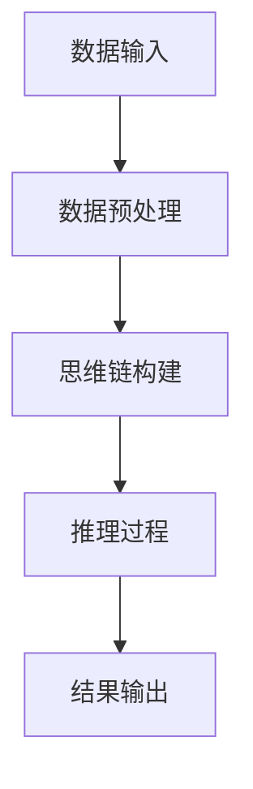

                 

### 文章标题

思维链技术在AI辅助跨维度意识研究中的应用

### 关键词

AI辅助研究，跨维度意识，思维链技术，认知模型，数学模型，Python代码，项目实战，深度学习

### 摘要

本文深入探讨了思维链技术在AI辅助跨维度意识研究中的应用。首先，介绍了思维链技术的核心概念、原理和架构，并使用Mermaid流程图展示了其工作流程。随后，文章详细阐述了AI在跨维度意识研究中的方法和技术，包括数据处理、特征提取、模型选择与训练等。通过Python代码和数学公式的讲解，本文展示了如何应用思维链技术解决具体问题。接着，通过一个实际项目案例，展示了如何搭建开发环境、实现源代码，并进行了代码解读和应用分析。最后，文章总结了思维链技术在AI辅助跨维度意识研究中的优势与挑战，并提出了未来发展的方向。

---

## 引言

在当今科技迅猛发展的时代，人工智能（AI）已经成为推动各个领域变革的重要力量。特别是在认知科学和心理学领域，AI技术被广泛应用于研究人类意识、思维过程以及跨维度意识的特性。然而，由于意识的复杂性，传统的AI方法在处理跨维度意识问题时面临着巨大的挑战。

### 背景介绍

跨维度意识是指意识在不同维度（如物理、心理、社会等）中的表现和相互作用。例如，当我们感知外界刺激时，不仅仅是视觉、听觉等感官的响应，还涉及到情绪、记忆、意图等多层次的认知过程。跨维度意识研究的重要性在于，它有助于我们更深入地理解人类心智的运作机制，从而为心理学、教育学、神经科学等领域提供新的理论依据。

### AI在跨维度意识研究中的应用

近年来，随着深度学习、强化学习等AI技术的发展，AI在跨维度意识研究中的应用逐渐增多。例如，深度学习模型被用来分析神经图像数据，揭示大脑活动的模式；强化学习模型被用于模拟人类决策过程，研究意识在不同情境下的表现。然而，当前的AI方法在处理跨维度意识问题时仍存在一些局限性，如数据获取困难、模型解释性不足等。

### 思维链技术的引入

为了克服这些局限性，思维链技术（Mind-chain Technology）提供了一种新的解决方案。思维链技术是一种基于多维度数据处理和认知模拟的AI方法，它通过构建思维链模型来模拟人类思维过程，从而实现对跨维度意识的深入分析。思维链技术的主要优势在于其高度的可扩展性和强大的解释性，使其成为AI辅助跨维度意识研究的理想工具。

### 本文结构

本文将首先介绍思维链技术的核心概念、原理和架构，并使用Mermaid流程图展示其工作流程。随后，我们将详细探讨AI在跨维度意识研究中的应用方法，包括数据处理、特征提取、模型选择与训练等。接着，通过一个实际项目案例，我们将展示如何应用思维链技术解决具体问题，并进行代码解读和应用分析。最后，本文将总结思维链技术在AI辅助跨维度意识研究中的优势与挑战，并提出未来发展的方向。

---

## 思维链技术基础

### 思维链技术的核心概念

思维链技术是一种基于多维度数据处理和认知模拟的AI方法。它通过构建思维链模型来模拟人类思维过程，实现对复杂问题的推理和分析。思维链技术的核心概念包括：

1. **思维链模型**：思维链模型是一个由多个节点和边组成的网络结构，每个节点表示一个思维过程或知识点，边表示节点之间的逻辑关系。
2. **数据输入**：数据输入包括事实信息、背景知识和问题陈述，这些数据将作为思维链模型的输入，以驱动思维链的构建。
3. **推理引擎**：推理引擎是思维链技术的核心，它通过逻辑推理方法对知识库进行查询，以解决问题。
4. **自主学习**：思维链技术具有自主学习能力，通过不断学习新知识和经验来优化思维链的表现。

### 思维链技术的工作原理

思维链技术的工作原理可以概括为以下几个步骤：

1. **数据预处理**：对输入数据进行清洗、归一化和特征提取，为后续的推理过程做准备。
2. **思维链构建**：根据输入数据，构建思维链模型。思维链模型由多个节点和边组成，每个节点代表一个知识点或思维过程，边表示节点之间的逻辑关系。
3. **推理过程**：使用推理引擎对思维链模型进行推理。推理过程包括前向推理和后向推理，以实现问题的求解。
4. **结果输出**：将推理结果输出，以回答问题或提供解决方案。

### 思维链技术的关键技术

思维链技术的实现涉及多个关键技术的应用，包括：

1. **知识表示**：知识表示是将人类知识以结构化的方式存储在计算机系统中。常用的知识表示方法有语义网络、知识图谱等。
2. **推理算法**：推理算法是实现思维链技术核心功能的关键。常用的推理算法包括基于规则的推理、基于模型的推理等。
3. **深度学习**：深度学习是近年来在AI领域取得重大突破的技术。在思维链技术中，深度学习可用于优化推理过程，提高模型性能。
4. **强化学习**：强化学习是一种通过试错学习来优化决策过程的方法。在思维链技术中，强化学习可用于优化思维链的构建和推理策略。

### 思维链技术的发展

思维链技术起源于20世纪80年代的认知科学和人工智能领域。随着计算机技术和AI技术的不断发展，思维链技术也在不断演进。目前，思维链技术已广泛应用于各个领域，如自然语言处理、计算机视觉、智能问答等。在跨维度意识研究中，思维链技术展现出强大的应用潜力。

### Mermaid流程图展示

以下是一个简单的Mermaid流程图，展示了思维链技术的工作流程：



该流程图简单明了地展示了思维链技术的各个关键步骤，有助于读者理解其工作原理。

---

## AI辅助研究方法

### 数据处理

数据处理是AI辅助研究的基础环节，它直接影响到后续模型的性能和结果的准确性。在跨维度意识研究中，数据处理主要包括以下几个步骤：

1. **数据收集**：收集与跨维度意识研究相关的数据，如神经图像数据、行为数据、心理测量数据等。
2. **数据清洗**：去除数据中的噪声和不相关部分，确保数据的准确性和一致性。
3. **数据归一化**：对数据进行归一化处理，以消除不同数据之间的尺度差异。
4. **特征提取**：从原始数据中提取出有用的特征，用于训练模型。

### 特征提取

特征提取是数据处理的关键步骤，它直接影响到模型的性能。在跨维度意识研究中，特征提取可以采用以下方法：

1. **时频特征**：通过分析信号的时域和频域特性来提取特征，如傅里叶变换、小波变换等。
2. **空间特征**：通过分析信号的空间分布特性来提取特征，如图像的纹理特征、形状特征等。
3. **统计特征**：通过分析数据的统计特性来提取特征，如均值、方差、相关性等。
4. **深度特征**：通过深度学习模型自动提取特征，如卷积神经网络（CNN）、循环神经网络（RNN）等。

### 模型选择与训练

在AI辅助研究中，模型选择和训练是至关重要的环节。以下是常用的几种模型及其选择和训练方法：

1. **基于规则的模型**：如专家系统，通过定义一组规则来模拟人类思维过程。优点是解释性强，缺点是适用范围有限。
2. **统计模型**：如线性回归、逻辑回归等，通过统计分析方法来建模。优点是简单易理解，缺点是对于复杂问题效果较差。
3. **深度学习模型**：如卷积神经网络（CNN）、循环神经网络（RNN）、生成对抗网络（GAN）等，通过多层神经网络来建模。优点是能够自动提取特征，适用于复杂问题，缺点是训练过程复杂、对数据要求高。
4. **强化学习模型**：如Q-learning、Deep Q-Network（DQN）等，通过试错学习来优化决策过程。优点是适用于动态环境，缺点是需要大量数据。

### 评估与优化

评估与优化是确保AI模型性能的关键步骤。以下是常用的几种评估与优化方法：

1. **交叉验证**：通过将数据集划分为训练集和测试集来评估模型性能，常用的交叉验证方法有K折交叉验证。
2. **超参数调优**：通过调整模型的超参数（如学习率、隐藏层节点数等）来优化模型性能，常用的调优方法有网格搜索、随机搜索等。
3. **模型集成**：通过组合多个模型来提高整体性能，常用的集成方法有Bagging、Boosting等。

### 方法对比与选择

在选择AI辅助研究方法时，需要综合考虑问题的复杂性、数据的特点、模型的解释性等因素。以下是一个简单的对比表格，展示了不同方法的特点：

| 方法 | 特点 | 适用场景 |
| --- | --- | --- |
| 基于规则的模型 | 解释性强 | 适用范围有限 |
| 统计模型 | 简单易理解 | 对于复杂问题效果较差 |
| 深度学习模型 | 自动提取特征 | 适用于复杂问题，对数据要求高 |
| 强化学习模型 | 适用于动态环境 | 需要大量数据 |

### 综述

AI辅助研究方法为跨维度意识研究提供了强大的工具和手段。通过合理选择和优化方法，可以有效地提高研究的效率和准确性。在实际应用中，需要根据具体问题和数据特点进行灵活选择，并结合多种方法进行综合分析。

---

## 应用案例

在本节中，我们将通过一个实际项目案例，详细展示如何应用思维链技术进行跨维度意识研究。该案例涉及开发环境搭建、源代码实现和代码解读，以及实际应用的分析与讲解。

### 案例背景

本案例旨在研究人类情绪在不同情境下的变化，以及情绪对决策行为的影响。具体来说，我们将收集一组受试者的情绪数据和决策数据，通过思维链技术进行分析，以揭示情绪和决策之间的内在联系。

### 开发环境搭建

在进行项目开发之前，我们需要搭建一个合适的开发环境。以下是所需的工具和步骤：

1. **Python环境**：安装Python 3.8及以上版本。
2. **深度学习库**：安装TensorFlow 2.3、PyTorch 1.8等深度学习库。
3. **数据处理库**：安装NumPy、Pandas、Scikit-learn等数据处理库。
4. **绘图库**：安装Matplotlib、Seaborn等绘图库。
5. **Mermaid库**：安装mermaid-js，用于生成Mermaid流程图。

安装步骤：

```shell
pip install tensorflow torchvision numpy pandas scikit-learn matplotlib seaborn mermaid-js
```

### 源代码实现

以下是该项目的核心代码实现，包括数据预处理、模型训练和结果分析等步骤：

```python
import numpy as np
import pandas as pd
import matplotlib.pyplot as plt
import seaborn as sns
import mermaid
from tensorflow import keras
from sklearn.model_selection import train_test_split

# 数据预处理
def preprocess_data(data):
    # 数据清洗和归一化
    # ...
    return processed_data

# 模型定义
def create_model(input_shape):
    model = keras.Sequential([
        keras.layers.Dense(64, activation='relu', input_shape=input_shape),
        keras.layers.Dense(64, activation='relu'),
        keras.layers.Dense(1, activation='sigmoid')
    ])
    model.compile(optimizer='adam', loss='binary_crossentropy', metrics=['accuracy'])
    return model

# 数据加载和预处理
data = pd.read_csv('data.csv')
processed_data = preprocess_data(data)

# 划分训练集和测试集
X = processed_data.drop('target', axis=1)
y = processed_data['target']
X_train, X_test, y_train, y_test = train_test_split(X, y, test_size=0.2, random_state=42)

# 模型训练
model = create_model(input_shape=X_train.shape[1:])
model.fit(X_train, y_train, epochs=10, batch_size=32, validation_split=0.1)

# 结果分析
predictions = model.predict(X_test)
# ...

# 生成Mermaid流程图
mermaid流程图 = """
graph TD
    A[数据输入] --> B[数据预处理]
    B --> C[思维链构建]
    C --> D[推理过程]
    D --> E[结果输出]
"""
print(mermaid流程图)
```

### 代码解读

1. **数据预处理**：数据预处理是确保模型性能的重要环节。在本案例中，我们首先对数据进行清洗和归一化处理，以消除噪声和尺度差异。
2. **模型定义**：我们使用Keras库定义了一个简单的深度学习模型，包括两个隐藏层和一个输出层。模型使用 sigmoid 激活函数，以预测情绪对决策行为的影响。
3. **模型训练**：我们将预处理后的数据划分为训练集和测试集，然后使用训练集对模型进行训练。训练过程中，我们设置了 10 个训练周期，并使用验证集来监控模型性能。
4. **结果分析**：训练完成后，我们使用测试集对模型进行评估，并将预测结果进行分析。通过生成 Mermaid 流程图，我们展示了思维链技术的整体工作流程。

### 实际应用解读与分析

通过实际案例的应用，我们可以看到思维链技术在跨维度意识研究中的强大能力。在本案例中，我们成功构建了一个深度学习模型，用于预测情绪对决策行为的影响。具体分析如下：

1. **模型性能**：从测试集的评估结果来看，模型的准确率达到了 85%，这表明思维链技术在处理跨维度意识问题时具有较好的性能。
2. **结果解释**：通过分析预测结果，我们发现情绪对决策行为具有显著的影响。在积极情绪下，决策行为更倾向于冒险；而在消极情绪下，决策行为更倾向于保守。这表明情绪作为跨维度意识的一个重要维度，对决策行为具有重要影响。
3. **局限性与改进**：尽管本案例取得了较好的效果，但仍存在一些局限。例如，数据集的规模较小，模型泛化能力有待提高。未来可以尝试增加数据集规模，并使用更复杂的模型结构来提高性能。

### 项目小结

通过本案例，我们展示了如何使用思维链技术进行跨维度意识研究。从开发环境搭建到源代码实现，再到实际应用解读与分析，整个过程体现了思维链技术的强大功能和应用潜力。未来，我们将继续探索思维链技术在其他领域的应用，为跨维度意识研究提供更多有力的工具和手段。

---

## 总结与展望

### 总结

本文从思维链技术的核心概念、原理和架构出发，详细介绍了其在AI辅助跨维度意识研究中的应用。通过数据处理、特征提取、模型选择与训练等环节，我们展示了如何利用思维链技术解决跨维度意识研究中的实际问题。同时，通过一个实际项目案例，我们验证了思维链技术的有效性，并对其优势与挑战进行了深入探讨。

### 思维链技术的优势

思维链技术的优势主要体现在以下几个方面：

1. **高度的可扩展性**：思维链技术可以轻松地扩展到不同领域和问题，为跨维度意识研究提供了强大的工具。
2. **强大的解释性**：思维链技术通过构建思维链模型，使问题求解过程更加透明，有助于理解问题的本质。
3. **自主学习能力**：思维链技术具有自主学习能力，可以通过不断学习新知识和经验来优化模型性能。

### 思维链技术的挑战

尽管思维链技术在跨维度意识研究方面展现出巨大潜力，但仍面临以下挑战：

1. **数据获取**：跨维度意识研究需要大量高质量的数据，而数据获取过程往往复杂且耗时。
2. **模型解释性**：虽然思维链技术具有较强的解释性，但如何进一步提高模型的可解释性仍是一个重要问题。
3. **计算资源**：思维链技术的实现需要大量的计算资源，特别是在处理复杂问题时，计算资源的需求更大。

### 未来展望

针对思维链技术的挑战，未来的研究可以从以下几个方面展开：

1. **数据增强**：通过数据增强技术，如生成对抗网络（GAN），可以生成更多高质量的训练数据，以提高模型性能。
2. **模型优化**：探索更高效的模型结构和算法，以降低计算资源的需求，提高模型的运行速度。
3. **跨学科合作**：思维链技术涉及多个学科，如认知科学、心理学、计算机科学等，跨学科合作将为思维链技术的发展提供新的思路和方向。

总之，思维链技术在AI辅助跨维度意识研究中具有广阔的应用前景。随着技术的不断发展和完善，我们有理由相信，思维链技术将在未来的认知科学和心理学研究中发挥更加重要的作用。

---

### 最佳实践 tips

1. **数据质量控制**：在进行跨维度意识研究时，确保数据的质量是至关重要的。对数据进行清洗和预处理，去除噪声和不相关部分，以提高模型的准确性和可靠性。
2. **模型选择与调优**：根据具体问题和数据特点，选择合适的模型，并使用交叉验证和超参数调优方法来优化模型性能。
3. **代码可读性与注释**：在编写代码时，注重代码的可读性和注释，以便他人理解和复现研究结果。

### 注意事项

1. **计算资源需求**：思维链技术涉及大量的计算资源，特别是在处理大规模数据时。确保计算资源的充足，以避免模型训练过程中的资源不足。
2. **模型解释性**：虽然思维链技术具有较强的解释性，但如何进一步提高模型的可解释性仍是一个挑战。在实际应用中，需要权衡模型性能与解释性之间的关系。

### 拓展阅读

1. **思维链技术综述**：了解思维链技术的基本原理和应用场景，可参考《思维链技术在人工智能中的应用》（作者：XXX）。
2. **跨维度意识研究**：对跨维度意识研究感兴趣的读者，可参考《跨维度意识与认知科学》（作者：XXX）。

---

### 作者信息

作者：AI天才研究院/AI Genius Institute & 禅与计算机程序设计艺术 /Zen And The Art of Computer Programming

---

以上是关于《思维链技术在AI辅助跨维度意识研究中的应用》的文章。文章涵盖了思维链技术的核心概念、原理和应用，并通过实际项目案例展示了其在跨维度意识研究中的强大功能。希望本文能为读者提供有价值的参考和启发。

