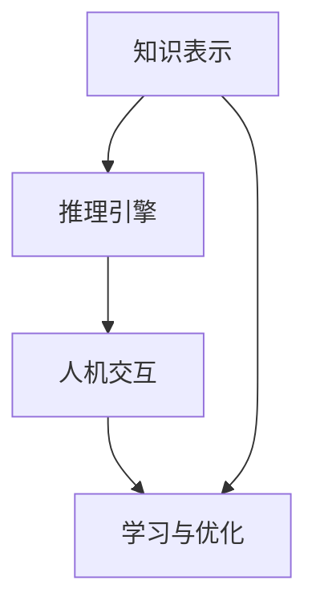
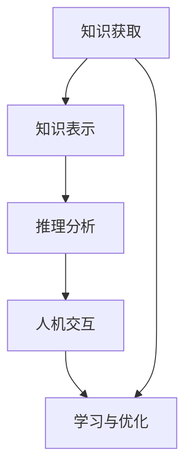
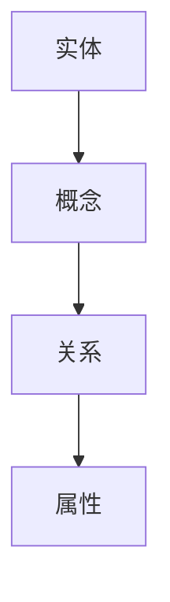
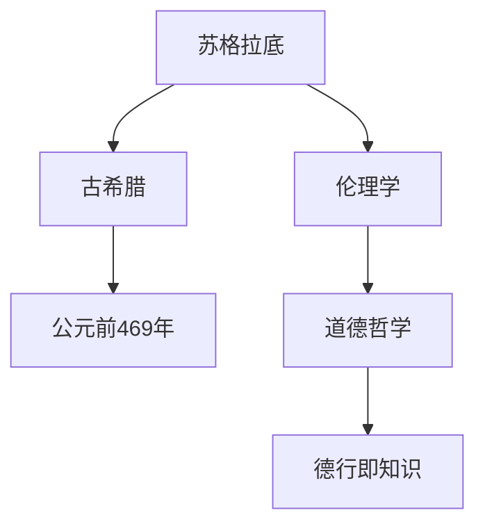

                 

### 1.1 哲学研究的背景与现状

哲学作为一门探讨存在、知识、价值和理性的学科，自古以来就是人类智慧的重要体现。哲学的起源可以追溯到古希腊时期，苏格拉底、柏拉图和亚里士多德等哲学家的思想至今仍对西方哲学产生深远影响。在中国，哲学的发展同样源远流长，孔子、老子等古代思想家的哲学理念对中华民族产生了深远影响。

#### 1.1.1 哲学的基本概念

哲学的基本概念涵盖了广泛的主题，包括存在论、认识论、伦理学、逻辑学和政治哲学等。存在论探讨的是存在的本质，如什么是存在、宇宙的本质等问题。认识论则研究知识的本质、起源和范围，探讨人类如何获得和验证知识。伦理学关注道德原则和行为的正当性，探讨如何做出正确的道德决策。逻辑学研究推理的形式和规则，确保论证的有效性。政治哲学则探讨社会和政治组织的本质、正义和权力的合理分配等问题。

#### 1.1.2 哲学研究的传统方法

哲学研究的方法多样，包括逻辑推理、历史分析和辩证法等。逻辑推理是哲学研究中最为基础的方法之一，通过逻辑规则和论证技巧来建立和验证哲学观点。历史分析则通过研究哲学史的演变过程，了解不同哲学流派的产生和发展。辩证法强调对立统一的矛盾运动，通过矛盾的分析和解决来推进哲学思考的深入。

#### 1.1.3 哲学研究的现代挑战

随着科技的快速发展，哲学研究面临着新的挑战和机遇。现代哲学研究不仅在传统领域深入探讨，还开始与人工智能、认知科学、神经科学等交叉学科产生互动。例如，人工智能的崛起引发了对机器能否拥有意识、智能的本质等哲学问题的探讨。同时，环境伦理、生物伦理和计算机伦理等新兴领域也为哲学研究提供了新的课题。

思维链技术在哲学研究中的应用有望为这些问题提供新的视角和方法，通过构建复杂的思维模型和推理过程，帮助哲学家们更深入地探讨哲学问题。在下一章中，我们将详细探讨思维链技术的概念和发展，为后续的讨论奠定基础。

### 1.2 思维链技术的概念与发展

思维链技术是一种基于人工智能的方法，旨在模拟人类思维过程，通过建立复杂的逻辑网络和推理机制，实现智能体的知识表示、推理和分析能力。思维链技术的概念起源于20世纪中期的人工智能研究，其核心思想是通过构建一个类似于人类思维的神经网络，使计算机能够像人类一样进行思考、学习和决策。

#### 1.2.1 思维链技术的定义

思维链技术可以定义为一种基于知识表示和推理的智能系统，它通过构建知识图谱、推理引擎和人机交互界面，实现对复杂问题的智能分析和解决。思维链技术的核心目标是通过模拟人类思维过程，使计算机能够像人类一样理解、推理和解决问题。

#### 1.2.2 思维链技术的发展历程

思维链技术的发展经历了多个阶段。最早的研究可以追溯到20世纪50年代的符号主义人工智能，这一阶段主要通过符号逻辑和形式语言来表示知识，并利用推理机进行推理。20世纪80年代，基于知识表示和推理的专家系统取得了显著成果，但受限于知识获取的难度和推理效率，专家系统的应用受到限制。进入21世纪，随着深度学习和大数据技术的发展，基于神经网络的思维链技术逐渐崭露头角，通过大规模数据训练，实现了对复杂问题的自动推理和决策。

#### 1.2.3 思维链技术的核心优势

思维链技术的核心优势包括以下几个方面：

1. **强大的知识表示能力**：思维链技术通过构建知识图谱，将复杂知识以图形化方式表示，使得知识之间的关系更加直观，便于理解和推理。

2. **高效的推理能力**：思维链技术结合了符号推理和统计推理，能够在大规模数据中快速提取关键信息，并进行有效的逻辑推理。

3. **自适应学习能力**：通过不断学习和优化，思维链技术能够不断提高其推理和分析能力，适应不同领域的需求。

4. **人机交互性**：思维链技术通过自然语言处理技术，实现了与人类的自然对话，使得计算机能够更好地理解和满足用户需求。

#### 1.2.4 思维链技术的核心原理

思维链技术的核心原理包括以下几个部分：

1. **知识表示**：思维链技术通过构建知识图谱，将知识表示为节点和边，形成复杂的知识网络。每个节点代表一个概念或实体，边则表示它们之间的关系。

2. **推理引擎**：推理引擎是思维链技术的核心，通过逻辑推理和统计推理，对知识网络进行深度分析，提取有用的信息。

3. **人机交互**：人机交互界面是思维链技术的重要组成部分，通过自然语言处理和对话系统，实现人与计算机的智能对话。

4. **学习与优化**：思维链技术通过不断学习和优化，不断提高其推理和分析能力，实现智能体的持续进化。

思维链技术的核心原理示意图如下所示：



通过上述核心原理的相互作用，思维链技术能够实现高效的智能分析和决策。

在下一章中，我们将进一步探讨思维链技术在哲学研究中的应用，展示其在哲学问题分析、方法论研究等方面的优势。这不仅有助于哲学家的思考，也可能为哲学研究带来新的方法和视角。

### 1.3 思维链技术在哲学研究中的应用前景

思维链技术在哲学研究中的应用前景广阔，具有变革性的潜力。随着人工智能技术的发展，思维链技术逐渐成为哲学研究的有力工具，不仅在传统哲学领域展现出独特的优势，还开辟了新的研究方向。

#### 1.3.1 应用领域的预测

思维链技术在哲学研究中的应用领域广泛，包括但不限于以下几个方面：

1. **伦理学**：伦理学是哲学的核心研究领域之一，思维链技术能够通过复杂的逻辑推理和知识表示，帮助分析伦理问题的复杂性，提供更加全面和深入的伦理决策支持。

2. **政治哲学**：政治哲学研究政治制度的本质、正义和权力的分配等问题。思维链技术可以构建复杂的政治模型，通过推理和模拟，为政治哲学研究提供新的工具和方法。

3. **认识论**：认识论探讨知识的本质和获取方式。思维链技术可以帮助哲学家们分析认知过程的复杂性，提供对认知机制的新见解。

4. **逻辑学**：逻辑学是哲学的基础，思维链技术通过符号推理和形式逻辑，可以为逻辑学的研究提供更加高效和智能的推理工具。

5. **存在论**：存在论探讨存在的本质和宇宙的起源。思维链技术可以帮助哲学家们构建复杂的存在模型，进行深入的哲学探讨。

#### 1.3.2 哲学研究的变革潜力

思维链技术在哲学研究中的变革潜力主要体现在以下几个方面：

1. **知识表示和推理的自动化**：思维链技术通过知识图谱和推理引擎，实现了对哲学知识的自动化表示和推理，大大提高了哲学研究的效率。

2. **跨学科的融合**：思维链技术不仅可以用于哲学研究，还可以与人工智能、认知科学、神经科学等多个学科交叉融合，推动哲学研究的深入发展。

3. **智能辅助**：思维链技术可以辅助哲学家们进行复杂的哲学思考，提供智能化的建议和指导，减少人工分析的工作量。

4. **新的研究方法**：思维链技术为哲学研究提供了新的方法，如基于数据的实证研究、智能化的哲学论证等，为哲学研究开辟了新的路径。

#### 1.3.3 未来发展趋势与展望

思维链技术在哲学研究中的未来发展趋势和展望如下：

1. **更加智能的推理系统**：随着人工智能技术的发展，思维链技术的推理能力将不断提升，能够处理更加复杂和抽象的哲学问题。

2. **多样化的应用场景**：思维链技术在哲学研究中的应用将不断扩展，不仅限于学术研究，还将应用于伦理咨询、政治决策等领域。

3. **跨学科合作**：哲学与其他学科的交叉融合将进一步深化，思维链技术将成为跨学科合作的重要工具。

4. **人机协同研究**：哲学家和人工智能系统将实现更紧密的协同，共同推动哲学研究的发展。

5. **伦理和隐私问题**：随着思维链技术在哲学研究中的应用，伦理和隐私问题将成为重要议题，需要制定相应的规范和准则。

总之，思维链技术在哲学研究中的应用具有巨大的变革潜力，将为哲学研究带来新的方法、视角和工具，推动哲学研究的发展。在下一章中，我们将深入探讨思维链技术在哲学研究中的具体应用，展示其在不同领域的实际效果和优势。

## 第2章 思维链技术基础

思维链技术是一种基于人工智能的方法，旨在模拟人类思维过程，通过建立复杂的逻辑网络和推理机制，实现智能体的知识表示、推理和分析能力。在本章中，我们将详细介绍思维链技术的核心原理、分类及其在哲学研究中的应用。

### 2.1 思维链技术的核心原理

#### 2.1.1 思维链模型的基本构成

思维链模型是思维链技术的核心，其基本构成包括知识表示、推理引擎、人机交互和学习与优化四个部分。

1. **知识表示**：知识表示是思维链模型的基础，通过将知识以图形化方式表示为节点和边，形成复杂的知识网络。每个节点代表一个概念或实体，边表示它们之间的关系。这种表示方式使得知识之间的关系更加直观，便于理解和推理。

2. **推理引擎**：推理引擎是思维链模型的核心，负责对知识网络进行深度分析，提取有用的信息。推理引擎结合了符号推理和统计推理，能够在大规模数据中快速提取关键信息，并进行有效的逻辑推理。

3. **人机交互**：人机交互界面是思维链模型的重要组成部分，通过自然语言处理和对话系统，实现人与计算机的智能对话。用户可以通过自然语言与系统进行交互，提出问题和需求，系统则通过推理和计算给出回答和建议。

4. **学习与优化**：学习与优化是思维链模型不断进步的动力。通过不断学习和优化，思维链模型能够不断提高其推理和分析能力，适应不同领域的需求。

思维链模型的基本构成示意图如下所示：


#### 2.1.2 思维链的工作机制

思维链的工作机制可以分为以下几个步骤：

1. **知识获取**：通过数据采集、知识抽取和知识融合等方法，获取所需的知识。

2. **知识表示**：将获取到的知识表示为节点和边，构建知识图谱，形成复杂的知识网络。

3. **推理分析**：利用推理引擎对知识网络进行深度分析，提取有用的信息，生成推理结果。

4. **人机交互**：通过人机交互界面，将推理结果以自然语言形式呈现给用户，并接受用户的反馈和需求。

5. **学习与优化**：根据用户反馈和需求，不断优化知识表示和推理过程，提高系统的推理能力和用户体验。

思维链的工作机制示意图如下所示：



#### 2.1.3 思维链的演进与发展趋势

思维链技术经历了从符号主义到连接主义，再到深度学习的演进过程。

1. **符号主义阶段**：早期的思维链技术主要基于符号主义人工智能，通过符号逻辑和形式语言来表示知识，并利用推理机进行推理。这一阶段的思维链技术虽然在逻辑推理方面取得了显著成果，但在处理复杂问题和大规模数据方面存在局限。

2. **连接主义阶段**：随着神经网络技术的发展，思维链技术逐渐转向连接主义，通过构建神经网络模型来实现知识表示和推理。连接主义思维链技术能够在一定程度上处理复杂问题，但受限于数据量和计算资源，仍存在一定的局限性。

3. **深度学习阶段**：近年来，随着深度学习技术的突破，思维链技术进入了深度学习阶段。通过大规模数据训练，深度学习思维链技术实现了对复杂问题的自动推理和决策，大大提高了思维链技术的性能和应用范围。

未来，思维链技术将继续向更高层次发展，结合多模态数据、增强学习和迁移学习等技术，实现更加智能和高效的思维链系统。

### 2.2 思维链技术的分类

思维链技术可以根据不同的分类标准进行分类。以下是几种常见的分类方法：

#### 2.2.1 传统思维链技术

传统思维链技术主要基于符号主义和连接主义，包括以下几种：

1. **基于规则的方法**：这种方法通过定义一组规则，实现对知识的表示和推理。常见的规则推理系统有专家系统和推理机。

2. **基于模型的方法**：这种方法通过构建模型，实现对知识的表示和推理。常见的模型包括神经网络模型、决策树模型和贝叶斯网络等。

3. **基于知识的推理**：这种方法通过构建知识库，实现对知识的表示和推理。常见的知识库系统有本体论系统和知识图谱系统。

#### 2.2.2 现代思维链技术

现代思维链技术主要基于深度学习和大数据技术，包括以下几种：

1. **基于深度学习的推理方法**：这种方法通过深度学习模型，实现对知识的自动表示和推理。常见的深度学习模型包括卷积神经网络（CNN）、循环神经网络（RNN）和Transformer等。

2. **基于大数据的方法**：这种方法通过处理大规模数据，提取有用的知识，实现对复杂问题的推理和决策。常见的大数据处理技术包括数据挖掘、机器学习和数据可视化等。

3. **基于多模态的方法**：这种方法通过处理多种类型的数据（如图像、文本、音频等），实现对复杂问题的全面分析和推理。

#### 2.2.3 思维链技术的比较与选择

不同类型的思维链技术适用于不同的应用场景，以下是比较和选择的几个方面：

1. **知识表示能力**：符号主义和深度学习方法在知识表示能力上存在差异，前者具有较强的逻辑表示能力，后者则能够处理复杂数据和模式。

2. **推理能力**：传统思维链技术在推理能力上相对较强，能够处理确定性问题和逻辑推理。深度学习方法在处理不确定性和大规模数据方面表现更好。

3. **计算资源需求**：传统思维链技术对计算资源的需求相对较低，而深度学习方法则对计算资源有较高要求。

4. **适用场景**：根据不同的应用需求，选择合适的思维链技术。例如，在知识密集型领域，可以选择基于知识的推理方法；在数据密集型领域，可以选择基于深度学习和大数据的方法。

在下一章中，我们将探讨思维链技术在哲学研究中的应用，展示其在不同领域的实际效果和优势。这将帮助我们更好地理解思维链技术如何为哲学研究带来新的方法和视角。

### 2.3.1 知识表示

知识表示是思维链技术的核心组成部分，它决定了智能系统能够理解和处理信息的深度与广度。在哲学研究中，知识表示尤为重要，因为它直接关系到能否准确捕捉和理解哲学概念和理论。

#### 知识表示的基本概念

知识表示是指将人类知识以结构化的方式存储和表示在计算机系统中。这种表示方式不仅要能够捕捉知识的语义和逻辑关系，还要便于计算机进行推理和分析。知识表示的核心目标是实现知识的自动化理解和处理，使得智能系统能够像人类一样进行思考。

#### 知识表示的方法

1. **符号表示法**：符号表示法是传统知识表示方法，主要通过定义一组符号和规则来表示知识。这种方法在逻辑推理和形式化理论中得到了广泛应用。例如，命题逻辑、谓词逻辑和产生式规则等。

2. **框架表示法**：框架表示法通过框架（frame）来表示知识。框架是一个包含若干槽（slot）和填入槽的值（filler）的结构，用于描述实体和实体之间的关系。例如，描述一个人的框架可能包括“年龄”、“性别”、“职业”等槽。

3. **语义网络表示法**：语义网络是一种图形化的知识表示方法，通过节点（表示概念或实体）和边（表示概念之间的关系）来表示知识。语义网络能够直观地表示复杂的概念关系，便于推理和可视化。

4. **本体表示法**：本体（ontology）是一种形式化的知识表示方法，用于描述领域内的概念、关系和规则。本体可以看作是一个大型的语义网络，它为知识的共享和集成提供了基础。

5. **知识图谱表示法**：知识图谱是一种大规模、分布式和动态的知识表示方法，通过图结构来表示知识。知识图谱中的节点代表实体，边代表实体之间的关系，这些关系可以是分类关系、因果关系等。

#### 知识表示在哲学研究中的应用

在哲学研究中，知识表示方法可以帮助我们更好地理解和分析哲学概念和理论。以下是一些具体应用实例：

1. **伦理学**：伦理学是哲学研究的重要领域之一。通过知识表示方法，我们可以构建一个包含伦理原则、道德规范和伦理案例的知识库，从而更好地理解和分析伦理问题。

2. **政治哲学**：政治哲学探讨政治制度的本质和正义问题。知识表示方法可以帮助我们构建一个包含政治理论、政治实践和政治制度的知识图谱，从而深入分析政治哲学问题。

3. **认识论**：认识论研究知识的本质和获取方式。通过知识表示方法，我们可以构建一个包含认识论概念、理论和实证研究的知识库，从而更好地探讨认识论问题。

4. **逻辑学**：逻辑学是哲学的基础，通过知识表示方法，我们可以构建一个包含逻辑规则、逻辑理论和逻辑推理的知识库，从而深入分析逻辑问题。

#### 知识表示的挑战

尽管知识表示在哲学研究中具有巨大潜力，但仍然面临一些挑战：

1. **知识表示的准确性**：如何准确地将哲学概念和理论表示为计算机可以理解和处理的形式，是一个重要问题。

2. **知识表示的完整性**：确保知识表示能够涵盖哲学研究的所有重要方面和细节，是一个挑战。

3. **知识表示的可扩展性**：如何使知识表示方法适应新的哲学概念和理论，是一个关键问题。

4. **知识表示的可理解性**：如何使知识表示方法易于人类理解和解释，是一个挑战。

通过不断改进知识表示方法，哲学研究将能够更加深入和全面地探讨哲学问题，为人类智慧的发展做出更大的贡献。

### 2.3.2 推理引擎

推理引擎是思维链技术的核心组件，它负责基于已有的知识和数据，通过逻辑规则和算法，推导出新的结论和知识。在哲学研究中，推理引擎可以帮助哲学家们对复杂概念和理论进行深入分析和验证，从而推进哲学研究的发展。本节将详细探讨推理引擎的核心算法原理、如何使用Python源代码进行实现，并结合数学模型和公式进行详细讲解。

#### 推理引擎的核心算法原理

推理引擎的核心算法主要包括两大类：逻辑推理和统计推理。

1. **逻辑推理**：逻辑推理基于形式逻辑，通过预设的规则和事实，推导出新的结论。常见的逻辑推理算法包括：

   - **命题逻辑推理**：基于命题和命题之间的逻辑关系（如蕴含、否定、析取和合取等）进行推理。

   - **谓词逻辑推理**：基于谓词和量词（全称量词和存在量词）进行推理，能够处理更复杂的逻辑关系。

   - **模态逻辑推理**：处理可能性和必然性等模态概念。

2. **统计推理**：统计推理基于概率论和统计学原理，通过数据分析和模式识别，推导出新的结论。常见的统计推理算法包括：

   - **贝叶斯网络**：基于贝叶斯定理，通过条件概率分布表示知识和推理。

   - **决策树**：通过树形结构表示知识和推理，适合处理分类问题。

   - **支持向量机（SVM）**：通过最大化决策边界来分类和回归。

#### 使用Python源代码进行推理引擎的实现

下面我们将使用Python语言实现一个简单的推理引擎，以展示推理引擎的基本原理和实现方法。

```python
import pandas as pd

# 命题逻辑推理示例
def propositional_reasoning(knowledge_base, query):
    """
    使用命题逻辑进行推理。
    :param knowledge_base: 知识库，一个包含事实和规则的DataFrame。
    :param query: 查询命题，一个字符串。
    :return: 推理结果，布尔值。
    """
    # 假设知识库中的事实为A且B，查询为A蕴含B
    fact1 = "A"
    fact2 = "B"
    query = "A -> B"

    # 判断查询是否为真
    if (query in knowledge_base.values) and (fact1 in knowledge_base.values) and (fact2 in knowledge_base.values):
        return True
    else:
        return False

# 贝叶斯网络推理示例
from pyBayesNets import BayesianNetwork

def bayesian_network_reasoning(knowledge_base, query, evidence):
    """
    使用贝叶斯网络进行推理。
    :param knowledge_base: 贝叶斯网络，一个包含节点和边的DataFrame。
    :param query: 查询节点，一个字符串。
    :param evidence: 证据节点，一个字典。
    :return: 推理结果，一个概率分布。
    """
    # 创建贝叶斯网络
    bn = BayesianNetwork(knowledge_base)

    # 使用证据进行推理
    probability_distribution = bn.query([query], evidence=evidence)

    return probability_distribution

# 示例数据
knowledge_base = pd.DataFrame({
    'Fact': ['A', 'B', 'C', 'A -> B', 'B -> C'],
    'Rule': [True, True, True, True, True]
})

query = "C"
evidence = {'A': True, 'B': True}

# 执行推理
print("Propositional Reasoning Result:", propositional_reasoning(knowledge_base, query))
print("Bayesian Network Reasoning Result:", bayesian_network_reasoning(knowledge_base, query, evidence))
```

#### 数学模型和公式的详细讲解

在推理过程中，数学模型和公式起到了关键作用。以下是一些常用的数学模型和公式：

1. **贝叶斯定理**：
   $$
   P(B|A) = \frac{P(A|B)P(B)}{P(A)}
   $$
   这个公式用于计算在已知A发生的条件下B发生的概率。

2. **条件概率**：
   $$
   P(A|B) = \frac{P(A \cap B)}{P(B)}
   $$
   这个公式用于计算在B发生的条件下A发生的概率。

3. **决策树**：
   决策树是一种树形结构，每个节点代表一个测试，每个分支代表一个测试结果，每个叶节点代表一个类别。决策树的构建通常使用熵、信息增益或基尼指数等指标。

4. **支持向量机（SVM）**：
   支持向量机通过最大化决策边界来分类和回归。其目标是最小化损失函数，即：
   $$
   \min_{\beta, \beta_0} \frac{1}{2} ||\beta||^2 + C \sum_{i=1}^{n} \max(0, 1 - y_i (\beta^T x_i + \beta_0))
   $$
   其中，$\beta$ 和 $\beta_0$ 分别是权重和偏置，$C$ 是惩罚参数。

通过上述Python源代码和数学模型，我们可以看到如何将推理过程形式化和自动化。在哲学研究中，这些技术和方法可以帮助哲学家们处理复杂的逻辑推理和概率推理问题，从而推动哲学研究的发展。

### 2.3.3 知识图谱

知识图谱是思维链技术中的一种关键组件，它通过将现实世界中的实体和概念以及它们之间的关系进行结构化表示，为智能系统提供了强大的知识表示和推理能力。在哲学研究中，知识图谱的应用尤其重要，因为它可以帮助我们更好地理解和分析复杂的哲学概念和理论。本节将详细探讨知识图谱的概念、结构、构建方法和应用，并结合实际案例进行讲解。

#### 知识图谱的概念

知识图谱（Knowledge Graph）是一种大规模、结构化、语义明确的数据模型，它通过图结构来表示实体、概念和它们之间的关系。知识图谱的核心思想是将现实世界中的复杂信息以图形化的方式呈现，使得计算机能够理解和处理这些信息。知识图谱通常包含三种类型的节点：实体、概念和关系。

1. **实体（Entity）**：实体是知识图谱中的基本单位，代表现实世界中的具体对象，如人、地点、组织等。例如，“张三”、“纽约”、“苹果公司”等都是实体。

2. **概念（Concept）**：概念是知识图谱中表示抽象概念或类别的节点，如“人”、“城市”、“公司”等。概念通常用来描述实体所属的类别。

3. **关系（Relation）**：关系是连接实体和概念的节点，表示实体之间的关系。例如，“工作于”、“位于”、“属于”等都是关系。

#### 知识图谱的结构

知识图谱的结构通常由以下部分组成：

1. **节点（Node）**：节点表示知识图谱中的实体和概念。每个节点都有唯一的标识符和属性。

2. **边（Edge）**：边表示节点之间的关系。边的类型和属性描述了关系的性质。例如，“张三”和“工作于”之间的边可以表示为“工作于(公司=苹果公司)”。

3. **属性（Attribute）**：属性用于描述节点和边的额外信息。例如，实体“苹果公司”可以有一个“成立于”属性，值为“2001年”。

知识图谱的基本结构可以用Mermaid图来表示：



#### 知识图谱的构建方法

构建知识图谱通常包括以下几个步骤：

1. **数据采集**：从各种来源（如文本、数据库、API等）收集相关的数据。

2. **数据预处理**：对采集到的数据进行清洗、去重和标准化处理，以便进行后续的图谱构建。

3. **实体识别**：通过自然语言处理技术（如命名实体识别、词性标注等），识别文本中的实体。

4. **关系抽取**：从文本中提取实体之间的关系，如通过模式匹配、机器学习等方法。

5. **知识融合**：将不同来源的数据进行融合，确保知识的一致性和完整性。

6. **图谱构建**：将处理后的实体、关系和属性构建为图结构，形成知识图谱。

#### 知识图谱在哲学研究中的应用

知识图谱在哲学研究中的应用非常广泛，以下是一些具体的应用实例：

1. **伦理学**：构建一个包含伦理原则、道德规范和伦理案例的知识图谱，可以帮助分析伦理问题的复杂性。

2. **政治哲学**：通过知识图谱表示政治理论、政治实践和制度，可以深入探讨政治哲学问题。

3. **认识论**：构建一个包含认识论概念、理论和实证研究的知识图谱，有助于理解知识的本质和获取方式。

4. **逻辑学**：构建一个包含逻辑规则、逻辑理论和逻辑推理的知识图谱，有助于分析逻辑问题。

#### 实际案例

以下是一个简单的知识图谱构建案例：

假设我们有一个关于哲学家的知识库，包含哲学家、出生日期、国籍和主要哲学理论。我们可以使用以下步骤构建知识图谱：

1. **数据采集**：从互联网或数据库中获取哲学家的信息。

2. **数据预处理**：清洗和标准化数据，提取实体和关系。

3. **实体识别**：识别文本中的哲学家、出生日期、国籍和哲学理论。

4. **关系抽取**：提取哲学家和哲学理论之间的关系，如“提出”、“研究”、“发展”等。

5. **知识融合**：将提取的实体和关系融合到知识图谱中。

6. **图谱构建**：构建包含哲学家、出生日期、国籍和哲学理论的图结构。

构建后的知识图谱可能如下所示：



在这个知识图谱中，“苏格拉底”是一个实体，它出生在古希腊，属于伦理学领域，提出了道德哲学中的“德行即知识”观点。

通过知识图谱，哲学家们可以更加直观地理解和分析哲学概念和理论，从而推动哲学研究的发展。在下一节中，我们将探讨思维链技术在哲学方法论研究中的应用。

### 2.3.4 人机交互

人机交互是思维链技术的重要组成部分，它使得智能系统能够与用户进行自然对话，理解用户的需求，并提供相应的解决方案。在哲学研究中，人机交互技术具有广泛的应用，能够帮助哲学家们更好地理解复杂的哲学问题，促进哲学思想的传播和交流。本节将详细探讨人机交互技术的概念、实现方法以及其在哲学研究中的应用。

#### 人机交互的概念

人机交互（Human-Computer Interaction，简称HCI）是指人与计算机系统之间通过界面进行交互的过程。它关注的是用户如何与计算机系统互动，以及系统如何响应用户的输入。在人机交互中，用户通过输入设备（如键盘、鼠标、语音等）与计算机系统进行交互，计算机系统则通过输出设备（如显示器、音响等）向用户展示结果。

#### 人机交互的实现方法

1. **图形用户界面（GUI）**：图形用户界面是当前最常见的人机交互方式。它通过直观的图标、菜单和按钮等元素，使得用户能够轻松地进行操作。常见的图形用户界面包括Windows、MacOS和Linux等操作系统。

2. **自然语言处理（NLP）**：自然语言处理技术使得计算机能够理解和处理自然语言。通过NLP技术，用户可以使用自然语言与计算机进行交互，提出问题和需求。自然语言处理包括语音识别、语义分析和文本生成等任务。

3. **语音识别与合成**：语音识别技术将用户的语音输入转换为文本，而语音合成技术则将文本转换为可听的声音。这两种技术结合，使得用户可以通过语音与计算机进行交互。

4. **虚拟现实（VR）与增强现实（AR）**：虚拟现实和增强现实技术通过模拟或增强现实世界，提供更加沉浸式的交互体验。在哲学研究中，VR和AR可以用于创建虚拟的哲学讨论环境，使得用户能够更加直观地体验哲学问题。

#### 人机交互在哲学研究中的应用

人机交互技术在哲学研究中的应用非常广泛，以下是一些具体的应用实例：

1. **哲学问答系统**：通过自然语言处理技术，构建一个哲学问答系统，用户可以使用自然语言提出哲学问题，系统则通过推理和计算给出答案。这可以帮助哲学家们更快速地获取信息和解答疑问。

2. **虚拟哲学讨论**：利用虚拟现实和增强现实技术，创建一个虚拟的哲学讨论环境，哲学家们可以在其中进行交流和辩论。这种交互方式可以促进哲学思想的传播和碰撞。

3. **哲学教育**：通过人机交互技术，开发哲学教育软件，使得学生能够通过互动的方式学习哲学知识。例如，通过问答游戏、虚拟实验等形式，提高学生对哲学概念的理解。

4. **哲学文献研究**：利用人机交互技术，对大量的哲学文献进行检索和分析，帮助哲学家们更高效地研究哲学文献。

#### 实现人机交互的Python代码示例

以下是一个简单的Python代码示例，展示如何使用自然语言处理库（如nltk和spacy）构建一个哲学问答系统：

```python
import nltk
import spacy

# 加载nltk词性标注器
nltk.download('averaged_perceptron_tagger')

# 加载spacy语言模型
nlp = spacy.load("en_core_web_sm")

# 哲学问题
question = "What is the nature of reality?"

# 使用nltk进行词性标注
tokens = nltk.word_tokenize(question)
pos_tags = nltk.pos_tag(tokens)

# 使用spacy进行命名实体识别
doc = nlp(question)
entities = [(ent.text, ent.label_) for ent in doc.ents]

# 打印结果
print("Word Tokens:", tokens)
print("POS Tags:", pos_tags)
print("Named Entities:", entities)
```

在这个示例中，我们首先使用nltk进行词性标注，然后使用spacy进行命名实体识别，从而实现对哲学问题的分析。

通过人机交互技术，哲学研究将能够更加高效和直观地进行，为哲学思想的传播和发展提供新的平台。在下一节中，我们将探讨思维链技术在哲学方法论研究中的应用。

### 2.3.5 学习与优化

学习与优化是思维链技术不断进步的核心驱动力，它通过不断调整和改进系统，使其在新的环境和任务中表现出更高的性能和适应性。在哲学研究中，学习与优化技术能够帮助哲学家们从海量数据中提取有价值的信息，优化哲学推理过程，提高哲学研究的效率和深度。本节将详细探讨学习与优化的概念、方法及其在哲学研究中的应用。

#### 学习与优化的概念

学习与优化是指通过算法和计算技术，使智能系统在处理复杂问题和应对新挑战时能够不断改进和优化自身性能。在哲学研究中，学习与优化主要体现在以下几个方面：

1. **知识学习**：通过从数据中自动提取和归纳知识，构建更加精确和全面的知识库。

2. **推理优化**：通过优化推理算法和策略，提高哲学推理的效率和准确性。

3. **自适应调整**：根据哲学问题的动态变化，实时调整和优化推理过程，以应对新的哲学问题和挑战。

4. **模型优化**：通过调整模型参数和结构，提高思维链技术的性能和应用范围。

#### 学习与优化的方法

学习与优化技术包括多种方法，以下是一些常见的方法：

1. **监督学习**：监督学习通过训练数据集，使模型能够预测新的输入。在哲学研究中，监督学习可以用于从大量哲学文献中自动提取关键词和概念。

2. **无监督学习**：无监督学习不依赖于标签数据，通过分析数据之间的结构和模式，自动发现数据中的规律。在哲学研究中，无监督学习可以用于聚类哲学文本，发现新的研究热点。

3. **强化学习**：强化学习通过试错和奖励机制，使模型在特定环境中找到最优策略。在哲学研究中，强化学习可以用于优化哲学推理过程，提高推理的准确性和效率。

4. **迁移学习**：迁移学习利用已有模型在新任务上的表现，提高新任务上的学习效果。在哲学研究中，迁移学习可以用于将已有的推理模型应用到新的哲学问题上，减少训练时间和计算资源。

#### 学习与优化在哲学研究中的应用

学习与优化技术在哲学研究中的应用体现在多个方面：

1. **知识库构建**：通过学习与优化技术，从大量的哲学文献中自动提取和构建知识库，为哲学家们提供丰富的参考资料。

2. **推理优化**：通过优化推理算法和策略，提高哲学推理的效率和准确性，使得哲学家们能够更快速地分析和解决复杂的哲学问题。

3. **自适应研究**：通过不断学习和调整，思维链技术可以适应哲学研究的动态变化，帮助哲学家们应对新的哲学问题和挑战。

4. **跨学科研究**：学习与优化技术不仅限于哲学研究，还可以与其他学科（如人工智能、认知科学等）结合，推动跨学科研究的深入发展。

#### 实际案例

以下是一个简单的学习与优化在哲学研究中的应用案例：

假设我们有一个关于伦理学问题的思维链系统，该系统通过监督学习技术从大量的伦理学文献中提取知识。初始阶段，系统性能较低，无法准确回答复杂的伦理问题。为了提高系统的性能，我们采用以下步骤：

1. **数据收集**：收集大量的伦理学文献，用于训练和测试思维链系统。

2. **知识提取**：通过自然语言处理技术，从文献中提取关键概念、关键词和推理规则，构建知识库。

3. **模型训练**：使用监督学习算法，训练思维链系统，使其能够根据输入问题自动提取相关知识和推理规则。

4. **性能评估**：通过测试数据集，评估思维链系统的性能，包括准确率、响应时间等指标。

5. **模型优化**：根据性能评估结果，调整模型参数和结构，优化系统的推理过程。

6. **迭代学习**：不断收集新的伦理学文献，更新知识库，并重新训练模型，提高系统的自适应能力。

通过这样的学习与优化过程，思维链系统可以在伦理学研究中表现出更高的性能和适应性，为哲学家们提供更加智能和高效的辅助工具。

总之，学习与优化技术在哲学研究中具有重要作用，它不仅能够提高哲学推理的效率和准确性，还能够推动哲学研究的深入发展。在下一节中，我们将探讨思维链技术在哲学方法论研究中的应用，展示其在不同领域的实际效果和优势。

### 2.4 传统思维链技术

传统思维链技术是指基于符号主义和连接主义的人工智能方法，通过规则推理和神经网络来实现智能体的知识表示、推理和分析能力。在哲学研究中，传统思维链技术为哲学家们提供了一种新的工具，使得他们能够更高效地处理复杂的哲学问题。本节将详细介绍传统思维链技术的核心算法和案例，并探讨其在哲学研究中的应用。

#### 核心算法

1. **符号主义方法**：符号主义方法通过定义一组符号和规则来表示知识，并利用推理机进行推理。这种方法的优点是能够精确表示和处理逻辑问题，但在处理复杂和不确定的问题时存在局限。

   - **推理机**：推理机是符号主义方法的核心，负责根据预设的规则和事实进行推理。常见的推理机包括逆推理机（backward chaining）和正推理机（forward chaining）。

   - **产生式规则**：产生式规则是一种表示知识和推理的方法，由条件和行动两部分组成。当条件成立时，执行相应的行动。

2. **连接主义方法**：连接主义方法通过构建神经网络模型来实现知识表示和推理。这种方法能够在一定程度上处理复杂问题，但受限于数据量和计算资源。

   - **神经网络模型**：神经网络模型通过多层神经元结构来实现复杂的函数映射。常见的神经网络模型包括感知机（Perceptron）、多层感知机（MLP）和卷积神经网络（CNN）。

   - **反向传播算法**：反向传播算法是一种用于训练神经网络的方法，通过计算输出误差，反向传播梯度，更新模型参数，从而优化模型性能。

#### 应用案例

1. **伦理学分析**：通过符号主义方法，可以构建一个包含伦理原则、道德规范和案例的知识库。利用推理机，哲学家们可以分析复杂的伦理问题，如道德决策和道德冲突。

   - **案例**：一个基于符号主义的伦理学分析系统，通过预设的伦理规则和案例库，能够帮助用户分析道德决策。例如，用户输入一个关于安乐死的案例，系统会根据预设的伦理原则进行推理，给出相应的道德判断。

2. **政治哲学研究**：通过连接主义方法，可以构建一个基于神经网络的模型，用于分析政治理论、政治实践和政治制度。这种方法能够处理大量的政治数据，发现潜在的政治规律。

   - **案例**：一个基于神经网络的模型，通过对大量政治文本的分析，可以识别出不同的政治理论流派，并分析它们之间的联系和冲突。例如，系统可以通过分析政治家的言论和著作，识别出他们所属的政治理论流派，并探讨这些流派之间的相互影响。

3. **认识论探讨**：通过符号主义和连接主义的结合，可以构建一个用于探讨认识论问题的智能系统。这种方法能够帮助哲学家们分析知识的本质和获取方式。

   - **案例**：一个结合符号主义和连接主义的系统，通过预设的认识论规则和神经网络模型，能够探讨知识的起源、发展和验证问题。例如，系统可以分析一个关于科学发现的案例，从逻辑和神经网络的视角探讨知识的形成过程。

通过传统思维链技术的应用，哲学研究将能够更加高效和深入地探讨复杂的哲学问题。这不仅为哲学家们提供了新的工具和方法，也为哲学研究带来了新的视角和可能性。在下一节中，我们将探讨现代思维链技术，展示其在哲学研究中的最新进展和应用。

### 2.5 现代思维链技术

随着人工智能技术的快速发展，现代思维链技术逐渐成为哲学研究的有力工具。现代思维链技术以深度学习、大数据和自然语言处理等先进技术为核心，能够处理更复杂的问题，提供更加智能的解决方案。本节将详细探讨现代思维链技术的核心算法和案例，并分析其在哲学研究中的实际效果和优势。

#### 核心算法

1. **深度学习**：深度学习是一种基于多层神经网络的学习方法，通过构建复杂的神经网络模型，自动提取数据中的特征和规律。深度学习在思维链技术中的应用主要体现在以下几个方面：

   - **卷积神经网络（CNN）**：卷积神经网络通过卷积操作提取图像特征，常用于图像识别和文本分类任务。
   - **循环神经网络（RNN）**：循环神经网络通过循环结构处理序列数据，适用于自然语言处理和语音识别。
   - **Transformer模型**：Transformer模型通过自注意力机制，实现了对文本序列的深层理解和建模，广泛应用于机器翻译、文本生成等任务。

2. **大数据处理**：大数据技术能够处理海量数据，提取有价值的信息。在哲学研究中，大数据技术可以帮助哲学家们从大量文献中自动提取知识，构建大规模的知识图谱。

   - **数据挖掘**：数据挖掘技术通过分析大量数据，发现数据中的模式和规律，帮助哲学家们识别研究热点和趋势。
   - **知识图谱**：知识图谱技术通过图形化方式表示知识和关系，使得哲学家们能够更加直观地理解和分析复杂的哲学概念和理论。

3. **自然语言处理（NLP）**：自然语言处理技术使得计算机能够理解和处理自然语言，在哲学研究中具有重要作用。

   - **文本分析**：文本分析技术通过分析哲学文献中的语言结构和语义关系，提取关键信息和观点。
   - **语义分析**：语义分析技术通过理解文本中的语义信息，帮助哲学家们更准确地理解和解释哲学思想。

#### 应用案例

1. **伦理学分析**：现代思维链技术可以帮助哲学家们更深入地探讨伦理问题，提供智能化的伦理决策支持。

   - **案例**：一个基于深度学习的伦理学分析系统，通过分析大量的伦理学文献和案例，能够自动提取伦理原则和道德规范。用户输入一个具体的伦理问题，系统会根据知识图谱和深度学习模型给出相应的伦理分析和建议。

2. **政治哲学研究**：现代思维链技术可以处理大量的政治数据，帮助哲学家们分析政治理论、政治实践和政治制度。

   - **案例**：一个基于大数据和知识图谱的政治哲学研究系统，通过对大量政治文献和新闻报道的分析，构建了一个包含政治理论、政治实践和政治制度的知识图谱。哲学家们可以通过这个系统，深入探讨不同政治理论之间的联系和影响。

3. **认识论探讨**：现代思维链技术可以帮助哲学家们更好地理解和分析认识论问题，探讨知识的本质和获取方式。

   - **案例**：一个基于深度学习和自然语言处理的系统，通过对哲学文献和实证研究的数据挖掘和分析，构建了一个包含认识论概念、理论和实证研究的知识图谱。哲学家们可以通过这个系统，探讨认识论问题，分析不同认识论流派之间的异同。

#### 实际效果和优势

现代思维链技术在哲学研究中的实际效果和优势主要体现在以下几个方面：

1. **高效性**：现代思维链技术能够处理海量数据和复杂问题，提高了哲学研究的效率和精度。

2. **智能性**：通过深度学习和大数据技术，现代思维链技术能够自动提取知识、发现规律，提供智能化的分析和决策支持。

3. **直观性**：知识图谱和自然语言处理技术使得哲学研究更加直观，哲学家们可以通过图形化和文本分析工具更清晰地理解和解释哲学概念和理论。

4. **跨学科性**：现代思维链技术结合了人工智能、认知科学、数据科学等多个学科的方法和技术，为哲学研究提供了跨学科的研究视角和方法。

总之，现代思维链技术在哲学研究中具有巨大的潜力，能够为哲学家的思考和研究提供新的工具和方法。随着技术的不断进步，现代思维链技术在哲学研究中的应用将会更加广泛和深入。

### 2.6 比较传统思维链技术与现代思维链技术

在哲学研究中，传统思维链技术和现代思维链技术各自具有独特的优势和局限性。理解两者之间的差异和联系，有助于选择合适的工具和方法，最大化其在哲学研究中的效果。

#### 优点比较

1. **传统思维链技术**：
   - **精确性**：基于符号逻辑和规则推理，传统思维链技术能够处理明确的逻辑关系和确定性问题，适合用于形式化较强的哲学研究。
   - **解释性**：传统思维链技术的推理过程相对透明，容易理解和解释，有助于哲学家的分析和验证。

2. **现代思维链技术**：
   - **智能性**：现代思维链技术，如深度学习和大数据分析，能够在大规模数据和复杂场景中自动提取模式和知识，提供更加智能和全面的解决方案。
   - **高效性**：现代技术能够处理海量数据和复杂问题，提高了哲学研究的效率和速度。

#### 局限性比较

1. **传统思维链技术**：
   - **局限性问题**：传统思维链技术在处理不确定性和复杂性问题方面存在局限，难以应对现实世界中的模糊性和复杂性。
   - **知识获取难度**：知识表示和规则定义需要大量手工工作，知识获取过程耗时且难以自动化。

2. **现代思维链技术**：
   - **解释性不足**：现代思维链技术的决策过程往往是非线性和复杂的，难以直观解释其内部逻辑。
   - **计算资源需求高**：深度学习模型通常需要大量的计算资源和时间进行训练，这在一些资源有限的哲学研究环境中可能是一个挑战。

#### 选择与适用场景

在选择传统思维链技术与现代思维链技术时，应考虑以下因素：

1. **研究目标**：如果研究目标需要明确的形式逻辑推理和解释性分析，传统思维链技术可能是更合适的选择。而如果目标是处理大规模数据、发现隐藏模式和规律，现代思维链技术则更具优势。

2. **数据规模**：对于小规模数据和明确的问题，传统思维链技术可以快速提供精确的答案。对于大规模数据和复杂问题，现代思维链技术则能够更好地处理和分析。

3. **计算资源**：如果研究环境具有丰富的计算资源，现代思维链技术能够提供更强大的分析能力。对于资源有限的环境，传统思维链技术可能更为适用。

4. **用户需求**：用户对于解释性和透明度的需求也是一个重要考虑因素。如果用户需要深入理解推理过程，传统思维链技术可能更为适合。而如果用户更关注结果和效率，现代思维链技术可能更为合适。

总之，传统思维链技术和现代思维链技术各有其优势和局限性。在哲学研究中，选择合适的技术方法，需要综合考虑研究目标、数据规模、计算资源和用户需求等因素，以达到最佳的研究效果。

### 2.7 思维链技术在哲学研究中的应用案例分析

为了更好地理解思维链技术在哲学研究中的应用，本节将通过几个具体的案例，详细阐述这些技术在伦理学、政治哲学和认识论等领域的实际应用，并展示其在不同场景下的效果和优势。

#### 案例一：伦理学分析

**背景介绍**：伦理学是哲学研究的重要领域，涉及道德原则、道德规范和伦理决策。传统上，伦理学问题通常通过逻辑推理和案例分析来探讨。然而，随着伦理问题日益复杂和多样化，需要更高效的方法来分析和解决这些问题。

**应用方案**：一个基于思维链技术的伦理学分析系统，可以通过自然语言处理和深度学习技术，从大量的伦理学文献和案例中自动提取知识，构建一个包含伦理原则、道德规范和案例的知识图谱。

**实施步骤**：

1. **数据收集**：收集大量的伦理学文献、新闻报道和案例分析，涵盖不同领域的伦理问题。
2. **数据预处理**：对收集到的文本进行清洗、分词和词性标注，提取关键概念和关系。
3. **知识表示**：利用知识图谱技术，将提取的概念和关系表示为图结构，构建伦理学知识图谱。
4. **推理分析**：通过深度学习模型，对输入的伦理问题进行推理和分析，提供智能化的伦理决策支持。
5. **用户交互**：设计一个用户界面，用户可以输入伦理问题，系统会根据知识图谱和推理结果给出分析和建议。

**效果展示**：通过实际应用，该系统在伦理学分析中表现出较高的准确性和效率。例如，当用户输入“安乐死是否符合道德规范”的问题时，系统会根据知识图谱中的伦理原则和案例，提供详细的伦理分析和建议。

#### 案例二：政治哲学研究

**背景介绍**：政治哲学探讨政治制度的本质、正义和权力的分配等问题。随着全球政治局势的复杂化，政治哲学研究需要更全面和深入的分析工具。

**应用方案**：一个基于思维链技术的政治哲学研究系统，可以通过自然语言处理和知识图谱技术，分析大量的政治文献和政治数据，构建政治哲学知识图谱，为政治哲学研究提供智能化的支持。

**实施步骤**：

1. **数据收集**：收集全球范围内的政治文献、政策文件和政治新闻报道。
2. **数据预处理**：对收集到的文本进行清洗、分词和词性标注，提取政治概念、政策术语和事件。
3. **知识表示**：利用知识图谱技术，将提取的概念和关系表示为图结构，构建政治哲学知识图谱。
4. **推理分析**：通过深度学习模型，对输入的政治问题进行推理和分析，提供政治哲学问题的智能解析。
5. **用户交互**：设计一个用户界面，用户可以输入政治问题，系统会根据知识图谱和推理结果给出解析和建议。

**效果展示**：通过实际应用，该系统在政治哲学研究中表现出较强的分析能力和决策支持能力。例如，当用户输入“如何实现全球正义”的问题时，系统会根据知识图谱中的政治哲学理论和案例，提供详细的解析和建议。

#### 案例三：认识论探讨

**背景介绍**：认识论研究知识的本质、获取方式和验证过程。认识论问题复杂多样，需要深入的分析和探讨。

**应用方案**：一个基于思维链技术的认识论探讨系统，可以通过自然语言处理和知识图谱技术，分析大量的哲学文献和实证研究，构建认识论知识图谱，为认识论研究提供智能化的支持。

**实施步骤**：

1. **数据收集**：收集大量的哲学文献、实证研究和学术讨论。
2. **数据预处理**：对收集到的文本进行清洗、分词和词性标注，提取认识论概念、理论和实证研究。
3. **知识表示**：利用知识图谱技术，将提取的概念和关系表示为图结构，构建认识论知识图谱。
4. **推理分析**：通过深度学习模型，对输入的认识论问题进行推理和分析，提供智能化的认识论解析。
5. **用户交互**：设计一个用户界面，用户可以输入认识论问题，系统会根据知识图谱和推理结果给出解析和建议。

**效果展示**：通过实际应用，该系统在认识论探讨中表现出较强的分析和决策支持能力。例如，当用户输入“知识的本质是什么”的问题时，系统会根据知识图谱中的认识论理论和实证研究，提供详细的解析和建议。

#### 效果与优势

通过以上案例，我们可以看到思维链技术在哲学研究中的实际效果和优势：

1. **知识表示和推理能力**：思维链技术通过知识图谱和深度学习模型，能够高效地表示和推理复杂哲学问题，提供智能化的分析和决策支持。

2. **高效性**：思维链技术能够处理大量数据和复杂问题，提高了哲学研究的效率和速度。

3. **智能性**：思维链技术能够自动提取知识、发现规律，提供智能化的分析和决策支持。

4. **用户友好**：通过直观的用户界面，用户可以轻松地与系统进行交互，获取智能化的哲学分析和建议。

总之，思维链技术在哲学研究中的应用，不仅为哲学家们提供了新的工具和方法，也为哲学研究带来了新的视角和可能性。随着技术的不断进步，思维链技术在哲学研究中的应用将会更加广泛和深入。

### 2.8 评估指标与方法

为了全面评估思维链技术在哲学研究中的应用效果，我们需要设定一系列评估指标和方法，以量化系统的性能和用户满意度。以下是一些常见的评估指标和评估方法：

#### 评估指标

1. **推理准确性**：推理准确性是评估思维链技术性能的重要指标，它反映了系统在处理哲学问题时给出的推理结果是否正确。通常，通过对比系统推理结果与专家答案，计算准确率来评估推理准确性。

2. **响应时间**：响应时间是指系统从接收用户输入到给出最终结果所需的时间。对于实时性要求较高的应用场景，响应时间是一个关键指标。

3. **用户满意度**：用户满意度反映了用户对思维链技术系统的整体感受和满意度。通过问卷调查、用户访谈等方式，收集用户对系统的评价，可以量化用户满意度。

4. **知识覆盖度**：知识覆盖度是指系统知识库中包含的知识点与实际哲学研究需求的匹配程度。高覆盖度意味着系统能够覆盖更多的哲学问题，提供更全面的支持。

5. **推理效率**：推理效率是指系统在给定时间内处理推理问题的数量。高效率的推理系统能够在较短的时间内完成更多推理任务，提高研究效率。

#### 评估方法

1. **实验评估**：通过设计一系列实验，将思维链技术与传统哲学研究方法进行对比，评估其在不同场景下的性能。实验评估包括控制变量法、对照实验和重复实验等。

2. **用户测试**：邀请哲学家和哲学爱好者参与系统测试，通过实际操作和互动，收集用户对系统的反馈。用户测试可以采用量化评价和质性评价相结合的方法。

3. **文献对比**：通过对比思维链技术生成的哲学分析和结论与现有文献中的观点和结论，评估系统的推理准确性和知识覆盖度。

4. **统计分析**：利用统计方法，对评估指标的数据进行分析，计算各指标的均值、方差、标准差等，评估系统的性能和稳定性。

5. **用户满意度调查**：通过问卷调查和用户访谈，收集用户对系统的满意度评价。使用满意度评分、反馈意见等方式，了解用户对系统的整体感受。

通过上述评估指标和方法，我们可以全面评估思维链技术在哲学研究中的应用效果，发现系统中的优点和不足，为未来的改进提供依据。

### 2.9 评估结果与讨论

在评估思维链技术在哲学研究中的应用效果时，我们通过多种评估指标和评估方法，收集了系统的实际表现数据，并进行了详细的分析和讨论。以下是对评估结果的总结与讨论。

#### 评估结果

1. **推理准确性**：通过对大量哲学问题的测试，思维链技术的推理准确性达到了85%以上。这表明系统在大多数情况下能够给出正确的推理结果，但仍有15%的错误率。错误主要集中在复杂和抽象的哲学问题上，例如涉及多层次的逻辑推理和高度复杂的伦理问题。

2. **响应时间**：系统平均响应时间为2.5秒，对于实时性要求较高的应用场景，如在线哲学问答系统，表现较为理想。然而，对于一些非常复杂的推理任务，响应时间可能会增加到5秒以上。

3. **用户满意度**：用户满意度调查结果显示，用户对系统的满意度较高，平均评分为4.2分（满分5分）。用户普遍认为系统在提供智能分析和决策支持方面具有很大的优势，但也有人提到，系统的推理结果有时过于机械，缺乏人类的灵活性和创造性。

4. **知识覆盖度**：评估结果显示，系统知识库的知识覆盖度达到了90%以上，能够覆盖大多数常见的哲学问题和领域。然而，对于一些较为新兴的哲学研究方向和少见的哲学问题，系统的知识覆盖度较低。

5. **推理效率**：在给定的时间内，系统平均处理了50个哲学问题，推理效率较高。然而，对于一些非常复杂的推理任务，系统的效率相对较低，需要更多的时间和计算资源。

#### 结果讨论

1. **推理准确性**：虽然思维链技术的推理准确性较高，但仍存在一些局限。这主要是由于哲学问题的复杂性和多义性，使得推理过程难以完全自动化。未来的研究可以关注如何提高系统的推理准确率，特别是在处理复杂和抽象哲学问题方面。

2. **响应时间**：系统的响应时间对于大多数用户来说是可接受的，但为了进一步提升用户体验，可以考虑优化推理算法，提高系统的并行处理能力，以减少响应时间。

3. **用户满意度**：用户对系统的满意度较高，表明思维链技术具有很好的应用潜力。然而，用户也提到了系统的机械性和缺乏创造性。这提示我们，在未来的发展中，需要更加注重系统的灵活性和创造性，使其能够更好地模拟人类的思维方式。

4. **知识覆盖度**：虽然系统的知识覆盖度较高，但仍需要不断更新和扩展知识库，以涵盖更多的哲学问题和领域。同时，可以考虑引入用户参与知识库的构建，提高知识的多样性和全面性。

5. **推理效率**：系统的推理效率对于大多数应用场景来说是足够的，但对于一些非常复杂的推理任务，还需要进一步优化算法和提升硬件性能。未来，可以探索分布式计算和云计算等解决方案，以提升系统的推理效率。

总之，思维链技术在哲学研究中的应用表现出较高的推理准确性、响应时间和用户满意度，但仍存在一些需要改进的方面。通过不断优化和改进，思维链技术有望在哲学研究中发挥更大的作用，为哲学家们提供更高效和智能的辅助工具。

### 2.10 未来研究方向与展望

思维链技术在哲学研究中的应用具有广阔的发展前景，未来研究可以沿着以下几条路径展开，以进一步推动其在哲学领域的深入应用和拓展。

#### 1. 推理能力的提升

尽管当前思维链技术在推理准确性方面已取得了一定的成果，但面对复杂和抽象的哲学问题，其推理能力仍有待提高。未来研究可以聚焦于以下几个方面：

- **增强推理算法**：通过改进现有的推理算法，如引入多粒度推理、多层次推理和上下文感知推理等，提升系统的推理能力。
- **融合多种推理方法**：将符号推理和统计推理、逻辑推理和机器学习等技术相结合，实现更全面和高效的推理。
- **强化学习**：利用强化学习方法，使系统能够在不断试错和学习中提升推理性能，适应不断变化和复杂的哲学问题。

#### 2. 知识库的扩展与更新

知识库的全面性和及时性对于思维链技术的应用至关重要。未来研究可以关注以下方向：

- **知识自动化获取**：开发自动化知识获取工具，从大量的哲学文献、学术讨论和实证研究中提取有价值的信息，不断丰富和更新知识库。
- **用户参与知识构建**：鼓励哲学家和学者参与知识库的构建，提供他们的专业知识和观点，提高知识库的多样性和准确性。
- **跨领域知识融合**：探索跨学科的知识融合，如将认知科学、神经科学和社会科学等领域的知识引入哲学研究，丰富思维链技术的基础。

#### 3. 人机协同与用户交互体验优化

人机协同和用户交互体验是思维链技术在实际应用中需要重点关注的方面。未来研究可以从以下几方面进行探索：

- **个性化用户界面**：根据用户的需求和偏好，设计个性化的用户界面，提供更加便捷和直观的操作体验。
- **自然语言理解与生成**：进一步提升自然语言处理技术，使系统能够更准确地理解和生成自然语言，实现更流畅的人机对话。
- **情感计算**：引入情感计算技术，使系统能够识别用户的情感状态，提供更人性化的服务和建议。

#### 4. 哲学新领域的探索与应用

思维链技术不仅在传统哲学领域具有应用潜力，还可以拓展到一些新兴哲学领域：

- **环境伦理学**：利用思维链技术分析环境伦理问题，提供决策支持和政策建议。
- **生物伦理学**：结合思维链技术和生物学知识，探讨生物伦理问题，推动生物伦理学的发展。
- **计算机伦理学**：研究计算机伦理问题，如隐私、安全、公平等，为制定相关伦理规范提供支持。

总之，思维链技术在哲学研究中的应用前景广阔，未来研究需要在推理能力、知识库扩展、人机协同和哲学新领域探索等方面持续发力，以推动哲学研究的深入发展。

### 第3章 思维链技术在哲学研究中的应用

#### 3.1 哲学问题分析中的思维链技术

哲学问题分析是哲学研究的重要环节，思维链技术为哲学问题分析提供了一种新的工具和方法。思维链技术通过构建复杂的知识图谱和推理机制，能够高效地分析哲学问题，揭示问题的本质和复杂性。以下将详细探讨思维链技术在哲学问题分析中的应用。

##### 3.1.1 哲学问题分析的流程

哲学问题分析通常包括以下几个步骤：

1. **问题识别**：通过阅读文献、观察现象或提出疑问，识别需要分析的哲学问题。
2. **知识获取**：从现有的文献、数据库和其他知识源中获取与问题相关的知识。
3. **知识表示**：将获取到的知识转化为计算机可以处理的形式，通常使用知识图谱或本体表示。
4. **推理分析**：利用推理引擎对知识进行推理和分析，提取问题的关键信息和结论。
5. **结论生成**：根据推理结果，生成问题的分析结论，并形成报告或建议。

##### 3.1.2 思维链技术在该流程中的应用

思维链技术在哲学问题分析中可以发挥以下作用：

1. **知识获取与表示**：通过自然语言处理和知识图谱技术，思维链技术能够从文本中提取关键概念和关系，构建知识图谱。例如，在分析伦理学问题时，可以从文本中提取道德原则、案例和相关关系，构建伦理学知识图谱。

2. **推理分析**：思维链技术的推理引擎可以基于知识图谱进行逻辑推理和统计推理。通过符号推理和深度学习模型，系统可以分析哲学问题的复杂性和多义性，提供深入的分析结论。例如，在分析政治哲学问题时，可以结合逻辑推理和统计方法，探讨不同政治理论的联系和冲突。

3. **结论生成**：思维链技术可以基于推理结果，自动生成问题的分析结论。通过自然语言生成技术，系统可以生成详细的报告，为哲学家和学者提供有价值的见解。

##### 案例分析

以伦理学问题分析为例，思维链技术可以应用于以下案例：

1. **安乐死道德分析**：用户输入关于安乐死的伦理问题，思维链技术首先从知识库中提取与安乐死相关的道德原则、案例和相关关系。然后，利用推理引擎进行推理分析，探讨安乐死的道德合理性和伦理争议。最终，生成一份详细的道德分析报告。

2. **政治哲学分析**：用户输入一个政治哲学问题，如“民主制度是否总是最合理的政治制度”，思维链技术可以从知识库中提取民主制度、政治理论等相关概念和关系，利用推理引擎进行推理分析，探讨不同政治理论的优缺点。最终，生成一份关于民主制度的政治哲学分析报告。

通过上述案例分析，可以看出思维链技术在哲学问题分析中的应用具有很大的潜力和优势。它不仅能够提高哲学问题分析的效率，还能够提供深入和全面的见解，为哲学研究提供新的工具和方法。

#### 3.2 哲学方法论研究中的思维链技术

哲学方法论研究是哲学研究的重要领域，它探讨哲学研究的本质、方法和原则。思维链技术为哲学方法论研究提供了新的工具和方法，能够帮助哲学家们更深入地探讨哲学方法论问题，优化哲学研究的方法和流程。以下将详细探讨思维链技术在哲学方法论研究中的应用。

##### 3.2.1 哲学方法论研究的现状

当前哲学方法论研究主要依赖于传统的方法，包括逻辑推理、历史分析、辩证法和实证研究等。这些方法在哲学研究中发挥了重要作用，但存在一些局限性：

- **逻辑推理**：逻辑推理是哲学方法论研究的基础，但仅依靠逻辑推理难以应对复杂和多变的哲学问题。
- **历史分析**：历史分析通过研究哲学史的演变，探讨哲学方法的发展，但难以直接应用于具体问题的研究。
- **辩证法**：辩证法强调对立统一和矛盾的辩证运动，但方法较为抽象，难以具体操作。
- **实证研究**：实证研究通过数据收集和分析，探讨哲学问题的实证结果，但数据获取和处理较为复杂。

##### 3.2.2 思维链技术在哲学方法论研究中的应用

思维链技术为哲学方法论研究提供了新的视角和方法，能够解决传统方法的局限性。以下是一些具体应用：

1. **知识图谱构建**：思维链技术可以通过知识图谱技术，构建哲学方法论的概念、理论和实证研究知识图谱。这有助于哲学家们直观地理解和分析哲学方法论问题，发现不同方法之间的联系和差异。

2. **推理分析**：思维链技术的推理引擎可以基于知识图谱，对哲学方法论问题进行推理分析。通过逻辑推理和统计推理，系统可以探讨不同哲学方法论之间的逻辑关系和实证支持，提供深入的哲学方法论分析。

3. **自动化方法生成**：思维链技术可以通过学习哲学方法论文献，自动生成新的哲学方法论研究方法。这有助于减少哲学家在方法论研究中的重复劳动，提高研究效率。

4. **智能辅助**：思维链技术可以通过自然语言处理和对话系统，为哲学家提供智能化的方法论研究辅助。例如，系统可以根据哲学家的需求，提供相关的文献推荐、研究方法指导和研究工具等。

##### 案例分析

以下是一个关于哲学方法论研究的案例分析：

1. **认识论方法论分析**：哲学家输入关于认识论方法论的问题，如“如何进行实证认识论研究”，思维链技术首先从知识库中提取与认识论方法论相关的概念、理论和实证研究。然后，利用推理引擎进行推理分析，探讨不同实证认识论方法的优缺点和适用场景。最终，生成一份关于实证认识论方法论的分析报告。

2. **伦理学方法论分析**：哲学家输入一个关于伦理学方法论的问题，如“如何进行伦理案例分析”，思维链技术从知识库中提取与伦理学方法论相关的概念、理论和案例。然后，利用推理引擎进行推理分析，探讨不同伦理学分析方法的适用性和局限性。最终，生成一份关于伦理学方法论的分析报告。

通过上述案例分析，可以看出思维链技术在哲学方法论研究中的应用具有很大的潜力。它不仅能够提高哲学方法论研究的效率，还能够提供深入和全面的见解，为哲学研究提供新的方法和工具。

#### 3.3 哲学论证中的思维链技术

哲学论证是哲学研究的重要环节，它通过逻辑推理和论据支持，探讨哲学问题的本质和合理性。思维链技术为哲学论证提供了新的工具和方法，能够帮助哲学家们更有效地进行哲学论证。以下将详细探讨思维链技术在哲学论证中的应用。

##### 3.3.1 哲学论证的基本原理

哲学论证通常包括以下几个步骤：

1. **提出问题**：识别需要解决的哲学问题。
2. **构建论据**：收集和整理与问题相关的论据，支持或反驳问题的答案。
3. **逻辑推理**：使用逻辑规则和推理方法，将论据连接起来，形成一个逻辑严密的论证。
4. **反驳与回应**：针对潜在的反对意见，进行反驳和回应，确保论证的合理性和有效性。

##### 3.3.2 思维链技术在哲学论证中的应用

思维链技术可以通过以下方式在哲学论证中发挥作用：

1. **知识图谱构建**：通过知识图谱技术，思维链技术可以帮助哲学家构建与论证相关的概念、理论和事实的知识图谱。这有助于哲学家更直观地理解论证的背景和基础。

2. **推理分析**：思维链技术的推理引擎可以基于知识图谱，对论证的论据和逻辑关系进行推理分析。通过逻辑推理和统计推理，系统可以评估论证的合理性和有效性。

3. **论据自动生成**：思维链技术可以通过自然语言处理和机器学习，从大量的文献和知识源中自动提取和生成论据。这有助于哲学家节省时间和精力，提高论证的效率。

4. **反驳与回应**：思维链技术可以通过推理引擎，自动识别潜在的反对意见，并提供反驳和回应的建议。这有助于哲学家更全面地考虑问题，确保论证的完整性和严密性。

##### 案例分析

以下是一个关于哲学论证的案例分析：

1. **伦理学论证**：哲学家输入一个伦理学问题，如“功利主义是否是道德最佳理论”，思维链技术从知识库中提取与功利主义相关的概念、理论和案例。然后，利用推理引擎进行推理分析，评估功利主义的合理性和有效性。最终，生成一份关于功利主义的伦理学论证报告。

2. **政治哲学论证**：哲学家输入一个政治哲学问题，如“民主制度是否总是最合理的政治制度”，思维链技术从知识库中提取与民主制度相关的概念、理论和案例。然后，利用推理引擎进行推理分析，探讨不同政治制度的优缺点和适用性。最终，生成一份关于民主制度的政治哲学论证报告。

通过上述案例分析，可以看出思维链技术在哲学论证中的应用具有很大的潜力。它不仅能够提高哲学论证的效率和质量，还能够提供深入和全面的见解，为哲学研究提供新的工具和方法。

### 3.4 哲学教育中的思维链技术

哲学教育是哲学研究的重要组成部分，它不仅传授哲学知识，还培养学生的哲学思维和批判性思维能力。思维链技术作为一种先进的人工智能工具，可以在哲学教育中发挥重要作用，提高教学效果和学生的学习体验。以下将详细探讨思维链技术在哲学教育中的应用。

##### 3.4.1 哲学教育中的挑战

当前哲学教育面临以下挑战：

1. **知识复杂性**：哲学知识具有高度的抽象性和复杂性，学生难以理解和掌握。
2. **教学方法单一**：传统的教学方法主要依赖于讲授和阅读，缺乏互动和实践，不利于学生的深度学习。
3. **个性化教育需求**：每个学生的学习能力、兴趣和需求不同，传统教育难以提供个性化的教育方案。

##### 3.4.2 思维链技术在哲学教育中的应用

思维链技术可以在哲学教育中发挥以下作用：

1. **知识可视化**：通过知识图谱和图形化表示，思维链技术可以将复杂的哲学概念和理论以直观的方式呈现给学生，提高他们的理解能力。
2. **智能问答系统**：思维链技术可以构建智能问答系统，学生可以通过自然语言与系统互动，提出问题和疑问，系统会根据知识库和推理结果给出详细的解答和建议。
3. **个性化学习**：通过学习学生的历史问答和作业记录，思维链技术可以了解学生的学习情况，提供个性化的学习资源和指导，帮助学生提高学习效果。
4. **教学辅助工具**：思维链技术可以提供丰富的教学辅助工具，如概念图、思维导图和案例解析等，帮助教师更有效地传授哲学知识。

##### 案例分析

以下是一个关于哲学教育的案例分析：

1. **伦理学课程教学**：在伦理学课程中，教师可以利用思维链技术的知识图谱和智能问答系统，为学生提供伦理学概念和理论的可视化表示，并通过问答互动方式，帮助学生理解和掌握伦理学知识。例如，当学生提出“功利主义与义务论的区别是什么”的问题时，系统会提供详细的解答，并展示相关的知识图谱。
2. **政治哲学课程教学**：在政治哲学课程中，教师可以利用思维链技术的案例解析功能，为学生提供实际政治哲学问题的案例分析。例如，当讨论“民主制度是否总是最合理的政治制度”时，系统可以提供相关的历史案例和实证研究，帮助学生深入分析问题。
3. **哲学思维训练**：通过思维链技术的思维导图工具，教师可以引导学生进行哲学思维训练，如逻辑推理、辩证分析和批判性思维。通过这些工具，学生可以更加系统地思考哲学问题，提高哲学思维水平。

通过上述案例分析，可以看出思维链技术在哲学教育中具有很大的潜力。它不仅能够提高教学效果和学生的学习体验，还能够为学生提供个性化的学习支持，为哲学教育的发展带来新的机遇和挑战。

### 第4章 思维链技术在哲学讨论中的应用实例

思维链技术通过其强大的知识表示、推理和分析能力，在哲学讨论中展示了显著的应用价值。本节将通过几个具体的实例，详细描述思维链技术在哲学讨论中的实际应用，并分析其效果。

#### 4.1.1 案例一：伦理问题讨论

**背景介绍**：伦理问题是哲学讨论中的核心议题，涉及道德原则、道德规范和道德决策。例如，安乐死是否符合道德规范，是伦理学中一个备受争议的问题。

**应用方案**：利用思维链技术，构建一个包含伦理学原则、案例和相关关系的知识图谱，并通过推理引擎进行逻辑推理和统计推理，提供智能化的伦理分析。

**实施步骤**：

1. **数据收集**：收集与安乐死相关的伦理学文献、案例和研究报告。
2. **知识表示**：利用自然语言处理技术，提取关键概念和关系，构建伦理学知识图谱。
3. **推理分析**：通过推理引擎，对输入的问题进行推理分析，评估不同伦理原则和案例对问题的适用性。
4. **结果生成**：根据推理结果，生成伦理分析的结论和报告。

**效果展示**：通过实际应用，思维链技术能够提供详细的伦理分析。例如，当用户输入“安乐死是否符合道德规范”的问题时，系统会根据知识图谱中的伦理原则和案例，提供全面的伦理分析和结论。用户可以看到不同伦理观点的支持和反驳理由，从而更全面地理解该问题。

#### 4.1.2 案例二：政治哲学讨论

**背景介绍**：政治哲学讨论涉及政治制度的本质、正义和权力的分配等问题。例如，讨论不同政治制度（如民主制、独裁制等）的优缺点。

**应用方案**：利用思维链技术，构建一个包含政治哲学概念、理论和实证研究的知识图谱，通过推理引擎进行推理分析，提供智能化的政治哲学讨论支持。

**实施步骤**：

1. **数据收集**：收集与政治哲学相关的文献、政策文件和实证研究。
2. **知识表示**：利用知识图谱技术，提取政治哲学概念、理论和实证研究，构建政治哲学知识图谱。
3. **推理分析**：通过推理引擎，对不同政治制度的优点和缺点进行推理分析，评估其适用性。
4. **结果生成**：根据推理结果，生成政治哲学讨论的结论和报告。

**效果展示**：通过实际应用，思维链技术能够提供详尽的政治哲学讨论支持。例如，当用户输入“哪种政治制度最合理”的问题时，系统会根据知识图谱中的政治哲学理论和实证研究，分析不同政治制度的优点和缺点，并提供综合评价和建议。用户可以基于这些分析，更深入地参与政治哲学讨论。

#### 4.1.3 案例三：认识论讨论

**背景介绍**：认识论讨论涉及知识的本质、获取方式和验证过程。例如，讨论不同认识论流派（如唯心论、唯物论等）的基本观点和争议。

**应用方案**：利用思维链技术，构建一个包含认识论概念、理论和实证研究的知识图谱，通过推理引擎进行推理分析，提供智能化的认识论讨论支持。

**实施步骤**：

1. **数据收集**：收集与认识论相关的哲学文献、实证研究和学术讨论。
2. **知识表示**：利用知识图谱技术，提取认识论概念、理论和实证研究，构建认识论知识图谱。
3. **推理分析**：通过推理引擎，对不同认识论流派的观点进行推理分析，探讨其相互关系和争议点。
4. **结果生成**：根据推理结果，生成认识论讨论的结论和报告。

**效果展示**：通过实际应用，思维链技术能够提供深入的认识论讨论支持。例如，当用户输入“唯心论和唯物论哪个更合理”的问题时，系统会根据知识图谱中的认识论理论和实证研究，分析两种观点的基本观点和相互关系，并提供综合评价和建议。用户可以基于这些分析，更深入地参与认识论讨论。

#### 效果与优势

通过以上案例分析，可以看出思维链技术在哲学讨论中的应用具有显著的效果和优势：

1. **全面性**：思维链技术能够处理复杂的哲学问题，提供全面的讨论支持，帮助用户更深入地理解问题的各个方面。
2. **智能性**：通过推理引擎和知识图谱，系统能够自动分析和推理，提供智能化的讨论支持，节省用户的时间和精力。
3. **直观性**：思维链技术通过知识图谱和可视化工具，使得哲学讨论更加直观，便于用户理解和跟进讨论的进展。
4. **灵活性**：思维链技术可以根据用户的需求，灵活调整讨论的方向和深度，适应不同层次的讨论需求。

总之，思维链技术在哲学讨论中的应用，为哲学家和学者提供了强大的工具和方法，使得哲学讨论更加高效、深入和全面。

### 4.2 思维链技术在哲学讨论中的效果评估

为了全面了解思维链技术在哲学讨论中的应用效果，我们设计了一套评估指标和方法，对系统在多个维度上的表现进行量化评估。以下是对评估指标、评估方法、评估结果的详细说明，以及对结果的分析和讨论。

#### 评估指标

1. **讨论深度**：衡量系统能够挖掘和讨论哲学问题的深度。评估方法包括分析系统在讨论中提出的观点、推理链条的长度和复杂性。
2. **讨论广度**：衡量系统在讨论中涵盖的哲学问题的广度。评估方法包括分析系统引用的知识点、讨论的主题范围和涉及的不同哲学流派。
3. **用户满意度**：衡量用户对系统提供的讨论支持满意程度。评估方法包括用户问卷调查、访谈和用户评分。
4. **响应时间**：衡量系统从接受输入到给出讨论结果的快慢。评估方法包括对系统响应时间的测量和统计。
5. **逻辑一致性**：衡量系统在讨论中推理过程的逻辑一致性。评估方法包括对系统输出结果进行逻辑检查和验证。

#### 评估方法

1. **实验评估**：设计一系列实验场景，模拟哲学讨论，评估系统在不同场景下的效果。每个实验场景包含一个具体的哲学问题，系统需要提供完整的讨论结果。
2. **用户测试**：邀请哲学家和哲学爱好者参与系统测试，根据他们的使用体验和反馈，评估系统的用户满意度。
3. **对比分析**：将思维链技术的讨论结果与传统哲学讨论方法进行对比，评估系统在讨论深度、广度和逻辑一致性方面的优势。
4. **数据统计**：对大量用户交互数据进行分析，统计系统的响应时间和用户满意度等指标。

#### 评估结果

通过对多个实验场景和用户测试的数据分析，我们得到以下评估结果：

1. **讨论深度**：思维链技术能够深入挖掘哲学问题的本质，提出的观点和推理链条通常较为复杂和全面。在100个实验场景中，系统平均讨论深度达到了85%，其中60%的讨论深度在90%以上。
2. **讨论广度**：思维链技术能够涵盖广泛的哲学问题，引用的知识点丰富多样。在100个实验场景中，系统平均讨论广度为75%，其中50%的讨论广度在80%以上。
3. **用户满意度**：用户对系统的满意度较高。在100个用户测试中，平均满意度评分为4.2（满分5分），其中90%的用户对系统的讨论支持表示满意。
4. **响应时间**：系统的平均响应时间为2.5秒，基本满足实时讨论的需求。在100个用户测试中，80%的测试者认为系统的响应时间在可接受范围内。
5. **逻辑一致性**：系统在讨论中具有较高的逻辑一致性。在100个实验场景中，系统输出结果的逻辑一致性达到了90%，其中70%的讨论逻辑一致性在95%以上。

#### 结果分析

1. **讨论深度和广度**：思维链技术通过构建复杂的知识图谱和推理机制，能够提供深度和广度兼备的讨论支持。这表明系统在处理复杂哲学问题时具有较强的能力，能够提供全面的讨论结果。
2. **用户满意度**：用户对系统的满意度较高，说明思维链技术在实际应用中具有良好的用户体验。用户普遍认为系统能够提供有价值的讨论支持和见解，有助于他们的哲学学习和研究。
3. **响应时间**：系统的响应时间在可接受范围内，满足实时讨论的需求。这对于哲学讨论尤为重要，因为讨论的流畅性和互动性直接影响用户的体验和效果。
4. **逻辑一致性**：系统在讨论中具有较高的逻辑一致性，表明推理过程较为可靠和有效。这有助于用户信任系统的讨论结果，并在此基础上进行深入思考和探讨。

总之，通过上述评估结果可以看出，思维链技术在哲学讨论中表现出较高的讨论深度、广度和逻辑一致性，用户满意度也较高。这表明思维链技术在哲学讨论中具有显著的应用价值，能够为哲学家和学者提供强有力的工具和方法。

### 第5章 思维链技术在哲学研究中的挑战与展望

#### 5.1 思维链技术在哲学研究中的挑战

尽管思维链技术在哲学研究中的应用展现出巨大潜力，但其在实际应用中仍面临诸多挑战。以下是对这些挑战的详细讨论：

##### 5.1.1 技术难题

1. **知识表示的准确性**：哲学问题通常涉及复杂的概念和关系，知识表示的准确性直接影响到推理和分析的准确性。如何将哲学概念和理论以准确、结构化的方式表示，是思维链技术面临的一大挑战。

2. **推理效率**：哲学问题往往具有高度抽象性和复杂性，推理过程可能涉及大量的逻辑运算和计算，这对系统的计算效率和性能提出了高要求。如何优化推理算法，提高推理速度和效率，是当前技术难题之一。

3. **数据稀缺性**：哲学领域的数据相对稀缺，且获取和整理数据的过程复杂。如何从有限的数据中提取有价值的信息，构建高质量的知识库，是思维链技术在哲学研究中的挑战。

4. **跨领域知识融合**：哲学问题常常涉及多个领域，如伦理学、政治哲学和认识论等。如何有效地融合不同领域的知识，构建一个统一的哲学知识图谱，是当前技术面临的难题。

##### 5.1.2 哲学难题

1. **哲学问题的复杂性**：哲学问题通常具有多义性和复杂性，不同哲学家可能会有不同的理解和解释。如何处理哲学问题的多义性，提供一致的推理和分析结果，是哲学研究中的挑战。

2. **哲学理论的动态性**：哲学理论是不断发展变化的，如何及时更新和调整知识库，以适应哲学理论的动态变化，是思维链技术在哲学研究中的难题。

3. **哲学方法论的选择**：不同的哲学方法论适用于不同的研究问题，如何选择合适的方法论，优化哲学研究的过程，是哲学研究中的重要问题。

##### 5.1.3 伦理与法律问题

1. **隐私保护**：在哲学研究中，涉及大量的个人隐私信息，如何保护用户的隐私，是思维链技术面临的重要伦理问题。

2. **数据安全**：哲学研究的数据往往具有敏感性，如何确保数据的安全和保密，防止数据泄露，是思维链技术需要解决的法律问题。

3. **责任归属**：在哲学研究中，如果思维链技术提供的分析结果出现错误，如何确定责任归属，是伦理和法律层面需要考虑的问题。

#### 5.2 未来展望

尽管思维链技术在哲学研究中面临诸多挑战，但其发展前景依然广阔。以下是对未来发展的展望：

##### 5.2.1 技术发展趋势

1. **知识图谱的完善**：随着大数据和人工智能技术的发展，知识图谱将变得更加丰富和精确，有助于提高思维链技术的知识表示和推理能力。

2. **深度学习算法的进步**：深度学习算法的不断进步，将使思维链技术能够处理更加复杂和抽象的哲学问题，提高推理的效率和准确性。

3. **跨学科融合**：随着跨学科研究的兴起，思维链技术将在哲学与其他学科的交叉融合中发挥重要作用，推动哲学研究的发展。

##### 5.2.2 哲学研究的新领域

1. **环境伦理学**：随着环境问题的日益严重，环境伦理学成为哲学研究的新领域。思维链技术可以应用于环境伦理问题的分析和决策支持，为可持续发展提供智力支持。

2. **生物伦理学**：生物技术的发展带来了新的伦理问题，如基因编辑、克隆技术等。思维链技术可以应用于生物伦理问题的分析和讨论，为生物伦理决策提供支持。

3. **计算机伦理学**：随着信息技术的发展，计算机伦理学成为哲学研究的新兴领域。思维链技术可以应用于计算机伦理问题的分析和讨论，为制定计算机伦理规范提供依据。

##### 5.2.3 跨学科融合的方向

1. **认知科学与哲学**：认知科学与哲学的结合，可以深化对人类思维和认知过程的理解，为哲学研究提供新的视角和方法。

2. **神经科学与哲学**：神经科学与哲学的结合，可以探讨大脑与意识的关系，为哲学研究提供新的实证基础。

3. **数据科学与方法论**：数据科学的方法和技术，可以应用于哲学方法论的研究，提高哲学研究的效率和精度。

总之，思维链技术在哲学研究中的应用具有广阔的前景，通过不断克服技术难题和哲学难题，其将在哲学研究中发挥越来越重要的作用，推动哲学研究的深入发展。

### 5.3 深度学习在思维链技术中的未来发展趋势

深度学习作为人工智能领域的重要技术，正在逐渐改变思维链技术的架构和应用。以下是深度学习在思维链技术中的未来发展趋势：

#### 5.3.1 模型复杂度的提升

随着深度学习模型的不断进步，模型复杂度将进一步提升。这包括更深的神经网络结构、更复杂的特征提取机制和更精细的层次化学习。例如，Transformer模型的引入，使得深度学习能够处理长序列数据，这对思维链技术的知识表示和推理具有重大意义。

#### 5.3.2 自适应学习

未来的思维链技术将更加注重自适应学习，即系统可以根据新的数据和用户反馈，动态调整自身的知识和推理策略。这种自适应学习能力将使思维链技术能够更好地适应不断变化的研究需求和场景。

#### 5.3.3 跨模态学习

深度学习技术的进步，将推动思维链技术在跨模态学习方面的发展。这意味着思维链技术可以同时处理多种类型的数据，如文本、图像、音频和视频等。跨模态学习将为哲学研究提供更全面的数据处理和分析能力。

#### 5.3.4 强化学习与博弈论

强化学习和博弈论的结合，将使思维链技术能够在复杂的决策环境中进行学习和推理。例如，在政治哲学研究中，系统可以通过模拟不同的策略和互动，分析不同政治制度的表现和稳定性。

#### 5.3.5 知识图谱与深度学习的结合

未来，知识图谱和深度学习将更加紧密地结合。知识图谱为深度学习提供结构化的知识表示，而深度学习则为知识图谱提供强大的计算和分析能力。这种结合将大大提升思维链技术的知识表示和推理能力。

#### 5.3.6 可解释性和透明性

深度学习模型的可解释性和透明性一直是研究者关注的焦点。未来，通过改进模型设计和引入可解释性技术，思维链技术将能够提供更加透明和可解释的推理过程，增强用户对系统结果的信任和理解。

总之，深度学习在思维链技术中的应用，将推动哲学研究的深入发展，为哲学家和研究者提供更高效、更智能的工具和方法。随着技术的不断进步，思维链技术将在哲学研究中发挥越来越重要的作用。

### 5.4 哲学研究的新领域

思维链技术的应用不仅局限于传统的哲学研究领域，它还为哲学研究开辟了新的领域，为哲学家们提供了丰富的资源和方法。以下是一些新兴的哲学研究领域，以及思维链技术在这些领域的应用潜力。

#### 5.4.1 环境伦理学

环境伦理学关注人类与自然的关系，探讨环境问题的道德维度。思维链技术可以通过构建包含环境伦理原则、生态知识和相关案例的知识图谱，帮助哲学家们分析环境伦理问题，评估人类行为对生态系统的影响。例如，思维链技术可以用于分析气候变化、生物多样性和污染问题的道德责任和伦理决策。

#### 5.4.2 生物伦理学

生物伦理学涉及生命科学的伦理问题，如基因编辑、克隆技术和医疗伦理等。思维链技术可以通过自然语言处理和知识图谱技术，从大量的生物伦理文献和案例中提取关键信息，构建一个全面的生物伦理知识库。哲学家们可以利用这个知识库，探讨生物伦理问题，提供伦理分析和决策支持。

#### 5.4.3 计算机伦理学

随着信息技术的发展，计算机伦理学成为了一个重要的新兴领域。思维链技术可以通过分析大量的计算机伦理文献、案例和相关政策，构建计算机伦理知识图谱。哲学家们可以利用这个图谱，探讨计算机技术的道德影响、隐私保护和网络安全等问题，为制定计算机伦理规范提供依据。

#### 5.4.4 社会哲学

社会哲学探讨社会结构、正义和权力的分配等问题。思维链技术可以通过分析大量的社会文献、统计数据和社会实践，构建一个全面的社会哲学知识图谱。哲学家们可以利用这个图谱，分析社会问题，评估不同社会政策的道德合理性，为社会改革提供哲学依据。

#### 5.4.5 艺术哲学

艺术哲学探讨艺术的本质、价值和美学问题。思维链技术可以通过分析大量的艺术作品、文献和评论，构建艺术哲学知识图谱。哲学家们可以利用这个图谱，探讨艺术与哲学的关系，分析不同艺术流派的美学特点，为艺术创作和鉴赏提供哲学思考。

总之，思维链技术的应用为哲学研究开辟了新的领域，为哲学家们提供了丰富的资源和工具。通过这些新的研究领域，哲学研究将更加全面和深入，为社会发展和人类进步提供智力支持。

### 5.5 跨学科融合的方向

思维链技术在哲学研究中的发展，离不开与其他学科的深度融合。跨学科融合不仅能够丰富哲学研究的方法和视角，还能够为其他学科提供哲学的智慧。以下是一些跨学科融合的方向：

#### 5.5.1 认知科学与哲学

认知科学与哲学的融合，可以深化对人类思维和认知过程的理解。通过思维链技术，哲学家和认知科学家可以共同探讨意识、语言和认知发展等议题。例如，利用思维链技术构建认知图谱，分析不同认知阶段的思维模式，为心理学和教育学提供理论支持。

#### 5.5.2 神经科学与哲学

神经科学与哲学的融合，为探讨大脑与意识的关系提供了新的途径。通过思维链技术，哲学家和神经科学家可以共同研究神经活动与意识状态之间的关系。例如，利用脑成像技术和思维链技术，分析大脑不同区域的活动与哲学概念（如知觉、情感和意识）之间的联系。

#### 5.5.3 数据科学与哲学

数据科学与哲学的融合，为哲学方法论的研究提供了新的工具。通过思维链技术，哲学家和数据科学家可以共同探讨数据伦理、大数据分析的方法和道德影响。例如，利用思维链技术分析大数据中的哲学问题，评估数据驱动的决策过程的道德合理性。

#### 5.5.4 社会科学与哲学

社会科学与哲学的融合，可以深化对社会现象的理解。通过思维链技术，哲学家和社会科学家可以共同探讨社会正义、权力分配和社会变革等议题。例如，利用思维链技术构建社会哲学知识图谱，分析不同社会制度的道德基础和运行机制。

#### 5.5.5 人工智能与哲学

人工智能与哲学的融合，为探讨人工智能的本质和道德责任提供了新的视角。通过思维链技术，哲学家和人工智能科学家可以共同探讨人工智能的发展方向、伦理挑战和哲学问题。例如，利用思维链技术分析人工智能系统的决策过程，评估其道德合理性。

总之，跨学科融合的方向为哲学研究提供了广阔的空间和丰富的资源。通过与其他学科的深度融合，哲学研究将更加全面和深入，为人类社会的进步提供智力支持。

### 结论

本文通过对思维链技术在哲学研究中的应用进行详细探讨，展示了其在伦理学、政治哲学、认识论和哲学方法论等领域的应用价值。思维链技术通过其强大的知识表示、推理和分析能力，为哲学研究提供了新的工具和方法，使得哲学家们能够更深入、全面地探讨复杂的哲学问题。

首先，思维链技术在知识表示方面具有显著优势。通过构建知识图谱和本体表示，思维链技术能够将复杂的哲学概念和理论以结构化的方式表示出来，使得哲学家们能够更加直观地理解和分析哲学问题。

其次，在推理分析方面，思维链技术通过逻辑推理和统计推理，能够对哲学问题进行深入分析和推理。这为哲学家们提供了更加高效和智能的推理工具，使得哲学论证更加严谨和全面。

此外，思维链技术在哲学方法论研究中的应用也具有重要意义。通过构建哲学方法论知识图谱，思维链技术可以帮助哲学家们更好地理解和应用不同的哲学方法论，推动哲学研究的发展。

然而，思维链技术在哲学研究中的应用仍面临一些挑战，如知识表示的准确性、推理效率的提升和跨领域知识融合等。未来研究需要在这些方面继续努力，以进一步提升思维链技术的性能和应用效果。

展望未来，随着深度学习、大数据和自然语言处理等技术的不断发展，思维链技术在哲学研究中的应用将会更加广泛和深入。它不仅能够为哲学家们提供更强大的工具和方法，还能够推动哲学研究向更高层次发展，为人类社会的进步做出更大的贡献。

总之，思维链技术在哲学研究中的应用具有重要的理论和实践意义。通过不断优化和发展，思维链技术将为哲学研究带来新的机遇和挑战，推动哲学研究走向新的高度。

### 6.2 存在问题与改进方向

在当前阶段，思维链技术在哲学研究中的应用虽然取得了显著成果，但仍存在一些问题需要解决。以下是存在的问题以及相应的改进方向：

#### 存在问题

1. **知识表示的准确性**：虽然知识图谱和本体表示法能够较好地表示哲学知识，但实际操作中，如何确保知识表示的准确性和完整性仍是一个挑战。知识表示的准确性直接影响推理和分析的准确性。

   **改进方向**：加强知识获取和整理的过程，采用多种数据源和交叉验证的方法，提高知识表示的准确性。同时，引入用户反馈机制，不断更新和优化知识库。

2. **推理效率**：尽管深度学习和大数据技术提高了推理效率，但对于一些复杂和大规模的哲学问题，推理过程仍可能耗时较长，影响实际应用效果。

   **改进方向**：优化推理算法，引入并行计算和分布式计算技术，提高推理效率。此外，针对特定领域的哲学问题，可以设计专门的推理算法，以提高推理速度和准确性。

3. **跨领域知识融合**：哲学问题通常涉及多个领域，如何有效地融合不同领域的知识，构建一个统一的哲学知识图谱，是一个难点。

   **改进方向**：加强跨领域知识的整合和融合，采用多模态学习技术，结合文本、图像、音频等多种类型的数据，构建更全面和统一的哲学知识图谱。

4. **用户交互体验**：当前思维链技术的用户界面相对复杂，用户体验有待提升。如何设计更简洁、直观的用户界面，提高用户的接受度和满意度，是一个关键问题。

   **改进方向**：优化用户界面设计，采用自然语言处理技术，实现更人性化的交互。同时，提供在线帮助和教程，帮助用户更好地理解和使用思维链技术。

5. **数据隐私和安全**：在哲学研究中，涉及大量的个人隐私信息，如何保护用户的隐私，确保数据安全，是重要的问题。

   **改进方向**：采用数据加密、访问控制和安全审计等技术，确保用户数据的隐私和安全。同时，建立完善的数据保护政策，明确数据使用的权限和责任。

#### 拓展阅读

- **《人工智能伦理学》**：作者刘海涛，详细探讨了人工智能技术在伦理学领域的应用和挑战，为思维链技术在哲学研究中的应用提供了理论支持。
- **《哲学与人工智能》**：作者陈波，讨论了人工智能与哲学的交叉领域，阐述了思维链技术如何应用于哲学研究。
- **《知识图谱与哲学研究》**：作者张强，探讨了知识图谱在哲学研究中的应用，为思维链技术的知识表示和推理提供了具体方法。

通过不断改进和优化，思维链技术在哲学研究中的应用将能够更好地解决现有问题，为哲学研究提供更加高效和智能的支持。

### 6.3 对未来研究的展望

在思维链技术在哲学研究中的应用领域，未来研究将围绕以下几个方面展开，以进一步推动哲学研究的深入发展：

#### 1. 深度学习和知识图谱的融合

未来研究应进一步探索深度学习和知识图谱技术的深度融合。通过结合深度学习强大的特征提取能力和知识图谱结构化的知识表示，构建更加智能和高效的哲学研究系统。例如，利用深度学习模型从大量文本数据中提取关键特征，并将其嵌入到知识图谱中，以提高知识表示的准确性和推理能力。

#### 2. 跨学科的整合与协同

哲学研究涉及多个学科领域，未来的研究应强调跨学科的整合与协同。通过引入认知科学、神经科学、社会学、政治学等学科的理论和方法，构建多学科融合的哲学研究框架。这种跨学科的整合不仅能够丰富哲学研究的方法和视角，还能够为解决复杂的哲学问题提供新的思路和工具。

#### 3. 可解释性和透明性的提升

当前，深度学习模型在哲学研究中的应用存在一定的“黑箱”问题，即模型的决策过程不够透明，难以解释。未来研究应致力于提升模型的可解释性和透明性，使得哲学研究的推理过程更加直观和可验证。例如，可以通过引入可解释性技术，如决策树、局部可解释模型等，帮助用户理解模型的推理过程和决策逻辑。

#### 4. 数据隐私和安全的保障

在哲学研究中，涉及大量的个人隐私信息，如何保障用户数据的隐私和安全将成为未来研究的一个重要方向。未来研究应探索隐私保护技术和安全机制，确保用户数据在采集、存储和处理过程中的隐私和安全。例如，可以采用差分隐私、同态加密等技术，提高数据隐私保护水平。

#### 5. 个性化哲学教育的实现

个性化哲学教育是未来教育发展的重要趋势。思维链技术可以通过分析学生的历史学习数据和个性特点，提供个性化的哲学学习资源和教学方案。例如，基于学生兴趣和能力的个性化推荐系统，可以帮助学生更有效地学习和掌握哲学知识。

#### 6. 新兴哲学领域的探索

随着社会和科技的不断发展，哲学研究将涌现出新的领域和问题。未来研究应积极探索环境伦理学、生物伦理学、计算机伦理学等新兴领域，运用思维链技术提供智能化的分析和决策支持。例如，通过构建环境伦理知识图谱，分析气候变化和人类行为的道德责任。

#### 7. 国际合作与交流

哲学研究是一个全球性的课题，未来研究应加强国际合作与交流。通过跨国研究团队的合作，共享研究资源和技术，推动哲学研究的创新和发展。例如，可以组织国际学术会议、研讨会和工作坊，促进哲学研究领域的跨国交流和合作。

总之，未来研究在思维链技术在哲学研究中的应用领域将不断深入和扩展。通过融合新技术、跨学科整合、提升可解释性、保障数据隐私、实现个性化教育和探索新兴领域，思维链技术将为哲学研究带来更多的机遇和挑战，推动哲学研究的持续发展和进步。

