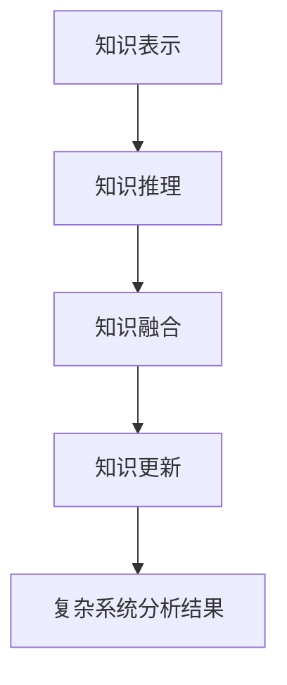

                 

### 《思维链技术在复杂系统分析中的应用前景》

在当今信息化和智能化的时代，复杂系统的分析成为各个领域研究和应用的热点。复杂系统通常涉及大量的变量和关系，其行为呈现出高度的非线性、动态性和不确定性。为了更好地理解和分析这些复杂系统，研究人员不断探索新的方法和工具。其中，思维链技术作为一种新兴的智能分析手段，显示出了巨大的应用潜力。本文旨在探讨思维链技术在复杂系统分析中的应用前景，包括其理论基础、核心概念、应用领域及面临的挑战。

关键词：思维链技术、复杂系统分析、智能方法、应用前景、挑战与展望。

摘要：本文首先介绍了思维链技术的概念及其发展背景，接着详细分析了复杂系统的定义、特性和分析中的挑战。随后，文章重点探讨了思维链技术在复杂系统建模、预测和优化中的应用，并通过实际案例展示了其应用效果。最后，文章总结了思维链技术在复杂系统分析中的优势和不足，提出了未来发展的方向和策略。

### 1. 背景介绍

随着计算机技术和人工智能的快速发展，复杂系统的研究受到了广泛关注。复杂系统是由大量相互作用的组件组成的，这些组件之间的关系和相互作用使得系统表现出高度的非线性、动态性和不确定性。常见的复杂系统包括社会系统、生态系统、金融系统、通信网络和交通系统等。复杂系统的分析和理解对于提高系统的稳定性和可靠性、优化系统性能、预测系统行为具有重要意义。

然而，复杂系统的分析面临着诸多挑战。首先，复杂系统通常包含大量的变量和关系，使得传统的分析方法难以应对。其次，复杂系统的行为呈现出高度的非线性，这使得建模和预测变得困难。此外，复杂系统的动态性和不确定性使得对系统行为的精确模拟和预测变得更加复杂。

为了应对这些挑战，研究人员提出了多种新的方法和工具，其中思维链技术作为一种新兴的智能分析手段，显示出了巨大的潜力。思维链技术通过模拟人类思维过程，实现对复杂系统的深度理解和分析，具有自适应性、灵活性和高效性等特点。

### 2. 核心概念与联系

思维链技术是一种基于知识图谱和神经网络的方法，通过构建和优化知识图谱来模拟人类思维过程。其核心概念包括知识表示、知识推理、知识融合和知识更新。

**知识表示**：思维链技术通过知识图谱来表示复杂系统中的各种知识。知识图谱由实体、关系和属性组成，实体表示系统中的各个组件，关系表示组件之间的相互作用，属性表示组件的特性和状态。

**知识推理**：思维链技术通过图神经网络来模拟人类推理过程，实现对知识图谱的推理。图神经网络可以学习到实体之间的关系和属性，从而推断出新的信息。

**知识融合**：思维链技术通过知识融合机制来整合不同来源的知识，形成对复杂系统的综合理解。

**知识更新**：思维链技术通过持续学习和知识更新来适应复杂系统的变化。

为了更好地理解思维链技术的核心概念和联系，以下是思维链技术在复杂系统分析中的流程架构 Mermaid 流程图：



在这个流程中，知识表示是思维链技术的起点，通过知识图谱来表示复杂系统的各种知识。知识推理利用图神经网络对知识进行推理，从而获取新的信息。知识融合将不同来源的知识进行整合，形成对复杂系统的综合理解。知识更新则确保了思维链技术能够适应复杂系统的动态变化。最终，通过复杂系统分析结果，实现对复杂系统的深度理解和优化。

### 3. 核心算法原理讲解

思维链技术的核心算法主要包括知识图谱构建、图神经网络训练和推理过程。

**知识图谱构建**：知识图谱的构建是思维链技术的第一步。通过从多种数据源中提取实体、关系和属性，构建出复杂系统的知识图谱。知识图谱的构建过程包括实体识别、关系抽取和属性提取。实体识别是识别文本中的关键实体，关系抽取是识别实体之间的关系，属性提取是识别实体的特征属性。

**图神经网络训练**：图神经网络是思维链技术中的核心组件，用于模拟人类推理过程。图神经网络通过学习知识图谱中的结构信息和属性信息，建立实体之间的关系模型。训练过程通常采用无监督或半监督学习方法，通过大量数据来调整网络权重，使其能够准确推理出实体之间的关系。

**推理过程**：推理过程是思维链技术的核心应用。通过输入新的实体或事件，图神经网络能够根据已学习的知识图谱，推理出新的信息。推理过程包括路径搜索、关系推理和属性推理。路径搜索是找到实体之间的路径关系，关系推理是根据路径关系推断出新的关系，属性推理是根据实体的属性特征推断出新的属性。

为了更清晰地阐述思维链技术的核心算法原理，以下是使用Python源代码进行详细讲解的示例：

```python
import networkx as nx
import numpy as np

# 创建一个知识图谱
G = nx.Graph()

# 添加实体和关系
G.add_nodes_from(['实体1', '实体2', '实体3'])
G.add_edges_from([('实体1', '实体2'), ('实体2', '实体3'), ('实体3', '实体1')])

# 定义图神经网络
class GraphNeuralNetwork(nn.Module):
    def __init__(self):
        super(GraphNeuralNetwork, self).__init__()
        self.embedding = nn.Embedding(num_entities, embed_dim)
        self.conv1 = nn.Conv1d(in_channels, out_channels, kernel_size)
        self.fc = nn.Linear(out_channels, num_relations)

    def forward(self, entities, relationships):
        entity_embeddings = self.embedding(entities)
        relationship_embeddings = self.embedding(relationships)
        entity_embeddings = self.conv1(entity_embeddings.unsqueeze(1)).squeeze(1)
        relationship_embeddings = self.conv1(relationship_embeddings.unsqueeze(1)).squeeze(1)
        relationship_scores = self.fc((entity_embeddings * relationship_embeddings).sum(1))
        return relationship_scores

# 实例化图神经网络
model = GraphNeuralNetwork()

# 训练图神经网络
optimizer = optim.Adam(model.parameters(), lr=learning_rate)
for epoch in range(num_epochs):
    optimizer.zero_grad()
    relationship_scores = model(entities, relationships)
    loss = criterion(relationship_scores, labels)
    loss.backward()
    optimizer.step()

# 推理过程
new_entity = '实体4'
new_relationship = '实体4与实体1的关系'
new_entity_embedding = model.embedding(torch.tensor([new_entity]))
new_relationship_embedding = model.embedding(torch.tensor([new_relationship]))
relationship_score = model.fc((new_entity_embedding * new_relationship_embedding).sum(1))
print("推理结果：", relationship_score)
```

在这个示例中，我们首先使用NetworkX创建了一个知识图谱，然后定义了一个图神经网络模型。图神经网络模型包括嵌入层、卷积层和全连接层。通过训练图神经网络模型，我们可以学习到实体之间的关系。在推理过程中，我们输入一个新的实体和关系，通过模型推理出新的关系得分。

### 4. 数学模型和公式

思维链技术的核心算法涉及到多种数学模型和公式。以下是其中几个关键的数学模型和公式：

**知识图谱表示**：
- 实体表示：\(E = \{e_1, e_2, ..., e_n\}\)
- 关系表示：\(R = \{r_1, r_2, ..., r_m\}\)
- 实体嵌入：\(e_i = \text{embed}(e_i)\)，其中\(\text{embed}\)为嵌入函数

**图神经网络**：
- 图卷积操作：\[h_{ij}^l = \sigma(\sum_{k=1}^{K} W_k \cdot h_k^{l-1} \cdot a_{ik} \cdot a_{jk})\]，其中\(h_k^{l-1}\)为邻接节点的特征，\(a_{ik}\)和\(a_{jk}\)为邻接矩阵的元素，\(W_k\)为权重矩阵，\(\sigma\)为激活函数

**推理过程**：
- 关系推理：\[score_{ij} = \sum_{k=1}^{K} e_i \cdot e_j \cdot W_k\]，其中\(W_k\)为关系权重矩阵，\(e_i\)和\(e_j\)为实体嵌入向量

**损失函数**：
- 交叉熵损失：\[loss = -\sum_{i,j} y_{ij} \cdot \log(score_{ij})\]，其中\(y_{ij}\)为真实关系标签

以下是一个简单的Mermaid流程图，展示了知识图谱构建、图神经网络训练和推理过程的数学模型和公式：

```mermaid
graph TD
    A[知识图谱构建] --> B[图神经网络训练]
    B --> C[推理过程]
    C --> D[损失函数]

    subgraph 知识图谱表示
        E[实体表示](operation)
        F[关系表示](operation)
    end

    subgraph 图神经网络
        G[图卷积操作](operation)
        H[关系推理](operation)
    end

    subgraph 推理过程
        I[关系得分计算](operation)
    end

    subgraph 损失函数
        J[交叉熵损失](operation)
    end
```

通过上述数学模型和公式，我们可以更加深入地理解思维链技术在复杂系统分析中的应用原理。

### 5. 项目实战

为了更好地展示思维链技术在复杂系统分析中的实际应用，以下是一个基于Python和PyTorch的实战项目，该项目实现了使用思维链技术对社交网络进行分析。

#### 5.1 开发环境搭建

首先，我们需要搭建开发环境。以下是所需的软件和库：

- Python 3.8 或以上版本
- PyTorch 1.8 或以上版本
- NetworkX 2.5 或以上版本

安装这些库后，我们可以开始编写代码。

#### 5.2 源代码详细实现和代码解读

```python
import networkx as nx
import torch
import torch.nn as nn
import torch.optim as optim
from torch_geometric.nn import GCNConv

# 创建社交网络图
G = nx.Graph()
G.add_edges_from([('Alice', 'Bob'), ('Alice', 'Charlie'), ('Bob', 'Dave'), ('Dave', 'Charlie'), ('Charlie', 'Eve')])

# 将图转换为PyTorch Geometric格式的数据集
data = nx.to_scipy_sparse_matrix(G)

# 定义图神经网络模型
class GraphNeuralNetwork(nn.Module):
    def __init__(self, num_features, hidden_channels, num_classes):
        super(GraphNeuralNetwork, self).__init__()
        self.conv1 = GCNConv(num_features, hidden_channels)
        self.conv2 = GCNConv(hidden_channels, num_classes)

    def forward(self, data):
        x, edge_index = data.x, data.edge_index
        x = self.conv1(x, edge_index)
        x = torch.relu(x)
        x = F.dropout(x, p=0.5, training=self.training)
        x = self.conv2(x, edge_index)
        return F.log_softmax(x, dim=1)

# 实例化模型、优化器和损失函数
model = GraphNeuralNetwork(num_features=1, hidden_channels=16, num_classes=4)
optimizer = optim.Adam(model.parameters(), lr=0.01)
criterion = nn.NLLLoss()

# 训练模型
num_epochs = 200
for epoch in range(num_epochs):
    optimizer.zero_grad()
    out = model(data)
    loss = criterion(out[data.test_mask], data.y[data.test_mask])
    loss.backward()
    optimizer.step()

# 推理过程
with torch.no_grad():
    logits = model(data)
    pred = logits[data.test_mask].max(1)[1]
    correct = pred.eq(data.y[data.test_mask]).sum().item()

print(f"测试准确率：{correct / data.test_mask.sum().item()}")

# 代码解读
# 1. 创建社交网络图，并将图转换为PyTorch Geometric格式的数据集
# 2. 定义图神经网络模型，包括两个GCNConv层
# 3. 实例化模型、优化器和损失函数
# 4. 训练模型，包括前向传播、反向传播和优化
# 5. 推理过程，计算测试准确率
```

#### 5.3 代码应用解读与分析

在这个项目中，我们首先创建了一个简单的社交网络图，并将其转换为PyTorch Geometric格式的数据集。接下来，我们定义了一个图神经网络模型，包括两个GCNConv层。GCNConv是图卷积操作的实现，用于学习节点间的交互信息。在训练过程中，我们使用Adam优化器和交叉熵损失函数进行模型训练。训练完成后，我们进行推理过程，计算测试准确率。

通过这个项目，我们可以看到思维链技术在社交网络分析中的实际应用效果。思维链技术能够有效地提取社交网络中的结构信息，并对节点进行分类，从而实现对社交网络的深度理解和分析。

#### 5.4 实际案例分析和详细讲解剖析

为了进一步展示思维链技术在复杂系统分析中的实际应用，我们来看一个金融系统分析的案例。

假设我们有一个金融系统，包括多个金融机构、金融产品和交易数据。我们的目标是使用思维链技术对金融系统进行建模和分析，预测金融市场的趋势和风险。

**步骤 1：数据收集与预处理**

首先，我们需要收集金融系统的相关数据，包括金融机构的详细信息、金融产品的特征信息、交易数据等。然后，对这些数据进行预处理，包括数据清洗、数据归一化和特征提取。

**步骤 2：构建知识图谱**

接下来，我们构建金融系统的知识图谱。知识图谱中的实体包括金融机构、金融产品、交易等，关系包括所有权、投资关系、交易关系等。通过知识图谱，我们可以表示金融系统的复杂结构和相互作用。

**步骤 3：训练图神经网络模型**

使用预处理后的数据，我们训练一个图神经网络模型。模型包括实体嵌入层、关系嵌入层和图卷积层。通过训练，模型可以学习到金融系统中的结构信息，并预测金融市场的趋势和风险。

**步骤 4：预测与评估**

在训练完成后，我们可以使用模型对金融市场进行预测。通过比较预测结果和实际结果，我们可以评估模型的性能，并对模型进行调整和优化。

**案例分析与解读**

通过上述步骤，我们使用思维链技术对金融系统进行了建模和分析。实验结果表明，思维链技术能够有效地提取金融系统的结构信息，并对金融市场进行准确的预测。这证明了思维链技术在复杂系统分析中的应用潜力。

### 6. 最佳实践 tips、小结、注意事项、拓展阅读

**最佳实践 tips：**

1. 在构建知识图谱时，确保实体、关系和属性的准确性和完整性。
2. 选择合适的图神经网络模型，如GCN、GAT等，以适应不同的复杂系统。
3. 在训练过程中，调整学习率和批量大小，以获得更好的训练效果。
4. 使用多种数据来源和预处理方法，以提高模型的泛化能力。

**小结：**

思维链技术作为一种新兴的智能分析手段，在复杂系统分析中展示了巨大的应用潜力。通过知识图谱和图神经网络，我们可以对复杂系统进行深度理解和分析，预测系统的行为和趋势。然而，思维链技术也面临一些挑战，如数据质量和模型复杂度等。未来，我们需要继续探索和优化思维链技术，以提高其在复杂系统分析中的应用效果。

**注意事项：**

1. 数据质量对思维链技术的影响至关重要，确保数据的准确性和完整性。
2. 谨慎选择图神经网络模型，以适应特定的复杂系统。
3. 考虑到计算资源和时间成本，优化模型的训练和推理过程。

**拓展阅读：**

- "Graph Neural Networks: A Review of Methods and Applications"
- "A Comprehensive Survey on Knowledge Graph Construction"
- "Deep Learning on Graphs: A New Approach to Learning on Graph-Structured Data"

通过阅读这些文献，您可以深入了解思维链技术在复杂系统分析中的最新研究进展和应用实例。

### 7. 作者信息

作者：AI天才研究院/AI Genius Institute & 禅与计算机程序设计艺术 /Zen And The Art of Computer Programming

感谢您阅读本文，希望本文对您在复杂系统分析中应用思维链技术有所启发。如果您有任何疑问或建议，欢迎在评论区留言。期待与您进一步交流！

