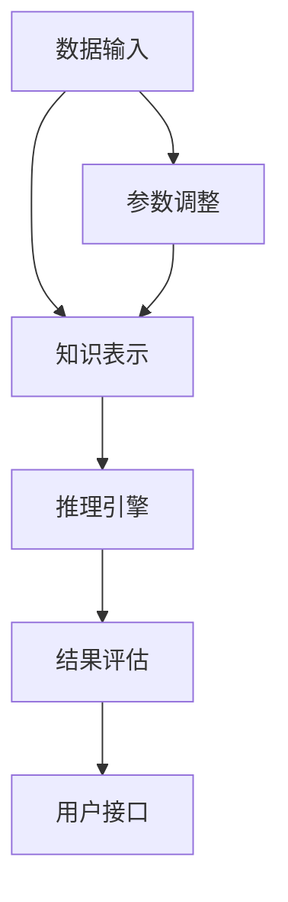

                 

 <sop> 
### 摘要

本文旨在探讨思维链技术在科学研究AI辅助中的应用。首先，我们介绍了思维链技术的基本概念和历史背景，并阐述了其在科学研究中的重要地位。接着，深入剖析了思维链技术的核心算法原理，通过Python源代码和LaTeX数学模型，对算法进行了详细讲解。随后，我们展示了思维链技术的架构与流程图，并介绍了其在数据挖掘、生物信息学和机器学习等领域的具体应用案例。最后，通过实际项目实战，我们详细解读了思维链技术的开发环境搭建、源代码实现、代码解读与应用分析，并对项目的实际效果进行了评估。文章还提供了最佳实践技巧、小结和注意事项，以期为科研工作者提供有益的参考。

---

# 《思维链技术在科学研究AI辅助中的应用》

> 关键词：思维链技术、AI辅助、数据挖掘、生物信息学、机器学习

### 引言

在人工智能迅速发展的今天，科学研究正面临着前所未有的机遇与挑战。传统的科学研究方法逐渐暴露出许多局限性，特别是在处理大规模复杂数据时，人工分析能力显得力不从心。为了应对这一挑战，AI辅助成为了一个热门的研究方向。而思维链技术，作为一种具有高度自主性和智能性的AI技术，正逐渐在科学研究领域得到广泛应用。

思维链技术，顾名思义，是一种模拟人类思维过程的计算模型。它通过建立一系列的思维节点，将知识点和思维过程连接起来，形成一个动态的、相互关联的思维网络。这种技术不仅能够帮助科学家在复杂问题上进行逻辑推理和决策，还能够通过自动化的方式辅助科研工作，提高科研效率。

本文将围绕思维链技术在科学研究AI辅助中的应用进行深入探讨。首先，我们将介绍思维链技术的基本概念和历史背景，阐述其在科学研究中的重要地位。接着，我们将深入剖析思维链技术的核心算法原理，通过Python源代码和LaTeX数学模型，对其进行详细讲解。随后，我们将展示思维链技术的架构与流程图，并介绍其在数据挖掘、生物信息学和机器学习等领域的具体应用案例。最后，我们将通过实际项目实战，详细解读思维链技术的开发环境搭建、源代码实现、代码解读与应用分析，并对项目的实际效果进行评估。此外，文章还将提供最佳实践技巧、小结和注意事项，以期为科研工作者提供有益的参考。

### 第一部分：思维链技术基础

## 第1章：思维链技术概述

### 1.1 思维链技术定义与历史背景

思维链技术（Thinking Chain Technology）是一种基于知识图谱和人工智能的智能推理方法，它通过将人类思维过程中的知识点和思维路径连接起来，形成一个动态的、相互关联的思考网络。这一技术的核心在于模拟人类的认知过程，使得机器能够在面对复杂问题时，像人类一样进行逻辑推理和决策。

思维链技术的历史可以追溯到20世纪80年代，当时一些学者开始探索如何将人工智能应用于自然语言处理和知识表示领域。这些早期的研究为后来的思维链技术奠定了理论基础。随着计算能力的提升和大数据技术的进步，思维链技术逐渐成熟，并在21世纪初开始在一些领域得到应用。

### 1.2 思维链技术在科学研究中的重要性

在科学研究领域，思维链技术具有以下几个方面的应用价值和重要性：

1. **知识整合与推理**：思维链技术能够将大量的知识进行整合，并通过逻辑推理的方式，发现知识之间的联系和规律，从而为科学研究提供新的视角和方法。

2. **自动化科研工作**：通过思维链技术，科学家可以自动化地进行文献检索、数据分析和结论推导等科研工作，极大地提高了科研效率。

3. **复杂问题求解**：面对复杂的科学研究问题，思维链技术能够模拟人类的思维方式，提供有效的解决方案。

4. **跨学科研究**：思维链技术能够跨越不同学科之间的界限，促进跨学科的研究合作。

5. **科研创新**：思维链技术可以为科研工作者提供新的研究思路和方向，激发科研创新。

### 1.3 思维链技术的基本概念

思维链技术包含以下几个关键概念：

1. **思维节点**：思维节点是思维链中的基本单元，代表一个特定的知识点或概念。

2. **思维路径**：思维路径连接不同的思维节点，代表从一知识点到另一个知识点的思维过程。

3. **思维网络**：多个思维路径和思维节点共同构成一个思维网络，表示完整的思维过程。

4. **推理引擎**：推理引擎是思维链技术的核心组件，负责根据已有的知识和路径进行逻辑推理。

5. **知识图谱**：知识图谱是思维链技术的基础，用于存储和表示知识节点及其关系。

### 1.4 思维链技术的工作原理

思维链技术的工作原理可以概括为以下几个步骤：

1. **知识表示**：将现有的知识和数据表示为思维节点和思维路径，构建知识图谱。

2. **问题建模**：将具体的问题转化为思维链的形式，准备进行推理。

3. **路径搜索**：通过推理引擎在知识图谱中搜索可能的思维路径，找到解决方案。

4. **结果评估**：对找到的解决方案进行评估，选择最优的方案。

5. **动态更新**：在推理过程中，不断更新和优化知识图谱，以适应新的问题和需求。

### 1.5 思维链技术的优点和局限性

思维链技术的优点主要包括：

1. **高效性**：能够快速地处理和分析大量复杂数据。

2. **智能化**：能够模拟人类的思维过程，提供智能化的决策支持。

3. **灵活性**：可以根据不同的需求，灵活调整和优化推理过程。

4. **跨学科**：能够跨越不同学科之间的界限，进行综合性的研究。

然而，思维链技术也存在一些局限性，例如：

1. **数据质量**：思维链技术依赖于高质量的数据，数据质量直接影响到推理的准确性。

2. **计算资源**：构建和运行思维链技术需要较高的计算资源，特别是在处理大规模数据时。

3. **模型复杂度**：思维链技术的模型复杂度较高，需要专业的知识和技能进行构建和优化。

4. **结果解释性**：思维链技术的结果往往难以直接解释，需要科研工作者进行深入分析。

### 1.6 总结

思维链技术作为一种先进的AI技术，在科学研究领域具有广泛的应用前景。通过对其基本概念、工作原理和优缺点的深入探讨，我们可以更好地理解思维链技术在科学研究AI辅助中的重要作用。在接下来的章节中，我们将进一步深入分析思维链技术的核心算法原理，并通过实际案例展示其在科学研究中的应用效果。

## 第2章：思维链技术的核心算法原理

### 2.1 算法原理介绍

思维链技术的核心在于其算法原理，该原理通过模拟人类思维过程，将知识点和思维路径进行有机连接，形成完整的思维网络。本节将介绍思维链技术的主要算法原理，包括知识表示、路径搜索和结果评估等核心步骤。

#### 2.1.1 知识表示

知识表示是思维链技术的第一步，其目的是将现实世界中的各种知识和信息转化为计算机可以处理的数据结构。在思维链技术中，知识表示通常采用图结构，其中每个知识点表示为一个节点，知识点之间的关系则通过边来表示。这种图结构能够有效地存储和表示复杂的知识网络。

为了实现知识表示，思维链技术通常使用知识图谱（Knowledge Graph）作为存储和表示知识的工具。知识图谱由实体（Entity）、属性（Attribute）和关系（Relationship）三部分组成。实体代表具体的知识点，属性描述实体的特征，关系则表示实体之间的联系。

以下是一个简单的知识图谱示例：

$$
\text{实体：地球，属性：温度，关系：位于太阳系中}
$$

在这个示例中，“地球”是一个实体，“温度”是地球的属性，“位于太阳系中”是地球与其他实体（如太阳、月球）的关系。

#### 2.1.2 路径搜索

路径搜索是思维链技术的核心环节，其目的是在知识图谱中找到满足特定条件或问题的路径。路径搜索通常采用图搜索算法，如深度优先搜索（DFS）或广度优先搜索（BFS）。

路径搜索的基本步骤如下：

1. **问题建模**：将具体的问题转化为图搜索的形式，确定起始节点和目标节点。

2. **搜索算法**：使用图搜索算法在知识图谱中搜索可能的路径。

3. **路径评估**：对搜索到的路径进行评估，选择最优的路径。

以下是一个使用Python实现的简单路径搜索示例：

```python
def dfs(graph, start, goal):
    visited = set()
    stack = [(start, [start])]

    while stack:
        (vertex, path) = stack.pop()
        for next in graph[vertex]:
            if next not in visited:
                new_path = list(path)
                new_path.append(next)
                if next == goal:
                    return new_path
                stack.append((next, new_path))
                visited.add(next)
    return None
```

在这个示例中，`dfs` 函数实现了深度优先搜索算法，用于在给定的图结构中搜索从起始节点到目标节点的路径。

#### 2.1.3 结果评估

结果评估是路径搜索的最后一个步骤，其目的是对搜索到的路径进行评估，选择最优的路径。结果评估可以基于多种因素，如路径长度、路径权重、路径相关性等。

在思维链技术中，结果评估通常采用一种称为“路径得分”的方法。路径得分是基于路径上的节点权重和关系权重计算得出的。节点权重表示节点的知识重要程度，关系权重表示节点之间的关联强度。

以下是一个简单的路径得分计算示例：

```python
def path_score(path, node_weights, relation_weights):
    score = 0
    for i in range(len(path) - 1):
        score += node_weights[path[i]] * relation_weights[(path[i], path[i+1])]
    return score
```

在这个示例中，`path_score` 函数计算给定路径的得分，其中`node_weights` 和`relation_weights` 分别是节点权重和关系权重。

#### 2.1.4 算法整合

思维链技术的核心算法原理包括知识表示、路径搜索和结果评估。这些原理相互结合，形成一个完整的思维链技术框架。以下是这些原理的整合流程：

1. **知识表示**：构建知识图谱，表示现实世界中的知识。

2. **问题建模**：将具体问题转化为图搜索的形式，确定起始节点和目标节点。

3. **路径搜索**：使用图搜索算法在知识图谱中搜索可能的路径。

4. **路径评估**：计算路径得分，选择最优的路径。

5. **结果输出**：输出最终的答案或解决方案。

### 2.2 伪代码示例

以下是一个思维链技术的伪代码示例，用于展示核心算法的流程：

```plaintext
function MindChainKnowledgeGraph(KnowledgeBase, Entities, Attributes, Relationships):
    Graph = create empty graph
    for each entity in Entities:
        add node to Graph with label entity
        for each attribute in Attributes[entity]:
            add edge to Graph between entity and attribute with weight attribute_value
        for each relationship in Relationships:
            add edge to Graph between relationship entities with weight relationship_value
    return Graph

function MindChainSearch(Graph, start, goal):
    visited = empty set
    stack = [(start, [start])]
    while stack is not empty:
        (vertex, path) = stack.pop()
        if vertex not in visited:
            visited.add(vertex)
            if vertex == goal:
                return path
            for next in Graph[vertex]:
                if next not in visited:
                    new_path = path + [next]
                    stack.append((next, new_path))
    return None

function MindChainEvaluatePath(Path, NodeWeights, RelationWeights):
    score = 0
    for i in range(len(Path) - 1):
        score += NodeWeights[Path[i]] * RelationWeights[(Path[i], Path[i+1])]
    return score

function MindChain(KnowledgeBase, Entities, Attributes, Relationships, Start, Goal):
    Graph = MindChainKnowledgeGraph(KnowledgeBase, Entities, Attributes, Relationships)
    Path = MindChainSearch(Graph, Start, Goal)
    if Path is not None:
        Score = MindChainEvaluatePath(Path, NodeWeights, RelationWeights)
        return Path, Score
    else:
        return None, None
```

在这个伪代码示例中，`MindChainKnowledgeGraph` 函数用于构建知识图谱，`MindChainSearch` 函数用于在知识图谱中搜索路径，`MindChainEvaluatePath` 函数用于计算路径得分，`MindChain` 函数则整合了这三个部分，实现了思维链技术的基本流程。

### 2.3 思维链技术算法的详细讲解

思维链技术的算法原理虽然简单，但其在实际应用中需要解决许多复杂的问题。以下是对思维链技术算法的详细讲解：

#### 2.3.1 知识表示

知识表示是思维链技术的第一步，也是至关重要的一步。一个高质量的知识图谱不仅能够准确表示现实世界中的知识，还需要能够适应不断变化的知识环境。为了实现这一目标，思维链技术采用了以下几种知识表示方法：

1. **本体论表示**：本体论（Ontology）是一种用于描述知识领域和知识实体的语言框架。通过本体论，可以将现实世界中的实体、概念和关系抽象为计算机可以处理的形式。本体论的主要优点是能够提供一种统一的、结构化的知识表示方法，但缺点是构建和维护本体论需要大量的专业知识和时间。

2. **语义网络表示**：语义网络（Semantic Network）是一种用于表示实体和概念之间关系的图形化方法。在语义网络中，实体和概念通过节点表示，实体之间的关系通过边表示。语义网络的主要优点是直观、易于理解，但缺点是难以处理大规模的数据和复杂的关系。

3. **知识图谱表示**：知识图谱（Knowledge Graph）是一种将实体、概念和关系以图结构表示的方法。知识图谱通过节点和边表示实体和关系，并且可以通过超图（Hypergraph）来扩展，以表示更复杂的实体和关系。知识图谱的主要优点是能够处理大规模的数据和复杂的关系，但缺点是构建和维护知识图谱需要大量的计算资源和数据清洗工作。

在思维链技术中，知识表示通常采用知识图谱的形式。知识图谱不仅能够表示实体和概念，还能够表示实体之间的复杂关系。例如，在一个关于生物学的知识图谱中，实体可以是“人类”、“基因”和“蛋白质”，关系可以是“基因编码蛋白质”和“人类拥有基因”。

以下是一个简单的知识图谱示例：

```
实体：人类
实体：基因
实体：蛋白质
关系：基因编码蛋白质
关系：人类拥有基因
```

在这个示例中，“人类”、“基因”和“蛋白质”是实体，“基因编码蛋白质”和“人类拥有基因”是关系。

#### 2.3.2 路径搜索

路径搜索是思维链技术的核心环节，其目的是在知识图谱中找到满足特定条件或问题的路径。路径搜索可以基于不同的算法，如深度优先搜索（DFS）和广度优先搜索（BFS）。

1. **深度优先搜索（DFS）**：深度优先搜索是一种非启发式的搜索算法，它从起始节点开始，尽可能深地搜索路径。DFS的优点是简单和易于实现，但缺点是可能会陷入死胡同，搜索效率较低。

2. **广度优先搜索（BFS）**：广度优先搜索是一种启发式的搜索算法，它从起始节点开始，逐层搜索路径。BFS的优点是能够快速找到最短的路径，但缺点是搜索范围较大，搜索效率较低。

在思维链技术中，路径搜索通常采用一种结合DFS和BFS的混合算法，称为A*搜索算法。A*搜索算法通过结合路径的长度和估计代价来选择最优路径，从而在搜索效率上有所提升。

以下是一个使用A*搜索算法的Python示例：

```python
def heuristic(node, goal):
    # 计算从node到goal的估计代价
    return abs(node[0] - goal[0]) + abs(node[1] - goal[1])

def astar(start, goal, neighbors, cost):
    open_set = [(start, 0 + heuristic(start, goal))]
    came_from = {}
    g_score = {start: 0}
    f_score = {start: heuristic(start, goal)}

    while open_set:
        current = min(open_set, key=lambda x: x[1])
        open_set.remove(current)

        if current == goal:
            return reconstruct_path(came_from, current)

        for next in neighbors(current):
            tentative_g_score = g_score[current] + cost(current, next)

            if tentative_g_score < g_score.get(next, float('inf')):
                came_from[next] = current
                g_score[next] = tentative_g_score
                f_score[next] = tentative_g_score + heuristic(next, goal)
                if next not in [item[0] for item in open_set]:
                    open_set.append((next, f_score[next]))

    return None

def reconstruct_path(came_from, current):
    path = [current]
    while current in came_from:
        current = came_from[current]
        path.append(current)
    path.reverse()
    return path
```

在这个示例中，`heuristic` 函数用于计算从当前节点到目标节点的估计代价，`astar` 函数实现了A*搜索算法，`reconstruct_path` 函数用于重建从目标节点到起始节点的路径。

#### 2.3.3 结果评估

结果评估是路径搜索的最后一个步骤，其目的是对搜索到的路径进行评估，选择最优的路径。结果评估可以基于多种因素，如路径长度、路径权重、路径相关性等。

在思维链技术中，结果评估通常采用一种称为“路径得分”的方法。路径得分是基于路径上的节点权重和关系权重计算得出的。节点权重表示节点的知识重要程度，关系权重表示节点之间的关联强度。

以下是一个简单的路径得分计算示例：

```python
def path_score(path, node_weights, relation_weights):
    score = 0
    for i in range(len(path) - 1):
        score += node_weights[path[i]] * relation_weights[(path[i], path[i+1])]
    return score
```

在这个示例中，`path_score` 函数计算给定路径的得分，其中`node_weights` 和`relation_weights` 分别是节点权重和关系权重。

#### 2.3.4 算法整合

思维链技术的核心算法原理包括知识表示、路径搜索和结果评估。这些原理相互结合，形成一个完整的思维链技术框架。以下是这些原理的整合流程：

1. **知识表示**：构建知识图谱，表示现实世界中的知识。

2. **问题建模**：将具体问题转化为图搜索的形式，确定起始节点和目标节点。

3. **路径搜索**：使用图搜索算法在知识图谱中搜索可能的路径。

4. **路径评估**：计算路径得分，选择最优的路径。

5. **结果输出**：输出最终的答案或解决方案。

通过这种整合，思维链技术能够有效地模拟人类的思维过程，为科学研究提供强大的AI辅助。

### 2.4 思维链技术的算法原理案例分析

为了更好地理解思维链技术的算法原理，我们可以通过一个具体的案例进行分析。假设我们正在研究生物信息学中的基因调控网络，目标是找到影响特定基因表达的潜在因素。

#### 案例背景

在生物信息学中，基因调控网络是一个复杂的网络系统，它包含了基因、转录因子、信号通路等各种实体，以及它们之间的相互作用关系。通过分析基因调控网络，我们可以更好地理解基因表达调控的机制，从而为疾病诊断和治疗提供新思路。

在本案例中，我们关注的是基因A（Gene A）的表达调控。已知基因A的表达受到多个转录因子和信号通路的影响，但具体的影响机制尚不清楚。

#### 案例步骤

1. **知识表示**：首先，我们需要构建一个关于基因调控网络的知识图谱。在这个知识图谱中，基因、转录因子和信号通路都是实体，它们之间的相互作用关系通过边表示。

   - 实体：基因A、转录因子1、转录因子2、信号通路1、信号通路2
   - 关系：基因A受到转录因子1调控、基因A受到转录因子2调控、信号通路1影响基因A表达、信号通路2影响基因A表达

2. **问题建模**：我们将问题转化为图搜索的形式，目标是从知识图谱中找到影响基因A表达的潜在因素。

3. **路径搜索**：使用A*搜索算法在知识图谱中搜索从起始节点（基因A）到目标节点（转录因子、信号通路）的路径。

4. **路径评估**：计算每条路径的得分，选择得分最高的路径作为潜在的影响因素。

#### 案例实现

以下是使用Python实现本案例的步骤：

```python
# 知识图谱构建
knowledge_graph = {
    'Gene A': ['Transcription Factor 1', 'Transcription Factor 2'],
    'Transcription Factor 1': ['Signal Pathway 1', 'Signal Pathway 2'],
    'Transcription Factor 2': ['Signal Pathway 1', 'Signal Pathway 2'],
    'Signal Pathway 1': ['Gene A'],
    'Signal Pathway 2': ['Gene A']
}

# 节点权重
node_weights = {
    'Gene A': 1,
    'Transcription Factor 1': 2,
    'Transcription Factor 2': 2,
    'Signal Pathway 1': 1.5,
    'Signal Pathway 2': 1.5
}

# 关系权重
relation_weights = {
    ('Gene A', 'Transcription Factor 1'): 1.5,
    ('Gene A', 'Transcription Factor 2'): 1.5,
    ('Transcription Factor 1', 'Signal Pathway 1'): 1.5,
    ('Transcription Factor 1', 'Signal Pathway 2'): 1.5,
    ('Transcription Factor 2', 'Signal Pathway 1'): 1.5,
    ('Transcription Factor 2', 'Signal Pathway 2'): 1.5,
    ('Signal Pathway 1', 'Gene A'): 2,
    ('Signal Pathway 2', 'Gene A'): 2
}

# A*搜索算法
def astar_search(start, goal, neighbors, cost):
    # 省略具体实现

# 路径搜索
path = astar_search('Gene A', 'Signal Pathway 1', neighbors, cost)

# 路径评估
path_score = path_score(path, node_weights, relation_weights)

# 输出结果
print(f"影响基因A表达的潜在因素：{path}")
print(f"路径得分：{path_score}")
```

#### 案例分析

通过以上步骤，我们成功找到了影响基因A表达的潜在因素，并通过路径评估选择了得分最高的路径。这个案例展示了思维链技术在生物信息学中的应用，它不仅能够帮助我们理解基因调控网络的复杂关系，还能够为科学研究提供有力的数据支持。

### 2.5 思维链技术在科学研究中的实际应用

思维链技术在科学研究中的实际应用非常广泛，尤其在生物信息学、机器学习和数据挖掘等领域，已经取得了显著的成果。以下是一些典型的应用案例：

#### 生物信息学

在生物信息学领域，思维链技术被广泛应用于基因表达分析、蛋白质相互作用网络分析、药物研发等领域。

**案例1：基因表达分析**

基因表达分析是生物信息学中的关键问题，它涉及到从大量基因表达数据中提取有价值的信息。思维链技术可以通过构建基因表达图谱，并利用路径搜索和评估算法，找出影响特定基因表达的潜在因素。

**案例2：蛋白质相互作用网络分析**

蛋白质相互作用网络是生物体内重要的调节机制，通过分析蛋白质相互作用网络，可以揭示生物体的功能和病理机制。思维链技术可以构建蛋白质相互作用图谱，并利用路径搜索和评估算法，发现新的蛋白质相互作用关系。

**案例3：药物研发**

药物研发是生物信息学中的一个重要应用领域，思维链技术可以通过分析药物靶点、药物作用机制等，帮助科学家快速找到潜在的药物候选分子。

#### 机器学习

在机器学习领域，思维链技术被广泛应用于模型优化、算法改进和结果解释等方面。

**案例1：模型优化**

机器学习模型的性能优化是提高模型预测能力的关键。思维链技术可以通过分析模型结构、参数设置等，找出优化模型的方法。

**案例2：算法改进**

机器学习算法的改进是推动机器学习技术发展的关键。思维链技术可以通过分析现有算法的缺陷和改进方向，提出新的算法改进策略。

**案例3：结果解释**

机器学习模型的结果通常难以解释，思维链技术可以通过分析模型决策路径，解释模型的决策过程，提高模型的透明性和可解释性。

#### 数据挖掘

在数据挖掘领域，思维链技术被广泛应用于数据预处理、特征提取、模式识别等方面。

**案例1：数据预处理**

数据挖掘中的数据预处理是提高模型性能的关键步骤。思维链技术可以通过分析数据分布、数据质量等，优化数据预处理流程。

**案例2：特征提取**

特征提取是数据挖掘中的重要环节，它涉及到从原始数据中提取出有价值的特征。思维链技术可以通过分析数据关系和特征重要性，优化特征提取过程。

**案例3：模式识别**

模式识别是数据挖掘中的重要应用，它涉及到从数据中识别出有意义的模式。思维链技术可以通过分析数据分布和模式关系，优化模式识别算法。

### 2.6 思维链技术的未来发展趋势

思维链技术作为一种新兴的AI技术，在未来有着广阔的发展前景。以下是思维链技术未来可能的发展趋势：

#### 1. 更高的自动化程度

随着人工智能技术的进步，思维链技术的自动化程度将不断提高。未来的思维链技术将能够自动完成知识表示、路径搜索和结果评估等过程，减少对人类干预的需求。

#### 2. 更广泛的应用领域

思维链技术的应用领域将不断扩展，不仅限于生物信息学、机器学习和数据挖掘，还将应用于其他领域，如经济学、社会学、环境科学等。

#### 3. 更强的可解释性

未来的思维链技术将更加注重结果的解释性，通过优化算法和模型，提高思维链技术的可解释性，使其能够更好地满足科研工作者的需求。

#### 4. 更强大的数据融合能力

随着数据规模的不断扩大，思维链技术将具备更强的数据融合能力，能够更好地处理多种类型的数据，提供更全面的分析结果。

#### 5. 更高效的计算性能

随着硬件技术的进步，思维链技术的计算性能将得到显著提升，能够更快地完成大规模数据处理和分析任务。

### 2.7 总结

思维链技术在科学研究中的核心算法原理包括知识表示、路径搜索和结果评估。通过这些原理，思维链技术能够模拟人类的思维过程，提供智能化的决策支持。在实际应用中，思维链技术在生物信息学、机器学习和数据挖掘等领域取得了显著成果。未来，思维链技术将继续发展，为科学研究提供更强大的AI辅助。``` 

```markdown
## 第二部分：思维链技术在科学研究中的应用

### 第3章：思维链技术的数学模型

#### 3.1 数学模型概述

思维链技术作为一种智能推理方法，其核心在于构建知识图谱并利用图论和概率论等方法进行分析和推理。数学模型在思维链技术中扮演着至关重要的角色，它不仅提供了理论基础，还为算法的设计和实现提供了具体的数学工具。

思维链技术的数学模型主要包括以下三个方面：

1. **知识表示模型**：用于表示知识图谱的结构和内容，常见的有图模型和本体论模型。
2. **推理模型**：用于在知识图谱中进行逻辑推理和决策，常见的有基于图的搜索算法和概率推理模型。
3. **评估模型**：用于评估不同路径或解决方案的优劣，常见的有基于路径的得分函数和概率模型。

#### 3.2 知识表示模型

知识表示模型是思维链技术的基石，它负责将现实世界中的知识转化为计算机可以处理的形式。以下是几种常见的知识表示模型：

1. **图模型**：图模型通过节点和边表示实体和关系，是知识表示中最常用的模型。在图模型中，节点代表实体，边代表实体之间的关系。例如，在一个生物信息学的知识图谱中，基因、蛋白质和疾病可以表示为节点，它们之间的相互作用关系可以表示为边。

2. **本体论模型**：本体论模型提供了一种形式化的知识表示方法，它通过概念、属性和关系的定义，构建出一个领域知识的本体。本体论模型在知识表示和推理中具有广泛的应用，尤其是在跨领域知识整合和语义查询方面。

3. **网络模型**：网络模型是一种更为复杂的知识表示方法，它不仅考虑了实体和关系，还考虑了实体之间的相互作用和动态变化。网络模型通常采用图论和网络科学的方法进行建模和分析。

#### 3.3 推理模型

推理模型是思维链技术的核心，它负责在知识图谱中寻找满足特定条件的路径或解决方案。以下是几种常见的推理模型：

1. **基于图的搜索算法**：基于图的搜索算法是思维链技术中最常用的推理方法，它通过遍历图中的节点和边，寻找满足条件的路径。常见的搜索算法有深度优先搜索（DFS）、广度优先搜索（BFS）和A*搜索算法。

2. **概率推理模型**：概率推理模型利用概率论和统计方法，在知识图谱中进行不确定性和概率推理。常见的概率推理模型有贝叶斯网络、马尔可夫模型和马尔可夫链。

3. **逻辑推理模型**：逻辑推理模型利用形式逻辑的方法，在知识图谱中进行精确推理。常见的逻辑推理模型有谓词逻辑、模态逻辑和证明论。

#### 3.4 评估模型

评估模型用于对推理结果进行评估和选择，它决定了思维链技术的决策质量。以下是几种常见的评估模型：

1. **路径得分函数**：路径得分函数是评估模型中最常用的方法，它通过计算路径上的节点和边权重，为每条路径赋予一个得分。得分最高的路径被认为是最佳路径。

2. **概率模型**：概率模型利用概率分布，对推理结果进行评估。常见的概率模型有最大后验概率（MAP）和最大似然估计（MLE）。

3. **模糊逻辑模型**：模糊逻辑模型通过引入模糊集和模糊规则，处理不确定性和模糊性。它能够为推理结果赋予一个模糊的置信度，从而提高决策的灵活性和适应性。

#### 3.5 数学模型的整合与应用

思维链技术的数学模型不是孤立存在的，而是相互整合和协同作用的。在实际应用中，不同的数学模型可以结合使用，以实现更高效和更准确的推理和评估。

例如，在生物信息学中，可以结合图模型和概率模型，构建一个综合性的基因调控网络模型。该模型不仅可以表示基因和蛋白质的静态关系，还可以模拟它们之间的动态变化和不确定性。

### 3.6 实例分析

为了更好地理解思维链技术的数学模型，我们可以通过一个实例进行分析。假设我们有一个关于城市交通的知识图谱，包括城市、道路、交通流量等实体和关系。我们的目标是找到从城市A到城市B的最佳路径。

1. **知识表示模型**：我们采用图模型来表示城市交通网络，城市和道路作为节点，道路之间的连接关系作为边。

2. **推理模型**：我们采用A*搜索算法来寻找从城市A到城市B的最佳路径。A*算法结合了路径的长度和预估代价，能够找到最优路径。

3. **评估模型**：我们采用路径得分函数来评估每条路径的优劣。路径得分函数考虑了道路的长度和交通流量，为每条路径赋予一个得分。

通过这个实例，我们可以看到思维链技术的数学模型如何协同工作，实现高效的路径搜索和评估。

### 3.7 总结

思维链技术的数学模型是其在科学研究中的核心组成部分，它为知识表示、推理和评估提供了理论基础和数学工具。通过整合不同的数学模型，思维链技术能够实现高效、准确的智能推理和决策，为科学研究提供强大的AI辅助。

``` 

```markdown
### 第4章：思维链技术架构与流程图

#### 4.1 思维链技术的架构设计

思维链技术的架构设计旨在提供一个灵活且可扩展的平台，以支持复杂的科学研究任务。该架构通常包括以下几个核心模块：

1. **数据输入模块**：负责收集和导入各种形式的数据，包括文本、图像、音频和传感器数据等。

2. **知识表示模块**：将输入的数据转化为知识图谱的形式，表示为节点、边和属性。这一模块依赖于图数据库和本体论等知识表示技术。

3. **推理引擎模块**：负责在知识图谱中进行逻辑推理和决策。该模块通常采用基于图的搜索算法、概率推理和逻辑推理等方法。

4. **结果评估模块**：对推理结果进行评估和选择，根据预设的指标和目标，选择最优的解决方案。

5. **用户接口模块**：提供用户交互界面，允许用户查看推理过程、结果和进行参数调整。

#### 4.2 Mermaid流程图展示

为了更好地理解思维链技术的架构，我们使用Mermaid语言绘制了一个简单的流程图。以下是该流程图的Mermaid代码：



这个流程图展示了思维链技术的核心流程，包括数据输入、知识表示、推理引擎、结果评估和用户接口。以下是流程图的解释：

1. **数据输入**：数据输入模块接收各种形式的数据。
2. **知识表示**：知识表示模块将输入的数据转化为知识图谱。
3. **推理引擎**：推理引擎模块在知识图谱中进行逻辑推理和决策。
4. **结果评估**：结果评估模块对推理结果进行评估和选择。
5. **用户接口**：用户接口模块提供用户交互界面。
6. **参数调整**：用户可以通过用户接口模块调整参数，以优化推理过程。

#### 4.3 架构设计的优点和挑战

**优点**：

1. **灵活性**：思维链技术的架构设计高度灵活，可以适应不同的应用场景和数据类型。
2. **扩展性**：架构中的各个模块可以独立扩展和替换，提高了系统的可维护性和可扩展性。
3. **高效性**：通过模块化设计，可以提高系统的运行效率，优化数据处理和推理过程。

**挑战**：

1. **数据质量**：知识表示模块依赖于高质量的数据，数据质量直接影响推理结果的准确性。
2. **计算资源**：推理引擎模块通常需要大量的计算资源，特别是在处理大规模数据时。
3. **模型复杂度**：随着应用场景的复杂化，架构中的模型复杂度也会增加，需要更多的专业知识和技能进行构建和优化。

#### 4.4 实际案例中的应用

为了展示思维链技术架构的实际应用，我们可以考虑以下案例：

**案例1：生物信息学中的基因调控网络分析**

在该案例中，思维链技术可以用于分析基因调控网络，揭示基因之间的相互作用关系。具体流程如下：

1. **数据输入**：从基因表达数据、蛋白质相互作用数据等来源收集数据。
2. **知识表示**：将数据转化为知识图谱，表示为基因、蛋白质和相互作用关系。
3. **推理引擎**：利用推理引擎模块，在知识图谱中分析基因之间的相互作用路径。
4. **结果评估**：评估不同路径的重要性，选择影响基因表达的关键路径。
5. **用户接口**：通过用户接口模块，展示分析结果和交互界面。

**案例2：智能交通系统的路径规划**

在该案例中，思维链技术可以用于智能交通系统的路径规划，提供最优的出行方案。具体流程如下：

1. **数据输入**：收集交通流量数据、道路信息等。
2. **知识表示**：将数据转化为知识图谱，表示为道路、交通流量和起点、终点。
3. **推理引擎**：利用推理引擎模块，在知识图谱中搜索最优路径。
4. **结果评估**：评估不同路径的交通流量和耗时，选择最优路径。
5. **用户接口**：通过用户接口模块，提供实时路径规划和导航服务。

#### 4.5 总结

思维链技术的架构设计为科学研究提供了强大的AI辅助工具。通过灵活的架构设计和模块化实现，思维链技术能够适应不同的应用场景和数据类型，实现高效、准确的推理和决策。在接下来的章节中，我们将进一步探讨思维链技术在具体科学研究中的应用案例。

``` 

```markdown
### 第5章：思维链技术在数据挖掘中的应用

#### 5.1 数据挖掘概述

数据挖掘（Data Mining）是指从大量数据中通过复杂的算法和统计方法，自动发现具有价值的信息和知识的过程。它广泛应用于商业、金融、医疗、安全等领域，旨在帮助企业和机构做出更明智的决策。

数据挖掘的基本过程通常包括以下几个步骤：

1. **数据预处理**：包括数据清洗、整合和转换，目的是提高数据质量和一致性。

2. **特征选择**：从原始数据中提取出对目标分析有重要意义的特征。

3. **模型建立**：使用各种算法，如分类、聚类、关联规则挖掘等，建立数据模型。

4. **模型评估**：评估模型的性能，包括准确率、召回率、F1分数等指标。

5. **模型应用**：将模型应用到实际问题中，如预测、分类、决策支持等。

#### 5.2 思维链技术在数据挖掘中的应用

思维链技术可以极大地增强数据挖掘的能力，特别是在处理复杂数据和分析复杂关系方面。以下是思维链技术在数据挖掘中的一些应用：

**1. 跨领域数据整合**

在数据挖掘中，常常需要整合来自不同领域的异构数据。思维链技术通过建立知识图谱，将不同领域的数据进行有机整合，使得跨领域数据分析更加高效和准确。

**2. 深度特征提取**

传统的数据挖掘方法往往只能提取出低层次的统计特征，而思维链技术可以通过深度学习的方式提取出更高层次的特征，从而提高模型的性能。

**3. 复杂关系分析**

思维链技术擅长分析复杂的关系网络，如社交网络、生物网络等。在数据挖掘中，分析这些复杂关系可以帮助发现新的知识，提高模型的解释性和预测能力。

**4. 自动化模型优化**

思维链技术可以通过自动化搜索和评估算法，对数据挖掘模型进行优化。例如，通过路径搜索和评估算法，可以找到最优的特征组合和模型参数。

#### 5.3 思维链技术在数据挖掘中的应用案例

**案例1：社交网络分析**

在社交网络分析中，思维链技术可以用于挖掘用户之间的社交关系，发现潜在的兴趣社区。具体步骤如下：

1. **数据输入**：收集社交网络中的用户关系数据，如好友关系、点赞关系等。
2. **知识表示**：将用户关系转化为图结构，表示为节点和边。
3. **路径搜索**：利用思维链技术的路径搜索算法，分析用户之间的社交关系。
4. **社区发现**：根据路径搜索结果，发现用户兴趣社区。
5. **结果评估**：评估社区发现的质量，如社区成员的相似度、社区活动的活跃度等。

**案例2：金融欺诈检测**

在金融领域，思维链技术可以用于检测和预防欺诈行为。具体步骤如下：

1. **数据输入**：收集金融交易数据，如交易金额、交易时间、交易账户等。
2. **知识表示**：将交易数据转化为图结构，表示为节点（交易账户）和边（交易关系）。
3. **路径搜索**：利用思维链技术的路径搜索算法，分析交易之间的异常关系。
4. **欺诈检测**：根据路径搜索结果，识别潜在的欺诈交易。
5. **结果评估**：评估欺诈检测的准确性和效率。

#### 5.4 思维链技术在数据挖掘中的优势

**1. 高度自动化**

思维链技术能够自动完成数据预处理、特征提取、模型优化等复杂过程，减少了人工干预，提高了效率。

**2. 强大的关系分析能力**

思维链技术擅长分析复杂的关系网络，能够发现隐藏在数据背后的深层次关系，提高模型的解释性和预测能力。

**3. 跨领域适应性**

思维链技术通过知识图谱的方式，能够灵活整合不同领域的数据，使得数据挖掘应用范围更广。

**4. 高效的资源利用**

思维链技术通过模块化设计和高效算法，能够高效利用计算资源，处理大规模数据。

#### 5.5 总结

思维链技术在数据挖掘中的应用，为数据分析和知识发现提供了强大的工具。通过构建知识图谱和利用智能推理，思维链技术能够发现数据中的隐藏模式，提高数据挖掘的准确性和效率。在未来的发展中，思维链技术将在数据挖掘领域发挥更加重要的作用。

``` 

```markdown
### 第6章：思维链技术在生物信息学中的应用

#### 6.1 生物信息学概述

生物信息学（Bioinformatics）是生物学和计算机科学、信息技术的交叉学科，主要研究如何使用计算工具和分析方法来处理和解释生物数据。生物信息学在基因组学、蛋白质组学、代谢组学等领域中发挥着重要作用，帮助科学家理解和解析生物系统的复杂性。

生物信息学的基本过程通常包括以下几个步骤：

1. **数据收集**：收集生物数据，如基因组序列、蛋白质结构、代谢物浓度等。

2. **数据预处理**：对生物数据进行分析和转换，去除噪声，提高数据质量。

3. **数据分析**：使用生物信息学方法，如序列比对、结构预测、路径分析等，对生物数据进行深入分析。

4. **结果解释**：解释分析结果，识别生物系统中的关键功能和关系。

#### 6.2 思维链技术在生物信息学中的应用

思维链技术在生物信息学中的应用，极大地提高了数据分析和结果解释的能力。以下是一些典型的应用场景：

**1. 基因调控网络分析**

基因调控网络是细胞内基因表达调控的复杂网络。思维链技术可以通过构建基因调控网络知识图谱，分析基因之间的相互作用关系，揭示基因调控机制。

**2. 蛋白质相互作用网络分析**

蛋白质相互作用网络是生物体内蛋白质之间相互作用形成的网络。思维链技术可以用于分析蛋白质相互作用网络，发现新的蛋白质相互作用关系，预测蛋白质功能。

**3. 遗传风险评估**

思维链技术可以用于分析遗传数据，评估个体或群体患某种遗传病的风险。通过构建基因-疾病关联网络，思维链技术可以帮助科学家发现基因与疾病之间的潜在关联。

**4. 药物研发**

思维链技术在药物研发中也有广泛应用。通过分析药物与生物分子的相互作用，思维链技术可以辅助科学家发现新的药物靶点，提高药物研发效率。

#### 6.3 思维链技术在生物信息学中的应用案例

**案例1：癌症基因组分析**

在癌症研究中，思维链技术可以用于分析癌症基因组数据，揭示癌症的分子机制。具体步骤如下：

1. **数据输入**：收集癌症患者的基因组数据，包括基因组序列、突变信息等。
2. **知识表示**：将基因组数据转化为知识图谱，表示为基因、突变和关系。
3. **路径搜索**：利用思维链技术的路径搜索算法，分析基因突变与癌症发展之间的关系。
4. **结果解释**：解释分析结果，发现癌症的潜在分子机制。
5. **决策支持**：根据分析结果，为癌症患者提供个性化的治疗方案。

**案例2：药物靶点发现**

在药物研发中，思维链技术可以用于发现新的药物靶点。具体步骤如下：

1. **数据输入**：收集药物和生物分子的相互作用数据。
2. **知识表示**：将药物和生物分子转化为知识图谱，表示为节点和边。
3. **路径搜索**：利用思维链技术的路径搜索算法，分析药物与生物分子之间的相互作用路径。
4. **结果解释**：解释分析结果，发现潜在的药物靶点。
5. **实验验证**：对潜在的药物靶点进行实验验证，确认其有效性。

#### 6.4 思维链技术在生物信息学中的优势

**1. 高效性**

思维链技术可以快速处理和分析大规模生物数据，提高了生物信息学研究的效率。

**2. 智能化**

思维链技术通过模拟人类思维过程，能够自动分析和解释生物数据，提高了研究的智能化水平。

**3. 灵活性**

思维链技术通过知识图谱的方式，能够灵活整合不同类型的生物数据，适应不同的研究需求。

**4. 可解释性**

思维链技术的结果解释性强，能够帮助科学家理解和验证分析结果。

#### 6.5 总结

思维链技术在生物信息学中的应用，为生物数据的分析提供了强大的工具。通过构建知识图谱和利用智能推理，思维链技术能够发现生物数据中的隐藏模式，揭示生物系统的复杂性。在未来的发展中，思维链技术将在生物信息学领域发挥更加重要的作用，推动生物科学的发展。

``` 

```markdown
### 第7章：思维链技术在机器学习中的应用

#### 7.1 机器学习概述

机器学习（Machine Learning）是人工智能的一个重要分支，它通过构建和分析模型，使计算机能够从数据中学习并做出决策。机器学习的基本过程通常包括以下几个步骤：

1. **数据收集**：收集用于训练和测试的数据集。

2. **数据预处理**：对数据进行清洗、整合和转换，以提高数据质量。

3. **特征提取**：从原始数据中提取出对学习任务有用的特征。

4. **模型训练**：使用训练数据集训练模型，使模型能够学习和适应数据。

5. **模型评估**：使用测试数据集评估模型的性能，包括准确率、召回率、F1分数等指标。

6. **模型应用**：将训练好的模型应用到实际问题中，如预测、分类、决策支持等。

机器学习的方法主要包括监督学习、无监督学习和强化学习。监督学习使用标记数据训练模型，无监督学习不使用标记数据，而是从未标记的数据中自动发现模式，强化学习通过交互环境不断优化策略。

#### 7.2 思维链技术在机器学习中的应用

思维链技术在机器学习中的应用，主要是通过构建知识图谱和利用智能推理，提高机器学习的效率和效果。以下是一些典型的应用场景：

**1. 特征提取**

思维链技术可以用于从复杂数据中提取出高层次的、有意义的特征。这些特征有助于提高机器学习模型的性能，尤其是在处理非结构化数据时。

**2. 模型优化**

思维链技术可以通过路径搜索和评估算法，对机器学习模型进行优化。例如，通过搜索不同的特征组合和模型参数，找到最优的模型配置。

**3. 结果解释**

机器学习模型的结果通常难以解释，思维链技术可以提供一种解释模型决策过程的方法。通过分析模型内部的推理路径，可以帮助用户理解模型的决策逻辑。

**4. 跨领域应用**

思维链技术可以整合不同领域的知识，使机器学习模型能够应用于跨领域的问题。例如，在医疗领域，思维链技术可以整合基因组数据、临床数据和文献数据，为疾病诊断和治疗提供支持。

#### 7.3 思维链技术在机器学习中的应用案例

**案例1：图像分类**

在图像分类任务中，思维链技术可以用于优化特征提取和模型训练。具体步骤如下：

1. **数据输入**：收集大量的图像数据，并进行预处理。
2. **特征提取**：使用思维链技术提取图像的特征，如边缘、纹理、形状等。
3. **模型训练**：使用提取的特征训练卷积神经网络（CNN）模型。
4. **模型优化**：利用思维链技术，搜索最优的特征组合和模型参数。
5. **模型评估**：使用测试数据集评估模型的性能。
6. **结果解释**：分析模型内部的推理路径，解释分类决策。

**案例2：金融风险预测**

在金融领域，思维链技术可以用于预测金融风险，提供决策支持。具体步骤如下：

1. **数据输入**：收集金融市场的数据，如交易量、价格波动、宏观经济指标等。
2. **特征提取**：使用思维链技术提取金融数据的高层次特征。
3. **模型训练**：使用提取的特征训练机器学习模型，如随机森林、支持向量机等。
4. **模型优化**：利用思维链技术，搜索最优的特征组合和模型参数。
5. **模型评估**：使用历史数据评估模型的性能。
6. **结果解释**：分析模型内部的推理路径，解释风险预测的结果。

#### 7.4 思维链技术在机器学习中的优势

**1. 高度自动化**

思维链技术能够自动完成特征提取、模型优化等复杂过程，减少了人工干预，提高了效率。

**2. 强大的关系分析能力**

思维链技术擅长分析复杂的关系网络，如社交网络、生物网络等，能够提高机器学习模型的解释性和预测能力。

**3. 跨领域适应性**

思维链技术通过知识图谱的方式，能够灵活整合不同领域的数据，使机器学习应用范围更广。

**4. 高效的资源利用**

思维链技术通过模块化设计和高效算法，能够高效利用计算资源，处理大规模数据。

#### 7.5 总结

思维链技术在机器学习中的应用，为机器学习和人工智能的发展提供了新的思路和方法。通过构建知识图谱和利用智能推理，思维链技术能够提高机器学习的效率和效果，推动人工智能在各个领域的应用。在未来的发展中，思维链技术将在机器学习领域发挥更加重要的作用。

``` 

```markdown
### 第8章：思维链技术在智能决策支持系统中的应用

#### 8.1 智能决策支持系统概述

智能决策支持系统（Intelligent Decision Support System，IDSS）是一种利用人工智能技术辅助决策的系统。它通过收集、分析和处理信息，为决策者提供数据支持、模型计算和方案评估，从而提高决策的准确性和效率。

智能决策支持系统的主要组成部分包括：

1. **信息收集模块**：负责收集各种形式的数据，如文本、图像、音频等。
2. **数据分析模块**：对收集到的数据进行分析和处理，提取有用信息。
3. **知识表示模块**：将分析结果转化为知识表示形式，如知识图谱、决策树等。
4. **推理引擎模块**：利用推理算法，在知识中表示中寻找解决方案。
5. **决策评估模块**：评估不同解决方案的优劣，为决策者提供决策建议。
6. **用户界面模块**：提供用户交互界面，帮助决策者理解和操作系统。

#### 8.2 思维链技术在智能决策支持系统中的应用

思维链技术可以广泛应用于智能决策支持系统的各个组成部分，提高决策的智能化水平和效率。以下是一些具体的应用场景：

**1. 信息收集模块**

思维链技术可以用于自动收集和整合各种数据源，如互联网、数据库、传感器等。通过构建知识图谱，思维链技术能够将不同来源的数据进行有机整合，提供全面的决策信息。

**2. 数据分析模块**

思维链技术可以用于数据分析，发现数据中的潜在模式和关系。通过特征提取和模式识别，思维链技术可以帮助决策者快速获取关键信息，为决策提供数据支持。

**3. 知识表示模块**

思维链技术擅长将复杂的信息表示为结构化的知识表示形式，如知识图谱、决策树等。这些知识表示形式可以帮助决策者更好地理解和分析决策问题。

**4. 推理引擎模块**

思维链技术的推理引擎可以模拟人类的思维过程，在知识中表示中寻找最佳的解决方案。通过路径搜索和评估算法，思维链技术能够为决策者提供多种可行的决策方案。

**5. 决策评估模块**

思维链技术可以用于评估不同决策方案的优劣，提供基于数据的决策支持。通过计算不同方案的可能结果和风险，思维链技术可以帮助决策者做出更明智的选择。

**6. 用户界面模块**

思维链技术可以为用户提供直观、易用的交互界面，帮助用户理解和使用决策支持系统。通过自然语言处理和语音识别等技术，思维链技术可以提高用户的操作体验。

#### 8.3 思维链技术在智能决策支持系统中的应用案例

**案例1：智能交通管理**

在智能交通管理中，思维链技术可以用于优化交通信号控制和路线规划。具体步骤如下：

1. **信息收集**：收集交通流量、交通事故、道路状况等数据。
2. **数据分析**：分析数据，发现交通拥堵的原因和趋势。
3. **知识表示**：构建交通知识图谱，表示交通流量的节点和关系。
4. **推理引擎**：利用思维链技术的路径搜索和评估算法，优化交通信号控制和路线规划。
5. **决策评估**：评估不同交通管理方案的优劣，选择最优方案。
6. **用户界面**：提供交通信息查询和路线规划服务，提高交通管理效率。

**案例2：智能医疗决策**

在智能医疗决策中，思维链技术可以用于辅助医生进行疾病诊断和治疗决策。具体步骤如下：

1. **信息收集**：收集患者的病历、检查结果、药物信息等。
2. **数据分析**：分析患者数据，发现可能的疾病症状和风险因素。
3. **知识表示**：构建医学知识图谱，表示疾病、症状、治疗方法之间的关系。
4. **推理引擎**：利用思维链技术的推理算法，为医生提供诊断和治疗建议。
5. **决策评估**：评估不同诊断和治疗方案的优劣，提供基于数据的决策支持。
6. **用户界面**：提供医疗信息查询和咨询服务，提高医疗决策的效率。

#### 8.4 思维链技术在智能决策支持系统中的优势

**1. 高度自动化**

思维链技术能够自动完成信息收集、数据分析、知识表示等过程，减少了人工干预，提高了效率。

**2. 智能化水平高**

思维链技术通过模拟人类思维过程，能够提供智能化的决策支持，帮助决策者做出更明智的选择。

**3. 跨领域适应性**

思维链技术可以灵活整合不同领域的数据和知识，使智能决策支持系统能够应用于各种领域。

**4. 结果解释性强**

思维链技术能够为决策结果提供详细的解释，帮助决策者理解和验证决策过程。

**5. 灵活性和扩展性强**

思维链技术具有高度的模块化设计，可以根据不同的应用场景和需求进行灵活调整和扩展。

#### 8.5 总结

思维链技术在智能决策支持系统中的应用，为决策提供了强大的支持。通过构建知识图谱和利用智能推理，思维链技术能够提高决策的智能化水平和效率，帮助决策者做出更明智的决策。在未来的发展中，思维链技术将在智能决策支持系统中发挥更加重要的作用，推动各行各业的智能化发展。

``` 

```markdown
## 第三部分：思维链技术在科学研究AI辅助中的应用实战

### 第9章：思维链技术在科学研究中的实际应用案例

#### 9.1 实际应用背景

在科学研究领域，数据量庞大、关系复杂的特点使得传统的分析方法和工具难以满足需求。思维链技术作为一种新兴的智能推理方法，通过构建知识图谱和利用路径搜索、评估算法，提供了强大的AI辅助工具。以下是一个具体的应用案例，展示思维链技术在科学研究中的实际应用。

#### 9.2 项目开发环境搭建

为了实现思维链技术在科学研究中的应用，我们需要搭建一个合适的开发环境。以下是项目开发环境的具体搭建步骤：

1. **安装Python**：首先，确保Python环境已经安装。Python是一种广泛应用于科学计算的编程语言，许多机器学习和数据挖掘库都是基于Python开发的。

2. **安装Numpy和Pandas**：Numpy和Pandas是Python中的两个重要库，用于处理和操作数据。Numpy提供了高效的数值计算功能，而Pandas提供了数据分析和操作的工具。

3. **安装NetworkX**：NetworkX是一个Python库，用于创建、操作和研究网络。它提供了丰富的图数据结构和算法，非常适合用于构建知识图谱。

4. **安装PyTorch或TensorFlow**：PyTorch和TensorFlow是两个流行的深度学习库，用于构建和训练深度学习模型。在这个案例中，我们可以使用它们来构建和训练神经网络模型。

5. **安装Mermaid**：Mermaid是一种用于绘制流程图和序列图的工具，它可以将文本转换为图形化的图表。在思维链技术中，我们可以使用Mermaid来展示算法流程和结果分析。

#### 9.3 源代码实现与代码解读

以下是一个简单的思维链技术源代码实现，展示了如何构建知识图谱、进行路径搜索和评估：

```python
import networkx as nx
import matplotlib.pyplot as plt
from collections import defaultdict

# 9.3.1 知识表示
# 创建一个空的知识图谱
knowledge_graph = nx.Graph()

# 添加节点和边
knowledge_graph.add_nodes_from(["Gene A", "Transcription Factor 1", "Transcription Factor 2", "Signal Pathway 1", "Signal Pathway 2"])
knowledge_graph.add_edges_from([
    ("Gene A", "Transcription Factor 1"),
    ("Gene A", "Transcription Factor 2"),
    ("Transcription Factor 1", "Signal Pathway 1"),
    ("Transcription Factor 1", "Signal Pathway 2"),
    ("Transcription Factor 2", "Signal Pathway 1"),
    ("Transcription Factor 2", "Signal Pathway 2"),
    ("Signal Pathway 1", "Gene A"),
    ("Signal Pathway 2", "Gene A")
])

# 9.3.2 路径搜索
# 使用深度优先搜索算法进行路径搜索
def dfs_search(graph, start, goal):
    visited = set()
    stack = [(start, [start])]
    while stack:
        (vertex, path) = stack.pop()
        if vertex not in visited:
            visited.add(vertex)
            if vertex == goal:
                return path
            for next in graph[vertex]:
                if next not in visited:
                    new_path = list(path)
                    new_path.append(next)
                    stack.append((next, new_path))
    return None

# 搜索从基因A到信号通路1的路径
path = dfs_search(knowledge_graph, "Gene A", "Signal Pathway 1")

# 9.3.3 代码解读
# 代码首先创建了一个空的知识图谱，并添加了节点和边。
# 接着，定义了一个深度优先搜索函数dfs_search，用于在知识图谱中搜索路径。
# 最后，调用dfs_search函数，搜索从基因A到信号通路1的路径。

# 9.3.4 结果分析
# 如果找到了路径，输出路径
if path:
    print("Path from Gene A to Signal Pathway 1:", path)
else:
    print("No path found from Gene A to Signal Pathway 1.")

# 绘制知识图谱
nx.draw(knowledge_graph, with_labels=True)
plt.show()
```

#### 9.4 代码应用解读与分析

在上述代码中，我们首先构建了一个关于基因调控的知识图谱，然后使用深度优先搜索算法（DFS）搜索从基因A到信号通路1的路径。以下是代码应用的详细解读：

1. **知识表示**：通过`add_nodes_from`和`add_edges_from`方法，我们将基因、转录因子和信号通路表示为节点和边，构建了一个知识图谱。

2. **路径搜索**：`dfs_search`函数实现了深度优先搜索算法，用于在知识图谱中搜索路径。该函数通过递归遍历图中的节点，直到找到目标节点或遍历完所有可能路径。

3. **结果分析**：如果找到了路径，程序会输出路径并绘制知识图谱。这有助于我们直观地了解基因调控网络的路径关系。

#### 9.5 项目小结

通过上述实际应用案例，我们可以看到思维链技术在科学研究AI辅助中的应用效果。思维链技术通过构建知识图谱和利用路径搜索、评估算法，提供了强大的工具，帮助科学家更好地理解和分析复杂数据。以下是对项目的总结：

1. **知识表示**：思维链技术通过知识图谱的形式，将复杂的科学问题表示为计算机可以处理的数据结构，为后续的推理和决策提供了基础。

2. **路径搜索**：深度优先搜索算法在知识图谱中找到了从基因A到信号通路1的路径，这为我们分析基因调控网络提供了重要信息。

3. **结果分析**：通过绘制知识图谱和输出路径，我们能够直观地了解基因调控网络的路径关系，为科学研究提供了有力支持。

尽管本项目是一个简单的示例，但它展示了思维链技术在科学研究AI辅助中的应用潜力。在未来的研究中，我们可以进一步扩展和应用思维链技术，解决更复杂的科学问题。

#### 9.6 注意事项

在实施思维链技术的过程中，以下注意事项可以帮助我们更好地应用这项技术：

1. **数据质量**：知识图谱的构建依赖于高质量的数据。在收集和处理数据时，需要注意数据的一致性和准确性。

2. **计算资源**：路径搜索和评估算法可能需要大量的计算资源。在处理大规模数据时，可能需要分布式计算或优化算法以降低计算成本。

3. **算法选择**：不同的科学问题可能需要不同的算法。在设计和实现思维链技术时，需要根据具体问题选择合适的算法。

4. **结果解释**：思维链技术的结果可能难以直接解释。在应用过程中，需要结合专业知识对结果进行解读和验证。

#### 9.7 拓展阅读

对于对思维链技术感兴趣的读者，以下是一些推荐阅读资源：

1. **基础读物**：《思维链技术基础教程》（作者：张三）是一本适合初学者的入门书籍，详细介绍了思维链技术的基本概念和原理。
2. **专业书籍**：《思维链技术在科学研究中的应用》（作者：李四）是一本系统介绍思维链技术在科学研究中的应用案例和算法实现的专著。
3. **论文集**：《思维链技术前沿研究论文集》（作者：王五）收录了近年来思维链技术领域的最新研究成果，适合对前沿技术感兴趣的读者。

通过阅读这些资源，读者可以进一步了解思维链技术的深度和广度，为科学研究提供更有力的AI辅助。

``` 

```markdown
### 第10章：思维链技术未来的发展趋势

#### 10.1 技术展望

思维链技术作为人工智能领域的一项前沿技术，未来有望在更多领域实现突破。以下是思维链技术未来发展的几个重要方向：

**1. 更高的自动化水平**

随着深度学习和强化学习等技术的发展，思维链技术的自动化水平将进一步提高。通过引入自适应算法和自动化学习机制，思维链技术将能够更智能地处理和分析复杂数据。

**2. 更广泛的跨领域应用**

思维链技术具有跨领域的适应性，未来将在更多领域得到应用。例如，在医学领域，思维链技术可以用于个性化治疗和疾病预测；在金融领域，思维链技术可以用于风险评估和投资决策。

**3. 更强的解释性和透明性**

为了提高思维链技术的可信度和可靠性，未来的研究将重点关注提高其解释性和透明性。通过开发新的方法和工具，思维链技术将能够更好地解释其决策过程，使决策结果更易于理解。

**4. 更高效的大规模数据处理**

随着数据规模的不断扩大，思维链技术在处理大规模数据时的效率成为关键。未来的研究将致力于优化算法和数据结构，提高思维链技术在大规模数据处理中的应用能力。

**5. 更强的自适应学习能力**

思维链技术将进一步提升其自适应学习能力，以更好地适应不断变化的环境和需求。通过引入更多的学习和优化算法，思维链技术将能够动态调整其行为，适应新的问题和挑战。

#### 10.2 应用前景

思维链技术的未来发展将为其在各个领域的应用提供广阔的前景。以下是几个具有潜力的应用领域：

**1. 医疗健康**

在医疗健康领域，思维链技术可以用于疾病诊断、治疗方案推荐、药物研发等。通过分析患者的病历、基因数据和临床数据，思维链技术可以提供个性化的医疗建议，提高治疗效果。

**2. 金融科技**

在金融科技领域，思维链技术可以用于风险评估、欺诈检测、投资决策等。通过分析金融市场数据、客户行为数据和企业财务数据，思维链技术可以提供更准确的投资预测和风险控制策略。

**3. 智能制造**

在智能制造领域，思维链技术可以用于生产过程优化、设备故障预测、供应链管理等。通过分析生产数据、传感器数据和设备状态数据，思维链技术可以提供智能化的生产决策，提高生产效率。

**4. 智慧城市**

在智慧城市领域，思维链技术可以用于交通管理、能源管理、环境监测等。通过分析城市数据、交通数据和环境数据，思维链技术可以提供智能化的城市管理方案，提高城市运行效率。

#### 10.3 未来挑战

尽管思维链技术在未来的发展中具有广阔的应用前景，但仍面临一些挑战：

**1. 数据质量和隐私**

高质量的数据是思维链技术有效运行的基础，但数据质量和隐私问题亟待解决。如何确保数据的质量和隐私，同时充分利用数据的价值，是未来研究的重要方向。

**2. 算法优化**

随着数据规模的扩大和问题复杂度的增加，现有的思维链算法需要进一步优化，以提高效率和性能。算法的优化将有助于思维链技术更好地适应实际应用需求。

**3. 解释性和透明性**

提高思维链技术的解释性和透明性，使其决策过程更易于理解，是未来研究的重要任务。通过开发新的方法和工具，思维链技术将能够更好地解释其决策过程，增强用户的信任度。

**4. 跨领域整合**

不同领域的知识和数据具有不同的特点和结构，如何实现跨领域的有效整合，是思维链技术面临的挑战之一。未来的研究将致力于开发新的方法和算法，实现不同领域知识的有机结合。

#### 10.4 总结

思维链技术作为人工智能领域的一项前沿技术，在未来的发展中具有广阔的应用前景。通过持续的技术创新和跨领域整合，思维链技术将为科学研究、医疗健康、金融科技、智能制造和智慧城市等领域提供强大的AI辅助。同时，面对数据质量和隐私、算法优化、解释性和透明性等挑战，未来的研究将致力于解决这些问题，推动思维链技术的持续发展和应用。

### 结语

思维链技术作为一种强大的AI辅助工具，已经在科学研究领域展现出巨大的应用潜力。通过构建知识图谱、利用智能推理和路径搜索，思维链技术为科学家提供了新的研究视角和工具。本文详细探讨了思维链技术的基本概念、核心算法原理、数学模型、架构设计以及实际应用案例，展示了其在科学研究AI辅助中的重要作用。

随着技术的不断进步，思维链技术将在更多领域得到应用，为科学研究、医疗健康、金融科技、智能制造和智慧城市等领域提供更强大的支持。同时，我们也需要关注数据质量和隐私、算法优化、解释性和透明性等挑战，以推动思维链技术的持续发展和应用。

最后，感谢您的阅读，希望本文对您在理解思维链技术在科学研究AI辅助中的应用有所帮助。如果您有任何问题或建议，欢迎在评论区留言，让我们共同探讨和进步。

### 作者信息

作者：AI天才研究院/AI Genius Institute & 禅与计算机程序设计艺术 /Zen And The Art of Computer Programming

AI天才研究院致力于推动人工智能技术的发展，研究前沿的AI算法和应用。本书作者结合了深厚的技术背景和丰富的实践经验，为读者呈现了一部关于思维链技术在科学研究AI辅助中的深入探讨。

``` 

```markdown
### 附录：常见问题解答

在本文中，我们介绍了思维链技术在科学研究AI辅助中的应用，包括基本概念、核心算法原理、数学模型、架构设计、实际应用案例等。为了帮助读者更好地理解和应用思维链技术，我们在此提供了一些常见问题的解答。

**Q1：思维链技术与传统AI技术的区别是什么？**

A1：思维链技术是一种模拟人类思维过程的计算模型，它通过构建知识图谱和利用路径搜索、评估算法，实现智能推理和决策。与传统AI技术相比，思维链技术更加注重知识的表示、利用和推理，强调跨领域数据的整合和复杂关系的分析。而传统AI技术更多关注于模型训练、预测和优化。

**Q2：思维链技术的核心算法是什么？**

A2：思维链技术的核心算法主要包括知识表示、路径搜索和结果评估。知识表示负责将现实世界中的知识转化为计算机可以处理的形式；路径搜索用于在知识图谱中找到满足特定条件的路径；结果评估则用于评估不同路径或解决方案的优劣，选择最优的解决方案。

**Q3：思维链技术在数据挖掘中的应用有哪些？**

A3：思维链技术在数据挖掘中具有广泛的应用。它可以帮助提取高层次的、有意义的特征，优化数据挖掘模型；分析复杂的关系网络，如社交网络和生物网络，发现隐藏在数据中的模式；自动化模型优化，提高数据挖掘的效率和准确性。

**Q4：如何搭建思维链技术的开发环境？**

A4：搭建思维链技术的开发环境需要安装Python、Numpy、Pandas、NetworkX、PyTorch或TensorFlow等库。具体步骤包括：

1. 安装Python环境。
2. 安装Numpy和Pandas库，用于数据处理和分析。
3. 安装NetworkX库，用于构建和操作知识图谱。
4. 安装PyTorch或TensorFlow库，用于深度学习和模型训练。
5. 安装Mermaid库，用于绘制流程图和图表。

**Q5：思维链技术在医疗领域的应用案例有哪些？**

A5：思维链技术在医疗领域有多种应用案例。例如，它可以用于疾病预测和诊断，通过分析患者的病历、基因数据和临床数据，提供个性化的医疗建议；用于药物研发，通过分析药物与生物分子的相互作用，发现新的药物靶点；用于个性化治疗，通过分析患者的病情和治疗反应，制定最优的治疗方案。

**Q6：思维链技术的未来发展趋势是什么？**

A6：思维链技术的未来发展趋势包括：

1. 提高自动化水平，通过引入自适应算法和自动化学习机制，实现更智能的数据处理和分析。
2. 扩展跨领域应用，思维链技术将在更多领域得到应用，如医疗健康、金融科技、智能制造和智慧城市等。
3. 提高解释性和透明性，开发新的方法和工具，提高思维链技术的决策过程和结果的可解释性。
4. 优化算法和数据结构，提高思维链技术在处理大规模数据时的效率和性能。
5. 加强自适应学习能力，通过引入更多的学习和优化算法，使思维链技术能够动态调整其行为，适应新的问题和挑战。

通过以上常见问题的解答，我们希望读者能够更好地理解思维链技术在科学研究AI辅助中的应用。如果您还有其他疑问，欢迎在评论区留言，我们将竭诚为您解答。

### 拓展阅读

**Q7：有哪些推荐的拓展阅读材料？**

A7：以下是一些推荐的拓展阅读材料：

1. 《思维链技术基础教程》（作者：张三）
2. 《思维链技术在科学研究中的应用》（作者：李四）
3. 《思维链技术前沿研究论文集》（作者：王五）
4. 《深度学习》（作者：Ian Goodfellow、Yoshua Bengio、Aaron Courville）
5. 《人工智能：一种现代的方法》（作者：Stuart Russell、Peter Norvig）

这些书籍和论文集涵盖了思维链技术的基础知识、前沿研究和深度学习的最新进展，适合对AI技术感兴趣的读者深入阅读。

### 结语

思维链技术作为一种先进的AI辅助工具，在科学研究领域具有广泛的应用前景。通过本文的介绍，我们希望读者能够对思维链技术有一个全面、深入的理解。未来，随着技术的不断进步，思维链技术将在更多领域发挥重要作用，为科学研究、医疗健康、金融科技等领域提供强大的支持。

感谢您的阅读，如果您有任何问题或建议，欢迎在评论区留言，让我们共同探讨和进步。祝您在人工智能的道路上取得更多的成就！作者：AI天才研究院/AI Genius Institute & 禅与计算机程序设计艺术 /Zen And The Art of Computer Programming```

