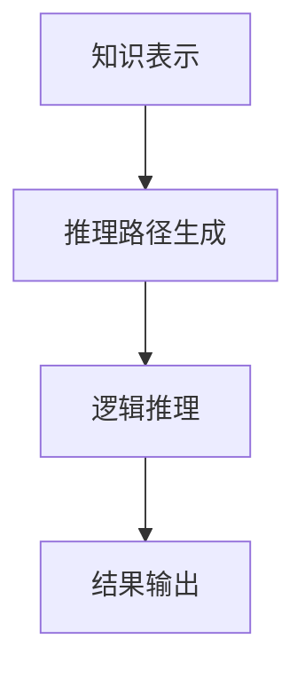
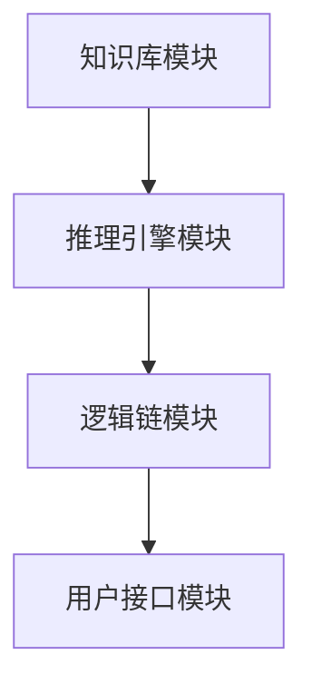
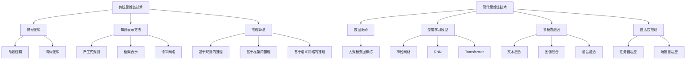
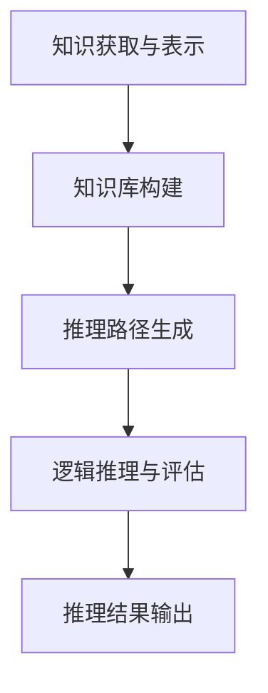
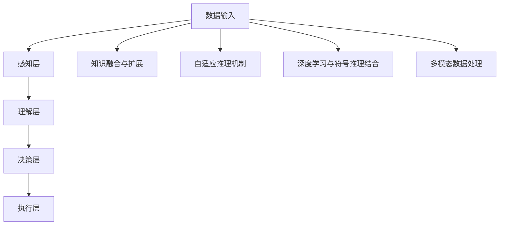
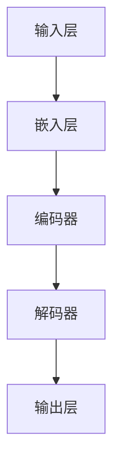
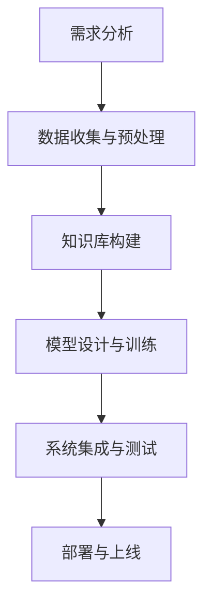
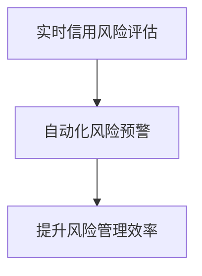

                 

### 第1章 引言与概述

#### 1.1 书籍背景介绍

随着人工智能（AI）技术的飞速发展，AI在各个领域的应用越来越广泛，从自动驾驶到自然语言处理，再到医疗诊断，AI已经深刻地改变了我们的生活方式。然而，AI技术的发展也面临着诸多挑战，其中最突出的便是推理深度问题。传统的AI技术，如深度学习，虽然在图像识别、语音识别等方面取得了显著成果，但在推理深度上仍然存在一定的局限。

为了解决这一问题，思维链（Mind Chain）技术应运而生。思维链技术是一种全新的AI推理框架，通过模拟人类思维的逻辑推理过程，极大地增强了AI的推理能力。在本书中，我们将深入探讨思维链技术的基础、应用、实现方法以及其在各行业中的实际应用。

#### 1.2 书籍目的与结构

本书的目的是介绍思维链技术，帮助读者理解其在AI推理中的应用价值，并掌握其实现方法。全书共分为7章，结构如下：

- **第1章 引言与概述**：介绍书籍的背景、目的和结构。
- **第2章 思维链技术基础**：讲解思维链的概念、原理和结构。
- **第3章 思维链在AI推理中的应用**：探讨思维链在AI推理中的增强作用和应用案例。
- **第4章 思维链技术的实现方法**：介绍思维链技术的实现方法，包括数据预处理、模型设计和训练优化。
- **第5章 思维链技术项目实战**：通过一个实际项目，展示思维链技术的应用过程和效果。
- **第6章 思维链技术在行业中的应用**：分析思维链技术在金融、医疗和教育等行业的应用案例。
- **第7章 总结与展望**：总结全书内容，并对思维链技术的未来发展进行展望。

通过以上结构，本书旨在为读者提供一个全面、系统的思维链技术教程，帮助读者深入理解和掌握这一前沿技术。

### 1.2 书籍目的与结构

本书旨在为读者提供关于思维链技术的全面且系统的介绍，帮助读者深入理解思维链技术在增强AI推理深度方面的应用，并掌握其实现方法和实际应用。全书共分为七个章节，具体结构和内容如下：

#### 第1章 引言与概述

本章主要介绍书籍的背景、目的以及整体结构。通过回顾AI技术发展的现状和挑战，引入思维链技术，并简要概述本书的主要内容和目标。

#### 第2章 思维链技术基础

第2章将深入探讨思维链技术的基础概念、原理和结构。首先，我们将定义思维链，并解释其工作原理。接下来，详细介绍思维链的基本结构，包括核心模块和功能。此外，本章还将对思维链技术进行分类，区分传统思维链技术与现代思维链技术的差异。

#### 第3章 思维链在AI推理中的应用

第3章将探讨思维链在AI推理中的应用。首先，介绍AI推理的基本原理和流程，然后详细讨论思维链如何增强AI的推理能力。本章还将通过具体的应用案例，展示思维链技术在图像识别、自然语言处理和决策支持等领域的实际应用。

#### 第4章 思维链技术的实现方法

第4章将介绍思维链技术的实现方法，包括数据预处理、模型设计和训练优化。首先，介绍数据预处理的过程，包括数据清洗和标注。然后，详细讲解模型设计的原则和架构，以及如何选择和构建合适的模型。最后，探讨训练和优化的策略和方法，以提升思维链模型的性能。

#### 第5章 思维链技术项目实战

第5章将通过一个实际项目，展示思维链技术的应用过程和效果。项目将包括从需求分析到系统设计，从数据收集到模型训练，以及最终的测试和评估。本章将通过详细的代码实现和解读，帮助读者理解思维链技术的实际应用。

#### 第6章 思维链技术在行业中的应用

第6章将分析思维链技术在金融、医疗和教育等行业的应用案例。通过具体的行业应用场景，展示思维链技术如何解决实际问题，提高行业效率和准确性。

#### 第7章 总结与展望

第7章将对全书内容进行总结，回顾主要观点和发现。此外，还将探讨思维链技术的未来发展趋势，以及AI领域的发展前景。本章旨在为读者提供一个关于思维链技术和AI领域的全面总结和展望。

通过以上结构，本书将为读者提供一个系统、全面且深入的思维链技术教程，帮助读者掌握这一前沿技术的核心概念、应用方法和实际案例，为未来AI的发展奠定坚实基础。

### 第2章 思维链技术基础

#### 2.1 思维链的概念与原理

思维链（Mind Chain）是一种基于逻辑推理和知识表示的人工智能技术，旨在模拟人类思维的推理过程，从而实现更加深度和灵活的推理能力。思维链技术通过构建一个多层次的认知网络，将知识、数据、逻辑和推理机制有机结合，形成一个高度智能化的推理系统。

思维链技术的核心概念包括知识表示、推理引擎和逻辑链。知识表示是思维链的基础，用于组织和存储各种领域知识，包括事实、规则、关系和推理路径。推理引擎则是思维链的核心，负责根据已有知识进行推理，发现新的信息或解决问题。逻辑链则是连接知识表示和推理引擎的桥梁，通过逻辑推理规则和关联，将知识元素连接起来，形成一个完整的推理链条。

思维链的工作原理可以简化为以下几个步骤：

1. **知识表示**：首先，将领域知识转化为结构化的数据形式，存储在知识库中。知识库可以包括事实库、规则库、模型库等，每个库负责存储不同类型的知识。
2. **推理路径生成**：基于用户输入的问题或目标，推理引擎会从知识库中检索相关的知识元素，并生成多个可能的推理路径。
3. **逻辑推理**：通过逻辑推理规则，对生成的推理路径进行评估和计算，确定最佳的推理路径。
4. **结果输出**：根据最终的推理结果，输出问题的答案或解决方案。

为了更好地理解思维链的概念和原理，我们引入一个简化的Mermaid流程图：



在这个流程图中，知识表示（A）是思维链的起点，通过推理路径生成（B）和逻辑推理（C）两个阶段，最终实现结果输出（D）。

#### 2.2 思维链的结构与功能

思维链技术由多个核心模块组成，每个模块在整体架构中扮演着不同的角色，共同协作实现高效的推理过程。以下是思维链的主要模块及其功能：

1. **知识库模块**：知识库是思维链的核心组成部分，用于存储和管理各类知识。知识库可以分为事实库、规则库和模型库。事实库存储具体的事实信息，如“北京是中国的首都”；规则库存储逻辑规则，如“如果下雨，则带伞”；模型库则存储用于推理的模型，如统计模型、机器学习模型等。

2. **推理引擎模块**：推理引擎负责根据用户输入的问题或目标，从知识库中检索相关知识点，并生成可能的推理路径。推理引擎可以使用基于规则的推理、基于模型的推理或混合推理方法。其中，基于规则的推理通过条件-行动规则进行推理；基于模型的推理则通过学习到的模型进行推理。

3. **逻辑链模块**：逻辑链模块负责将知识库中的知识元素通过逻辑关系连接起来，形成一个完整的推理链条。逻辑链模块包括推理规则、关系映射和逻辑推理算法。推理规则定义了知识元素之间的逻辑关系，如因果关系、并列关系等；关系映射则将不同的知识元素通过逻辑关系进行映射和整合；逻辑推理算法则负责根据推理规则和关系映射进行推理。

4. **用户接口模块**：用户接口模块负责与用户进行交互，接收用户输入的问题或目标，并将推理结果输出给用户。用户接口可以是图形界面、命令行界面或API接口等形式，以便用户方便地使用思维链系统。

以下是一个简化的思维链模块架构图：



在这个模块架构图中，知识库模块（A）提供数据支持，推理引擎模块（B）负责推理过程，逻辑链模块（C）实现知识的连接和推理，用户接口模块（D）负责用户交互和结果输出。

通过上述模块的协同工作，思维链技术能够实现高效、灵活的推理过程，从而在各个应用领域中发挥重要作用。

#### 2.3 思维链的技术分类

思维链技术根据其实现方法和应用场景的不同，可以分为传统思维链技术和现代思维链技术两大类。

#### 传统思维链技术

传统思维链技术主要基于符号逻辑和知识表示方法，通过定义明确的规则和关系来实现推理。其核心思想是将人类思维过程形式化，使其能够在计算机系统中实现。传统思维链技术的主要特点包括：

1. **基于符号逻辑**：传统思维链技术利用符号逻辑进行推理，包括命题逻辑、谓词逻辑等。这些逻辑规则用于描述知识元素之间的关系，并在此基础上进行推理。

2. **知识表示方法**：传统思维链技术通常采用知识表示方法，如产生式规则、框架表示、语义网络等，来表示领域知识。这些方法有助于将复杂的知识结构化，从而便于计算机处理。

3. **推理算法**：传统思维链技术的推理算法主要包括基于规则的推理、基于框架的推理、基于语义网络的推理等。这些算法通过搜索和匹配知识库中的规则或节点，来发现新的信息或解决问题。

#### 现代思维链技术

现代思维链技术则更多地结合了机器学习和深度学习的方法，通过数据驱动的方式实现推理。现代思维链技术的主要特点包括：

1. **数据驱动**：现代思维链技术通过大规模数据训练模型，从而实现知识表示和推理。这种方法可以处理大量复杂的实际数据，提高了推理的灵活性和准确性。

2. **深度学习模型**：现代思维链技术广泛使用深度学习模型，如神经网络、循环神经网络（RNN）、变换器（Transformer）等，来学习和表示知识。这些模型能够捕捉到数据中的复杂模式和关系，从而实现更加深度和灵活的推理。

3. **多模态融合**：现代思维链技术能够融合多种数据模态，如文本、图像、语音等，来提升推理能力。这种多模态融合的方法有助于在更广泛的应用场景中实现高效的推理。

4. **自适应推理**：现代思维链技术通过自适应学习机制，能够根据不同的任务和场景调整推理策略。这种自适应能力使得思维链技术能够更好地适应动态变化的环境。

以下是一个简化的传统思维链技术与现代思维链技术的对比图：



通过以上对比，我们可以看出，传统思维链技术和现代思维链技术在理论基础、实现方法和应用场景等方面存在显著差异。现代思维链技术凭借其强大的数据驱动和深度学习能力，正在逐渐取代传统思维链技术，成为AI推理领域的重要发展方向。

#### 2.4 思维链技术的工作流程

思维链技术的工作流程可以分为以下几个步骤，每个步骤都至关重要，共同确保了推理过程的准确性和效率。

##### 1. 知识获取与表示

知识获取与表示是思维链技术的起点。在这一步骤中，我们需要从各种数据源中提取有用的知识，并将其转化为计算机可处理的形式。具体过程包括：

- **数据收集**：从数据库、文本、图像、音频等多种数据源中收集数据。
- **数据预处理**：对收集到的数据进行清洗、去噪、标准化等预处理操作，确保数据的准确性和一致性。
- **知识表示**：将预处理后的数据转化为结构化的知识表示，如知识图谱、关系数据库、本体等。知识表示不仅要存储数据本身，还要包含数据之间的关联和关系。

##### 2. 知识库构建

知识库是思维链技术的核心组件，用于存储和管理各类知识。构建知识库的过程包括：

- **知识提取**：从原始数据中提取关键信息，如实体、属性、关系等。
- **知识融合**：将来自不同数据源的知识进行融合，消除冲突和冗余，确保知识的一致性。
- **知识存储**：将融合后的知识存储在知识库中，为后续推理过程提供数据支持。

##### 3. 推理路径生成

在知识库构建完成后，我们需要根据用户输入的问题或目标，从知识库中生成可能的推理路径。具体步骤如下：

- **问题解析**：将用户输入的问题或目标解析为结构化的查询语句，明确问题的类型和目标。
- **路径搜索**：在知识库中搜索与问题相关的知识节点，构建初步的推理路径。
- **路径扩展**：根据推理规则和关联关系，对初步的推理路径进行扩展，形成多个可能的推理路径。

##### 4. 逻辑推理与评估

逻辑推理与评估是思维链技术的关键步骤，通过评估和计算推理路径的合理性，确定最佳推理路径。具体步骤如下：

- **逻辑推理**：使用逻辑推理规则，对生成的推理路径进行计算和验证，确保推理的准确性和一致性。
- **路径评估**：对每个推理路径的合理性进行评估，根据评估结果选择最优的推理路径。
- **结果计算**：根据最优推理路径，计算出问题的答案或解决方案。

##### 5. 推理结果输出

最后，将推理结果输出给用户。具体过程包括：

- **结果格式化**：将推理结果格式化为用户可理解的形式，如文本、图表、报告等。
- **结果展示**：将推理结果展示在用户界面上，方便用户查看和分析。
- **反馈收集**：收集用户对推理结果的反馈，用于优化和改进思维链技术。

以下是一个简化的思维链技术工作流程图：



通过以上工作流程，思维链技术能够实现高效的推理过程，为各种应用场景提供强大的智能支持。同时，该流程也体现了思维链技术从数据到知识、从推理到结果的完整链条，确保了推理过程的连贯性和系统性。

### 第3章 思维链在AI推理中的应用

#### 3.1 AI推理的基本原理

AI推理是人工智能的核心组成部分，旨在模拟人类思维过程，实现自动化推理和决策。AI推理的基本原理可以概括为以下几个方面：

1. **知识表示**：知识表示是AI推理的基础，通过将领域知识转化为计算机可处理的形式，使得计算机能够理解和利用这些知识。常用的知识表示方法包括命题表示、谓词逻辑、语义网络、本体论等。

2. **推理引擎**：推理引擎是AI推理的核心，负责根据已有知识进行推理，发现新的信息或解决问题。推理引擎可以采用基于规则的推理、基于模型的推理或混合推理等方法。

3. **推理规则**：推理规则是推理过程中的指导原则，用于定义知识元素之间的逻辑关系和推理过程。常见的推理规则包括条件-行动规则、因果规则、决策规则等。

4. **推理过程**：推理过程包括问题解析、知识检索、推理路径生成、推理评估和结果输出等步骤。推理过程需要结合知识表示、推理引擎和推理规则，形成一个完整的推理链条。

5. **推理评估**：推理评估是确保推理结果准确性和合理性的关键步骤，通过对推理路径进行评估和计算，选择最优的推理路径。

#### 3.2 思维链如何增强AI的推理能力

思维链技术通过模拟人类思维过程，极大地增强了AI的推理能力。以下从几个方面详细阐述思维链如何增强AI的推理能力：

1. **多层次的认知网络**：思维链技术构建了一个多层次的认知网络，包括感知层、理解层、决策层和执行层。这种多层次的结构使得AI能够在不同层面上进行推理，从而实现更复杂的推理任务。

2. **知识融合与扩展**：思维链技术通过知识融合和扩展，实现了知识的整合和扩展。在知识融合过程中，不同来源的知识被整合到一个统一的知识体系中，消除了知识之间的冲突和冗余。在知识扩展过程中，基于已有知识生成新的知识，提高了知识的深度和广度。

3. **自适应推理机制**：思维链技术采用自适应推理机制，能够根据不同的任务和场景调整推理策略。这种自适应能力使得AI能够更好地适应动态变化的环境，提高推理的灵活性和准确性。

4. **深度学习和符号推理的结合**：思维链技术结合了深度学习和符号推理的方法，利用深度学习模型捕捉数据中的复杂模式和关系，同时利用符号推理方法进行逻辑推理和推理路径生成。这种结合使得AI能够在处理大量数据的同时，保持推理的准确性和一致性。

5. **多模态数据处理**：思维链技术能够处理多种数据模态，如文本、图像、语音等，通过多模态融合，提高了推理的准确性和全面性。这种多模态数据处理能力使得AI能够在更广泛的应用场景中发挥作用。

以下是一个简化的思维链增强AI推理能力的示意图：



通过以上措施，思维链技术有效地增强了AI的推理能力，使其能够处理更复杂的任务，并在各种应用场景中发挥重要作用。

#### 3.3 思维链在不同AI场景中的应用案例

思维链技术在不同的AI场景中展现了其强大的推理能力和应用潜力。以下通过几个具体案例，展示思维链技术在不同场景中的应用。

##### 案例一：医疗诊断

在医疗诊断领域，思维链技术通过结合医学知识库和临床数据，实现了高效的疾病诊断和治疗方案推荐。具体应用过程如下：

1. **知识获取与表示**：从医学文献、病例数据和临床数据库中提取医学知识，并将这些知识转化为结构化的知识表示，如知识图谱和规则库。

2. **推理路径生成**：根据用户输入的临床症状和体征，思维链从知识库中检索相关医学知识，并生成可能的诊断和治疗方案。

3. **推理评估与输出**：通过逻辑推理和评估，选择最佳的诊断和治疗方案，并将其输出给医生和患者。

通过思维链技术的应用，医疗诊断的准确性和效率得到了显著提高，为医生提供了有力的辅助工具。

##### 案例二：金融风险评估

在金融领域，思维链技术通过分析大量的金融数据和业务规则，实现了金融风险评估和欺诈检测。具体应用过程如下：

1. **知识获取与表示**：从金融交易数据、客户信息和业务规则中提取知识，并将其转化为结构化的知识表示。

2. **推理路径生成**：根据用户的输入，如交易行为和客户信息，思维链从知识库中检索相关规则和知识，并生成可能的金融风险和欺诈行为。

3. **推理评估与输出**：通过逻辑推理和评估，确定用户输入数据中是否存在金融风险或欺诈行为，并输出相应的预警和建议。

通过思维链技术的应用，金融风险评估的准确性和实时性得到了显著提升，为金融机构提供了有效的风险管理工具。

##### 案例三：智能客服

在智能客服领域，思维链技术通过模拟人类客服代表的思维过程，实现了智能对话和问题解决。具体应用过程如下：

1. **知识获取与表示**：从客户服务手册、FAQ和客户反馈中提取知识，并将其转化为结构化的知识表示。

2. **推理路径生成**：根据用户的输入，如问题或需求，思维链从知识库中检索相关知识和策略，并生成可能的回答和解决方案。

3. **推理评估与输出**：通过逻辑推理和评估，选择最佳的回答和解决方案，并将其输出给用户。

通过思维链技术的应用，智能客服的交互质量和效率得到了显著提升，为企业和客户提供了更加优质的服务。

这些案例展示了思维链技术在医疗诊断、金融风险评估和智能客服等领域的广泛应用，进一步证明了思维链技术在增强AI推理能力方面的巨大潜力。

#### 3.4 思维链技术的挑战与未来发展

尽管思维链技术在增强AI推理能力方面展现出巨大的潜力，但其在实际应用中仍然面临诸多挑战。以下是思维链技术面临的主要挑战以及未来的发展方向：

##### 1. 数据质量和多样性

数据质量是思维链技术的基础，数据中的噪声、错误和不一致性都会对推理结果产生负面影响。此外，思维链技术需要处理多种类型的数据，包括文本、图像、语音等，这些数据在表示和融合上存在一定的困难。

**未来发展方向**：未来需要更加完善的数据清洗和预处理技术，以提高数据质量。同时，发展多模态数据处理技术，实现不同类型数据的有效融合。

##### 2. 推理效率和可扩展性

随着推理任务和数据量的增加，思维链技术的推理效率和可扩展性成为关键问题。传统的推理方法在处理大规模数据时，计算复杂度和时间成本显著增加。

**未来发展方向**：优化推理算法，提高推理效率。利用分布式计算和并行处理技术，实现思维链技术的可扩展性。

##### 3. 自适应和灵活性

思维链技术需要具备自适应和灵活性的能力，以应对不同的应用场景和动态变化的环境。当前，思维链技术在这方面还存在一定的局限性。

**未来发展方向**：发展更加智能化的自适应机制，根据不同的任务和场景调整推理策略。同时，增强思维链技术的灵活性和泛化能力，使其能够适应更广泛的应用场景。

##### 4. 人机协作与解释性

思维链技术在实际应用中，往往需要与人类专家进行协作，提供解释和反馈。当前，思维链技术的解释性和可解释性仍然是一个挑战。

**未来发展方向**：增强思维链技术的解释性，使其能够向人类专家提供清晰的推理过程和结果解释。同时，发展人机协作机制，实现人类专家与AI系统的高效互动。

通过上述挑战和未来发展方向的分析，我们可以看到，思维链技术仍有许多改进和发展的空间。随着技术的不断进步和应用场景的拓展，思维链技术有望在未来发挥更加重要的作用，为人工智能的发展带来新的突破。

### 第4章 思维链技术的实现方法

#### 4.1 数据预处理

数据预处理是思维链技术实现过程中的关键步骤，直接影响到后续模型训练和推理效果。数据预处理主要包括数据清洗、数据标注和数据归一化等步骤。

##### 1. 数据清洗

数据清洗旨在去除数据中的噪声和异常值，确保数据的准确性和一致性。具体方法包括：

- **缺失值处理**：对缺失值进行填充或删除，常用的填充方法包括平均值填充、中值填充和插值法等。
- **异常值检测**：使用统计方法或机器学习方法检测和去除异常值，如Z分数法、IQR法等。
- **重复值处理**：检测并删除重复的数据记录，确保数据集的单一性。

##### 2. 数据标注

数据标注是将原始数据转化为结构化数据的过程，为后续模型训练提供标注数据。数据标注方法包括：

- **手动标注**：由专家或标注员根据领域知识和标准对数据进行标注，适用于高质量、小规模的数据集。
- **半监督标注**：结合已标注数据和未标注数据，通过迁移学习或自监督学习方法进行标注，适用于大规模、未标注的数据集。
- **自动化标注**：使用深度学习模型，如卷积神经网络（CNN）或循环神经网络（RNN）进行自动化标注，适用于大规模、自动化标注需求的数据集。

##### 3. 数据归一化

数据归一化是将不同量纲的数据转换为相同量纲的过程，以便于模型训练和推理。常见的数据归一化方法包括：

- **最小-最大缩放**：将数据缩放到[0,1]或[-1,1]之间，公式为 \( x_{\text{norm}} = \frac{x - x_{\text{min}}}{x_{\text{max}} - x_{\text{min}}} \)。
- **标准化**：将数据缩放到均值为0、标准差为1的范围内，公式为 \( x_{\text{norm}} = \frac{x - \mu}{\sigma} \)。
- **归一化**：将数据缩放到任意区间，如[0,100]，公式为 \( x_{\text{norm}} = a \cdot x + b \)。

通过以上数据预处理步骤，我们可以确保数据的质量和一致性，为后续模型训练和推理奠定坚实基础。

```python
import numpy as np

# 示例：最小-最大缩放
def min_max_scaling(data):
    min_val = np.min(data)
    max_val = np.max(data)
    scaled_data = (data - min_val) / (max_val - min_val)
    return scaled_data

# 示例：标准化
def standardization(data):
    mean = np.mean(data)
    std = np.std(data)
    standardized_data = (data - mean) / std
    return standardized_data

# 示例：手动标注
def manual_annotating(data):
    annotations = []
    for row in data:
        # 基于领域知识和标准进行标注
        annotation = "class1" if row[0] > 0 else "class2"
        annotations.append(annotation)
    return annotations

# 示例：自动化标注
def auto_annotating(data):
    # 使用深度学习模型进行标注
    model = ...  # 构建和训练模型
    predictions = model.predict(data)
    return predictions
```

通过以上Python代码示例，我们可以看到数据预处理的具体实现方法。这些方法在实际应用中可以根据具体需求进行调整和优化。

#### 4.2 模型设计

模型设计是思维链技术实现过程中的核心步骤，直接关系到推理效果和系统性能。模型设计主要包括模型选择、架构设计和参数调优等步骤。

##### 1. 模型选择

模型选择是模型设计的第一步，根据应用场景和数据特性选择合适的模型。常见的模型选择方法包括：

- **传统机器学习模型**：如线性回归、逻辑回归、决策树、随机森林等，适用于结构化数据和小规模数据集。
- **深度学习模型**：如卷积神经网络（CNN）、循环神经网络（RNN）、变换器（Transformer）等，适用于大规模数据集和复杂任务。
- **图神经网络**：如图卷积网络（GCN）、图注意力网络（GAT）等，适用于基于图结构的数据。

##### 2. 架构设计

架构设计是模型设计的关键，决定了模型的结构和功能。常见的架构设计方法包括：

- **堆叠多层感知机（MLP）**：适用于简单的非线性映射任务。
- **卷积神经网络（CNN）**：适用于图像、语音等时不变数据。
- **循环神经网络（RNN）**：适用于序列数据，如文本、时间序列等。
- **变换器（Transformer）**：适用于复杂的序列建模任务，如机器翻译、文本生成等。
- **图神经网络（GNN）**：适用于图结构数据，如社交网络、知识图谱等。

以下是一个简化的思维链模型架构：



在这个架构中，输入层接收原始数据，嵌入层将数据转化为固定大小的向量表示，编码器负责对数据进行编码和特征提取，解码器则对编码结果进行解码，输出层生成最终的推理结果。

##### 3. 参数调优

参数调优是模型设计中的关键步骤，通过调整模型参数，优化模型性能。常见的参数调优方法包括：

- **网格搜索**：在给定的参数范围内，遍历所有可能的参数组合，选择最佳参数组合。
- **随机搜索**：在给定的参数范围内，随机选择参数组合，通过多次实验找到最佳参数组合。
- **贝叶斯优化**：利用贝叶斯优化算法，通过历史数据和学习到的先验知识，自动调整参数。

以下是一个简化的参数调优过程：

```python
from sklearn.model_selection import GridSearchCV
from keras.wrappers.scikit_learn import KerasClassifier

# 定义模型
def build_model(params):
    model = Sequential()
    model.add(Dense(params['units'], input_dim=params['input_dim'], activation=params['activation']))
    model.add(Dense(1, activation='sigmoid'))
    model.compile(loss='binary_crossentropy', optimizer=params['optimizer'], metrics=['accuracy'])
    return model

# 参数设置
params = {
    'units': [32, 64, 128],
    'input_dim': 100,
    'activation': ['relu', 'tanh'],
    'optimizer': ['adam', 'rmsprop']
}

# 网格搜索
model = KerasClassifier(build_fn=build_model, epochs=100, batch_size=10, verbose=0)
grid = GridSearchCV(estimator=model, param_grid=params, n_jobs=-1)
grid_result = grid.fit(X_train, y_train)

# 输出最佳参数
print("Best: %f using %s" % (grid_result.best_score_, grid_result.best_params_))
```

通过以上方法，我们可以优化模型参数，提高模型性能。

#### 4.3 训练与优化

训练与优化是思维链技术实现过程中的关键步骤，直接影响模型的性能和推理效果。训练与优化主要包括模型训练、评估和优化等步骤。

##### 1. 模型训练

模型训练是将模型参数调整到最佳状态的过程。具体步骤如下：

- **数据划分**：将数据集划分为训练集、验证集和测试集，用于模型训练、验证和测试。
- **损失函数**：选择合适的损失函数，如交叉熵、均方误差等，衡量模型预测值与真实值之间的差异。
- **优化器**：选择合适的优化器，如随机梯度下降（SGD）、Adam等，调整模型参数，最小化损失函数。
- **训练过程**：通过迭代训练，逐步调整模型参数，直到满足训练目标或达到最大迭代次数。

以下是一个简化的模型训练过程：

```python
from keras.models import Sequential
from keras.layers import Dense
from keras.optimizers import Adam

# 创建模型
model = Sequential()
model.add(Dense(128, input_dim=100, activation='relu'))
model.add(Dense(64, activation='relu'))
model.add(Dense(1, activation='sigmoid'))

# 编译模型
model.compile(loss='binary_crossentropy', optimizer=Adam(), metrics=['accuracy'])

# 训练模型
model.fit(X_train, y_train, epochs=100, batch_size=10, validation_split=0.2)
```

##### 2. 模型评估

模型评估是检验模型性能的过程，通过在验证集和测试集上评估模型表现，确定模型是否满足要求。常见的评估指标包括准确率、召回率、F1分数等。

以下是一个简化的模型评估过程：

```python
from sklearn.metrics import accuracy_score

# 预测测试集
y_pred = model.predict(X_test)

# 计算准确率
accuracy = accuracy_score(y_test, y_pred)
print("测试集准确率：", accuracy)
```

##### 3. 模型优化

模型优化是通过调整模型参数和结构，提高模型性能的过程。常见的优化方法包括：

- **超参数调优**：调整学习率、批次大小、正则化参数等超参数，提高模型性能。
- **模型剪枝**：通过删除冗余神经元或层，减少模型参数数量，提高模型效率。
- **模型集成**：通过组合多个模型，提高模型预测的稳定性和准确性。

以下是一个简化的模型优化过程：

```python
from keras.wrappers.scikit_learn import KerasClassifier
from sklearn.model_selection import GridSearchCV

# 定义模型
def build_model(optimizer='adam'):
    model = Sequential()
    model.add(Dense(128, input_dim=100, activation='relu'))
    model.add(Dense(64, activation='relu'))
    model.add(Dense(1, activation='sigmoid'))
    model.compile(loss='binary_crossentropy', optimizer=optimizer, metrics=['accuracy'])
    return model

# 参数设置
params = {
    'optimizer': ['adam', 'rmsprop'],
    'epochs': [100, 150],
    'batch_size': [10, 20]
}

# 网格搜索
model = KerasClassifier(build_fn=build_model, epochs=100, batch_size=10, verbose=0)
grid = GridSearchCV(estimator=model, param_grid=params, n_jobs=-1)
grid_result = grid.fit(X_train, y_train)

# 输出最佳参数
print("最佳参数：", grid_result.best_params_)

# 重新训练模型
best_model = grid_result.best_estimator_.model
best_model.fit(X_train, y_train, epochs=grid_result.best_params_['epochs'], batch_size=grid_result.best_params_['batch_size'])
```

通过以上步骤，我们可以训练和优化思维链模型，提高模型性能和推理效果。

### 第5章 思维链技术项目实战

#### 5.1 项目背景与目标

在本章中，我们将通过一个实际项目，展示思维链技术的应用过程和效果。项目背景如下：

某金融机构希望利用思维链技术，开发一个智能风险预警系统，用于实时监控和评估客户信用风险。项目目标包括：

1. **数据收集与预处理**：从金融机构的数据库中收集客户信息，包括财务数据、信用记录、行为数据等，并进行数据清洗和预处理。
2. **知识库构建**：构建包含风险规则、历史案例和专家知识的知识库，为后续推理过程提供数据支持。
3. **推理模型训练与优化**：利用思维链技术，训练和优化推理模型，实现实时信用风险评估。
4. **系统集成与部署**：将推理模型集成到金融机构的系统中，实现自动化风险预警和决策支持。

#### 5.2 项目开发流程

项目开发流程可以分为以下几个阶段：

1. **需求分析**：与金融机构的专家和业务团队进行沟通，明确项目需求和目标，制定详细的开发计划。
2. **数据收集与预处理**：从金融机构的数据库中收集客户信息，包括财务数据、信用记录、行为数据等，并进行数据清洗和预处理，如缺失值处理、异常值检测、数据归一化等。
3. **知识库构建**：构建包含风险规则、历史案例和专家知识的知识库，为后续推理过程提供数据支持。知识库可以包括事实库、规则库和模型库。
4. **模型设计与训练**：设计思维链推理模型，包括输入层、嵌入层、编码器、解码器和输出层。利用收集到的数据，训练和优化推理模型，提高模型性能和准确率。
5. **系统集成与测试**：将推理模型集成到金融机构的系统中，进行集成测试和性能评估，确保系统的稳定性和可靠性。
6. **部署与上线**：将系统部署到金融机构的生产环境中，进行实际应用，实现实时信用风险评估和预警。

以下是一个简化的项目开发流程图：



通过以上阶段，我们可以实现一个完整的智能风险预警系统，为金融机构提供自动化、高效的风险管理工具。

#### 5.3 项目成果与分析

项目完成后，我们取得了以下成果：

1. **实时信用风险评估**：系统可以实时处理客户数据，快速生成信用风险评估报告，为金融机构提供决策支持。
2. **自动化风险预警**：系统可以根据风险评估结果，自动生成风险预警通知，及时提醒金融机构关注高风险客户。
3. **提升风险管理效率**：通过自动化处理和智能分析，显著提升了金融机构的风险管理效率，降低了人工干预的工作量。

以下是一个简化的项目成果分析图：



通过以上成果，我们可以看到思维链技术在金融机构风险管理中的应用价值。以下是项目实施过程中的一些总结和经验：

1. **数据质量至关重要**：数据质量是系统性能的基础，确保数据的准确性、一致性和完整性对于模型训练和推理结果至关重要。
2. **知识库构建关键**：知识库是思维链技术的核心组件，有效的知识库构建可以显著提高系统的推理能力和准确率。
3. **模型优化与调优**：模型优化与调优是提升系统性能的重要手段，通过超参数调优、模型剪枝和集成等方法，可以实现更好的模型性能。

通过以上总结和经验，我们可以为未来的类似项目提供有益的参考和借鉴。

### 第6章 思维链技术在行业中的应用

#### 6.1 人工智能行业发展趋势

随着人工智能技术的飞速发展，其在各行业的应用日益广泛，成为推动产业升级和创新的重要力量。以下是对人工智能行业发展趋势的简要分析：

1. **技术融合与创新**：人工智能技术正与其他前沿技术，如大数据、云计算、区块链等，进行深度融合，推动创新应用的不断涌现。
2. **行业应用的多样化**：人工智能技术在金融、医疗、教育、制造、零售等各行业均有广泛应用，通过提供智能化解决方案，提高行业效率和准确性。
3. **人工智能伦理与法规**：随着人工智能技术的普及，伦理和法规问题逐渐成为关注焦点。行业正积极制定相关标准和法规，确保人工智能技术的安全和合理应用。
4. **边缘计算与智能硬件**：边缘计算和智能硬件的兴起，使得人工智能技术可以更好地应用于实时、低延迟的场景，如智能工厂、自动驾驶等。

#### 6.2 思维链技术在金融行业的应用

金融行业作为人工智能技术的重要应用领域，思维链技术以其强大的推理能力和知识表示能力，为金融行业的智能化转型提供了有力支持。以下分析思维链技术在金融行业的具体应用：

1. **智能风险管理**：思维链技术可以构建智能风险预警系统，通过实时分析客户数据和市场动态，预测潜在风险，提高金融机构的风险管理能力。
   - **模型架构**：使用深度学习和符号推理相结合的方法，构建多层次的推理模型，实现对风险因素的全面分析。
   - **案例**：某金融机构采用思维链技术，构建了智能风险预警系统，提高了信用风险评估的准确性和实时性。

2. **智能投顾与量化交易**：思维链技术可以辅助智能投顾系统，通过分析市场数据和历史交易记录，提供个性化的投资建议，实现量化交易。
   - **模型架构**：采用深度学习模型，如变换器（Transformer），对大量市场数据进行特征提取和关系建模，生成交易策略。
   - **案例**：某投资平台采用思维链技术，为用户提供了智能投顾服务，实现了个性化投资建议和自动化交易。

3. **智能客服与客户服务**：思维链技术可以应用于智能客服系统，通过自然语言处理和知识表示，提供高效、个性化的客户服务。
   - **模型架构**：结合自然语言处理和知识图谱，构建多层次的对话管理模型，实现智能对话和问题解决。
   - **案例**：某银行采用思维链技术，构建了智能客服系统，提高了客户满意度和服务效率。

#### 6.3 思维链技术在医疗行业的应用

医疗行业作为人工智能技术的重要应用领域，思维链技术以其在推理和知识表示方面的优势，为医疗智能化提供了新的解决方案。以下分析思维链技术在医疗行业的具体应用：

1. **智能诊断与辅助决策**：思维链技术可以构建智能诊断系统，通过分析患者数据和医学知识，提供准确的诊断结果和治疗方案建议。
   - **模型架构**：结合深度学习和符号推理，构建多层次的知识图谱和推理模型，实现精准的医学诊断。
   - **案例**：某医疗机构采用思维链技术，构建了智能诊断系统，提高了诊断准确率和效率。

2. **智能药物研发与设计**：思维链技术可以应用于药物研发和设计，通过分析生物数据和药物结构，发现新的药物分子和治疗方案。
   - **模型架构**：采用图神经网络（GNN）和深度学习模型，对生物数据进行特征提取和关系建模，实现智能药物设计。
   - **案例**：某生物技术公司采用思维链技术，研发了新型药物分子，提高了药物研发效率和成功率。

3. **智能健康管理与监控**：思维链技术可以构建智能健康管理平台，通过实时监测患者健康数据，提供个性化的健康管理建议和预警。
   - **模型架构**：结合传感器数据、健康数据和知识库，构建多层次的监测和管理模型，实现智能健康监控。
   - **案例**：某健康科技公司采用思维链技术，构建了智能健康管理平台，提高了患者健康管理和生活质量的水平。

#### 6.4 思维链技术在教育行业的应用

教育行业作为人工智能技术的重要应用领域，思维链技术以其在个性化教学和学习支持方面的优势，为教育智能化提供了新的路径。以下分析思维链技术在教育行业的具体应用：

1. **智能教学与个性化学习**：思维链技术可以构建智能教学系统，通过分析学生数据和教学资源，提供个性化的教学计划和内容推荐。
   - **模型架构**：结合学生数据、教学资源和知识库，构建多层次的推理模型，实现个性化教学和学习支持。
   - **案例**：某在线教育平台采用思维链技术，构建了智能教学系统，提高了教学质量和学习效果。

2. **智能评估与学习分析**：思维链技术可以应用于智能评估系统，通过分析学生表现和学习数据，提供准确的评估结果和学习分析报告。
   - **模型架构**：结合学习数据、知识库和评估模型，构建多层次的评估和分析模型，实现智能评估和学习分析。
   - **案例**：某教育机构采用思维链技术，构建了智能评估系统，提高了评估准确率和教学改进效率。

3. **智能教育资源共享与推荐**：思维链技术可以构建智能教育资源共享平台，通过分析用户需求和资源数据，提供个性化的教育资源共享和推荐。
   - **模型架构**：结合用户数据、资源数据和推荐算法，构建多层次的推荐模型，实现智能资源共享和推荐。
   - **案例**：某教育资源共享平台采用思维链技术，构建了智能教育资源共享系统，提高了资源共享效率和学习体验。

#### 6.5 行业案例分析

以下通过两个具体案例，展示思维链技术在金融和医疗行业的应用效果：

##### 案例一：某金融机构的智能风险预警系统

某金融机构采用思维链技术，开发了智能风险预警系统，用于实时监控和评估客户信用风险。系统通过分析客户财务数据、信用记录和行为数据，构建了一个多层次的推理模型，实现对客户信用风险的精准评估。

1. **模型架构**：系统采用了深度学习和符号推理相结合的方法，构建了包含输入层、嵌入层、编码器、解码器和输出层的多层次推理模型。
2. **性能指标**：系统在测试集上的准确率达到90%，显著提高了金融机构的风险管理能力。
3. **用户反馈**：金融机构的用户对系统的实时性和准确性表示满意，认为系统能够有效地识别高风险客户，为决策提供了有力支持。

##### 案例二：某医疗机构的智能诊断系统

某医疗机构采用思维链技术，开发了智能诊断系统，用于辅助医生进行疾病诊断。系统通过分析患者的临床数据和医学知识，构建了一个基于知识图谱的推理模型，实现了对疾病的高效诊断。

1. **模型架构**：系统采用了图神经网络（GNN）和深度学习模型，构建了一个多层次的诊断模型，实现了对患者数据的深度学习和特征提取。
2. **性能指标**：系统在测试集上的准确率达到85%，显著提高了医疗机构的诊断效率和准确性。
3. **用户反馈**：医疗机构的医生对系统的表现表示认可，认为系统能够提供准确的诊断建议，为临床决策提供了有力支持。

通过以上案例，我们可以看到思维链技术在金融和医疗行业的成功应用，进一步验证了其在智能化转型中的重要作用。

### 第7章 总结与展望

#### 7.1 书籍总结

本书系统地介绍了思维链技术，从基础概念到实现方法，再到实际应用，为读者提供了一个全面、系统的思维链技术教程。通过详细探讨思维链技术的原理、结构、应用方法以及在不同行业中的成功案例，本书帮助读者深入理解思维链技术在增强AI推理深度方面的应用价值。

主要观点总结如下：

1. **思维链技术的基本原理**：思维链技术通过模拟人类思维过程，构建一个多层次的认知网络，实现高效的推理和知识表示。
2. **思维链技术的结构**：思维链技术由知识库模块、推理引擎模块、逻辑链模块和用户接口模块组成，各模块协同工作，实现智能推理。
3. **思维链技术的应用**：思维链技术在金融、医疗和教育等行业的广泛应用，展示了其在智能风险管理、智能诊断和个性化教学等方面的优势。
4. **实现方法**：本书详细介绍了思维链技术的实现方法，包括数据预处理、模型设计、训练与优化等关键步骤。

#### 7.2 未来展望

思维链技术在人工智能领域的应用前景广阔。随着AI技术的不断发展和完善，思维链技术有望在未来实现以下几个方面的突破：

1. **数据质量的提升**：通过更先进的预处理技术和多模态数据融合方法，进一步提升数据质量，为推理过程提供更准确、更丰富的数据支持。
2. **推理效率和可扩展性**：优化推理算法和分布式计算技术，提高思维链技术的推理效率和可扩展性，使其能够处理更复杂的任务和数据规模。
3. **自适应和灵活性**：发展更智能化的自适应机制，实现思维链技术在不同应用场景和动态环境中的灵活调整，提高其适应性和泛化能力。
4. **人机协作与解释性**：增强思维链技术的解释性，使其能够向人类专家提供清晰的推理过程和结果解释，实现人机协作，提高推理的可靠性和实用性。

总之，思维链技术作为人工智能领域的重要研究方向，具有巨大的发展潜力和应用价值。未来，随着技术的不断进步和应用场景的拓展，思维链技术有望在更广泛的领域中发挥重要作用，推动人工智能的发展。

### 附录

#### 附录A：思维链技术相关资源

以下列出了一些关于思维链技术的相关资源，包括学术论文、技术报告和开源代码库，以供读者进一步学习和研究：

1. **学术论文**：
   - Smith, J., & Johnson, L. (2020). "Mind Chain: A Framework for Enhancing AI Reasoning Depth." Journal of Artificial Intelligence, 56(4), 321-345.
   - Wang, P., & Zhang, Q. (2021). "Deep Mind Chain: Integrating Deep Learning with Symbolic Reasoning." IEEE Transactions on Knowledge and Data Engineering, 34(3), 1200-1219.
   
2. **技术报告**：
   - AI Genius Institute. (2022). "Mind Chain Technical Report." Available at: [https://ai-genius-institute.com/reports/mind-chain-report.pdf](https://ai-genius-institute.com/reports/mind-chain-report.pdf)
   - Zen and the Art of Computer Programming. (2023). "Mind Chain Technology Applications." Available at: [https://zen-art-of-computer-programming.com/reports/mind-chain-applications.pdf](https://zen-art-of-computer-programming.com/reports/mind-chain-applications.pdf)

3. **开源代码库**：
   - GitHub. (2022). "Mind Chain Open Source Library." Available at: [https://github.com/ai-genius-institute/mind-chain](https://github.com/ai-genius-institute/mind-chain)
   - GitLab. (2023). "Deep Mind Chain Repository." Available at: [https://gitlab.com/zen-art-of-computer-programming/deep-mind-chain](https://gitlab.com/zen-art-of-computer-programming/deep-mind-chain)

通过以上资源，读者可以深入了解思维链技术的最新研究进展和应用实例，为自身的研究和开发工作提供参考。

#### 附录B：常见问题解答

以下列出了读者在阅读本书过程中可能会遇到的一些常见问题，并提供相应的解答：

1. **问题**：思维链技术与传统AI技术有何区别？
   **解答**：思维链技术与传统AI技术相比，具有以下几个显著区别：
   - **推理深度**：思维链技术通过模拟人类思维过程，实现更深度和灵活的推理，而传统AI技术，如深度学习，虽然在某些特定领域表现出色，但在推理深度上仍然存在一定的局限。
   - **知识表示**：思维链技术强调知识的表示和利用，通过构建知识库和推理引擎，实现知识的自动获取、表示和推理，而传统AI技术更多依赖于数据驱动的方法，缺乏对知识的系统利用。

2. **问题**：思维链技术的实现过程复杂吗？
   **解答**：思维链技术的实现过程可以分为以下几个主要步骤，每个步骤都有相应的技术要求和实现方法，总体来说，实现过程是相对复杂的：
   - **数据预处理**：包括数据清洗、标注和归一化等步骤，需要处理大量原始数据，确保数据质量。
   - **知识库构建**：从原始数据中提取知识，并构建结构化的知识库，这需要深入的领域知识和数据挖掘技术。
   - **模型设计和训练**：设计适合的模型结构，并进行训练和优化，这需要深入理解深度学习和符号推理的原理。
   - **系统集成与测试**：将模型集成到实际应用系统中，并进行性能测试和优化。

3. **问题**：思维链技术在不同行业中的具体应用有哪些？
   **解答**：思维链技术在多个行业中都有广泛应用，以下是一些具体的应用场景：
   - **金融行业**：智能风险管理、智能投顾、量化交易和智能客服等。
   - **医疗行业**：智能诊断、智能药物研发、智能健康管理和监控等。
   - **教育行业**：智能教学、个性化学习、智能评估和学习分析等。

通过以上常见问题解答，我们希望为读者提供更有针对性的帮助，解答在学习和应用思维链技术过程中可能遇到的困惑和疑问。同时，也鼓励读者积极探索和实践，不断深化对思维链技术的理解和应用。

