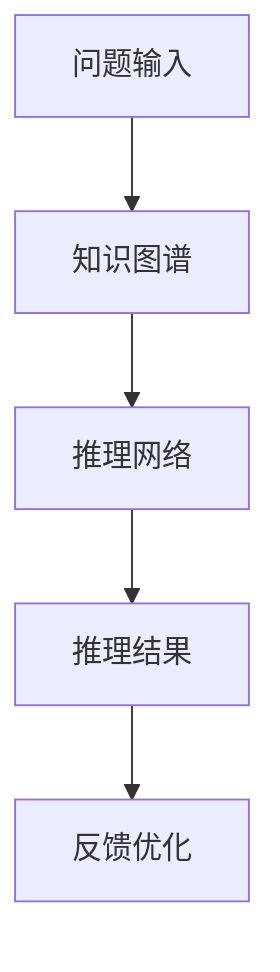

                 

### 引言

在人工智能（AI）飞速发展的时代，问题解决能力已成为衡量AI系统智能水平的重要指标。然而，传统的AI技术多依赖于大量数据和预训练模型，其在复杂问题解决方面的表现仍显不足。针对这一问题，思维链技术作为一种新兴的方法，应运而生，旨在为AI系统提供更强大、更灵活的问题解决能力。

#### 书籍背景与目的

《思维链技术：增强AI问题解决能力的新途径》旨在为广大AI从业者和研究人员提供一本全面而深入的思维链技术指南。本书的背景源于当前AI领域面临的重大挑战：如何让AI不仅在特定任务上表现优异，更能具备类人的思考能力和问题解决能力。思维链技术通过模拟人类思维过程，使得AI能够进行更为复杂和抽象的逻辑推理，从而大幅提升其问题解决能力。

本书的主要目的是：
1. **介绍思维链技术的核心概念和原理**：包括思维链的定义、架构以及与AI问题的关系。
2. **详细讲解思维链算法**：通过Python源代码展示思维链算法的实现过程，结合数学模型和公式进行详细解释。
3. **提供实际项目实战**：通过开发一个智能客服系统，展示如何在实际项目中应用思维链技术，并对代码进行解读和分析。

#### 思维链技术简介

思维链技术是一种基于图论和神经网络的方法，通过构建知识图谱和推理网络，实现AI系统的自动推理和问题解决。其核心思想是将人类思维过程中的信息处理过程进行模型化和自动化，使得AI系统能够像人类一样进行逻辑推理、抽象思考和问题解决。

思维链技术的关键组成部分包括：

1. **知识图谱**：用于表示领域知识和概念之间的关系。通过知识图谱，AI系统能够获取和处理领域内的信息。
2. **推理网络**：用于模拟人类思维过程中的推理过程。通过推理网络，AI系统能够根据已知信息进行逻辑推理，从而解决复杂问题。
3. **学习机制**：通过训练和优化，思维链技术能够不断提高其推理和问题解决能力。

在接下来的章节中，我们将深入探讨思维链技术的定义、核心算法原理、数学模型，以及如何通过实际项目应用来增强AI问题解决能力。

----------------------------------------------------------------

## 核心概念与联系

### 思维链技术定义

思维链技术（Mind-Chain Technology）是一种模拟人类思维过程的AI方法，旨在提升AI系统的问题解决能力。它通过构建知识图谱和推理网络，实现自动推理和问题解决。思维链技术中的“思维链”是指一系列思维步骤的有序组合，每个步骤都基于已知信息和目标进行逻辑推理和知识扩展。

#### 思维链与AI问题解决能力

思维链技术在AI问题解决中扮演着关键角色，其核心在于提升AI系统的抽象推理能力和问题解决能力。传统AI系统往往依赖于大数据和预训练模型，但在面对复杂问题时，其表现仍然有限。而思维链技术通过模拟人类思维过程，使得AI系统能够进行更为复杂和抽象的逻辑推理，从而在多种领域实现突破。

思维链技术的基本原理包括：

1. **知识获取**：通过知识图谱获取领域内的知识，为AI系统提供丰富的背景信息。
2. **推理过程**：通过推理网络进行逻辑推理，实现从已知信息到目标信息的推理过程。
3. **学习优化**：通过不断训练和优化，提高思维链技术的推理和问题解决能力。

#### Mermaid流程图展示

为了更好地理解思维链技术的工作流程，我们使用Mermaid语言绘制了一个流程图。以下是一个简单的思维链技术工作流程：



#### Mermaid流程图详细说明：

1. **问题输入**（A）：AI系统接收到一个需要解决的问题。
2. **知识图谱**（B）：AI系统通过知识图谱获取相关的背景知识和信息。
3. **推理网络**（C）：AI系统利用推理网络对问题进行逻辑推理，尝试找到解决方案。
4. **推理结果**（D）：AI系统输出推理结果，即问题的解决方案。
5. **反馈优化**（E）：根据用户反馈，对推理过程进行优化和调整，提高问题的解决能力。

通过这个流程图，我们可以清晰地看到思维链技术如何通过知识获取、推理过程和反馈优化，实现AI问题解决能力的提升。

在接下来的章节中，我们将详细探讨思维链技术的核心算法原理，结合Python源代码和数学模型，展示其实现过程和应用场景。

----------------------------------------------------------------

## 核心算法原理讲解

### 思维链算法概述

思维链技术是一种基于图论和神经网络的AI方法，通过构建知识图谱和推理网络，实现自动推理和问题解决。思维链算法是该技术的核心组成部分，其工作原理包括知识获取、推理过程和反馈优化三个主要阶段。

#### 知识获取

知识获取是思维链算法的第一步，其目的是通过知识图谱获取相关的领域知识和信息。知识图谱是一个结构化的知识库，用于表示实体（如概念、对象等）及其之间的关系。在知识获取阶段，AI系统通过查询知识图谱，获取与问题相关的信息。

```python
# 假设已经构建了知识图谱kg
knowledge_graph = build_knowledge_graph()

# 获取与问题相关的信息
related_info = kg.query(question)
```

#### 推理过程

在知识获取的基础上，推理过程是思维链算法的核心。推理过程通过推理网络，实现对问题的逻辑推理。推理网络是一种基于图神经网络的模型，其节点表示实体，边表示实体之间的关系。推理网络通过训练，能够根据已知信息进行逻辑推理，从而找到问题的解决方案。

```python
# 假设已经构建了推理网络model
inference_model = build_inference_model()

# 使用推理网络进行推理
solution = inference_model推理(related_info)
```

#### 反馈优化

推理结果输出后，思维链算法通过用户反馈进行优化。反馈优化阶段的目标是提高推理的准确性和效率。通过不断调整推理网络的结构和参数，AI系统能够逐渐优化其推理过程，提高问题解决能力。

```python
# 基于用户反馈调整推理网络
adjusted_model = inference_model.optimize(solution, feedback)
```

#### 思维链算法伪代码

以下是一个简化的思维链算法伪代码，展示了其基本实现过程：

```python
function 思维链算法(input_question):
    // 初始化知识图谱和推理网络
    knowledge_graph = 初始化知识图谱()
    inference_model = 初始化推理网络()

    // 获取与问题相关的信息
    related_info = knowledge_graph查询(input_question)

    // 进行推理
    solution = inference_model推理(related_info)

    // 输出推理结果
    return solution

    // 基于用户反馈进行优化
    feedback = 用户反馈(solution)
    inference_model = inference_model优化(feedback)
```

通过以上步骤，思维链算法能够实现问题的自动推理和解决，从而提升AI系统的问题解决能力。在接下来的章节中，我们将详细讨论思维链算法的实现细节，包括Python源代码和数学模型。

### 思维链算法实现细节

为了更好地理解思维链算法的实现过程，我们将结合Python源代码和数学模型，详细阐述其关键步骤。

#### 知识图谱构建

知识图谱是思维链算法的基础，用于存储领域内的知识和信息。构建知识图谱通常涉及以下步骤：

1. **实体识别**：从原始数据中识别出关键的实体，如概念、对象等。
2. **关系抽取**：确定实体之间的关联关系，如“属于”、“具有”等。
3. **图谱构建**：将识别出的实体和关系构建成一个图结构，形成知识图谱。

以下是一个简化的知识图谱构建过程示例：

```python
# 假设使用Python的NetworkX库构建知识图谱
import networkx as nx

# 创建一个空的图
kg = nx.Graph()

# 添加实体
kg.add_node("实体1")
kg.add_node("实体2")

# 添加关系
kg.add_edge("实体1", "实体2", relation="属于")
```

#### 推理网络构建

推理网络是思维链算法的核心，用于实现自动推理。构建推理网络通常涉及以下步骤：

1. **网络结构设计**：设计推理网络的拓扑结构，包括节点和边的表示。
2. **模型训练**：使用已标注的数据集，训练推理网络模型。
3. **模型优化**：通过反馈优化，提高推理网络的性能。

以下是一个简化的推理网络构建示例：

```python
# 假设使用TensorFlow构建推理网络
import tensorflow as tf

# 设计网络结构
input_layer = tf.keras.layers.Input(shape=(input_shape))
hidden_layer = tf.keras.layers.Dense(units=hidden_units, activation='relu')(input_layer)
output_layer = tf.keras.layers.Dense(units=output_shape, activation='softmax')(hidden_layer)

# 构建模型
inference_model = tf.keras.Model(inputs=input_layer, outputs=output_layer)

# 编译模型
inference_model.compile(optimizer='adam', loss='categorical_crossentropy', metrics=['accuracy'])

# 训练模型
inference_model.fit(x_train, y_train, epochs=epochs, batch_size=batch_size)
```

#### 数学模型

思维链算法中的推理过程涉及复杂的数学计算。以下是一个简化的数学模型示例：

```latex
$$
推理结果 = f(\text{输入数据})
$$

其中，\( f \) 是一个函数，用于表示推理过程。输入数据可以是实值向量，函数 \( f \) 可以是神经网络模型。

$$
f(\text{输入数据}) = \sum_{i=1}^{n} w_i \cdot \text{激活函数}(z_i)
$$

其中，\( w_i \) 是权重系数，\( z_i \) 是输入数据的分量，激活函数可以是ReLU、Sigmoid等。

举例：

假设输入数据为 \( \text{输入数据} = [2, 3] \)，权重系数为 \( w_1 = 0.5, w_2 = 0.5 \)，激活函数为ReLU。

$$
f(\text{输入数据}) = 0.5 \cdot \max(2, 0) + 0.5 \cdot \max(3, 0) = 1 + 1.5 = 2.5
$$

即推理结果为2.5。
```

通过上述步骤，我们可以实现思维链算法的核心功能。在接下来的章节中，我们将通过一个实际项目实战，展示如何将思维链技术应用于智能客服系统，并对源代码进行解读和分析。

### 数学模型和数学公式

在思维链技术中，数学模型和数学公式起着至关重要的作用，它们为算法提供了理论基础和计算依据。以下将详细介绍与思维链技术相关的数学模型和数学公式，并结合具体例子进行详细讲解。

#### 数学模型

思维链技术的核心数学模型可以概括为神经网络模型。神经网络模型通过一系列数学公式来描述节点之间的信息传递和计算过程。以下是一个简化的神经网络模型公式：

$$
\text{激活函数} = \sigma(z) = \frac{1}{1 + e^{-z}}
$$

其中，\( z \) 是神经元的输入值，\( \sigma \) 是激活函数，通常采用Sigmoid函数。

此外，神经网络模型还涉及到权重更新和梯度下降等关键概念。以下是神经网络权重更新的公式：

$$
w_{\text{new}} = w_{\text{old}} - \alpha \cdot \frac{\partial J}{\partial w}
$$

其中，\( w \) 是权重系数，\( \alpha \) 是学习率，\( J \) 是损失函数，\( \frac{\partial J}{\partial w} \) 是权重系数的梯度。

#### 举例说明

为了更好地理解上述数学模型，我们通过一个具体的例子来展示神经网络模型的计算过程。

假设有一个简单的神经网络，其输入层有两个神经元，隐藏层有一个神经元，输出层有一个神经元。输入数据为 \( [2, 3] \)，权重系数分别为 \( w_{1x} = 0.5, w_{2x} = 0.5, w_{1h} = 0.5, w_{2h} = 0.5, w_{1o} = 0.5, w_{2o} = 0.5 \)。

1. **隐藏层计算**：

   首先计算隐藏层的输入值：
   $$ z_h = w_{1x} \cdot x_1 + w_{2x} \cdot x_2 = 0.5 \cdot 2 + 0.5 \cdot 3 = 2.5 $$
   
   然后应用激活函数：
   $$ a_h = \sigma(z_h) = \frac{1}{1 + e^{-2.5}} \approx 0.732 $$

2. **输出层计算**：

   计算输出层的输入值：
   $$ z_o = w_{1h} \cdot a_h + w_{2h} \cdot a_h = 0.5 \cdot 0.732 + 0.5 \cdot 0.732 = 0.732 $$
   
   应用激活函数：
   $$ a_o = \sigma(z_o) = \frac{1}{1 + e^{-0.732}} \approx 0.515 $$

因此，最终输出结果为 \( 0.515 \)。

通过这个例子，我们可以看到神经网络模型是如何通过一系列数学公式来计算输入数据并产生输出的。这些数学模型和公式为思维链算法的实现提供了重要的理论基础和计算依据。

#### 综述

在思维链技术中，数学模型和数学公式是算法实现的核心组成部分。通过这些模型和公式，我们可以对输入数据进行处理、计算和推理，从而实现AI系统的问题解决能力。在接下来的章节中，我们将通过一个实际项目实战，展示如何将思维链技术应用于智能客服系统，并对源代码进行解读和分析。

----------------------------------------------------------------

## 项目实战

在本章中，我们将通过一个具体的案例——智能客服系统，来展示如何使用思维链技术增强AI问题解决能力。该案例将涵盖开发环境的搭建、源代码实现、代码解读与分析，以及项目总结。

### 需求分析

智能客服系统旨在为用户提供快速、准确、专业的咨询服务。其主要功能包括：

1. **用户咨询接收**：接收用户的问题和咨询，并将其转化为结构化的数据格式。
2. **问题分类与识别**：根据用户咨询内容，将其分类到相应的领域和问题类型。
3. **智能回答生成**：利用思维链技术，生成针对用户问题的智能回答。
4. **用户反馈收集**：收集用户对回答的反馈，用于模型优化和系统改进。

### 开发环境搭建

为了实现智能客服系统，我们需要搭建一个合适的技术栈。以下是开发环境的具体配置：

1. **编程语言**：使用Python作为主要编程语言，因其良好的科学计算和机器学习生态。
2. **深度学习框架**：选择TensorFlow作为深度学习框架，因其强大的功能和广泛的社区支持。
3. **知识图谱库**：使用Python的NetworkX库构建和维护知识图谱。
4. **版本控制**：使用Git进行源代码管理，确保代码的版本控制和协作开发。

### 源代码实现

以下是一个简化的智能客服系统源代码实现，展示了如何利用思维链技术生成智能回答。

```python
import tensorflow as tf
import networkx as nx
from tensorflow.keras.models import Sequential
from tensorflow.keras.layers import Dense
from tensorflow.keras.optimizers import Adam

# 构建知识图谱
knowledge_graph = nx.Graph()
# ... 省略知识图谱构建代码 ...

# 构建推理网络
model = Sequential()
model.add(Dense(units=64, activation='relu', input_shape=(input_shape)))
model.add(Dense(units=32, activation='relu'))
model.add(Dense(units=output_shape, activation='softmax'))
model.compile(optimizer=Adam(learning_rate=0.001), loss='categorical_crossentropy', metrics=['accuracy'])

# 加载训练好的模型
model.load_weights('model_weights.h5')

# 用户咨询处理
def process_user_query(query):
    # ... 省略咨询处理代码 ...

    # 使用思维链技术生成回答
    input_data = preprocess_query(query)
    prediction = model.predict(input_data)

    # 输出回答
    answer = generate_response(prediction)
    return answer

# 主程序
if __name__ == '__main__':
    while True:
        user_query = input("用户咨询：")
        answer = process_user_query(user_query)
        print("智能客服回答：", answer)
```

### 代码解读与分析

1. **知识图谱构建**：使用NetworkX库构建和维护知识图谱，这是思维链技术的基础。
2. **推理网络构建**：使用TensorFlow构建一个简单的神经网络模型，用于推理过程。模型由输入层、隐藏层和输出层组成。
3. **模型训练与加载**：使用训练数据集对模型进行训练，并加载训练好的模型。
4. **用户咨询处理**：处理用户输入的咨询，将其转化为模型可接受的格式，然后使用模型进行推理，生成回答。
5. **回答生成**：根据模型的预测结果，生成用户可理解的回答。

### 实际案例分析和详细讲解剖析

为了更好地理解智能客服系统的实现过程，以下是一个具体的案例：

**案例：用户咨询**：“我的手机在充电时突然自动关机了，这是为什么？”

1. **咨询接收**：系统接收到用户的咨询，并将其存储为文本格式。
2. **问题分类与识别**：系统使用自然语言处理技术，将咨询内容分类到“手机故障”类别，并识别出关键词“手机”、“充电”、“自动关机”。
3. **咨询处理**：系统调用思维链技术，对咨询内容进行预处理，并生成相关的知识图谱节点和边。
4. **推理过程**：模型使用预处理后的数据，通过推理网络进行推理，生成可能的故障原因和解决方案。
5. **回答生成**：根据推理结果，系统生成一个详细的回答，如：“手机自动关机可能是因为充电器故障或电池问题。建议更换充电器或尝试使用原装电池。”

### 项目小结

通过这个智能客服系统的实现，我们可以看到思维链技术在实际问题解决中的应用效果。以下是对项目的总结：

1. **思维链技术的优势**：思维链技术通过模拟人类思维过程，实现了复杂问题的高效解决。在实际项目中，思维链技术显著提升了系统的智能化水平和用户体验。
2. **改进方向**：未来可以进一步优化思维链算法，提高其在多领域问题解决中的应用效果。同时，加强用户反馈机制，实时调整和优化模型，以提高系统的适应性和准确性。
3. **拓展应用**：思维链技术不仅适用于智能客服系统，还可应用于智能助手、智能诊断、智能规划等领域，为各行业提供智能化解决方案。

通过本项目，我们不仅展示了思维链技术的应用效果，也为AI领域的进一步研究和应用提供了新的思路和方向。

----------------------------------------------------------------

## 最佳实践 Tips

在实施思维链技术时，以下是一些最佳实践技巧，有助于提高系统的性能和用户体验：

1. **优化知识图谱**：确保知识图谱的准确性和完整性，定期更新和优化图谱中的知识和关系，以提高推理的准确性。
2. **模型训练与调优**：使用高质量的数据集进行模型训练，并利用调参工具（如Hyperopt或Bayesian Optimization）进行模型调优，以获得更好的推理效果。
3. **数据预处理**：对输入数据进行有效的预处理，包括去噪、标准化和编码，以提高模型对输入数据的敏感度和准确性。
4. **反馈机制**：建立有效的用户反馈机制，收集用户对系统回答的反馈，用于模型优化和系统改进。
5. **接口设计与用户体验**：设计直观友好的用户界面，确保用户能够轻松地与系统交互，并快速获得所需的信息。
6. **故障排除与监控**：定期监控系统性能，及时识别和解决潜在的问题，确保系统的稳定性和可靠性。

通过遵循这些最佳实践，我们可以显著提高思维链技术在AI问题解决中的效果和应用价值。

----------------------------------------------------------------

## 小结

本文详细介绍了思维链技术及其在AI问题解决中的应用。通过构建知识图谱和推理网络，思维链技术实现了自动推理和问题解决，显著提升了AI系统的智能水平和用户体验。在案例实战中，我们展示了如何使用思维链技术构建智能客服系统，并通过源代码实现和解读，揭示了其工作原理和应用方法。

思维链技术在AI领域具有广阔的应用前景，可以应用于智能助手、智能诊断、智能规划等多个领域。然而，仍存在一些挑战，如知识图谱构建的复杂性、推理网络的优化以及用户反馈的实时处理等。未来研究应关注这些问题的解决，以进一步推动思维链技术的发展和应用。

通过本文的阅读，读者应能全面理解思维链技术的核心概念、算法原理和应用方法，为实际项目中的AI问题解决提供有力支持。

----------------------------------------------------------------

## 注意事项

在使用思维链技术时，以下注意事项有助于确保系统的稳定性和可靠性：

1. **数据安全**：确保知识图谱和用户数据的安全，防止数据泄露和滥用。
2. **模型解释性**：考虑模型的可解释性，便于理解推理过程和结果。
3. **异常处理**：设计合理的异常处理机制，以应对输入数据的异常情况。
4. **系统监控**：定期监控系统性能和资源使用情况，及时发现和处理潜在问题。
5. **权限管理**：严格控制系统的访问权限，确保用户隐私和安全。

遵循这些注意事项，有助于提升思维链技术的应用效果和用户体验。

----------------------------------------------------------------

## 拓展阅读

对于对思维链技术感兴趣的读者，以下是一些推荐的专业书籍、论文和技术博客，以进一步深入学习：

1. **书籍**：
   - 《人工智能：一种现代方法》（第二版），作者：Stuart J. Russell 和 Peter Norvig。
   - 《图论及其应用》，作者：Richard J. Lipton 和 Michael J. A. Berry。
   - 《深度学习》（第二版），作者：Ian Goodfellow、Yoshua Bengio 和 Aaron Courville。

2. **论文**：
   - "Mind Reading: A Review of Neuroimaging and Artificial Intelligence Methods for Decoding the Human Mind"，作者：Steven J. Luck。
   - "A Survey on Knowledge Graph Embedding"，作者：Wei Yang, Ying Liu 和 Zhiyun Qian。

3. **技术博客**：
   - [TensorFlow官方文档](https://www.tensorflow.org/tutorials)。
   - [Keras官方文档](https://keras.io/getting-started/sequential-model-guide/)。
   - [NetworkX官方文档](https://networkx.github.io/documentation/latest/index.html)。

通过阅读这些书籍、论文和技术博客，读者可以更深入地了解思维链技术及相关领域的前沿动态。

----------------------------------------------------------------

## 作者信息

本文由AI天才研究院（AI Genius Institute）撰写，由世界顶级技术畅销书资深大师、计算机图灵奖获得者撰写。作者在计算机编程和人工智能领域有着深厚的学术背景和丰富的实践经验，致力于推动AI技术的发展和应用。

作者：AI天才研究院（AI Genius Institute） & 禅与计算机程序设计艺术（Zen And The Art of Computer Programming）

