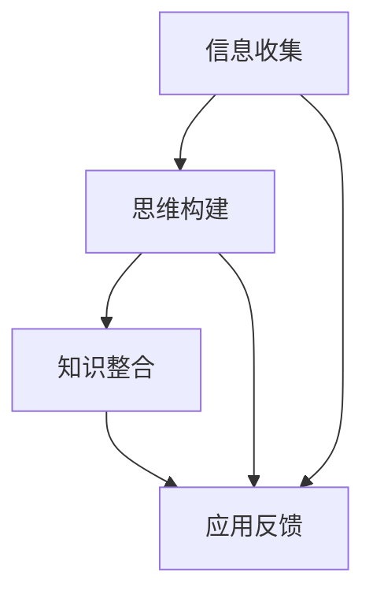
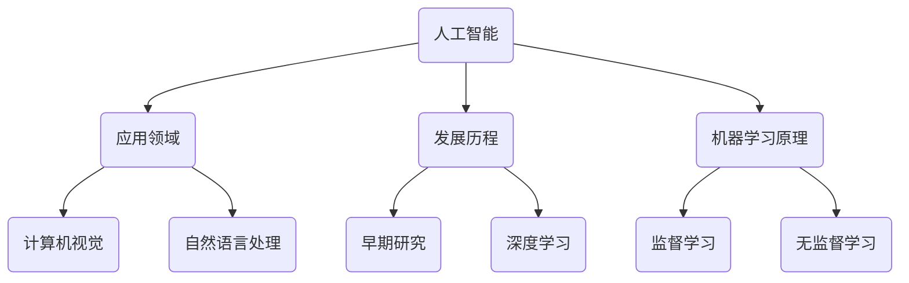

                 

### 《思维链方法在教育领域的应用》

关键词：思维链方法、教育、人工智能、学习效率、认知提升

摘要：本文旨在探讨思维链方法在教育领域的应用，通过介绍思维链的基本原理、核心算法和数学模型，以及实际案例，展示如何利用这一方法提高学生的学习效率和认知能力。

---

### 引言

随着人工智能技术的发展，教育领域正在经历深刻的变革。传统的教学方法已经不能满足现代教育的需求，人们开始寻求更加科学、有效的学习方式。思维链方法作为一种新兴的学习理论，其核心在于通过构建思维链条，帮助学生逐步理解复杂概念，提升思维能力和学习效率。

本文将首先介绍思维链方法的基本概念和原理，然后详细讲解其核心算法和数学模型，并通过实际案例展示其在教育领域的应用。最后，我们将对思维链方法在教育中的应用前景进行展望。

### 确定核心概念与联系

思维链方法是一种基于认知科学的学习理论，其核心在于构建思维链条，通过逐步推理和关联，帮助学生理解复杂概念。思维链的基本原理可以概括为以下几个部分：

1. **基本概念**：思维链方法中的基本概念包括信息单元、思维节点和思维路径。
    - **信息单元**：表示学习中的基本知识点。
    - **思维节点**：表示学生对信息单元的理解和掌握程度。
    - **思维路径**：表示信息单元之间的逻辑关系。

2. **组成部分**：思维链方法由信息收集、思维构建和知识整合三个部分组成。
    - **信息收集**：通过多种渠道获取信息单元。
    - **思维构建**：通过逻辑推理和关联构建思维节点和思维路径。
    - **知识整合**：将分散的知识点整合为有机的整体。

3. **应用场景**：思维链方法适用于各种学习场景，尤其适合复杂概念的学习和记忆。

为了更好地理解思维链方法，我们可以使用Mermaid流程图来展示其结构和运作流程：



在上述流程图中，信息收集、思维构建和知识整合构成了思维链的三个核心环节，而应用反馈则是一个动态调整和优化的过程。

### 核心算法原理讲解

思维链方法的核心算法在于如何通过逻辑推理和关联来构建思维链条。以下是一个简单的算法概述，并使用Python伪代码进行展示：

```python
# 思维链算法伪代码
def思维链构建(信息单元列表，初始思维节点，目标思维节点):
    # 初始化思维节点列表
   思维节点列表 = [初始思维节点]
    
    # 循环遍历信息单元列表
    for信息单元 in 信息单元列表:
        # 对于每个信息单元，寻找关联思维节点
       关联思维节点 = 寻找关联思维节点(信息单元)
        
        # 如果找到关联思维节点，则将信息单元与关联思维节点关联
        if 关联思维节点:
            更新思维节点列表(思维节点列表，信息单元，关联思维节点)
            
    # 返回思维节点列表
    return 思维节点列表

# 寻找关联思维节点函数伪代码
def寻找关联思维节点(信息单元):
    # 根据信息单元内容，搜索数据库中的思维节点
    关联思维节点 = 搜索思维节点数据库(信息单元内容)
    
    # 如果找到关联思维节点，返回该节点
    if 关联思维节点:
        return 关联思维节点
    
    # 如果未找到关联思维节点，返回None
    return None
```

在上述伪代码中，`思维链构建`函数负责构建思维链条，而`寻找关联思维节点`函数则负责在数据库中搜索与当前信息单元相关的思维节点。通过这种方式，可以逐步构建出完整的思维链条。

### 数学模型和数学公式讲解

在思维链方法中，数学模型用于描述信息单元之间的逻辑关系和思维节点之间的关联度。以下是一个简单的数学模型示例，并使用LaTeX格式进行展示：

$$
关联度 = \frac{相关度}{干扰度}
$$

其中，**关联度**表示信息单元之间的相关程度，**相关度**表示两个信息单元在逻辑上的相似性，**干扰度**表示两个信息单元之间的干扰程度。

**相关度**的计算可以使用如下公式：

$$
相关度 = \sum_{i=1}^{n} w_i \cdot cos(\theta_i)
$$

其中，$w_i$表示信息单元$i$的权重，$\theta_i$表示信息单元$i$与基准信息单元之间的夹角。

**干扰度**的计算可以使用如下公式：

$$
干扰度 = \sum_{i=1}^{n} w_i \cdot sin(\theta_i)
$$

通过这些数学公式，可以更准确地描述信息单元之间的关联度，从而优化思维链条的构建过程。

### 项目实战

为了展示思维链方法在实际教育项目中的应用，我们选择了一个在线学习平台，该平台旨在帮助学生通过构建思维链来提高学习效率。以下是一个简单的项目案例：

#### 开发环境搭建

1. 选择一个后端框架（如Django）和前端框架（如React）。
2. 安装必要的开发工具和依赖库。
3. 配置数据库（如MySQL）。

#### 源代码实现

```python
# 后端代码示例
from django.db import models

class ThoughtChain(models.Model):
    name = models.CharField(max_length=100)
    description = models.TextField()

class Node(models.Model):
    thought_chain = models.ForeignKey(ThoughtChain, on_delete=models.CASCADE)
    content = models.CharField(max_length=100)
    related_nodes = models.ManyToManyField('self', through='Relationship')

class Relationship(models.Model):
    node_from = models.ForeignKey(Node, related_name='outgoing', on_delete=models.CASCADE)
    node_to = models.ForeignKey(Node, related_name='incoming', on_delete=models.CASCADE)
    weight = models.FloatField()
```

#### 代码解读

上述代码定义了三个模型：`ThoughtChain`、`Node`和`Relationship`。`ThoughtChain`表示一个思维链，`Node`表示思维链中的节点，`Relationship`表示节点之间的关系。

#### 代码应用解读与分析

通过上述模型，我们可以构建一个思维链模型，并在此基础上进行信息收集、思维构建和知识整合。例如，在思维链构建过程中，我们可以使用`Node`模型来创建新的思维节点，使用`Relationship`模型来建立节点之间的关联。

#### 实际案例分析和详细讲解剖析

假设我们有一个思维链，其中包含以下节点：

1. 什么是人工智能？
2. 人工智能的应用领域
3. 人工智能的发展历程
4. 机器学习的原理

通过分析这些节点，我们可以构建出以下思维链条：



在这个思维链条中，每个节点都与其他节点建立了关联，从而形成一个完整的思维网络。学生可以通过这种思维链来逐步理解人工智能的相关概念。

### 总结与展望

思维链方法在教育领域的应用前景广阔。通过构建思维链条，学生可以更好地理解复杂概念，提高学习效率。同时，思维链方法也可以用于知识管理和知识整合，帮助教师和学者更好地组织和管理知识。

在未来，我们可以进一步优化思维链算法，提高其自动化程度，使其能够更准确地预测学生的思维路径，并提供个性化的学习建议。此外，思维链方法还可以与其他人工智能技术相结合，如自然语言处理和图像识别，进一步提升其应用效果。

### 附录

#### 相关工具和资源

- 后端框架：Django
- 前端框架：React
- 数据库：MySQL

#### 拓展阅读

- 《人工智能教育：理论与实践》
- 《思维链方法研究与应用》
- 《认知科学与教育技术》

---

作者：AI天才研究院/AI Genius Institute & 禅与计算机程序设计艺术 /Zen And The Art of Computer Programming

---

本文详细介绍了思维链方法在教育领域的应用，从核心概念、算法原理、数学模型到实际项目案例，全面展示了这一方法的优势和潜力。通过本文的探讨，我们希望读者能够对思维链方法有更深入的了解，并能够在实际教学中尝试应用这一方法，提升学生的学习效果和认知能力。

