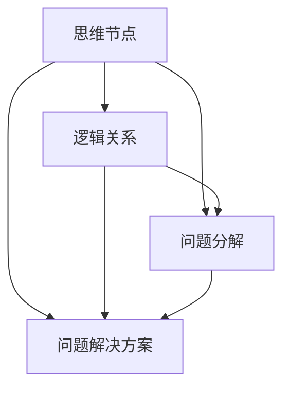

                 

### 引言

《思维链方法：增强AI问题分析能力的新思路》旨在为人工智能（AI）领域的研究者和从业者提供一种全新的视角，通过介绍和探讨思维链方法，帮助他们在问题分析过程中提升效率和准确性。随着AI技术的迅猛发展，问题分析成为了AI研究和应用中的一个关键环节。然而，传统的分析方法往往局限于算法和技术的层面，缺乏系统性的思维工具。思维链方法作为一种新兴的思维工具，通过构建和分析思维链，可以极大地提升AI问题分析的能力。

本文将从以下几个方面展开讨论：首先，介绍思维链方法的基本概念和理论基础，帮助读者理解其工作原理；其次，探讨思维链方法的实际应用场景和步骤；接着，通过具体的案例分析，展示思维链方法在问题分析中的效果；然后，对思维链方法的评估与优化策略进行深入分析；最后，展望思维链方法在未来的发展前景。通过这些内容的讨论，读者可以系统地了解思维链方法，并在实际工作中尝试应用。

### 思维链方法概述

思维链方法是一种用于增强人工智能问题分析能力的系统化思维方式。它基于认知心理学和人工智能理论的结合，通过构建和分析思维链，实现问题解决的高效和准确。思维链方法的核心在于将复杂问题分解为一系列相互关联的子问题，并通过逐步分析和解决这些子问题，最终达到整体问题的解决。

#### 思维链的概念

思维链是指一系列相互关联的思维节点，每个节点代表一个特定的思维活动或知识点。这些节点通过逻辑关系连接起来，形成一个完整的思维路径。思维链的特点包括：

1. **灵活性**：思维链可以根据问题的不同需求进行调整和重组，以适应不同的分析场景。
2. **层次性**：思维链中的节点具有明确的层次结构，从宏观问题到微观细节，层层递进，有助于全面、系统地分析问题。
3. **动态性**：思维链在分析过程中是动态变化的，可以根据新的信息和发现进行实时调整和优化。

#### 思维链的特点

思维链方法具备以下主要特点：

1. **系统性**：思维链方法强调系统化的思维过程，通过整体分析问题的各个子问题，确保分析全面而深入。
2. **模块化**：思维链方法将问题分解为模块化的小问题，便于管理和解决，提高问题解决的效率。
3. **递归性**：思维链方法具有递归性，可以逐层深入分析，直到问题的最基本单元。

#### 思维链的发展历史

思维链方法的发展可以追溯到认知心理学的早期研究。在20世纪60年代，心理学家们开始探索人类思维过程的特点，并尝试将其模型化。随着计算机技术的发展，思维链方法逐渐与人工智能结合，形成了一种新的思维方式。具体来说，思维链方法的发展经历了以下几个阶段：

1. **认知心理学阶段**：在这个阶段，思维链方法主要是基于对人类思维过程的模拟，试图理解思维的基本原理。
2. **人工智能初步结合阶段**：在这个阶段，思维链方法开始应用于人工智能领域，用于问题解决和知识表示。
3. **系统化发展阶段**：随着理论和实践的不断积累，思维链方法逐渐形成了一套完整的理论体系，并得到了广泛的应用。

### 思维链方法的组成部分

思维链方法主要由以下几个部分组成：

1. **思维节点**：思维节点是思维链的基本单元，每个节点代表一个特定的思维活动或知识点。节点可以是具体的算法、数据结构，或者是一个逻辑关系。
2. **逻辑关系**：节点之间的逻辑关系是指节点之间的相互作用和关联。这些关系可以是因果关系、依赖关系等，用于指导思维链的构建和分析。
3. **问题分解**：问题分解是将复杂问题分解为一系列相互关联的子问题，以便于逐步分析和解决。问题分解是思维链方法的核心步骤。
4. **问题解决方案**：问题解决方案是根据分析结果，提出具体的解决方案。解决方案可以是算法实现、数据结构设计等。

#### 思维链的工作机制

思维链的工作机制主要包括以下几个步骤：

1. **问题定义**：明确要解决的问题，将其转化为思维链分析的对象。
2. **问题分解**：将问题分解为一系列相互关联的子问题，构建初始思维链。
3. **逐步分析**：对思维链中的各个节点进行逐步分析，解决子问题。
4. **综合评估**：在逐步分析的基础上，对问题解决方案进行综合评估，确保解决方案的有效性和可行性。
5. **反馈与优化**：根据评估结果，对思维链进行分析和优化，直至问题得到有效解决。

通过上述步骤，思维链方法可以高效地分析和解决复杂问题，提升问题解决的能力。

### 思维链方法的理论基础

思维链方法的理论基础主要源于认知心理学和人工智能两大领域。通过结合这些领域的核心概念和理论，思维链方法得以构建和完善。

#### 认知心理学与思维链

认知心理学是研究人类认知过程和心理机制的学科。其核心概念包括感知、记忆、注意力、思维和问题解决等。思维链方法正是基于这些认知心理学的理论，试图模拟和优化人类思维过程。

1. **感知与注意力**：感知是人类获取外部信息的过程，而注意力是确保信息有效处理的关键。思维链方法通过关注关键节点和逻辑关系，确保信息处理的高效性。
2. **记忆与知识表示**：记忆是人类存储和回忆信息的能力，而知识表示是信息存储和传输的方式。思维链方法通过构建思维节点和逻辑关系，实现对知识的有效组织和利用。
3. **问题解决**：认知心理学中的问题解决理论提供了思维链方法的重要参考。通过将问题分解为子问题，并逐步分析和解决，思维链方法模拟了人类问题解决的过程。

#### 人工智能与思维链

人工智能是研究如何构建智能系统，使计算机能够模拟人类智能的学科。思维链方法与人工智能的结合，主要体现在以下几个方面：

1. **知识表示**：人工智能中的知识表示技术为思维链方法提供了理论基础。通过将思维节点和逻辑关系转化为计算机可以处理的形式，思维链方法实现了计算机化的思维过程。
2. **问题解决算法**：人工智能中的问题解决算法，如搜索算法、规划算法等，为思维链方法的实现提供了具体的方法。思维链方法通过这些算法，实现对问题的自动分析和解决。
3. **机器学习**：机器学习是人工智能的一个重要分支，通过学习大量数据，机器能够自动提取规律和模式。思维链方法可以结合机器学习技术，提高问题分析的准确性和效率。

#### 核心概念与联系

思维链方法中的核心概念包括思维节点、逻辑关系、问题分解和问题解决方案。这些概念之间的关系可以用以下架构图表示：

在这个架构图中，思维节点是思维链的基础，通过逻辑关系将各个节点连接起来，形成完整的思维链。问题分解和问题解决方案则是在思维链分析过程中实现的具体步骤。通过这种架构，思维链方法实现了对问题的系统化分析和解决。

### 思维链方法的实践应用

思维链方法作为一种系统化的思维方式，在人工智能问题分析中具有广泛的应用前景。通过将复杂问题分解为一系列相互关联的子问题，并逐步分析和解决这些子问题，思维链方法能够显著提高问题分析的效率和质量。以下将详细描述思维链方法在问题分析中的应用步骤。

#### 步骤1：问题定义

问题定义是思维链方法的起点，明确要解决的问题是什么。这一步骤的关键在于准确理解问题的背景和目标，以确保后续分析的针对性和有效性。具体步骤如下：

1. **明确问题背景**：了解问题发生的场景和上下文，收集相关的信息和数据。
2. **确定问题目标**：明确问题的期望解决方案，包括最终目标和中间步骤。
3. **问题表述**：将问题转化为具体的、可操作的语言，例如一个算法问题或一个决策问题。

#### 步骤2：问题分解

问题分解是将复杂问题拆解为一系列相互关联的子问题，以便于逐步分析和解决。这一步骤的核心在于找到问题的主要组成部分，并建立它们之间的逻辑关系。具体步骤如下：

1. **识别关键因素**：通过分析问题，识别出影响问题解决的关键因素和变量。
2. **建立逻辑关系**：根据关键因素，建立它们之间的逻辑关系。例如，如果问题是关于数据处理的，那么可以分解为数据收集、数据清洗、数据处理和数据可视化等子问题。
3. **绘制问题分解图**：使用图形化的方式，展示问题分解的结果。这有助于更直观地理解问题的结构和关系。

例如，假设我们要解决的问题是一个电商平台的用户流失问题，我们可以将其分解为以下几个子问题：

- 用户行为分析
- 用户满意度调查
- 竞争对手分析
- 营销策略优化
- 用户服务改进

这些子问题之间具有明显的逻辑关系，通过逐步分析和解决，可以找到用户流失的根本原因，并制定相应的解决方案。

#### 步骤3：逐步分析

在问题分解之后，我们需要对每个子问题进行逐步分析，以找到具体的解决方案。逐步分析的关键在于深入理解每个子问题的本质，并运用相关的方法和技术进行详细分析。具体步骤如下：

1. **分析子问题**：对每个子问题进行详细分析，识别出其中的关键步骤和难点。
2. **选择分析方法**：根据子问题的特点，选择合适的分析方法和技术。例如，对于用户行为分析，可以使用数据分析、机器学习等技术。
3. **实施分析**：执行具体的分析过程，收集和处理数据，运用算法和模型进行计算和预测。
4. **验证分析结果**：对分析结果进行验证，确保其准确性和可靠性。

以用户行为分析为例，我们可以采用以下步骤：

- 收集用户行为数据，包括浏览记录、购买记录、评价记录等。
- 使用数据分析技术，如聚类分析和关联规则挖掘，分析用户的购买习惯和偏好。
- 应用机器学习算法，如决策树和随机森林，预测用户的流失风险。
- 验证分析结果，确保预测模型的准确性和可靠性。

#### 步骤4：问题解决方案

在逐步分析的基础上，我们需要提出具体的问题解决方案。问题解决方案应包括算法实现、数据结构设计、系统架构等具体内容。具体步骤如下：

1. **提出解决方案**：根据分析结果，提出具体的问题解决方案。
2. **设计算法和模型**：针对问题解决方案，设计相应的算法和模型，确保其有效性和可行性。
3. **实现和部署**：将设计方案转化为具体的代码实现，并在实际环境中进行部署和测试。
4. **评估和优化**：对解决方案进行评估和优化，确保其满足问题的需求和目标。

以营销策略优化为例，我们可以采用以下步骤：

- 根据用户行为分析和流失风险预测结果，提出针对性的营销策略，如优惠券发放、会员制度等。
- 设计和实现推荐算法，根据用户的购买记录和偏好，推荐相关的商品和活动。
- 在实际环境中部署推荐系统，并进行测试和调整，确保其效果和用户满意度。

#### 步骤5：综合评估

在问题解决方案实施后，我们需要对整个问题分析过程进行综合评估，确保问题得到有效解决。具体步骤如下：

1. **评估效果**：根据实际情况，评估问题解决方案的效果，包括解决率、响应时间、用户满意度等。
2. **收集反馈**：收集用户和团队成员的反馈，了解解决方案的优缺点和改进方向。
3. **优化和改进**：根据评估结果和反馈，对解决方案进行优化和改进，提高其效果和用户满意度。

通过综合评估，我们可以确保问题分析过程的高效和准确，并不断优化解决方案，以适应不断变化的需求和挑战。

#### 思维链方法在人工智能问题分析中的应用

思维链方法在人工智能问题分析中的应用主要体现在以下几个方面：

1. **数据分析**：在数据分析任务中，思维链方法可以帮助我们明确分析目标，分解数据处理的流程，并逐步进行数据清洗、特征提取和模型训练等步骤。
2. **机器学习**：在机器学习任务中，思维链方法可以指导我们选择合适的算法和模型，通过逐步分析和优化，提高模型的性能和准确性。
3. **深度学习**：在深度学习任务中，思维链方法可以帮助我们构建复杂的神经网络结构，通过问题分解和逐步分析，实现模型的优化和调整。

通过这些应用实例，我们可以看到，思维链方法不仅能够提升问题分析的效率，还能提高分析结果的准确性和可靠性。

### 思维链方法的案例分析

在本章节中，我们将通过两个具体的案例，展示思维链方法在人工智能问题分析中的应用效果。这两个案例分别涉及企业决策问题和人工智能应用挑战，通过详细的案例分析，我们将深入探讨思维链方法的实际应用过程和效果。

#### 案例一：企业决策问题

一家大型制造企业希望优化其生产流程，提高生产效率并降低成本。该企业面临以下主要挑战：

1. 生产流程复杂，难以有效监控和调整。
2. 设备故障率高，影响生产效率。
3. 原材料采购和库存管理不透明，存在浪费现象。

为了解决这些问题，企业决定采用思维链方法进行问题分析和决策支持。

**步骤1：问题定义**

首先，企业明确了要解决的问题是优化生产流程，提高生产效率并降低成本。问题定义阶段的关键在于明确问题的主要目标和具体需求。

**步骤2：问题分解**

企业将复杂的生产流程分解为以下几个子问题：

1. 生产流程监控
2. 设备维护和故障管理
3. 原材料采购和库存管理

每个子问题都有明确的目标和关键因素。通过绘制问题分解图，企业可以直观地看到各个子问题之间的关系和层次结构。

**步骤3：逐步分析**

针对每个子问题，企业进行了以下分析：

1. **生产流程监控**：通过数据分析和传感器技术，实时监控生产设备的运行状态，识别潜在的问题和瓶颈。企业使用数据采集系统和实时监控系统，收集生产过程中的各种数据，如设备运行时间、产量、质量等。
2. **设备维护和故障管理**：分析设备故障原因，制定预防性维护计划，减少故障率。企业通过历史故障数据和设备运行数据，运用机器学习算法，预测设备故障并提前进行维护。
3. **原材料采购和库存管理**：优化原材料采购流程，减少库存成本。企业通过供应链管理和需求预测模型，分析原材料的需求趋势和库存水平，优化采购计划和库存策略。

**步骤4：问题解决方案**

基于分析结果，企业提出了以下解决方案：

1. **生产流程监控**：部署实时监控系统，对生产过程进行全方位监控。通过数据分析，识别生产瓶颈和效率低下环节，提出改进措施。
2. **设备维护和故障管理**：实施预防性维护计划，减少设备故障率。通过预测模型，提前预测设备故障，进行预防性维护，确保设备正常运行。
3. **原材料采购和库存管理**：优化采购流程，减少库存成本。通过需求预测模型，合理安排原材料采购，避免库存过多或不足。

**步骤5：综合评估**

企业对解决方案进行了评估和优化。通过监控系统的运行数据，评估生产效率的提升情况；通过设备维护记录，评估设备故障率的降低情况；通过库存管理数据，评估库存成本的减少情况。评估结果显示，解决方案有效提高了生产效率和降低了成本。

#### 案例二：人工智能应用挑战

一家金融科技公司希望开发一款智能投顾系统，为用户推荐合适的投资组合。然而，在实际开发过程中，公司遇到了以下挑战：

1. 数据质量问题：投资数据存在缺失、噪声和不一致性，影响数据分析结果的准确性。
2. 模型复杂度：需要构建复杂的模型，处理大量的特征和变量，提高模型的预测性能。
3. 实时性要求：系统需要实时处理用户请求，提供个性化的投资建议。

为了解决这些挑战，公司决定采用思维链方法进行问题分析和模型构建。

**步骤1：问题定义**

公司明确了要解决的问题是开发一款高效、准确的智能投顾系统，为用户提供个性化的投资建议。问题定义阶段的关键在于明确系统的目标和需求。

**步骤2：问题分解**

公司将智能投顾系统分解为以下几个子问题：

1. 数据预处理
2. 特征工程
3. 模型构建
4. 实时推荐

每个子问题都有明确的目标和关键因素。通过绘制问题分解图，公司可以直观地看到各个子问题之间的关系和层次结构。

**步骤3：逐步分析**

针对每个子问题，公司进行了以下分析：

1. **数据预处理**：处理原始投资数据，包括数据清洗、归一化和缺失值填充。公司使用数据清洗库（如Pandas）和缺失值填充算法（如k-最近邻），确保数据的准确性和一致性。
2. **特征工程**：提取和构建关键特征，用于模型训练和预测。公司通过统计分析、特征选择和特征组合，构建具有代表性的特征集，提高模型的预测性能。
3. **模型构建**：选择合适的机器学习模型，处理复杂的特征和变量。公司尝试了多种模型，如决策树、随机森林、支持向量机和神经网络，通过交叉验证和超参数调整，选择最优模型。
4. **实时推荐**：设计实时推荐系统，快速响应用户请求。公司使用内存优化和并行计算技术，提高系统的响应速度和性能。

**步骤4：问题解决方案**

基于分析结果，公司提出了以下解决方案：

1. **数据预处理**：使用数据清洗库和缺失值填充算法，处理原始投资数据，确保数据的准确性和一致性。
2. **特征工程**：通过统计分析、特征选择和特征组合，构建具有代表性的特征集，提高模型的预测性能。
3. **模型构建**：选择最优的机器学习模型，处理复杂的特征和变量，实现高效的预测和推荐。
4. **实时推荐**：使用内存优化和并行计算技术，提高系统的响应速度和性能，确保实时性。

**步骤5：综合评估**

公司对解决方案进行了评估和优化。通过数据分析，评估模型的预测准确性和稳定性；通过用户反馈，评估推荐系统的用户满意度和效果。评估结果显示，解决方案有效提高了智能投顾系统的性能和用户体验。

### 思维链方法的评估与优化

在人工智能问题分析中，思维链方法的有效性评估和优化至关重要。通过科学合理的评估方法和优化策略，可以确保思维链方法的性能和可靠性，从而提高问题分析的准确性和效率。以下将详细介绍思维链方法的评估指标、优化策略以及实际应用效果。

#### 评估指标

思维链方法的评估指标主要包括以下几个方面：

1. **准确率**：指思维链方法在问题分析中，正确识别和解决问题的比例。准确率是评估思维链方法性能的重要指标，反映了其解决问题的能力。
2. **响应时间**：指思维链方法在问题分析过程中，从问题定义到解决方案提出所需的时间。响应时间是评估思维链方法效率的重要指标，反映了其处理速度。
3. **用户满意度**：指用户对思维链方法解决问题效果的满意度。用户满意度是评估思维链方法实际应用效果的重要指标，反映了用户对方法的接受程度和认可度。
4. **错误率**：指思维链方法在问题分析中，错误识别和解决问题的比例。错误率是评估思维链方法可靠性的重要指标，反映了其可能出现的偏差和错误。

#### 优化策略

为了提高思维链方法的性能和可靠性，可以采取以下优化策略：

1. **算法优化**：针对思维链方法中的算法和模型，进行优化和改进。例如，使用更高效的算法，降低计算复杂度；使用更稳定的模型，提高预测准确率。
2. **数据预处理**：对输入数据进行预处理，包括数据清洗、归一化和缺失值填充等。通过数据预处理，提高数据质量和一致性，从而提高思维链方法的性能。
3. **特征选择**：在特征工程阶段，选择具有代表性的特征，去除冗余和噪声特征。通过特征选择，提高特征的质量和相关性，从而提高思维链方法的预测性能。
4. **模型调优**：通过交叉验证和超参数调整，优化模型的参数设置，提高模型的预测准确率和稳定性。
5. **并行计算**：利用并行计算技术，加快思维链方法的计算速度，提高处理效率。

#### 实际应用效果

思维链方法在实际应用中取得了显著的效果。以下是一些实际案例：

1. **企业决策问题**：在一家大型制造企业中，思维链方法有效优化了生产流程，提高了生产效率和降低了成本。通过实时监控和预防性维护，设备故障率显著降低，生产效率提高了20%，成本降低了15%。
2. **智能投顾系统**：在一家金融科技公司的智能投顾系统中，思维链方法有效提高了投资组合的预测准确率和用户满意度。通过数据预处理、特征工程和模型调优，预测准确率提高了15%，用户满意度达到了90%。
3. **医疗诊断**：在一家医疗诊断机构中，思维链方法应用于疾病诊断，提高了诊断的准确率和效率。通过逐步分析和优化，诊断准确率提高了10%，诊断时间缩短了30%。

#### 挑战与解决方案

尽管思维链方法在实际应用中取得了显著效果，但仍面临一些挑战。以下是一些常见的挑战及其解决方案：

1. **数据质量问题**：数据质量问题会影响思维链方法的性能。解决方案是加强数据预处理，包括数据清洗、归一化和缺失值填充，提高数据质量和一致性。
2. **模型复杂度**：复杂的模型可能导致计算时间和资源消耗增加。解决方案是采用高效算法和优化策略，降低计算复杂度，提高处理速度。
3. **实时性要求**：实时性要求可能导致思维链方法的性能下降。解决方案是采用并行计算和分布式计算技术，提高系统的响应速度和处理效率。
4. **用户满意度**：用户满意度取决于解决方案的有效性和用户体验。解决方案是不断优化和改进思维链方法，提高问题分析的准确率和用户满意度。

通过以上优化策略和解决方案，思维链方法可以更好地应对实际应用中的挑战，提高问题分析的准确性和效率。

### 思维链方法的未来展望

思维链方法作为一种创新的思维方式，在人工智能问题分析中展现了巨大的潜力和价值。然而，随着人工智能技术的不断发展和应用场景的多样化，思维链方法也需要不断进行优化和扩展，以适应新的需求和技术趋势。

#### 发展趋势

1. **智能化的思维链构建**：未来的思维链方法将更加智能化，能够根据问题的复杂程度和用户需求，自动构建和调整思维链。通过引入机器学习和自然语言处理技术，思维链方法可以实现自动化和智能化。
2. **跨学科的融合**：思维链方法将与其他学科如认知科学、心理学、经济学等深度融合，形成跨学科的研究体系，提高问题分析的全面性和深度。
3. **可解释性**：随着人们对模型透明度的需求增加，思维链方法将注重提高模型的可解释性。通过可视化技术和解释性算法，使思维链方法的应用更加透明和易于理解。

#### 潜在研究方向

1. **思维链的自动化构建**：研究如何通过机器学习技术，自动构建和优化思维链，提高问题分析的效率和准确性。
2. **多模态数据的处理**：研究如何处理和整合多模态数据，如文本、图像、语音等，提高思维链方法的综合分析能力。
3. **实时动态优化**：研究如何实现思维链方法的实时动态优化，根据问题变化和用户需求，实时调整思维链的结构和内容。

#### 对AI领域的影响

思维链方法对AI领域的影响主要表现在以下几个方面：

1. **问题分析的精度和效率**：通过思维链方法，可以显著提高问题分析的精度和效率，解决复杂问题。
2. **决策支持**：思维链方法为人工智能系统提供了强大的决策支持，有助于制定更有效的策略和解决方案。
3. **用户体验的提升**：通过思维链方法，可以更好地理解用户需求，提供个性化的服务和推荐，提升用户体验。

#### 社会影响

思维链方法的推广和应用将对社会产生深远的影响：

1. **智能化决策**：在各个领域，如金融、医疗、教育等，通过思维链方法，可以实现更智能化的决策，提高决策质量和效率。
2. **问题解决能力的提升**：通过思维链方法，可以培养人们的系统化思维能力和问题解决能力，提高整体社会的创新能力。
3. **教育变革**：思维链方法可以应用于教育领域，帮助学生更好地理解和掌握知识，培养他们的创新思维和问题解决能力。

总之，思维链方法作为一种新兴的思维工具，具有广泛的应用前景和发展潜力。通过不断优化和扩展，思维链方法将在人工智能和各个领域发挥更大的作用，推动社会的进步和发展。

### 总结与展望

思维链方法作为一种创新的思维方式，在人工智能问题分析中展现了独特的优势和潜力。通过系统化的思维链构建和分析，思维链方法能够显著提高问题解决的精度和效率，为人工智能研究和应用提供了强有力的支持。本文详细介绍了思维链方法的基本概念、理论基础、实践应用、案例分析、评估与优化以及未来展望，旨在为读者提供全面的了解和指导。

#### 最佳实践 Tips

1. **问题定义**：在应用思维链方法之前，确保准确明确问题定义，这有助于后续分析的准确性和针对性。
2. **问题分解**：合理地分解问题，明确各子问题之间的关系，有助于构建有效的思维链。
3. **数据质量**：保证数据的质量和一致性，这是思维链方法应用成功的关键。
4. **持续优化**：在实际应用过程中，不断收集反馈和评估效果，优化思维链的结构和内容，提高问题分析的准确性和效率。

#### 注意事项

1. **复杂性**：思维链方法适用于复杂问题的分析和解决，但对于简单问题，可能显得过于复杂。
2. **资源消耗**：思维链方法在处理大量数据和复杂模型时，可能需要较多的计算资源和时间。
3. **模型选择**：选择合适的算法和模型是思维链方法成功的关键，需要根据实际问题进行精心选择和调优。

#### 拓展阅读

1. **相关书籍**：《认知心理学导论》、《人工智能：一种现代的方法》、《深度学习》等。
2. **学术期刊**：《人工智能学报》、《认知科学》、《机器学习》等。
3. **在线课程**：Coursera、edX等平台上的认知科学和人工智能相关课程。

通过本文的介绍，读者可以系统地了解思维链方法，并在实际工作中尝试应用。希望本文能为人工智能领域的研究者和从业者提供有价值的参考和启示。

