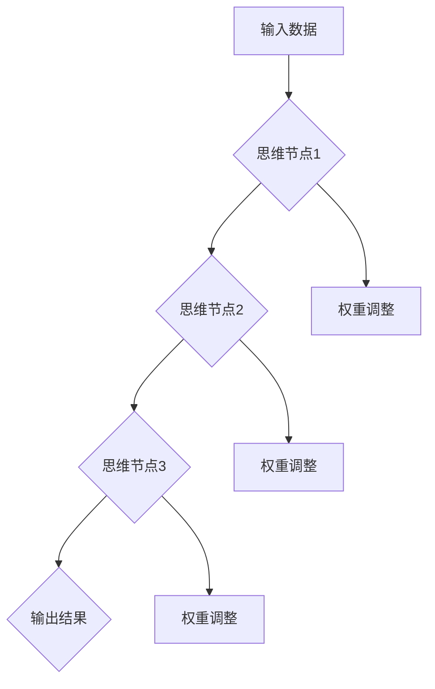

                 

### 《思维链方法：提升AI输出质量的关键》

#### 关键词：
- **思维链方法**、**人工智能**、**输出质量**、**优化策略**、**文本生成**、**图像识别**、**自然语言处理**、**推荐系统**

#### 摘要：
本文将深入探讨思维链方法在提升人工智能（AI）输出质量方面的关键作用。通过概述思维链方法的基本概念，分析其在AI不同领域的应用，以及探讨优化与实现策略，本文旨在为读者提供全面的技术视角，帮助理解思维链方法如何从根本上改善AI系统的性能与可靠性。

---

#### 目录大纲

##### 第一部分：思维链方法概述

##### 第1章 思维链方法概述
- 1.1 思维链方法的基本概念
- 1.2 思维链方法与AI的关系
- 1.3 思维链方法的发展历程

##### 第二部分：思维链方法在AI中的应用

##### 第2章 思维链方法在AI文本生成中的应用
- 2.1 文本生成的传统方法
- 2.2 思维链方法在文本生成中的应用
- 2.3 思维链方法的文本生成案例

##### 第3章 思维链方法在图像识别中的应用
- 3.1 图像识别的传统方法
- 3.2 思维链方法在图像识别中的应用
- 3.3 思维链方法的图像识别案例

##### 第4章 思维链方法在自然语言处理中的应用
- 4.1 自然语言处理的传统方法
- 4.2 思维链方法在自然语言处理中的应用
- 4.3 思维链方法的自然语言处理案例

##### 第5章 思维链方法在推荐系统中的应用
- 5.1 推荐系统的传统方法
- 5.2 思维链方法在推荐系统中的应用
- 5.3 思维链方法的推荐系统案例

##### 第三部分：思维链方法优化与实现

##### 第6章 思维链方法的优化策略
- 6.1 思维链方法的优化目标
- 6.2 思维链方法的优化方法
- 6.3 思维链方法的优化案例分析

##### 第7章 思维链方法在AI系统中的实现
- 7.1 思维链方法在AI系统中的架构设计
- 7.2 思维链方法在AI系统中的实现细节
- 7.3 思维链方法在AI系统中的性能评估

##### 附录

##### 附录A：思维链方法的代码实现
- 伪代码
- 源代码实现
- 代码解读

##### 附录B：思维链方法的未来发展趋势
- 思维链方法的发展方向
- 思维链方法在AI领域的新应用

---

### 第一部分：思维链方法概述

#### 第1章 思维链方法概述

##### 1.1 思维链方法的基本概念

思维链方法是一种基于神经网络和深度学习技术的创新性方法，旨在提升人工智能系统的输出质量和鲁棒性。该方法通过建立一系列相互关联的“思维节点”，模拟人类思考过程，实现复杂问题的求解和决策。

**核心概念与联系：**

1. **思维节点**：思维链方法的基本构建块，代表个体思维过程。
2. **连接关系**：思维节点之间的交互和影响，通过权重进行量化。
3. **优化算法**：用于调整连接权重，以优化整体思维链的性能。

**Mermaid流程图：**

##### 1.2 思维链方法与AI的关系

思维链方法在AI领域具有重要应用价值，其与AI的关系可以从以下几个方面来理解：

1. **提升学习能力**：通过模拟人类思考过程，增强AI系统的自我学习能力，特别是在处理复杂和非结构化数据时。
2. **增强决策能力**：思维链方法提供了一种结构化的决策框架，使AI系统能够在不确定的环境中做出更加合理和可靠的决策。
3. **提高输出质量**：通过优化思维链中的连接权重，提升AI系统输出的精度和一致性。

**数学模型：**

$$ 
\text{思维链模型} = f(\text{输入}, \text{神经网络结构}, \text{优化算法})
$$

- **输入**：包含问题的所有相关信息。
- **神经网络结构**：由一系列思维节点和连接关系构成。
- **优化算法**：用于调整连接权重，以最小化输出误差。

##### 1.3 思维链方法的发展历程

思维链方法的发展可以追溯到20世纪80年代，当时的神经网络研究正处于低谷期。然而，随着深度学习技术的崛起，思维链方法逐渐引起了广泛关注。近年来，随着计算能力的提升和数据量的增加，思维链方法在AI领域的应用取得了显著进展。

**发展阶段：**

1. **初步探索期（1980s-1990s）**：思维链方法的基本概念和研究初步成形。
2. **快速发展期（2000s-2010s）**：随着神经网络技术的复兴，思维链方法得到了进一步发展。
3. **应用推广期（2010s-至今）**：思维链方法在各个AI领域得到了广泛应用，并取得了显著成果。

### 第一部分总结

思维链方法作为一种创新性的人工智能技术，其基本概念、与AI的关系以及发展历程为我们提供了一个全面的技术视角。在接下来的章节中，我们将深入探讨思维链方法在不同AI领域的具体应用，以进一步揭示其提升AI输出质量的关键作用。

