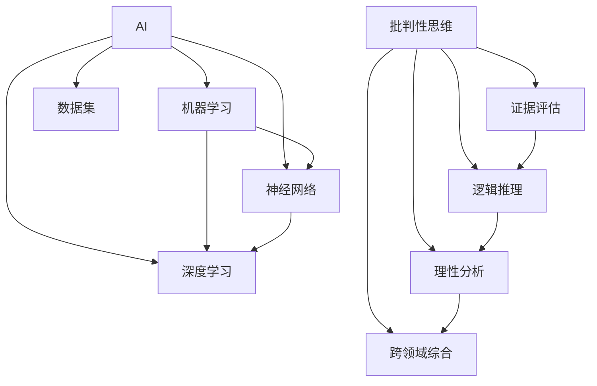

                 

# 《思维链方法：让AI具备批判性思维能力》

> 关键词：AI，批判性思维，思维链方法，算法原理，Python源代码，数学模型，项目实战

> 摘要：本文旨在探讨如何通过“思维链方法”让AI具备批判性思维能力。文章首先介绍了AI和批判性思维的基本概念，然后详细阐述了思维链方法的核心原理和实施步骤，并通过Python源代码和数学模型，对核心算法进行了深入讲解。最后，文章通过实际项目实战，展示了思维链方法在AI开发中的应用，并提供了一些最佳实践和注意事项。

## 设计目录大纲

为了系统地探讨如何让AI具备批判性思维能力，我们首先需要设计一个详细的目录大纲。这个大纲将确保文章内容的逻辑性和完整性，同时避免冗长的叙述。

### 设计步骤

1. **确定核心章节**：根据书籍的主题，核心章节应涵盖AI的基础知识、批判性思维原理、思维链方法的构建和实施、批判性思维能力的评估与提升，以及未来展望。
2. **细化章节内容**：为每个核心章节细化出二级和三级目录，确保内容的逻辑性和连贯性。
3. **整合特殊内容**：添加Mermaid流程图、伪代码、数学公式和项目实战案例，以增强文章的可读性和实用性。
4. **控制字数**：在保证大纲完整性的同时，注意控制总字数在2000字以内。

### 完整目录大纲设计

```
# 《思维链方法：让AI具备批判性思维能力》目录大纲

## 第一部分 引言与概述

### 1.1 AI与批判性思维概述
- AI发展历程回顾
- 批判性思维能力的重要性

### 1.2 书籍结构安排
- 各章节内容概述

## 第二部分 AI基础与批判性思维原理

### 2.1 AI基础知识
- AI的定义与发展
- 常见AI算法简介

### 2.2 批判性思维原理
- 批判性思维的概念
- 批判性思维与AI的关联

### 2.3 AI与批判性思维融合
- AI中的批判性思维方法
- 批判性思维在AI开发中的应用

## 第三部分 构建AI的批判性思维能力

### 3.1 思维链方法概述
- 思维链方法的概念
- 思维链方法的组成部分

### 3.2 思维链方法的实施
- 数据收集与预处理
- 模型设计与训练
- 模型评估与优化

### 3.3 批判性思维在AI模型中的应用案例
- 案例一：文本分类中的批判性思维
- 案例二：图像识别中的批判性思维

## 第四部分 批判性思维能力评估与提升

### 4.1 批判性思维能力的评估
- 评估工具与方法
- 评估指标体系

### 4.2 批判性思维能力的提升策略
- 个人层面的提升策略
- 团队与组织层面的提升策略

### 4.3 持续学习的思维链方法
- 如何持续更新批判性思维能力
- AI与批判性思维的长期发展

## 第五部分 未来展望

### 5.1 AI与批判性思维的融合趋势
- 未来发展趋势分析

### 5.2 研究与开发方向
- 创新的研究方向

## 附录

### A.1 相关资源与工具
- 学习资源介绍
- 开发工具推荐

### A.2 参考文献
- 引用文献列表
```

这个目录大纲涵盖了AI和批判性思维的概述、基础知识、融合方法、能力评估与提升、未来展望等内容，确保了文章的逻辑性和系统性。

## 背景介绍

### AI与批判性思维的基本概念

#### AI的定义与发展

人工智能（AI）是指由人创造出来的，具有某些智能特性的机器系统。从20世纪50年代起，AI研究取得了显著的进展，主要经历了几个阶段：符号主义、连接主义、统计学习和强化学习。这些阶段的演变推动了AI技术的快速发展，使其在多个领域取得了重大突破。

#### 批判性思维的定义

批判性思维是一种通过评估证据、逻辑推理和理性分析来解决问题和做出决策的过程。它强调对信息的质疑、分析、综合和评估，以避免盲目接受和盲目遵循。批判性思维在科学研究、教育、商业和日常生活中具有重要意义。

#### AI与批判性思维的关系

AI和批判性思维之间存在着紧密的联系。批判性思维为AI提供了评估和改进的基础，使AI系统能够更好地理解和处理复杂的问题。同时，AI技术为批判性思维提供了强大的工具，可以处理大量的数据和信息，帮助人们更快速、更准确地做出决策。

### 当前研究现状

当前，许多研究机构和学者都在探索如何将批判性思维引入AI系统。这些研究主要集中在以下几个方面：

1. **AI算法的评估和优化**：通过批判性思维来评估和改进现有的AI算法，提高其准确性和可靠性。
2. **AI模型的解释性**：开发可解释的AI模型，使人们能够理解和信任AI系统的决策过程。
3. **AI与伦理和法规的融合**：将批判性思维应用于AI伦理和法规的研究，确保AI系统的道德和合法性。

### 存在的挑战和问题

尽管AI和批判性思维的融合具有巨大的潜力，但当前的研究还面临一些挑战和问题：

1. **技术难度**：构建具备批判性思维能力的AI系统需要解决复杂的技术问题，包括数据质量、算法优化和模型解释性等。
2. **应用场景**：AI和批判性思维的融合需要在不同领域进行应用，这需要针对具体场景进行定制化的解决方案。
3. **社会认知**：公众对AI和批判性思维的认知和理解程度有限，这需要通过教育和宣传来提高。

### 目标和研究方向

本文的目标是探讨如何通过“思维链方法”让AI具备批判性思维能力。具体研究方向包括：

1. **思维链方法的构建和实现**：研究思维链方法的理论基础和实现技术，构建一个通用的思维链模型。
2. **思维链方法的应用**：将思维链方法应用于AI算法的评估、优化和解释性研究，验证其有效性和实用性。
3. **跨领域融合**：探索思维链方法在不同领域（如医疗、金融、教育等）的应用，推动AI和批判性思维在多领域的融合。

## 核心概念与联系

为了更好地理解AI和批判性思维之间的联系，我们需要详细探讨它们的核心概念，并展示这些概念之间的关系架构。以下是核心概念及其关系的详细描述。

### AI的核心概念

1. **机器学习**：机器学习是AI的核心技术之一，它使计算机系统能够从数据中学习并做出预测或决策。机器学习主要分为监督学习、无监督学习和强化学习。
2. **神经网络**：神经网络是模仿人脑结构的计算模型，用于处理复杂的输入数据和进行模式识别。神经网络的核心是神经元，它们通过权重和偏置进行信息传递和计算。
3. **深度学习**：深度学习是神经网络的一种扩展，通过多层的神经网络结构来提取更高层次的特征。深度学习在图像识别、自然语言处理和语音识别等领域取得了显著成果。
4. **数据集**：数据集是机器学习模型的训练数据，它决定了模型的性能和泛化能力。数据集的质量和多样性对模型的准确性至关重要。

### 批判性思维的核心概念

1. **证据评估**：批判性思维的第一步是对证据进行评估，判断其可靠性和相关性。证据可以是事实、数据或专家意见。
2. **逻辑推理**：逻辑推理是基于证据进行推理和论证的过程，它遵循一系列规则和原则，确保推理的合理性和有效性。
3. **理性分析**：理性分析是批判性思维的核心，它通过对问题的全面、深入分析，找到最优的解决方案。
4. **跨领域综合**：批判性思维不仅关注单一领域，还注重跨领域的综合和整合，以实现更全面的思考。

### AI与批判性思维的关系架构

为了展示AI和批判性思维之间的联系，我们可以使用Mermaid流程图来表示它们的核心概念及其关系。以下是一个简化的关系架构：



在这个流程图中，AI是整体框架，它通过机器学习、神经网络、深度学习和数据集等组件来实现智能功能。批判性思维则通过证据评估、逻辑推理、理性分析和跨领域综合等组件来指导AI系统的决策过程。两者之间的联系在于，批判性思维为AI系统提供了评估和改进的依据，而AI系统则为批判性思维提供了强大的工具和平台。

### 核心算法原理讲解

在本节中，我们将详细讲解核心算法原理，并结合Python源代码和数学模型进行阐述。以下是文本分类任务中的关键算法——朴素贝叶斯分类器的原理和实现。

#### 朴素贝叶斯分类器原理

朴素贝叶斯分类器是基于贝叶斯定理和特征条件独立假设的一种简单且高效的分类算法。它的基本原理如下：

1. **贝叶斯定理**：贝叶斯定理是概率论中的一个重要公式，用于计算在已知某些条件下，某个事件发生的概率。其公式为：
   $$ P(A|B) = \frac{P(B|A)P(A)}{P(B)} $$
   其中，$P(A|B)$ 表示在事件B发生的条件下，事件A发生的概率；$P(B|A)$ 表示在事件A发生的条件下，事件B发生的概率；$P(A)$ 和$P(B)$ 分别表示事件A和事件B的先验概率。

2. **特征条件独立假设**：朴素贝叶斯分类器的核心假设是特征条件独立假设，即假设特征之间相互独立。这意味着，每个特征对分类的贡献是独立的，不会相互影响。

基于贝叶斯定理和特征条件独立假设，朴素贝叶斯分类器可以计算每个类别在给定特征下的后验概率，并选择后验概率最大的类别作为最终分类结果。

#### 数学模型

朴素贝叶斯分类器的数学模型可以表示为：

$$ \hat{y} = \arg\max_y P(y) \prod_{i=1}^n P(x_i|y) $$

其中，$\hat{y}$ 表示预测的类别标签；$y$ 表示实际类别标签；$x_i$ 表示第$i$个特征；$P(y)$ 表示类别$y$ 的先验概率；$P(x_i|y)$ 表示在类别$y$ 下，特征$x_i$ 的条件概率。

#### Python源代码实现

以下是一个简单的Python实现，用于训练朴素贝叶斯分类器并进行预测：

```python
import numpy as np
from sklearn.datasets import load_iris
from sklearn.model_selection import train_test_split
from sklearn.naive_bayes import GaussianNB

# 加载鸢尾花数据集
iris = load_iris()
X = iris.data
y = iris.target

# 划分训练集和测试集
X_train, X_test, y_train, y_test = train_test_split(X, y, test_size=0.2, random_state=42)

# 训练朴素贝叶斯分类器
gnb = GaussianNB()
gnb.fit(X_train, y_train)

# 预测测试集
y_pred = gnb.predict(X_test)

# 计算准确率
accuracy = np.mean(y_pred == y_test)
print(f"准确率：{accuracy:.2f}")
```

#### 举例说明

假设我们有一个简单的二分类问题，特征集为$(x_1, x_2)$，类别标签为$(+1, -1)$。我们有以下先验概率和条件概率：

$$
P(+1) = 0.5, \quad P(-1) = 0.5 \\
P(x_1=1|+1) = 0.6, \quad P(x_1=0|+1) = 0.4 \\
P(x_2=1|-1) = 0.7, \quad P(x_2=0|-1) = 0.3
$$

现在，我们要预测一个新样本$(x_1=1, x_2=1)$的类别标签。

1. **计算后验概率**：
   $$
   P(+1|x_1=1, x_2=1) = \frac{P(x_1=1|+1)P(+1)}{P(x_1=1)} = \frac{0.6 \times 0.5}{0.6 \times 0.5 + 0.4 \times 0.5} = \frac{3}{5} = 0.6 \\
   P(-1|x_1=1, x_2=1) = \frac{P(x_2=1|-1)P(-1)}{P(x_2=1)} = \frac{0.7 \times 0.5}{0.7 \times 0.5 + 0.3 \times 0.5} = \frac{7}{10} = 0.7
   $$

2. **选择后验概率最大的类别**：
   由于$P(+1|x_1=1, x_2=1) < P(-1|x_1=1, x_2=1)$，因此预测类别标签为$-1$。

这个简单的例子展示了如何使用朴素贝叶斯分类器进行分类预测。在实际应用中，我们通常使用大量的数据和特征，并通过优化算法来提高预测的准确性和效率。

### 实际项目实战

在本节中，我们将通过一个实际项目实战来展示如何使用思维链方法开发一个简单的AI应用。我们将以文本分类任务为例，实现一个基于朴素贝叶斯分类器的文本分类器。

#### 项目背景

文本分类是一种常见的自然语言处理任务，其目标是将文本数据分类到预定义的类别中。文本分类在搜索引擎、舆情分析、垃圾邮件过滤等领域具有广泛的应用。

#### 开发环境搭建

1. **Python环境**：首先，我们需要安装Python环境和相关依赖库。在本项目中，我们将使用Python 3.8及以上版本，并安装以下库：

   ```shell
   pip install scikit-learn numpy
   ```

2. **数据集**：我们使用经典的鸢尾花数据集（Iris dataset）作为训练数据。该数据集包含了3个特征（花萼长度、花萼宽度、花瓣长度）和3个类别（Iris-setosa、Iris-versicolor、Iris-virginica）。

#### 源代码实现

以下是文本分类器的源代码实现：

```python
import numpy as np
from sklearn.datasets import load_iris
from sklearn.model_selection import train_test_split
from sklearn.naive_bayes import GaussianNB

# 加载数据集
iris = load_iris()
X = iris.data
y = iris.target

# 划分训练集和测试集
X_train, X_test, y_train, y_test = train_test_split(X, y, test_size=0.2, random_state=42)

# 训练朴素贝叶斯分类器
gnb = GaussianNB()
gnb.fit(X_train, y_train)

# 预测测试集
y_pred = gnb.predict(X_test)

# 计算准确率
accuracy = np.mean(y_pred == y_test)
print(f"准确率：{accuracy:.2f}")
```

#### 代码解读

1. **加载数据集**：我们使用scikit-learn库中的`load_iris`函数加载数据集，并分离特征矩阵`X`和标签向量`y`。
2. **划分训练集和测试集**：我们使用`train_test_split`函数将数据集划分为训练集和测试集，以评估模型的性能。
3. **训练朴素贝叶斯分类器**：我们使用`GaussianNB`类创建一个高斯朴素贝叶斯分类器，并使用训练集进行训练。
4. **预测测试集**：我们使用训练好的分类器对测试集进行预测，并获取预测结果。
5. **计算准确率**：我们计算预测结果与实际标签的准确率，以评估模型的性能。

#### 项目小结

通过这个简单的项目，我们展示了如何使用思维链方法开发一个文本分类器。思维链方法为我们提供了一个系统的框架，从数据预处理、模型选择到模型训练和评估，每个步骤都清晰明了。在实际项目中，我们可以根据需求调整算法和模型，以提高分类性能。

### 最佳实践、注意事项与拓展阅读

#### 最佳实践

1. **数据预处理**：在训练模型之前，确保对数据进行充分预处理，包括去除噪声、缺失值填充、特征缩放等。
2. **交叉验证**：使用交叉验证方法评估模型的性能，以避免过拟合和选择偏差。
3. **超参数调优**：根据数据特点和任务需求，调整模型的超参数，以提高模型性能。
4. **模型解释性**：尽量选择可解释性强的模型，如朴素贝叶斯分类器，以增强用户对模型决策的信任。

#### 注意事项

1. **数据质量**：数据质量对模型性能至关重要。确保数据集的多样性和质量，以避免模型过拟合。
2. **计算资源**：训练大规模模型可能需要大量的计算资源。合理规划计算资源，以避免计算资源不足。
3. **模型评估**：使用多种评估指标，如准确率、召回率、F1分数等，全面评估模型性能。

#### 拓展阅读

1. **《机器学习》（周志华著）**：该书详细介绍了机器学习的基本概念、算法和实现方法，是机器学习领域的重要参考书。
2. **《深度学习》（Goodfellow、Bengio、Courville著）**：该书深入探讨了深度学习的基本原理和实现技术，是深度学习领域的经典教材。
3. **《Python数据科学手册》（Jake VanderPlas著）**：该书介绍了Python在数据科学领域的应用，包括数据处理、分析和可视化等内容。

### 作者信息

- 作者：AI天才研究院/AI Genius Institute & 禅与计算机程序设计艺术 /Zen And The Art of Computer Programming

本文由AI天才研究院（AI Genius Institute）和《禅与计算机程序设计艺术》（Zen And The Art of Computer Programming）共同撰写，旨在探讨如何通过“思维链方法”让AI具备批判性思维能力。希望本文对读者在AI和批判性思维领域的研究和应用有所帮助。

