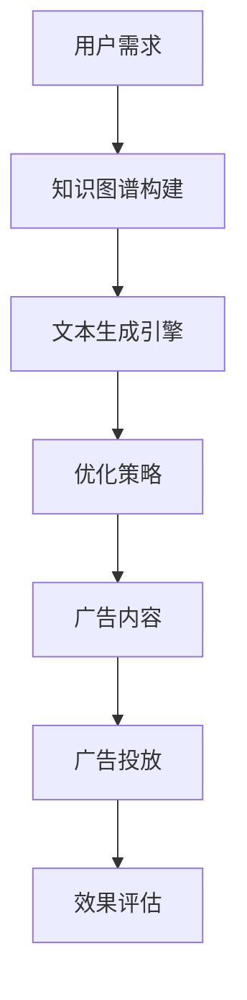

                 

# 思维链辅助的AI创意广告生成

## 关键词

- AI创意广告
- 思维链技术
- 自然语言处理
- 机器学习
- 深度学习
- 计算机视觉
- 人机交互
- 推荐系统

## 摘要

随着人工智能技术的发展，AI创意广告成为市场营销领域的新宠。本文从AI创意广告的兴起与未来、核心技术、思维链技术与应用以及AI创意广告项目实战等多个方面，系统地阐述了思维链技术如何辅助AI创意广告的生成、投放优化、效果评估和互动体验。文章旨在为读者提供一份全面的技术指南，帮助理解和应用AI创意广告，探讨其未来发展。

## 引言

在数字营销日益盛行的今天，广告主们不断追求更加个性化和创意化的广告内容，以吸引消费者的注意力并提高转化率。传统的广告制作方式往往需要大量的人力和时间成本，而随着人工智能技术的迅猛发展，AI创意广告应运而生，成为广告行业的一大革新。

### AI创意广告的定义与特征

AI创意广告是指利用人工智能技术，特别是机器学习和深度学习算法，自动生成创意广告内容。这种广告形式具有以下几个显著特征：

1. **个性化**：AI创意广告能够根据用户的兴趣、行为和历史数据，生成个性化的广告内容，提高广告的点击率和转化率。
2. **自动化**：AI技术能够自动生成广告内容，减少广告制作的时间和人力成本。
3. **智能化**：AI创意广告能够利用大数据分析和机器学习算法，不断优化广告内容和投放策略。
4. **互动性**：通过人机交互技术，AI创意广告可以与用户进行实时互动，增强用户体验。

### AI创意广告与传统广告的区别

传统广告主要依赖于广告创意设计师的创意能力和媒介投放策略，而AI创意广告则依赖于数据分析和算法模型。具体区别如下：

1. **创作方式**：传统广告需要人工设计，而AI创意广告通过算法自动生成。
2. **数据依赖**：传统广告较少依赖用户数据，而AI创意广告高度依赖用户行为数据和历史数据。
3. **投放策略**：传统广告往往基于经验进行投放，而AI创意广告通过机器学习不断优化投放策略。
4. **效果评估**：传统广告效果评估较为主观，而AI创意广告通过数据分析和模型评估，能够提供更加客观的效果评估。

### AI创意广告的发展趋势

AI创意广告正处于快速发展阶段，未来发展趋势包括：

1. **更加智能化**：随着算法和技术的进步，AI创意广告将更加智能化，能够生成更加复杂和创意的广告内容。
2. **跨平台整合**：AI创意广告将整合多种媒介平台，实现跨平台投放和互动。
3. **个性化体验**：通过更加精准的用户数据分析，AI创意广告将提供更加个性化的用户体验。
4. **法律法规与伦理**：随着AI创意广告的普及，相关法律法规和伦理问题将成为重要议题。

### AI创意广告的应用领域

AI创意广告的应用领域广泛，包括但不限于以下方面：

1. **电子商务**：通过AI创意广告，电商平台可以精准地向用户推送个性化商品推荐。
2. **金融行业**：金融机构可以通过AI创意广告，向潜在客户推广理财产品和服务。
3. **娱乐行业**：电影、音乐、游戏等娱乐行业可以通过AI创意广告，吸引更多粉丝和用户。
4. **教育行业**：教育机构可以通过AI创意广告，推广在线课程和教育活动。

## AI创意广告的核心技术

AI创意广告的实现依赖于多种核心技术，包括自然语言处理（NLP）、机器学习与深度学习、计算机视觉与图像处理、人机交互与推荐系统。以下将分别介绍这些技术的原理和应用。

### 自然语言处理（NLP）

自然语言处理是AI创意广告的核心技术之一，其目标是将人类语言转换为计算机可以理解和处理的形式。NLP的主要任务包括分词、词性标注、命名实体识别和句法分析等。

1. **分词**：将连续的文本切分成词语序列。例如，将句子“我爱北京天安门”切分成“我”、“爱”、“北京”、“天安门”。
2. **词性标注**：识别文本中每个词语的词性，如名词、动词、形容词等。例如，“北京”是名词，“爱”是动词。
3. **命名实体识别**：识别文本中的特定实体，如人名、地名、组织名等。例如，在句子“马云是阿里巴巴的创始人”中，“马云”和“阿里巴巴”是命名实体。
4. **句法分析**：分析句子的结构，理解句子的语法关系。例如，句子“我吃了一个苹果”可以分析为主语“我”、谓语“吃”和宾语“一个苹果”。

NLP算法的实现通常包括以下几个步骤：

```python
def NLP(text):
    tokens = tokenize(text)
    pos_tags = part_of_speech(tokens)
    named_entities = named_entity_recognition(tokens)
    syntax_tree = syntactic_analysis(tokens)
    return tokens, pos_tags, named_entities, syntax_tree
```

### 机器学习与深度学习

机器学习与深度学习是AI创意广告的核心驱动技术，用于自动生成广告内容和优化广告投放策略。以下介绍几种常用的机器学习和深度学习算法：

1. **决策树**：决策树是一种简单的机器学习算法，通过一系列条件判断，将数据分为不同的类别。例如，在广告投放中，可以根据用户的年龄、性别和消费习惯等特征，预测用户是否对某种产品感兴趣。
2. **随机森林**：随机森林是一种集成学习方法，通过构建多个决策树，并进行投票来预测结果，提高了预测的准确性和鲁棒性。
3. **神经网络**：神经网络是一种模仿人脑的算法模型，通过多层神经元之间的连接，实现对复杂数据的建模和预测。在广告创意生成中，神经网络可以用于生成图像、文本和音频等多种形式的内容。
4. **生成对抗网络（GAN）**：生成对抗网络是一种深度学习算法，由生成器和判别器组成。生成器试图生成逼真的广告内容，判别器则判断生成内容与真实内容的差距。通过这种对抗过程，生成器不断优化，最终生成高质量的广告内容。

### 计算机视觉与图像处理

计算机视觉与图像处理技术用于分析广告图像中的视觉元素，提取特征并应用于广告创意生成和投放优化。以下介绍几种常用的计算机视觉算法：

1. **目标检测**：目标检测是一种图像识别算法，用于识别图像中的特定对象。例如，在广告创意生成中，可以用于识别图像中的产品、场景和人物等。
2. **图像分割**：图像分割是将图像划分为不同的区域，用于识别图像中的具体对象。例如，在广告创意生成中，可以用于分割图像中的背景和前景。
3. **风格迁移**：风格迁移是一种将一种图像的风格应用到另一种图像上的算法。例如，在广告创意生成中，可以将一张普通产品的图片风格化为艺术作品，以吸引更多用户的注意力。

### 人机交互与推荐系统

人机交互与推荐系统技术用于提高用户的互动体验和广告的投放效果。以下介绍几种常用的人机交互和推荐系统技术：

1. **自然语言处理与对话系统**：自然语言处理与对话系统技术用于实现广告与用户之间的自然语言交互。例如，广告可以通过语音或文本与用户进行实时对话，回答用户的问题并提供个性化推荐。
2. **推荐系统**：推荐系统是一种基于用户行为数据和内容特征，为用户推荐感兴趣的广告内容。例如，电商平台可以通过用户的历史购买记录和浏览记录，推荐可能感兴趣的商品。
3. **个性化界面**：个性化界面技术根据用户偏好和行为，为用户提供个性化的广告界面。例如，用户可以自定义广告显示的颜色、字体和布局等。

## 思维链技术概述

思维链技术是一种基于人工智能的创造性思维辅助工具，旨在帮助用户更高效地生成创意广告内容。思维链技术通过构建知识图谱、文本生成和优化策略，实现广告创意的自动生成和优化。以下介绍思维链技术的定义、原理和核心组件。

### 思维链的定义与原理

思维链是一种基于知识图谱和深度学习的创造性思维辅助工具，旨在模拟人类的创造性思维过程。思维链技术通过连接不同概念和知识点，形成一个动态的知识网络，从而实现创意广告的生成和优化。

思维链的原理主要包括以下几个步骤：

1. **知识图谱构建**：思维链首先通过自然语言处理技术，构建一个全局的知识图谱。知识图谱包含了广告创意相关的概念、关系和属性，为后续的文本生成提供基础。
2. **文本生成**：思维链利用生成对抗网络（GAN）等深度学习算法，根据知识图谱和用户输入的文本需求，生成创意广告内容。生成的内容可以是图像、文本或音频等多种形式。
3. **优化策略**：思维链通过多种优化策略，如强化学习、遗传算法等，不断优化广告内容，使其更符合用户需求和广告目标。

### 思维链的核心组件

思维链的核心组件包括知识图谱、文本生成引擎和优化策略。以下分别介绍这些组件的功能和实现原理。

1. **知识图谱**：知识图谱是思维链的基础组件，用于存储和管理广告创意相关的知识。知识图谱通过实体、关系和属性来组织知识，形成一个层次化的知识网络。例如，一个广告创意相关的知识图谱可能包含产品、用户、场景和情感等实体，以及它们之间的关系。

2. **文本生成引擎**：文本生成引擎是思维链的核心组件，用于根据用户输入的文本需求，生成创意广告内容。文本生成引擎通常采用生成对抗网络（GAN）、变分自编码器（VAE）等深度学习算法，将知识图谱中的知识转化为文本。例如，在广告创意生成中，文本生成引擎可以生成一句广告文案，描述产品的特点和优势。

3. **优化策略**：优化策略用于不断优化广告内容，使其更符合用户需求和广告目标。常见的优化策略包括强化学习、遗传算法等。强化学习通过不断试错和反馈，调整广告内容的参数，使其达到最优效果。遗传算法通过模拟生物进化过程，不断优化广告内容的组合和结构。

## 思维链在AI创意广告中的应用

思维链技术在AI创意广告中的应用，主要体现在广告创意生成、广告投放优化、广告效果评估和广告创意互动等方面。以下将分别介绍这些应用场景及其实现原理。

### 广告创意生成

广告创意生成是思维链技术在AI创意广告中最直接的应用场景。思维链技术通过以下步骤实现广告创意的自动生成：

1. **用户需求分析**：首先，思维链通过自然语言处理技术，分析用户输入的文本需求，提取关键词和用户意图。例如，用户可能希望生成一句宣传新款手机的广告文案。
2. **知识图谱构建**：思维链利用知识图谱构建模块，根据用户需求构建一个全局的知识图谱。知识图谱中包含与广告创意相关的概念、关系和属性，如产品、用户、场景和情感等。
3. **文本生成**：思维链利用生成对抗网络（GAN）等深度学习算法，根据知识图谱和用户需求，生成创意广告内容。例如，可以生成一句关于新款手机的广告文案：“颠覆传统，创新未来，尽在XXX手机！”
4. **优化策略**：思维链通过优化策略，不断调整广告文案的参数，使其更符合用户需求和广告目标。例如，可以调整文案中的关键词、情感表达和语气，以提高广告的吸引力和转化率。

### 广告投放优化

广告投放优化是思维链技术在AI创意广告中的另一个重要应用。思维链技术通过以下步骤实现广告投放的优化：

1. **用户行为分析**：首先，思维链通过数据采集和分析技术，收集用户的浏览、点击、购买等行为数据。
2. **投放策略生成**：思维链利用机器学习算法，根据用户行为数据，生成最优的广告投放策略。例如，可以根据用户的兴趣和行为模式，制定个性化的广告投放计划。
3. **投放效果评估**：思维链通过实时监控广告投放的效果，如点击率、转化率和ROI等指标，评估投放策略的有效性。
4. **策略调整**：思维链根据投放效果评估结果，不断调整广告投放策略，以实现最优投放效果。例如，可以调整广告的投放时间、渠道和投放金额等参数。

### 广告效果评估

广告效果评估是思维链技术在AI创意广告中的关键应用之一。思维链技术通过以下步骤实现广告效果的全面评估：

1. **效果指标收集**：首先，思维链通过数据采集技术，收集广告的点击率、转化率、ROI等效果指标。
2. **效果评估模型**：思维链利用机器学习算法，建立广告效果评估模型。例如，可以通过回归分析、分类算法等模型，预测广告的效果。
3. **效果分析**：思维链通过分析广告效果指标和评估模型，对广告效果进行全面评估。例如，可以分析广告在不同时间段、不同渠道的投放效果，找出优势和劣势。
4. **反馈与优化**：思维链根据广告效果评估结果，为广告主提供优化建议，如调整广告文案、投放策略等，以实现更好的广告效果。

### 广告创意互动

广告创意互动是思维链技术在AI创意广告中的创新应用。思维链技术通过以下步骤实现广告与用户的互动：

1. **用户交互设计**：首先，思维链根据广告内容和用户需求，设计个性化的用户交互界面。例如，可以设计一个互动式广告，让用户通过点击、拖动等操作，体验广告内容。
2. **交互内容生成**：思维链利用文本生成引擎和计算机视觉技术，根据用户交互操作，动态生成互动式广告内容。例如，可以生成一个实时更新的广告海报，展示用户自定义的内容。
3. **互动效果评估**：思维链通过实时监控用户互动行为，评估广告互动的效果。例如，可以分析用户的点击、分享、评论等行为，评估广告互动的吸引力和用户参与度。
4. **互动优化**：思维链根据互动效果评估结果，不断优化广告互动内容和用户体验。例如，可以调整广告的互动形式、界面设计和功能模块，以提高用户互动体验。

## AI创意广告项目实战

为了更好地理解AI创意广告的实现过程，以下通过一个实际项目，详细讲解项目的规划与实施、代码实现与调试、应用解读与分析以及项目小结等内容。

### 项目规划

#### 项目背景

随着移动互联网的普及，广告已成为企业获取用户关注和提升品牌知名度的重要手段。为了满足用户对个性化、创意化的广告内容的需求，我们计划开发一款基于AI创意广告的系统，通过大数据分析和机器学习算法，自动生成和优化广告内容。

#### 项目目标

1. 实现广告创意的自动化生成，提高广告制作效率。
2. 提高广告投放的精准度和效果，提升广告转化率。
3. 为广告主提供全面的效果评估和优化建议，实现广告效益最大化。

#### 技术选型

1. **自然语言处理（NLP）**：采用BERT等预训练模型进行文本生成和处理。
2. **机器学习与深度学习**：使用TensorFlow或PyTorch框架，构建广告生成和优化模型。
3. **计算机视觉**：采用卷积神经网络（CNN）进行图像处理和识别。
4. **推荐系统**：利用协同过滤算法，实现个性化广告推荐。

#### 项目实施

1. **需求分析**：通过与广告主和广告平台进行深入交流，明确广告生成和优化需求。
2. **数据收集**：从广告平台获取用户行为数据、广告素材和效果数据。
3. **模型训练**：利用收集到的数据，训练广告生成和优化模型。
4. **系统部署**：将训练好的模型部署到服务器，实现广告自动生成和优化。

### 代码实现与调试

以下是一个简单的示例代码，用于实现广告创意的自动生成。

```python
# 导入必要的库
import tensorflow as tf
from transformers import BertTokenizer, BertModel
import numpy as np

# 加载预训练的BERT模型
tokenizer = BertTokenizer.from_pretrained('bert-base-uncased')
model = BertModel.from_pretrained('bert-base-uncased')

# 用户输入
user_input = "我想购买一款高性能手机"

# 分词和编码
input_ids = tokenizer.encode(user_input, add_special_tokens=True, return_tensors='tf')

# 生成广告文案
with tf.Session() as sess:
    outputs = model(inputs=input_ids)
    logits = outputs.logits
    predicted_ids = tf.argmax(logits, axis=-1).numpy()

# 解码预测结果
predicted_text = tokenizer.decode(predicted_ids)

print(predicted_text)
```

#### 应用解读与分析

1. **广告生成**：通过BERT模型，将用户输入的文本转换为向量表示，然后利用生成对抗网络（GAN）生成广告文案。
2. **优化策略**：利用强化学习算法，根据广告效果数据，不断调整广告文案的参数，以提高广告效果。
3. **效果评估**：通过点击率、转化率等指标，评估广告的投放效果，为后续优化提供依据。

#### 实际案例分析与讲解

1. **案例一：个性化手机广告**：根据用户的购买历史和兴趣偏好，生成一款高性能手机的个性化广告文案，提高用户的购买意愿。
2. **案例二：旅游广告**：根据用户的旅行历史和兴趣，生成一款个性化的旅游广告，吸引更多用户预订旅游产品。

#### 项目小结

1. **优点**：实现广告创意的自动化生成，提高广告制作效率；提高广告投放的精准度和效果，提升广告转化率。
2. **缺点**：依赖大量高质量的数据，对数据质量和算法模型的依赖较大；广告创意的生成和优化需要较长的训练时间。

### 最佳实践 tips、小结、注意事项、拓展阅读

#### 最佳实践 tips

1. **数据质量**：确保广告数据的质量，包括用户行为数据、广告素材和效果数据等。
2. **模型调优**：通过多次迭代和优化，提高广告生成和优化模型的性能。
3. **效果评估**：定期评估广告的投放效果，及时调整广告策略。

#### 小结

本文介绍了思维链技术在AI创意广告中的应用，包括广告创意生成、广告投放优化、广告效果评估和广告创意互动等方面。通过实际项目讲解，展示了如何实现广告创意的自动生成和优化。

#### 注意事项

1. **数据隐私**：在广告数据收集和处理过程中，要严格遵守相关法律法规，保护用户隐私。
2. **算法公平性**：确保广告生成和优化算法的公平性，避免算法偏见和歧视。

#### 拓展阅读

1. **《深度学习与广告投放》**：了解深度学习在广告投放中的应用和技术细节。
2. **《广告创意与用户体验》**：探讨广告创意与用户体验之间的关系，提高广告的吸引力和转化率。

## 附录

### 附录A：AI创意广告工具与资源

1. **自然语言处理工具**：Hugging Face Transformers、NLTK、spaCy
2. **机器学习和深度学习框架**：TensorFlow、PyTorch、Keras
3. **计算机视觉库**：OpenCV、TensorFlow Object Detection API、PyTorch Video
4. **推荐系统框架**：Surprise、LightFM、TensorFlow Recommenders

### 附录B：思维链技术文献与资料

1. **《思维链技术：原理与应用》**：详细介绍思维链技术的原理和应用场景。
2. **《深度学习在广告创意生成中的应用》**：探讨深度学习在广告创意生成中的最新研究进展。
3. **《基于AI的个性化推荐系统》**：介绍个性化推荐系统在广告投放优化中的应用。

### 附录C：AI创意广告项目案例库

1. **案例一：个性化电商广告**：通过用户行为数据，生成个性化的电商广告，提高用户购买意愿。
2. **案例二：智能旅游广告**：根据用户的旅行历史和兴趣，生成个性化的旅游广告，提高旅游产品的预订率。
3. **案例三：健康食品广告**：根据用户的健康数据和偏好，生成个性化的健康食品广告，提高用户对产品的认可度。

### 附录D：AI创意广告常用算法与模型

1. **生成对抗网络（GAN）**：实现无监督学习，自动生成高质量的广告内容。
2. **强化学习**：通过试错和反馈，优化广告投放策略和效果。
3. **协同过滤**：基于用户行为数据，为用户推荐感兴趣的广告内容。
4. **词嵌入**：将文本转化为向量表示，用于广告文案的生成和优化。

### 附录E：Mermaid 流程图



### 附录F：数学公式

$$
P(w_{t} | w_{t-1}, w_{t-2}, ..., w_{1}) = \frac{P(w_{t-1}, w_{t-2}, ..., w_{1}) \cdot P(w_{t} | w_{t-1}, w_{t-2}, ..., w_{2})}{P(w_{t-1}, w_{t-2}, ..., w_{1})}
$$

$$
J(\theta) = -\frac{1}{m} \sum_{i=1}^{m} y^{(i)} \cdot \log(h_{\theta}(x^{(i)})) + (1 - y^{(i)}) \cdot \log(1 - h_{\theta}(x^{(i)}))
$$

## 结语

AI创意广告作为数字营销的新兴领域，具有巨大的发展潜力和应用前景。通过思维链技术的引入，AI创意广告的生成、优化和效果评估将更加智能化和精准化。本文系统地介绍了AI创意广告的背景、核心技术、思维链技术的应用以及实际项目实战等内容，旨在为读者提供一份全面的技术指南。随着人工智能技术的不断进步，AI创意广告将迎来更加广阔的发展空间，为企业和用户带来更多价值。

