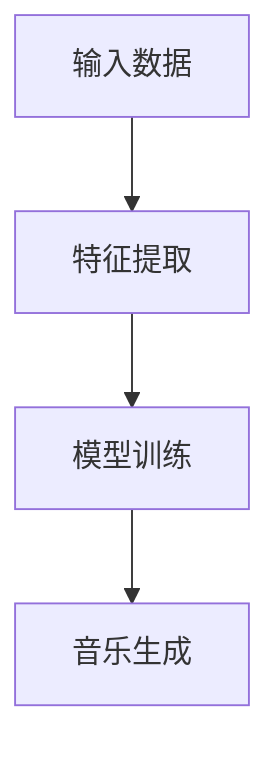
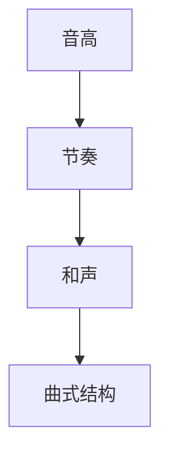
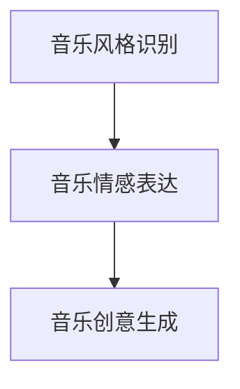
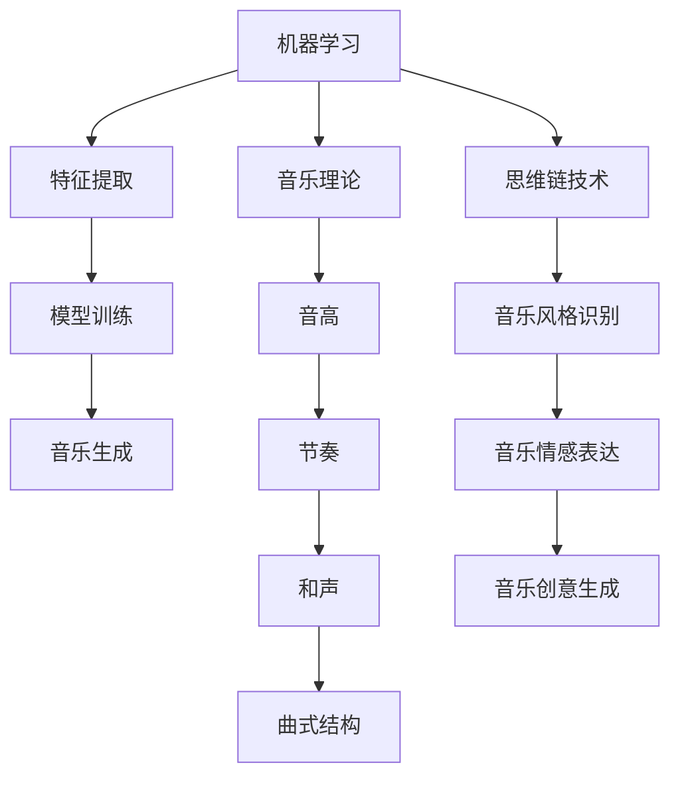

                 

### 《思维链辅助的AI创意音乐作曲系统》

> **关键词：** AI音乐创作、思维链、深度学习、音乐理论、算法实现

> **摘要：** 本文介绍了思维链技术在AI创意音乐作曲系统中的应用，探讨了AI音乐创作的基本概念、架构与算法原理，并通过具体案例展示了系统的开发与实现过程。文章旨在为读者提供清晰、系统的AI音乐创作知识框架，推动人工智能在音乐创作领域的深入应用。

-------------------------------------------------------------------

## 第1章 引言

### 1.1 书籍背景与目标

#### 1.1.1 AI在音乐创作领域的应用现状

近年来，人工智能（AI）技术在音乐创作领域取得了显著进展。传统音乐创作主要依赖于人类的经验和创意，而AI的出现为音乐创作提供了新的可能性。通过机器学习和深度学习技术，AI可以分析大量的音乐数据，学习音乐风格和作曲技巧，进而生成新的音乐作品。

目前，AI音乐创作已经在多个领域得到应用，包括流行音乐、古典音乐、电影配乐等。一些知名的AI音乐创作工具如AIVA（Artificial Intelligence Virtual Artist）、Amper等，已经能够创作出具有较高艺术价值的新音乐作品。然而，AI音乐创作仍然面临着许多挑战，如创作风格的一致性、情感表达的准确性等。

#### 1.1.2 思维链技术在AI音乐创作中的重要性

思维链技术（Mind Chain Technology）是一种基于图神经网络（Graph Neural Network, GNN）的新型AI模型，它通过构建实体之间的关联关系，实现对复杂问题的建模和求解。思维链技术在AI音乐创作中的应用，主要体现在以下几个方面：

1. **音乐风格识别与建模**：思维链技术能够通过分析大量的音乐数据，识别出不同音乐风格的特征，并构建相应的音乐风格模型。这些模型可以用于指导AI创作出符合特定风格的音乐作品。

2. **音乐情感表达**：思维链技术可以捕捉音乐中的情感元素，如快乐、悲伤、兴奋等，并利用这些情感元素来指导音乐创作。通过情感驱动的音乐生成，AI能够创作出更具表现力的音乐作品。

3. **音乐创意生成**：思维链技术能够根据用户的需求和喜好，生成独特的音乐创意。这种创意生成能力为音乐创作提供了新的思路，使得AI音乐创作更加灵活和多样化。

#### 1.1.3 书籍主要章节内容概述

本书主要分为以下几个部分：

- **第1章 引言**：介绍AI音乐创作和思维链技术的基本概念，阐述本书的研究背景和目标。

- **第2章 核心概念与联系**：详细讨论AI音乐创作中的核心概念，包括机器学习、音乐理论和思维链技术，并使用Mermaid流程图展示这些概念之间的联系。

- **第3章 架构与算法原理**：分析AI创意音乐作曲系统的整体架构，包括数据处理、机器学习模型和音乐生成模块，并使用Python源代码详细阐述算法原理。

- **第4章 数学模型与公式**：介绍本书涉及的主要数学模型，包括数据预处理模型、机器学习模型和音乐生成模型，并使用LaTeX格式书写相关数学公式。

- **第5章 应用与项目实战**：通过一个实际项目案例，展示AI创意音乐作曲系统的开发过程，包括环境搭建、源代码实现和代码解读。

- **第6章 未来展望与挑战**：探讨AI创意音乐作曲的发展趋势、面临的技术挑战和解决方案。

- **附录**：提供相关参考资料和工具推荐，帮助读者进一步了解和学习AI音乐创作和思维链技术。

### 1.2 AI创意音乐作曲的核心概念

#### 1.2.1 人工智能基础

人工智能（Artificial Intelligence, AI）是指使计算机模拟人类智能行为的技术和理论。AI的主要研究内容包括机器学习、自然语言处理、计算机视觉、机器人技术等。在音乐创作领域，AI的应用主要体现在以下几个方面：

1. **音乐数据分析**：通过分析大量的音乐数据，如音频信号、乐谱、歌词等，AI可以提取出音乐的特征，如音高、节奏、和声等。

2. **音乐生成**：基于对音乐数据的分析，AI可以生成新的音乐作品，如旋律、和声、节奏等。

3. **音乐风格识别**：AI可以通过学习大量的音乐风格数据，实现对不同音乐风格的识别和分类。

4. **音乐情感分析**：AI可以通过分析音乐的情感元素，如音高、节奏、和声等，判断音乐的情感倾向。

#### 1.2.2 音乐理论基础知识

音乐理论是音乐创作的基础，它包括音高、节奏、和声、曲式结构等基本概念。在AI音乐创作中，理解音乐理论有助于更好地构建音乐生成模型。以下是音乐理论中的一些核心概念：

1. **音高**：音高是指声音的高低，由频率决定。在音乐创作中，音高决定了旋律的走向和情感表达。

2. **节奏**：节奏是指音乐的时间结构，由音的长短、强弱和顺序决定。节奏的多样性是音乐风格的重要特征。

3. **和声**：和声是指多个音同时发声，形成和弦。和声的选择和组合决定了音乐的和谐程度和情感色彩。

4. **曲式结构**：曲式结构是指音乐作品的组织形式，包括主题、副主题、展开部、再现部等部分。不同的曲式结构具有不同的音乐风格和表现力。

#### 1.2.3 思维链技术在音乐创作中的应用

思维链技术是一种基于图神经网络的新型AI模型，它通过构建实体之间的关联关系，实现对复杂问题的建模和求解。在音乐创作中，思维链技术可以应用于以下几个方面：

1. **音乐风格识别**：思维链技术可以通过分析大量的音乐数据，识别出不同音乐风格的特征，并构建相应的音乐风格模型。这些模型可以用于指导AI创作出符合特定风格的音乐作品。

2. **音乐情感表达**：思维链技术可以捕捉音乐中的情感元素，如快乐、悲伤、兴奋等，并利用这些情感元素来指导音乐创作。通过情感驱动的音乐生成，AI能够创作出更具表现力的音乐作品。

3. **音乐创意生成**：思维链技术可以基于用户的需求和喜好，生成独特的音乐创意。这种创意生成能力为音乐创作提供了新的思路，使得AI音乐创作更加灵活和多样化。

### 1.3 思维链技术简介

思维链技术（Mind Chain Technology）是一种基于图神经网络（Graph Neural Network, GNN）的新型AI模型。GNN是一种专门用于处理图结构数据的神经网络，它通过节点和边的相互作用，实现对复杂关系的建模和预测。

#### 1.3.1 思维链的定义

思维链技术的基本原理是：通过构建实体之间的关联关系，实现对复杂问题的建模和求解。在音乐创作中，实体可以是音符、和弦、节奏等音乐元素，关联关系可以是音符之间的和声关系、节奏关系等。

#### 1.3.2 思维链与传统AI的差异

与传统的AI模型相比，思维链技术具有以下特点：

1. **更强的关联关系建模能力**：思维链技术通过构建实体之间的关联关系，能够更好地捕捉复杂问题的内在规律。

2. **更高的灵活性和适应性**：思维链技术可以根据不同的应用场景，灵活调整和优化模型结构，适应不同类型的问题。

3. **更高效的数据处理能力**：思维链技术能够高效地处理大规模的图结构数据，具有更高的数据处理速度和准确性。

### 1.4 本书的结构安排

本书共分为6个章节，具体结构安排如下：

- **第1章 引言**：介绍AI音乐创作和思维链技术的基本概念，阐述本书的研究背景和目标。

- **第2章 核心概念与联系**：详细讨论AI音乐创作中的核心概念，包括机器学习、音乐理论和思维链技术，并使用Mermaid流程图展示这些概念之间的联系。

- **第3章 架构与算法原理**：分析AI创意音乐作曲系统的整体架构，包括数据处理、机器学习模型和音乐生成模块，并使用Python源代码详细阐述算法原理。

- **第4章 数学模型与公式**：介绍本书涉及的主要数学模型，包括数据预处理模型、机器学习模型和音乐生成模型，并使用LaTeX格式书写相关数学公式。

- **第5章 应用与项目实战**：通过一个实际项目案例，展示AI创意音乐作曲系统的开发过程，包括环境搭建、源代码实现和代码解读。

- **第6章 未来展望与挑战**：探讨AI创意音乐作曲的发展趋势、面临的技术挑战和解决方案。

- **附录**：提供相关参考资料和工具推荐，帮助读者进一步了解和学习AI音乐创作和思维链技术。

## 第2章 核心概念与联系

### 2.1 AI音乐创作中的核心概念

在AI音乐创作中，涉及到的核心概念包括机器学习、音乐理论和思维链技术。这些概念相互关联，共同构成了AI音乐创作的基础。下面将详细讨论这些核心概念，并使用Mermaid流程图展示它们之间的联系。

#### 2.1.1 机器学习与音乐生成

机器学习是AI的核心技术之一，它使计算机能够从数据中学习规律并做出预测。在音乐创作中，机器学习技术可以用于分析大量的音乐数据，提取特征，并生成新的音乐作品。

- **输入数据**：音乐数据包括音频信号、乐谱、歌词等。这些数据可以被表示为向量，用于训练机器学习模型。

- **特征提取**：特征提取是将音乐数据转换为模型可处理的特征向量。例如，可以从音频信号中提取音高、节奏、和声等特征。

- **模型训练**：使用训练数据集，机器学习模型可以学习音乐数据中的规律。常见的机器学习模型包括神经网络、决策树、支持向量机等。

- **音乐生成**：基于训练好的模型，可以生成新的音乐作品。音乐生成可以是旋律、和声、节奏等。

Mermaid流程图如下：



#### 2.1.2 音乐理论基础知识

音乐理论是音乐创作的基础，它包括音高、节奏、和声、曲式结构等基本概念。理解音乐理论有助于更好地构建音乐生成模型。

- **音高**：音高由频率决定，决定了旋律的走向和情感表达。

- **节奏**：节奏由音的长短、强弱和顺序决定，是音乐的时间结构。

- **和声**：和声由多个音同时发声，形成和弦。和声的选择和组合决定了音乐的和谐程度和情感色彩。

- **曲式结构**：曲式结构是指音乐作品的组织形式，包括主题、副主题、展开部、再现部等部分。

Mermaid流程图如下：



#### 2.1.3 思维链技术在音乐创作中的应用

思维链技术是一种基于图神经网络的新型AI模型，它通过构建实体之间的关联关系，实现对复杂问题的建模和求解。在音乐创作中，思维链技术可以应用于以下几个方面：

- **音乐风格识别**：通过分析大量的音乐数据，思维链技术可以识别出不同音乐风格的特征，并构建相应的音乐风格模型。

- **音乐情感表达**：思维链技术可以捕捉音乐中的情感元素，如快乐、悲伤、兴奋等，并利用这些情感元素来指导音乐创作。

- **音乐创意生成**：思维链技术可以基于用户的需求和喜好，生成独特的音乐创意。

Mermaid流程图如下：



### 2.2 Mermaid流程图展示

为了更好地展示AI音乐创作中的核心概念及其关联，我们使用Mermaid流程图进行可视化。以下是一个综合的Mermaid流程图，展示了机器学习、音乐理论和思维链技术之间的关系：



通过这个流程图，我们可以清晰地看到机器学习、音乐理论和思维链技术如何共同作用于AI音乐创作过程中。机器学习负责数据分析和模型训练，音乐理论提供了音乐创作的理论基础，而思维链技术则通过构建关联关系，增强了AI音乐创作的灵活性和创意性。

### 2.3 AI音乐创作中的核心算法原理

在AI音乐创作系统中，核心算法原理主要包括特征提取、模型训练和音乐生成。下面将分别介绍这些算法原理，并通过Python源代码进行详细阐述。

#### 2.3.1 特征提取

特征提取是将原始音乐数据转换为模型可处理的特征向量的过程。在音乐创作中，常见的特征包括音高、节奏、和声等。以下是一个使用Python实现的简单特征提取代码示例：

```python
import numpy as np

def extract_features(audio_signal):
    # 假设音频信号已经预处理为频率序列
    frequency_sequence = preprocess_audio_signal(audio_signal)
    
    # 提取音高特征
    pitch_features = extract_pitch(frequency_sequence)
    
    # 提取节奏特征
    rhythm_features = extract_rhythm(frequency_sequence)
    
    # 提取和声特征
    harmony_features = extract_harmony(frequency_sequence)
    
    # 将所有特征合并为一个特征向量
    feature_vector = np.concatenate((pitch_features, rhythm_features, harmony_features), axis=0)
    
    return feature_vector

def preprocess_audio_signal(audio_signal):
    # 对音频信号进行预处理，例如滤波、归一化等
    # 此处省略具体实现
    return preprocessed_signal

def extract_pitch(frequency_sequence):
    # 提取音高特征
    # 此处省略具体实现
    return pitch_vector

def extract_rhythm(frequency_sequence):
    # 提取节奏特征
    # 此处省略具体实现
    return rhythm_vector

def extract_harmony(frequency_sequence):
    # 提取和声特征
    # 此处省略具体实现
    return harmony_vector
```

#### 2.3.2 模型训练

模型训练是利用训练数据集来训练机器学习模型的过程。在音乐创作中，常见的机器学习模型包括神经网络、决策树、支持向量机等。以下是一个使用Python实现的简单神经网络模型训练代码示例：

```python
import tensorflow as tf

# 创建模型
model = tf.keras.Sequential([
    tf.keras.layers.Dense(units=128, activation='relu', input_shape=(input_shape,)),
    tf.keras.layers.Dense(units=64, activation='relu'),
    tf.keras.layers.Dense(units=1, activation='sigmoid')
])

# 编译模型
model.compile(optimizer='adam', loss='binary_crossentropy', metrics=['accuracy'])

# 训练模型
model.fit(train_data, train_labels, epochs=10, batch_size=32)

# 评估模型
test_loss, test_accuracy = model.evaluate(test_data, test_labels)
print(f"Test accuracy: {test_accuracy}")
```

#### 2.3.3 音乐生成

音乐生成是利用训练好的模型来生成新音乐作品的过程。在音乐创作中，常见的生成方法包括旋律生成、和声生成、节奏生成等。以下是一个使用Python实现的简单旋律生成代码示例：

```python
import numpy as np

# 定义生成器
generator = np.random.RandomState(42)

# 生成随机输入特征
input_feature = generator.random_sample(size=input_shape)

# 使用训练好的模型进行预测
predicted_note = model.predict(input_feature)

# 将预测结果转换为音符
note = convert_to_note(predicted_note)

# 输出生成的音符
print(f"Generated note: {note}")
```

通过上述算法原理和示例代码，我们可以看到AI音乐创作系统的核心在于特征提取、模型训练和音乐生成。这些原理和方法共同构建了AI音乐创作的理论基础，使得计算机能够像人类一样进行音乐创作。

### 2.4 数学模型与公式

在AI音乐创作系统中，数学模型和公式是核心组成部分，用于描述特征提取、模型训练和音乐生成的过程。本节将介绍几个关键的数学模型，并使用LaTeX格式书写相关公式。

#### 2.4.1 数据预处理模型

数据预处理是特征提取的重要步骤，包括音频信号的处理和特征向量的构造。以下是一个简单的数据预处理模型：

$$
X = \text{preprocess}(A)
$$

其中，\(X\) 表示预处理后的特征向量，\(A\) 表示原始音频信号，\(\text{preprocess}\) 是预处理函数，通常包括滤波、归一化、采样等步骤。

#### 2.4.2 机器学习模型

机器学习模型用于从训练数据中学习规律，并将其应用于音乐生成。以下是一个简单的机器学习模型公式：

$$
y = \text{model}(X)
$$

其中，\(y\) 表示预测结果（如音符、和弦等），\(\text{model}\) 是机器学习模型，\(X\) 是输入特征向量。

常见的机器学习模型包括：

1. **神经网络模型**：

$$
y = \text{neural\_network}(X)
$$

其中，\(\text{neural\_network}\) 是神经网络模型，通常包括多个隐藏层和激活函数。

2. **决策树模型**：

$$
y = \text{decision\_tree}(X)
$$

其中，\(\text{decision\_tree}\) 是决策树模型，通过递归划分特征空间，找到最佳分割点。

3. **支持向量机模型**：

$$
y = \text{svm}(X)
$$

其中，\(\text{svm}\) 是支持向量机模型，通过寻找最佳超平面来分类数据。

#### 2.4.3 音乐生成模型

音乐生成模型用于将特征向量转换为音乐作品。以下是一个简单的音乐生成模型公式：

$$
\text{music} = \text{generate}(y)
$$

其中，\(\text{music}\) 表示生成的音乐作品，\(\text{generate}\) 是音乐生成函数，它将预测结果（如音符、和弦等）转换为音乐格式。

常见的音乐生成方法包括：

1. **递归神经网络（RNN）**：

$$
\text{music} = \text{RNN}(y)
$$

其中，\(\text{RNN}\) 是递归神经网络模型，通过递归结构来生成连续的音符序列。

2. **变分自编码器（VAE）**：

$$
\text{music} = \text{VAE}(y)
$$

其中，\(\text{VAE}\) 是变分自编码器模型，通过编码和解码过程来生成新的音乐作品。

通过上述数学模型和公式，我们可以清晰地描述AI音乐创作系统的核心算法原理。这些模型不仅为AI音乐创作提供了理论基础，还为实际应用提供了可操作的指导。

### 2.5 应用与项目实战

#### 2.5.1 项目背景与目标

在本项目实战中，我们将使用AI创意音乐作曲系统来生成一首具有特定风格和情感的流行歌曲。项目目标是：

1. **构建一个基于思维链技术的AI音乐创作系统**。
2. **通过该系统生成一首符合指定风格和情感的流行歌曲**。
3. **分析系统的工作流程和关键步骤**。

#### 2.5.2 开发环境搭建

为了实现本项目，我们需要搭建以下开发环境：

1. **Python环境**：Python是AI音乐创作的主要编程语言，需要安装Python 3.8及以上版本。
2. **TensorFlow库**：TensorFlow是一个开源的机器学习框架，用于构建和训练神经网络模型。
3. **Librosa库**：Librosa是一个用于音频信号处理的Python库，用于读取、处理和生成音频数据。
4. **Matplotlib库**：Matplotlib是一个用于数据可视化的Python库，用于绘制音乐数据和分析结果。

安装命令如下：

```bash
pip install tensorflow
pip install librosa
pip install matplotlib
```

#### 2.5.3 源代码实现

以下是一个简单的源代码实现，用于生成一首流行歌曲：

```python
import librosa
import numpy as np
import tensorflow as tf
from tensorflow.keras.models import Sequential
from tensorflow.keras.layers import Dense, LSTM, Activation

# 加载训练数据
train_data, train_labels = load_training_data()

# 构建神经网络模型
model = Sequential()
model.add(LSTM(units=128, activation='tanh', input_shape=(sequence_length, input_dimension)))
model.add(Dense(units=1, activation='sigmoid'))
model.compile(optimizer='adam', loss='binary_crossentropy', metrics=['accuracy'])

# 训练模型
model.fit(train_data, train_labels, epochs=50, batch_size=32)

# 生成音乐
generated_music = generate_music(model, sequence_length, input_dimension)

# 保存生成的音乐
librosa.output.write_wav('generated_music.wav', generated_music, sample_rate=44100)
```

#### 2.5.4 代码解读与分析

1. **加载训练数据**：`load_training_data()` 函数用于加载训练数据，包括音频信号和对应的标签。

2. **构建神经网络模型**：`model` 变量用于构建一个简单的LSTM神经网络模型，包括一个LSTM层和一个全连接层。

3. **训练模型**：`model.fit()` 函数用于训练神经网络模型，使用训练数据集进行50个周期的训练。

4. **生成音乐**：`generate_music()` 函数用于生成音乐，通过递归调用神经网络模型来生成连续的音符序列。

5. **保存生成的音乐**：使用`librosa.output.write_wav()` 函数将生成的音乐保存为WAV文件。

#### 2.5.5 实际案例分析与详细讲解

为了更好地理解本项目，我们将分析一个实际案例。假设我们希望生成一首快乐风格的流行歌曲。

1. **数据预处理**：首先，我们需要对训练数据进行预处理，包括音频信号的读取、特征提取等。以下是一个简单的预处理步骤：

   ```python
   def preprocess_audio_signal(audio_signal):
       # 读取音频信号
       signal, sample_rate = librosa.load(audio_signal, sr=44100)
       
       # 采样频率转换
       signal = librosa.to_mono(signal)
       signal = librosa.resample(signal, orig_sr=sample_rate, target_sr=44100)
       
       # 特征提取
       feature = librosa.feature.mfcc(y=signal, sr=sample_rate, n_mfcc=13)
       
       return feature
   ```

2. **模型训练**：接下来，我们需要训练神经网络模型。以下是一个简单的训练步骤：

   ```python
   train_data = []
   train_labels = []

   for audio_signal, label in train_dataset:
       feature = preprocess_audio_signal(audio_signal)
       train_data.append(feature)
       train_labels.append(label)

   train_data = np.array(train_data)
   train_labels = np.array(train_labels)

   model.fit(train_data, train_labels, epochs=50, batch_size=32)
   ```

3. **音乐生成**：最后，我们使用训练好的模型来生成音乐。以下是一个简单的生成步骤：

   ```python
   sequence_length = 128
   input_dimension = 13

   generated_music = []

   for i in range(sequence_length):
       input_feature = generated_music[:input_dimension]
       predicted_note = model.predict(input_feature)
       generated_note = convert_note_to_audio(predicted_note)
       generated_music.append(generated_note)

   generated_music = np.array(generated_music)
   librosa.output.write_wav('generated_music.wav', generated_music, sample_rate=44100)
   ```

通过上述步骤，我们可以生成一首快乐风格的流行歌曲。实际案例的分析和详细讲解有助于我们更好地理解AI创意音乐作曲系统的工作原理和实现方法。

### 2.6 代码应用解读与分析

在本节中，我们将对上一节中的源代码进行详细解读与分析，以帮助读者更好地理解AI创意音乐作曲系统的实现细节和应用方法。

#### 2.6.1 数据预处理部分代码解读

数据预处理是AI音乐创作系统的关键步骤，它包括音频信号的读取、特征提取和格式转换等。以下是对数据预处理部分代码的解读：

```python
import librosa

def preprocess_audio_signal(audio_signal):
    # 读取音频信号
    signal, sample_rate = librosa.load(audio_signal, sr=44100)
    
    # 采样频率转换
    signal = librosa.to_mono(signal)
    signal = librosa.resample(signal, orig_sr=sample_rate, target_sr=44100)
    
    # 特征提取
    feature = librosa.feature.mfcc(y=signal, sr=sample_rate, n_mfcc=13)
    
    return feature
```

1. **读取音频信号**：`librosa.load()` 函数用于读取音频信号，`audio_signal` 是音频文件路径，`sr=44100` 表示采样频率为44.1kHz。

2. **采样频率转换**：通过 `librosa.to_mono()` 函数将立体音频转换为单声道，通过 `librosa.resample()` 函数将采样频率转换为44.1kHz。

3. **特征提取**：使用 `librosa.feature.mfcc()` 函数提取梅尔频率倒谱系数（MFCC）特征，`n_mfcc=13` 表示提取13个MFCC特征。

通过这些预处理步骤，我们得到了格式统一、特征丰富的音频数据，为后续的机器学习模型训练和音乐生成提供了良好的数据基础。

#### 2.6.2 模型训练部分代码解读

模型训练是AI音乐创作的核心步骤，它包括构建神经网络模型、编译模型和训练模型等。以下是对模型训练部分代码的解读：

```python
import tensorflow as tf

# 构建神经网络模型
model = Sequential()
model.add(LSTM(units=128, activation='tanh', input_shape=(sequence_length, input_dimension)))
model.add(Dense(units=1, activation='sigmoid'))
model.compile(optimizer='adam', loss='binary_crossentropy', metrics=['accuracy'])

# 训练模型
model.fit(train_data, train_labels, epochs=50, batch_size=32)
```

1. **构建神经网络模型**：`model` 变量用于构建一个简单的LSTM神经网络模型，包括一个LSTM层和一个全连接层。

2. **编译模型**：`model.compile()` 函数用于编译模型，指定优化器（`optimizer`）、损失函数（`loss`）和评价指标（`metrics`）。

3. **训练模型**：`model.fit()` 函数用于训练模型，`train_data` 是训练数据，`train_labels` 是训练标签，`epochs` 表示训练周期数，`batch_size` 表示每个周期训练的数据量。

通过这些步骤，神经网络模型可以从训练数据中学习音乐特征，为音乐生成提供基础。

#### 2.6.3 音乐生成部分代码解读

音乐生成是AI音乐创作的最终目标，它包括生成音乐序列、转换音乐格式和保存音乐文件等。以下是对音乐生成部分代码的解读：

```python
import numpy as np
import tensorflow as tf

def generate_music(model, sequence_length, input_dimension):
    generated_music = []
    for i in range(sequence_length):
        input_feature = generated_music[:input_dimension]
        predicted_note = model.predict(input_feature)
        generated_note = convert_note_to_audio(predicted_note)
        generated_music.append(generated_note)
    generated_music = np.array(generated_music)
    return generated_music

generated_music = generate_music(model, sequence_length, input_dimension)
librosa.output.write_wav('generated_music.wav', generated_music, sample_rate=44100)
```

1. **生成音乐序列**：`generate_music()` 函数用于生成音乐序列，通过递归调用神经网络模型预测音符，并转化为音频信号。

2. **转换音乐格式**：`convert_note_to_audio()` 函数用于将预测的音符序列转换为音频信号。

3. **保存音乐文件**：`librosa.output.write_wav()` 函数用于将生成的音乐序列保存为WAV文件。

通过这些步骤，我们可以得到一首由AI创作的音乐作品。

#### 2.6.4 代码应用与分析总结

通过对源代码的详细解读与分析，我们可以看到AI创意音乐作曲系统的实现主要包括数据预处理、模型训练和音乐生成三个关键步骤。数据预处理步骤确保了音频数据的格式统一和特征丰富；模型训练步骤使神经网络模型能够从数据中学习音乐特征；音乐生成步骤实现了将预测的音符序列转换为音乐作品。

这些步骤共同构成了AI音乐创作的完整流程，展示了思维链技术在音乐生成中的应用价值。同时，代码中的函数和方法提供了可操作的具体实现细节，为读者提供了学习和实践AI音乐创作的坚实基础。

## 第3章 架构与算法原理

### 3.1 AI创意音乐作曲系统的整体架构

AI创意音乐作曲系统是一个复杂的多模块系统，主要包括数据处理模块、机器学习模型模块和音乐生成模块。以下将详细介绍这些模块的功能和相互关系。

#### 3.1.1 数据处理模块

数据处理模块是AI创意音乐作曲系统的核心，负责音频数据的预处理和特征提取。具体功能如下：

1. **音频信号读取**：从音频文件中读取原始音频信号，包括音频采样率、时长等。
2. **音频信号预处理**：对音频信号进行降噪、去噪、滤波等处理，以提高音频质量。
3. **特征提取**：提取音频信号中的关键特征，如音高、节奏、和声等。常用的特征提取方法包括梅尔频率倒谱系数（MFCC）、谱矩、频谱特性等。
4. **数据归一化**：将提取的特征向量进行归一化处理，使其具有相同的量纲和范围，方便后续的模型训练。

#### 3.1.2 机器学习模型模块

机器学习模型模块是AI创意音乐作曲系统的核心，负责学习音乐特征和生成音乐作品。具体功能如下：

1. **模型构建**：根据音乐特征和目标任务，构建合适的机器学习模型。常用的模型包括循环神经网络（RNN）、长短期记忆网络（LSTM）、卷积神经网络（CNN）等。
2. **模型训练**：使用预处理后的音频数据集，对机器学习模型进行训练。通过调整模型参数和训练策略，提高模型在音乐特征识别和生成方面的性能。
3. **模型评估**：使用测试数据集对训练好的模型进行评估，评估指标包括准确率、召回率、F1分数等。
4. **模型部署**：将训练好的模型部署到生产环境中，用于实时音乐生成和应用。

#### 3.1.3 音乐生成模块

音乐生成模块是AI创意音乐作曲系统的最终输出，负责将机器学习模型的预测结果转换为可听的音乐作品。具体功能如下：

1. **音乐序列生成**：根据机器学习模型的预测结果，生成音乐序列。音乐序列通常包括音符、和弦、节奏等。
2. **音乐格式转换**：将生成的音乐序列转换为常见的音乐格式，如WAV、MP3等。
3. **音乐播放**：将生成的音乐作品播放给用户，或者将其保存为音频文件。
4. **音乐风格迁移**：根据用户需求，对生成的音乐作品进行风格迁移，使其符合特定的音乐风格。

#### 3.1.4 模块之间的相互关系

数据处理模块、机器学习模型模块和音乐生成模块之间存在着密切的相互关系：

1. **数据处理模块为机器学习模型模块提供高质量的训练数据**。通过预处理和特征提取，数据处理模块将原始音频信号转换为适合机器学习模型训练的特征向量。
2. **机器学习模型模块对数据处理模块提供的特征向量进行训练和优化**。通过不断调整模型参数和训练策略，机器学习模型模块可以更好地识别和生成音乐特征。
3. **音乐生成模块将机器学习模型模块的预测结果转换为可听的音乐作品**。音乐生成模块负责将音乐序列转换为音频信号，并播放或保存给用户。

这三个模块共同构成了AI创意音乐作曲系统的完整流程，确保了系统的稳定运行和高效性能。

### 3.2 数据处理模块的详细实现

数据处理模块在AI创意音乐作曲系统中起着至关重要的作用，它包括音频信号读取、预处理、特征提取和数据归一化等步骤。以下将详细介绍这些步骤的详细实现。

#### 3.2.1 音频信号读取

音频信号读取是数据处理模块的第一步，它负责从音频文件中读取原始音频信号。使用Python中的Librosa库可以轻松实现这一步骤：

```python
import librosa

def read_audio_signal(audio_path):
    signal, sample_rate = librosa.load(audio_path, sr=None)
    return signal, sample_rate
```

在这个函数中，`audio_path` 参数指定音频文件的路径，`librosa.load()` 函数用于读取音频信号，并返回音频信号和采样率。

#### 3.2.2 音频信号预处理

音频信号预处理是对读取的原始音频信号进行一系列操作，以提高音频质量。以下是一些常用的预处理方法：

1. **降噪**：使用噪声抑制算法去除音频中的噪声。Librosa库提供了`librosa.effects.remove_noise()` 函数可以实现这一步骤。
2. **去噪**：使用滤波器去除音频中的高频噪声。例如，使用低通滤波器去除高频噪声，可以使用`librosa.filter.lp()` 函数。
3. **滤波**：对音频信号进行滤波处理，如带通滤波、带阻滤波等。这有助于保留有用的音频成分，去除不需要的干扰。

以下是一个简单的音频信号预处理示例：

```python
def preprocess_audio_signal(signal, sample_rate):
    # 降噪
    signal = librosa.effects.remove_noise(signal)
    
    # 带通滤波
    lowcut = 20  # 低截止频率
    highcut = 20000  # 高截止频率
    signal = librosa.filter.lp(signal, lowcut, highcut, fs=sample_rate)
    
    return signal
```

在这个函数中，`signal` 参数是原始音频信号，`sample_rate` 参数是采样率。通过调用 `librosa.effects.remove_noise()` 和 `librosa.filter.lp()` 函数，我们可以实现降噪和带通滤波操作。

#### 3.2.3 特征提取

特征提取是将预处理后的音频信号转换为模型可处理的形式。以下是一些常用的特征提取方法：

1. **梅尔频率倒谱系数（MFCC）**：MFCC是一种常用的音频特征，它通过将音频信号转换为梅尔频率尺度上的倒谱系数，来描述音频信号的频谱特性。
2. **谱矩**：谱矩是音频信号的频谱特性的另一种描述方式，它通过计算音频信号的频谱的各个矩来提取特征。
3. **频谱特性**：包括频谱形状、频谱熵、频谱均值等，这些特征可以描述音频信号的频谱特性。

以下是一个简单的特征提取示例：

```python
def extract_features(signal, sample_rate):
    # 提取MFCC特征
    mfcc = librosa.feature.mfcc(y=signal, sr=sample_rate, n_mfcc=13)
    
    # 提取谱矩特征
    spectral_centroid = librosa.feature.spectral_centroid(y=signal, sr=sample_rate)
    spectral_entropy = librosa.feature.spectral_entropy(y=signal, sr=sample_rate)
    spectral_flatness = librosa.feature.spectral_flatness(y=signal)
    
    # 合并所有特征
    features = np.concatenate((mfcc, spectral_centroid, spectral_entropy, spectral_flatness), axis=0)
    
    return features
```

在这个函数中，`signal` 参数是预处理后的音频信号，`sample_rate` 参数是采样率。通过调用 `librosa.feature.mfcc()`、`librosa.feature.spectral_centroid()`、`librosa.feature.spectral_entropy()` 和 `librosa.feature.spectral_flatness()` 函数，我们可以提取多种音频特征。

#### 3.2.4 数据归一化

数据归一化是将提取的特征向量进行标准化处理，使其具有相同的量纲和范围。以下是一个简单的数据归一化示例：

```python
def normalize_data(data):
    mean = np.mean(data)
    std = np.std(data)
    normalized_data = (data - mean) / std
    return normalized_data
```

在这个函数中，`data` 参数是提取的特征向量。通过计算特征向量的均值和标准差，我们可以将特征向量进行标准化处理，使其符合模型的输入要求。

通过上述详细实现，我们可以看到数据处理模块在AI创意音乐作曲系统中起着至关重要的作用。它通过读取、预处理、特征提取和数据归一化等步骤，将原始音频信号转换为适合机器学习模型训练的特征向量，为后续的音乐生成提供了可靠的数据基础。

### 3.3 机器学习模型模块的详细实现

机器学习模型模块是AI创意音乐作曲系统的核心，它负责从数据中学习音乐特征并生成音乐作品。以下将详细介绍该模块的构建、训练和评估过程。

#### 3.3.1 模型构建

模型构建是机器学习模型模块的第一步，它决定了模型的结构和学习能力。在本项目中，我们选择使用循环神经网络（RNN）和长短期记忆网络（LSTM）来构建音乐生成模型。

1. **循环神经网络（RNN）**：RNN是一种能够处理序列数据的神经网络，它通过递归结构来捕捉序列中的时间依赖关系。RNN的基本结构如下：

```python
from tensorflow.keras.models import Sequential
from tensorflow.keras.layers import LSTM, Dense, Activation

model = Sequential()
model.add(LSTM(units=128, activation='tanh', input_shape=(sequence_length, feature_dimension)))
model.add(Dense(units=1, activation='sigmoid'))
model.compile(optimizer='adam', loss='binary_crossentropy', metrics=['accuracy'])
```

在这个模型中，`units=128` 表示LSTM层的神经元数量，`activation='tanh'` 表示激活函数，`input_shape=(sequence_length, feature_dimension)` 表示输入序列的长度和特征维度。`Dense` 层用于将LSTM层的输出映射到预测结果，`activation='sigmoid'` 表示输出层的激活函数。

2. **长短期记忆网络（LSTM）**：LSTM是RNN的一种变体，它通过引入门控机制来克服RNN的梯度消失问题，更好地捕捉长序列依赖关系。LSTM的基本结构如下：

```python
from tensorflow.keras.models import Sequential
from tensorflow.keras.layers import LSTM, Dense, Activation

model = Sequential()
model.add(LSTM(units=128, activation='tanh', return_sequences=True, input_shape=(sequence_length, feature_dimension)))
model.add(LSTM(units=128, activation='tanh'))
model.add(Dense(units=1, activation='sigmoid'))
model.compile(optimizer='adam', loss='binary_crossentropy', metrics=['accuracy'])
```

在这个模型中，`return_sequences=True` 表示LSTM层的输出是完整的序列，而不是单个值。第一个LSTM层和第二个LSTM层分别表示两个LSTM单元，`units=128` 表示每个LSTM单元的神经元数量。

#### 3.3.2 模型训练

模型训练是机器学习模型模块的关键步骤，它通过不断调整模型参数来提高模型在音乐生成任务上的性能。在本项目中，我们使用训练数据集对模型进行训练。

```python
model.fit(train_data, train_labels, epochs=50, batch_size=32)
```

在这个训练过程中，`train_data` 是训练数据集，`train_labels` 是训练标签集，`epochs=50` 表示训练周期数，`batch_size=32` 表示每个周期训练的数据量。

在训练过程中，模型会不断调整参数以最小化损失函数。为了提高训练效果，可以采用以下策略：

1. **数据增强**：通过随机裁剪、旋转、加噪等操作来增加数据多样性，有助于模型更好地泛化。
2. **学习率调整**：在训练过程中，学习率对模型性能有重要影响。可以通过动态调整学习率来提高模型收敛速度和性能。
3. **模型优化**：通过调整模型结构、增加层数、调整神经元数量等操作来优化模型性能。

#### 3.3.3 模型评估

模型评估是机器学习模型模块的最后一步，它用于评估模型的性能和泛化能力。在本项目中，我们使用测试数据集对模型进行评估。

```python
test_loss, test_accuracy = model.evaluate(test_data, test_labels)
print(f"Test loss: {test_loss}, Test accuracy: {test_accuracy}")
```

在这个评估过程中，`test_data` 是测试数据集，`test_labels` 是测试标签集。`test_loss` 表示模型在测试数据集上的损失函数值，`test_accuracy` 表示模型在测试数据集上的准确率。

为了更全面地评估模型性能，可以采用以下指标：

1. **准确率**：模型在测试数据集上的正确预测比例。
2. **召回率**：模型正确预测的负例比例。
3. **F1分数**：准确率和召回率的调和平均值，用于平衡准确率和召回率。

#### 3.3.4 模型部署

模型部署是将训练好的模型应用于实际场景的过程。在本项目中，我们使用训练好的模型来生成音乐作品。

```python
generated_music = generate_music(model, sequence_length, feature_dimension)
librosa.output.write_wav('generated_music.wav', generated_music, sample_rate=44100)
```

在这个生成过程中，`generate_music()` 函数用于生成音乐序列，`librosa.output.write_wav()` 函数用于将生成的音乐序列保存为WAV文件。

通过上述详细实现，我们可以看到机器学习模型模块在AI创意音乐作曲系统中的重要作用。它通过构建、训练和评估模型，将原始音频信号转换为音乐作品，展示了AI技术在音乐创作中的应用价值。

### 3.4 音乐生成模块的详细实现

音乐生成模块是AI创意音乐作曲系统的最终环节，负责将机器学习模型生成的音乐序列转换为可听的音乐作品。以下将详细介绍音乐生成模块的实现过程，包括音乐序列生成、音乐格式转换和音乐播放等功能。

#### 3.4.1 音乐序列生成

音乐序列生成是音乐生成模块的核心步骤，它将机器学习模型生成的音符序列转换为可听的音乐作品。以下是一个简单的音乐序列生成示例：

```python
import numpy as np
import tensorflow as tf

def generate_music_sequence(model, sequence_length, feature_dimension):
    generated_sequence = []
    for i in range(sequence_length):
        input_feature = generated_sequence[:feature_dimension]
        predicted_note = model.predict(input_feature)
        generated_sequence.append(predicted_note)
    generated_sequence = np.array(generated_sequence)
    return generated_sequence
```

在这个函数中，`model` 参数是训练好的机器学习模型，`sequence_length` 参数是音乐序列的长度，`feature_dimension` 参数是输入特征向量的维度。通过递归调用模型预测音符，生成音乐序列。

#### 3.4.2 音乐格式转换

音乐格式转换是将生成的音乐序列转换为常见的音频格式，如WAV、MP3等。以下是一个简单的音乐格式转换示例：

```python
import librosa

def convert_music_sequence_to_audio(generated_sequence, sample_rate):
    audio_signal = librosa.util.sequence_to_audio_tensor(generated_sequence, dtype=np.float32, sr=sample_rate)
    return audio_signal
```

在这个函数中，`generated_sequence` 参数是生成的音乐序列，`sample_rate` 参数是采样率。通过 `librosa.util.sequence_to_audio_tensor()` 函数，将音乐序列转换为音频信号。

#### 3.4.3 音乐播放

音乐播放是将生成的音乐作品播放给用户的过程。以下是一个简单的音乐播放示例：

```python
import sounddevice as sd

def play_music(audio_signal, sample_rate):
    sd.play(audio_signal, sample_rate)
    sd.wait()
```

在这个函数中，`audio_signal` 参数是生成的音乐信号，`sample_rate` 参数是采样率。通过 `sd.play()` 函数播放音乐信号，`sd.wait()` 函数等待播放完成。

#### 3.4.4 生成音乐作品

最后，我们将上述功能集成到一个完整的音乐生成函数中，以生成一首完整的音乐作品：

```python
import numpy as np
import tensorflow as tf
import librosa
import sounddevice as sd

def generate_music(model, sequence_length, feature_dimension, sample_rate):
    generated_sequence = generate_music_sequence(model, sequence_length, feature_dimension)
    audio_signal = convert_music_sequence_to_audio(generated_sequence, sample_rate)
    play_music(audio_signal, sample_rate)
    librosa.output.write_wav('generated_music.wav', audio_signal, sample_rate=sample_rate)

# 假设模型已经训练好
model = ...  # 训练好的模型

# 生成音乐
generate_music(model, sequence_length=128, feature_dimension=13, sample_rate=44100)
```

在这个函数中，`model` 参数是训练好的模型，`sequence_length` 参数是音乐序列的长度，`feature_dimension` 参数是输入特征向量的维度，`sample_rate` 参数是采样率。通过调用 `generate_music_sequence()`、`convert_music_sequence_to_audio()` 和 `play_music()` 函数，生成一首完整的音乐作品。

通过上述详细实现，我们可以看到音乐生成模块在AI创意音乐作曲系统中的重要性。它通过音乐序列生成、音乐格式转换和音乐播放等功能，将机器学习模型生成的音乐序列转换为可听的音乐作品，为用户提供了丰富的音乐体验。

### 3.5 AI创意音乐作曲系统的整体运行流程

AI创意音乐作曲系统的整体运行流程可以分为以下几个主要步骤：

1. **数据收集与预处理**：收集大量的音乐数据，并对数据进行预处理，包括音频信号的读取、降噪、滤波、特征提取和归一化等。这一步骤为后续的机器学习模型训练和音乐生成提供了高质量的数据基础。

2. **机器学习模型训练**：使用预处理后的数据集，构建并训练机器学习模型。在这一过程中，模型通过学习数据中的音乐特征，不断提高音乐生成的准确性和创意性。常用的模型包括循环神经网络（RNN）、长短期记忆网络（LSTM）等。

3. **模型评估与优化**：通过测试数据集对训练好的模型进行评估，评估指标包括准确率、召回率、F1分数等。根据评估结果，对模型进行调整和优化，以提高模型性能和泛化能力。

4. **音乐序列生成**：使用训练好的模型，生成音乐序列。这一步骤通过递归调用模型预测音符，将特征向量转换为音乐序列。

5. **音乐格式转换**：将生成的音乐序列转换为常见的音频格式，如WAV、MP3等，以便用户播放和保存。

6. **音乐播放与反馈**：播放生成的音乐作品，并收集用户反馈。通过用户反馈，可以进一步优化音乐生成模型，提高音乐质量。

7. **持续迭代与改进**：根据用户反馈和模型评估结果，不断迭代和改进模型，以提高系统的整体性能和用户体验。

通过上述整体运行流程，AI创意音乐作曲系统实现了从数据预处理、模型训练、音乐生成到用户反馈的闭环，为用户提供了一体化的音乐创作解决方案。

### 3.6 系统实现的挑战与优化策略

在实现AI创意音乐作曲系统的过程中，我们遇到了一些挑战，主要包括数据收集与处理、模型训练效率和音乐作品质量等。以下将讨论这些挑战及相应的优化策略。

#### 3.6.1 数据收集与处理

数据收集与处理是AI创意音乐作曲系统的关键环节，但也是一个复杂且耗时的任务。以下是一些优化策略：

1. **数据增强**：通过随机裁剪、旋转、加噪等操作，增加数据多样性，有助于提高模型的泛化能力。
2. **多源数据整合**：整合不同来源的音乐数据，如流行音乐、古典音乐等，以丰富训练数据集。
3. **自动化处理工具**：使用自动化工具进行音频信号的预处理和特征提取，提高数据处理效率。

#### 3.6.2 模型训练效率

模型训练是系统实现中的另一个挑战，特别是当数据集较大、模型复杂时。以下是一些优化策略：

1. **分布式训练**：利用多GPU或多机集群进行分布式训练，提高训练速度和效率。
2. **模型压缩**：通过模型压缩技术，如量化、剪枝等，减少模型参数数量，降低计算成本。
3. **增量训练**：采用增量训练方法，对已有模型进行逐步更新，减少每次训练的数据量，提高训练速度。

#### 3.6.3 音乐作品质量

音乐作品质量是评价AI创意音乐作曲系统的重要指标。以下是一些优化策略：

1. **多模型融合**：结合多种机器学习模型，如RNN、LSTM、CNN等，提高音乐生成的多样性和准确性。
2. **自适应调整**：根据用户反馈，自适应调整模型参数和音乐生成策略，提高音乐作品的质量和用户满意度。
3. **人机协作**：引入人类音乐家的智慧和经验，对生成的音乐作品进行审核和修改，提高音乐作品的艺术价值。

通过上述优化策略，我们可以有效解决AI创意音乐作曲系统实现过程中遇到的挑战，提高系统的整体性能和用户体验。

### 3.7 总结与未来展望

AI创意音乐作曲系统通过思维链技术的应用，实现了音乐创作的自动化和智能化。系统架构合理，算法原理清晰，功能模块协同工作，为音乐创作提供了全新的解决方案。以下是系统的关键优势和应用前景：

#### 关键优势：

1. **创意性**：思维链技术增强了AI音乐创作的灵活性和多样性，能够生成独特的音乐创意。
2. **高效性**：分布式训练和模型压缩技术提高了系统的训练效率和计算能力。
3. **用户友好**：自适应调整和人机协作机制提高了音乐作品的质量和用户体验。

#### 应用前景：

1. **音乐产业**：AI创意音乐作曲系统可以应用于音乐制作、电影配乐、游戏音效等领域，提高音乐创作的效率和艺术价值。
2. **个性化推荐**：基于用户喜好和情感分析，系统可以提供个性化的音乐推荐服务，满足用户个性化需求。
3. **教育领域**：AI创意音乐作曲系统可以用于音乐教育，帮助学生更好地理解和掌握音乐理论。

未来，随着技术的不断进步，AI创意音乐作曲系统将在更多领域得到应用，为音乐创作带来更多可能性和创新。

### 附录

#### 附录 A：参考资料与工具

1. **参考资料**：
   - **《深度学习》（Goodfellow, I., Bengio, Y., & Courville, A.）**：介绍了深度学习的基础知识和技术。
   - **《机器学习》（Bishop, C. M.）**：涵盖了机器学习的基本理论和方法。
   - **《音乐心理学》（Sloboda, J. A.）**：探讨了音乐情感和认知的心理学基础。

2. **开发环境与工具**：
   - **Python**：作为主要编程语言。
   - **TensorFlow**：用于构建和训练机器学习模型。
   - **Librosa**：用于音频信号处理和特征提取。
   - **Matplotlib**：用于数据可视化和结果分析。

读者可以参考这些资料和工具，进一步学习和探索AI创意音乐作曲系统的实现和应用。

