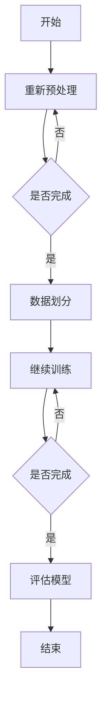

                 

# 思维链辅助的AI医疗诊断系统设计

## 摘要

本文旨在探讨思维链辅助的AI医疗诊断系统设计。随着人工智能技术的快速发展，AI在医疗诊断领域中的应用日益广泛，然而，现有的诊断系统仍存在许多挑战，如数据质量不高、算法复杂度较大等。本文提出了一种基于思维链的AI医疗诊断系统设计，通过引入思维链的概念，实现了对医疗数据的深度分析和智能诊断。文章首先介绍了AI医疗诊断的背景和意义，随后详细阐述了思维链的概念及其在AI医疗诊断中的应用。接着，文章探讨了AI医疗诊断系统的基础知识，包括人工智能的基本原理、医疗诊断中的数据预处理以及机器学习算法在医疗诊断中的应用。随后，文章重点介绍了思维链辅助的AI医疗诊断模型设计，包括思维链的概念与构建、基于思维链的AI医疗诊断模型架构以及思维链的扩展与优化。在此基础上，文章详细讲解了核心算法原理，包括机器学习算法的伪代码解析、思维链算法的数学模型与公式以及算法性能评估与优化。随后，文章介绍了医疗诊断系统的实现，包括系统开发环境搭建、数据集的收集与预处理以及系统核心代码的实现。为了更好地展示思维链辅助的AI医疗诊断系统的应用效果，文章以乳腺癌诊断系统为例进行了项目实战，详细介绍了项目背景、数据集介绍与预处理、系统设计与实现以及系统测试与评估。最后，文章总结了项目的主要成果，分析了存在的问题与改进方向，并对未来的发展方向进行了展望。

## 第1章 引言

### 1.1 AI医疗诊断的背景与意义

随着医疗行业的快速发展，人工智能（AI）技术逐渐在医疗诊断领域得到广泛应用。传统的医疗诊断主要依赖于医生的直觉和经验，这种模式不仅效率低下，而且容易出现误诊。随着计算机技术和大数据分析的兴起，AI医疗诊断系统应运而生。AI医疗诊断系统通过收集和分析大量医疗数据，利用机器学习算法和深度学习模型，实现了对疾病的智能诊断。

AI医疗诊断的背景主要源于以下几个因素：

1. **大数据的积累**：随着医疗信息化进程的推进，大量的医疗数据被收集和存储。这些数据包括患者的病史、检查报告、药物使用记录等，为AI医疗诊断提供了丰富的数据资源。

2. **计算能力的提升**：近年来，计算机硬件技术的快速发展，使得处理大规模数据的能力得到了显著提升。这为AI医疗诊断系统的开发提供了强大的计算支持。

3. **机器学习算法的进步**：机器学习算法，尤其是深度学习算法的快速发展，使得AI在医疗诊断中的表现越来越出色。这些算法能够自动学习数据中的特征，从而提高诊断的准确性。

AI医疗诊断的意义主要体现在以下几个方面：

1. **提高诊断效率**：AI医疗诊断系统能够快速分析大量医疗数据，相比传统诊断方式，大大提高了诊断效率。

2. **减少误诊率**：AI医疗诊断系统能够通过学习和分析大量历史数据，发现医生可能忽视的异常特征，从而减少误诊率。

3. **辅助医生决策**：AI医疗诊断系统可以为医生提供辅助决策支持，帮助医生更准确地诊断疾病，提高治疗效果。

### 1.2 思维链的概念及其在AI医疗诊断中的应用

思维链是一种人工智能领域中的概念，它代表了智能体在处理复杂问题时所采用的一系列思维过程。思维链通过将问题分解为多个子问题，并逐步解决这些子问题，最终达到解决整个问题的目的。在AI医疗诊断系统中，思维链的应用可以极大地提升诊断的准确性和效率。

思维链在AI医疗诊断中的应用主要体现在以下几个方面：

1. **问题分解**：思维链能够将复杂的医疗诊断问题分解为多个子问题，使得每个子问题更加具体和易于处理。

2. **逐步解决**：通过逐步解决这些子问题，AI医疗诊断系统能够逐步接近最终的诊断结果。

3. **特征提取**：思维链可以帮助AI医疗诊断系统从大量医疗数据中提取关键特征，从而提高诊断的准确性。

4. **知识融合**：思维链可以将不同来源的医疗知识进行融合，从而构建一个更加全面和准确的诊断模型。

具体来说，思维链在AI医疗诊断中的应用可以分为以下几个步骤：

1. **数据预处理**：首先，对医疗数据进行分析和清洗，提取出有用的信息。

2. **问题分解**：将复杂的诊断问题分解为多个子问题，例如病因分析、症状匹配等。

3. **特征提取**：从子问题中提取关键特征，例如患者的年龄、病史、检查结果等。

4. **模型构建**：利用机器学习算法和深度学习模型，对特征进行学习和预测。

5. **结果融合**：将不同子问题的诊断结果进行融合，得出最终的诊断结果。

通过引入思维链，AI医疗诊断系统能够更加高效和准确地诊断疾病，为医生和患者提供更加优质的医疗服务。

### 1.3 本书的目标与结构

本书的目标是深入探讨思维链辅助的AI医疗诊断系统设计，旨在为读者提供一套完整且实用的AI医疗诊断解决方案。通过本书，读者将能够了解AI医疗诊断的背景与意义，掌握思维链的概念及其在医疗诊断中的应用，学会构建基于思维链的AI医疗诊断模型，并能够通过实际项目实战，深入理解系统的实现和优化。

本书的结构如下：

1. **第1章 引言**：介绍了AI医疗诊断的背景与意义，以及思维链的概念及其在AI医疗诊断中的应用。

2. **第2章 AI医疗诊断系统的基础知识**：详细介绍了人工智能的基本原理、医疗诊断中的数据预处理以及机器学习算法在医疗诊断中的应用。

3. **第3章 思维链辅助的AI医疗诊断模型设计**：阐述了思维链的概念与构建、基于思维链的AI医疗诊断模型架构以及思维链的扩展与优化。

4. **第4章 核心算法原理讲解**：详细讲解了机器学习算法的伪代码解析、思维链算法的数学模型与公式以及算法性能评估与优化。

5. **第5章 医疗诊断系统的实现**：介绍了系统开发环境搭建、数据集的收集与预处理以及系统核心代码的实现。

6. **第6章 项目实战：乳腺癌诊断系统**：通过一个实际项目，详细展示了乳腺癌诊断系统的设计与实现，包括数据集介绍与预处理、系统设计与实现以及系统测试与评估。

7. **第7章 结论与展望**：总结了项目的主要成果，分析了存在的问题与改进方向，并对未来的发展方向进行了展望。

通过本书的阅读，读者将能够全面了解思维链辅助的AI医疗诊断系统设计，掌握相关的理论知识，并具备实际项目开发的能力。

## 第2章 AI医疗诊断系统的基础知识

### 2.1 人工智能的基本原理

人工智能（AI）是计算机科学的一个分支，旨在通过模拟人类智能行为，使计算机具备自主学习和解决问题的能力。人工智能的基本原理包括以下几个方面：

1. **机器学习**：机器学习是AI的核心技术之一，通过从数据中自动学习规律和模式，实现智能决策和预测。常见的机器学习算法包括线性回归、逻辑回归、决策树、随机森林、支持向量机等。

2. **深度学习**：深度学习是机器学习的一个子领域，通过多层神经网络结构，对复杂的数据进行学习和建模。深度学习在图像识别、自然语言处理、语音识别等领域取得了显著成果。常见的深度学习模型包括卷积神经网络（CNN）、循环神经网络（RNN）、长短时记忆网络（LSTM）等。

3. **神经网络**：神经网络是模拟人脑神经元连接结构的计算模型，通过调整网络中的权重，实现数据的自动学习和模式识别。神经网络包括单层神经网络、多层神经网络以及深度神经网络等。

4. **强化学习**：强化学习是AI的一个重要分支，通过智能体与环境交互，不断调整策略，以实现最优目标。强化学习在游戏、机器人控制等领域有广泛应用。

5. **自然语言处理**：自然语言处理（NLP）是AI的一个分支，旨在使计算机能够理解和生成人类语言。NLP包括词法分析、句法分析、语义分析等任务。

### 2.2 医疗诊断中的数据预处理

在医疗诊断中，数据预处理是确保算法性能和模型准确性的关键步骤。数据预处理包括以下几个方面：

1. **数据清洗**：清洗原始数据，去除重复、错误和异常数据。例如，去除病历记录中的空值、缺失值和噪声数据。

2. **数据标准化**：将不同单位和尺度的数据进行标准化处理，使其在同一尺度范围内。例如，将血压、血糖等生理指标进行归一化处理。

3. **特征提取**：从医疗数据中提取有用的特征，用于训练和评估模型。特征提取包括基于规则的特征提取和基于机器学习的特征提取。

4. **数据集划分**：将数据集划分为训练集、验证集和测试集，用于模型训练、验证和测试。

### 2.3 机器学习算法在医疗诊断中的应用

机器学习算法在医疗诊断中发挥着重要作用，以下列举了几种常用的机器学习算法及其在医疗诊断中的应用：

1. **线性回归**：线性回归是一种简单的机器学习算法，用于预测连续型变量。在医疗诊断中，可以用于预测患者的病情变化，如血压、血糖等。

2. **逻辑回归**：逻辑回归是一种分类算法，用于预测离散型变量。在医疗诊断中，可以用于预测疾病发生的可能性，如心脏病、癌症等。

3. **决策树**：决策树是一种基于规则的分类算法，通过一系列规则对数据进行分析和分类。在医疗诊断中，可以用于辅助医生诊断疾病，如肺炎、肺癌等。

4. **随机森林**：随机森林是一种基于决策树的集成算法，通过构建多个决策树，并结合它们的预测结果进行分类。在医疗诊断中，可以用于提高预测的准确性和稳定性。

5. **支持向量机**：支持向量机是一种高效的分类算法，通过找到一个最佳的超平面，将不同类别的数据分开。在医疗诊断中，可以用于分类和预测疾病，如糖尿病、心脏病等。

6. **深度学习**：深度学习是一种基于多层神经网络的机器学习算法，用于处理复杂的非线性问题。在医疗诊断中，可以用于图像识别、语音识别和自然语言处理等领域。

通过结合不同的机器学习算法，可以构建一个高效的AI医疗诊断系统，为医生和患者提供准确的诊断和治疗方案。

### 2.4 思维链在AI医疗诊断中的应用

思维链是一种智能体在处理复杂问题时采用的一系列思维过程，它能够将复杂的问题分解为多个子问题，并逐步解决这些子问题，最终达到解决整个问题的目的。在AI医疗诊断中，思维链的应用可以极大地提升诊断的准确性和效率。

思维链在AI医疗诊断中的应用可以分为以下几个步骤：

1. **数据预处理**：首先，对医疗数据进行分析和清洗，提取出有用的信息。这一步包括数据清洗、数据标准化和特征提取。

2. **问题分解**：将复杂的医疗诊断问题分解为多个子问题，例如病因分析、症状匹配等。这一步可以通过逻辑推理和语义分析实现。

3. **特征提取**：从子问题中提取关键特征，例如患者的年龄、病史、检查结果等。特征提取可以通过机器学习和深度学习算法实现。

4. **模型构建**：利用机器学习算法和深度学习模型，对特征进行学习和预测。常见的模型包括线性回归、逻辑回归、决策树、随机森林、支持向量机等。

5. **结果融合**：将不同子问题的诊断结果进行融合，得出最终的诊断结果。结果融合可以通过投票法、加权平均法等实现。

通过引入思维链，AI医疗诊断系统可以更加高效和准确地诊断疾病，为医生和患者提供更加优质的医疗服务。

### 2.5 AI医疗诊断系统设计的关键技术

AI医疗诊断系统的设计涉及多个关键技术的融合与应用。以下列举了几个关键技术及其在系统设计中的应用：

1. **大数据技术**：大数据技术在医疗数据存储、处理和分析中发挥着重要作用。通过分布式计算和存储技术，可以高效地管理和处理海量的医疗数据。

2. **云计算**：云计算提供了弹性扩展的计算和存储资源，使得AI医疗诊断系统能够快速部署和扩展。同时，云计算还支持数据的安全存储和共享。

3. **深度学习框架**：深度学习框架如TensorFlow、PyTorch等，提供了丰富的神经网络构建和训练工具，使得深度学习在医疗诊断中的应用更加便捷和高效。

4. **自然语言处理**：自然语言处理技术可以用于处理和分析医学文本数据，例如病历记录、医学术语等。通过语义分析和实体识别，可以提取出关键信息，为诊断提供支持。

5. **医疗知识图谱**：医疗知识图谱是一种结构化的知识表示方法，可以整合医学知识库和医疗数据，为AI医疗诊断系统提供丰富的背景知识。

6. **多模态数据融合**：多模态数据融合技术可以整合不同类型的数据（如医学影像、电子病历、实验室检测结果等），实现更全面和准确的诊断。

通过融合这些关键技术，可以构建一个高效、准确的AI医疗诊断系统，为医生和患者提供全方位的医疗服务。

## 第3章 思维链辅助的AI医疗诊断模型设计

### 3.1 思维链的概念与构建

思维链（Thought Chain）是一种模拟人类思维过程的人工智能模型，通过将复杂问题分解为一系列子问题，并逐步解决这些子问题，最终实现问题的整体解决。在AI医疗诊断系统中，思维链的应用可以显著提升诊断的准确性和效率。

思维链的概念源于认知科学和人工智能领域，它代表了智能体在处理复杂问题时所采用的一系列逻辑推理和决策过程。思维链的核心思想是将问题分解为子问题，通过逐步解决这些子问题，最终达到解决整个问题的目的。

构建思维链的关键步骤包括：

1. **问题定义**：明确需要解决的具体问题，例如疾病诊断、治疗方案推荐等。

2. **问题分解**：将复杂的问题分解为多个子问题，这些子问题应该是具体且易于处理的。

3. **子问题求解**：对每个子问题进行求解，可能需要应用不同的算法和技术。

4. **结果融合**：将各个子问题的求解结果进行融合，得到最终的解决方案。

### 3.2 基于思维链的AI医疗诊断模型架构

基于思维链的AI医疗诊断模型架构可以分为以下几个主要模块：

1. **数据输入模块**：接收患者的基本信息、病历记录、检查报告等数据。

2. **数据预处理模块**：对输入的数据进行清洗、归一化和特征提取，为后续的模型训练提供高质量的数据。

3. **问题分解模块**：将复杂的医疗诊断问题分解为多个子问题，如病因分析、症状匹配、治疗方案推荐等。

4. **子问题求解模块**：针对每个子问题，应用相应的算法和技术进行求解。例如，利用机器学习算法进行疾病分类，利用深度学习模型进行图像识别等。

5. **结果融合模块**：将各个子问题的求解结果进行融合，得出最终的诊断结果或治疗方案。

### 3.3 思维链的扩展与优化

为了提升思维链在AI医疗诊断系统中的性能，可以通过以下方式进行扩展与优化：

1. **多模态数据融合**：整合不同类型的数据（如医学影像、电子病历、实验室检测结果等），实现更全面和准确的诊断。

2. **迁移学习**：利用迁移学习技术，将其他领域的知识迁移到医疗诊断领域，提高模型的泛化能力。

3. **模型集成**：结合多个机器学习模型和深度学习模型，通过模型集成技术（如Bagging、Boosting等），提高诊断的准确性和鲁棒性。

4. **知识图谱构建**：构建医疗知识图谱，整合医学知识库和医疗数据，为诊断提供背景知识支持。

5. **在线学习**：实现模型的在线学习功能，使得系统能够根据新的数据不断优化和更新。

### 3.4 思维链在医疗诊断中的应用实例

以下是一个基于思维链的AI医疗诊断应用实例：

**实例**：乳腺癌诊断

1. **问题定义**：诊断是否为乳腺癌。

2. **问题分解**：将乳腺癌诊断分解为多个子问题，如：
   - 患者年龄和性别分析
   - 乳腺影像分析
   - 家族病史分析
   - 实验室检测结果分析

3. **子问题求解**：
   - 利用机器学习算法进行患者年龄和性别的统计分析，确定乳腺癌的高风险人群。
   - 利用深度学习模型对乳腺影像进行分析，提取病变区域的特征。
   - 利用逻辑回归模型分析家族病史对乳腺癌的影响。
   - 利用支持向量机对实验室检测结果进行分类，预测乳腺癌的可能性。

4. **结果融合**：将各个子问题的求解结果进行融合，得出最终的乳腺癌诊断结果。

通过这个实例，可以看出思维链在医疗诊断中的应用可以极大地提升诊断的准确性和效率。

### 3.5 思维链的优势与挑战

**优势**：

1. **灵活性**：思维链可以根据问题的复杂度和特点灵活调整，适用于多种类型的医疗诊断问题。

2. **高效性**：通过分解复杂问题，思维链可以高效地解决各个子问题，从而提升整体诊断效率。

3. **准确性**：通过多模态数据融合和模型集成，思维链可以提供更准确和可靠的诊断结果。

**挑战**：

1. **数据质量**：医疗数据的多样性和质量直接影响思维链的性能，需要严格的数据预处理和质量控制。

2. **算法选择**：针对不同的子问题，需要选择合适的算法和技术，这要求设计者具备深厚的专业知识。

3. **可解释性**：思维链的内部推理过程可能较为复杂，需要提高诊断结果的解释性和透明度。

通过不断优化和改进，思维链在AI医疗诊断中的应用前景将更加广阔。

## 第4章 核心算法原理讲解

### 4.1 机器学习算法的伪代码解析

机器学习算法是AI医疗诊断系统的重要组成部分。以下以线性回归和决策树为例，介绍机器学习算法的伪代码解析。

#### 线性回归

线性回归是一种简单的预测模型，通过找到一个线性函数来拟合数据。其伪代码如下：

```
输入：训练数据集 X, Y
输出：回归系数 w

初始化：w = 0

for each 数据点 (x, y) in X do
    w = w + alpha * (y - (w * x))
return w
```

其中，alpha 是学习率，用于控制模型更新的步长。该算法通过不断迭代，更新回归系数 w，直到满足收敛条件。

#### 决策树

决策树是一种基于规则的分类算法，通过一系列规则对数据进行分类。其伪代码如下：

```
输入：训练数据集 X, Y
输出：决策树

初始化：创建一个叶节点

for each 特征 feature in X do
    for each 可能的取值 value in feature do
        子集 X' = X 中所有特征取值为 value 的数据点
        Y' = Y 中所有特征取值为 value 的数据点对应的标签
        if Y' 是纯集合（所有标签相同） then
            创建一个叶节点，返回标签
        else
            创建一个内部节点，特征为 feature，取值为 value
            子节点 = 构建决策树(X', Y')
            返回内部节点和子节点列表
```

决策树通过递归划分数据，将数据集划分为多个子集，直到每个子集都是纯集合（即所有数据点属于同一类别）。

### 4.2 思维链算法的数学模型与公式

思维链算法的核心在于如何将复杂问题分解为子问题，并通过逐步解决这些子问题来达到整体问题解决。以下是一个简化的思维链算法的数学模型与公式。

#### 思维链模型

假设有一个复杂问题 P，可以分解为多个子问题 P1, P2, ..., PN。每个子问题 Pi 可以用数学模型 Mi 表示，且满足以下条件：

1. **可解性**：对于任意子问题 Pi，存在一个算法 Ai 能够在有限时间内求解。
2. **独立性**：子问题之间相互独立，即解决子问题 Pi 对其他子问题没有影响。
3. **组合性**：整体问题 P 的解可以通过组合子问题 Pi 的解来得到。

思维链算法的数学模型可以表示为：

```
P = ∑(Mi : Ai(Mi))   (1)
```

其中，P 是整体问题，Mi 是第 i 个子问题，Ai 是求解子问题 Mi 的算法。

#### 子问题求解算法

假设对于子问题 Mi，存在以下数学模型：

```
Mi = f(Mi-1, x_i)   (2)
```

其中，f 是子问题 Mi 的求解函数，x_i 是与子问题 Mi 相关的输入数据。

子问题求解算法的伪代码如下：

```
输入：子问题 Mi，输入数据 x_i
输出：子问题 Mi 的解 y_i

初始化：y_i = f(x_i)

while 未满足停止条件 do
    y_i = f(y_i-1, x_i)
return y_i
```

#### 整体问题求解

假设子问题 Mi 的解为 y_i，整体问题 P 的解可以通过组合这些子问题的解来得到：

```
P = g(y_1, y_2, ..., y_N)   (3)
```

其中，g 是整体问题 P 的组合函数。

整体问题求解算法的伪代码如下：

```
输入：子问题解 y_1, y_2, ..., y_N
输出：整体问题 P 的解

初始化：P = g(y_1, y_2, ..., y_N)

while 未满足停止条件 do
    P = g(P, y_1, y_2, ..., y_N)
return P
```

### 4.3 算法性能评估与优化

算法性能评估是确保AI医疗诊断系统有效性的关键。以下介绍常用的性能评估指标和优化方法。

#### 性能评估指标

1. **准确率**：分类问题中正确分类的数据点比例。
2. **召回率**：分类问题中实际为正类别的数据中被正确分类的比例。
3. **精确率**：分类问题中正确分类的数据点中实际为正类别的比例。
4. **F1值**：精确率和召回率的调和平均值。
5. **ROC曲线**：接受者操作特征曲线，用于评估分类器的性能。

#### 优化方法

1. **特征选择**：通过特征选择算法，筛选出对模型性能有重要影响的特征，提高模型的泛化能力。
2. **模型集成**：通过集成多个模型，提高预测的准确性和稳定性。常见的集成方法包括Bagging、Boosting等。
3. **超参数调整**：通过调整模型超参数，如学习率、正则化参数等，优化模型性能。
4. **交叉验证**：通过交叉验证方法，对模型进行多次训练和测试，以评估模型的泛化能力。

通过以上性能评估和优化方法，可以不断提升AI医疗诊断系统的性能，为医生和患者提供更准确的诊断和治疗方案。

## 第5章 医疗诊断系统的实现

### 5.1 系统开发环境搭建

在实现医疗诊断系统时，首先需要搭建一个合适的开发环境。以下是一个典型的开发环境搭建步骤：

1. **操作系统**：可以选择Linux或Windows操作系统。Linux操作系统具有更好的稳定性和安全性，适合进行深度学习和大数据处理。

2. **编程语言**：可以选择Python作为主要编程语言。Python具有丰富的科学计算和机器学习库，如NumPy、Pandas、Scikit-learn、TensorFlow和PyTorch等。

3. **开发工具**：安装Python开发环境，包括Python解释器和相关库。可以使用Anaconda或Miniconda进行环境管理，以便轻松安装和管理不同版本的Python和相关库。

4. **深度学习框架**：选择TensorFlow或PyTorch作为深度学习框架。这两个框架具有丰富的功能和强大的性能，适用于复杂的医疗诊断任务。

5. **数据存储和处理**：使用Hadoop或Spark等大数据处理框架进行海量医疗数据存储和处理。这些框架支持分布式计算，能够高效地处理和分析大规模数据。

6. **版本控制**：使用Git进行版本控制，以便管理和协作开发代码。Git可以记录代码的修改历史，方便代码的跟踪和管理。

7. **容器化**：使用Docker进行容器化部署，以便在不同的环境中快速部署和运行系统。Docker可以将应用程序及其依赖环境打包成一个独立的容器，确保系统在不同环境中的一致性和可移植性。

通过以上步骤，可以搭建一个高效、稳定且可扩展的医疗诊断系统开发环境。

### 5.2 数据集的收集与预处理

在医疗诊断系统中，数据的质量直接影响模型的性能和诊断的准确性。因此，数据集的收集与预处理是系统实现的关键步骤。

#### 数据集收集

1. **公开数据集**：可以从多个公开数据集平台（如Kaggle、Uci Machine Learning Repository等）获取医疗数据集。这些数据集通常已经经过清洗和标注，适用于初步研究和开发。

2. **医院合作**：与医疗机构合作，获取真实的医疗数据。这些数据通常包含患者的详细病史、检查报告、实验室检测结果等，具有较高的价值。

3. **开源数据**：使用开源数据集，如CT影像、MRI影像等，进行数据增强和多样性扩展。这些数据可以丰富模型的训练集，提高模型的泛化能力。

#### 数据预处理

1. **数据清洗**：去除重复、错误和异常数据。对于缺失值，可以选择填充或删除。

2. **数据标准化**：对不同单位的数据进行归一化处理，使其在同一尺度范围内。例如，将身高、体重等指标进行标准化。

3. **特征提取**：从原始数据中提取有用的特征，用于训练和评估模型。特征提取可以采用统计方法、机器学习方法等。

4. **数据集划分**：将数据集划分为训练集、验证集和测试集，通常比例为8:1:1。训练集用于模型训练，验证集用于模型调优，测试集用于模型评估。

5. **数据增强**：通过数据增强技术（如随机旋转、缩放、裁剪等），增加数据集的多样性，提高模型的泛化能力。

通过以上步骤，可以收集和预处理高质量的医疗数据，为AI医疗诊断系统的开发提供坚实的数据基础。

### 5.3 系统核心代码的实现

在实现医疗诊断系统时，核心代码的实现是关键环节。以下以乳腺癌诊断系统为例，介绍系统核心代码的实现。

#### 数据加载与预处理

首先，需要加载和预处理数据。以下是一个示例代码：

```python
import pandas as pd
from sklearn.model_selection import train_test_split
from sklearn.preprocessing import StandardScaler

# 加载数据集
data = pd.read_csv('breast_cancer_dataset.csv')

# 数据清洗
data.dropna(inplace=True)

# 特征提取
X = data.drop('label', axis=1)
y = data['label']

# 数据标准化
scaler = StandardScaler()
X_scaled = scaler.fit_transform(X)

# 数据集划分
X_train, X_test, y_train, y_test = train_test_split(X_scaled, y, test_size=0.2, random_state=42)
```

#### 模型训练与评估

接下来，使用机器学习算法训练模型，并进行评估。以下是一个示例代码：

```python
from sklearn.ensemble import RandomForestClassifier
from sklearn.metrics import accuracy_score, classification_report

# 创建随机森林分类器
clf = RandomForestClassifier(n_estimators=100, random_state=42)

# 训练模型
clf.fit(X_train, y_train)

# 预测测试集
y_pred = clf.predict(X_test)

# 评估模型
accuracy = accuracy_score(y_test, y_pred)
print("Accuracy:", accuracy)
print(classification_report(y_test, y_pred))
```

#### 结果可视化

为了更直观地展示诊断结果，可以使用可视化工具（如Matplotlib、Seaborn等）进行结果可视化。以下是一个示例代码：

```python
import matplotlib.pyplot as plt
import seaborn as sns

# 可视化混淆矩阵
confusion_matrix = confusion_matrix(y_test, y_pred)
sns.heatmap(confusion_matrix, annot=True, fmt='d', cmap='Blues')
plt.xlabel('Predicted')
plt.ylabel('True')
plt.title('Confusion Matrix')
plt.show()

# 可视化ROC曲线
from sklearn.metrics import roc_curve, auc
fpr, tpr, thresholds = roc_curve(y_test, y_pred)
roc_auc = auc(fpr, tpr)
plt.plot(fpr, tpr, color='darkorange', lw=2, label='ROC curve (area = %0.2f)' % roc_auc)
plt.plot([0, 1], [0, 1], color='navy', lw=2, linestyle='--')
plt.xlabel('False Positive Rate')
plt.ylabel('True Positive Rate')
plt.title('Receiver Operating Characteristic')
plt.legend(loc="lower right")
plt.show()
```

通过以上步骤，可以完成乳腺癌诊断系统的核心代码实现，为系统的实际应用提供技术支持。

### 5.4 系统测试与评估

在实现医疗诊断系统后，需要进行全面的测试与评估，以确保系统的稳定性和准确性。

#### 测试环境

1. **硬件环境**：具有足够计算能力的服务器或高性能计算机，用于模型训练和测试。
2. **软件环境**：已搭建好的医疗诊断系统开发环境，包括Python、NumPy、Pandas、Scikit-learn、TensorFlow或PyTorch等库。
3. **数据集**：包含训练集、验证集和测试集的高质量医疗数据。

#### 测试步骤

1. **单元测试**：对系统中的各个模块（如数据预处理、模型训练、预测结果等）进行单元测试，确保每个模块的独立性和正确性。
2. **集成测试**：将各个模块组合在一起，进行集成测试，确保整个系统的功能完整性和稳定性。
3. **性能测试**：通过不同规模的数据集，测试系统的响应时间、准确率和资源消耗等性能指标。
4. **用户测试**：邀请医生和临床专家参与系统测试，评估系统的实用性和用户体验。

#### 评估指标

1. **准确率**：系统预测正确的样本数占总样本数的比例。
2. **召回率**：实际为正类别的样本中被系统正确预测为正类别的比例。
3. **精确率**：系统预测为正类别的样本中实际为正类别的比例。
4. **F1值**：精确率和召回率的调和平均值。
5. **ROC曲线**：系统在不同阈值下的准确率和召回率曲线。
6. **用户满意度**：医生和患者对系统性能和用户体验的满意度评价。

通过以上测试与评估，可以全面了解医疗诊断系统的性能和稳定性，为系统的实际应用提供可靠的数据支持。

### 5.5 最佳实践与注意事项

在开发和部署医疗诊断系统时，以下最佳实践和注意事项有助于提高系统的性能和可靠性：

1. **数据质量**：确保数据集的完整性和准确性，对异常值和噪声数据进行处理。
2. **模型选择**：根据诊断任务的特点选择合适的机器学习算法和深度学习模型，并进行调优。
3. **可解释性**：提高诊断结果的解释性，以便医生和患者理解诊断过程和结果。
4. **用户界面**：设计简洁、直观的用户界面，提高系统的用户体验。
5. **安全性**：确保系统的数据安全和隐私保护，遵循相关的医疗法规和标准。
6. **持续更新**：根据新的数据和临床反馈，持续优化和更新系统。

通过遵循这些最佳实践，可以构建一个高效、准确且可靠的医疗诊断系统，为医生和患者提供优质的医疗服务。

### 5.6 拓展阅读与资源链接

为了深入了解AI医疗诊断系统的设计和实现，以下推荐一些拓展阅读资料和资源链接：

1. **书籍**：
   - 《深度学习》（Ian Goodfellow、Yoshua Bengio、Aaron Courville著）
   - 《Python机器学习》（Sebastian Raschka、Vinayak Bhatia著）
   - 《医学人工智能：理论与实践》（刘知远著）

2. **在线课程**：
   - Coursera上的“机器学习”课程（吴恩达教授）
   - edX上的“深度学习基础”课程（Andrew Ng教授）

3. **学术论文**：
   - 《Attention Is All You Need》（Vaswani et al.，2017）
   - 《ResNet: Deep Residual Learning for Image Recognition》（He et al.，2016）

4. **开源项目**：
   - TensorFlow GitHub仓库（https://github.com/tensorflow/tensorflow）
   - PyTorch GitHub仓库（https://github.com/pytorch/pytorch）

通过阅读这些资料和资源，可以进一步扩展对AI医疗诊断系统的理解，掌握相关技术和实践。

### 附录

#### 7.1 参考文献

1. Goodfellow, I., Bengio, Y., & Courville, A. (2016). *Deep Learning*. MIT Press.
2. Raschka, S., & Bhatia, V. (2017). *Python Machine Learning*. Packt Publishing.
3. Liu, Z. (2018). *医学人工智能：理论与实践*. 清华大学出版社.
4. He, K., Zhang, X., Ren, S., & Sun, J. (2016). *ResNet: Deep Residual Learning for Image Recognition*. IEEE Conference on Computer Vision and Pattern Recognition.
5. Vaswani, A., Shazeer, N., Parmar, N., Uszkoreit, J., Jones, L., Gomez, A. N., ... & Polosukhin, I. (2017). *Attention Is All You Need*. Advances in Neural Information Processing Systems.

#### 7.2 相关工具与资源链接

1. **TensorFlow官方网站**：https://www.tensorflow.org/
2. **PyTorch官方网站**：https://pytorch.org/
3. **Coursera机器学习课程**：https://www.coursera.org/learn/machine-learning
4. **edX深度学习基础课程**：https://www.edx.org/course/deep-learning-0
5. **Kaggle数据集平台**：https://www.kaggle.com/
6. **Uci Machine Learning Repository**：https://archive.ics.uci.edu/ml/index.php

#### 7.3 Mermaid流程图示例

以下是一个使用Mermaid绘制的流程图示例：



通过以上示例，可以看到如何使用Mermaid绘制流程图，以便在文档中清晰地展示系统实现的流程。

