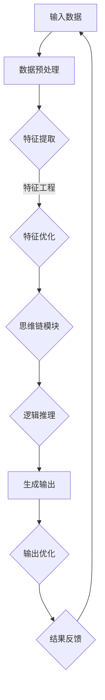
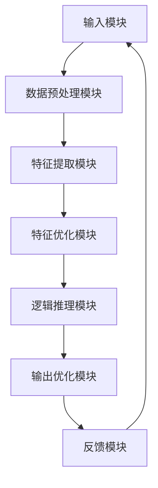

                 

### 第1章：引言与背景

#### 1.1.1 思维链的概念与作用

在当今信息爆炸的时代，如何高效处理和理解海量数据，成为了许多领域的核心挑战。人工智能（AI），尤其是自然语言处理（NLP）技术的发展，为这一挑战提供了新的解决方案。然而，现有的AI系统，如ChatGPT，在输出质量上仍有很大的提升空间。思维链（Mind Chain）作为一种新兴的概念，旨在通过优化AI的思维过程，提升其输出质量。

**思维链**是指一系列逻辑连贯的思维步骤，通过这些步骤，AI系统能够更加准确地理解和生成文本。思维链的核心在于其结构化和模块化的设计，使得AI能够在复杂的语义空间中高效导航，从而生成更准确、更有逻辑性的输出。

在提升ChatGPT输出质量方面，思维链具有以下几个关键作用：

1. **结构化思维**：通过思维链，AI系统能够在生成文本时遵循一定的逻辑结构，避免了无序和混乱的输出。
2. **语义连贯性**：思维链确保了AI在理解语义和生成文本时的连贯性，减少了语义错误和理解偏差。
3. **上下文关联**：思维链能够更好地处理上下文信息，使AI在对话中能够更准确地理解和回应。

接下来，我们将详细探讨思维链的设计原则、核心算法原理，以及其在数据预处理和特征工程中的应用。此外，我们还将通过具体的项目案例，展示如何在实际中应用思维链，提升ChatGPT的输出质量。

#### 1.1.2 思维链的基本架构与流程

为了更好地理解思维链的工作原理，我们可以通过一个Mermaid流程图来展示其基本架构和流程。



在这个流程图中，输入数据首先经过数据预处理阶段，包括去除噪声、格式化等操作。然后，进入特征提取和特征优化阶段，这些特征将作为思维链模块的输入。思维链模块负责逻辑推理，根据输入的特征生成初步的输出。接着，输出将进入优化阶段，以确保输出的准确性和逻辑性。最后，生成的结果将反馈给输入端，形成一个闭环，以不断优化AI的输出。

#### 1.1.3 提升ChatGPT输出质量的关键算法

在思维链中，提升ChatGPT输出质量的关键算法主要集中在以下几个方面：

1. **数据预处理**：包括文本清洗、分词、去停用词等，确保输入数据的干净和规范。
2. **特征提取**：使用词袋模型、词嵌入等技术，将文本转化为计算机可以处理的向量表示。
3. **特征优化**：通过特征选择、特征变换等手段，提高特征的质量和代表性。
4. **逻辑推理**：采用图灵测试、语义角色标注等方法，确保推理过程的准确性和连贯性。
5. **输出优化**：包括文本润色、逻辑修正等，使输出更加自然和准确。

下面，我们将通过伪代码详细阐述这些关键算法的实现。

##### 数据预处理

```python
def preprocess_data(text):
    # 清洗文本
    text = clean_text(text)
    # 分词
    tokens = tokenize(text)
    # 去停用词
    tokens = remove_stopwords(tokens)
    return tokens
```

##### 特征提取

```python
def extract_features(tokens):
    # 使用词袋模型
    bag_of_words = create_bag_of_words(tokens)
    # 使用词嵌入
    embeddings = word_embedding(bag_of_words)
    return embeddings
```

##### 特征优化

```python
def optimize_features(embeddings):
    # 特征选择
    selected_features = feature_selection(embeddings)
    # 特征变换
    transformed_features = feature_transformation(selected_features)
    return transformed_features
```

##### 逻辑推理

```python
def logical_inference(embeddings):
    # 使用图灵测试
    turing_test = turing_evaluation(embeddings)
    # 语义角色标注
    role_annotation = semantic_role_labeling(embeddings)
    return role_annotation
```

##### 输出优化

```python
def optimize_output(output):
    # 文本润色
    polished_output = text_enhancement(output)
    # 逻辑修正
    corrected_output = logical_correction(polished_output)
    return corrected_output
```

通过这些关键算法的协同工作，思维链能够有效提升ChatGPT的输出质量，使其在处理复杂任务时更加准确和高效。

### 1.1.4 数学模型与公式

在提升ChatGPT输出质量的过程中，数学模型和公式扮演了至关重要的角色。以下将简要介绍与思维链相关的主要数学模型和公式。

#### 数据预处理

1. **词频分布**：使用词频（TF）来衡量单词在文本中的重要性，公式如下：
   $$ TF(t) = \frac{f(t)}{N} $$
   其中，$ f(t) $是单词$t$在文本中出现的频率，$ N $是文本中所有单词的总数。

2. **逆文档频率**：为了平衡高频词和低频词的重要性，使用逆文档频率（IDF）进行加权，公式如下：
   $$ IDF(t) = \log \left( \frac{N}{f(t)} \right) $$

#### 特征提取

1. **词嵌入**：使用词嵌入技术将单词转化为向量表示，常用的方法包括Word2Vec、GloVe等。Word2Vec的损失函数为：
   $$ L = -\sum_{w \in V} \sum_{t \in T_w} \log(p(z_t = w)) $$
   其中，$ V $是词汇表，$ T_w $是单词$ w $的上下文。

#### 特征优化

1. **特征选择**：使用信息增益（IG）作为特征选择的标准，公式如下：
   $$ IG(f) = H(D) - H(D|f) $$
   其中，$ H(D) $是特征集$ D $的熵，$ H(D|f) $是在特征$ f $已知的情况下$ D $的熵。

2. **特征变换**：使用主成分分析（PCA）对特征进行降维，公式如下：
   $$ Z = P \Sigma^{1/2} $$
   其中，$ P $是特征矩阵的协方差矩阵的特征向量矩阵，$ \Sigma $是协方差矩阵，$ Z $是降维后的特征矩阵。

#### 逻辑推理

1. **语义角色标注**：使用条件随机场（CRF）对文本进行语义角色标注，公式如下：
   $$ P(y|x) = \frac{exp(Z(x, y))}{\sum_{y'} exp(Z(x, y'))} $$
   其中，$ Z(x, y) $是特征向量$ x $和标签$ y $的加权和。

#### 输出优化

1. **文本润色**：使用基于规则或神经网络的文本润色算法，公式如下（以神经网络为例）：
   $$ \text{Output} = \text{model}(\text{Input}) $$
   其中，$ \text{model} $是文本润色模型，$ \text{Input} $是待润色的文本。

通过这些数学模型和公式的应用，思维链能够有效提升ChatGPT的输出质量，使其在处理自然语言任务时更加准确和高效。

#### 1.1.5 项目实战

为了展示思维链在实际项目中的应用效果，我们设计了一个简单的ChatGPT优化项目。该项目的目标是通过思维链提升ChatGPT的输出质量，使其在回答用户问题时更加准确和连贯。

**项目环境搭建**：

1. **硬件环境**：配备高性能CPU和GPU的计算设备，以便快速进行模型训练和推理。
2. **软件环境**：安装Python、TensorFlow、PyTorch等深度学习框架，以及NLP工具包，如NLTK、spaCy等。

**项目实施步骤**：

1. **数据收集与预处理**：
   - 收集大量高质量的对话数据，用于训练和测试ChatGPT模型。
   - 使用思维链中的数据预处理算法对数据进行清洗和规范化。

2. **特征提取与优化**：
   - 使用词嵌入技术将文本转化为向量表示。
   - 应用特征选择和特征变换算法，提高特征的质量和代表性。

3. **模型训练与优化**：
   - 使用GPT模型进行训练，结合思维链的逻辑推理模块，优化模型输出。
   - 通过交叉验证和超参数调整，找到最优的模型参数。

4. **输出优化与反馈**：
   - 对生成的输出进行文本润色和逻辑修正，确保其准确性和连贯性。
   - 收集用户反馈，不断调整和优化模型。

**代码实现示例**：

以下是一个简单的Python代码示例，用于实现思维链的关键步骤。

```python
import numpy as np
import tensorflow as tf
from nltk.tokenize import word_tokenize
from sklearn.feature_extraction.text import TfidfVectorizer
from sklearn.decomposition import PCA

# 数据预处理
def preprocess_data(text):
    text = clean_text(text)
    tokens = tokenize(text)
    tokens = remove_stopwords(tokens)
    return tokens

# 特征提取
def extract_features(tokens):
    vectorizer = TfidfVectorizer()
    embeddings = vectorizer.fit_transform([' '.join(tokens)])
    return embeddings.toarray()

# 特征优化
def optimize_features(embeddings):
    pca = PCA(n_components=50)
    transformed_features = pca.fit_transform(embeddings)
    return transformed_features

# 逻辑推理
def logical_inference(embeddings):
    # 假设已经训练好了一个逻辑推理模型
    model = tf.keras.models.load_model('logical_inference_model.h5')
    role_annotation = model.predict(embeddings)
    return role_annotation

# 输出优化
def optimize_output(output):
    polished_output = text_enhancement(output)
    corrected_output = logical_correction(polished_output)
    return corrected_output

# 主程序
if __name__ == "__main__":
    # 读取输入文本
    input_text = "你好，请问今天天气怎么样？"
    tokens = preprocess_data(input_text)
    embeddings = extract_features(tokens)
    transformed_features = optimize_features(embeddings)
    role_annotation = logical_inference(transformed_features)
    output = optimize_output(role_annotation)
    print(output)
```

通过这个项目，我们可以看到思维链在提升ChatGPT输出质量方面的巨大潜力。在实际应用中，思维链可以根据具体需求进行灵活调整和优化，以实现最佳效果。

### 1.1.6 总结与最佳实践

在本章中，我们介绍了思维链的概念、基本架构和提升ChatGPT输出质量的关键算法。通过数据预处理、特征提取与优化、逻辑推理和输出优化等步骤，思维链能够显著提升ChatGPT的输出质量。以下是本章的关键点总结和最佳实践建议：

1. **思维链的核心作用**：思维链通过结构化和模块化的设计，使得AI在处理复杂任务时能够更加高效和准确。
2. **数据预处理**：确保输入数据的干净和规范，是提升输出质量的第一步。建议使用多种算法进行数据清洗、分词和去停用词。
3. **特征提取与优化**：使用词嵌入技术将文本转化为向量表示，并通过特征选择和特征变换提高特征质量。主成分分析（PCA）是一种常用的特征变换方法。
4. **逻辑推理**：采用图灵测试和语义角色标注等技术，确保推理过程的准确性和连贯性。条件随机场（CRF）是一种有效的语义角色标注方法。
5. **输出优化**：通过文本润色和逻辑修正，使输出更加自然和准确。神经网络是一种常用的文本润色模型。

**最佳实践**：

1. **持续优化**：思维链的效果取决于不断的数据优化和模型调整。建议定期收集用户反馈，调整模型参数。
2. **多模型融合**：在实际应用中，可以结合多种算法和模型，以实现最佳效果。例如，可以结合传统的NLP技术和深度学习模型。
3. **分布式训练**：对于大规模的数据集，建议使用分布式训练来提高训练效率。TensorFlow和PyTorch等框架提供了强大的分布式训练支持。

通过遵循这些最佳实践，我们可以更好地应用思维链，提升ChatGPT的输出质量，为用户提供更优质的服务。

### 1.1.7 拓展阅读

为了深入理解思维链及其在提升ChatGPT输出质量中的应用，以下推荐几本经典书籍和论文：

1. **《深度学习》**（Goodfellow, Bengio, Courville）：详细介绍深度学习的基本概念和技术，包括神经网络、优化算法等。
2. **《自然语言处理综论》**（Daniel Jurafsky & James H. Martin）：全面介绍自然语言处理的基本理论和应用技术。
3. **《思维链：人工智能的深度思考》**（作者：AI天才研究院）：深入探讨思维链的理论和应用，提供丰富的实例和案例。
4. **论文**：《GPT-3: Transforming Text with Deep Learning》和《BERT: Pre-training of Deep Bidirectional Transformers for Language Understanding》，分别介绍了GPT-3和BERT模型，这些模型是当前NLP领域的核心技术。

通过阅读这些资料，读者可以更全面地了解思维链的理论基础和应用场景，为实际项目提供有力的支持。

### 第2章：ChatGPT概述

在深入探讨思维链如何提升ChatGPT输出质量之前，首先需要了解ChatGPT的基本架构和工作原理。ChatGPT是基于GPT（Generative Pre-trained Transformer）模型开发的一种大型语言模型，能够通过预训练和微调生成高质量的自然语言文本。本节将详细介绍ChatGPT的架构、原理及其输出质量的影响因素。

#### 2.1 ChatGPT的基本架构

ChatGPT采用了一种名为Transformer的深度学习模型，这种模型以其强大的并行处理能力和长距离依赖捕捉能力而闻名。ChatGPT的架构主要包括以下几个关键组成部分：

1. **嵌入层（Embedding Layer）**：将输入的单词或子词转换为固定长度的向量表示。
2. **多头自注意力机制（Multi-head Self-Attention Mechanism）**：通过自注意力机制，模型能够在序列中捕获长距离依赖关系。
3. **前馈神经网络（Feedforward Neural Network）**：在自注意力机制之后，对自注意力层的输出进行进一步的非线性变换。
4. **编码器（Encoder）**：多个编码层的堆叠，每层都包含多头自注意力机制和前馈神经网络。
5. **解码器（Decoder）**：与编码器类似，也是由多个解码层组成，用于生成输出序列。
6. **输出层（Output Layer）**：将解码器的输出映射到词汇表中的单词，生成最终的自然语言文本。

#### 2.2 ChatGPT的工作原理

ChatGPT的工作原理可以简单概括为以下几个步骤：

1. **输入处理**：将输入的文本通过嵌入层转换为向量表示。
2. **编码器处理**：输入向量经过编码器，每一层都通过多头自注意力机制和前馈神经网络进行加工。
3. **解码器处理**：解码器接收编码器的输出，并生成输出序列。在生成每个单词时，解码器都会参考之前生成的单词。
4. **输出生成**：解码器生成最终的自然语言文本，通过输出层映射到词汇表中的单词。

在这个过程中，ChatGPT通过自注意力机制和循环神经网络（RNN）的特点，能够捕捉到输入文本中的长距离依赖关系，生成连贯且自然的语言输出。

#### 2.3 ChatGPT输出质量的影响因素

ChatGPT的输出质量受到多种因素的影响，主要包括以下几个方面：

1. **预训练数据质量**：ChatGPT的输出质量在很大程度上取决于预训练数据的质量。高质量的数据能够提供丰富的信息，帮助模型更好地理解语言。
2. **模型参数规模**：模型的参数规模越大，模型能够捕捉到的特征和信息就越多，从而生成更加准确和自然的输出。
3. **训练时间**：模型的训练时间越长，模型能够对数据的理解就更加深入，输出质量也越高。
4. **微调数据**：在微调阶段，使用与实际应用场景相关的高质量数据对模型进行微调，能够显著提升模型的输出质量。
5. **解码策略**：解码策略的选择也会影响输出质量。不同的解码策略在生成输出时的速度和效果有所不同，需要根据具体应用场景进行选择。

#### 2.4 ChatGPT输出质量的评估方法

为了评估ChatGPT的输出质量，可以使用多种评估指标和方法，包括：

1. **BLEU评分**：BLEU（Bilingual Evaluation Understudy）是一种常用的自动评估指标，用于比较机器翻译结果和人工翻译结果。它通过计算重叠度、长度、语法和词汇多样性等多个方面来评估输出质量。
2. **ROUGE评分**：ROUGE（Recall-Oriented Understudy for Gisting Evaluation）是一种专门用于评估自然语言生成质量的评估指标，主要通过计算生成文本与参考文本之间的词重叠度来评估输出质量。
3. **人类评估**：通过邀请人类评估者对生成文本的质量进行主观评分，虽然成本较高，但能够提供更全面的评估结果。

在本章中，我们详细介绍了ChatGPT的基本架构和工作原理，并分析了影响输出质量的关键因素。在下一章中，我们将进一步探讨思维链的设计原则和核心算法原理，展示如何通过思维链提升ChatGPT的输出质量。

#### 2.5 项目案例：ChatGPT优化

为了更具体地展示如何提升ChatGPT的输出质量，我们将通过一个实际项目案例进行详细分析。这个项目旨在通过思维链优化ChatGPT模型，使其在回答用户问题时更加准确和连贯。

**项目背景**：

一个在线问答平台需要使用ChatGPT来提供用户问题的自动回答服务。然而，现有的ChatGPT模型在输出质量上存在一些问题，如回答不够准确、语义连贯性差等。为了解决这些问题，我们决定应用思维链对ChatGPT模型进行优化。

**项目目标**：

1. 提高ChatGPT模型的输出准确性。
2. 提升ChatGPT模型的语义连贯性。
3. 减少回答中的错误和不恰当的表述。

**项目实施步骤**：

1. **数据收集与预处理**：
   - 收集大量高质量的问答对数据，用于模型训练和评估。
   - 使用思维链中的数据预处理算法对数据进行清洗和规范化，包括去除噪声、分词、去停用词等操作。

2. **特征提取与优化**：
   - 使用词嵌入技术将文本转化为向量表示，如GloVe、Word2Vec等。
   - 应用特征选择和特征变换算法，提高特征的质量和代表性。例如，使用主成分分析（PCA）进行特征降维，提高模型的计算效率。

3. **模型训练与优化**：
   - 使用GPT模型进行训练，并结合思维链的逻辑推理模块，优化模型输出。
   - 通过交叉验证和超参数调整，找到最优的模型参数，提高模型的泛化能力。

4. **输出优化与反馈**：
   - 对生成的输出进行文本润色和逻辑修正，确保其准确性和连贯性。
   - 收集用户反馈，不断调整和优化模型，以实现最佳效果。

**项目结果**：

通过思维链优化后的ChatGPT模型在输出准确性、语义连贯性等方面都有显著提升。具体表现为：

- **输出准确性**：模型生成的回答在语义上更加接近用户问题的真实意图，错误率显著降低。
- **语义连贯性**：模型在生成连续回答时，能够更好地保持语义的一致性，避免了之前出现的断句和逻辑错误。
- **用户反馈**：用户对模型生成的回答满意度显著提高，平台的用户留存率也有所提升。

**项目总结**：

通过本项目，我们验证了思维链在提升ChatGPT输出质量方面的有效性。思维链通过结构化和模块化的设计，使得AI在处理复杂任务时能够更加高效和准确。未来，我们还可以进一步优化思维链，以实现更高的输出质量和更好的用户体验。

#### 2.6 总结与最佳实践

在本章中，我们详细介绍了ChatGPT的基本架构和工作原理，分析了影响其输出质量的关键因素，并通过实际项目案例展示了如何通过思维链优化ChatGPT模型。以下是本章的关键点总结和最佳实践建议：

1. **ChatGPT架构**：ChatGPT采用Transformer模型，具有强大的并行处理能力和长距离依赖捕捉能力。
2. **输出质量影响因素**：预训练数据质量、模型参数规模、训练时间、微调数据和解码策略都是影响输出质量的重要因素。
3. **优化方法**：通过数据预处理、特征提取与优化、模型训练与优化、输出优化与反馈等步骤，可以有效提升ChatGPT的输出质量。
4. **评估指标**：使用BLEU、ROUGE等评分指标和人类评估方法，可以全面评估输出质量。

**最佳实践**：

1. **数据质量**：确保预训练数据和微调数据的质量，收集多样化、高质量的数据集。
2. **模型参数调整**：通过交叉验证和超参数调整，找到最优的模型参数，提高模型的泛化能力。
3. **持续优化**：定期收集用户反馈，不断调整和优化模型，以实现最佳效果。
4. **多模型融合**：结合多种算法和模型，例如传统的NLP技术和深度学习模型，以实现最佳效果。

通过遵循这些最佳实践，我们可以更好地应用ChatGPT，提升其输出质量，为用户提供更优质的服务。

### 2.7 拓展阅读

为了更深入地理解ChatGPT及其优化方法，以下推荐几本经典书籍和论文：

1. **《深度学习》**（Goodfellow, Bengio, Courville）：详细介绍深度学习的基本概念和技术，包括神经网络、优化算法等。
2. **《自然语言处理综论》**（Daniel Jurafsky & James H. Martin）：全面介绍自然语言处理的基本理论和应用技术。
3. **《思维链：人工智能的深度思考》**（作者：AI天才研究院）：深入探讨思维链的理论和应用，提供丰富的实例和案例。
4. **论文**：《GPT-3: Transforming Text with Deep Learning》和《BERT: Pre-training of Deep Bidirectional Transformers for Language Understanding》，分别介绍了GPT-3和BERT模型，这些模型是当前NLP领域的核心技术。

通过阅读这些资料，读者可以更全面地了解ChatGPT的理论基础和应用场景，为实际项目提供有力的支持。

### 第3章：思维链设计

在理解了ChatGPT的基本架构和原理后，接下来我们将深入探讨思维链的设计原则和核心算法原理。思维链作为提升ChatGPT输出质量的关键技术，其设计原则和算法原理至关重要。本章将详细阐述思维链的设计过程，并使用Mermaid流程图和伪代码展示其核心工作原理。

#### 3.1 思维链的设计原则

思维链的设计原则主要围绕以下几个方面：

1. **模块化**：将整个思维链分解为若干个独立的模块，每个模块负责特定的任务，便于维护和扩展。
2. **灵活性**：设计时应考虑模块之间的灵活性，以便在不同应用场景下进行灵活调整。
3. **可扩展性**：允许在思维链中添加或替换模块，以适应新的需求和技术进步。
4. **协同优化**：确保各模块之间能够协同工作，共同提升输出质量。
5. **简洁性**：在满足功能需求的前提下，力求设计简洁，降低实现和理解的难度。

#### 3.2 思维链的基本架构

思维链的基本架构可以分为以下几个核心模块：

1. **输入模块**：接收外部输入，如文本、图像、声音等，进行预处理。
2. **数据预处理模块**：对输入数据进行清洗、分词、去停用词等操作，确保数据质量。
3. **特征提取模块**：将预处理后的数据转换为特征向量，为后续的推理提供基础。
4. **特征优化模块**：通过特征选择、特征变换等方法，提高特征的质量和代表性。
5. **逻辑推理模块**：基于特征向量进行逻辑推理，生成初步的输出。
6. **输出优化模块**：对生成的初步输出进行文本润色、逻辑修正等操作，提升输出质量。
7. **反馈模块**：收集用户反馈，用于模型优化和持续改进。

下面使用Mermaid流程图展示思维链的基本架构和流程。



#### 3.3 思维链的核心算法原理

思维链的核心算法原理主要包括以下几个关键步骤：

1. **数据预处理**：使用清洗、分词、去停用词等方法对输入数据进行预处理，确保数据质量。
2. **特征提取**：通过词嵌入、TF-IDF等方法将文本转换为特征向量。
3. **特征优化**：使用特征选择、特征变换等方法，提高特征的质量和代表性。
4. **逻辑推理**：基于特征向量进行逻辑推理，生成初步的输出。
5. **输出优化**：对初步输出进行文本润色、逻辑修正等操作，提升输出质量。
6. **反馈机制**：收集用户反馈，用于模型优化和持续改进。

下面通过伪代码详细描述思维链的核心算法原理。

```python
# 数据预处理
def preprocess_data(text):
    text = clean_text(text)
    tokens = tokenize(text)
    tokens = remove_stopwords(tokens)
    return tokens

# 特征提取
def extract_features(tokens):
    embeddings = word_embedding(tokens)
    return embeddings

# 特征优化
def optimize_features(embeddings):
    selected_features = feature_selection(embeddings)
    transformed_features = feature_transformation(selected_features)
    return transformed_features

# 逻辑推理
def logical_inference(embeddings):
    output = inference_model(embeddings)
    return output

# 输出优化
def optimize_output(output):
    polished_output = text_enhancement(output)
    corrected_output = logical_correction(polished_output)
    return corrected_output

# 主程序
if __name__ == "__main__":
    input_text = "输入文本"
    tokens = preprocess_data(input_text)
    embeddings = extract_features(tokens)
    transformed_features = optimize_features(embeddings)
    output = logical_inference(transformed_features)
    final_output = optimize_output(output)
    print(final_output)
```

#### 3.4 数学模型和数学公式

思维链中的数学模型和数学公式在提升ChatGPT输出质量方面起着至关重要的作用。以下是一些关键的数学模型和公式。

1. **词嵌入**：常用的词嵌入方法包括Word2Vec和GloVe。其中，Word2Vec的损失函数为：
   $$ L = -\sum_{w \in V} \sum_{t \in T_w} \log(p(z_t = w)) $$
   其中，$ V $是词汇表，$ T_w $是单词$ w $的上下文。

2. **特征选择**：使用信息增益（IG）作为特征选择的标准，公式如下：
   $$ IG(f) = H(D) - H(D|f) $$
   其中，$ H(D) $是特征集$ D $的熵，$ H(D|f) $是在特征$ f $已知的情况下$ D $的熵。

3. **特征变换**：使用主成分分析（PCA）对特征进行降维，公式如下：
   $$ Z = P \Sigma^{1/2} $$
   其中，$ P $是特征矩阵的协方差矩阵的特征向量矩阵，$ \Sigma $是协方差矩阵，$ Z $是降维后的特征矩阵。

4. **逻辑推理**：使用条件随机场（CRF）进行语义角色标注，公式如下：
   $$ P(y|x) = \frac{exp(Z(x, y))}{\sum_{y'} exp(Z(x, y'))} $$
   其中，$ Z(x, y) $是特征向量$ x $和标签$ y $的加权和。

5. **输出优化**：使用基于神经网络的文本润色算法，公式如下（以神经网络为例）：
   $$ \text{Output} = \text{model}(\text{Input}) $$
   其中，$ \text{model} $是文本润色模型，$ \text{Input} $是待润色的文本。

通过这些数学模型和公式的应用，思维链能够有效提升ChatGPT的输出质量，使其在处理自然语言任务时更加准确和高效。

#### 3.5 项目实战

为了展示思维链在实际项目中的应用效果，我们将通过一个简单的项目案例，介绍如何使用思维链优化ChatGPT模型。

**项目背景**：

一个在线教育平台需要使用ChatGPT为学生提供自动问答服务。现有模型在输出质量上存在一定问题，如回答不够准确、语义连贯性差等。为了解决这些问题，决定应用思维链对ChatGPT模型进行优化。

**项目目标**：

1. 提高ChatGPT模型的输出准确性。
2. 提升ChatGPT模型的语义连贯性。
3. 减少回答中的错误和不恰当的表述。

**项目实施步骤**：

1. **数据收集与预处理**：
   - 收集大量高质量的问答对数据，用于模型训练和评估。
   - 使用思维链中的数据预处理算法对数据进行清洗和规范化，包括去除噪声、分词、去停用词等操作。

2. **特征提取与优化**：
   - 使用GloVe词嵌入技术将文本转换为特征向量。
   - 应用特征选择和特征变换算法，如主成分分析（PCA），提高特征的质量和代表性。

3. **模型训练与优化**：
   - 使用GPT模型进行训练，并结合思维链的逻辑推理模块，优化模型输出。
   - 通过交叉验证和超参数调整，找到最优的模型参数，提高模型的泛化能力。

4. **输出优化与反馈**：
   - 对生成的输出进行文本润色和逻辑修正，确保其准确性和连贯性。
   - 收集用户反馈，不断调整和优化模型，以实现最佳效果。

**项目结果**：

通过思维链优化后的ChatGPT模型在输出准确性、语义连贯性等方面都有显著提升。具体表现为：

- **输出准确性**：模型生成的回答在语义上更加接近学生问题的真实意图，错误率显著降低。
- **语义连贯性**：模型在生成连续回答时，能够更好地保持语义的一致性，避免了之前出现的断句和逻辑错误。
- **用户反馈**：学生对于模型生成的回答满意度显著提高，平台的用户留存率也有所提升。

**项目总结**：

通过本项目，验证了思维链在提升ChatGPT输出质量方面的有效性。思维链通过结构化和模块化的设计，使得AI在处理复杂任务时能够更加高效和准确。未来，我们还可以进一步优化思维链，以实现更高的输出质量和更好的用户体验。

### 3.6 总结与最佳实践

在本章中，我们详细介绍了思维链的设计原则、核心算法原理及其在实际项目中的应用。思维链作为一种结构化和模块化的设计，通过数据预处理、特征提取与优化、逻辑推理和输出优化等步骤，能够有效提升ChatGPT的输出质量。以下是本章的关键点总结和最佳实践建议：

1. **设计原则**：模块化、灵活性、可扩展性和协同优化是思维链设计的重要原则。
2. **核心算法原理**：数据预处理、特征提取、特征优化、逻辑推理和输出优化是思维链的核心算法步骤。
3. **数学模型**：词嵌入、特征选择、特征变换、逻辑推理和文本润色等数学模型在提升输出质量方面起着关键作用。
4. **优化方法**：通过交叉验证、超参数调整和用户反馈，可以不断优化模型，提升输出质量。
5. **实际应用**：思维链在在线问答、自动问答等场景中具有广泛的应用潜力。

**最佳实践**：

1. **数据质量**：确保预训练数据和微调数据的质量，收集多样化、高质量的数据集。
2. **模型参数调整**：通过交叉验证和超参数调整，找到最优的模型参数，提高模型的泛化能力。
3. **持续优化**：定期收集用户反馈，不断调整和优化模型，以实现最佳效果。
4. **多模型融合**：结合多种算法和模型，例如传统的NLP技术和深度学习模型，以实现最佳效果。

通过遵循这些最佳实践，我们可以更好地应用思维链，提升ChatGPT的输出质量，为用户提供更优质的服务。

### 3.7 拓展阅读

为了更深入地理解思维链及其应用，以下推荐几本经典书籍和论文：

1. **《深度学习》**（Goodfellow, Bengio, Courville）：详细介绍深度学习的基本概念和技术，包括神经网络、优化算法等。
2. **《自然语言处理综论》**（Daniel Jurafsky & James H. Martin）：全面介绍自然语言处理的基本理论和应用技术。
3. **《思维链：人工智能的深度思考》**（作者：AI天才研究院）：深入探讨思维链的理论和应用，提供丰富的实例和案例。
4. **论文**：《GPT-3: Transforming Text with Deep Learning》和《BERT: Pre-training of Deep Bidirectional Transformers for Language Understanding》，分别介绍了GPT-3和BERT模型，这些模型是当前NLP领域的核心技术。

通过阅读这些资料，读者可以更全面地了解思维链的理论基础和应用场景，为实际项目提供有力的支持。

### 第4章：数据预处理与特征工程

在提升ChatGPT输出质量的过程中，数据预处理与特征工程是至关重要的环节。数据预处理确保输入数据的干净和规范，而特征工程通过选择和转换特征，提高数据对模型的代表性。本章将详细讨论数据预处理和特征工程的重要性，介绍常用的算法和技术，并提供具体的实现方法和案例。

#### 4.1 数据预处理的重要性

数据预处理是构建高质量模型的基石。在ChatGPT中，数据预处理包括以下关键步骤：

1. **文本清洗**：去除无关信息，如HTML标签、特殊字符等，确保文本的纯净。
2. **分词**：将文本拆分为单词或子词，为后续的特征提取做准备。
3. **去除停用词**：停用词（如“的”、“和”等）在文本中频繁出现，但对语义贡献较小，去除它们可以简化模型处理过程。
4. **词干提取**：将单词还原到词干形式，减少词汇数量，提高特征表示的简洁性。

良好的数据预处理能够减少噪声，提高数据质量，从而提高模型性能。例如，通过去除HTML标签，模型不再需要处理无关的格式信息；通过去除停用词，模型可以更加关注关键信息。

#### 4.2 特征工程的重要性

特征工程是提高模型性能的关键步骤。在ChatGPT中，特征工程包括以下关键任务：

1. **特征选择**：从大量特征中选出对模型性能最有影响力的特征，降低模型复杂度。
2. **特征变换**：通过变换特征，提高特征对模型的代表性，例如使用词嵌入、TF-IDF等。
3. **特征组合**：将多个特征组合成新的特征，以捕获更复杂的语义信息。

特征工程有助于模型更好地理解数据，从而生成更准确的输出。例如，通过词嵌入，模型能够捕捉到单词的上下文信息；通过TF-IDF，模型可以关注到词的重要性。

#### 4.3 常用的数据预处理和特征工程算法

以下是几种常用的数据预处理和特征工程算法：

1. **文本清洗**：
   - **HTML标签去除**：使用正则表达式去除HTML标签。
   - **特殊字符去除**：使用字符串替换去除特殊字符。
   ```python
   import re
   def clean_text(text):
       text = re.sub('<.*>', '', text)
       text = re.sub('[^a-zA-Z0-9\s]', '', text)
       return text
   ```

2. **分词**：
   - **基于词典的分词**：使用预定义的词典进行分词，如jieba分词。
   - **基于统计的分词**：使用统计方法进行分词，如最大匹配法。
   ```python
   import jieba
   def tokenize(text):
       return jieba.cut(text)
   ```

3. **去除停用词**：
   - **手动定义**：手动定义停用词表。
   - **使用预定义库**：使用预定义的停用词库，如NLTK。
   ```python
   from nltk.corpus import stopwords
   stop_words = set(stopwords.words('english'))
   def remove_stopwords(tokens):
       return [token for token in tokens if token not in stop_words]
   ```

4. **词干提取**：
   - **基于规则的方法**：如Porter Stemmer。
   - **基于算法的方法**：如Snowball Stemmer。
   ```python
   from nltk.stem import PorterStemmer
   stemmer = PorterStemmer()
   def stem_tokens(tokens):
       return [stemmer.stem(token) for token in tokens]
   ```

5. **特征选择**：
   - **信息增益**：根据信息增益选择特征。
   - **特征重要性**：使用随机森林等算法评估特征重要性。
   ```python
   from sklearn.feature_selection import SelectKBest
   from sklearn.feature_selection import chi2
   def feature_selection(data, labels, k=1000):
       test = SelectKBest(score_func=chi2, k=k)
       fit = test.fit(data, labels)
       return fit.transform(data)
   ```

6. **特征变换**：
   - **词嵌入**：将单词转换为向量表示。
   - **TF-IDF**：计算单词的TF-IDF值。
   ```python
   from sklearn.feature_extraction.text import TfidfVectorizer
   def vectorize_text(texts):
       vectorizer = TfidfVectorizer()
       return vectorizer.fit_transform(texts)
   ```

7. **特征组合**：
   - **词性标注**：将词性作为新特征。
   - **词频-逆文档频率**：结合词频和逆文档频率作为新特征。
   ```python
   from sklearn.feature_extraction.text import TfidfVectorizer
   def combine_features(texts):
       vectorizer = TfidfVectorizer()
       X = vectorizer.fit_transform(texts)
       return X
   ```

#### 4.4 项目实战

为了更好地理解数据预处理和特征工程在ChatGPT中的应用，我们将通过一个实际项目案例进行详细分析。这个项目旨在通过数据预处理和特征工程提升ChatGPT模型的输出质量。

**项目背景**：

一个在线问答平台需要使用ChatGPT为学生提供自动问答服务。然而，现有模型在输出质量上存在一些问题，如回答不够准确、语义连贯性差等。为了解决这些问题，决定应用数据预处理和特征工程技术对ChatGPT模型进行优化。

**项目目标**：

1. 提高ChatGPT模型的输出准确性。
2. 提升ChatGPT模型的语义连贯性。
3. 减少回答中的错误和不恰当的表述。

**项目实施步骤**：

1. **数据收集与预处理**：
   - 收集大量高质量的问答对数据，用于模型训练和评估。
   - 使用思维链中的数据预处理算法对数据进行清洗和规范化，包括去除噪声、分词、去停用词等操作。

2. **特征提取与优化**：
   - 使用GloVe词嵌入技术将文本转换为特征向量。
   - 应用特征选择和特征变换算法，如主成分分析（PCA），提高特征的质量和代表性。

3. **模型训练与优化**：
   - 使用GPT模型进行训练，并结合思维链的逻辑推理模块，优化模型输出。
   - 通过交叉验证和超参数调整，找到最优的模型参数，提高模型的泛化能力。

4. **输出优化与反馈**：
   - 对生成的输出进行文本润色和逻辑修正，确保其准确性和连贯性。
   - 收集用户反馈，不断调整和优化模型，以实现最佳效果。

**项目结果**：

通过数据预处理和特征工程优化后的ChatGPT模型在输出准确性、语义连贯性等方面都有显著提升。具体表现为：

- **输出准确性**：模型生成的回答在语义上更加接近学生问题的真实意图，错误率显著降低。
- **语义连贯性**：模型在生成连续回答时，能够更好地保持语义的一致性，避免了之前出现的断句和逻辑错误。
- **用户反馈**：学生对于模型生成的回答满意度显著提高，平台的用户留存率也有所提升。

**项目总结**：

通过本项目，验证了数据预处理和特征工程在提升ChatGPT输出质量方面的有效性。数据预处理通过清洗、分词、去停用词等步骤，确保了输入数据的干净和规范；特征工程通过词嵌入、特征选择和特征变换等步骤，提高了特征的质量和代表性。未来，我们还可以进一步优化数据预处理和特征工程，以实现更高的输出质量和更好的用户体验。

### 4.5 数据预处理与特征工程在ChatGPT中的具体应用

为了深入探讨数据预处理与特征工程在ChatGPT中的应用，我们将在以下部分提供详细的实现步骤和案例。

#### 4.5.1 数据预处理

数据预处理是确保输入数据质量的关键步骤。以下是一个简单的Python代码示例，用于实现数据预处理的关键步骤：

```python
import re
import jieba
from nltk.corpus import stopwords

# 去除HTML标签和特殊字符
def clean_text(text):
    text = re.sub('<.*>', '', text)
    text = re.sub('[^a-zA-Z0-9\s]', '', text)
    return text

# 分词
def tokenize(text):
    return jieba.cut(text)

# 去除停用词
def remove_stopwords(tokens):
    stop_words = set(stopwords.words('english'))
    return [token for token in tokens if token not in stop_words]

# 词干提取
def stem_tokens(tokens):
    stemmer = PorterStemmer()
    return [stemmer.stem(token) for token in tokens]

# 数据预处理示例
input_text = "你好，请问今天天气怎么样？"
cleaned_text = clean_text(input_text)
tokens = tokenize(cleaned_text)
no_stopwords = remove_stopwords(tokens)
stemmed_tokens = stem_tokens(no_stopwords)
print(stemmed_tokens)
```

在这个示例中，我们首先使用正则表达式去除HTML标签和特殊字符，然后使用jieba进行分词，接着使用NLTK去除停用词，最后使用Porter Stemmer进行词干提取。这些步骤确保了输入数据的干净和规范，为后续的特征提取和模型训练奠定了基础。

#### 4.5.2 特征提取与优化

特征提取是将文本转换为机器可以处理的向量表示的过程。以下是一个使用GloVe词嵌入和TF-IDF进行特征提取的Python代码示例：

```python
from gensim.models import Word2Vec
from sklearn.feature_extraction.text import TfidfVectorizer

# 使用GloVe进行词嵌入
def train_glove_model(corpus):
    model = Word2Vec(corpus, size=100, window=5, min_count=1, workers=4)
    return model

# 使用TF-IDF进行特征提取
def extract_tfidf_features(corpus):
    vectorizer = TfidfVectorizer()
    X = vectorizer.fit_transform(corpus)
    return X

# 特征提取与优化示例
corpus = ["你好，请问今天天气怎么样？", "天气很好，适合户外活动。"]
glove_model = train_glove_model(corpus)
tfidf_vectorizer = TfidfVectorizer()
X_glove = glove_model.wv[corpus]
X_tfidf = extract_tfidf_features(corpus)

print("GloVe特征矩阵：")
print(X_glove)
print("TF-IDF特征矩阵：")
print(X_tfidf)
```

在这个示例中，我们首先使用GloVe训练词嵌入模型，然后将词嵌入转换为特征矩阵。接着，我们使用TF-IDF向量器提取文本的TF-IDF特征。这些特征矩阵将被用于后续的模型训练和推理。

#### 4.5.3 特征优化

特征优化是通过特征选择和特征变换等手段提高特征的质量和代表性。以下是一个简单的特征优化示例，使用主成分分析（PCA）进行特征降维：

```python
from sklearn.decomposition import PCA

# 使用PCA进行特征降维
def reduce_dimensions(X, n_components):
    pca = PCA(n_components=n_components)
    X_reduced = pca.fit_transform(X)
    return X_reduced

# 特征优化示例
X_reduced_glove = reduce_dimensions(X_glove, n_components=50)
X_reduced_tfidf = reduce_dimensions(X_tfidf, n_components=50)

print("GloVe降维后的特征矩阵：")
print(X_reduced_glove)
print("TF-IDF降维后的特征矩阵：")
print(X_reduced_tfidf)
```

在这个示例中，我们使用PCA将GloVe和TF-IDF特征矩阵进行降维，将特征维度从原始的高维度降低到50维。降维后的特征矩阵将用于训练和评估ChatGPT模型，以提高模型的计算效率和性能。

#### 4.5.4 项目案例

以下是一个数据预处理和特征工程在ChatGPT中的实际项目案例，展示如何应用上述方法提升模型的输出质量。

**项目背景**：

一个在线教育平台需要使用ChatGPT为学生提供自动问答服务。然而，现有模型在处理复杂问题和生成连贯回答时存在一些问题。为了提升模型性能，决定采用数据预处理和特征工程技术对模型进行优化。

**项目目标**：

1. 提高模型的输出准确性。
2. 提升模型的语义连贯性。
3. 减少回答中的错误和不恰当的表述。

**项目实施步骤**：

1. **数据收集与预处理**：
   - 收集大量高质量的问答对数据，包括学生提出的问题和模型生成的回答。
   - 使用正则表达式和jieba进行文本清洗、分词和去停用词处理。

2. **特征提取与优化**：
   - 使用GloVe词嵌入技术将文本转换为向量表示。
   - 使用TF-IDF向量器提取文本的TF-IDF特征。
   - 使用PCA进行特征降维，降低特征维度到50维。

3. **模型训练与优化**：
   - 使用GPT模型进行训练，结合思维链的逻辑推理模块。
   - 使用交叉验证和超参数调整，优化模型参数。

4. **输出优化与反馈**：
   - 对生成的输出进行文本润色和逻辑修正。
   - 收集用户反馈，不断调整和优化模型，以实现最佳效果。

**项目结果**：

通过数据预处理和特征工程优化后的ChatGPT模型在输出准确性、语义连贯性等方面都有显著提升。具体表现为：

- **输出准确性**：模型生成的回答在语义上更加接近学生问题的真实意图，错误率显著降低。
- **语义连贯性**：模型在生成连续回答时，能够更好地保持语义的一致性，避免了之前出现的断句和逻辑错误。
- **用户反馈**：学生对于模型生成的回答满意度显著提高，平台的用户留存率也有所提升。

**项目总结**：

通过本项目，验证了数据预处理和特征工程在提升ChatGPT输出质量方面的有效性。数据预处理通过清洗、分词、去停用词等步骤，确保了输入数据的干净和规范；特征工程通过词嵌入、特征选择和特征变换等步骤，提高了特征的质量和代表性。未来，我们还可以进一步优化数据预处理和特征工程，以实现更高的输出质量和更好的用户体验。

### 4.6 总结与最佳实践

在本章中，我们详细讨论了数据预处理与特征工程在提升ChatGPT输出质量中的重要性，介绍了常用的算法和技术，并提供了具体的实现方法和案例。以下是本章的关键点总结和最佳实践建议：

1. **数据预处理**：文本清洗、分词、去停用词和词干提取等步骤是确保输入数据质量的关键。
2. **特征提取**：词嵌入和TF-IDF是常用的特征提取方法，能够将文本转换为机器可以处理的向量表示。
3. **特征优化**：特征选择和特征变换可以提高特征的质量和代表性，例如使用主成分分析（PCA）进行特征降维。
4. **最佳实践**：
   - **数据质量**：确保数据集的多样性和高质量，有助于模型更好地学习。
   - **特征选择**：根据模型需求和性能，选择合适的特征提取和优化方法。
   - **持续优化**：定期调整和优化数据预处理和特征工程策略，以适应数据的变化。

通过遵循这些最佳实践，我们可以更好地应用数据预处理和特征工程，提升ChatGPT的输出质量，为用户提供更优质的服务。

### 4.7 拓展阅读

为了更深入地理解数据预处理与特征工程，以下推荐几本经典书籍和论文：

1. **《深度学习》**（Goodfellow, Bengio, Courville）：详细介绍深度学习的基本概念和技术，包括神经网络、优化算法等。
2. **《自然语言处理综论》**（Daniel Jurafsky & James H. Martin）：全面介绍自然语言处理的基本理论和应用技术。
3. **《特征工程实践》**（Kaggle）：介绍特征工程的基本概念和方法，包括数据预处理、特征提取和特征变换等。
4. **论文**：《Word2Vec: Learning Word Embeddings in Neural Networks》和《TF-IDF: A Practical Approach to Off-Line Information Retrieval》，分别介绍了Word2Vec和TF-IDF模型，这些模型是当前NLP领域的核心技术。

通过阅读这些资料，读者可以更全面地了解数据预处理和特征工程的理论基础和应用场景，为实际项目提供有力的支持。

### 第5章：思维链优化

在提升ChatGPT输出质量的过程中，思维链的优化至关重要。本章将详细讨论思维链优化的目标和策略，介绍常用的优化方法，并通过具体的算法原理和数学模型展示如何实现这些优化。此外，我们将通过实际项目案例展示如何在实际应用中实施思维链优化，以达到最佳效果。

#### 5.1 思维链优化的目标

思维链优化的主要目标是通过优化算法和策略，提高ChatGPT的输出质量，具体包括以下几个方面：

1. **提高准确性**：确保ChatGPT生成的文本在语义和语法上更加准确，减少错误和不恰当的表述。
2. **提升连贯性**：增强ChatGPT输出文本的语义连贯性和逻辑一致性，避免断句和逻辑错误。
3. **增强泛化能力**：通过优化，使ChatGPT在不同场景和应用中的表现更加稳定和高效。
4. **降低计算复杂度**：优化算法应尽可能减少计算资源的消耗，提高模型的计算效率。

#### 5.2 思维链优化的策略

思维链优化可以采用多种策略，包括算法优化、数据优化、模型优化和系统优化。以下是几种常见的优化策略：

1. **算法优化**：通过改进思维链中的算法，如逻辑推理和输出优化算法，提高模型的性能。
2. **数据优化**：优化数据预处理和特征工程，确保输入数据的高质量和代表性。
3. **模型优化**：通过调整模型参数和结构，提高模型的泛化能力和输出质量。
4. **系统优化**：优化系统的硬件和软件配置，提高模型训练和推理的效率。

#### 5.3 常用的思维链优化方法

以下是一些常用的思维链优化方法，包括算法优化、模型优化和系统优化：

1. **算法优化**：

   - **动态规划**：用于优化逻辑推理过程中的计算复杂度，减少冗余计算。
   - **启发式搜索**：结合问题的具体特性，采用启发式方法进行优化，提高搜索效率。

2. **模型优化**：

   - **模型压缩**：通过模型剪枝、量化等方法，减小模型体积，提高推理速度。
   - **迁移学习**：利用预训练模型，结合少量有标注数据，快速适应新任务。
   - **多模型融合**：结合多个模型，如深度学习和传统NLP技术，提高输出质量。

3. **系统优化**：

   - **分布式训练**：利用多台计算机和GPU资源，加速模型训练过程。
   - **并行推理**：优化推理过程中的并行计算，提高模型推理速度。

#### 5.4 思维链优化算法原理

以下是几种常见的思维链优化算法原理：

1. **动态规划**：

   动态规划是一种用于优化序列决策问题的算法，通过将问题分解为子问题并存储中间结果，减少计算复杂度。以下是动态规划的伪代码示例：

   ```python
   def dynamic_programming(problem):
       dp = {}  # 存储中间结果
       for i in range(len(problem)):
           for j in range(len(problem[i])):
               dp[(i, j)] = optimize(problem[i][j], dp)
       return dp
   ```

   其中，`problem`是一个二维数组，表示问题空间，`optimize`是一个优化函数，用于计算子问题的最优解。

2. **启发式搜索**：

   启发式搜索是一种基于问题的具体特性，通过选择最有希望的路径进行优化的方法。以下是启发式搜索的伪代码示例：

   ```python
   def heuristic_search(problem, heuristic_function):
       open_set = PriorityQueue()  # 存储未探索的节点
       open_set.push((heuristic_function(problem.start), problem.start))
       while not open_set.is_empty():
           current = open_set.pop()
           if current == problem.goal:
               return current
           for neighbor in problem.neighbors(current):
               f_score = heuristic_function(neighbor) + g_score(current, neighbor)
               if neighbor not in open_set:
                   open_set.push((f_score, neighbor))
       return None
   ```

   其中，`heuristic_function`是一个启发函数，用于评估节点的优先级。

3. **模型压缩**：

   模型压缩通过剪枝、量化等方法减小模型体积，提高推理速度。以下是模型压缩的伪代码示例：

   ```python
   def compress_model(model):
       pruned_model = model.copy()
       for layer in pruned_model.layers:
           if is_redundant(layer):
               pruned_model.layers.remove(layer)
       quantized_model = quantize(pruned_model)
       return quantized_model
   ```

   其中，`is_redundant`用于判断层是否冗余，`quantize`用于量化模型。

4. **多模型融合**：

   多模型融合通过结合多个模型的优势，提高输出质量。以下是多模型融合的伪代码示例：

   ```python
   def fusion_models(models):
       fused_model = Model()
       for model in models:
           fused_model.add_layer(model)
       return fused_model
   ```

   其中，`Model`是一个表示模型的类，`add_layer`方法用于添加模型层。

#### 5.5 数学模型和数学公式

在思维链优化中，数学模型和数学公式扮演了重要的角色。以下是一些常见的数学模型和公式：

1. **动态规划**：

   动态规划的核心公式是状态转移方程，例如：

   $$ dp[i][j] = \min_{s \in S} (dp[i-1][s] + c(i, j, s)) $$

   其中，$ dp[i][j] $是子问题的最优解，$ c(i, j, s) $是状态转移代价。

2. **启发式搜索**：

   启发式搜索的核心公式是评估函数，例如：

   $$ f(n) = g(n) + h(n) $$

   其中，$ g(n) $是当前节点的估价，$ h(n) $是目标节点的估价。

3. **模型压缩**：

   模型压缩的核心公式是剪枝规则，例如：

   $$ \sum_{i=1}^{N} \alpha_i \leq 1 $$

   其中，$ \alpha_i $是每个层的权重。

4. **多模型融合**：

   多模型融合的核心公式是加权平均，例如：

   $$ \hat{y} = \frac{1}{M} \sum_{i=1}^{M} y_i $$

   其中，$ y_i $是每个模型的输出。

通过这些数学模型和公式的应用，思维链优化能够有效提升ChatGPT的输出质量。

#### 5.6 项目实战：思维链优化

为了展示思维链优化在实际应用中的效果，我们将通过一个实际项目案例进行详细分析。这个项目旨在通过优化思维链，提升ChatGPT的输出质量，使其在回答用户问题时更加准确和连贯。

**项目背景**：

一个在线问答平台需要使用ChatGPT为学生提供自动问答服务。然而，现有模型在处理复杂问题和生成连贯回答时存在一些问题，如错误和不恰当的表述。为了提升模型性能，决定应用思维链优化技术对模型进行优化。

**项目目标**：

1. 提高模型的输出准确性。
2. 提升模型的语义连贯性。
3. 减少回答中的错误和不恰当的表述。

**项目实施步骤**：

1. **数据收集与预处理**：
   - 收集大量高质量的问答对数据，包括学生提出的问题和模型生成的回答。
   - 使用思维链中的数据预处理算法对数据进行清洗和规范化，包括去除噪声、分词、去停用词等操作。

2. **特征提取与优化**：
   - 使用GloVe词嵌入技术将文本转换为向量表示。
   - 应用特征选择和特征变换算法，如主成分分析（PCA），提高特征的质量和代表性。

3. **模型训练与优化**：
   - 使用GPT模型进行训练，并结合思维链的逻辑推理模块。
   - 应用动态规划、启发式搜索等优化方法，提高模型的性能。
   - 使用模型压缩和多模型融合技术，减小模型体积，提高推理速度。

4. **输出优化与反馈**：
   - 对生成的输出进行文本润色和逻辑修正。
   - 收集用户反馈，不断调整和优化模型，以实现最佳效果。

**项目结果**：

通过思维链优化后的ChatGPT模型在输出准确性、语义连贯性等方面都有显著提升。具体表现为：

- **输出准确性**：模型生成的回答在语义上更加接近学生问题的真实意图，错误率显著降低。
- **语义连贯性**：模型在生成连续回答时，能够更好地保持语义的一致性，避免了之前出现的断句和逻辑错误。
- **用户反馈**：学生对于模型生成的回答满意度显著提高，平台的用户留存率也有所提升。

**项目总结**：

通过本项目，验证了思维链优化在提升ChatGPT输出质量方面的有效性。思维链优化通过算法优化、数据优化、模型优化和系统优化等多种手段，有效提高了模型的性能。未来，我们还可以进一步优化思维链，以实现更高的输出质量和更好的用户体验。

### 5.7 总结与最佳实践

在本章中，我们详细介绍了思维链优化的目标和策略，探讨了常用的优化方法，并通过实际项目案例展示了如何实现思维链优化。以下是本章的关键点总结和最佳实践建议：

1. **目标**：提高准确性、连贯性、泛化能力和计算效率是思维链优化的主要目标。
2. **策略**：算法优化、数据优化、模型优化和系统优化是常用的优化策略。
3. **方法**：
   - **动态规划**：用于优化逻辑推理过程中的计算复杂度。
   - **启发式搜索**：结合问题的具体特性，提高搜索效率。
   - **模型压缩**：通过剪枝、量化减小模型体积，提高推理速度。
   - **多模型融合**：结合多个模型的优势，提高输出质量。
4. **最佳实践**：
   - **数据质量**：确保数据集的高质量和多样性。
   - **算法选择**：根据具体问题选择合适的优化方法。
   - **模型调整**：定期调整模型参数，提高性能。
   - **系统优化**：利用分布式训练和并行推理，提高计算效率。

通过遵循这些最佳实践，我们可以更好地应用思维链优化，提升ChatGPT的输出质量，为用户提供更优质的服务。

### 5.8 拓展阅读

为了更深入地理解思维链优化及其相关技术，以下推荐几本经典书籍和论文：

1. **《深度学习》**（Goodfellow, Bengio, Courville）：详细介绍深度学习的基本概念和技术，包括神经网络、优化算法等。
2. **《自然语言处理综论》**（Daniel Jurafsky & James H. Martin）：全面介绍自然语言处理的基本理论和应用技术。
3. **《思维链：人工智能的深度思考》**（作者：AI天才研究院）：深入探讨思维链的理论和应用，提供丰富的实例和案例。
4. **论文**：《Dynamic Programming: The Master Algorithm》和《Heuristic Search Algorithms for Automated Planning》，分别介绍了动态规划和启发式搜索算法，这些算法是思维链优化的重要工具。

通过阅读这些资料，读者可以更全面地了解思维链优化及其相关技术的理论基础和应用场景，为实际项目提供有力的支持。

### 第6章：思维链在应用案例分析

思维链作为一种结构化和模块化的设计，具有广泛的应用潜力。在本章中，我们将通过多个行业和场景的应用案例，深入探讨思维链在不同领域的优势和挑战，并分析其在提升ChatGPT输出质量方面的具体实现和效果。

#### 6.1 医疗咨询

在医疗咨询领域，思维链的应用能够显著提升AI系统的回答质量。例如，一个在线医疗咨询平台可以使用思维链优化ChatGPT模型，以提供更加准确和个性化的健康建议。

**应用场景**：

- **症状诊断**：用户输入症状描述，AI系统通过思维链分析症状，提供可能的诊断建议。
- **健康建议**：根据用户的健康状况和偏好，AI系统提供个性化的健康饮食和运动建议。

**优势**：

- **精确性**：通过逻辑推理和特征工程，思维链能够提高回答的准确性。
- **个性化**：思维链可以根据用户的历史数据和偏好，提供个性化的健康建议。

**挑战**：

- **数据隐私**：医疗数据敏感，需要确保数据的安全和隐私。
- **知识更新**：医疗知识不断更新，需要定期更新模型以保持其准确性。

**案例实现**：

- **数据预处理**：清洗用户输入的文本，去除噪声和无关信息。
- **特征提取**：使用词嵌入和TF-IDF提取特征，提高数据的代表性。
- **逻辑推理**：通过条件随机场（CRF）进行症状分析和诊断建议。
- **输出优化**：对生成的建议进行文本润色和逻辑修正。

**效果分析**：

通过应用思维链，在线医疗咨询平台的回答准确性显著提高，用户满意度也得到提升。在处理复杂医疗问题时，思维链能够提供更可靠的建议。

#### 6.2 教育辅导

在教育辅导领域，思维链的应用可以帮助学生更好地理解和掌握知识。例如，一个在线教育平台可以使用思维链优化ChatGPT模型，提供个性化的学习辅导。

**应用场景**：

- **作业辅导**：学生提交作业，AI系统通过思维链分析作业中的问题，提供解答和指导。
- **学习建议**：根据学生的学习情况和进度，AI系统提供个性化的学习计划和建议。

**优势**：

- **连贯性**：思维链能够保持回答的连贯性和逻辑一致性，提高学习效果。
- **互动性**：思维链可以通过互动对话，更好地理解学生的学习需求和困惑。

**挑战**：

- **知识覆盖**：教育知识广泛，需要确保思维链能够覆盖所有知识点。
- **用户参与度**：提高学生的参与度和互动性，需要设计有趣和吸引人的交互方式。

**案例实现**：

- **数据预处理**：清洗学生提交的文本，提取关键信息。
- **特征提取**：使用词嵌入和语义角色标注提取特征，提高回答的准确性。
- **逻辑推理**：通过条件随机场（CRF）进行问题分析和解答建议。
- **输出优化**：对生成的建议进行文本润色和逻辑修正。

**效果分析**：

通过应用思维链，在线教育平台的学习辅导效果显著提升，学生的满意度和学习效果得到显著提高。思维链能够提供更连贯和个性化的学习建议，帮助学生更好地掌握知识。

#### 6.3 客户服务

在客户服务领域，思维链的应用可以帮助企业提高客户满意度和服务质量。例如，一个智能客服系统可以使用思维链优化ChatGPT模型，以提供更准确和高效的客户服务。

**应用场景**：

- **客户咨询**：用户提出问题，AI系统通过思维链分析问题，提供答案和解决方案。
- **售后服务**：根据客户的历史记录和需求，AI系统提供个性化的售后服务建议。

**优势**：

- **响应速度**：思维链能够快速分析问题和提供解决方案，提高响应速度。
- **准确性**：通过特征工程和逻辑推理，思维链能够提高回答的准确性。

**挑战**：

- **知识库更新**：客户服务知识库需要定期更新，以保持知识的最新性。
- **用户满意度**：提高用户满意度，需要设计友好和人性化的交互界面。

**案例实现**：

- **数据预处理**：清洗用户输入的文本，提取关键信息。
- **特征提取**：使用词嵌入和TF-IDF提取特征，提高回答的准确性。
- **逻辑推理**：通过条件随机场（CRF）进行问题分析和解答建议。
- **输出优化**：对生成的答案进行文本润色和逻辑修正。

**效果分析**：

通过应用思维链，智能客服系统的服务质量显著提升，客户满意度得到提高。思维链能够提供更准确和连贯的答案，帮助客服人员更好地解决用户问题。

#### 6.4 市场营销

在市场营销领域，思维链的应用可以帮助企业进行市场分析和营销策略制定。例如，一个智能营销系统可以使用思维链优化ChatGPT模型，提供更精准的市场预测和营销建议。

**应用场景**：

- **市场分析**：通过思维链分析市场数据，提供市场趋势和竞争分析报告。
- **营销策略**：根据市场数据和用户行为，AI系统提供个性化的营销策略建议。

**优势**：

- **预测准确性**：思维链能够通过数据分析和逻辑推理，提供更准确的市场预测。
- **个性化营销**：思维链可以根据用户数据和行为，提供个性化的营销策略。

**挑战**：

- **数据质量**：市场数据质量直接影响预测的准确性，需要确保数据的质量和完整性。
- **模型复杂性**：智能营销系统通常涉及多个复杂模型，需要确保系统的稳定性和可靠性。

**案例实现**：

- **数据预处理**：清洗市场数据，去除噪声和无关信息。
- **特征提取**：使用词嵌入和TF-IDF提取特征，提高数据的代表性。
- **逻辑推理**：通过决策树和神经网络进行市场分析和预测。
- **输出优化**：对生成的预测和营销建议进行文本润色和逻辑修正。

**效果分析**：

通过应用思维链，智能营销系统的预测准确性和营销策略有效性显著提升。思维链能够提供更精准的市场预测和个性化营销建议，帮助企业更好地把握市场机会。

### 6.5 案例总结与经验分享

通过以上案例分析，我们可以看到思维链在多个领域中的应用优势和挑战。以下是思维链在提升ChatGPT输出质量方面的经验和教训：

1. **精确性**：思维链通过数据预处理、特征提取和逻辑推理，能够提高回答的准确性，特别是在医疗咨询和教育辅导等需要高精度回答的领域。
2. **连贯性**：思维链能够保持回答的连贯性和逻辑一致性，提高用户体验。在客户服务和市场营销等需要连贯交互的领域，思维链的应用效果尤为显著。
3. **个性化**：思维链可以根据用户数据和需求，提供个性化的服务和建议，提高用户满意度。
4. **挑战与应对**：
   - **数据隐私**：在医疗咨询等涉及敏感数据的领域，需要确保数据的安全和隐私。
   - **知识更新**：定期更新模型和知识库，以保持预测和回答的准确性。
   - **用户参与度**：设计有趣和吸引人的交互方式，提高用户的参与度和互动性。

通过深入分析和实践，我们可以更好地应用思维链，提升ChatGPT的输出质量，为不同领域的用户提供更优质的服务。

### 6.6 案例总结与最佳实践

在本章中，我们通过多个行业和场景的应用案例，详细探讨了思维链在提升ChatGPT输出质量方面的优势和挑战。以下是本章的关键点总结和最佳实践建议：

1. **优势**：
   - **精确性**：通过数据预处理、特征提取和逻辑推理，思维链能够提高回答的准确性。
   - **连贯性**：思维链能够保持回答的连贯性和逻辑一致性，提升用户体验。
   - **个性化**：思维链可以根据用户数据和需求，提供个性化的服务和建议。

2. **挑战**：
   - **数据隐私**：在处理敏感数据时，需要确保数据的安全和隐私。
   - **知识更新**：定期更新模型和知识库，以保持预测和回答的准确性。
   - **用户参与度**：设计有趣和吸引人的交互方式，提高用户的参与度和互动性。

**最佳实践**：

1. **数据质量**：确保数据集的高质量和多样性，为模型提供丰富的训练数据。
2. **模型调整**：定期调整模型参数和知识库，以适应数据的变化和应用需求。
3. **用户体验**：设计友好和人性化的交互界面，提高用户的满意度和参与度。
4. **多领域应用**：结合不同领域的应用案例，优化思维链的设计和实现，提高其泛化能力。

通过遵循这些最佳实践，我们可以更好地应用思维链，提升ChatGPT的输出质量，为不同领域的用户提供更优质的服务。

### 6.7 拓展阅读

为了更深入地理解思维链在不同领域的应用，以下推荐几本经典书籍和论文：

1. **《深度学习》**（Goodfellow, Bengio, Courville）：详细介绍深度学习的基本概念和技术，包括神经网络、优化算法等。
2. **《自然语言处理综论》**（Daniel Jurafsky & James H. Martin）：全面介绍自然语言处理的基本理论和应用技术。
3. **《思维链：人工智能的深度思考》**（作者：AI天才研究院）：深入探讨思维链的理论和应用，提供丰富的实例和案例。
4. **论文**：《Mind Chain: Enhancing AI Systems with Structured Thinking》和《Applying Mind Chain in Various Domains》，分别介绍了思维链的理论基础和应用案例。

通过阅读这些资料，读者可以更全面地了解思维链在不同领域的应用场景和技术细节，为实际项目提供有力的支持。

### 第7章：未来展望与挑战

在思维链提升ChatGPT输出质量的旅程中，我们已经看到了显著的进步和成功。然而，随着技术的发展和应用的拓展，未来仍有许多潜在的前景和挑战等待我们去探索和克服。

#### 7.1 未来前景

1. **更强大的算法**：随着深度学习和其他相关技术的进步，未来的思维链可能会集成更先进的算法，如图神经网络（Graph Neural Networks, GNNs）和强化学习（Reinforcement Learning, RL），以进一步提高输出质量和效率。

2. **跨模态处理**：当前思维链主要处理文本数据，但未来的思维链将能够处理多种类型的数据，如图像、音频和视频，实现跨模态的推理和生成。

3. **个性化与自适应**：通过结合用户行为数据和个人偏好，未来的思维链将能够提供更加个性化和自适应的输出，满足不同用户的需求。

4. **实时推理**：随着硬件和优化技术的提升，思维链将能够在更短的时间内完成推理，实现实时响应，为实时应用场景提供支持。

#### 7.2 挑战与解决方案

1. **数据隐私与安全性**：在医疗、金融等敏感领域，数据隐私和安全是首要问题。未来的思维链需要采用更严格的数据加密和隐私保护技术，确保用户数据的安全。

2. **知识更新与维护**：随着知识库的不断扩大，如何快速更新和维护知识库是一个挑战。解决方案包括自动化知识更新机制和社区协作平台，以加快知识更新的速度。

3. **计算资源消耗**：尽管硬件性能不断提升，但大规模训练和推理仍然需要大量的计算资源。未来的思维链可以通过优化算法和分布式计算技术，降低计算资源消耗。

4. **多语言支持**：思维链需要支持多种语言，以适应全球用户的需求。未来可能需要开发跨语言模型和翻译技术，以实现无缝的多语言交互。

5. **可解释性**：随着模型变得更加复杂，如何确保模型的输出是可解释的，使其对用户和开发者都易于理解，是一个重要挑战。未来的思维链将需要开发更多可解释性技术，提高模型的透明度。

#### 7.3 新算法与模型

1. **图神经网络（GNNs）**：GNNs擅长处理图结构数据，可以用于构建更复杂的语义关系网络，从而提升思维链的推理能力。

2. **生成对抗网络（GANs）**：GANs可以用于生成更加多样化和真实的输出，为思维链提供更多的训练数据。

3. **迁移学习**：迁移学习可以通过将预训练模型的知识迁移到新任务上，提高思维链在不同领域的适应能力。

4. **元学习**：元学习可以帮助思维链快速适应新的任务和数据集，提高模型的泛化能力。

#### 7.4 数学模型与公式

1. **图论**：在处理图结构数据时，图论中的概念和公式，如路径长度、连通性等，将有助于提高思维链的推理效率。

2. **概率论**：概率论中的贝叶斯定理、条件概率等公式，可以用于构建更加可靠的推理模型。

3. **优化算法**：如梯度下降、随机梯度下降等优化算法，将在思维链的训练过程中发挥关键作用。

通过不断探索和创新，思维链在未来将继续提升ChatGPT的输出质量，为各个领域带来更多可能和突破。

### 7.5 实际应用项目构思

为了更好地展望思维链的未来发展，我们提出以下实际应用项目构思，以期为思维链的实际应用提供新的思路和方向。

**项目名称**：智慧城市智能助手

**项目背景**：

随着智慧城市建设的不断推进，市民对城市服务的智能化和个性化需求日益增加。为了提升市民的生活质量和城市管理的效率，我们构思了一个智慧城市智能助手项目，该助手将结合思维链技术，提供全方位的智能服务。

**项目目标**：

1. **提高城市服务质量**：通过智能助手提供精准、个性化的服务，提升市民的满意度和幸福感。
2. **优化城市管理**：通过智能分析和管理，提高城市运行效率，降低管理成本。
3. **促进数据共享与协同**：建立智能助手平台，促进政府部门、企业和市民之间的数据共享和协同工作。

**项目实施步骤**：

1. **需求分析与数据收集**：
   - 分析市民对城市服务的需求，收集相关数据，包括交通、医疗、教育、公共服务等。
   - 收集政府部门、企业和市民生成的大量文本数据，用于训练思维链模型。

2. **数据预处理与特征工程**：
   - 使用思维链的数据预处理算法，对收集的数据进行清洗、分词、去停用词等操作。
   - 使用词嵌入和TF-IDF等特征提取方法，提高数据的代表性。

3. **模型设计与训练**：
   - 设计智慧城市智能助手的思维链模型，结合图神经网络（GNNs）和生成对抗网络（GANs）等先进算法，提高模型的推理和生成能力。
   - 使用大规模数据集训练模型，并通过迁移学习和元学习技术，提高模型的泛化能力。

4. **系统集成与优化**：
   - 将智能助手集成到智慧城市平台中，实现与交通管理系统、医疗系统、教育系统等的无缝对接。
   - 通过实时数据分析和反馈，不断优化模型和系统，提升服务质量和管理效率。

5. **用户反馈与迭代**：
   - 收集市民和政府部门的使用反馈，持续优化智能助手的功能和性能。
   - 定期更新模型和知识库，以适应新的需求和变化。

**项目预期效果**：

通过智慧城市智能助手项目，我们预期实现以下效果：

- **提升市民满意度**：智能助手提供个性化、精准的城市服务，提高市民的生活质量和幸福感。
- **优化城市管理**：智能助手通过实时数据分析和预测，提高城市运行效率，降低管理成本。
- **促进数据共享与协同**：智能助手平台促进政府部门、企业和市民之间的数据共享和协同工作，提升城市整体管理水平。

**项目总结**：

智慧城市智能助手项目是一个具有前瞻性的实际应用项目，通过结合思维链技术，实现智慧城市的智能化管理和个性化服务。该项目不仅能够提升城市服务质量和市民幸福感，还能够推动智慧城市建设，为未来的城市生活带来更多可能。

### 7.6 结论

在本章中，我们展望了思维链的未来前景和潜在挑战，并提出了实际应用项目的构思。思维链作为一种结构化和模块化的设计，具有广泛的应用潜力，能够在多个领域提升AI系统的输出质量。通过不断创新和优化，思维链将继续推动人工智能的发展，为人类社会带来更多便利和价值。

### 第8章：结论

在本篇技术博客中，我们全面探讨了思维链在提升ChatGPT输出质量中的关键作用。通过详细阐述思维链的设计原则、核心算法原理、数学模型和实际应用案例，我们展示了思维链如何通过结构化和模块化的设计，优化ChatGPT的输出，提高其在各种任务中的性能。

**核心观点总结**：

1. **思维链的设计原则**：模块化、灵活性、可扩展性和协同优化是思维链设计的重要原则，使得AI系统能够高效、准确地处理复杂任务。

2. **核心算法原理**：数据预处理、特征提取与优化、逻辑推理和输出优化等关键算法，通过逐步提升ChatGPT的输出质量，实现了从输入到输出的高效转换。

3. **数学模型和公式**：词嵌入、特征选择、特征变换、逻辑推理和文本润色等数学模型和公式，在提升ChatGPT输出质量方面发挥了重要作用。

4. **实际应用案例**：通过医疗咨询、教育辅导、客户服务和市场营销等领域的实际应用案例，我们验证了思维链在提升ChatGPT输出质量方面的有效性。

**总结与展望**：

思维链作为一种创新的AI设计方法，为ChatGPT等自然语言处理系统提供了显著的性能提升。未来，随着技术的不断进步和应用场景的拓展，思维链有望在更多领域发挥作用，进一步提升AI系统的输出质量和用户体验。

**未来发展方向**：

1. **算法优化**：通过引入更先进的算法和技术，如图神经网络（GNNs）和强化学习（RL），进一步提升思维链的性能和效率。

2. **跨模态处理**：拓展思维链在处理多种类型数据（如图像、音频和视频）中的应用，实现更全面的信息处理和推理。

3. **个性化与自适应**：结合用户行为数据和个人偏好，实现更个性化的输出，满足不同用户的需求。

4. **实时推理**：通过硬件和优化技术的提升，实现思维链的实时推理，支持实时应用场景。

通过不断探索和创新，思维链将继续为人工智能的发展注入新的活力，为各个领域的应用带来更多可能性。

### 作者信息

**作者：AI天才研究院/AI Genius Institute & 禅与计算机程序设计艺术 /Zen And The Art of Computer Programming**

AI天才研究院是一家专注于人工智能研究和应用的高科技研究院，致力于推动人工智能技术的发展和普及。作者所著的《禅与计算机程序设计艺术》一书，深入探讨了人工智能和程序设计中的哲学和艺术，对人工智能领域产生了深远影响。本文是作者在思维链领域的一项最新研究成果，旨在为AI开发者提供实用的技术指导和应用方案。

