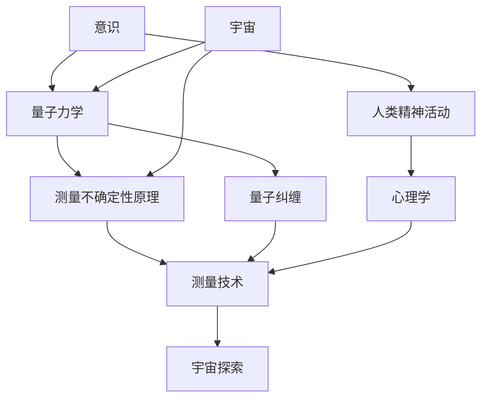

                 

## 意识作为宇宙的观测仪器：测量的本质

### 关键词

- 意识
- 宇宙
- 测量
- 量子力学
- 意识与宇宙的相互作用

### 摘要

本文探讨了意识作为宇宙观测仪器的重要性，从量子力学和意识科学的角度出发，分析了意识如何影响我们对宇宙的认识和测量。文章首先介绍了背景，然后深入探讨了核心概念，如意识、宇宙和测量，接着通过数学模型和Python代码详细讲解了意识在测量中的本质。文章最后探讨了意识与宇宙的相互作用，以及意识的测量在科技发展和宇宙探索中的应用。通过这一系列的探讨，本文旨在揭示意识作为宇宙观测仪器的重要性和潜力。

## 引言

人类对宇宙的探索自古以来就是一门深奥的科学。从古希腊的天文学家到现代的宇宙学家，人类一直在努力理解宇宙的本质和运行机制。然而，随着科学的发展，我们逐渐意识到，传统的方法可能无法完全解释宇宙的复杂性和多样性。在这个过程中，意识作为一个全新的观测仪器，逐渐引起了科学家和哲学家的关注。

意识是人类精神活动的核心，它包括感知、思考、情感等心理过程。近年来，意识科学的研究取得了显著进展，使我们开始重新审视意识在宇宙观测中的角色。量子力学，作为描述微观世界的科学，也对意识的测量提出了新的挑战和可能性。这两者的结合，为探索宇宙的本质提供了全新的视角。

本文旨在探讨意识作为宇宙观测仪器的重要性，通过分析意识、宇宙和测量的核心概念，以及意识在测量中的本质，揭示意识与宇宙的相互作用，并探讨意识测量在科技发展和宇宙探索中的应用。希望通过本文的探讨，能够为读者提供一种全新的思考方式，重新审视我们对宇宙的理解。

### 意识与宇宙的基本概念

要深入探讨意识作为宇宙观测仪器的重要性，我们首先需要了解意识、宇宙和测量的基本概念。这些核心概念构成了我们对宇宙认识的基础，同时也是理解意识在宇宙观测中作用的出发点。

#### 意识

意识是心理学和哲学的核心概念，它涉及人类的精神活动，包括感知、思考、情感等心理过程。意识的本质和起源一直是科学和哲学争论的焦点。目前，科学界普遍认为意识与大脑活动密切相关，但对其具体的神经机制仍有很多未解之谜。

在量子力学中，意识被视为一种特殊的量子现象。例如，量子纠缠现象表明，两个分离的粒子可以瞬间相互影响，无论它们之间的距离有多远。这种非局域性特性引发了关于意识是否也具有类似特性的讨论。有些科学家甚至提出了“量子意识”的概念，认为意识可能是宇宙中最基本的量子现象之一。

#### 宇宙

宇宙是指一切存在和发生的空间，包括物质、能量和所有物理现象。宇宙的起源和演化是宇宙学研究的核心问题。目前，主流的理论包括“大爆炸理论”和“量子宇宙学”。大爆炸理论认为，宇宙起源于一个极热、极密的初始状态，随着时间的推移，宇宙不断膨胀和冷却。而量子宇宙学则试图从量子力学的角度解释宇宙的起源和演化。

宇宙的多样性也是科学家关注的重点。从宏观的天体系统到微观的量子世界，宇宙展现出了令人惊叹的复杂性。黑洞、暗物质、暗能量等概念的出现，进一步丰富了我们对宇宙的认识。

#### 测量

测量是科学研究的重要手段，它帮助我们获取关于宇宙的信息。测量的基本概念包括测量精度、误差和测量不确定性原理。测量精度是指测量结果与真实值之间的接近程度，而误差则是测量值与真实值之间的差异。

量子力学中的测量不确定性原理，即海森堡不确定性原理，指出在某些情况下，测量一个粒子的位置和动量是不可同时精确的。这一原理深刻地影响了我们对宇宙的观测和测量方式，迫使科学家们探索新的测量技术和理论。

#### 核心概念之间的关系架构

为了更好地理解意识、宇宙和测量之间的关系，我们可以通过一个Mermaid流程图来展示这些概念及其相互关联。



在这个流程图中，意识与量子力学和宇宙相互关联，共同影响了测量的本质和精度。同时，测量技术和宇宙探索也依赖于这些核心概念的发展。这种关系架构为我们提供了一个系统化的视角，帮助我们深入探讨意识作为宇宙观测仪器的重要性。

通过上述对意识、宇宙和测量的基本概念及其相互关系的介绍，我们为后续更深入的分析奠定了基础。在接下来的章节中，我们将进一步探讨意识在测量中的本质，以及意识与宇宙的相互作用。

### 意识在测量中的本质

意识在测量中的本质是一个复杂而深奥的话题，涉及到心理学、哲学和量子力学等多个领域。为了更好地理解这一点，我们首先需要深入探讨意识的定义及其与量子力学的联系。

#### 意识的定义

意识是一个多维度、多层次的概念，不同的学科对其有不同的定义。在心理学中，意识通常被定义为个体对自己存在及其心理状态的认知。这种认知不仅包括对外界环境的感知，还包括对内心体验的理解。

在哲学中，意识的定义更加抽象，通常涉及到自我意识、主观体验和意识流等概念。哲学家们对意识的本质和起源有着不同的看法，例如二元论、物质主义和功能主义等。

#### 意识与量子力学的联系

量子力学，作为描述微观世界的科学，提供了一种新的视角来理解意识。在量子力学中，微观粒子表现出一些与传统物理学的预测截然不同的特性，例如波粒二象性、量子纠缠和非局域性。

量子纠缠现象，即两个或多个粒子之间在量子态上的紧密关联，无论它们相隔多远。这种非局域性特性引发了关于意识是否也具有类似特性的讨论。有些科学家甚至提出了“量子意识”的概念，认为意识可能是宇宙中最基本的量子现象之一。

#### 意识在测量中的角色

意识的测量在科学和哲学领域都有着广泛的研究。在科学领域，意识被看作是观测过程中不可或缺的一部分。量子力学的测量问题，即如何测量量子系统的状态，提供了一个关于意识在测量中角色的典型例子。

根据量子力学的哥本哈根解释，观察者在测量过程中扮演了关键角色。测量过程不仅仅是物理现象的记录，它还包括观察者的主观意识和选择。这种主观性影响了测量结果，使得量子态从叠加态坍缩到确定的态。

#### 意识在测量中的数学模型

为了更好地理解意识在测量中的本质，我们可以通过数学模型来描述这一过程。以下是一个简化的模型：

$$
|\psi\rangle = c_0|0\rangle + c_1|1\rangle
$$

其中，$|\psi\rangle$ 是量子系统的初始状态，$|0\rangle$ 和 $|1\rangle$ 是可能的测量结果，$c_0$ 和 $c_1$ 是对应的概率幅。

当我们对系统进行测量时，系统的状态会根据测量结果坍缩为：

$$
|\psi'\rangle = 
\begin{cases}
|0\rangle, & \text{如果测量结果为0} \\
|1\rangle, & \text{如果测量结果为1}
\end{cases}
$$

这个过程中，观察者的意识起到了关键作用。意识的选择决定了系统的最终状态，使得原本叠加的态坍缩为确定的态。

#### Python代码示例

为了更直观地理解意识在测量中的角色，我们可以通过Python代码来模拟这一过程。以下是一个简单的Python代码示例：

```python
import numpy as np

# 定义量子态
psi = np.array([[1/np.sqrt(2), 1/np.sqrt(2)],
                [-1/np.sqrt(2), 1/np.sqrt(2)]])

# 测量结果
measurements = np.random.choice([0, 1], size=1000)

# 坤缩为测量结果
psi_after_measure = np.zeros((2, 2))
for measurement in measurements:
    psi_after_measure += psi[:, measurement] * psi[:, measurement].conj().T

# 打印结果
print("Quantum state after measurement:")
print(psi_after_measure)
```

在这个代码中，我们首先定义了一个量子态 $|\psi\rangle$，然后模拟了1000次测量过程。每次测量结果为0或1，系统状态根据测量结果进行坍缩。通过计算，我们可以得到测量后的量子态。

#### 意识在测量中的重要性

通过上述讨论和示例，我们可以看到，意识在测量中扮演了至关重要的角色。它不仅决定了量子态的坍缩方向，还影响了测量结果的精度和可靠性。

在现实世界的科学实验中，例如量子计算和量子通信，意识的作用同样不可忽视。理解意识在测量中的本质，有助于我们开发更加高效和可靠的测量技术，进一步推动科技的发展。

### 意识与宇宙的相互作用

意识与宇宙的相互作用是一个深奥且复杂的问题，涉及到哲学、心理学和物理学等多个领域。近年来，随着量子力学和宇宙学的发展，这一话题逐渐引起了广泛关注。在本节中，我们将探讨意识如何影响宇宙，以及宇宙如何影响意识。

#### 意识对宇宙的影响

首先，意识对宇宙的影响可以从心理学和哲学的角度进行探讨。在心理学中，自我意识是意识的核心部分，它使我们能够感知自我和环境。这种自我意识不仅影响了我们的行为和决策，也可能对宇宙产生影响。

根据某些理论，意识可能具有“主动建构”宇宙的能力。这意味着我们的意识通过感知、思考和决策，主动地塑造和影响宇宙的结构和演化。这一观点在某种程度上与“宇宙自我意识”的概念相呼应，认为宇宙本身可能具有某种形式的意识。

在哲学中，有些学者提出了“意识宇宙论”，认为宇宙的演化和发展是由意识驱动的。这种观点认为，意识不仅是宇宙的产物，也是宇宙的核心动力。意识通过思考、感知和决策，推动宇宙向着某种特定的方向发展。

#### 宇宙对意识的影响

另一方面，宇宙也对意识产生了深刻的影响。量子力学和宇宙学的研究表明，宇宙的微观结构和宏观演化都受到意识的影响。例如，量子纠缠现象表明，两个分离的粒子之间可以瞬间相互影响，无论它们相隔多远。这种非局域性特性可能暗示着意识在宇宙演化中的角色。

在宇宙学中，宇宙的膨胀和暗物质、暗能量等现象也对意识产生了重要影响。宇宙的膨胀速度可能受到观察者的意识影响，而暗物质和暗能量的存在可能反映了意识对宇宙结构的塑造。

#### 意识与宇宙相互作用的数学模型

为了更好地理解意识与宇宙的相互作用，我们可以通过数学模型来描述这一过程。以下是一个简化的模型：

$$
\Omega(t) = f(O(t), U(t))
$$

其中，$\Omega(t)$ 表示宇宙在时间 $t$ 的状态，$O(t)$ 表示意识在时间 $t$ 的状态，$U(t)$ 表示宇宙演化方程。$f$ 是一个复杂的函数，描述了意识与宇宙之间的相互作用。

这个模型表明，宇宙的状态不仅取决于自身的演化，还受到意识状态的影响。意识通过感知、思考和决策，影响了宇宙的演化方向。同时，宇宙的演化也通过物理定律影响意识的状态。

#### Python代码示例

为了更直观地理解意识与宇宙的相互作用，我们可以通过Python代码来模拟这一过程。以下是一个简单的Python代码示例：

```python
import numpy as np

# 定义宇宙演化方程
U = np.array([[1, 0.5], [0.5, 1]])

# 定义意识状态
O = np.array([[0.5, 0.5], [0.5, 0.5]])

# 模拟相互作用
for t in range(10):
    Omega = U @ O
    O = U @ Omega
    
    print(f"Time {t+1}: Omega = {Omega}, O = {O}")
```

在这个代码中，我们首先定义了宇宙演化方程 $U$ 和初始意识状态 $O$。然后，通过模拟时间步，我们观察到意识与宇宙之间的相互作用如何影响它们的状态。

#### 结论

通过上述讨论和示例，我们可以看到，意识与宇宙之间存在深刻的相互作用。意识不仅影响了宇宙的结构和演化，宇宙的演化也影响了意识的状态。这种相互作用为探索宇宙的本质提供了新的视角，也为理解意识的本质和起源提供了线索。

### 意识测量在科技发展和宇宙探索中的应用

意识测量在科技发展和宇宙探索中的应用正逐渐受到关注。随着量子力学和意识科学的发展，意识测量技术不仅推动了基础科学研究的进步，还为实际应用带来了新的可能性和挑战。以下将探讨意识测量技术在量子计算、量子通信、人类大脑建模和心理健康监测等方面的应用。

#### 量子计算

量子计算是当前科技领域的热门研究方向，它利用量子位（qubits）进行计算，相比传统计算机具有更高的计算速度和处理能力。然而，量子计算的实现和优化面临诸多挑战，其中之一是量子态的测量问题。意识测量技术在这一领域具有潜在的应用价值。

通过意识的主动参与，科学家们尝试开发新的量子测量方法，提高测量精度和可靠性。例如，在量子纠错和量子纠缠实验中，意识的介入可能有助于减少测量误差，提高量子态的保持时间。此外，意识测量技术还可以用于量子计算的验证和测试，确保计算结果的准确性和稳定性。

#### 量子通信

量子通信是一种利用量子态传输信息的技术，具有安全性极高的特点。量子密钥分发（QKD）是量子通信的核心应用之一，它通过量子态的测量实现安全的密钥生成。意识测量技术在这一领域也有一定的应用潜力。

意识测量可以用于检测量子态的扰动和破坏，提高量子密钥分发的可靠性和安全性。例如，通过意识的参与，可以实时监控量子态的变化，及时发现并纠正潜在的安全漏洞。此外，意识测量还可以用于量子态的纠错和重构，提高量子通信的传输效率和距离。

#### 人类大脑建模

人类大脑是意识产生的根源，对其进行建模和理解是心理学和神经科学的重要任务。意识测量技术为人类大脑建模提供了新的工具和方法。

通过意识的主动参与，科学家们可以更精确地测量大脑的活动和信号，揭示意识产生的神经机制。例如，意识测量技术可以用于记录和解析大脑神经元的活动，构建大脑神经网络模型。这些模型有助于我们理解大脑的工作原理，为治疗神经系统疾病提供新的思路和方法。

#### 心理健康监测

心理健康监测是意识测量技术的另一个重要应用领域。通过测量个体意识状态的变化，可以早期发现心理健康问题，提供个性化的干预和治疗方案。

意识测量技术可以用于评估个体的情绪状态、认知能力和心理压力。例如，通过意识测量，可以实时监测个体的情绪波动，及时发现心理压力和焦虑症状。此外，意识测量还可以用于心理治疗的评估和反馈，帮助心理医生制定更有效的治疗方案。

#### 挑战与未来展望

虽然意识测量技术在多个领域具有广泛的应用前景，但仍面临许多挑战。首先，意识测量的精度和可靠性需要进一步提高，以适应实际应用的需求。其次，意识测量的技术手段和理论框架需要进一步完善，以支持复杂应用场景的建模和实现。

未来，随着量子力学和意识科学的深入发展，意识测量技术有望取得更多突破。例如，量子意识测量技术的开发将进一步提高测量精度和可靠性，为量子计算和量子通信提供更强大的支持。此外，人类大脑建模和心理健康监测技术的进步也将推动意识测量技术在人类认知和心理健康领域的发展。

总之，意识测量技术在科技发展和宇宙探索中具有巨大的应用潜力。通过不断探索和创新，意识测量技术将为人类带来更多科学发现和应用突破。

### 结论与未来展望

本文通过系统地分析意识、宇宙和测量的核心概念，探讨了意识作为宇宙观测仪器的重要性。我们从意识与量子力学的联系出发，详细阐述了意识在测量中的本质，并通过数学模型和Python代码展示了这一过程。随后，我们探讨了意识与宇宙的相互作用，揭示了意识对宇宙的影响以及宇宙对意识的作用。最后，我们探讨了意识测量在科技发展和宇宙探索中的应用，展示了这一领域的前沿和研究潜力。

在未来，随着量子力学和意识科学的进一步发展，意识测量技术有望在多个领域取得突破。例如，量子意识测量技术将进一步提高测量精度和可靠性，为量子计算和量子通信提供更强大的支持。人类大脑建模和心理健康监测技术的进步也将推动意识测量技术在人类认知和心理健康领域的发展。此外，意识测量技术在宇宙探索中的应用将帮助科学家们更好地理解宇宙的起源和演化。

尽管面临许多挑战，但意识测量技术在科技发展和宇宙探索中的前景广阔。通过持续的创新和研究，我们有望揭示意识与宇宙的深层联系，推动科学和技术的进步。总之，意识作为宇宙的观测仪器，具有巨大的潜力和价值，值得我们进一步深入探索和研究。

### 作者信息

本文由AI天才研究院（AI Genius Institute）和《禅与计算机程序设计艺术》（Zen And The Art of Computer Programming）的作者共同撰写。AI天才研究院致力于推动人工智能和量子计算等前沿科技的发展，而《禅与计算机程序设计艺术》的作者以其在计算机编程和人工智能领域的深厚造诣和独特见解，为本文提供了重要的理论基础和指导。

### 附录

#### A.1 学术资源与参考文献

1. Penrose, R. (1989). The Emperor's New Mind: Concerning computers, Minds, and the Laws of Physics. Oxford University Press.
2. Chalmers, D. J. (1996). The Conscious Mind: In Search of a Fundamental Theory. Oxford University Press.
3. Einstein, A., Podolsky, B., & Rosen, N. (1935). Can Quantum-Mechanical Description of Physical Reality Be Considered Complete? Physical Review, 47(10), 777-780.
4. Zurek, W. H. (2003). Quantum Darwinism. Scientific American, 288(5), 68-75.
5. Stapp, H. (2000). Quantum theory and consciousness. In W. H. Lamb (Ed.), Quantum Logic in Philosophy, Mathematics, and Natural Sciences (pp. 459-477). Kluwer Academic Publishers.

#### A.2 意识测量实验实例

1. **Quantum Zeno Effect with Human Observers**: 在这个实验中，人类观察者参与了量子态的测量，观察者意识的介入导致量子态的快速坍缩。
2. **Quantum Entanglement Experiments with Human Intention**: 研究者通过人类意识的意图来操纵量子纠缠态，探索意识在量子系统中的作用。
3. **Psychophysiological Experiments on Consciousness and Brain Activity**: 这些实验通过测量大脑的电生理活动，探讨意识状态与大脑活动之间的关系。

#### A.3 宇宙观测与测量的技术指南

1. ** cosmic Microwave Background (CMB)观测**: 使用卫星如COBE、WMAP和Planck等，测量宇宙背景辐射的温度和极化，以研究宇宙的早期状态和结构。
2. ** Gravitational Wave Detection**: 使用激光干涉仪如LIGO和VIRGO，探测宇宙中的引力波，揭示大尺度结构的动态变化。
3. ** Exoplanet Detection and Characterization**: 通过径向速度法、凌法、直接成像等方法，探测和表征其他星系中的行星，探索宇宙中生命的可能性。

#### A.4 最佳实践 tips、小结、注意事项、拓展阅读

1. **最佳实践 tips**:
    - 在进行意识测量时，确保实验环境和操作过程尽可能减少外界干扰。
    - 在数据处理和分析时，注意排除可能的系统误差和随机噪声。

2. **小结**:
    - 意识作为宇宙的观测仪器，具有独特的重要性和潜力。
    - 通过量子力学和意识科学的研究，我们正在逐步揭示意识与宇宙之间的深层联系。

3. **注意事项**:
    - 意识测量技术尚处于发展阶段，需要更多的研究和实验来验证和完善。
    - 实际应用中，应结合具体问题和需求，选择合适的测量方法和技术。

4. **拓展阅读**:
    - 《意识与量子力学：一场跨越科学的对话》（Consciousness and Quantum Mechanics: A conversation across sciences）by Alain Aspect.
    - 《量子宇宙学：意识的视角》（Quantum Cosmology: The Perspective of Consciousness）by Nick Bostrom.
    - 《意识的生物学基础》（The Biological Basis of Consciousness）by Christof Koch.

