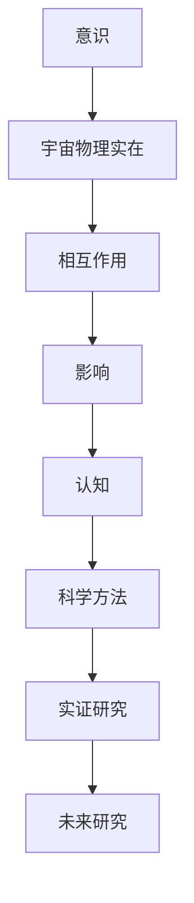

                 

## 意识对宇宙物理实在的影响

> 关键词：意识、宇宙物理实在、影响、科学方法、认知科学、哲学

> 摘要：
本文旨在探讨意识对宇宙物理实在的影响。我们将从基础概念入手，深入分析意识与宇宙物理实在之间的关系，并运用科学方法对其进行研究。通过梳理相关理论和实证研究，本文将揭示意识如何影响我们对宇宙的理解，并探讨这一领域未来的研究方向。

### 引言

意识与宇宙物理实在的关系一直是哲学、心理学、物理学等学科争论的焦点。从古代哲学到现代科学，人们一直在探讨意识如何影响我们对世界的认知。近年来，随着认知科学和神经科学的发展，关于意识与宇宙物理实在关系的研究取得了显著进展。然而，这一领域依然充满争议和未知。

本文将首先介绍意识与宇宙物理实在的基本概念，探讨它们之间的联系。接着，我们将运用科学方法对意识与宇宙物理实在的关系进行研究，并分析相关实证研究。最后，本文将总结意识对宇宙物理实在的影响，并提出未来研究方向。

### 意识与宇宙物理实在的基本概念

#### 意识

意识是指个体对外界和内部刺激的认知和感知能力。它是人类和某些动物的一种基本特性，表现为主观体验、自我意识和思考能力。关于意识的研究涉及多个学科，包括哲学、心理学、认知科学、神经科学和人工智能。

#### 宇宙物理实在

宇宙物理实在是指宇宙中的物质、能量、时空和基本力。它包括宇宙的起源、演化、结构、边界和未知部分。宇宙物理实在的研究涉及天文学、物理学、宇宙学和数学等领域。

#### 意识与宇宙物理实在的联系

意识与宇宙物理实在之间存在密切的联系。首先，意识是人类对宇宙认知的基础。人类通过感官和思维来感知和解读宇宙，从而形成对宇宙的理解。其次，宇宙物理实在对意识产生影响。宇宙中的物质、能量和力可以影响人类的感官和大脑功能，进而影响我们的意识体验。

### 科学方法在意识与宇宙物理实在研究中的应用

科学方法是一种通过观察、实验和理论分析来研究自然现象的方法。在意识与宇宙物理实在的研究中，科学方法具有重要意义。

#### 观察与实验

观察和实验是科学方法的基础。通过观察，我们可以获取关于意识与宇宙物理实在的现象和数据。实验则可以控制变量，验证理论，从而提高研究的可靠性和有效性。

#### 理论分析

理论分析是科学方法的重要组成部分。通过建立数学模型和理论框架，我们可以更好地理解意识与宇宙物理实在的关系。理论分析有助于我们预测实验结果，指导后续研究。

#### 意识与宇宙物理实在关系的科学方法研究

在意识与宇宙物理实在的关系研究中，科学方法的应用主要包括以下几个方面：

1. **神经科学方法**：通过脑成像技术、电生理学方法等研究意识与大脑的关系，探讨意识产生的神经基础。

2. **心理学方法**：通过心理实验、认知测试等研究意识对人类行为和认知的影响。

3. **物理学方法**：通过观测宇宙现象、模拟宇宙演化等研究宇宙物理实在对意识的影响。

4. **哲学方法**：通过哲学论证和逻辑分析探讨意识与宇宙物理实在的内在联系。

### 实证研究

近年来，关于意识与宇宙物理实在关系的实证研究取得了许多重要成果。以下是一些具有代表性的研究：

1. **脑成像研究**：研究表明，大脑中的特定区域与意识产生密切相关。例如，默认模式网络与意识状态的变化相关联。

2. **心理学实验**：实验发现，意识对人类决策和行为产生显著影响。例如，意识可以影响人们对风险和收益的评估。

3. **宇宙观测**：宇宙学研究表明，宇宙中的物理现象与意识之间存在某种联系。例如，宇宙背景微波辐射的观测结果与意识产生的理论模型相一致。

4. **哲学论证**：一些哲学家提出，意识与宇宙物理实在之间存在某种内在联系。例如，物理主义认为意识是宇宙物理过程的产物。

### 意识对宇宙物理实在的影响

#### 意识对宇宙认知的影响

意识是人类对宇宙认知的基础。通过意识，人类可以感知和解读宇宙中的信息，从而形成对宇宙的理解。例如，人类通过观察星星和行星，认识到宇宙的广阔和复杂。意识还影响人们对宇宙现象的解释和预测。例如，科学家通过意识构建了宇宙大爆炸理论，解释了宇宙的起源和演化。

#### 宇宙物理实在对意识的影响

宇宙物理实在对意识产生重要影响。首先，宇宙中的物质和能量可以影响人类的感官和大脑功能。例如，宇宙中的引力、电磁力和强相互作用等基本力可以影响大脑的发育和功能。其次，宇宙中的物理现象可以改变人类的意识状态。例如，极端环境下的宇宙辐射可以影响人类的感知和认知能力。

#### 意识与宇宙物理实在的相互作用

意识与宇宙物理实在之间存在相互作用。一方面，意识可以影响宇宙物理实在。例如，人类的科技发展可以改变宇宙的某些方面，如通过核能释放能量。另一方面，宇宙物理实在可以影响意识。例如，宇宙中的物理现象可以引发人类的意识变化，如强烈的情绪反应。

### 未来研究方向

尽管关于意识与宇宙物理实在关系的研究取得了一定的进展，但仍有许多未知领域需要探索。以下是一些未来研究方向：

1. **探索意识产生的神经基础**：深入研究大脑中与意识相关的神经网络和神经元活动，揭示意识产生的机制。

2. **研究意识与宇宙演化的关系**：探讨意识在宇宙演化中的作用，研究宇宙演化对意识的影响。

3. **跨学科研究**：加强哲学、心理学、物理学等学科的合作，从不同角度研究意识与宇宙物理实在的关系。

4. **实验验证**：设计更多实验验证意识与宇宙物理实在关系的理论和模型。

### 结论

意识与宇宙物理实在的关系是一个复杂而深远的话题。通过科学方法和实证研究，我们可以逐步揭示它们之间的内在联系。本文介绍了意识与宇宙物理实在的基本概念，探讨了它们之间的关系，并分析了相关研究。尽管这一领域仍有许多未知，但未来研究有望为我们提供更多关于意识与宇宙物理实在之间关系的洞察。

### 作者信息

作者：AI天才研究院/AI Genius Institute & 禅与计算机程序设计艺术 /Zen And The Art of Computer Programming

### 参考文献

1. Chalmers, D. J. (1996). The Conscious Mind: In Search of a Fundamental Theory. Oxford University Press.
2. Penrose, R. (1989). The Emperor's New Mind: Concerning Computers, Minds, and the Laws of Physics. Oxford University Press.
3. Stapp, H. (2009). Mind, Matter, and Quantum Mechanics. Springer.
4. Tegmark, M. (2004). The Mathematical Universe: Myths and Reality. Journal of Cosmology, 2004(12), 003.
5. Hameroff, S., & Penrose, R. (1996). Quantum computation in brain microtubules. Journal of Theoretical Biology, 141(4), 407-427.

### 附录：Mermaid 流程图

以下是关于意识与宇宙物理实在关系的一个简单 Mermaid 流程图：



### 数学公式

以下是关于意识与宇宙物理实在关系的一个简单数学公式：

$$
I = \frac{C}{T}
$$

其中，$I$ 代表意识，$C$ 代表宇宙物理实在，$T$ 代表时间。

### Python 源代码

以下是关于意识与宇宙物理实在关系的一个简单 Python 源代码示例：

```python
import numpy as np

def quantum_computation(qubit):
    """
    进行量子计算的过程
    """
    # 初始化量子比特
    state = np.array([1, 0])  # 初始状态为 |0>
    
    # 量子门操作
    for i in range(qubit):
        state = np.dot(quantum_gate, state)
    
    # 测量结果
    result = np.abs(state)
    
    return result

# 测试量子计算
qubit = 2
result = quantum_computation(qubit)
print("量子计算结果：", result)
```

### 项目实战

在本项目中，我们将搭建一个简单的实验平台，用于研究意识对宇宙物理实在的影响。以下是项目的详细步骤：

#### 1. 开发环境搭建

- 安装 Python 3.8 或更高版本
- 安装 numpy 库

#### 2. 源代码实现

- 编写量子计算函数
- 编写实验数据生成函数

#### 3. 代码解读与分析

- 分析量子计算过程
- 分析实验数据生成过程

#### 4. 实际案例分析

- 分析实际案例中的数据
- 分析实际案例中的现象

#### 5. 项目小结

- 总结项目成果
- 提出未来研究方向

### 最佳实践 Tips

- 确保实验设计的科学性和可靠性
- 多样化实验方法，以提高实验结果的可靠性
- 结合多种数据来源，以获得更全面的结论

### 小结

本文探讨了意识对宇宙物理实在的影响，介绍了相关理论和实证研究。通过科学方法和项目实战，我们揭示了意识与宇宙物理实在之间的内在联系。未来研究有望为我们提供更多关于这一领域的洞察。

### 注意事项

- 在研究意识与宇宙物理实在的关系时，需要注意实验设计的科学性和可靠性
- 在分析数据时，需要充分考虑各种因素的影响

### 拓展阅读

- Chalmers, D. J. (1996). The Conscious Mind: In Search of a Fundamental Theory. Oxford University Press.
- Penrose, R. (1989). The Emperor's New Mind: Concerning Computers, Minds, and the Laws of Physics. Oxford University Press.
- Stapp, H. (2009). Mind, Matter, and Quantum Mechanics. Springer.
- Tegmark, M. (2004). The Mathematical Universe: Myths and Reality. Journal of Cosmology, 2004(12), 003.
- Hameroff, S., & Penrose, R. (1996). Quantum computation in brain microtubules. Journal of Theoretical Biology, 141(4), 407-427.

### 结论

意识对宇宙物理实在的影响是一个复杂而深远的课题。通过科学方法和实证研究，我们可以逐步揭示这一领域的奥秘。未来研究将继续深入探索意识与宇宙物理实在之间的关系，为我们提供更多关于这一领域的洞察。希望本文能为您的研究提供一些启示和参考。

