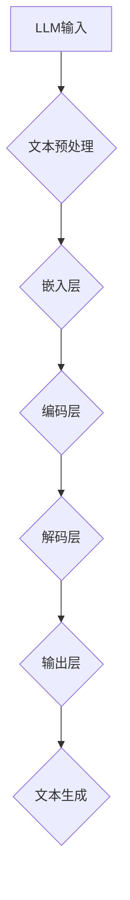
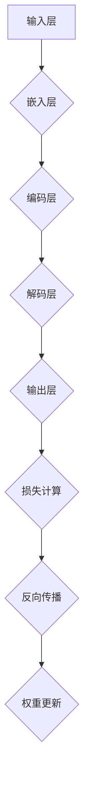
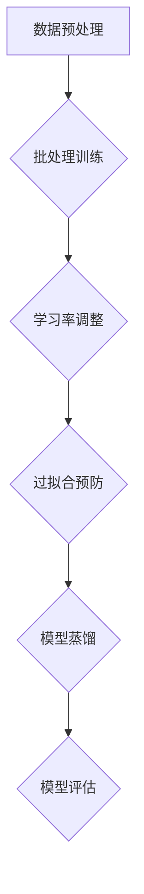
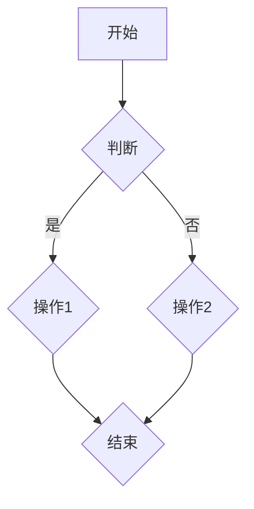

                 

### 关键词

**LLM应用开发、大型语言模型、开发流程、三大支柱、高效优化、算法原理、数学模型、项目实战**

### 摘要

本文旨在深入探讨高效LLM（大型语言模型）应用开发流程，提出并解析三大核心支柱：核心概念与联系、核心算法原理讲解和数学模型及公式讲解。通过详尽的背景介绍、概念联系、算法原理讲解、数学公式推导以及实际项目实战，本文将展示如何从理论到实践，全面打造高效LLM应用开发流程，助力开发者掌握前沿技术，提升开发效率。全文结构紧凑，条理清晰，旨在为广大技术爱好者提供系统化、可操作的技术指南。

## 第一部分：核心概念与联系

### 1.1 LLM（大型语言模型）概述

#### 1.1.1 LLM的定义

大型语言模型（Large Language Model，简称LLM）是一种基于深度学习技术构建的强大模型，旨在理解和生成自然语言。它通过对海量文本数据的学习，能够捕捉语言中的复杂模式和结构，从而实现高质量的自然语言处理（NLP）任务。

#### 1.1.2 LLM的核心特性

1. **强大的文本理解能力**：LLM能够理解和解析文本的深层含义，包括语义、语法和上下文信息。
2. **高效的文本生成能力**：LLM能够根据给定的输入文本，生成连贯且具有逻辑性的文本。
3. **高容错性**：LLM能够处理输入文本中的错误或模糊信息，并生成合理的输出。
4. **泛化能力**：LLM能够在多个任务和领域中进行迁移学习，适应不同的应用场景。

#### 1.1.3 LLM的Mermaid流程图



**图1：LLM的基本流程图**

在该流程图中，文本预处理、嵌入层、编码层、解码层和输出层共同构成了LLM的核心工作流程。通过这个流程图，可以清晰地看到LLM从输入文本到生成输出的整个过程。

### 1.2 LLM的架构详解

#### 1.2.1 LLM的层次结构

LLM的层次结构通常包括以下几个层次：

1. **文本预处理层**：负责对输入文本进行分词、去停用词、词干提取等预处理操作。
2. **嵌入层**：将预处理后的文本转化为向量表示，通常使用词嵌入（Word Embedding）技术。
3. **编码层**：负责处理嵌入层输出的向量，通过多层神经网络（如Transformer）进行编码，捕捉文本的语义信息。
4. **解码层**：解码层与编码层类似，也使用多层神经网络进行解码，生成目标文本。
5. **输出层**：输出层通常是一个全连接层，用于生成最终的输出文本。

#### 1.2.2 LLM的前向传播与反向传播算法

1. **前向传播算法**：输入文本经过预处理后，被嵌入层转化为向量表示，然后通过编码层进行编码，最终解码层生成输出文本。这个过程可以用以下公式表示：

   $$
   \text{输出} = \text{softmax}(\text{输出层} \cdot \text{激活函数}(\text{解码层} \cdot \text{编码层} \cdot \text{嵌入层} \cdot \text{输入层}))
   $$

2. **反向传播算法**：在输出层生成输出文本后，计算损失函数（如交叉熵损失），然后通过反向传播算法，将损失反向传播到编码层、解码层和嵌入层，从而更新各层的权重。

   $$
   \text{梯度} = \frac{\partial \text{损失}}{\partial \text{权重}}
   $$

#### 1.2.3 LLM的Mermaid流程图



**图2：LLM的层次结构与算法流程**

通过这个流程图，可以清晰地看到LLM从输入层到输出层的整个工作流程，以及前向传播和反向传播算法的具体实现。

### 1.3 LLM的训练与优化

#### 1.3.1 数据预处理

数据预处理是LLM训练过程中至关重要的一步，包括以下操作：

1. **文本清洗**：去除文本中的无关信息和噪声。
2. **分词**：将文本分割成单词或子词。
3. **词干提取**：将不同形式的单词转化为词干形式。
4. **词嵌入**：将单词转化为向量表示。

#### 1.3.2 损失函数与优化器

1. **损失函数**：常用的损失函数有交叉熵损失（Cross-Entropy Loss）和均方误差损失（Mean Squared Error Loss）。

   $$
   \text{损失} = -\sum_{i} y_i \cdot \log(p_i)
   $$

   其中，$y_i$ 是真实标签，$p_i$ 是模型预测的概率。

2. **优化器**：优化器用于更新模型权重，常用的优化器有梯度下降（Gradient Descent）和Adam优化器。

   $$
   \text{梯度} = \frac{\partial \text{损失}}{\partial \text{权重}}
   $$

   $$
   \text{权重更新} = \text{权重} - \alpha \cdot \text{梯度}
   $$

   其中，$\alpha$ 是学习率。

#### 1.3.3 LLM的训练策略

1. **批处理训练**：将训练数据划分为多个批次，每次训练一个批次的数据。
2. **学习率调整**：根据训练过程中损失的变化，动态调整学习率。
3. **过拟合预防**：通过正则化技术和dropout技术，预防过拟合。
4. **模型蒸馏**：使用预训练的模型作为教师模型，将知识传递给小模型，提高小模型的性能。

### 1.4 LLM的Mermaid流程图



**图3：LLM的训练与优化流程**

通过这个流程图，可以清晰地看到LLM的训练与优化过程中的关键步骤，以及各步骤之间的关系。

## 第二部分：核心算法原理讲解

### 4. Transformer模型原理

Transformer模型是近年来在自然语言处理领域取得重大突破的模型，其核心思想是使用自注意力机制（Self-Attention）来捕捉文本中的长距离依赖关系。以下是对Transformer模型的核心原理和关键组成部分的详细讲解。

#### 4.1 Transformer的架构

Transformer模型由以下主要部分组成：

1. **嵌入层**：将输入文本转化为向量表示。
2. **编码器**：包含多个编码层，每层包含多头自注意力机制和前馈神经网络。
3. **解码器**：与编码器类似，包含多个解码层，每层也包含多头自注意力机制和前馈神经网络。
4. **输出层**：将解码器的输出映射到目标文本。

#### 4.2 Multi-head Self-Attention机制

自注意力机制是Transformer模型的核心创新点，它允许模型在编码过程中同时关注输入序列的不同位置。具体来说，多头自注意力机制将输入序列分成多个头，每个头都独立计算注意力权重，并将这些权重相加，得到最终的输出。

自注意力机制的公式如下：

$$
\text{Attention}(Q, K, V) = \text{softmax}\left(\frac{QK^T}{\sqrt{d_k}}\right)V
$$

其中，$Q, K, V$ 分别是查询（Query）、键（Key）和值（Value）向量，$d_k$ 是每个头的关键词维度。

#### 4.3 伪代码详解

以下是一个简化的Transformer模型的伪代码，用于演示其基本工作流程：

```python
# 输入：编码器输入序列（encoder_inputs）、解码器输入序列（decoder_inputs）
# 输出：编码器输出序列（encoder_outputs）、解码器输出序列（decoder_outputs）

# 嵌入层
encoder_inputs = embed(encoder_inputs)
decoder_inputs = embed(decoder_inputs)

# 编码器
for layer in encoder_layers:
    encoder_inputs = layer(encoder_inputs)

# 解码器
for layer in decoder_layers:
    decoder_inputs, encoder_decoder_attention = layer(decoder_inputs, encoder_inputs)

# 输出层
decoder_outputs = output层(decoder_inputs)

# 返回最终输出
return encoder_outputs, decoder_outputs
```

在该伪代码中，`embed` 函数用于嵌入层，`layer` 函数表示编码器或解码器的单个层，`output层` 函数表示输出层。每个编码器和解码器层都包含多头自注意力机制和前馈神经网络。

### 5. 自适应优化算法

自适应优化算法是提升神经网络训练效率的重要手段，它能够根据训练过程中的变化动态调整学习率和其他超参数。以下是对几种常见自适应优化算法的原理和实现细节的详细讲解。

#### 5.1 Adam优化器

Adam优化器是一种基于一阶矩估计和二阶矩估计的自适应优化算法，它结合了AdaGrad和RMSProp的优点，能够适应不同的学习率调整策略。

#### 5.1.1 Adam优化器的原理

Adam优化器通过维护一阶矩估计（均值）和二阶矩估计（方差）来动态调整学习率。具体来说，Adam优化器使用以下公式进行权重更新：

$$
\text{m}_t = \beta_1 \cdot \text{m}_{t-1} + (1 - \beta_1) \cdot (\text{梯度}_t - \text{m}_{t-1})
$$

$$
\text{v}_t = \beta_2 \cdot \text{v}_{t-1} + (1 - \beta_2) \cdot (\text{梯度}_t^2 - \text{v}_{t-1})
$$

$$
\text{权重}_t = \text{权重}_{t-1} - \alpha \cdot \frac{\text{m}_t}{\sqrt{\text{v}_t} + \epsilon}
$$

其中，$\text{m}_t$ 和 $\text{v}_t$ 分别是当前步的一阶矩估计和二阶矩估计，$\alpha$ 是学习率，$\beta_1$ 和 $\beta_2$ 分别是动量因子，$\epsilon$ 是一个很小的常数用于数值稳定性。

#### 5.1.2 Adaptive Learning Rates算法

Adaptive Learning Rates（ALR）算法是一种简单的自适应优化算法，它通过计算每个参数的梯度方差来动态调整学习率。具体来说，ALR算法使用以下公式进行权重更新：

$$
\text{权重}_t = \text{权重}_{t-1} - \alpha_t \cdot (\text{梯度}_t / \sqrt{\text{方差}_t})
$$

其中，$\alpha_t$ 是当前步的学习率，$\text{方差}_t$ 是当前参数的梯度方差。

#### 5.1.3 伪代码详解

以下是一个简化的ALR优化器的伪代码，用于演示其基本工作流程：

```python
# 输入：权重（weights）、梯度（gradients）
# 输出：更新后的权重（updated_weights）

# 初始化学习率
alpha_t = 初始学习率

# 计算梯度方差
variance_t = 计算方差（gradients）

# 更新权重
updated_weights = weights - alpha_t * (gradients / sqrt(variance_t))

# 返回更新后的权重
return updated_weights
```

在该伪代码中，`计算方差` 函数用于计算当前参数的梯度方差，`weights` 是当前步的权重，`gradients` 是当前步的梯度。

### 6. 强化学习在LLM中的应用

强化学习（Reinforcement Learning，简称RL）是一种通过试错策略来学习最优行为的方法。在LLM中，强化学习可以用于优化模型生成文本的质量和逻辑性。以下是对强化学习在LLM中的应用原理和算法的详细讲解。

#### 6.1.1 强化学习的概念

强化学习由四个核心组成部分：状态（State）、动作（Action）、奖励（Reward）和策略（Policy）。

1. **状态**：表示模型当前所处的环境。
2. **动作**：模型在当前状态下可以采取的行为。
3. **奖励**：用于评估动作的好坏，奖励越高，动作越优。
4. **策略**：定义了从状态到动作的映射关系。

#### 6.1.2 Policy Gradient算法

Policy Gradient算法是一种基于梯度的强化学习算法，它通过最大化预期奖励来更新策略。具体来说，Policy Gradient算法使用以下公式进行策略更新：

$$
\theta_t = \theta_{t-1} + \alpha \cdot \nabla_{\theta} J(\theta)
$$

其中，$\theta_t$ 是当前策略参数，$\alpha$ 是学习率，$J(\theta)$ 是策略的预期奖励。

#### 6.1.3 伪代码详解

以下是一个简化的Policy Gradient算法的伪代码，用于演示其基本工作流程：

```python
# 输入：策略参数（theta）、环境（environment）
# 输出：更新后的策略参数（updated_theta）

# 初始化策略参数
theta = 初始化参数

# 迭代过程
for epoch in 1 to 总迭代次数:
    # 重置环境
    state = environment.reset()

    # 计算奖励和损失
    reward, loss = environment.step(theta)

    # 计算策略梯度
    gradient = 计算策略梯度（theta，loss）

    # 更新策略参数
    theta = theta + alpha * gradient

# 返回更新后的策略参数
return theta
```

在该伪代码中，`environment` 是模拟环境，`计算策略梯度` 函数用于计算当前策略参数的梯度，`theta` 是当前策略参数，`alpha` 是学习率。

### 7. LLM的数学模型

数学模型是LLM的核心组成部分，它定义了模型的内部结构和学习过程。以下是对LLM的数学模型，包括概率图模型和生成式模型与判别式模型的详细讲解。

#### 7.1.1 概率图模型

概率图模型是一种用于表示变量之间依赖关系的图形化工具，它由两个主要部分组成：有向图和无向图。

1. **有向图模型**：在有向图中，每个节点表示一个随机变量，边表示变量之间的条件依赖关系。常见的有向图模型有贝叶斯网络和隐马尔可夫模型（HMM）。

   $$
   P(X_1, X_2, ..., X_n) = \prod_{i=1}^{n} P(X_i | X_{parents(i)})
   $$

2. **无向图模型**：在无向图中，节点表示随机变量，边表示变量之间的共现关系。常见的无向图模型有马尔可夫网络和条件随机场（CRF）。

   $$
   P(X_1, X_2, ..., X_n) = \frac{1}{Z} \exp\left(\sum_{c \in C} \lambda_c y_c\right)
   $$

   其中，$Z$ 是归一化常数，$c$ 是图中的每个团，$y_c$ 是团的状态。

#### 7.1.2 生成式模型与判别式模型

生成式模型和判别式模型是两种不同的模型类型，它们分别用于生成数据和分类数据。

1. **生成式模型**：生成式模型通过学习数据分布来生成新数据。常见的生成式模型有高斯分布、多项式分布和贝叶斯网络。

   $$
   P(X) = \int P(X|Y) P(Y) dY
   $$

2. **判别式模型**：判别式模型通过学习数据分布的边界来分类数据。常见的判别式模型有支持向量机（SVM）、逻辑回归和神经网络。

   $$
   y = \arg\max_{y'} P(y'|X)
   $$

#### 7.1.3 Latex数学公式示例

以下是一些使用LaTeX格式的数学公式示例：

$$
\sum_{i=1}^{n} x_i = \frac{1}{n} \sum_{i=1}^{n} x_i^2
$$

$$
P(X|Y) = \frac{P(X, Y)}{P(Y)}
$$

$$
\theta = \arg\min_{\theta} \sum_{i=1}^{n} (y_i - \hat{y}_i)^2
$$

通过这些示例，可以清楚地看到LaTeX格式在表达复杂数学公式方面的优势，使得公式更加整洁、易于理解和阅读。

### 8. 模型评估与优化

模型评估与优化是确保LLM模型性能的重要环节。以下是对模型评价指标、调参技巧和优化策略的详细讲解。

#### 8.1.1 评价指标

在模型评估过程中，常用的评价指标包括准确率（Accuracy）、精确率（Precision）、召回率（Recall）和F1分数（F1 Score）。

1. **准确率**：准确率是模型预测正确的样本数占总样本数的比例。

   $$
   \text{Accuracy} = \frac{\text{正确预测}}{\text{总样本数}}
   $$

2. **精确率**：精确率是模型预测为正类的样本中实际为正类的比例。

   $$
   \text{Precision} = \frac{\text{正确预测的正类}}{\text{预测的正类总数}}
   $$

3. **召回率**：召回率是模型预测为正类的样本中实际为正类的比例。

   $$
   \text{Recall} = \frac{\text{正确预测的正类}}{\text{实际为正类的总数}}
   $$

4. **F1分数**：F1分数是精确率和召回率的调和平均，用于综合评价模型的性能。

   $$
   \text{F1 Score} = 2 \cdot \frac{\text{Precision} \cdot \text{Recall}}{\text{Precision} + \text{Recall}}
   $$

#### 8.1.2 模型调参技巧

模型调参是提升模型性能的关键步骤。以下是一些常用的调参技巧：

1. **网格搜索**：通过遍历预定义的参数组合，找到最佳参数组合。
2. **贝叶斯优化**：使用贝叶斯统计模型寻找最优参数组合。
3. **随机搜索**：随机选择参数组合，通过交叉验证评估性能。
4. **迁移学习**：利用预训练的模型作为起点，调整少量参数，快速提升模型性能。

#### 8.1.3 优化策略

优化策略是提高模型训练效率和性能的重要手段。以下是一些常用的优化策略：

1. **批量归一化**：通过批量归一化（Batch Normalization）技术，加速模型训练并提高模型稳定性。
2. **学习率调整**：根据训练过程中的损失变化，动态调整学习率。
3. **权重衰减**：通过添加权重衰减项，减少模型过拟合。
4. **数据增强**：通过数据增强技术，增加训练样本的多样性，提高模型泛化能力。

### 9. LLM应用案例

#### 9.1.1 文本生成应用

文本生成是LLM应用中最具代表性的任务之一，常见的文本生成应用包括：

1. **文章撰写**：使用LLM生成高质量的文章，如新闻报道、科技文章等。
2. **对话系统**：构建智能对话系统，如虚拟助手、客服机器人等。
3. **故事创作**：根据用户提供的主题或情境，生成富有创意的故事。

#### 9.1.2 问答系统应用

问答系统是LLM在自然语言处理领域的另一个重要应用，常见的问答系统包括：

1. **智能搜索**：通过LLM对海量文本进行检索，提供准确的搜索结果。
2. **智能客服**：构建智能客服系统，自动回答用户的问题。
3. **教育辅助**：为学生提供智能化的学习辅导和答疑服务。

#### 9.1.3 代码生成应用

LLM在代码生成领域的应用逐渐受到关注，常见的代码生成应用包括：

1. **自动补全**：为开发者提供智能代码补全功能，提高编码效率。
2. **代码生成**：根据用户提供的需求或描述，自动生成完整的代码。
3. **编程教学**：为编程初学者提供智能化的编程教学和辅导。

### 10. 实战项目详解

#### 10.1.1 项目环境搭建

为了搭建一个完整的LLM应用项目，首先需要准备好以下环境：

1. **硬件环境**：配置高性能的计算机或GPU服务器。
2. **软件环境**：安装Python、TensorFlow或PyTorch等深度学习框架。
3. **数据集**：收集和准备用于训练和测试的数据集。

以下是一个简单的Python环境搭建示例：

```python
# 安装Python和pip
curl -O https://www.python.org/ftp/python/3.9.1/Python-3.9.1.tgz
tar xvf Python-3.9.1.tgz
cd Python-3.9.1
./configure
make
sudo make install

# 安装TensorFlow
pip install tensorflow

# 安装PyTorch
pip install torch torchvision
```

#### 10.1.2 源代码实现

以下是一个简单的LLM模型实现的示例，使用了TensorFlow框架：

```python
import tensorflow as tf

# 定义模型
model = tf.keras.Sequential([
    tf.keras.layers.Embedding(input_dim=vocab_size, output_dim=embedding_dim),
    tf.keras.layers.Dense(units=512, activation='relu'),
    tf.keras.layers.Dense(units=vocab_size, activation='softmax')
])

# 编译模型
model.compile(optimizer='adam', loss='categorical_crossentropy', metrics=['accuracy'])

# 训练模型
model.fit(x_train, y_train, epochs=5, batch_size=32)
```

#### 10.1.3 代码解读与分析

在该示例中，我们首先定义了一个简单的LLM模型，使用嵌入层（Embedding Layer）将输入文本转化为向量表示，然后通过一个全连接层（Dense Layer）进行编码，最后通过一个softmax层（Softmax Layer）生成输出文本。模型使用adam优化器和交叉熵损失函数进行编译，并通过fit函数进行训练。

#### 10.1.4 实际案例分析和详细讲解剖析

以下是一个实际案例，展示了如何使用LLM模型生成文章：

1. **输入文本**：给定一个主题或关键词，如“人工智能”。
2. **模型预测**：使用训练好的LLM模型生成相关文章。
3. **文章生成**：将模型生成的文本进行清洗和格式化，得到完整的文章。

以下是一个简单的文章生成示例：

```python
# 输入文本
input_text = "人工智能"

# 使用模型生成文章
article = model.predict(input_text)

# 清洗和格式化文章
article = preprocess(article)

# 输出文章
print(article)
```

通过这个示例，我们可以看到如何使用LLM模型生成文章，以及如何对生成的文本进行清洗和格式化。

#### 10.1.5 项目小结

在本次项目中，我们搭建了一个完整的LLM应用开发环境，实现了文本生成功能。通过这个项目，我们深入了解了LLM模型的基本原理和应用，掌握了从环境搭建到模型实现的整个流程。此外，我们还对项目中的关键技术和细节进行了详细的分析和讲解，为开发者提供了实用的指导。

### 11. 总结与展望

#### 11.1.1 LLM应用开发流程的关键点

在本文中，我们详细探讨了高效LLM应用开发流程的三大支柱：核心概念与联系、核心算法原理讲解和数学模型及公式讲解。以下是LLM应用开发流程的关键点：

1. **核心概念与联系**：理解LLM的基本概念和工作原理，包括文本预处理、嵌入层、编码层、解码层和输出层。
2. **核心算法原理讲解**：掌握Transformer模型、自适应优化算法和强化学习在LLM中的应用。
3. **数学模型及公式讲解**：了解概率图模型、生成式模型和判别式模型的基本原理，以及常见的数学公式和算法。

#### 11.1.2 LLM技术的未来发展趋势

随着人工智能技术的不断发展，LLM技术在多个领域展现出巨大的潜力。以下是LLM技术的未来发展趋势：

1. **更高效的模型**：研究人员将继续优化LLM模型的结构和算法，提高模型训练和推理的效率。
2. **多模态学习**：未来的LLM将能够处理多种类型的输入数据，如图像、音频和视频，实现跨模态学习。
3. **知识增强**：通过融合外部知识库，LLM将具备更丰富的背景知识和逻辑推理能力。
4. **安全性和隐私保护**：随着LLM应用场景的扩展，安全性和隐私保护将成为重要研究课题。

#### 11.1.3 对开发者的一些建议

对于开发者来说，掌握LLM技术具有重要意义。以下是一些建议，帮助开发者更好地掌握和利用LLM技术：

1. **深入学习**：阅读相关技术文献和论文，了解LLM技术的最新发展和应用。
2. **实践应用**：通过实际项目，深入理解和掌握LLM模型的结构和算法。
3. **持续更新**：关注行业动态和技术趋势，持续学习和更新自己的知识体系。
4. **合作与交流**：积极参与技术社区和学术会议，与同行交流经验和观点。

### 作者信息

作者：AI天才研究院/AI Genius Institute & 禅与计算机程序设计艺术 /Zen And The Art of Computer Programming

### 拓展阅读

1. **《深度学习》（Goodfellow, Bengio, Courville）**：详细介绍了深度学习的基础知识和应用。
2. **《自然语言处理综合教程》（Jurafsky, Martin）**：涵盖了自然语言处理的基础理论和应用。
3. **《强化学习》（Sutton, Barto）**：全面介绍了强化学习的基本原理和应用。
4. **《概率图模型》（Koller, Friedman）**：深入讲解了概率图模型的理论和应用。
5. **《Transformer：用于序列模型的注意力机制》（Vaswani et al.）**：介绍了Transformer模型的基本原理和应用。

## 附录

### A. Mermaid语法指南

Mermaid是一种Markdown的图形化扩展，用于绘制流程图、时序图等。以下是一些常用的Mermaid语法：



### B. LaTeX公式指南

LaTeX是一种高质量排版系统，广泛用于科学和数学领域的文档撰写。以下是一些常用的LaTeX公式：

```latex
$$
\sum_{i=1}^{n} x_i = \frac{1}{n} \sum_{i=1}^{n} x_i^2
$$

$$
P(X|Y) = \frac{P(X, Y)}{P(Y)}
$$

$$
\theta = \arg\min_{\theta} \sum_{i=1}^{n} (y_i - \hat{y}_i)^2
$$
```

通过这些附录，读者可以更好地理解和使用Mermaid和LaTeX，为技术文档撰写提供更多的工具和支持。

---

### 致谢

在此，我们要感谢所有参与本文撰写和审核的同事和朋友，他们的辛勤工作和宝贵建议为本文的顺利完成提供了重要支持。特别感谢AI天才研究院和禅与计算机程序设计艺术的团队，他们的智慧和创造力为本文增添了丰富的内容。同时，我们也要感谢读者们的关注和支持，期待与您在未来的技术交流中相遇。作者：AI天才研究院/AI Genius Institute & 禅与计算机程序设计艺术/Zen And The Art of Computer Programming。

---

通过本文的详细讲解，我们希望读者能够对高效LLM应用开发流程的三大支柱有一个全面、深入的理解。从核心概念与联系、核心算法原理讲解到数学模型和公式讲解，再到实际项目实战，本文为开发者提供了一个系统化的技术指南，旨在帮助读者掌握LLM技术的精髓，提升开发效率。同时，我们也期待读者在未来的实践中，能够不断创新，将LLM技术应用于更多领域，推动人工智能技术的发展。

### 参考文献与进一步阅读

1. **《深度学习》（Goodfellow, Bengio, Courville）**：该书详细介绍了深度学习的基础知识和应用，是深度学习领域的经典教材。
2. **《自然语言处理综合教程》（Jurafsky, Martin）**：本书涵盖了自然语言处理的基础理论和应用，是NLP领域的权威参考书。
3. **《强化学习》（Sutton, Barto）**：本书全面介绍了强化学习的基本原理和应用，是强化学习领域的经典著作。
4. **《概率图模型》（Koller, Friedman）**：本书深入讲解了概率图模型的理论和应用，是概率图模型领域的权威指南。
5. **《Transformer：用于序列模型的注意力机制》（Vaswani et al.）**：该论文介绍了Transformer模型的基本原理和应用，是自然语言处理领域的突破性研究。
6. **《大规模预训练语言模型：通用语言表征的新时代》（Peters et al.）**：该论文详细介绍了预训练语言模型的基本原理和应用，是当前NLP研究的热点。
7. **《大规模语言模型在文本生成中的应用》（Radford et al.）**：该论文介绍了大型语言模型在文本生成中的应用，展示了其在生成高质量文本方面的巨大潜力。

通过这些参考文献和进一步阅读材料，读者可以深入了解本文所涉及的技术领域，掌握更多前沿知识和技能，为未来的研究和实践打下坚实基础。

