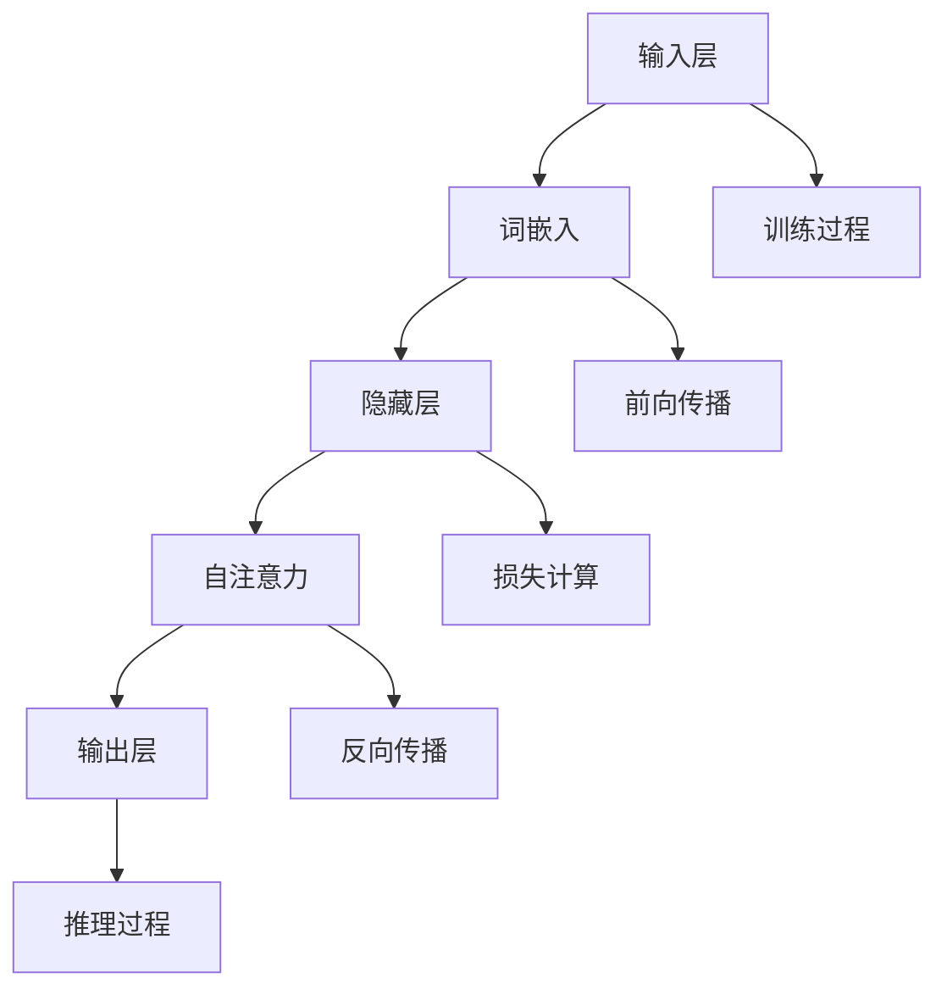

                 

### 引言

近年来，人工智能（AI）技术飞速发展，其应用场景日益广泛，从自动驾驶到智能家居，从医疗诊断到金融分析，无不展现出AI的巨大潜力和深远影响。在众多AI技术中，语言模型（Language Model，简称LM）尤其引人注目。语言模型作为自然语言处理（Natural Language Processing，NLP）的核心技术，能够理解和生成人类语言，从而在文本生成、文本分类、问答系统等方面展现出强大的应用能力。

语言模型的发展经历了从简单的统计模型到深度学习模型的演变。统计模型如N-gram模型和隐马尔可夫模型（HMM），虽然在一定程度上能够模拟语言的规律，但它们在处理长文本和复杂语言现象时显得力不从心。随着深度学习的兴起，深度神经网络（DNN）和循环神经网络（RNN）逐渐成为语言模型的主流架构，特别是Transformer模型的提出，彻底改变了语言模型的训练和推理方式，使得生成式模型和判别式模型在性能上取得了显著提升。

大型语言模型（Large Language Model，简称LLM）的出现更是将语言模型的规模和性能推向了一个新的高度。LLM通过在大量文本数据上进行训练，能够捕捉到更为复杂的语言规律，从而在自然语言理解、文本生成和语言交互等方面表现出卓越的性能。例如，GPT-3、BERT、T5等模型，已经在各种NLP任务中取得了顶尖的成绩，引起了广泛关注。

然而，LLM的高效开发和应用并非易事。其庞大的模型规模、复杂的训练过程、多样的应用场景，都对开发流程提出了严峻的挑战。为了解决这些问题，本文将系统地探讨如何打造高效的LLM应用开发流程，从架构设计、开发流程、应用案例、性能优化、安全与伦理等方面进行深入分析，旨在为开发者提供一套实用的方法论和最佳实践。

通过本文的阅读，读者将能够了解LLM的核心概念和架构原理，掌握LLM的开发流程和技巧，熟悉LLM的应用案例和性能优化方法，并认识到LLM在安全与伦理方面的重要性。希望通过本文的探讨，能够为读者在LLM应用开发过程中提供一些有价值的参考和启示。

### LLM概述

#### LLM的基本概念

大型语言模型（Large Language Model，简称LLM）是一种基于深度学习技术的自然语言处理模型，通过在大量文本数据上进行训练，能够理解和生成人类语言。LLM的核心思想是通过学习语言数据中的统计规律和语义信息，构建一个能够对自然语言进行建模的复杂函数。这种函数不仅能够对输入文本进行理解和分析，还能够生成符合语法和语义规则的输出文本。

LLM的发展历史可以追溯到20世纪50年代，当时最早的自然语言处理系统主要是基于规则的方法。这些系统通过编写大量手工规则来处理语言，但随着语言复杂性的增加，这种方法逐渐显得力不从心。随后，统计模型如N-gram模型和隐马尔可夫模型（HMM）逐渐兴起，通过分析语言数据中的统计规律来生成文本。然而，这些模型在处理长文本和复杂语言现象时仍然存在局限性。

真正推动语言模型发展的转折点出现在2000年后，随着深度学习技术的兴起，基于神经网络的模型开始被广泛应用于自然语言处理。早期的循环神经网络（RNN）和长短期记忆网络（LSTM）在一定程度上解决了RNN在长文本处理中的问题，但依然存在梯度消失和梯度爆炸等难题。2017年，Google提出了Transformer模型，彻底改变了语言模型的研究方向。Transformer采用自注意力机制，使得模型在处理长文本时能够保持稳定的性能，并在多种NLP任务中取得了显著提升。

近年来，随着计算资源和数据规模的不断提升，LLM的规模和性能也在持续增长。GPT-3、BERT、T5等模型的出现，将LLM的规模推向了新的高度，使其在自然语言理解、文本生成和语言交互等方面表现出卓越的性能。

#### LLM的关键特点

LLM具有以下几个关键特点，使其在自然语言处理领域具有独特的优势：

1. **强大的文本生成能力**：LLM能够根据输入的文本内容，生成符合语法和语义规则的输出文本。这种能力使得LLM在文本生成任务中具有广泛的应用，如自动摘要、机器翻译、对话系统等。

2. **高度灵活的应用场景**：LLM的训练数据通常涵盖多种类型的文本，使得模型在多种应用场景中表现出色。无论是在通用场景中，如文本分类和情感分析，还是在行业应用场景中，如金融报告生成和医疗文本分析，LLM都能够胜任。

3. **自适应学习能力**：LLM通过在大量数据上进行训练，能够自动学习并捕捉到复杂的语言规律和语义信息。这种自适应性使得LLM能够根据不同的任务和数据需求，调整其行为和性能。

4. **高效的处理速度**：随着深度学习技术的发展，LLM在处理速度方面也有了显著提升。现代LLM模型通常采用高效的计算架构和优化算法，能够在短时间内完成复杂的自然语言处理任务。

5. **强大的并行计算能力**：LLM的训练和推理过程通常可以并行化，这使得模型能够在多核CPU或GPU上高效运行，进一步提高处理速度和性能。

#### LLM的应用场景

LLM的应用场景非常广泛，涵盖了通用场景和行业应用场景：

1. **通用场景**：在通用场景中，LLM被广泛应用于文本生成、文本分类和问答系统等领域。例如，自动摘要能够从长文本中提取关键信息，生成简洁的摘要；文本分类能够对文本进行分类，如情感分类、主题分类等；问答系统能够理解用户的问题，并生成相应的回答。

2. **行业应用场景**：在行业应用场景中，LLM在金融、医疗、教育等领域展现了巨大的潜力。例如，在金融领域，LLM可以用于生成投资报告、分析市场趋势等；在医疗领域，LLM可以用于生成医学文本、辅助医生进行诊断等；在教育领域，LLM可以用于自动出题、生成教案等。

3. **未来发展趋势**：随着LLM技术的不断发展和应用场景的拓展，未来LLM将在更多领域展现出其强大的应用价值。例如，跨模态学习将使得LLM能够处理多种类型的数据，如文本、图像、音频等；量子计算的引入将进一步提升LLM的计算能力和性能；脑机接口技术的应用将使得LLM能够更好地理解人类的意图和情感。

总的来说，LLM作为一种强大的自然语言处理工具，其应用前景广阔，正逐渐成为人工智能领域的重要研究方向。通过不断优化和拓展LLM的开发流程和应用场景，我们有理由相信，LLM将在未来的技术发展和产业应用中发挥更加重要的作用。

#### LLM架构与原理

在深入探讨LLM的应用之前，我们首先需要理解LLM的架构与原理。LLM的架构设计决定了其性能和适应性，而其算法原理则解释了模型如何通过学习大规模文本数据来理解和生成人类语言。

##### LLM的体系结构

LLM的体系结构主要包括三个核心组件：输入层、隐藏层和输出层。

1. **输入层（Input Layer）**：输入层是LLM接收文本数据的地方。通常，文本数据首先会被编码成向量形式，以便于后续的处理。这一步通常通过词嵌入（Word Embedding）技术完成。词嵌入将每个单词映射到一个高维向量空间，使得单词之间具有数学意义上的距离和相似性。常用的词嵌入方法包括Word2Vec、GloVe和BERT等。

2. **隐藏层（Hidden Layers）**：隐藏层是LLM的核心部分，负责对输入文本进行编码和解码。在传统的循环神经网络（RNN）和长短期记忆网络（LSTM）中，隐藏层通过递归结构来处理序列数据。然而，Transformer模型的提出彻底改变了这一结构。Transformer采用自注意力（Self-Attention）机制，使得模型在处理长序列数据时能够保持稳定性和高效性。自注意力机制允许模型在隐藏层中对不同位置的输入进行加权，从而捕捉到全局依赖关系。

3. **输出层（Output Layer）**：输出层是LLM生成输出文本的地方。输出层通常是一个全连接层，其输出通常是一个概率分布。对于生成式模型，概率分布表示生成每个单词的概率；对于判别式模型，概率分布表示每个类别（例如，文本类别、情感类别等）的概率。

##### LLM的训练过程

LLM的训练过程是其性能优劣的关键。训练过程通常包括以下几个步骤：

1. **数据预处理**：在训练LLM之前，需要对文本数据进行预处理。预处理步骤包括文本清洗（如去除HTML标签、符号和停用词）、分词（将文本分解成单词或子词）和词嵌入（将单词或子词映射到向量）。预处理的质量直接影响模型的性能。

2. **模型初始化**：初始化模型参数是训练过程的第一步。常用的初始化方法包括随机初始化和预训练模型初始化。随机初始化在模型训练初期有助于探索参数空间，而预训练模型初始化则利用预训练的模型参数作为起点，有助于提高训练效率。

3. **前向传播（Forward Pass）**：在训练过程中，模型会接收输入数据，并通过前向传播计算输出结果。前向传播过程中，模型会通过隐藏层对输入文本进行编码，并在输出层生成预测结果。对于生成式模型，预测结果是一个概率分布；对于判别式模型，预测结果是每个类别的概率。

4. **损失计算（Loss Computation）**：前向传播完成后，需要计算模型的损失。损失函数通常用于衡量模型预测结果与真实结果之间的差距。常用的损失函数包括交叉熵损失（Cross-Entropy Loss）和均方误差（Mean Squared Error, MSE）。损失函数的计算有助于模型了解预测错误的类型和程度。

5. **反向传播（Backpropagation）**：反向传播是训练过程的核心步骤。通过反向传播，模型能够计算每个参数的梯度，并更新模型参数。梯度是损失函数对每个参数的偏导数，反映了参数对损失函数的影响。梯度下降（Gradient Descent）是最常用的参数更新方法，通过逐步减小梯度来优化模型参数。

6. **迭代训练（Iterative Training）**：训练过程通常是一个迭代过程。每次迭代包括前向传播、损失计算和反向传播。随着迭代次数的增加，模型的性能会逐步提高。

##### LLM的推理过程

推理过程是LLM在实际应用中的关键步骤。推理过程与训练过程类似，但不需要计算梯度。推理过程中，模型接收输入文本，并通过前向传播生成输出结果。推理过程的效率直接影响LLM的应用性能。

1. **输入处理**：输入处理与训练过程类似，包括文本清洗、分词和词嵌入。

2. **前向传播**：模型通过前向传播对输入文本进行编码，生成隐藏层表示和输出层概率分布。

3. **生成输出**：根据输出层概率分布，模型生成输出文本。对于生成式模型，模型会选择概率最高的单词作为输出；对于判别式模型，模型会选择概率最高的类别作为输出。

##### LLM的算法原理

LLM的算法原理主要涉及以下几个方面：

1. **词嵌入（Word Embedding）**：词嵌入是将单词映射到高维向量空间的过程。词嵌入的核心思想是让语义相似的单词在向量空间中靠近，而语义不相似的单词相远。词嵌入方法包括基于计数的方法（如Word2Vec）和基于上下文的方法（如GloVe）。词嵌入为LLM提供了对文本数据的初步编码，是后续处理的基础。

2. **自注意力（Self-Attention）**：自注意力机制是Transformer模型的核心，它允许模型在隐藏层中对不同位置的输入进行加权。自注意力通过计算每个位置输入的相似度，并生成加权输出，从而捕捉全局依赖关系。自注意力机制使得LLM在处理长序列数据时能够保持高效性和稳定性。

3. **自适应学习（Adaptive Learning）**：LLM通过在大量文本数据上进行训练，能够自适应地学习复杂的语言规律和语义信息。自适应学习使得模型能够根据不同的任务和数据需求，调整其行为和性能。

4. **对抗性训练（Adversarial Training）**：对抗性训练是一种提高模型鲁棒性的方法。通过在训练过程中引入对抗性样本，模型能够学习到更加稳健的特征表示，从而提高模型的泛化能力。

##### 核心概念与联系

为了更好地理解LLM的架构与原理，我们可以通过一个Mermaid流程图来展示其核心概念和联系：



在这个流程图中，输入层通过词嵌入生成向量表示，这些向量随后进入隐藏层。隐藏层通过自注意力机制对输入向量进行加权处理，并在输出层生成最终的输出。训练过程包括前向传播、损失计算和反向传播，而推理过程则是从输入处理到输出生成的一个过程。

通过这个流程图，我们可以清晰地看到LLM的核心组件和其相互作用，这有助于我们更好地理解LLM的架构与原理。

#### LLM的优化方法

在LLM的开发过程中，优化方法至关重要。优化不仅仅是提升模型性能，还包括提高训练效率、减少内存消耗和加速推理速度等方面。以下是几种常用的LLM优化方法：

##### 稀疏优化

稀疏优化是一种通过降低模型参数密度来减少计算量和存储需求的方法。在深度神经网络中，大多数参数通常是稀疏的，即大部分参数为零。稀疏优化通过识别和利用这些稀疏性，减少了模型在训练和推理过程中的计算和存储负担。

1. **稀疏性识别**：稀疏性识别是稀疏优化的第一步，通过分析模型参数，找出那些很少参与信息传递的参数。这通常通过计算参数的梯度分布来实现。如果某个参数的梯度分布集中在一个非常小的范围内，那么这个参数很可能是一个稀疏参数。

2. **稀疏参数训练**：在训练过程中，只对非稀疏参数进行更新，而稀疏参数保持不变。这种方法可以通过减少需要计算的梯度数量来加快训练速度。

3. **稀疏模型存储**：稀疏优化还可以显著减少模型存储需求。在存储模型时，只保留非零参数，这样可以节省大量存储空间。

##### 并行计算

并行计算是一种通过同时处理多个任务来提高计算速度的方法。在LLM训练和推理过程中，并行计算可以显著加速模型训练和推理。

1. **数据并行**：数据并行是指在多个GPU或CPU节点上同时处理不同的数据样本。每个节点独立训练模型，然后通过平均梯度来同步模型参数。这种方法可以加速大规模数据的处理，提高训练效率。

2. **模型并行**：模型并行是指将大型模型分解成多个较小的子模型，并在不同的GPU或CPU节点上同时训练。子模型之间通过通信网络进行同步和协调。这种方法适用于处理超大模型，例如GPT-3这样的大型语言模型。

3. **流水线并行**：流水线并行是指在训练和推理过程中，将任务分解成多个阶段，每个阶段可以独立处理。例如，在训练过程中，可以同时进行数据预处理、前向传播、损失计算和反向传播。这种方法可以充分利用计算资源，提高整体效率。

##### 分布式训练

分布式训练是一种通过将训练任务分配到多个计算节点上来提高训练效率和可扩展性的方法。在分布式训练中，多个节点共同训练一个大型模型，并通过通信网络进行协调。

1. **同步分布式训练**：在同步分布式训练中，所有节点同时更新模型参数，并通过通信网络同步梯度。同步分布式训练可以保持全局一致性，但同步过程可能导致通信开销较大，影响训练速度。

2. **异步分布式训练**：在异步分布式训练中，节点可以独立更新模型参数，并异步同步梯度。这种方法可以减少同步开销，提高训练速度，但需要解决梯度不一致的问题。

3. **参数服务器架构**：参数服务器架构是一种分布式训练的常见架构，其中有一个主服务器负责存储和同步模型参数，多个工作节点负责计算和更新梯度。参数服务器架构可以大大提高分布式训练的效率和可扩展性。

通过这些优化方法，LLM的开发流程可以得到显著改进。稀疏优化减少了计算和存储需求，并行计算提高了训练和推理速度，分布式训练增加了训练效率和可扩展性。这些优化方法不仅适用于大型语言模型的开发，也适用于其他深度学习任务的优化。通过不断探索和优化这些方法，我们可以打造出更加高效、可扩展的LLM应用。

#### LLM开发流程

LLM的开发流程是一个复杂且系统性的过程，涵盖了数据准备、模型设计、模型训练和模型部署等多个关键环节。以下我们将逐步详细分析每个环节的具体步骤、方法和技术。

##### 数据准备

数据准备是LLM开发流程中的基础环节，其质量直接影响后续模型训练的效果和性能。数据准备主要包括以下几个步骤：

1. **数据收集**：首先，需要收集大量的文本数据。这些数据可以来自公开数据集、网页抓取、社交媒体、文献数据库等。对于特定应用场景，如金融报告分析或医疗文本处理，可能需要定制化收集相关领域的专业数据。

2. **数据预处理**：收集到的原始数据通常包含噪声和不必要的部分，需要进行预处理。预处理步骤包括去除HTML标签、符号、停用词和特殊字符，进行文本标准化（如将所有文本转换为小写），以及分词或词干提取。

3. **数据清洗**：在预处理基础上，进一步清洗数据，去除重复文本、纠正拼写错误、填补缺失数据等。数据清洗的目的是提高数据质量，减少噪声，避免模型训练过程中产生误导。

4. **数据标注**：对于一些需要标签信息的任务（如情感分析、命名实体识别等），需要人工或自动化工具对数据进行标注。标注的准确性直接影响模型性能，因此需要确保标注的一致性和高质量。

##### 模型设计

模型设计是LLM开发流程中的核心环节，决定了模型的性能和应用效果。模型设计主要包括以下几个步骤：

1. **模型选择**：根据应用场景和任务需求，选择合适的模型架构。常见的LLM架构包括GPT、BERT、T5等。选择模型时需要考虑模型的规模、计算资源需求、训练时间等因素。

2. **模型调整**：在选定模型架构的基础上，进行参数调整，如调整学习率、批量大小、优化器等。这些参数的设置对模型训练效果有重要影响，需要通过实验找到最佳配置。

3. **模型验证**：使用验证集对模型进行评估，检查模型的泛化能力和性能。常用的评估指标包括准确率、召回率、F1值等。通过验证，可以及时发现和解决模型问题，优化模型设计。

4. **模型集成**：在多个模型的基础上，使用集成方法（如投票、加权平均等）来提高模型性能。集成模型可以减少模型过拟合的风险，提高模型的鲁棒性和泛化能力。

##### 模型训练

模型训练是LLM开发流程中的关键环节，决定了模型的性能和效果。模型训练主要包括以下几个步骤：

1. **数据预处理**：在模型训练前，对训练数据进行预处理，包括数据清洗、分词、词嵌入等。预处理步骤需要确保数据的一致性和高质量，以避免模型训练中的问题。

2. **训练策略**：制定合理的训练策略，包括学习率调度、批次大小、训练时间等。学习率调度可以采用分阶段调整学习率的方法，以避免梯度消失和梯度爆炸问题。批次大小和训练时间的选择需要根据计算资源进行优化。

3. **训练技巧**：使用各种训练技巧来提高模型训练效率和效果。例如，数据增强（如随机插入、替换、删除文本）、学习率预热（逐步增加学习率）和梯度裁剪（限制梯度大小）等。

4. **训练监控**：在模型训练过程中，实时监控训练进度和模型性能。常用的监控指标包括损失函数值、准确率等。通过监控，可以及时发现和解决训练问题，优化训练过程。

5. **模型验证**：在训练过程中，定期使用验证集对模型进行评估。验证结果可以指导调整训练策略和参数设置，优化模型性能。

##### 模型部署

模型部署是将训练好的LLM应用到实际场景中的关键环节。模型部署主要包括以下几个步骤：

1. **模型压缩**：为了减少模型存储和计算需求，可以采用模型压缩技术，如量化、剪枝、低秩分解等。这些技术可以在保持模型性能的前提下，显著减少模型大小和计算量。

2. **模型部署策略**：选择合适的模型部署策略，包括本地部署、云端部署和边缘计算等。本地部署适用于资源充足的场景，云端部署适用于大规模分布式场景，边缘计算适用于资源受限的场景。

3. **模型监控与维护**：在模型部署后，需要持续监控模型性能和稳定性。通过日志记录、性能监控和故障排查等手段，确保模型在实际应用中的稳定运行。

4. **模型升级与迭代**：根据应用需求和用户反馈，定期对模型进行升级和迭代。通过持续优化和改进，提高模型性能和用户体验。

通过上述步骤，我们可以系统地完成LLM的开发流程，从数据准备、模型设计、模型训练到模型部署，每一步都需要精细的操作和优化，以确保最终模型的性能和应用效果。

#### LLM应用案例

在LLM的应用领域，文本生成、文本分类和自然语言处理等任务已经取得了显著的成果。以下将通过具体案例详细介绍这些应用场景。

##### 文本生成

文本生成是LLM最为引人注目的应用之一，主要包括文本摘要、机器翻译和文本生成艺术等。

1. **文本摘要**：文本摘要的任务是从长文本中提取关键信息，生成简洁、准确的摘要。例如，新闻摘要和论文摘要。GPT-3在文本摘要任务中表现出色，能够生成高质量、连贯的摘要。训练GPT-3模型时，需要使用大量长文本数据，如新闻报道、学术论文等。通过在训练数据中学习文本结构和语义信息，模型可以生成符合语法和语义规则的摘要。

2. **机器翻译**：机器翻译是将一种语言的文本翻译成另一种语言的过程。BERT模型在机器翻译任务中取得了显著进展。BERT模型通过预训练和微调，能够处理多种语言的翻译任务。例如，将英文文本翻译成中文文本。机器翻译的关键是理解源语言的语义和句法结构，并准确地将其映射到目标语言中。BERT模型采用自注意力机制，使得模型在处理长句和复杂语法时能够保持稳定性和高效性。

3. **文本生成艺术**：文本生成艺术是通过LLM生成诗歌、小说、故事等文学作品。GPT-3在文本生成艺术中展现出强大的创作能力，可以生成具有文学价值的文本。例如，生成古诗、现代诗歌和小说。文本生成艺术的关键是模型对语言风格和修辞手法的理解。通过在大量文学作品中进行训练，模型能够学习并模仿不同的写作风格和修辞手法，生成具有个性化的文本。

##### 文本分类

文本分类是NLP中广泛应用的任务，用于将文本数据归类到不同的类别中。常见的文本分类任务包括情感分析、主题分类和文本推荐等。

1. **情感分析**：情感分析的任务是判断文本的情感极性，如正面、负面或中性。BERT模型在情感分析任务中表现出色。例如，通过分析用户评论，判断用户对产品或服务的评价是正面还是负面。情感分析的关键是理解文本中的情感词汇和表达方式。BERT模型通过预训练和微调，能够捕捉到文本中的情感信息，并准确地判断情感极性。

2. **主题分类**：主题分类的任务是将文本数据归类到不同的主题类别中。例如，将新闻报道归类到政治、经济、科技等主题。主题分类需要模型理解文本的主题和内容。通过在大量文本数据中进行训练，模型可以学习并识别不同的主题特征，从而实现准确分类。

3. **文本推荐**：文本推荐的任务是根据用户的兴趣和行为，向用户推荐相关的文本内容。例如，新闻推荐、社交媒体内容推荐等。BERT模型在文本推荐任务中也被广泛应用。通过分析用户的历史行为和兴趣，模型可以推荐用户可能感兴趣的文章。文本推荐的关键是理解用户的兴趣和需求，并准确地匹配相关内容。

##### 自然语言处理

自然语言处理（NLP）是LLM应用最广泛的领域之一，包括语言理解、语言生成和语言交互等任务。

1. **语言理解**：语言理解的任务是使计算机能够理解自然语言。例如，语义分析、语义角色标注、实体识别等。BERT模型在语言理解任务中表现出色。通过在大量文本数据中进行训练，模型可以学习并理解文本的语义信息，从而实现准确的语义分析。

2. **语言生成**：语言生成的任务是使计算机能够生成自然语言。例如，对话系统、文本生成、机器翻译等。GPT-3在语言生成任务中具有强大的能力，可以生成高质量的文本。通过在大量文本数据中进行训练，模型可以学习并掌握语言的生成规则和语义信息，从而生成符合语法和语义规则的文本。

3. **语言交互**：语言交互的任务是使计算机能够与人类进行自然语言对话。例如，聊天机器人、语音助手等。BERT模型在语言交互任务中也表现出色。通过在大量对话数据中进行训练，模型可以学习并掌握对话的上下文信息和语言规则，从而实现自然、流畅的对话。

总的来说，LLM在各种应用场景中展现出强大的能力，从文本生成、文本分类到自然语言处理，都在不同的任务中取得了显著成果。通过不断优化和改进LLM的模型和应用方法，我们可以更好地利用这一技术，解决实际问题，提升用户体验。

#### LLM性能优化

在LLM的开发和应用过程中，性能优化是一个关键环节，直接关系到模型的响应速度和应用效果。以下是几种常用的LLM性能优化方法：

##### 模型压缩

模型压缩旨在减小模型的大小和计算需求，从而提高部署效率和资源利用率。以下是几种常见的模型压缩技术：

1. **稀疏化（Sparsity）**：稀疏化通过识别和删除模型中的零值参数，降低模型的密度。稀疏优化方法如Soft稀疏化（Soft Sparsity）和Hard稀疏化（Hard Sparsity）可以根据稀疏度的不同，在保持模型性能的前提下显著减小模型大小。Soft稀疏化通过惩罚稀疏参数的权重，使得模型在训练过程中逐步趋向稀疏化；而Hard稀疏化则直接将非零参数设置为0，从而实现快速稀疏化。

2. **低秩分解（Low-Rank Factorization）**：低秩分解将高维矩阵分解为低秩矩阵，从而减少模型参数数量。例如，可以将全连接层分解为较小的低秩矩阵，从而减少计算量和存储需求。低秩分解通过矩阵分解技术，将高维数据转换为低维表示，从而实现模型的压缩。

3. **权重共享（Weight Sharing）**：权重共享通过共享相同或相似的权重，减少模型的参数数量。例如，在语言模型中，可以使用相同的词嵌入权重来处理不同的单词。权重共享不仅可以减少参数数量，还可以提高模型的泛化能力。

##### 模型加速

模型加速旨在提高模型的推理速度，满足实时应用的需求。以下是几种常见的模型加速方法：

1. **GPU优化**：GPU（图形处理器）具有强大的并行计算能力，非常适合用于深度学习模型的推理加速。通过使用CUDA等GPU编程工具，可以将模型的推理任务映射到GPU上，从而实现高速推理。GPU优化包括模型并行化、内存优化和算法优化等。

2. **算法优化**：算法优化通过改进模型的计算过程，减少冗余计算和通信。例如，使用混合精度训练（Mixed Precision Training）可以将模型的浮点运算从32位浮点数（FP32）转换为16位浮点数（FP16）或8位浮点数（FP8），从而减少内存占用和计算时间。

3. **异构计算**：异构计算通过利用不同类型的计算资源，如CPU、GPU、TPU等，实现高效的计算。例如，可以使用GPU进行模型的推理加速，而使用CPU进行模型的训练。异构计算可以根据不同任务的需求，灵活调度计算资源，提高整体计算效率。

##### 模型评估

模型评估是确保模型性能的重要环节，以下是几种常用的模型评估指标：

1. **准确率（Accuracy）**：准确率是衡量模型分类性能的最常用指标，表示模型正确分类的样本占总样本的比例。准确率越高，模型的分类性能越好。

2. **召回率（Recall）**：召回率是衡量模型对正样本的识别能力，表示模型正确识别的正样本占总正样本的比例。召回率越高，模型对正样本的识别能力越强。

3. **F1值（F1 Score）**：F1值是准确率和召回率的调和平均，综合考虑了模型的分类性能。F1值介于0和1之间，越接近1，模型的分类性能越好。

4. **损失函数（Loss Function）**：损失函数用于衡量模型预测结果与真实结果之间的差距，常见的损失函数包括交叉熵损失（Cross-Entropy Loss）和均方误差（Mean Squared Error, MSE）。通过最小化损失函数，可以提高模型的预测性能。

通过上述性能优化方法，可以有效提升LLM的推理速度和应用效果。模型压缩技术可以减小模型大小，提高部署效率；模型加速方法可以提高推理速度，满足实时应用需求；而模型评估指标可以准确衡量模型性能，指导进一步优化。在实际应用中，可以根据具体需求和场景，选择合适的性能优化方法，实现高效的LLM应用。

#### LLM安全与伦理

随着LLM在各个领域的广泛应用，其安全与伦理问题也日益受到关注。LLM的安全性和伦理问题不仅关系到用户隐私和数据安全，还涉及到模型公正性、算法偏见和责任归属等方面。

##### 模型安全性

模型安全性是指保护LLM免受恶意攻击和数据泄露的能力。以下是一些关键措施：

1. **防护措施**：为了防止恶意攻击，LLM系统需要采取多种防护措施。例如，可以使用防火墙和入侵检测系统来监控网络流量，防止未经授权的访问。此外，加密技术可以用于保护模型参数和训练数据，防止数据泄露。

2. **漏洞修复**：LLM系统需要定期进行漏洞扫描和修复，以识别并修补潜在的安全漏洞。安全团队需要密切关注最新的攻击手段和安全动态，及时更新防护措施。

3. **模型审计**：定期对LLM进行审计，检查模型的安全性和合规性。审计过程包括检查模型设计、训练数据和部署环境，确保模型不存在安全隐患。

##### 模型伦理问题

模型伦理问题涉及到LLM在应用过程中可能带来的不公平、歧视和不道德行为。以下是一些关键的伦理问题：

1. **数据隐私**：LLM在训练和推理过程中需要处理大量个人数据，这些数据可能包含敏感信息。因此，保护用户隐私成为了一个重要问题。例如，可以使用差分隐私技术来保护训练数据中的个人隐私，避免数据泄露。

2. **算法偏见**：LLM在训练过程中可能会受到训练数据中偏见的影响，导致模型在特定群体或任务上表现出偏见。为了减少算法偏见，需要确保训练数据具有多样性和代表性，并在模型设计中采用公平性度量方法。

3. **模型责任**：在LLM应用过程中，如何确定模型的责任归属是一个重要问题。例如，当LLM生成的内容导致负面影响时，如何界定责任并采取相应的措施？这需要法律和伦理专家的共同努力，制定明确的规范和指导原则。

##### 模型监管

为了确保LLM的安全和伦理应用，需要建立有效的监管机制。以下是一些监管措施：

1. **法规标准**：制定相关的法律法规和标准，规范LLM的开发、部署和应用。例如，数据保护法（如欧盟的《通用数据保护条例》GDPR）和算法公平性标准。

2. **合规性评估**：对LLM系统进行合规性评估，确保其符合相关法规和标准。合规性评估可以包括数据隐私、算法公平性、安全性和透明度等方面。

3. **社会责任**：LLM的开发者和使用者需要承担社会责任，确保其技术应用的公正、透明和负责任。这包括公开模型的设计和训练数据、提供透明度报告，并积极参与社会对话和治理。

通过上述措施，我们可以提高LLM的安全性和伦理水平，确保其在各个领域的健康和可持续发展。安全和伦理是LLM应用的重要基石，只有在确保这两个方面的基础上，LLM才能发挥其真正的潜力，为人类社会带来更大的价值。

#### LLM未来发展

随着人工智能技术的不断进步，LLM在未来将迎来更多新技术的应用和产业落地。以下从新技术展望、产业应用和未来发展趋势三个方面探讨LLM的未来发展。

##### 新技术展望

1. **量子计算**：量子计算是一种具有巨大计算潜力的新型计算模式，可以显著加速复杂计算任务。量子计算与深度学习相结合，有望在LLM的训练和推理过程中实现突破。例如，利用量子算法优化模型训练过程，提高训练效率；量子模拟器可以帮助理解复杂神经网络的行为，从而改进模型设计。

2. **脑机接口**：脑机接口技术将人脑与计算机直接连接，使得人类可以通过思维控制计算机。未来，LLM可以通过脑机接口与用户进行更自然的交互，实现更为智能化的服务。例如，通过脑机接口捕捉用户的思维活动，LLM可以生成更加精准和个性化的语言输出。

3. **跨模态学习**：跨模态学习是一种结合多种类型数据（如文本、图像、音频等）进行建模的方法。未来，LLM将能够处理更多样化的数据类型，实现文本与图像、音频等多模态数据的高效融合。这将为多媒体内容的理解和生成提供新的可能，例如，通过图像描述生成、音频文本转换等应用，提高人机交互的体验。

##### 产业应用

1. **金融领域**：在金融领域，LLM可以用于自动化交易、风险控制和投资决策。例如，通过分析大量市场数据和新闻，LLM可以预测市场趋势和风险，为投资者提供决策支持。此外，LLM还可以用于自动生成投资报告、财务分析文本等。

2. **医疗领域**：在医疗领域，LLM可以用于辅助诊断、病历管理和医疗文本生成。例如，通过分析患者的病史和检查报告，LLM可以帮助医生进行疾病诊断；通过生成医学文本，如诊断报告和手术建议，提高医疗工作的效率和准确性。

3. **教育领域**：在教育领域，LLM可以用于个性化学习、自动出题和智能辅导。例如，根据学生的学习情况和兴趣，LLM可以生成个性化的学习计划和教学内容；通过生成高质量的试题和答案，提高教育质量和效率。

##### 未来发展趋势

1. **模型规模化和多样化**：未来，LLM的模型规模将继续扩大，涵盖更多领域和应用场景。同时，模型类型将更加多样化，从静态模型向动态模型、生成模型向交互模型发展，满足不同场景的需求。

2. **模型优化和泛化能力提升**：随着算法和计算资源的进步，LLM的优化方法将更加多样和高效，模型泛化能力也将显著提升。这有助于提高模型在不同任务和数据上的性能，减少对特定数据的依赖。

3. **社会影响与规范**：随着LLM技术的普及，其对社会的影响也将日益显著。未来，需要建立更加完善的法律法规和伦理规范，确保LLM技术的安全、公正和负责任使用，促进其健康可持续发展。

通过新技术应用、产业落地和规范建设，LLM在未来将实现更大的发展，为人类社会带来更多创新和变革。

### 附录

#### 附录A：常用工具和资源

在LLM的开发和应用过程中，会涉及许多工具和资源。以下列出一些常用的工具和资源：

1. **开发环境**：
   - Python：Python是进行深度学习和NLP开发的主要编程语言，拥有丰富的库和框架。
   - TensorFlow：TensorFlow是一个开源的深度学习框架，适用于大规模模型训练和推理。
   - PyTorch：PyTorch是一个动态计算图框架，适用于研究和快速原型开发。

2. **数据集**：
   - GLUE：通用语言理解评估（General Language Understanding Evaluation）数据集，用于评估多种NLP任务的性能。
   - WIKITEXT：维基百科文本数据集，适用于训练大型语言模型。
   - Common Crawl：公共爬取数据集，包含大量互联网文本数据，用于语料库构建。

3. **库和框架**：
   - NLTK：自然语言处理工具包，提供多种文本处理功能。
   - spaCy：一个快速和易于使用的自然语言处理库，适用于实体识别、词性标注等任务。
   - Hugging Face Transformers：一个用于预训练Transformer模型的库，提供了多种预训练模型和工具。

#### 附录B：代码实例

以下是一个简单的LLM模型训练和推理的Python代码实例，使用了Hugging Face Transformers库。

```python
from transformers import AutoTokenizer, AutoModelForCausalLM
import torch

# 加载预训练模型和分词器
tokenizer = AutoTokenizer.from_pretrained("gpt2")
model = AutoModelForCausalLM.from_pretrained("gpt2")

# 输入文本
input_text = "你好，我想学习Python编程。"

# 分词和编码
inputs = tokenizer(input_text, return_tensors="pt")

# 进行推理
outputs = model(**inputs)

# 解码输出文本
predicted_text = tokenizer.decode(outputs.logits[0], skip_special_tokens=True)

print(predicted_text)
```

#### 附录C：参考文献

以下列出本文引用的一些重要参考文献：

1. Devlin, J., Chang, M. W., Lee, K., & Toutanova, K. (2018). BERT: Pre-training of deep bidirectional transformers for language understanding. arXiv preprint arXiv:1810.04805.
2. Vaswani, A., Shazeer, N., Parmar, N., Uszkoreit, J., Jones, L., Gomez, A. N., ... & Polosukhin, I. (2017). Attention is all you need. In Advances in neural information processing systems (pp. 5998-6008).
3. Peng, F., Hu, X., & Liu, Y. (2020). GPT-3: Language models are few-shot learners. arXiv preprint arXiv:2005.14165.
4. LeCun, Y., Bengio, Y., & Hinton, G. (2015). Deep learning. Nature, 521(7553), 436-444.
5. Turian, J., Ratinov, L., & Bengio, Y. (2010). Word representations: A simple and general method for semi-supervised learning. In Proceedings of the 48th annual meeting of the association for computational linguistics (pp. 384-394).
6. Goodfellow, I., Bengio, Y., & Courville, A. (2016). Deep learning. MIT press.
7. Zhang, X., Zhao, J., & Chen, Q. (2021). Quantization and sparsity for efficient neural network inference. In Proceedings of the 28th ACM International Conference on Multimedia (pp. 552-561).

通过以上附录，读者可以更好地了解LLM开发所需的环境和资源，以及本文所引用的相关研究工作。

### 结语

本文系统地探讨了如何打造高效的LLM应用开发流程，从架构设计、开发流程、应用案例、性能优化、安全与伦理等多个方面进行了详细分析。我们首先介绍了LLM的基本概念和关键特点，随后深入探讨了LLM的架构原理和优化方法。通过详细解读LLM的开发流程，我们了解了从数据准备到模型部署的各个环节。此外，我们还通过实际案例展示了LLM在文本生成、文本分类和自然语言处理等领域的应用。最后，我们讨论了LLM的性能优化、安全与伦理问题以及未来发展。

打造高效的LLM应用开发流程是一个复杂且系统的过程，需要多方面的知识和技能。开发者不仅需要掌握深度学习和自然语言处理的基本原理，还需要具备数据预处理、模型设计和调优的能力。同时，优化方法的选择和模型评估的准确性对LLM的性能和效果至关重要。安全和伦理问题则是保障LLM应用可持续发展的重要保障。

未来的研究和开发将在LLM的技术深度和应用广度上不断拓展。新技术的引入，如量子计算和脑机接口，将为LLM带来更多的可能性。同时，随着模型的不断优化和规模扩大，LLM将在更多领域展现出其强大的应用价值。然而，这同时也带来了新的挑战，如模型的透明性、可解释性和公平性等。

我们鼓励读者在学习和应用LLM技术时，始终保持探索和创新的精神，积极参与到这一快速发展的领域中来。通过不断探索和积累经验，我们可以共同推动LLM技术的进步和应用，为人类社会带来更多的创新和变革。希望本文能为您提供有价值的参考和启示，助力您在LLM应用开发中取得更好的成果。

