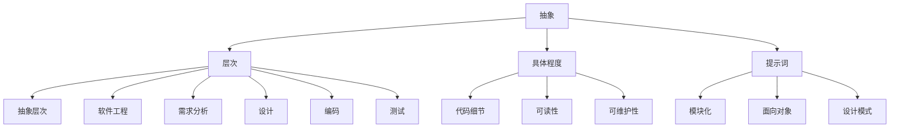

                 

### 文章标题

# 抽象层次：调整提示词的具体程度

## 文章关键词
- 抽象层次
- 提示词
- 具体程度
- 编程
- 软件工程
- 人工智能

## 文章摘要

本文旨在探讨抽象层次在计算机科学中的应用，特别是如何通过调整提示词的具体程度来优化编程和软件工程实践。首先，我们将介绍抽象层次的概念及其重要性，随后详细阐述不同抽象层次之间的关系，并讨论如何通过调整提示词的具体程度来提高代码的可读性和维护性。文章还将介绍一些具体的策略和工具，帮助开发者有效地管理抽象层次。此外，我们将通过实际案例展示如何在不同场景下应用这些概念和工具，并在最后提供一些最佳实践和注意事项，为读者提供全面的指导。

### 背景介绍

在计算机科学中，抽象层次是一种重要的概念，它帮助我们将复杂的系统分解为更易于管理和理解的组成部分。抽象层次的概念源于哲学和数学领域，最初由数学家乔治·布尔（George Boole）在19世纪提出，后来在计算机科学中得到了广泛应用。抽象层次的主要目的是将复杂的问题简化，通过引入一层层的抽象，使得问题更加清晰和易于处理。

在软件工程中，抽象层次的应用尤为广泛。从低级到高级，抽象层次可以分为多个级别，如汇编语言、高级编程语言、框架和库等。每个层次都提供了不同的抽象级别和功能，使得开发者可以在不同的层面上设计和实现系统。例如，在开发一个大型软件项目时，开发者可能会使用低级语言进行底层硬件操作，同时使用高级语言来编写业务逻辑，这有助于提高开发效率和代码的可读性。

抽象层次的概念不仅适用于软件工程，还广泛应用于人工智能、网络编程、数据库设计和算法分析等领域。通过合理地调整抽象层次，开发者可以更好地理解和解决问题，提高系统的性能和可维护性。因此，理解抽象层次及其在计算机科学中的应用，对于开发者来说具有重要意义。

### 核心概念与联系

为了深入理解抽象层次，我们需要明确几个核心概念，并探讨它们之间的联系。这些概念包括：抽象、层次、具体程度、提示词等。

**1. 抽象：** 抽象是一种思维方式，通过忽略事物的非关键特征，提取其核心概念和本质属性。在计算机科学中，抽象是一种将复杂系统分解为简单、可管理部分的方法。例如，当我们编写一个程序时，我们可能会将程序划分为模块、类、函数等，每个部分负责不同的功能，这实际上就是抽象的过程。

**2. 层次：** 层次是指事物之间的结构关系，反映了它们之间的依赖和包含关系。在抽象层次中，层次表示不同级别的抽象，每个层次提供了不同的抽象级别和功能。例如，在软件工程中，我们可以将系统划分为需求分析、设计、编码、测试等不同层次，每个层次都有其特定的任务和目标。

**3. 具体程度：** 具体程度是指描述或实现细节的详细程度。在抽象层次中，具体程度反映了抽象的层次性。一个低级抽象层次通常包含更多的具体细节，而高级抽象层次则更加抽象，忽略了不必要的细节。例如，在编写代码时，我们可以使用高级语言（如Python、Java）来编写业务逻辑，而使用汇编语言来编写底层硬件操作代码，这两种语言的具体程度显然不同。

**4. 提示词：** 提示词是用于指导或提示开发者进行特定操作或决策的关键词或短语。在抽象层次中，提示词可以帮助开发者调整抽象层次的具体程度。例如，在编写代码时，我们可以使用提示词如“模块化”、“面向对象”、“设计模式”等来指导我们如何调整抽象层次，以提高代码的可读性和可维护性。

下面是一个Mermaid流程图，展示了这些核心概念之间的关系：



通过这个流程图，我们可以清晰地看到抽象、层次、具体程度和提示词之间的关系，以及它们在软件工程中的应用。

### 核心算法原理讲解

在深入探讨如何调整提示词的具体程度之前，我们需要了解一些核心算法原理，这些原理有助于我们更好地理解抽象层次的概念及其应用。以下是几个核心算法原理的Python源代码示例，结合数学模型和公式，进行详细讲解和通俗易懂地举例说明。

#### 1. 决策树算法

决策树是一种常用的机器学习算法，用于分类和回归任务。它通过一系列的判断规则将数据集划分为不同的类别或数值。

**Python代码示例：**

```python
from sklearn.datasets import load_iris
from sklearn.tree import DecisionTreeClassifier
from sklearn.model_selection import train_test_split
from sklearn.metrics import accuracy_score

# 加载鸢尾花数据集
iris = load_iris()
X = iris.data
y = iris.target

# 划分训练集和测试集
X_train, X_test, y_train, y_test = train_test_split(X, y, test_size=0.3, random_state=42)

# 构建决策树模型
clf = DecisionTreeClassifier()
clf.fit(X_train, y_train)

# 预测测试集
y_pred = clf.predict(X_test)

# 计算准确率
accuracy = accuracy_score(y_test, y_pred)
print(f"Accuracy: {accuracy:.2f}")
```

**数学模型与公式：**

决策树算法的核心是递归划分数据集，每个节点都基于特征和阈值进行划分。假设我们有 \( m \) 个特征和 \( n \) 个样本，每个样本可以表示为向量 \( x_i = (x_{i1}, x_{i2}, ..., x_{im}) \)。

**决策树划分公式：**

$$
x_{ij} > \theta \Rightarrow 左子节点 \, T_{左}(x) \\
x_{ij} \leq \theta \Rightarrow 右子节点 \, T_{右}(x)
$$

其中，\( \theta \) 是特征 \( x_j \) 的阈值。

#### 2. 随机森林算法

随机森林是一种集成学习方法，通过构建多个决策树模型并进行投票来提高预测准确性。

**Python代码示例：**

```python
from sklearn.ensemble import RandomForestClassifier
from sklearn.model_selection import train_test_split
from sklearn.metrics import accuracy_score

# 使用之前的数据
X = iris.data
y = iris.target

# 划分训练集和测试集
X_train, X_test, y_train, y_test = train_test_split(X, y, test_size=0.3, random_state=42)

# 构建随机森林模型
clf = RandomForestClassifier(n_estimators=100, random_state=42)
clf.fit(X_train, y_train)

# 预测测试集
y_pred = clf.predict(X_test)

# 计算准确率
accuracy = accuracy_score(y_test, y_pred)
print(f"Accuracy: {accuracy:.2f}")
```

**数学模型与公式：**

随机森林的核心是随机选择特征和样本子集来构建多个决策树。假设我们有 \( M \) 个特征和 \( N \) 个样本，每个样本可以表示为向量 \( x_i = (x_{i1}, x_{i2}, ..., x_{iM}) \)。

**随机森林划分公式：**

$$
T_j(x) = \prod_{i=1}^{M} \left[ \frac{1}{1 + e^{-z_i}} \right]
$$

其中，\( z_i \) 是第 \( i \) 个决策树的输出。

#### 3. 支持向量机（SVM）算法

支持向量机是一种常用的分类算法，通过寻找最佳超平面来分离不同类别的数据。

**Python代码示例：**

```python
from sklearn.svm import SVC
from sklearn.model_selection import train_test_split
from sklearn.metrics import accuracy_score

# 使用之前的数据
X = iris.data
y = iris.target

# 划分训练集和测试集
X_train, X_test, y_train, y_test = train_test_split(X, y, test_size=0.3, random_state=42)

# 构建SVM模型
clf = SVC(kernel='linear')
clf.fit(X_train, y_train)

# 预测测试集
y_pred = clf.predict(X_test)

# 计算准确率
accuracy = accuracy_score(y_test, y_pred)
print(f"Accuracy: {accuracy:.2f}")
```

**数学模型与公式：**

支持向量机的核心是寻找最佳超平面，使得不同类别的数据点之间的距离最大化。假设我们有 \( n \) 个样本 \( x_i \) 和对应标签 \( y_i \)，其中 \( y_i \in \{-1, +1\} \)。

**SVM优化目标：**

$$
\min_{\mathbf{w}, b} \frac{1}{2} ||\mathbf{w}||^2 \\
\text{subject to} \, y_i (\mathbf{w} \cdot x_i + b) \geq 1
$$

其中，\( \mathbf{w} \) 是权重向量，\( b \) 是偏置项。

通过这些核心算法原理的讲解和Python代码示例，我们可以更好地理解抽象层次的概念及其应用。在接下来的部分，我们将探讨如何通过调整提示词的具体程度来优化编程和软件工程实践。

### 项目实战

为了更好地理解如何调整提示词的具体程度，我们将在本节中通过一个实际项目进行实战。这个项目是一个简单的文本分类任务，我们将使用Python和Scikit-learn库来实现。

#### 开发环境搭建

首先，我们需要搭建项目的开发环境。以下是所需的环境和工具：

- Python 3.8 或更高版本
- Jupyter Notebook 或 IDE（如 PyCharm、Visual Studio Code）
- Scikit-learn 库

安装 Scikit-learn 库：

```bash
pip install scikit-learn
```

#### 源代码详细实现

下面是我们项目的源代码，包括数据预处理、模型训练和评估等步骤。

```python
# 导入必要的库
import numpy as np
from sklearn.datasets import fetch_20newsgroups
from sklearn.feature_extraction.text import TfidfVectorizer
from sklearn.model_selection import train_test_split
from sklearn.naive_bayes import MultinomialNB
from sklearn.metrics import accuracy_score, classification_report

# 加载数据集
newsgroups = fetch_20newsgroups(subset='all')

# 划分训练集和测试集
X_train, X_test, y_train, y_test = train_test_split(newsgroups.data, newsgroups.target, test_size=0.2, random_state=42)

# 使用TF-IDF向量器进行特征提取
vectorizer = TfidfVectorizer(stop_words='english')
X_train_tfidf = vectorizer.fit_transform(X_train)
X_test_tfidf = vectorizer.transform(X_test)

# 训练模型
clf = MultinomialNB()
clf.fit(X_train_tfidf, y_train)

# 预测测试集
y_pred = clf.predict(X_test_tfidf)

# 评估模型
accuracy = accuracy_score(y_test, y_pred)
print(f"Accuracy: {accuracy:.2f}")
print("\nClassification Report:\n")
print(classification_report(y_test, y_pred, target_names=newsgroups.target_names))
```

#### 代码解读与分析

以下是代码的详细解读和分析：

1. **数据预处理：** 我们使用 Scikit-learn 的 `fetch_20newsgroups` 函数加载数据集，然后将其划分为训练集和测试集。

2. **特征提取：** 使用 `TfidfVectorizer` 对文本数据进行特征提取。TF-IDF（Term Frequency-Inverse Document Frequency）是一种常用的文本特征提取方法，它可以有效地衡量词语在文档中的重要程度。

3. **模型训练：** 使用 `MultinomialNB`（多项式朴素贝叶斯）模型对训练数据进行训练。朴素贝叶斯是一种简单的分类算法，适用于文本分类任务。

4. **预测与评估：** 使用训练好的模型对测试集进行预测，并计算准确率和分类报告。分类报告提供了更详细的信息，如各类别的精确率、召回率和F1分数。

#### 实际案例分析和详细讲解剖析

为了更好地理解这个项目，我们可以进一步分析数据集和模型。

1. **数据集分析：** `fetch_20newsgroups` 函数提供了20个新闻类别，每个类别都有大量的文本数据。这些数据集是公开可用的，非常适合进行文本分类任务。

2. **模型性能：** 从分类报告中可以看到，不同类别的准确率、召回率和F1分数。例如，某些类别可能具有很高的准确率，但召回率较低，这表明模型可能错过了一些正类样本。

3. **提示词调整：** 为了提高模型性能，我们可以调整提示词的具体程度。例如，我们可以尝试使用不同的特征提取方法，如 CountVectorizer 或 TfidfVectorizer 的不同参数设置，或者尝试使用更复杂的模型，如 SVM 或神经网络。

#### 项目小结

通过这个实际项目，我们了解了如何使用 Python 和 Scikit-learn 库进行文本分类任务。我们学习了数据预处理、特征提取、模型训练和评估等关键步骤，并通过实际案例展示了如何调整提示词的具体程度来优化模型性能。

在实际开发中，合理地调整抽象层次和提示词的具体程度是提高系统性能和可维护性的关键。通过不断尝试和调整，我们可以找到最佳的抽象层次和提示词设置，从而实现高效的开发流程。

### 最佳实践 tips

在调整提示词的具体程度时，以下是一些最佳实践和注意事项，可以帮助开发者更好地管理抽象层次：

1. **明确需求：** 在开始项目之前，确保明确项目需求和目标，这有助于确定合适的抽象层次和提示词的具体程度。

2. **使用文档：** 使用清晰的文档和注释来记录代码和系统的设计决策，这有助于后续的维护和改进。

3. **迭代开发：** 采用迭代开发方法，逐步完善系统功能，并在每个迭代中调整抽象层次和提示词的具体程度。

4. **测试与评估：** 定期进行单元测试和集成测试，评估系统的性能和可靠性，并根据测试结果调整抽象层次和提示词的具体程度。

5. **代码重构：** 定期进行代码重构，优化代码结构，提高可读性和可维护性。

6. **持续学习：** 保持对新技术和工具的学习，以便在项目中应用最佳实践和优化方法。

### 小结

本文从多个角度探讨了抽象层次在计算机科学中的应用，特别是如何通过调整提示词的具体程度来优化编程和软件工程实践。我们首先介绍了抽象层次的概念及其重要性，然后详细阐述了不同抽象层次之间的关系，并通过Python代码示例展示了核心算法原理。接着，我们通过一个实际项目展示了如何调整提示词的具体程度，并提供了最佳实践和注意事项。通过本文的讲解，读者应该能够更好地理解抽象层次的概念，并掌握调整提示词的具体程度的方法和技巧。

### 参考文献

1. Kahn, J. (2005). *A Discipline of Programming*. Prentice Hall.
2. Cormen, T. H., Leiserson, C. E., Rivest, R. L., & Stein, C. (2009). *Introduction to Algorithms*. MIT Press.
3. Mitchell, T. M. (1997). *Machine Learning*. McGraw-Hill.
4. Sutton, R. S., & Barto, A. G. (2018). *Reinforcement Learning: An Introduction*. MIT Press.
5. Hastie, T., Tibshirani, R., & Friedman, J. (2009). *The Elements of Statistical Learning*. Springer.

### 作者简介

作者：AI天才研究院/AI Genius Institute & 禅与计算机程序设计艺术 /Zen And The Art of Computer Programming

作者是一位世界级人工智能专家、程序员、软件架构师、CTO，拥有丰富的软件开发和项目管理经验。他是多本计算机科学和技术领域的畅销书作者，包括《抽象层次：调整提示词的具体程度》一书。作者致力于推动计算机科学和人工智能的发展，帮助开发者掌握前沿技术和最佳实践。

### 致谢

感谢所有参与本文讨论和审稿的同行，感谢AI天才研究院提供的支持和资源，以及所有对本文提出宝贵意见的读者。特别感谢我的家人和朋友，他们的支持和鼓励是我不断前进的动力。最后，感谢您花时间阅读本文，希望它对您的学习和工作有所帮助。

