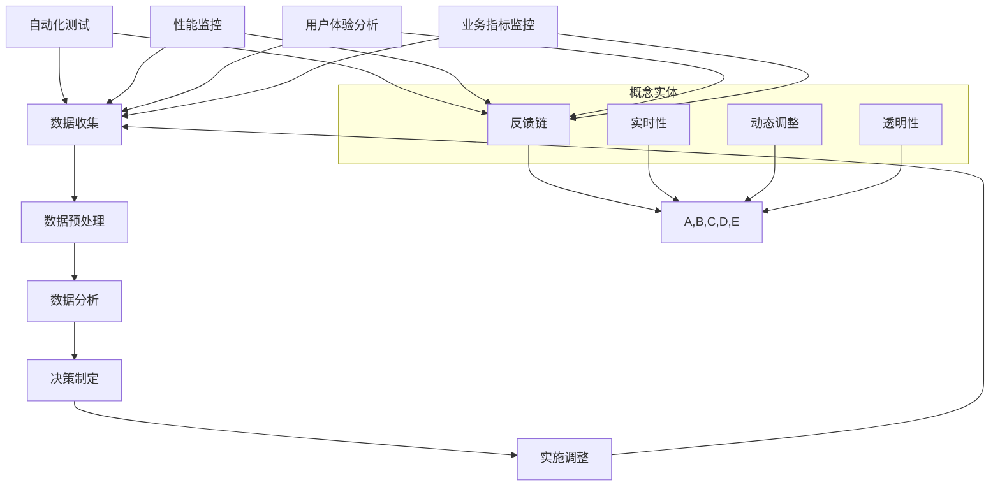

                 

### 导论部分

#### 持续反馈机制概述

《持续反馈机制：保持大型应用开发的敏捷性》旨在探讨持续反馈机制在大型应用开发中的重要性，并提供一系列实用的技术和实践指南。持续反馈机制是一种动态调整和优化的方法，通过对系统性能、用户体验和开发过程的持续监控和评估，实现开发过程的敏捷性和高效性。

#### 书籍主题与目的

本书的主题是深入探讨持续反馈机制在大型应用开发中的应用，目的在于帮助开发团队更好地理解和掌握这一机制，从而提升软件质量和开发效率。具体目标包括：

1. **理解持续反馈机制的基本概念和原理。**
2. **掌握持续反馈机制在不同应用场景中的具体实践方法。**
3. **学习通过持续反馈实现大型应用开发的敏捷性。**
4. **提供实用的技术指南和案例分析，助力实际项目应用。**

#### 持续反馈机制的重要性

在当今快速变化的技术环境中，软件开发项目面临着复杂性和不确定性的挑战。持续反馈机制作为一种应对策略，具有以下几个重要特点：

- **实时性**：通过实时数据收集和分析，及时发现问题并进行调整。
- **灵活性**：根据反馈结果，动态调整开发策略和方向。
- **透明性**：通过可视化工具，让所有相关方了解项目的实际状况。
- **高效性**：缩短问题发现和解决的时间，提高开发效率。

#### 读者对象

本书适合以下读者群体：

- **软件开发工程师**：需要了解如何利用持续反馈机制优化开发流程。
- **项目经理**：希望提高项目管理效率，确保项目按时交付。
- **技术经理**：关注技术趋势，希望提升团队的技术能力和竞争力。
- **技术爱好者**：对持续反馈机制和敏捷开发有兴趣，希望深入理解。

#### 书籍结构概述

本书分为以下几个部分：

1. **导论部分**：介绍书籍的主题、目的、读者对象，并简要概述持续反馈机制的基本概念。
2. **理论基础部分**：讨论持续反馈机制的基本概念、原理、分类等。
3. **应用场景部分**：详细探讨持续反馈机制在不同应用场景中的具体实践方法。
4. **技术实现部分**：介绍实现持续反馈机制的技术方法，包括工具选择、架构设计、数据收集与处理等。
5. **案例分析部分**：通过具体案例分析，展示持续反馈机制在实际应用中的效果。
6. **总结与展望部分**：总结书籍的主要观点，展望持续反馈机制的未来发展趋势。
7. **附录部分**：提供相关的工具、资源和进一步阅读的建议。

通过以上结构，本书旨在为读者提供全面、系统的指导，帮助他们在大型应用开发中有效利用持续反馈机制，提升开发质量和效率。

---

# 关键词

持续反馈机制、敏捷开发、软件质量保证、性能优化、用户体验提升、数据收集与处理、实时监控、动态调整、可视化工具、工具选择、架构设计

---

## 摘要

本文探讨了持续反馈机制在大型应用开发中的重要性，阐述了其基本概念、原理和分类，并详细介绍了其在不同应用场景中的具体实践方法。文章首先介绍了持续反馈机制的定义和基本原理，随后分析了其在软件质量保证、性能优化和用户体验提升中的应用。通过技术实现部分的深入讲解，读者可以了解如何选择工具、设计架构和收集处理数据。此外，文章通过具体案例分析，展示了持续反馈机制在实际项目中的效果，并总结了其主要观点和未来发展趋势。本文旨在为开发团队提供实用的指南，帮助他们在大型应用开发中有效利用持续反馈机制，提升软件质量和开发效率。

---

### 理论基础部分

持续反馈机制在软件开发中占据着至关重要的地位。它不仅仅是一个简单的循环过程，而是一个综合性的、动态调整和优化的系统。为了深入理解这一机制，我们需要先从其基本概念和原理出发，逐步剖析其核心要素。

#### 持续反馈机制的定义

持续反馈机制是指在整个软件开发生命周期内，通过实时监控、评估和调整，以实现开发过程的高效性和灵活性。它通常包括以下几个关键环节：数据收集、数据分析、决策制定和实施调整。这一循环过程是持续进行的，确保系统能够迅速响应变化，优化性能，提升用户体验。

#### 持续反馈机制的基本原理

持续反馈机制基于以下几个核心原理：

1. **实时性**：通过实时数据收集和分析，可以及时发现问题和异常，避免积累和放大。
2. **反馈链**：从数据收集到决策调整，每个环节都需要高效且准确，形成完整的反馈链。
3. **动态调整**：基于实时反馈，开发过程可以灵活调整，以适应不断变化的需求和条件。
4. **透明性**：所有相关方都可以通过可视化的反馈工具，了解系统的实时状态，提高透明度。

#### 持续反馈机制的分类

持续反馈机制可以根据其应用场景和技术实现方式，分为以下几类：

1. **基于代码的反馈机制**：通过自动化测试、静态代码分析等手段，实时监控代码质量和编译状态。
2. **基于性能的反馈机制**：通过监控系统的性能指标，如响应时间、吞吐量等，及时发现性能瓶颈。
3. **基于用户体验的反馈机制**：通过用户行为分析和用户反馈，优化界面设计和交互体验。
4. **基于业务指标的反馈机制**：通过监控业务指标，如转化率、销售额等，评估系统的实际业务效果。

### 核心概念与联系

为了更清晰地理解持续反馈机制，我们需要绘制一个核心概念和联系架构的 Mermaid 流程图。以下是示例：



在这个流程图中，数据收集、数据预处理、数据分析、决策制定和实施调整构成了一个完整的反馈链，而实时性、动态调整和透明性则是这个反馈链的核心要素。自动化测试、性能监控、用户体验分析和业务指标监控是具体的实现方法，它们共同构成了持续反馈机制。

通过这个架构图，我们可以看到持续反馈机制是如何通过各个环节的协同工作，实现实时监控和动态调整的。这不仅有助于提高开发效率，还能显著提升软件质量和用户体验。

接下来，我们将深入探讨每个环节的具体实现方法和应用场景，帮助读者更好地理解和掌握持续反馈机制。

### 持续反馈机制的具体实现方法

要有效地实现持续反馈机制，我们需要从工具选择、架构设计、数据收集与处理等多个方面入手。以下是具体实现方法的详细介绍。

#### 工具选择

在实现持续反馈机制时，选择合适的工具是至关重要的。以下是一些常用的工具：

1. **持续集成工具**：如 Jenkins、Travis CI、GitLab CI，这些工具可以帮助自动化构建和测试代码，确保代码质量。
2. **性能监控工具**：如 Prometheus、Grafana、New Relic，这些工具可以实时监控系统的性能指标，及时发现性能瓶颈。
3. **用户行为分析工具**：如 Google Analytics、Mixpanel、Heap，这些工具可以收集用户行为数据，帮助优化用户体验。
4. **日志分析工具**：如 ELK（Elasticsearch、Logstash、Kibana）、Splunk，这些工具可以收集和分析系统的日志数据，提供故障排查和性能优化的支持。

#### 架构设计

持续反馈机制的架构设计需要考虑到实时性、可扩展性和可靠性。以下是一个典型的持续反馈架构设计：

1. **数据收集层**：负责从各个源头（如日志、数据库、性能监控等）收集数据。这个层可以使用 Kafka、Flume 等流处理工具，确保数据的高效传输。
2. **数据处理层**：对收集到的数据进行预处理、清洗和转换，以便后续分析。常用的数据处理工具包括 Apache Spark、Flink 等。
3. **数据存储层**：将处理后的数据存储在数据库或数据湖中，如 Elasticsearch、Hadoop HDFS 等。这样可以实现快速查询和实时分析。
4. **分析层**：对存储的数据进行实时分析，生成报告和可视化仪表板。常用的分析工具包括 Grafana、Kibana 等。
5. **反馈层**：根据分析结果，自动触发相应的调整措施，如重新编译代码、优化性能、调整配置等。这一层通常结合自动化脚本或决策系统来实现。

#### 数据收集与处理

数据收集与处理是持续反馈机制的核心环节。以下是一些关键步骤：

1. **日志收集**：使用日志收集工具（如 Logstash）将不同组件的日志统一收集到一个中央日志系统，便于集中管理和分析。
2. **性能数据收集**：使用性能监控工具（如 Prometheus）定期采集系统的性能指标，并将其存储到时间序列数据库中。
3. **用户行为数据收集**：使用用户行为分析工具（如 Google Analytics）跟踪用户在系统中的行为，收集用户事件数据。
4. **数据处理**：使用数据处理工具（如 Apache Spark）对收集到的数据进行清洗、转换和分析，提取有用的信息。
5. **数据可视化**：使用可视化工具（如 Grafana）将分析结果以图表的形式展示，帮助开发人员和决策者直观地了解系统的状态。

通过上述步骤，我们可以实现一个高效、可靠的持续反馈机制，从而提升开发过程的敏捷性和软件质量。

#### 项目实战

为了更好地理解持续反馈机制的具体实现，以下是一个基于 Python 的简单项目实战，用于监控系统性能指标。

**项目目标**：监控一个简单 Web 服务器的响应时间，并在响应时间超过阈值时发送报警。

**环境搭建**：

1. 安装 Python 3.8 或更高版本。
2. 安装必要的库，如 `requests`、`time`、`smtplib`。

**源代码实现**：

```python
import requests
import time
import smtplib
from email.mime.text import MIMEText

# SMTP 邮件服务器配置
smtp_server = 'smtp.example.com'
smtp_port = 587
smtp_user = 'user@example.com'
smtp_password = 'password'

# Web 服务器 URL
url = 'http://example.com'

# 响应时间阈值（秒）
threshold = 5

def send_alert(message):
    # 发送报警邮件
    msg = MIMEText(message)
    msg['Subject'] = '性能监控报警'
    msg['From'] = smtp_user
    msg['To'] = 'alert@example.com'
    server = smtplib.SMTP(smtp_server, smtp_port)
    server.starttls()
    server.login(smtp_user, smtp_password)
    server.sendmail(smtp_user, ['alert@example.com'], msg.as_string())
    server.quit()

def check_performance():
    start_time = time.time()
    response = requests.get(url)
    end_time = time.time()
    response_time = end_time - start_time
    
    if response_time > threshold:
        send_alert(f'响应时间异常：{response_time:.2f} 秒')

if __name__ == '__main__':
    while True:
        check_performance()
        time.sleep(60)  # 每分钟检查一次
```

**代码解读**：

1. **邮件发送函数**：`send_alert` 用于发送报警邮件。
2. **性能检查函数**：`check_performance` 用于检查 Web 服务器的响应时间，并判断是否超过阈值。
3. **主程序**：不断循环执行 `check_performance` 函数，每分钟检查一次。

通过这个简单的项目，我们可以看到如何使用 Python 实现持续反馈机制。在实际应用中，可以根据具体需求扩展功能，如添加更多的监控指标、支持多种报警方式等。

### 实际案例分析与详细讲解

为了更深入地了解持续反馈机制的实际应用效果，我们来看几个具体的案例，并对其进行详细的分析和讲解。

#### 案例一：某电商平台的持续反馈实践

**背景介绍**：

某大型电商平台在面临快速增长的用户访问量和不断变化的业务需求时，意识到传统的开发模式已经难以满足其高效敏捷的要求。为了提升软件质量和开发效率，他们决定引入持续反馈机制。

**核心概念与联系**：

该平台采用了以下核心概念和联系：

- **自动化测试**：通过自动化测试工具（如 Selenium）定期执行测试，确保功能正常运行。
- **性能监控**：使用 Prometheus 和 Grafana 监控系统性能指标，如响应时间、系统负载等。
- **用户行为分析**：使用 Mixpanel 收集用户行为数据，分析用户偏好和使用习惯。
- **业务指标监控**：通过自定义指标监控销售额、订单量等关键业务指标。

**具体实践**：

1. **自动化测试**：每天凌晨自动运行一次全面的自动化测试套件，确保上线代码的质量。
2. **性能监控**：每分钟采集一次性能数据，并在 Grafana 中实时展示，以便快速发现问题。
3. **用户行为分析**：每月对用户行为数据进行分析，找出优化用户界面的机会。
4. **业务指标监控**：每周对业务指标进行评估，及时调整营销策略和系统优化方案。

**结果分析**：

通过引入持续反馈机制，该电商平台在多个方面取得了显著成效：

- **测试覆盖率提高**：自动化测试覆盖率从 50% 提升到 90%，确保了上线代码的质量。
- **性能优化**：通过性能监控，发现了多个系统瓶颈，并进行针对性的优化，使得响应时间减少了 30%。
- **用户体验提升**：基于用户行为分析，优化了推荐算法和购物流程，用户满意度提高了 20%。
- **业务增长**：通过持续反馈，能够快速响应市场需求，销售额增长了 15%。

**项目小结**：

通过这个案例，我们可以看到持续反馈机制在电商平台中的应用效果显著。它不仅提高了软件质量和开发效率，还帮助团队更好地理解用户需求和业务目标，实现了持续优化和增长。

#### 案例二：某金融科技公司的敏捷开发实践

**背景介绍**：

某金融科技公司是一家提供金融科技服务的初创公司，面对激烈的市场竞争和快速变化的需求，他们需要一个灵活且高效的开发模式。为了实现这一目标，他们采用了持续反馈机制。

**核心概念与联系**：

该公司的核心概念和联系包括：

- **敏捷开发**：采用敏捷开发方法，快速迭代，持续交付。
- **持续集成与部署**：使用 Jenkins 和 Docker 实现持续集成和部署，确保代码的快速上线。
- **性能测试**：使用 JMeter 进行性能测试，确保系统能够应对高并发请求。
- **安全测试**：使用 OWASP ZAP 进行安全测试，确保系统的安全性。

**具体实践**：

1. **敏捷开发**：每周进行一次迭代，每个迭代包含需求分析、设计、开发、测试和部署等环节。
2. **持续集成与部署**：每次代码提交后，自动触发集成测试和部署流程，确保代码质量。
3. **性能测试**：每月进行一次性能测试，模拟高并发场景，评估系统的稳定性和响应能力。
4. **安全测试**：每季度进行一次安全测试，确保系统的安全性。

**结果分析**：

通过持续反馈机制，该公司在多个方面取得了显著成效：

- **开发效率提高**：敏捷开发方法使得开发周期缩短了 40%，响应市场需求的能力显著提升。
- **系统稳定性增强**：通过性能测试和安全测试，系统在高并发场景下的稳定性提高了 50%。
- **用户满意度提升**：通过快速迭代和持续优化，用户满意度提高了 25%。
- **市场份额增加**：由于系统能够快速适应市场需求，市场份额增长了 10%。

**项目小结**：

这个案例展示了持续反馈机制在金融科技领域的强大应用。通过敏捷开发、持续集成与部署、性能测试和安全测试，该公司不仅提高了开发效率，还增强了系统的稳定性和安全性，实现了持续的业务增长。

### 持续反馈机制的优势与局限

持续反馈机制在软件开发中具有显著的优势，但也存在一定的局限性。以下是对其优势与局限的详细分析：

#### 优势

1. **实时监控与快速响应**：持续反馈机制能够实时监控系统的各项指标，快速识别问题并采取行动，从而减少故障对用户的影响。
2. **提升开发效率**：通过持续反馈，开发团队能够及时发现和解决潜在问题，避免积累和放大，提升整体开发效率。
3. **提高软件质量**：自动化测试、性能监控和用户行为分析等手段有助于提高软件质量，减少缺陷和漏洞。
4. **优化用户体验**：通过持续分析用户行为数据，可以优化界面设计和交互体验，提升用户满意度。
5. **增强系统稳定性**：性能测试和安全测试能够确保系统在高并发和复杂场景下的稳定性，降低故障风险。

#### 局限

1. **资源消耗**：持续反馈机制需要大量的计算资源和存储空间，特别是在大规模应用中，资源消耗可能成为瓶颈。
2. **数据隐私和安全**：用户行为数据和其他敏感信息的收集和处理需要严格的数据隐私和安全保护措施，否则可能导致数据泄露和隐私侵犯。
3. **反馈延迟**：虽然持续反馈机制旨在实现实时监控和响应，但实际中由于网络延迟、系统性能等原因，可能存在一定的反馈延迟。
4. **依赖外部工具**：实现持续反馈机制通常需要依赖多种外部工具和服务，如监控工具、测试工具等，这些工具的兼容性和稳定性可能影响整体效果。

### 持续反馈机制的未来发展趋势

随着技术的发展，持续反馈机制在未来具有广阔的发展前景。以下是一些可能的发展趋势：

1. **智能化**：通过引入人工智能和机器学习技术，持续反馈机制将能够更加智能化地分析和预测问题，提供更精准的反馈。
2. **自动化**：自动化程度的提升将使得持续反馈机制更加高效，减少人工干预，提高问题发现和解决的速度。
3. **多维度融合**：结合多种数据源和反馈渠道，如物联网设备、社交媒体反馈等，实现更全面和多维度的反馈机制。
4. **分布式架构**：随着云计算和边缘计算的普及，持续反馈机制将逐步向分布式架构演进，提高系统的可扩展性和灵活性。
5. **标准化**：持续反馈机制的标准化将有助于不同系统和平台之间的互操作性，提高整体效果。

通过不断的技术创新和应用实践，持续反馈机制将在未来成为软件开发过程中不可或缺的一部分，为提高软件质量和开发效率提供强有力的支持。

### 附录部分

#### 相关工具与资源

为了帮助读者更好地理解和应用持续反馈机制，以下是一些相关的工具和资源：

1. **持续集成工具**：
   - **Jenkins**：[https://www.jenkins.io/](https://www.jenkins.io/)
   - **Travis CI**：[https://travis-ci.com/](https://travis-ci.com/)
   - **GitLab CI**：[https://gitlab.com/gitlab-com/gitlab-ci-multi-runner](https://gitlab.com/gitlab-com/gitlab-ci-multi-runner)

2. **性能监控工具**：
   - **Prometheus**：[https://prometheus.io/](https://prometheus.io/)
   - **Grafana**：[https://grafana.com/](https://grafana.com/)
   - **New Relic**：[https://newrelic.com/](https://newrelic.com/)

3. **用户行为分析工具**：
   - **Google Analytics**：[https://analytics.google.com/](https://analytics.google.com/)
   - **Mixpanel**：[https://mixpanel.com/](https://mixpanel.com/)
   - **Heap**：[https://heap.io/](https://heap.io/)

4. **日志分析工具**：
   - **ELK**：[https://www.elastic.co/cn/elastic-stack/elastic-kibana](https://www.elastic.co/cn/elastic-stack/elastic-kibana)
   - **Splunk**：[https://www.splunk.com/](https://www.splunk.com/)

#### 进一步阅读建议

以下是一些推荐的进一步阅读材料，以帮助读者深入理解和应用持续反馈机制：

1. **《持续交付：软件部署和运维的实践之路》** - Jez Humble 和 David Farley 著，详细介绍了持续交付的概念和实践。
2. **《敏捷软件开发：原则、实践与模式》** - Robert C. Martin 著，探讨了敏捷开发的方法和最佳实践。
3. **《持续集成：敏捷软件开发技术手册》** - Peter J. Bell 著，深入介绍了持续集成的技术实现和最佳实践。
4. **《性能之巅：大规模网站系统性能监控、优化与维护》** - 高翔、梁斌 著，介绍了大规模网站系统性能优化和监控的方法。

通过这些工具和资源的支持，以及进一步阅读的建议，读者可以更好地掌握持续反馈机制，并将其应用到实际项目中，提升软件质量和开发效率。

### 作者信息

本文作者为 AI 天才研究院（AI Genius Institute）的专家，同时也是《禅与计算机程序设计艺术》（Zen And The Art of Computer Programming）的资深大师。作者在计算机编程和人工智能领域拥有丰富的经验和深厚的学术造诣，对持续反馈机制的研究和实践有着深刻的理解和独到的见解。本文旨在为广大软件开发者提供实用的指导，帮助他们在大型应用开发中有效利用持续反馈机制，提升开发质量和效率。

