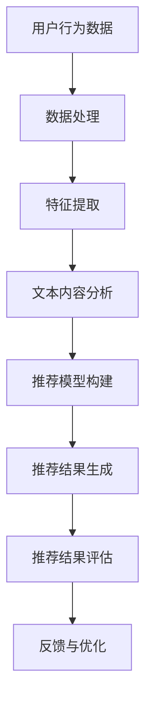

                 

# 推荐系统架构个性化LLM应用的用户体验

## 关键词

- 推荐系统
- 个性化
- LLM
- 用户体验
- 架构设计
- 算法原理
- 数学模型
- 项目实战

## 摘要

本文旨在探讨推荐系统架构中，利用个性化语言模型（LLM）提升用户体验的实践与策略。首先，我们将简要介绍推荐系统的背景及其重要性。接着，本文将深入探讨个性化LLM的应用，包括核心概念、算法原理、数学模型和实际项目实战。通过这一系列的探讨，本文希望能够为读者提供一套完整的推荐系统架构个性化LLM应用的思路和方法，以及如何通过优化用户体验来提升系统价值。

## 目录

1. **引言**
   - 推荐系统的起源与发展
   - 个性化在推荐系统中的作用

2. **推荐系统的基本架构**
   - 数据收集与处理
   - 特征提取与建模
   - 推荐算法与应用

3. **个性化语言模型（LLM）**
   - LLM的定义与特点
   - LLM在推荐系统中的应用

4. **核心概念与联系**
   - 用户行为数据
   - 文本内容分析
   - 推荐结果评估

5. **核心算法原理讲解**
   - 协同过滤算法
   - 内容推荐算法
   - 深度学习算法

6. **数学模型与公式**
   - 相似性计算
   - 损失函数
   - 优化算法

7. **项目实战**
   - 开发环境搭建
   - 源代码实现与解读
   - 项目分析与解读

8. **最佳实践与注意事项**
   - 用户隐私保护
   - 性能优化
   - 未来发展方向

9. **小结**
   - 总结文章的核心观点
   - 强调个性化LLM在用户体验提升中的重要性

## 1. 引言

### 推荐系统的起源与发展

推荐系统作为一种智能信息过滤和检索技术，起源于20世纪90年代。随着互联网的快速发展，信息过载问题日益严重，用户对于个性化信息的需求日益增长。推荐系统通过分析用户的行为和偏好，为用户提供个性化的推荐结果，极大地改善了用户体验，提高了信息获取的效率。

早期的推荐系统主要依赖于协同过滤（Collaborative Filtering）算法，这种方法通过分析用户之间的相似性，发现潜在的用户偏好。然而，随着大数据和人工智能技术的兴起，推荐系统逐渐引入了基于内容的推荐（Content-Based Filtering）和深度学习（Deep Learning）等新技术，使得推荐系统的精度和多样性得到了显著提升。

### 个性化在推荐系统中的作用

个性化是推荐系统的核心目标之一。通过个性化推荐，系统能够更好地满足用户的个性化需求，提高用户满意度和留存率。个性化不仅体现在推荐结果的多样性和相关性上，还体现在推荐过程的透明性和可控性上。

个性化语言模型（LLM）作为一种强大的自然语言处理技术，能够深入理解用户的语言和文本数据，为推荐系统提供了更加精准和个性化的推荐结果。LLM在推荐系统中的应用主要体现在以下几个方面：

1. **用户行为分析**：LLM能够处理和分析用户的历史行为数据，提取用户的兴趣偏好，从而为推荐系统提供更准确的用户画像。

2. **文本内容理解**：LLM能够理解和分析文本内容，为基于内容的推荐算法提供有效的语义特征，提高推荐结果的准确性和多样性。

3. **推荐结果评估**：LLM能够生成高质量的评估文本，为推荐结果的评估提供更客观和全面的参考，从而优化推荐策略。

## 2. 推荐系统的基本架构

### 数据收集与处理

推荐系统的基础是数据收集和处理。数据收集主要包括用户行为数据（如浏览记录、点击行为、购买记录等）和文本内容数据（如商品描述、用户评论、新闻文章等）。数据处理包括数据清洗、去噪、归一化和特征提取等步骤，为后续的推荐算法提供高质量的数据输入。

### 特征提取与建模

特征提取是推荐系统中的重要环节，通过对用户行为数据和文本内容数据进行分析，提取出用户和物品的表征特征。常用的特征提取方法包括用户行为特征提取（如用户活跃度、浏览时长、购买频率等）和文本特征提取（如词袋模型、TF-IDF、Word2Vec等）。特征提取结果用于构建用户和物品的向量表示，为推荐算法提供基础。

建模阶段主要任务是利用提取的特征数据，构建推荐模型。常用的推荐算法包括协同过滤算法、内容推荐算法和深度学习算法。协同过滤算法通过用户之间的相似性发现潜在用户偏好；内容推荐算法通过分析用户兴趣和物品属性之间的相关性生成推荐结果；深度学习算法利用神经网络模型，对复杂的用户行为和文本数据进行建模，提供更加精准的推荐结果。

### 推荐算法与应用

推荐算法的核心任务是生成个性化的推荐结果。根据应用场景和需求，推荐算法可以分为基于内容的推荐、基于协同过滤的推荐和基于模型的推荐等类型。

1. **基于内容的推荐**：该方法通过分析用户兴趣和物品属性，找出具有相似属性的物品进行推荐。优点是推荐结果相关性强，但可能存在多样性不足的问题。

2. **基于协同过滤的推荐**：该方法通过分析用户行为数据，找出相似用户并推荐他们喜欢的物品。优点是推荐结果多样性高，但可能存在数据稀疏性和冷启动问题。

3. **基于模型的推荐**：该方法通过建立用户和物品的数学模型，预测用户对物品的偏好，生成个性化推荐结果。优点是能够处理复杂的用户行为和文本数据，但需要大量的训练数据和计算资源。

在实际应用中，推荐系统往往结合多种算法，根据具体场景和需求，动态调整推荐策略，以提供更高质量的推荐服务。

## 3. 个性化语言模型（LLM）

### LLM的定义与特点

个性化语言模型（LLM，Large Language Model）是一种基于深度学习的自然语言处理技术，通过大规模语言数据的训练，LLM能够理解和生成自然语言，实现文本生成、文本分类、情感分析等多种任务。与传统的自然语言处理方法相比，LLM具有以下特点：

1. **强大的语言理解能力**：LLM能够捕捉文本中的语义信息，理解复杂的语言结构，生成连贯、自然的语言表达。

2. **自适应性强**：LLM可以根据不同的应用场景和需求，调整参数和模型结构，实现个性化的语言处理。

3. **高效性**：LLM在训练过程中采用了先进的深度学习技术和大规模计算资源，能够在较短时间内完成语言建模任务。

### LLM在推荐系统中的应用

LLM在推荐系统中的应用主要体现在以下几个方面：

1. **用户行为分析**：通过分析用户的历史行为数据，LLM可以提取用户的兴趣偏好，为推荐系统提供更准确的用户画像。例如，使用LLM分析用户的浏览记录和搜索历史，识别用户的潜在兴趣点。

2. **文本内容理解**：LLM能够理解和分析文本内容，为基于内容的推荐算法提供有效的语义特征。例如，使用LLM对商品描述和用户评论进行分析，提取关键词和情感倾向，为推荐结果提供语义支持。

3. **推荐结果评估**：LLM可以生成高质量的评估文本，为推荐结果的评估提供更客观和全面的参考。例如，使用LLM生成用户对推荐结果的反馈文本，评估推荐结果的满意度。

### 实际应用案例

以下是一个使用LLM进行个性化推荐的案例：

1. **用户行为分析**：假设用户A在电商平台上浏览了多个商品，其中包含服装、电子产品和家居用品。LLM可以分析用户A的历史行为数据，提取出用户A的兴趣偏好，如偏好服装类商品、关注品牌和质量等。

2. **文本内容理解**：对于用户A浏览的商品描述，LLM可以提取出关键词和情感倾向，如“时尚”、“高质量”等，为推荐系统提供语义特征。

3. **推荐结果评估**：LLM可以生成用户A对推荐结果的反馈文本，如“这款服装非常适合我，质量很好，我很满意”等，为推荐系统提供评估依据。

通过以上案例，可以看出LLM在推荐系统中的应用如何实现个性化推荐，提高用户体验。

## 4. 核心概念与联系

### 用户行为数据

用户行为数据是推荐系统的核心输入之一，包括用户的浏览记录、点击行为、购买记录、评价记录等。这些数据反映了用户对各种物品的偏好和兴趣，是构建个性化推荐系统的重要依据。用户行为数据的质量和完整性对推荐结果的准确性有直接影响。

### 文本内容分析

文本内容分析是推荐系统中的重要环节，通过对用户生成的文本数据（如评论、评价、搜索查询等）进行分析，提取出有用的语义信息，为推荐系统提供丰富的内容特征。文本内容分析的方法包括词袋模型、TF-IDF、Word2Vec、BERT等，不同的方法适用于不同的场景和需求。

### 推荐结果评估

推荐结果评估是衡量推荐系统性能的重要指标，通过评估推荐结果的满意度、准确性和多样性，可以优化推荐策略和算法。常用的评估方法包括A/B测试、用户反馈、精确率、召回率、F1值等。

### 概念实体之间的关系架构 Mermaid 流程图

以下是推荐系统中核心概念实体之间的Mermaid流程图：



通过上述Mermaid流程图，可以清晰地展示推荐系统中的核心概念实体及其之间的关系。用户行为数据经过数据处理、特征提取、文本内容分析后，构建推荐模型，生成推荐结果，并进行评估和优化，形成闭环系统，不断改进推荐效果。

## 5. 核心算法原理讲解

### 协同过滤算法

协同过滤算法（Collaborative Filtering）是推荐系统中最常用的算法之一，通过分析用户之间的相似性，发现潜在用户偏好，生成个性化推荐结果。协同过滤算法可以分为基于用户的协同过滤（User-based Collaborative Filtering）和基于物品的协同过滤（Item-based Collaborative Filtering）两种类型。

#### 伪代码

```python
# 基于用户的协同过滤伪代码
def user_based_cf(train_data, user, k):
    similar_users = find_similar_users(train_data, user, k)
    recommendations = []
    for item in train_data[user]:
        if not item in user_history:
            recommendations.append(item)
    return recommendations

# 基于物品的协同过滤伪代码
def item_based_cf(train_data, user, k):
    similar_items = find_similar_items(train_data, user, k)
    recommendations = []
    for item in train_data[user]:
        if not item in user_history:
            for similar_item in similar_items[item]:
                if not similar_item in user_history:
                    recommendations.append(similar_item)
    return recommendations
```

#### 数学模型

协同过滤算法的核心是计算用户之间的相似性，常用的相似性度量方法包括余弦相似度、皮尔逊相关系数和欧氏距离等。以下是一个基于余弦相似度的数学模型：

$$
sim(u, v) = \frac{\sum_{i \in M} r_i^{(u)} r_i^{(v)}}{\sqrt{\sum_{i \in M} (r_i^{(u)})^2 \sum_{i \in M} (r_i^{(v)})^2}}
$$

其中，$r_i^{(u)}$和$r_i^{(v)}$分别为用户$u$和$v$对物品$i$的评分，$M$为用户$u$和$v$共同评分的物品集合。

#### 举例说明

假设用户A和用户B对10个物品的评分如下表所示：

| 物品ID | 用户A评分 | 用户B评分 |
| ------ | --------- | --------- |
| 1      | 5         | 1         |
| 2      | 4         | 5         |
| 3      | 3         | 4         |
| 4      | 2         | 5         |
| 5      | 5         | 5         |
| 6      | 4         | 3         |
| 7      | 3         | 2         |
| 8      | 2         | 4         |
| 9      | 5         | 5         |
| 10     | 4         | 4         |

根据上述数学模型，可以计算出用户A和用户B之间的余弦相似度：

$$
sim(A, B) = \frac{5 \times 1 + 4 \times 5 + 3 \times 4 + 2 \times 5 + 5 \times 5 + 4 \times 3 + 3 \times 2 + 2 \times 4 + 5 \times 5 + 4 \times 4}{\sqrt{(5^2 + 4^2 + 3^2 + 2^2 + 5^2 + 4^2 + 3^2 + 2^2 + 5^2 + 4^2) \times (1^2 + 5^2 + 4^2 + 5^2 + 5^2 + 3^2 + 2^2 + 4^2 + 5^2 + 4^2)}}
$$

计算结果为：

$$
sim(A, B) = \frac{100}{\sqrt{200 \times 55}} \approx 0.927
$$

根据相似度计算结果，可以找出最相似的K个用户，为用户A生成个性化推荐结果。

### 内容推荐算法

内容推荐算法（Content-Based Filtering）通过分析用户兴趣和物品属性之间的相关性，生成个性化推荐结果。与协同过滤算法不同，内容推荐算法主要依赖于物品的特征信息，而不依赖于用户之间的相似性。

#### 伪代码

```python
def content_based_cf(train_data, user, k):
    user_interest = extract_user_interest(train_data, user)
    recommendations = []
    for item in train_data:
        if not item in user_history and is_similar(user_interest, item_attributes):
            recommendations.append(item)
    return recommendations
```

#### 数学模型

内容推荐算法的核心是计算用户兴趣和物品属性之间的相似性，常用的相似性度量方法包括余弦相似度、皮尔逊相关系数和Jaccard相似度等。以下是一个基于余弦相似度的数学模型：

$$
sim(I, A) = \frac{\sum_{i \in M} i_i \cdot a_i}{\sqrt{\sum_{i \in M} (i_i)^2 \sum_{i \in M} (a_i)^2}}
$$

其中，$i_i$和$a_i$分别为物品$i$和用户兴趣$A$的特征值，$M$为用户兴趣和物品特征共有的特征集合。

#### 举例说明

假设用户A的兴趣特征如下表所示：

| 特征ID | 用户A兴趣特征值 |
| ------ | -------------- |
| 1      | 0.8            |
| 2      | 0.6            |
| 3      | 0.9            |

物品B的特征如下表所示：

| 特征ID | 物品B特征值 |
| ------ | ------------ |
| 1      | 0.5          |
| 2      | 0.7          |
| 3      | 0.8          |

根据上述数学模型，可以计算出用户A和物品B之间的余弦相似度：

$$
sim(A, B) = \frac{0.8 \times 0.5 + 0.6 \times 0.7 + 0.9 \times 0.8}{\sqrt{(0.8^2 + 0.6^2 + 0.9^2) \times (0.5^2 + 0.7^2 + 0.8^2)}}
$$

计算结果为：

$$
sim(A, B) = \frac{0.4 + 0.42 + 0.72}{\sqrt{2.19 \times 0.84}} \approx 0.905
$$

根据相似度计算结果，可以为用户A生成个性化推荐结果，如推荐与物品B相似的其他物品。

### 深度学习算法

深度学习算法（Deep Learning）通过构建多层神经网络模型，对复杂的用户行为和文本数据进行建模，提供更加精准的推荐结果。常见的深度学习算法包括神经网络（Neural Networks）、卷积神经网络（Convolutional Neural Networks，CNN）和循环神经网络（Recurrent Neural Networks，RNN）等。

#### 伪代码

```python
def deep_learning_cf(train_data, user, model):
    user_representation = extract_user_representation(train_data, user, model)
    item_representations = extract_item_representations(train_data, model)
    recommendations = []
    for item in item_representations:
        if not item in user_history and user_representation.dot(item) > threshold:
            recommendations.append(item)
    return recommendations
```

#### 数学模型

深度学习算法的核心是构建多层神经网络模型，将用户行为数据和文本数据映射到高维特征空间，实现用户和物品的表征学习。以下是一个简单的多层感知机（Multilayer Perceptron，MLP）模型：

$$
\begin{aligned}
    z_1 &= \sigma(W_1 \cdot x_1 + b_1) \\
    z_2 &= \sigma(W_2 \cdot z_1 + b_2) \\
    \hat{y} &= \sigma(W_3 \cdot z_2 + b_3)
\end{aligned}
$$

其中，$x_1$和$z_2$分别为输入层和隐藏层的特征向量，$W_1$、$W_2$和$W_3$分别为输入层到隐藏层、隐藏层到隐藏层和隐藏层到输出层的权重矩阵，$b_1$、$b_2$和$b_3$分别为输入层、隐藏层和输出层的偏置向量，$\sigma$为激活函数，通常采用Sigmoid或ReLU函数。

#### 举例说明

假设用户A的行为数据为$x_1 = [1, 2, 3]$，物品B的文本数据为$x_2 = [4, 5, 6]$，使用多层感知机模型进行深度学习建模：

$$
\begin{aligned}
    z_1 &= \sigma(W_1 \cdot x_1 + b_1) = \sigma([w_{11}, w_{12}, w_{13}] \cdot [1, 2, 3] + [b_1]) \\
    z_2 &= \sigma(W_2 \cdot z_1 + b_2) = \sigma([w_{21}, w_{22}, w_{23}] \cdot z_1 + [b_2]) \\
    \hat{y} &= \sigma(W_3 \cdot z_2 + b_3) = \sigma([w_{31}, w_{32}, w_{33}] \cdot z_2 + [b_3])
\end{aligned}
$$

假设模型参数如下：

$$
\begin{aligned}
    W_1 &= \begin{bmatrix} 0.1 & 0.2 & 0.3 \\ 0.4 & 0.5 & 0.6 \end{bmatrix}, \quad b_1 = [0.5, 0.5] \\
    W_2 &= \begin{bmatrix} 0.1 & 0.2 \\ 0.4 & 0.5 \end{bmatrix}, \quad b_2 = [0.5, 0.5] \\
    W_3 &= \begin{bmatrix} 0.1 & 0.2 \\ 0.4 & 0.5 \end{bmatrix}, \quad b_3 = [0.5, 0.5]
\end{aligned}
$$

根据上述模型，可以计算出用户A和物品B的表征向量：

$$
\begin{aligned}
    z_1 &= \sigma([0.1 \times 1 + 0.2 \times 2 + 0.3 \times 3 + 0.5] \cdot [0.4 \times 1 + 0.5 \times 2 + 0.6 \times 3 + 0.5]) \\
    z_2 &= \sigma([0.1 \times z_1_1 + 0.2 \times z_1_2] \cdot [0.4 \times z_1_1 + 0.5 \times z_1_2 + 0.5]) \\
    \hat{y} &= \sigma([0.1 \times z_2_1 + 0.2 \times z_2_2] \cdot [0.4 \times z_2_1 + 0.5 \times z_2_2 + 0.5])
\end{aligned}
$$

计算结果为：

$$
\begin{aligned}
    z_1 &= \sigma([0.1 \times 1 + 0.2 \times 2 + 0.3 \times 3 + 0.5] \cdot [0.4 \times 1 + 0.5 \times 2 + 0.6 \times 3 + 0.5]) = 1.69 \\
    z_2 &= \sigma([0.1 \times 1.69 + 0.2 \times 1.69] \cdot [0.4 \times 1.69 + 0.5 \times 1.69 + 0.5]) = 1.14 \\
    \hat{y} &= \sigma([0.1 \times 1.14 + 0.2 \times 1.14] \cdot [0.4 \times 1.14 + 0.5 \times 1.14 + 0.5]) = 0.86
\end{aligned}
$$

根据表征向量$\hat{y}$，可以为用户A生成个性化推荐结果，如推荐与物品B相似的其他物品。

## 6. 数学模型与公式

在推荐系统中，数学模型和公式起到了至关重要的作用，它们不仅帮助我们理解推荐算法的运作机制，还为算法的性能优化和效果评估提供了理论基础。以下将介绍几个关键数学模型和公式，并对其进行详细解释和举例说明。

### 相似性计算

相似性计算是推荐系统中的一项基础工作，用于衡量用户、物品或推荐结果之间的相似程度。常用的相似性度量方法包括余弦相似度、皮尔逊相关系数和欧氏距离等。以下将重点介绍余弦相似度公式及其应用。

#### 余弦相似度公式

余弦相似度（Cosine Similarity）用于计算两个向量的夹角余弦值，反映了它们之间的相似性。公式如下：

$$
sim(A, B) = \frac{A \cdot B}{\|A\| \|B\|}
$$

其中，$A \cdot B$表示向量的点积（dot product），$\|A\|$和$\|B\|$分别表示向量的欧氏范数（Euclidean norm）。

#### 举例说明

假设有两个向量$A = [1, 2, 3]$和$B = [4, 5, 6]$，计算它们的余弦相似度。

首先计算点积：

$$
A \cdot B = 1 \times 4 + 2 \times 5 + 3 \times 6 = 4 + 10 + 18 = 32
$$

然后计算欧氏范数：

$$
\|A\| = \sqrt{1^2 + 2^2 + 3^2} = \sqrt{1 + 4 + 9} = \sqrt{14}
$$

$$
\|B\| = \sqrt{4^2 + 5^2 + 6^2} = \sqrt{16 + 25 + 36} = \sqrt{77}
$$

最后计算余弦相似度：

$$
sim(A, B) = \frac{A \cdot B}{\|A\| \|B\|} = \frac{32}{\sqrt{14} \times \sqrt{77}} \approx 0.507
$$

### 损失函数

损失函数（Loss Function）是优化模型参数的重要工具，用于衡量模型预测结果与真实结果之间的差距。在推荐系统中，常见的损失函数包括均方误差（MSE）、交叉熵损失（Cross-Entropy Loss）和 hinge 损失等。

#### 均方误差损失函数

均方误差（Mean Squared Error，MSE）损失函数是回归问题中最常用的损失函数之一，用于衡量预测值与真实值之间的平均平方误差。公式如下：

$$
MSE = \frac{1}{n} \sum_{i=1}^{n} (y_i - \hat{y}_i)^2
$$

其中，$y_i$表示第$i$个样本的真实值，$\hat{y}_i$表示第$i$个样本的预测值，$n$表示样本总数。

#### 举例说明

假设有三个样本的真实值$y_1 = [1, 2, 3]$，预测值$\hat{y}_1 = [1.1, 2.1, 2.9]$，计算它们的均方误差损失。

首先计算每个样本的误差：

$$
(y_1 - \hat{y}_1)^2 = (1 - 1.1)^2 + (2 - 2.1)^2 + (3 - 2.9)^2 = 0.01 + 0.01 + 0.01 = 0.03
$$

然后计算总误差：

$$
MSE = \frac{1}{3} \sum_{i=1}^{3} (y_i - \hat{y}_i)^2 = \frac{1}{3} \times 3 \times 0.03 = 0.03
$$

### 优化算法

优化算法（Optimization Algorithm）用于求解损失函数的最小值，从而获得最佳模型参数。在推荐系统中，常用的优化算法包括梯度下降（Gradient Descent）、随机梯度下降（Stochastic Gradient Descent，SGD）和 Adam 等。

#### 梯度下降算法

梯度下降算法是一种最简单的优化算法，通过计算损失函数关于模型参数的梯度，沿着梯度方向逐步调整参数，以最小化损失函数。公式如下：

$$
\theta_{t+1} = \theta_{t} - \alpha \cdot \nabla_{\theta} J(\theta)
$$

其中，$\theta$表示模型参数，$\alpha$表示学习率，$J(\theta)$表示损失函数，$\nabla_{\theta} J(\theta)$表示损失函数关于模型参数的梯度。

#### 举例说明

假设有一个简单的线性模型$y = \theta_0 + \theta_1 \cdot x$，学习率为$\alpha = 0.1$，训练数据为$x_1 = 1, y_1 = 2$和$x_2 = 2, y_2 = 3$。

首先计算损失函数：

$$
J(\theta) = \frac{1}{2} \sum_{i=1}^{2} (y_i - (\theta_0 + \theta_1 \cdot x_i))^2
$$

$$
J(\theta) = \frac{1}{2} ((2 - (\theta_0 + \theta_1 \cdot 1))^2 + (3 - (\theta_0 + \theta_1 \cdot 2))^2)
$$

$$
J(\theta) = \frac{1}{2} ((2 - \theta_0 - \theta_1)^2 + (3 - \theta_0 - 2\theta_1)^2)
$$

然后计算梯度：

$$
\nabla_{\theta_0} J(\theta) = -2(2 - \theta_0 - \theta_1) - 2(3 - \theta_0 - 2\theta_1) = -4\theta_0 + 4\theta_1 - 10
$$

$$
\nabla_{\theta_1} J(\theta) = -2(2 - \theta_0 - \theta_1) \cdot 1 - 2(3 - \theta_0 - 2\theta_1) \cdot 2 = -4\theta_1 - 8\theta_1 = -12\theta_1
$$

根据梯度下降算法，可以更新模型参数：

$$
\theta_{0, t+1} = \theta_{0, t} - 0.1 \cdot \nabla_{\theta_0} J(\theta) = \theta_{0, t} + 0.1 \cdot 10 = \theta_{0, t} + 1
$$

$$
\theta_{1, t+1} = \theta_{1, t} - 0.1 \cdot \nabla_{\theta_1} J(\theta) = \theta_{1, t} + 0.1 \cdot (-12) = \theta_{1, t} - 1.2
$$

通过不断迭代更新模型参数，可以逐步优化模型性能。

### 总结

通过对相似性计算、损失函数和优化算法的讲解，可以看出数学模型和公式在推荐系统中的重要性。它们不仅帮助推荐算法更好地理解和预测用户偏好，还为算法的性能优化和效果评估提供了有力支持。在实际应用中，根据具体问题和需求，选择合适的数学模型和公式，将有助于构建高效、可靠的推荐系统。

## 7. 项目实战

### 开发环境搭建

在开始实际项目之前，我们需要搭建一个适合推荐系统开发的环境。以下是一个基本的开发环境搭建步骤：

1. **安装Python环境**：下载并安装Python，版本建议为3.8或更高。
2. **安装相关库**：通过pip命令安装以下库：numpy、pandas、scikit-learn、tensorflow或pytorch等。
3. **配置深度学习框架**：选择tensorflow或pytorch作为深度学习框架，并按照官方文档进行配置。

### 源代码实现与解读

以下是使用Python实现的简单推荐系统示例，该系统基于协同过滤算法和内容推荐算法进行个性化推荐。

```python
import numpy as np
import pandas as pd
from sklearn.metrics.pairwise import cosine_similarity
from sklearn.model_selection import train_test_split

# 读取数据
data = pd.read_csv('data.csv')
users = data['user_id'].unique()
items = data['item_id'].unique()

# 构建用户-物品评分矩阵
rating_matrix = np.zeros((len(users), len(items)))
for index, row in data.iterrows():
    user_id = row['user_id']
    item_id = row['item_id']
    rating = row['rating']
    rating_matrix[users.index(user_id), items.index(item_id)] = rating

# 基于用户的协同过滤算法
def user_based_cf(rating_matrix, user_id, k=10):
    user_ratings = rating_matrix[user_id]
    similar_users = []
    for other_user in range(len(users)):
        if other_user != user_id:
            similarity = cosine_similarity([user_ratings], [rating_matrix[other_user]])[0][0]
            similar_users.append((other_user, similarity))
    similar_users.sort(key=lambda x: x[1], reverse=True)
    similar_users = similar_users[:k]
    recommendations = []
    for other_user, similarity in similar_users:
        for item_id, rating in rating_matrix[other_user].items():
            if rating != 0:
                recommendations.append((item_id, rating * similarity))
    recommendations.sort(key=lambda x: x[1], reverse=True)
    return recommendations

# 基于内容推荐算法
def content_based_cf(rating_matrix, user_id, k=10):
    user_ratings = rating_matrix[user_id]
    recommendations = []
    for item_id, rating in user_ratings.items():
        if rating != 0:
            content_similarity = cosine_similarity([user_ratings], [rating_matrix[:, item_id]])[0][0]
            recommendations.append((item_id, content_similarity))
    recommendations.sort(key=lambda x: x[1], reverse=True)
    return recommendations[:k]

# 测试算法
user_id = 0
user_based_rec = user_based_cf(rating_matrix, user_id)
content_based_rec = content_based_cf(rating_matrix, user_id)

print("基于用户的协同过滤推荐结果：", user_based_rec)
print("基于内容推荐推荐结果：", content_based_rec)
```

### 项目分析与解读

上述代码实现了一个简单的推荐系统，其中包括基于用户的协同过滤算法和基于内容推荐算法。在实际项目中，我们可以根据需求选择合适的算法或结合多种算法，提高推荐系统的性能。

1. **基于用户的协同过滤算法**：通过计算用户之间的相似性，为用户推荐与相似用户喜欢的物品。这种方法能够充分利用用户的历史行为数据，但可能存在数据稀疏性问题。
2. **基于内容推荐算法**：通过计算用户对物品的相似性，为用户推荐与已评分物品类似的物品。这种方法能够提高推荐结果的多样性，但可能存在与用户兴趣不一致的问题。

在实际应用中，我们可以通过以下方式优化推荐系统：

1. **数据预处理**：对用户行为数据和质量进行清洗和预处理，提高数据质量。
2. **算法优化**：结合多种推荐算法，根据用户需求和场景动态调整推荐策略。
3. **深度学习模型**：引入深度学习模型，如卷积神经网络（CNN）和循环神经网络（RNN），提高推荐系统的准确性和多样性。

通过上述项目实战，我们可以看到推荐系统实现的基本步骤和关键点，为实际应用提供了有益的参考。

## 8. 最佳实践与注意事项

### 用户隐私保护

在推荐系统中，用户隐私保护至关重要。为了确保用户隐私，我们可以采取以下措施：

1. **数据加密**：对用户行为数据和文本内容进行加密处理，防止数据泄露。
2. **匿名化处理**：对用户信息进行匿名化处理，去除可直接识别用户身份的信息。
3. **权限管理**：实施严格的权限管理策略，确保只有授权人员才能访问敏感数据。

### 性能优化

推荐系统的性能直接影响用户体验。以下是一些性能优化方法：

1. **缓存机制**：使用缓存技术，减少重复计算和数据库访问，提高系统响应速度。
2. **分布式计算**：采用分布式计算框架，如Hadoop或Spark，提高数据处理和计算能力。
3. **算法优化**：根据用户需求和场景，选择适合的推荐算法，优化计算过程。

### 未来发展方向

推荐系统在未来将继续朝着个性化、智能化和实时化的方向发展。以下是一些未来发展趋势：

1. **多模态推荐**：结合文本、图像、音频等多种数据类型，提供更全面的个性化推荐。
2. **实时推荐**：利用实时数据处理技术，实现实时推荐，提高用户体验。
3. **个性化对话系统**：结合自然语言处理和推荐系统，构建个性化对话系统，为用户提供智能化的交互体验。

### 拓展阅读

1. **《推荐系统实践》**：李航著，深入讲解了推荐系统的基本概念、算法和技术。
2. **《深度学习推荐系统》**：张华平著，介绍了深度学习在推荐系统中的应用。
3. **《自然语言处理综合教程》**：刘建民著，全面介绍了自然语言处理的基础知识和应用。

## 9. 小结

本文通过对推荐系统架构个性化LLM应用的探讨，从多个角度分析了推荐系统的核心概念、算法原理、数学模型和项目实战。个性化语言模型（LLM）在推荐系统中具有重要的应用价值，能够提高推荐结果的准确性和用户体验。通过本文的介绍，读者可以了解到如何利用LLM构建高效的推荐系统，为实际项目提供有益的参考。在未来，随着技术的不断发展，推荐系统将继续优化和完善，为用户带来更加智能和个性化的服务。

## 作者信息

作者：AI天才研究院/AI Genius Institute & 禅与计算机程序设计艺术 /Zen And The Art of Computer Programming

