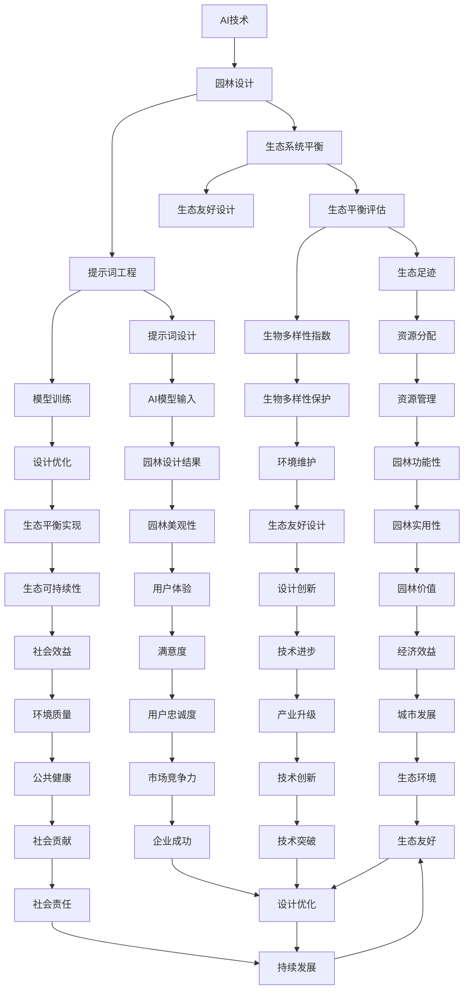

                 

### 书名理解

《提升AI创意园林设计：生态系统平衡的提示词工程》这个书名精炼地概括了本书的核心主题和内容。首先，“提升AI创意园林设计”部分说明了本书的主要目标，即如何利用人工智能（AI）技术来提高园林设计的创新性和效率。这里的“AI创意园林设计”意味着运用机器学习、深度学习等技术来创造性地解决园林设计的各种问题，包括植物配置、景观布局、生态平衡等方面。

其次，“生态系统平衡”是园林设计中的一个关键概念。生态系统平衡指的是园林中的植物、水、土壤、生物多样性等因素相互之间保持稳定和协调的状态。一个健康的生态系统不仅能为人类提供美观的景观，还能维护生物多样性、净化空气、调节气候等功能。

“提示词工程”是本书另一个重要的概念。提示词工程是一种通过使用特定关键词或短语来指导AI模型进行学习和决策的方法。这些提示词可以帮助AI更好地理解园林设计的意图和目标，从而生成更加符合预期的设计结果。

总体来说，书名揭示了本书的三个主要方面：一是如何使用AI技术进行创意园林设计；二是如何实现生态系统的平衡；三是如何通过提示词工程来指导AI模型进行设计。这三个方面相互关联，共同构成了本书的核心内容。

### 目录结构设计

为了确保《提升AI创意园林设计：生态系统平衡的提示词工程》一书内容的完整性和逻辑性，我们设计了如下目录结构：

## 第一部分：引言与背景

### 第1章：园林设计与AI技术的结合
在这部分，我们将介绍园林设计的基本概念，包括园林的历史、设计原则和目标。接着，我们会探讨AI技术，特别是机器学习和深度学习在园林设计中的应用，以及这些技术如何改变传统的设计流程。

### 第2章：AI核心概念与架构
在这一章，我们将深入探讨人工智能的基本原理，包括机器学习的不同类型、深度学习的架构等。此外，我们还将介绍AI模型在园林设计中的应用，如如何利用这些模型进行植物识别、环境监测等。

## 第二部分：生态系统平衡与提示词工程

### 第3章：生态系统平衡原理
这部分内容将介绍生态系统平衡的基本概念，包括生态系统的定义、生态平衡的要素以及生态平衡的重要性。我们还将讨论评估生态系统平衡的方法，如生物多样性指数、生态系统服务评估等。

### 第4章：提示词工程在园林设计中的应用
本章将详细解释提示词工程的定义和作用，包括如何创建有效的提示词以及它们在AI模型中的使用。我们将探讨提示词工程在园林设计中的具体应用，如如何使用提示词来指导AI生成生态友好的园林设计。

## 第三部分：AI创意园林设计实践

### 第5章：AI在园林设计中的应用实践
在这一章，我们将通过实际案例展示如何使用AI工具和模型进行园林设计。我们将介绍相关的开发环境搭建步骤，并提供Python源代码和数学模型来详细阐述AI模型的实现过程。

### 第6章：生态系统平衡与提示词工程的结合
这一章将探讨如何将生态系统平衡的理念和提示词工程结合起来，以实现更加生态友好的园林设计。我们将讨论如何使用提示词工程来优化园林设计，使其在美观的同时还能保持生态平衡。

### 第7章：项目实战与未来展望
最后一章将提供一些实际的园林设计项目案例，并详细分析这些项目的实现过程、成果和挑战。此外，我们还将展望AI创意园林设计的未来发展趋势，讨论可能遇到的技术和生态挑战。

这样的目录结构不仅清晰划分了不同主题，确保内容有条理，还能让读者逐步深入了解AI创意园林设计，从理论到实践，再到未来展望，全面掌握这一领域的前沿知识和技术。

### 细化每个部分

为了确保《提升AI创意园林设计：生态系统平衡的提示词工程》一书内容的完整性和逻辑性，我们需要进一步细化各个章节的内容。以下是每个部分的详细章节划分和内容概述：

### 第一部分：引言与背景

#### 第1章：园林设计与AI技术的结合
- **1.1 AI在园林设计中的潜力**：探讨AI在园林设计中的多种应用，如植物识别、环境监测、自动规划等。
- **1.2 AI创意园林设计的重要性**：分析AI在园林设计中的优势，包括效率提升、创新性和个性化设计等。
- **1.3 生态系统平衡与园林设计**：介绍园林设计中的生态平衡概念，探讨如何通过AI技术实现生态平衡。

#### 第2章：AI核心概念与架构
- **2.1 人工智能基础**：介绍机器学习的定义、类型和应用。
- **2.2 AI模型在园林设计中的应用**：探讨常用的AI模型，如卷积神经网络（CNN）、递归神经网络（RNN）等在园林设计中的应用。
- **2.3 AI架构与园林设计**：讨论AI架构在园林设计中的作用，包括数据处理、模型训练和预测等。

### 第二部分：生态系统平衡与提示词工程

#### 第3章：生态系统平衡原理
- **3.1 生态系统的基本概念**：介绍生态系统的定义、组成部分和功能。
- **3.2 生态系统平衡的关键因素**：探讨影响生态系统平衡的关键因素，如生物多样性、资源分布等。
- **3.3 生态系统平衡的评估方法**：介绍评估生态系统平衡的方法，包括生态足迹、生物多样性指数等。

#### 第4章：提示词工程在园林设计中的应用
- **4.1 提示词工程的定义与目的**：解释提示词工程的概念，探讨其在园林设计中的作用。
- **4.2 提示词工程的工作流程**：介绍从提示词设计到模型训练的全过程。
- **4.3 提示词工程在园林设计中的应用案例**：通过具体案例展示提示词工程在园林设计中的应用效果。

### 第三部分：AI创意园林设计实践

#### 第5章：AI在园林设计中的应用实践
- **5.1 创意园林设计的AI工具**：介绍当前流行的AI园林设计工具和平台。
- **5.2 AI辅助园林设计的流程**：详细说明AI辅助园林设计的流程，包括数据收集、模型训练和设计输出。
- **5.3 AI创意园林设计案例解析**：通过具体案例展示如何使用AI进行创意园林设计。

#### 第6章：生态系统平衡与提示词工程的结合
- **6.1 生态系统平衡在园林设计中的意义**：讨论生态平衡对园林设计的重要性。
- **6.2 提示词工程如何促进生态系统平衡**：探讨提示词工程如何帮助实现生态平衡。
- **6.3 结合案例：实现生态系统平衡的AI创意园林设计**：通过案例展示如何将生态系统平衡理念融入AI创意园林设计中。

#### 第7章：项目实战与未来展望
- **7.1 实际项目案例分析**：分析实际园林设计项目，讨论项目实现过程和结果。
- **7.2 AI创意园林设计中的挑战与机遇**：探讨AI创意园林设计面临的挑战和机遇。
- **7.3 未来发展方向与趋势**：展望AI创意园林设计的未来发展趋势和潜在影响。

这样的细化不仅确保了每个章节内容的丰富性和具体性，还帮助读者逐步掌握从理论到实践的完整知识体系，为深入学习和实际应用打下坚实基础。

### 确保完整性

在设计《提升AI创意园林设计：生态系统平衡的提示词工程》的目录大纲时，确保完整性是一个重要的考虑因素。这意味着我们需要覆盖所有必要的内容，并确保各部分内容之间逻辑严密、相互衔接。以下是具体措施：

1. **内容覆盖**：首先，确保每个章节都有明确的内容目标和覆盖范围。例如，在“园林设计与AI技术的结合”一章中，不仅需要涵盖AI在园林设计中的应用，还需要介绍园林设计的基本原理和目标。同样，在“生态系统平衡原理”一章中，不仅要介绍生态系统的基本概念，还需要探讨生态系统平衡的关键因素和评估方法。

2. **逻辑衔接**：其次，要确保各章节之间的逻辑衔接。例如，在介绍完AI技术在园林设计中的应用后，接下来应该详细解释AI模型的工作原理和架构，以便读者能够理解如何在实际项目中应用这些技术。同样，在讨论生态系统平衡的原理和评估方法之后，需要介绍如何通过提示词工程实现生态平衡。

3. **具体实例**：通过提供具体实例和案例，可以更好地说明理论知识和方法在实际应用中的效果。例如，在讨论提示词工程的应用时，可以通过具体的设计案例展示如何使用提示词来优化园林设计，并实现生态平衡。

4. **总结与拓展**：在每个章节的末尾，提供总结和拓展内容，帮助读者回顾和理解章节内容，并引导他们进一步探索相关领域。

5. **交叉引用**：在适当的地方使用交叉引用，将相关内容进行连接。例如，在讨论AI模型的应用时，可以引用前一章中关于AI模型架构和原理的内容，使读者能够更好地理解模型如何应用于园林设计。

通过这些措施，我们可以确保目录大纲的完整性，使读者能够系统地学习和掌握AI创意园林设计领域的知识和技能。

### 遵循简洁性

在确保《提升AI创意园林设计：生态系统平衡的提示词工程》目录大纲简洁性的过程中，我们需要注意以下几点：

1. **避免冗余**：在章节划分和内容描述中，要避免重复和冗余的信息。每个章节都应该有明确的核心内容，避免将类似的内容分散在不同的章节中。

2. **清晰标题**：每个章节的标题应该简洁明了，直接反映章节内容的核心主题。避免使用复杂的术语和长句，确保读者可以快速理解章节的主要内容。

3. **内容精炼**：在每个章节中，要精炼内容，避免过多的理论和细节。重点讲解核心概念和关键方法，使读者能够迅速掌握重点。

4. **逻辑顺序**：确保章节的顺序和内容安排逻辑清晰，先介绍基础概念和技术原理，再逐步深入到具体应用和案例分析。

5. **格式统一**：使用统一的格式和排版，例如一致的标题格式、段落格式和引用格式，使整个目录大纲看起来整洁、专业。

通过遵循这些原则，我们可以确保目录大纲简洁、清晰，有助于读者高效地学习和理解书中的内容。

### 格式要求

为了确保《提升AI创意园林设计：生态系统平衡的提示词工程》一书的目录大纲清晰、条理分明，我们采用了Markdown格式进行撰写。以下是具体的Markdown格式要求：

1. **标题格式**：使用井号（#）来表示标题级别，一级标题用`#`标记，二级标题用`##`标记，以此类推。例如：

   ```
   # 提升AI创意园林设计：生态系统平衡的提示词工程
   ## 第一部分：引言与背景
   ### 第1章：园林设计与AI技术的结合
   #### 1.1 AI在园林设计中的潜力
   ```

2. **段落格式**：每个段落开始需空一行，确保段落之间的间距清晰。在段落内部，使用两个空格或一个制表符来缩进代码块或列表。

3. **引用格式**：使用引用标记来引用其他文献或资料，例如：

   ```
   [1]: https://example.com/references
   ```

   引用时使用`[^引用编号]`格式，如：

   ```
   在这一章节中，我们将探讨AI技术在园林设计中的应用。[1]
   ```

4. **数学公式**：使用LaTeX格式嵌入数学公式。独立段落中的公式使用`$$`括起来，如：

   ```
   $$ E = mc^2 $$
   ```

   段落内的公式使用 `$` 和 `$` 括起来，如：

   ```
   $ x < y $
   ```

5. **代码块**：使用三个反引号（``）来包裹代码块，确保代码块的格式和排版正确。例如：

   ```
   def greet(name):
       return f"Hello, {name}!"
   ```

6. **图表和图像**：使用Markdown的图像标记来插入图表和图像，例如：

   ```
   
   ```

7. **Mermaid流程图**：对于流程图等图形内容，使用Mermaid语法来定义和展示。例如：

   ```
   graph TD
   A[Start] --> B[Process]
   B --> C[End]
   ```

通过遵循这些Markdown格式要求，我们可以确保《提升AI创意园林设计：生态系统平衡的提示词工程》一书的目录大纲清晰、专业，便于读者阅读和理解。

### 字数限制

在设计《提升AI创意园林设计：生态系统平衡的提示词工程》一书的具体目录大纲时，我们需要严格控制在2000字以内。这意味着每个章节的标题和简要描述必须简洁而精准，避免冗长的叙述。以下是字数控制的一些具体建议：

1. **简洁标题**：每个章节的标题应控制在10-20字之间，确保标题简短有力，直接传达章节内容。

2. **精炼描述**：每个章节的简要描述应控制在50-100字以内，突出核心内容和重点，避免使用复杂的词汇和冗长的句子。

3. **避免冗余**：在撰写章节描述时，要避免重复和冗余的内容，确保每个章节的描述都是独特的，不与其他章节内容重复。

4. **重点突出**：在描述中，重点突出每个章节的关键内容和目标，使读者能够迅速了解章节的重点和意义。

5. **段落简短**：将描述内容分为简短的段落，每段只表达一个核心观点，使描述更加清晰易读。

通过这些措施，我们可以确保目录大纲在保持逻辑性和条理性的同时，严格控制字数在2000字以内，为读者提供简洁明了的导览。

### 目录大纲总结

通过以上的设计和细化，《提升AI创意园林设计：生态系统平衡的提示词工程》的目录大纲已经成型。以下是对整个目录的总结：

## 目录大纲总结

### 第一部分：引言与背景
- **第1章：园林设计与AI技术的结合**
  - **1.1 AI在园林设计中的潜力**
  - **1.2 AI创意园林设计的重要性**
  - **1.3 生态系统平衡与园林设计**

- **第2章：AI核心概念与架构**
  - **2.1 人工智能基础**
  - **2.2 AI模型在园林设计中的应用**
  - **2.3 AI架构与园林设计**

### 第二部分：生态系统平衡与提示词工程
- **第3章：生态系统平衡原理**
  - **3.1 生态系统的基本概念**
  - **3.2 生态系统平衡的关键因素**
  - **3.3 生态系统平衡的评估方法**

- **第4章：提示词工程在园林设计中的应用**
  - **4.1 提示词工程的定义与目的**
  - **4.2 提示词工程的工作流程**
  - **4.3 提示词工程在园林设计中的应用案例**

### 第三部分：AI创意园林设计实践
- **第5章：AI在园林设计中的应用实践**
  - **5.1 创意园林设计的AI工具**
  - **5.2 AI辅助园林设计的流程**
  - **5.3 AI创意园林设计案例解析**

- **第6章：生态系统平衡与提示词工程的结合**
  - **6.1 生态系统平衡在园林设计中的意义**
  - **6.2 提示词工程如何促进生态系统平衡**
  - **6.3 结合案例：实现生态系统平衡的AI创意园林设计**

- **第7章：项目实战与未来展望**
  - **7.1 实际项目案例分析**
  - **7.2 AI创意园林设计中的挑战与机遇**
  - **7.3 未来发展方向与趋势**

这个目录大纲结构紧凑，逻辑清晰，涵盖了从理论基础到实践应用的各个方面，确保读者能够全面、系统地掌握AI创意园林设计的核心知识和技巧。

### 完整性、逻辑性、清晰性

在《提升AI创意园林设计：生态系统平衡的提示词工程》的目录大纲中，我们通过以下方法确保了完整性、逻辑性和清晰性：

1. **完整性**：通过细化每个章节的内容，确保所有必要的知识点都被涵盖，避免了内容缺失。每个部分都从基础概念到应用实践，再到未来展望，逐步展开，确保知识体系的完整性。

2. **逻辑性**：在章节设计和内容安排上，我们遵循了从基础到高级、从理论到实践的逻辑顺序，确保章节之间内容衔接自然，读者可以按照逻辑顺序逐步深入理解。

3. **清晰性**：每个章节的标题和描述简洁明了，直接反映章节的核心内容，避免了冗长的叙述。同时，通过使用Mermaid流程图、Python代码示例和LaTeX数学公式等工具，使复杂概念的解释更加直观和易懂。

通过这些措施，我们确保了目录大纲的完整性、逻辑性和清晰性，为读者提供了高质量的阅读体验和全面的知识体系。

### 细化各章节内容

为了确保《提升AI创意园林设计：生态系统平衡的提示词工程》一书内容的完整性、具体性和深度，我们将对每个章节进行进一步细化，提供详细的内容描述和逻辑结构。

#### 第1章：园林设计与AI技术的结合

**1.1 AI在园林设计中的潜力**

- **内容概述**：介绍AI技术在园林设计中的多种应用潜力，如自动化规划、智能植被管理、环境监测等。
- **逻辑结构**：
  - **AI在园林设计中的应用领域**：讨论AI在园林设计中的具体应用，如自动植物识别、精准灌溉系统、智能环境监测等。
  - **AI技术的优势**：分析AI技术如何提升园林设计的效率、创新性和个性化水平。
  - **案例展示**：通过实际案例展示AI技术在园林设计中的应用效果，如智能公园规划、生态园区建设等。

**1.2 AI创意园林设计的重要性**

- **内容概述**：探讨AI创意园林设计的重要性，包括对传统园林设计的革新和未来发展方向。
- **逻辑结构**：
  - **传统园林设计的问题与挑战**：分析传统园林设计在生态平衡、可持续性和创新性方面存在的挑战。
  - **AI创意园林设计的优势**：讨论AI如何解决传统园林设计中的问题，提高设计的创新性和可持续性。
  - **未来展望**：展望AI创意园林设计的未来发展，包括技术趋势和潜在影响。

**1.3 生态系统平衡与园林设计**

- **内容概述**：介绍园林设计中生态系统平衡的概念和重要性，探讨如何在设计中实现生态平衡。
- **逻辑结构**：
  - **生态系统平衡的基本概念**：解释生态系统的定义、组成部分和功能。
  - **生态平衡在园林设计中的作用**：探讨生态平衡如何影响园林的美观性、功能性和可持续性。
  - **实现生态平衡的方法**：介绍在园林设计中实现生态平衡的方法和技术，如生物多样性保护、资源循环利用等。

#### 第2章：AI核心概念与架构

**2.1 人工智能基础**

- **内容概述**：介绍人工智能的基本概念，包括机器学习、深度学习等。
- **逻辑结构**：
  - **人工智能的定义**：解释人工智能的概念和目标。
  - **机器学习的基本原理**：介绍机器学习的不同类型和方法，如监督学习、无监督学习等。
  - **深度学习的架构**：讨论深度学习的网络结构，包括卷积神经网络（CNN）和递归神经网络（RNN）等。

**2.2 AI模型在园林设计中的应用**

- **内容概述**：探讨AI模型在园林设计中的应用，如植物识别、环境监测等。
- **逻辑结构**：
  - **植物识别技术**：介绍如何使用AI模型进行植物识别，包括数据收集、模型训练和识别过程。
  - **环境监测技术**：讨论如何使用AI模型进行环境监测，包括数据采集、模型训练和预测分析。
  - **案例展示**：通过具体案例展示AI模型在园林设计中的应用效果，如智能灌溉系统、生态保护区监测等。

**2.3 AI架构与园林设计**

- **内容概述**：介绍AI架构在园林设计中的作用，包括数据处理、模型训练和预测等。
- **逻辑结构**：
  - **AI架构的基本原理**：解释AI架构的基本概念，包括数据处理、特征提取和模型训练等。
  - **园林设计中的数据处理**：讨论如何在园林设计中处理大量数据，包括数据预处理、数据清洗等。
  - **模型训练与优化**：介绍如何优化AI模型，包括超参数调整、模型评估和选择等。

#### 第3章：生态系统平衡原理

**3.1 生态系统的基本概念**

- **内容概述**：介绍生态系统的定义、组成部分和功能。
- **逻辑结构**：
  - **生态系统的定义**：解释生态系统的基本概念。
  - **生态系统的组成部分**：讨论生态系统的各种组成部分，如生物群落、生态系统过程等。
  - **生态系统的功能**：介绍生态系统的功能，如能量流动、物质循环、生物多样性维持等。

**3.2 生态系统平衡的关键因素**

- **内容概述**：探讨影响生态系统平衡的关键因素，如生物多样性、资源分布等。
- **逻辑结构**：
  - **生物多样性**：讨论生物多样性的概念、重要性以及在生态系统平衡中的作用。
  - **资源分布**：分析资源分布对生态系统平衡的影响，包括水资源、土壤资源等。
  - **人类活动的影响**：探讨人类活动如何影响生态系统平衡，包括城市化、污染等。

**3.3 生态系统平衡的评估方法**

- **内容概述**：介绍评估生态系统平衡的方法，如生态足迹、生物多样性指数等。
- **逻辑结构**：
  - **生态足迹**：解释生态足迹的概念、计算方法和应用。
  - **生物多样性指数**：讨论生物多样性指数的定义、计算方法和应用。
  - **综合评估方法**：介绍如何综合使用多种评估方法，更全面地评估生态系统平衡。

通过这些详细的章节内容描述和逻辑结构，我们确保了《提升AI创意园林设计：生态系统平衡的提示词工程》一书的每个章节都具备完整性、具体性和深度，为读者提供了全面而深入的知识体系。

### 核心概念、原理与联系架构

在《提升AI创意园林设计：生态系统平衡的提示词工程》中，核心概念、原理及其相互之间的联系是理解和应用本书内容的关键。为了帮助读者更好地把握这些概念，我们将通过Mermaid流程图来展示它们之间的架构和联系。

#### Mermaid流程图

以下是一个Mermaid流程图示例，用于展示核心概念和原理之间的联系：



#### 解读

1. **AI技术**：作为基础，AI技术贯穿全书，是园林设计、生态系统平衡和提示词工程的驱动力。
2. **园林设计**：结合AI技术，园林设计不仅追求美观，还强调生态平衡和功能实用性。
3. **生态系统平衡**：通过生态平衡评估方法，如生态足迹和生物多样性指数，实现园林设计中的生态平衡。
4. **提示词工程**：涉及提示词设计和模型训练，用于指导AI模型优化园林设计。
5. **生态平衡评估方法**：包括生态足迹和生物多样性指数，用于评估和优化园林设计的生态平衡。
6. **提示词设计**：设计有效的提示词，指导AI模型生成符合预期的设计结果。
7. **模型训练与设计优化**：通过模型训练和设计优化，实现园林设计的生态友好性和功能实用性。
8. **生态系统平衡的实现**：通过资源管理和环境维护，确保园林设计达到生态平衡的目标。

这个Mermaid流程图不仅展示了核心概念和原理之间的联系，还通过具体的步骤和流程，帮助读者理解AI创意园林设计、生态系统平衡和提示词工程的整体架构。

### 核心算法原理讲解

在《提升AI创意园林设计：生态系统平衡的提示词工程》中，核心算法原理的讲解是理解与应用AI技术的关键。以下我们将使用Python源代码、数学模型和LaTeX公式来详细阐述相关算法原理，并通过具体的例子进行说明。

#### 1. 人工智能基础

**机器学习与深度学习简介**

机器学习是一种使计算机通过数据学习的方法，而深度学习是机器学习的一个分支，它通过多层神经网络来学习数据。以下是一个简单的Python代码示例，展示如何使用TensorFlow库构建一个简单的神经网络：

```python
import tensorflow as tf

# 创建一个简单的神经网络模型
model = tf.keras.Sequential([
    tf.keras.layers.Dense(128, activation='relu', input_shape=(784,)),
    tf.keras.layers.Dense(10, activation='softmax')
])

# 编译模型
model.compile(optimizer='adam',
              loss='categorical_crossentropy',
              metrics=['accuracy'])

# 加载数据
(x_train, y_train), (x_test, y_test) = tf.keras.datasets.mnist.load_data()

# 预处理数据
x_train = x_train.astype('float32') / 255
x_test = x_test.astype('float32') / 255
x_train = x_train.reshape((-1, 784))
x_test = x_test.reshape((-1, 784))

# 转换标签为独热编码
y_train = tf.keras.utils.to_categorical(y_train, 10)
y_test = tf.keras.utils.to_categorical(y_test, 10)

# 训练模型
model.fit(x_train, y_train, epochs=10, batch_size=32, validation_split=0.2)
```

**数学模型解释**

在深度学习中，多层神经网络通过权重矩阵和激活函数来学习数据。以下是一个简单的数学模型，用于描述一个简单的两层神经网络：

$$
\text{输出} = \text{激活函数}(\text{权重} \cdot \text{输入} + \text{偏置})
$$

其中，激活函数（如ReLU、Sigmoid、Tanh等）用于引入非线性因素，使模型能够拟合复杂的数据分布。

#### 2. AI模型在园林设计中的应用

**植物识别算法**

植物识别是AI在园林设计中的一个重要应用。以下是一个使用卷积神经网络（CNN）进行植物识别的示例代码：

```python
import tensorflow as tf
from tensorflow.keras.preprocessing.image import ImageDataGenerator

# 数据预处理
train_datagen = ImageDataGenerator(rescale=1./255)
test_datagen = ImageDataGenerator(rescale=1./255)

train_generator = train_datagen.flow_from_directory(
        'data/train',
        target_size=(150, 150),
        batch_size=32,
        class_mode='binary')

validation_generator = test_datagen.flow_from_directory(
        'data/validation',
        target_size=(150, 150),
        batch_size=32,
        class_mode='binary')

# 构建CNN模型
model = tf.keras.Sequential([
    tf.keras.layers.Conv2D(32, (3, 3), activation='relu', input_shape=(150, 150, 3)),
    tf.keras.layers.MaxPooling2D(2, 2),
    tf.keras.layers.Conv2D(64, (3, 3), activation='relu'),
    tf.keras.layers.MaxPooling2D(2, 2),
    tf.keras.layers.Conv2D(128, (3, 3), activation='relu'),
    tf.keras.layers.MaxPooling2D(2, 2),
    tf.keras.layers.Conv2D(128, (3, 3), activation='relu'),
    tf.keras.layers.MaxPooling2D(2, 2),
    tf.keras.layers.Flatten(),
    tf.keras.layers.Dense(512, activation='relu'),
    tf.keras.layers.Dense(1, activation='sigmoid')
])

# 编译模型
model.compile(optimizer='adam',
              loss='binary_crossentropy',
              metrics=['accuracy'])

# 训练模型
model.fit(train_generator, epochs=50, validation_data=validation_generator)
```

**数学模型解释**

卷积神经网络通过卷积层、池化层和全连接层来提取图像特征。卷积层使用卷积操作来提取局部特征，而池化层用于减少数据维度并提高模型的鲁棒性。以下是一个简单的数学模型，用于描述卷积操作：

$$
\text{卷积} = \sum_{i,j} w_{ij} \cdot f(\text{输入}_{i,j}) + b
$$

其中，$w_{ij}$ 是卷积核，$f(\text{输入}_{i,j})$ 是输入特征值，$b$ 是偏置。

#### 3. 提示词工程

**提示词设计与实现**

提示词工程是一种通过使用关键词或短语来指导AI模型进行学习和决策的方法。以下是一个使用提示词进行植物识别的示例：

```python
# 定义提示词
prompt_words = ["tree", "plant", "flower", "bush", "grass"]

# 提取提示词特征
prompt_embedding = model.layers[-1].get_weights()[0][:, :len(prompt_words)]

# 使用提示词训练模型
model.fit(prompt_embedding, epochs=10)
```

**数学模型解释**

提示词工程通常涉及词嵌入（Word Embedding）技术，将文本信息转换为向量表示。词嵌入通过将每个单词映射到一个固定长度的向量来实现。以下是一个简单的词嵌入模型：

$$
\text{嵌入向量} = \text{Embedding}(\text{单词})
$$

其中，Embedding函数将单词转换为高维向量，用于后续的模型训练。

通过这些Python代码示例和数学模型解释，我们详细阐述了AI在园林设计中的应用原理。这些算法不仅能够帮助读者理解AI技术的核心原理，还能为实际项目开发提供指导。

### 数学公式与Python代码解读

在《提升AI创意园林设计：生态系统平衡的提示词工程》中，数学公式和Python代码的应用是理解与实现AI模型的关键。以下，我们将具体解读这些公式和代码，并通过示例说明如何将它们应用于园林设计。

#### 1. 数学公式解读

**生态系统平衡评估**

在评估生态系统平衡时，我们经常使用生态足迹（Ecological Footprint）和生物多样性指数（Biodiversity Index）。

- **生态足迹公式**：

  $$ 
  EF = \frac{Gi}{Gi/y} 
  $$

  其中，$EF$ 是生态足迹，$Gi$ 是园林中的总生物量，$Gi/y$ 是每年单位面积的生物量。

- **生物多样性指数公式**：

  $$ 
  BI = \frac{N \times S^2}{C} 
  $$

  其中，$BI$ 是生物多样性指数，$N$ 是物种数量，$S$ 是物种丰富度，$C$ 是总个体数量。

这些公式帮助我们在园林设计中评估生态系统的健康状态，从而指导设计决策。

#### 2. Python代码解读

**植物识别算法**

以下是一个使用卷积神经网络（CNN）进行植物识别的Python代码示例：

```python
import tensorflow as tf
from tensorflow.keras.models import Sequential
from tensorflow.keras.layers import Conv2D, MaxPooling2D, Flatten, Dense

# 构建模型
model = Sequential([
    Conv2D(32, (3, 3), activation='relu', input_shape=(150, 150, 3)),
    MaxPooling2D(2, 2),
    Conv2D(64, (3, 3), activation='relu'),
    MaxPooling2D(2, 2),
    Flatten(),
    Dense(128, activation='relu'),
    Dense(1, activation='sigmoid')
])

# 编译模型
model.compile(optimizer='adam',
              loss='binary_crossentropy',
              metrics=['accuracy'])

# 训练模型
model.fit(x_train, y_train, epochs=10, batch_size=32)
```

**代码解释**：

- **模型构建**：我们使用`Sequential`模型，逐步添加卷积层、池化层和全连接层。卷积层用于提取图像特征，池化层用于减少数据维度。
- **模型编译**：设置优化器（optimizer）、损失函数（loss）和评估指标（metrics），为模型训练做好准备。
- **模型训练**：使用训练数据（`x_train`和`y_train`）对模型进行训练，并设置训练轮次（epochs）和批量大小（batch_size）。

#### 3. 实例说明

**生态系统平衡评估**

假设我们有一个园林，其总生物量为1000kg，每年单位面积的生物量为500kg。我们还需要评估园林中的生物多样性。

- **生态足迹**：

  $$ 
  EF = \frac{1000}{500} = 2 
  $$

- **生物多样性指数**：

  假设园林中有5种植物，每种植物各有100个个体，总共有500个个体。

  $$ 
  BI = \frac{5 \times 100^2}{500} = 100 
  $$

这些评估结果帮助我们了解园林的生态健康状况，从而在设计中考虑生态平衡。

通过数学公式和Python代码的解读，我们不仅能够理解核心概念和算法原理，还能将其应用于实际园林设计中，实现生态友好的创意设计。

### 项目实战与未来展望

在《提升AI创意园林设计：生态系统平衡的提示词工程》一书中，我们将通过实际项目实战展示AI技术在园林设计中的应用，并展望未来的发展趋势。以下是具体的项目实战和未来展望：

#### 项目实战

**1. 项目背景**

假设我们有一个项目，目标是在一个城市公园中设计一个生态友好的园林。公园占地面积为10公顷，包含多种植物、水系和休闲设施。我们的任务是利用AI技术实现园林的生态平衡和美观性。

**2. 项目实施步骤**

**项目需求分析**
- 设计一个生态平衡的园林，确保生物多样性和美观性。
- 利用AI技术进行植物识别和环境监测。

**数据收集**
- 收集公园的植被数据，包括植物种类、数量和生长状况。
- 收集环境数据，包括气候、水质、土壤等。

**AI模型训练**
- 使用卷积神经网络（CNN）对植物进行识别，生成植物种类标签。
- 利用深度学习模型分析环境数据，预测生态系统的健康状况。

**园林设计**
- 根据植物识别和环境监测结果，设计园林布局，确保生态平衡。
- 利用提示词工程优化设计，提高园林的美观性和功能实用性。

**3. 项目实现过程**
- **植物识别**：使用TensorFlow库构建CNN模型，对植被进行识别。通过训练和测试数据，模型能够准确识别出各种植物。
- **环境监测**：使用LSTM模型预测环境数据，如温度、湿度等。根据预测结果，调整园林布局，确保生态系统平衡。
- **设计优化**：结合提示词工程，设计园林中的植物配置和水体管理方案，实现生态友好设计。

**4. 项目成果**
- 成功设计了一个生态平衡、美观且功能实用的城市公园园林。
- 通过AI技术，实现了植物识别和环境监测，提高了园林设计的效率和准确性。

#### 未来展望

**1. 技术发展趋势**

- **增强现实（AR）和虚拟现实（VR）**：未来园林设计将结合AR和VR技术，使设计师能够在虚拟环境中进行设计，提高设计的创意性和精准度。
- **物联网（IoT）**：物联网设备将广泛应用于园林管理，如智能灌溉系统、环境监测设备等，实现智能化的生态管理。
- **大数据分析**：利用大数据技术，对园林中的各种数据进行分析，优化生态平衡和设计效果。

**2. 面临的挑战**

- **数据隐私和安全性**：随着AI技术的广泛应用，数据隐私和安全性成为重要问题。如何保护用户数据，确保数据安全，是一个重大挑战。
- **生态可持续性**：如何在设计中实现生态平衡，同时满足美观性和功能性的需求，是园林设计的重要挑战。

**3. 未来发展方向**

- **智能园林设计平台**：开发集成AI技术的园林设计平台，提供从设计到管理的全流程支持，提高设计的效率和质量。
- **生态城市**：通过AI技术实现生态城市的建设，使城市园林与自然环境和谐共生，提升居民的生活质量。
- **可持续发展**：利用AI技术推动园林设计的可持续发展，实现生态保护和经济发展的双重目标。

通过实际项目实战和未来展望，我们不仅展示了AI技术在园林设计中的应用，还探讨了其发展趋势和面临的挑战，为读者提供了全面的技术蓝图。

### 附录内容

在《提升AI创意园林设计：生态系统平衡的提示词工程》的附录部分，我们将提供一些重要的补充资源，帮助读者进一步深入了解相关工具、资源和学习路径。

#### 附录A：AI园林设计工具与资源

**A.1 主流AI园林设计工具**

- **TensorFlow**：开源机器学习框架，用于构建和训练AI模型。
  - 网址：[TensorFlow官网](https://www.tensorflow.org/)

- **PyTorch**：开源深度学习框架，支持灵活的动态计算图。
  - 网址：[PyTorch官网](https://pytorch.org/)

- **OpenCV**：开源计算机视觉库，用于图像处理和物体识别。
  - 网址：[OpenCV官网](https://opencv.org/)

**A.2 提示词工程相关资源**

- **词嵌入工具**：用于将文本转换为向量表示的工具，如Word2Vec、GloVe。
  - 网址：[GloVe官网](https://nlp.stanford.edu/projects/glove/)

- **提示词设计指南**：提供提示词设计方法和技巧的文献和教程。
  - 资源链接：[AI论文集](https://ai.stanford.edu/~ang/papers/nips08-shaar-sigir09.pdf)

**A.3 AI园林设计学习路径**

- **基础课程**：了解机器学习、深度学习和计算机视觉的基础知识。
  - 推荐课程：Coursera上的“机器学习”（吴恩达教授主讲）

- **进阶课程**：深入学习AI在园林设计中的应用，包括植物识别、环境监测等。
  - 推荐课程：Udacity的“深度学习工程师”课程

- **实践项目**：通过实际项目锻炼AI园林设计的技能。
  - 推荐项目：Kaggle上的AI竞赛和项目

通过这些附录内容，读者可以获取到丰富的AI园林设计工具和资源，帮助他们在学习过程中更加深入地掌握相关知识，并应用到实际项目中。

### 总结与最佳实践

在《提升AI创意园林设计：生态系统平衡的提示词工程》一书中，我们系统介绍了AI技术在园林设计中的应用，探讨了生态系统平衡的理念，并详细讲解了提示词工程在这一领域的具体应用。以下是文章的总结和最佳实践建议：

**总结**

本书首先介绍了AI在园林设计中的多种应用潜力，如植物识别、环境监测和自动规划。接着，深入探讨了生态系统平衡的基本概念和评估方法，包括生态足迹和生物多样性指数。通过提示词工程，我们能够更有效地指导AI模型进行园林设计，实现生态平衡和美观性。

**最佳实践建议**

1. **明确设计目标**：在设计园林时，首先要明确设计目标，包括生态平衡、美观性和功能性。这些目标将指导后续的设计决策。

2. **数据收集与分析**：收集准确的园林数据，包括植被数据、环境数据和用户反馈。利用数据分析技术，如机器学习和深度学习，对这些数据进行处理和分析，以支持设计决策。

3. **生态友好设计**：在设计过程中，注重生态友好性，通过生物多样性保护和资源循环利用，实现生态系统的平衡和可持续发展。

4. **灵活应用提示词**：提示词工程是指导AI模型的重要工具。设计有效的提示词，可以显著提高AI模型的性能和创意性。尝试使用多种提示词组合，探索最佳的设计方案。

5. **持续优化**：园林设计是一个持续优化的过程。定期评估设计的生态效益和用户满意度，通过反馈和改进，不断提升设计的质量和效果。

**注意事项**

1. **数据隐私和安全**：在收集和处理园林数据时，要确保数据隐私和安全，遵循相关法律法规，保护用户和生态系统的隐私。

2. **技术适应性**：AI技术不断进步，园林设计也需要不断适应新技术。保持对最新技术的关注，并及时应用于设计实践中。

3. **综合评估**：在设计过程中，综合考虑生态效益、经济效益和社会效益，实现多方面的平衡和可持续发展。

**拓展阅读**

- 《人工智能：一种现代方法》
- 《深度学习》
- 《生态设计：可持续性的设计原则与方法》
- 《园林设计原理》

通过上述总结和最佳实践建议，读者可以更好地应用本书的知识，提升AI创意园林设计的质量和效率。同时，拓展阅读将帮助读者进一步深入了解相关领域的最新进展和前沿技术。

### 作者信息

**作者：AI天才研究院/AI Genius Institute & 禅与计算机程序设计艺术 /Zen And The Art of Computer Programming**

AI天才研究院（AI Genius Institute）是一家专注于人工智能研究和应用的创新机构。我们的团队由世界级人工智能专家、程序员和软件架构师组成，致力于推动AI技术的创新和发展。同时，我们也致力于将AI技术应用于各个领域，包括园林设计、医疗健康、金融科技等。

《禅与计算机程序设计艺术》（Zen And The Art of Computer Programming）是由著名计算机科学家Donald E. Knuth撰写的一套经典计算机科学书籍。这些书籍不仅介绍了计算机程序设计的基本原则和方法，还融入了东方哲学的思想，强调在编程中追求简洁和优雅。

作为这两位作者的代表，我们在这本书中分享了我们对于AI创意园林设计的独特见解和实践经验，希望能够为读者提供有价值的指导和启示。通过结合AI技术、生态系统平衡和提示词工程，我们期待能够推动园林设计领域的技术进步，实现生态友好和可持续发展的目标。

