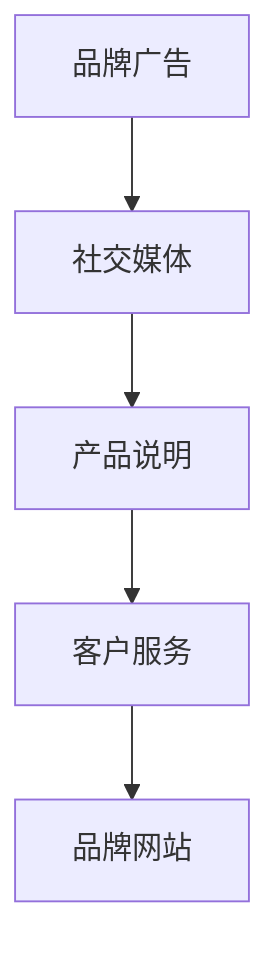
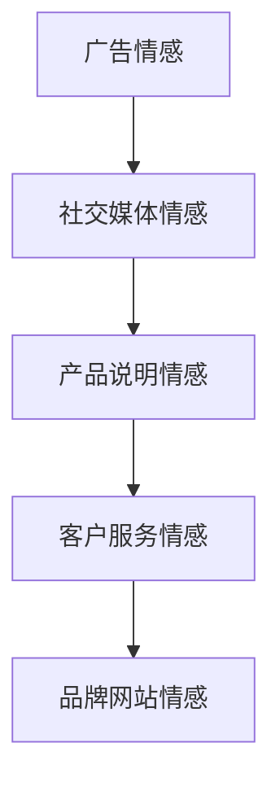
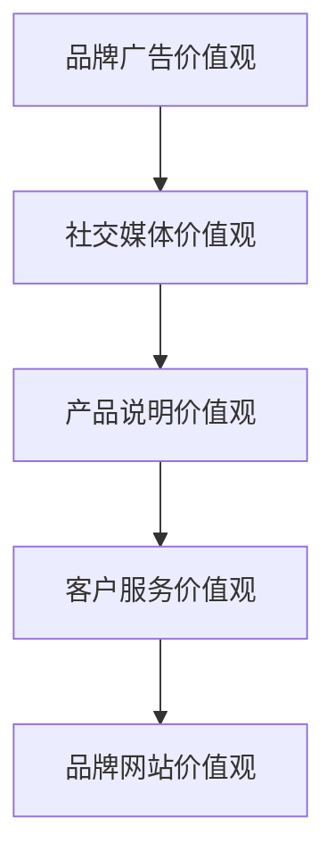
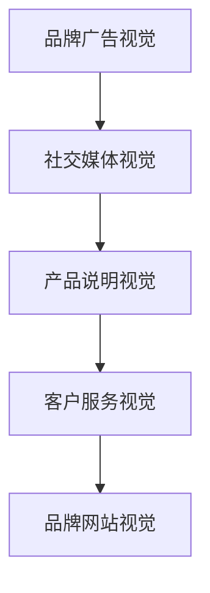
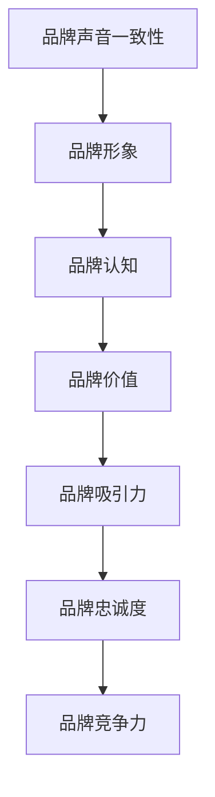
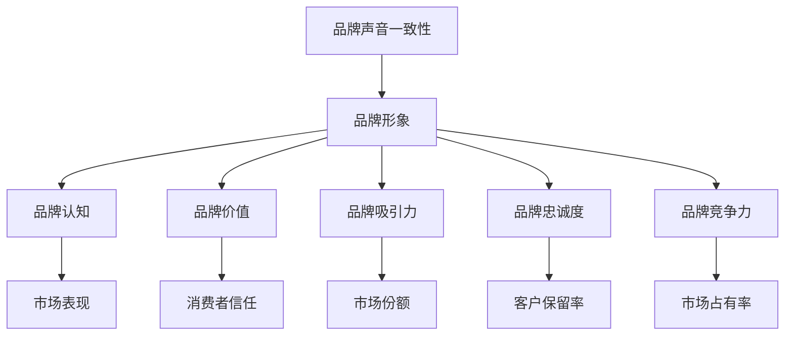
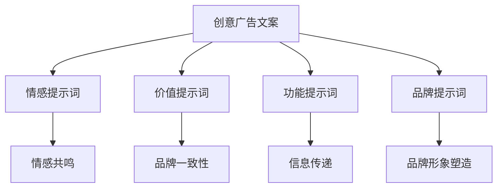

                 

### 第1章 引言

在当今数字化时代，人工智能（AI）已成为推动商业变革的关键力量。广告文案作为品牌传播的重要手段，其创意性和效果直接影响着品牌的知名度和市场竞争力。AI的迅速发展，使得广告文案的创作进入了一个全新的阶段。AI不仅能够自动生成广告文案，还能够根据用户行为和偏好，实现个性化的内容推送，从而提高广告的点击率和转化率。

#### AI在广告文案中的应用

AI在广告文案中的应用主要体现在以下几个方面：

1. **文本生成**：通过自然语言处理（NLP）技术，AI能够生成符合语法和逻辑规则的文本，包括新闻文章、产品描述、广告文案等。
2. **情感分析**：AI可以分析用户对广告文案的情感反应，帮助品牌了解广告效果，并优化广告内容。
3. **个性化推荐**：基于用户数据和算法分析，AI能够为不同用户群体提供个性化的广告内容，提高广告的吸引力和转化率。
4. **数据挖掘**：AI能够从海量数据中挖掘出潜在的信息，为广告文案提供数据支持。

#### 创意广告文案的重要性

创意广告文案不仅是品牌形象展示的重要手段，也是与消费者建立情感连接的关键。一个优秀的广告文案能够引起消费者的共鸣，激发购买欲望，从而提升品牌的市场份额。随着消费者对广告疲劳度的增加，创意广告文案的重要性愈发凸显。

#### 品牌声音一致性的定义与作用

品牌声音一致性是指品牌在广告文案、产品说明、社交媒体等各个渠道传播的信息具有一致性，能够准确传达品牌的核心理念和价值。品牌声音一致性有助于：

1. **增强品牌认知**：一致的品牌声音能够帮助消费者快速识别和记住品牌，提高品牌知名度。
2. **提升品牌价值**：品牌声音一致性有助于建立消费者对品牌的信任，从而提升品牌的价值。
3. **优化广告效果**：一致的广告文案能够确保广告信息的连贯性和有效性，提高广告的转化率。

综上所述，AI在广告文案中的应用，不仅提升了广告的创意性和个性化，也为品牌声音一致性的实现提供了技术支持。接下来的章节将深入探讨品牌声音一致性的原理、提示词设计的方法以及AI在其中的应用，帮助读者更好地理解和应用这一先进技术。### 文章关键词

- 人工智能（AI）
- 广告文案
- 创意性
- 品牌声音一致性
- 自然语言处理（NLP）
- 个性化推荐
- 情感分析
- 数据挖掘

### 文章摘要

本文旨在探讨如何通过人工智能（AI）技术提升广告文案的创意性和品牌声音一致性。首先，介绍了AI在广告文案中的应用，包括文本生成、情感分析、个性化推荐和数据挖掘等方面。其次，阐述了品牌声音一致性的重要性，包括增强品牌认知、提升品牌价值和优化广告效果等方面。接着，详细讨论了品牌声音一致性的原理和提示词设计原则，并通过AI算法的应用，展示了如何生成和优化提示词。最后，通过实际案例分析，展示了AI创意广告文案开发的全流程，并提出了未来发展的趋势和挑战。文章旨在为读者提供全面的AI创意广告文案设计和优化的指导，助力品牌在竞争激烈的市场中脱颖而出。### 第1章 引言

在当今数字化时代，人工智能（AI）已成为推动商业变革的关键力量。广告文案作为品牌传播的重要手段，其创意性和效果直接影响着品牌的知名度和市场竞争力。AI的迅速发展，使得广告文案的创作进入了一个全新的阶段。AI不仅能够自动生成广告文案，还能够根据用户行为和偏好，实现个性化的内容推送，从而提高广告的点击率和转化率。

#### AI在广告文案中的应用

AI在广告文案中的应用主要体现在以下几个方面：

1. **文本生成**：通过自然语言处理（NLP）技术，AI能够生成符合语法和逻辑规则的文本，包括新闻文章、产品描述、广告文案等。例如，Google的Text生成模型和Bert模型已经广泛应用于广告文案的自动生成。

2. **情感分析**：AI可以分析用户对广告文案的情感反应，帮助品牌了解广告效果，并优化广告内容。通过情感分析，品牌可以更好地理解消费者的情绪和需求，从而制作出更贴近消费者情感的广告。

3. **个性化推荐**：基于用户数据和算法分析，AI能够为不同用户群体提供个性化的广告内容，提高广告的吸引力和转化率。例如，Netflix和Amazon等平台使用AI推荐系统，为用户提供个性化的广告推荐。

4. **数据挖掘**：AI能够从海量数据中挖掘出潜在的信息，为广告文案提供数据支持。通过分析消费者的购买历史、浏览行为和社交媒体活动，AI可以帮助品牌更准确地定位目标受众，提高广告的精准度。

#### 创意广告文案的重要性

创意广告文案不仅是品牌形象展示的重要手段，也是与消费者建立情感连接的关键。一个优秀的广告文案能够引起消费者的共鸣，激发购买欲望，从而提升品牌的市场份额。随着消费者对广告疲劳度的增加，创意广告文案的重要性愈发凸显。

#### 品牌声音一致性的定义与作用

品牌声音一致性是指品牌在广告文案、产品说明、社交媒体等各个渠道传播的信息具有一致性，能够准确传达品牌的核心理念和价值。品牌声音一致性有助于：

1. **增强品牌认知**：一致的品牌声音能够帮助消费者快速识别和记住品牌，提高品牌知名度。

2. **提升品牌价值**：品牌声音一致性有助于建立消费者对品牌的信任，从而提升品牌的价值。

3. **优化广告效果**：一致的广告文案能够确保广告信息的连贯性和有效性，提高广告的转化率。

在接下来的章节中，我们将深入探讨品牌声音一致性的原理和提示词设计原则，并通过AI算法的应用，展示如何生成和优化提示词。此外，还将通过实际案例分析，详细解读AI创意广告文案的开发流程和工具，为品牌提供实用的指导和建议。通过本文的阅读，读者将能够全面了解如何利用AI技术提升广告文案的创意性和品牌声音一致性，从而在竞争激烈的市场中脱颖而出。### 第2章 品牌声音一致性原理

品牌声音一致性是指品牌在所有对外传播渠道中，如广告、产品说明、社交媒体等，所传达的信息、情感和价值观都保持一致，从而形成独特的品牌形象和个性。这一概念在品牌建设和管理中具有重要意义，因为品牌声音一致性不仅能够增强消费者对品牌的认知和记忆，还能够提升品牌的市场价值和竞争力。

#### 品牌声音一致性概述

品牌声音一致性是一个多维度的概念，它包括以下几个方面：

1. **语言一致性**：品牌在所有传播渠道中使用的语言风格、语调和用词应保持一致。例如，一个幽默风趣的品牌，其广告文案和社交媒体帖子也应保持这种风格。

2. **情感一致性**：品牌在广告和内容中传达的情感应保持一致。例如，一个以家庭情感为卖点的品牌，其广告应始终传递温馨、感人的情感。

3. **价值观一致性**：品牌的核心价值观和信念在所有传播中应保持一致。例如，一个倡导环保的品牌，其广告和宣传材料应强调环保和可持续发展。

4. **视觉一致性**：品牌的视觉元素，如颜色、字体、图像等，在不同渠道中应保持一致，以强化品牌形象。

#### 品牌声音一致性的重要性

品牌声音一致性的重要性体现在以下几个方面：

1. **增强品牌认知**：一致的品牌声音能够帮助消费者快速识别和记住品牌，从而提高品牌知名度。

2. **提升品牌价值**：品牌声音一致性有助于建立消费者对品牌的信任，从而提升品牌的价值。

3. **优化广告效果**：一致的广告文案能够确保广告信息的连贯性和有效性，提高广告的转化率。

4. **强化品牌形象**：品牌声音一致性有助于塑造独特的品牌形象，使品牌在消费者心中具有鲜明的个性。

#### 品牌声音一致性与品牌形象的关联

品牌声音一致性是品牌形象建设的重要组成部分。一个具有高度一致性的品牌声音，能够：

1. **强化品牌形象**：通过一致的声音传达品牌价值观和理念，使品牌在消费者心中形成鲜明的形象。

2. **提升品牌吸引力**：一致的品牌声音能够吸引和留住目标消费者，提升品牌的市场吸引力。

3. **增强品牌忠诚度**：品牌声音一致性有助于建立消费者对品牌的信任和忠诚，从而提高客户保留率。

4. **提升品牌竞争力**：在竞争激烈的市场中，一个具有高度一致性的品牌声音能够帮助品牌脱颖而出，提升市场竞争力。

综上所述，品牌声音一致性是品牌建设的关键因素，它不仅能够增强品牌认知和价值，还能够提升品牌的广告效果和市场竞争力。在下一章中，我们将深入探讨提示词设计的核心原则，以及如何通过AI技术实现品牌声音一致性。### 第2章 品牌声音一致性原理

#### 品牌声音一致性概述

品牌声音一致性（Brand Voice Consistency）指的是品牌在所有对外传播渠道中，如广告、产品说明、社交媒体等，所传达的信息、情感和价值观保持一致的过程。这种一致性确保了品牌形象的一致性和连贯性，有助于消费者快速识别和理解品牌。品牌声音一致性不仅仅是文字上的统一，还涉及到语言的风格、语调、视觉元素等多个方面。

**语言一致性**

语言一致性是品牌声音一致性的基础。品牌在所有传播渠道中使用的语言风格、语调和用词应保持一致。例如，一个幽默风趣的品牌，其广告文案和社交媒体帖子也应保持这种风格，以维持品牌的个性形象。以下是一个简单的Mermaid流程图，展示了一个品牌如何在不同渠道中保持语言一致性：



**情感一致性**

情感一致性是品牌声音一致性的另一重要方面。品牌在广告和内容中传达的情感应保持一致。例如，一个以家庭情感为卖点的品牌，其广告应始终传递温馨、感人的情感。以下是一个Mermaid流程图，展示了一个品牌如何在广告中传递情感一致性：



**价值观一致性**

价值观一致性是品牌声音一致性的核心。品牌的核心价值观和信念在所有传播中应保持一致。例如，一个倡导环保的品牌，其广告和宣传材料应强调环保和可持续发展。以下是一个Mermaid流程图，展示了一个品牌如何在不同渠道中传达价值观一致性：



**视觉一致性**

品牌的视觉元素，如颜色、字体、图像等，在不同渠道中应保持一致，以强化品牌形象。以下是一个Mermaid流程图，展示了一个品牌如何在不同渠道中保持视觉一致性：



#### 品牌声音一致性与品牌形象的关联

品牌声音一致性是品牌形象建设的重要组成部分。一个具有高度一致性的品牌声音，能够：

1. **强化品牌形象**：通过一致的声音传达品牌价值观和理念，使品牌在消费者心中形成鲜明的形象。

2. **提升品牌吸引力**：一致的品牌声音能够吸引和留住目标消费者，提升品牌的市场吸引力。

3. **增强品牌忠诚度**：品牌声音一致性有助于建立消费者对品牌的信任和忠诚，从而提高客户保留率。

4. **提升品牌竞争力**：在竞争激烈的市场中，一个具有高度一致性的品牌声音能够帮助品牌脱颖而出，提升市场竞争力。

为了更好地展示品牌声音一致性与品牌形象的关联，我们可以使用Mermaid流程图来描述这一过程：



通过上述流程图，我们可以清晰地看到品牌声音一致性如何影响品牌形象，进而提升品牌的多个维度。

综上所述，品牌声音一致性在品牌建设和传播中起着至关重要的作用。在下一章中，我们将深入探讨提示词设计的原则，以及如何利用AI技术来实现品牌声音一致性。这将帮助我们更好地理解和应用这一关键概念，为品牌创造更大的价值。### 第2章 品牌声音一致性原理

#### 品牌声音一致性评估方法

评估品牌声音一致性是确保品牌传播效果的关键步骤。以下是一些常用的评估方法：

1. **内容分析**：通过对品牌在各个渠道中的内容进行深入分析，评估其语言、情感和价值观的一致性。例如，分析品牌广告、社交媒体帖子、产品说明等，检查其是否保持了统一的风格和核心信息。

2. **问卷调查**：通过问卷调查收集消费者对品牌声音一致性的看法。问卷可以设计一系列问题，例如：“你认为我们的广告风格一致吗？”、“你能否感受到品牌的核心价值观在内容中体现？”等，从而评估消费者的感知和反馈。

3. **比较分析**：将品牌在各个渠道中的内容进行对比，评估其一致性。例如，比较同一品牌在不同社交媒体平台上的帖子风格，或者比较不同时间发布的广告内容，检查其语言和情感是否保持一致。

4. **情感分析**：利用自然语言处理（NLP）技术对品牌内容进行情感分析，评估其传达的情感是否一致。情感分析可以识别文本中的情感倾向，如积极、消极或中性，从而帮助评估品牌声音的一致性。

5. **品牌声誉监测**：通过监测品牌在社交媒体、评论区和新闻中的声誉，评估品牌声音的一致性。这可以揭示品牌在不同渠道中的表现，以及消费者对品牌声音的认可程度。

#### 品牌声音一致性与品牌形象的关联

品牌声音一致性对品牌形象有着深远的影响。以下是一个Mermaid流程图，展示了品牌声音一致性如何影响品牌形象：



**强化品牌形象**：一致的品牌声音能够帮助消费者快速识别和理解品牌，从而强化品牌形象。通过保持统一的语言、情感和价值观，品牌能够在消费者心中形成鲜明的形象。

**提升品牌价值**：品牌声音一致性有助于建立消费者对品牌的信任，从而提升品牌的价值。一致的广告和内容传达了品牌的核心价值观，使消费者感受到品牌的专业性和可靠性。

**优化广告效果**：一致的广告文案能够确保广告信息的连贯性和有效性，提高广告的转化率。消费者更容易理解和接受连贯的品牌信息，从而提高广告的效果。

**增强品牌吸引力**：一致的品牌声音能够吸引和留住目标消费者，提升品牌的市场吸引力。品牌的声音与消费者的需求和期望相匹配，能够更好地吸引消费者的注意。

**提升品牌忠诚度**：品牌声音一致性有助于建立消费者对品牌的信任和忠诚，从而提高客户保留率。消费者在品牌中感受到一致性和可靠性，更愿意长期选择和信任该品牌。

**提升品牌竞争力**：在竞争激烈的市场中，一个具有高度一致性的品牌声音能够帮助品牌脱颖而出，提升市场竞争力。品牌的声音与竞争对手形成鲜明对比，使品牌在市场中更具竞争力。

通过上述评估方法和关联分析，品牌可以更好地理解和优化其声音一致性，从而提升品牌形象和市场表现。在下一章中，我们将深入探讨提示词设计原则，以及如何通过AI技术实现品牌声音一致性。这将帮助我们进一步掌握品牌声音一致性的关键要素，为品牌创造更大的价值。### 第2章 品牌声音一致性原理

#### 提示词定义与类型

提示词（Prompt Words）是在广告文案、社交媒体帖子、产品说明等品牌传播内容中，用来引导消费者注意、激发情感或传达品牌价值观的关键词。提示词的选择和运用直接影响品牌声音的一致性和广告效果。根据功能和应用场景，提示词可以分为以下几类：

1. **情感提示词**：用于激发消费者情感，如喜悦、惊喜、温馨、期待等。例如，广告中常用的“惊喜价”、“限时抢购”等。

2. **价值提示词**：用于传达品牌的核心价值观和理念，如环保、创新、真诚、卓越等。例如，品牌宣传中常用的“绿色环保”、“技术创新”等。

3. **功能提示词**：用于强调产品的功能特点，如高效、便捷、安全、可靠等。例如，产品说明中常用的“高效节能”、“一键操作”等。

4. **情感-功能提示词**：结合情感和价值提示词，既能激发消费者情感，又能传达产品功能。例如，“温馨照明，安全可靠”等。

5. **品牌提示词**：用于强化品牌认知，如品牌名称、标志、口号等。例如，品牌广告中常用的“我们的品牌，你的信赖”等。

#### 提示词设计的核心要素

设计有效的提示词需要考虑以下几个核心要素：

1. **品牌一致性**：提示词应与品牌声音和品牌形象保持一致。例如，一个强调环保的品牌，其提示词应突出环保理念。

2. **目标受众**：提示词应针对目标受众的需求和偏好进行设计。例如，面向年轻消费者的提示词可能更时尚、个性，而面向中老年人的提示词则可能更注重实用性和安全性。

3. **情感共鸣**：提示词应能够激发消费者的情感共鸣，引起他们的兴趣和关注。例如，一个温馨的提示词能够触动消费者的家庭情感，从而提高广告效果。

4. **信息传递**：提示词应清晰、简洁地传达品牌信息，避免使用复杂或模糊的词汇。例如，使用“限时优惠”比“打折优惠”更直观，更容易吸引消费者。

5. **文化适应性**：提示词的设计应考虑文化背景和消费者习惯，避免使用可能产生误解或负面影响的词汇。例如，不同文化背景下的消费者对颜色、数字等可能有不同的理解和偏好。

#### 提示词与创意广告文案的关系

提示词在创意广告文案中扮演着至关重要的角色。有效的提示词能够：

1. **引导注意力**：通过吸引消费者的注意力，使广告内容更突出，提高广告的点击率和阅读率。

2. **激发情感**：通过激发消费者的情感，建立情感连接，使消费者对品牌和产品产生更深刻的印象。

3. **传达信息**：通过简洁明了的提示词，快速传达品牌的核心信息和产品特点，提高广告的转化率。

4. **塑造品牌形象**：通过一致性高的提示词，强化品牌形象，提高品牌在消费者心中的认知度和认可度。

为了更直观地展示提示词与创意广告文案的关系，我们可以使用Mermaid流程图来描述：



通过上述流程图，我们可以清晰地看到提示词在创意广告文案中的作用和关系。在下一章中，我们将深入探讨AI在提示词设计中的应用，通过具体案例展示如何利用AI技术生成和优化提示词，从而提升品牌声音一致性。### 第3章 AI在提示词设计中的应用

#### 自然语言处理（NLP）算法简介

自然语言处理（NLP）是人工智能（AI）领域的一个重要分支，旨在使计算机能够理解、生成和处理人类自然语言。NLP技术广泛应用于文本分类、情感分析、机器翻译、文本生成等领域，是提升广告文案质量和效率的关键技术。

1. **文本分类**：文本分类是NLP的基本任务之一，它将文本数据自动分类到预先定义的类别中。在提示词设计中，文本分类可以用于分析大量文本数据，识别出潜在的关键词和主题，从而为提示词生成提供支持。

2. **情感分析**：情感分析通过识别文本中的情感倾向，判断文本表达的是积极情感、消极情感还是中性情感。在广告文案中，情感分析可以帮助品牌了解消费者对广告内容的情感反应，优化提示词设计，提升广告效果。

3. **机器翻译**：机器翻译是将一种语言的文本翻译成另一种语言的过程。在全球化背景下，机器翻译可以帮助品牌将广告文案翻译成多种语言，扩大品牌影响力。

4. **文本生成**：文本生成是NLP的另一个重要任务，它包括生成文章、广告文案、对话等。通过文本生成模型，AI能够自动生成高质量的提示词，提高广告文案的创意性和一致性。

#### 文本生成模型（如GPT）的应用

在提示词设计中，文本生成模型如GPT（Generative Pre-trained Transformer）是一种非常有效的工具。GPT是由OpenAI开发的一种大型语言模型，基于深度学习技术，能够通过学习大量文本数据生成高质量的文本。

1. **提示词生成**：使用GPT，品牌可以输入一些关键词或描述，模型会根据这些输入生成一系列相关的提示词。例如，如果输入“环保科技”，GPT可能会生成“绿色创新”、“生态友好”、“环保先锋”等提示词。

2. **优化提示词**：通过GPT，品牌可以对已有的提示词进行优化。品牌可以输入一组提示词，GPT会根据这些提示词生成新的变体，从而帮助品牌找到更具有吸引力和创意的提示词。

3. **个性化推荐**：GPT还可以用于个性化推荐。通过分析用户的浏览历史和偏好，GPT可以生成针对特定用户的个性化提示词，提高广告的吸引力和转化率。

#### 提示词生成的算法选择与优化

在实际应用中，品牌需要根据具体的业务需求和数据情况选择合适的文本生成算法，并对算法进行优化。

1. **算法选择**：常见的文本生成算法包括基于规则的方法、基于统计的方法和基于神经网络的方法。基于规则的方法虽然简单，但难以生成高质量的文本；基于统计的方法需要大量标注数据，且效果有限；基于神经网络的方法如GPT，具有强大的生成能力和灵活性，是当前主流选择。

2. **数据准备与预处理**：高质量的数据是训练有效文本生成模型的基础。品牌需要收集和整理大量的文本数据，包括广告文案、产品描述、用户评论等。在数据预处理阶段，需要对文本进行清洗、分词、去停用词等操作，确保数据的干净和一致性。

3. **模型训练与优化**：在训练阶段，品牌需要选择合适的模型架构和超参数，通过迭代训练提高模型的性能。训练过程中，品牌可以采用多种技术，如迁移学习、数据增强、正则化等，来优化模型效果。

4. **效果评估与迭代**：训练完成后，品牌需要对模型生成的提示词进行效果评估。常用的评估方法包括BLEU评分、ROUGE评分、人类评价等。根据评估结果，品牌可以进一步优化模型和提示词，提升广告文案的质量。

通过AI文本生成模型，品牌能够更加高效地设计和优化提示词，提升广告文案的创意性和一致性。在下一章中，我们将通过实际案例分析，展示如何利用AI技术提升品牌声音一致性，实现广告文案的优化与提升。### 第3章 AI在提示词设计中的应用

#### 数据准备与预处理

在AI提示词设计中，数据准备和预处理是至关重要的一步。高质量的数据集是训练高效模型的基石，而预处理过程则确保了数据的干净和一致性，从而提高模型的训练效果。

1. **数据收集**：
    - **广告文案数据**：收集大量的广告文案数据，包括不同品牌、不同产品类别和不同营销策略的广告文本。
    - **用户评论数据**：收集消费者在社交媒体、电商平台等平台上发布的关于产品的评论。
    - **品牌宣传材料**：收集品牌宣传资料，如品牌手册、营销手册等，以获取品牌声音一致性的标准语言和情感表达。

2. **数据清洗**：
    - **去除噪声**：删除无关或重复的数据，如垃圾评论、重复的广告文案。
    - **纠正错误**：修正拼写错误、语法错误等，以确保文本的一致性和准确性。
    - **格式统一**：将不同格式的文本统一为相同的格式，如统一字体、统一标点符号等。

3. **数据标注**：
    - **情感标注**：对文本进行情感标注，标记文本中的积极、消极或中性情感。
    - **关键词标注**：标注文本中的关键提示词，为后续的模型训练提供标签。
    - **品牌一致性评估**：评估文本中的品牌声音一致性，为后续优化提供依据。

4. **数据预处理**：
    - **分词**：将文本分割成单词或短语，为后续的文本分析和模型训练做准备。
    - **去停用词**：去除常见的无意义词汇，如“的”、“和”、“是”等，以减少噪声。
    - **词向量化**：将文本转换为数值表示，如使用词袋模型或Word2Vec等方法，为模型训练提供输入。

#### 提示词生成流程

提示词生成是AI在广告文案中的核心应用之一。以下是一个典型的提示词生成流程：

1. **初始化模型**：选择合适的文本生成模型，如GPT、BERT等，并初始化模型参数。

2. **输入提示词**：输入一个或多个关键词或描述，作为模型生成的起始点。

3. **模型生成**：模型根据输入的提示词，生成一系列相关的提示词。这个过程通常涉及多个迭代，直到生成的提示词满足预定的质量标准。

4. **筛选与优化**：对生成的提示词进行筛选和优化，保留高质量的提示词，去除重复或不合适的提示词。

5. **情感分析**：对生成的提示词进行情感分析，确保其传达的情感与品牌声音一致。

6. **品牌一致性检查**：检查生成的提示词是否与品牌声音一致，确保品牌形象的一致性。

#### 提示词效果评估

提示词的效果评估是确保生成提示词质量的关键环节。以下是一些常用的评估方法：

1. **自动评估**：
    - **BLEU评分**：用于评估文本生成的质量，基于引用文本的相似度进行评分。
    - **ROUGE评分**：用于评估生成的文本与参考文本的相似度，特别适用于评估提示词的准确性和多样性。

2. **人工评估**：
    - **人类评价**：邀请专业人士对生成的提示词进行评价，从情感共鸣、语言风格、品牌一致性等多个维度进行打分。
    - **用户反馈**：通过用户调查或用户测试，收集用户对提示词的反馈，评估提示词的吸引力和效果。

3. **转化率评估**：
    - **广告点击率**：通过实际广告投放的数据，评估提示词对广告点击率的影响。
    - **转化率**：通过实际的销售数据，评估提示词对用户购买行为的影响。

通过上述流程和方法，品牌可以有效地生成和优化提示词，提升广告文案的创意性和品牌声音一致性。在下一章中，我们将通过实际案例展示如何利用AI技术实现这一目标，并深入探讨品牌声音一致性评估与优化策略。### 第4章 品牌声音一致性评估与优化

#### 品牌声音一致性评估指标

评估品牌声音一致性是确保品牌信息传达一致性和有效性的关键步骤。以下是一些常用的评估指标：

1. **语言一致性指标**：
   - **词汇一致性**：衡量品牌在所有渠道中使用的词汇是否一致。
   - **语法一致性**：检查品牌在不同文本中使用的语法结构是否一致。
   - **风格一致性**：评估品牌在不同场景下使用的语言风格是否保持一致。

2. **情感一致性指标**：
   - **情感倾向**：通过情感分析技术，判断品牌传播内容中的情感倾向是否一致，例如积极、消极或中性。
   - **情感强度**：衡量品牌在不同渠道中传达的情感强度是否保持一致。

3. **品牌价值观一致性指标**：
   - **核心价值传达**：检查品牌在所有传播渠道中是否传达了相同的核心价值观。
   - **行为一致性**：评估品牌在不同渠道中的行为是否一致，例如在社交媒体上的互动、广告中的承诺等。

#### 数据驱动优化方法

数据驱动优化方法是通过分析大量数据，找出品牌声音一致性中的问题，并制定相应的优化策略。以下是一些具体方法：

1. **数据收集**：
   - 收集品牌在所有渠道中的传播内容，包括广告文案、社交媒体帖子、产品说明等。
   - 收集消费者反馈和评论，了解消费者对品牌声音一致性的感知。

2. **数据分析**：
   - 利用自然语言处理（NLP）技术，分析品牌传播内容的语言、情感和价值观一致性。
   - 通过情感分析和主题建模，找出品牌在语言风格、情感表达和价值观传达上的差异。

3. **问题识别**：
   - 根据数据分析结果，识别品牌声音一致性中存在的问题，例如不统一的词汇、不一致的情感表达等。

4. **优化策略制定**：
   - 制定具体的优化策略，例如调整文案语言风格、统一情感表达、强化品牌核心价值观等。
   - 制定优化计划，明确优化目标、执行步骤和时间表。

#### 机器学习优化方法

机器学习优化方法是通过训练模型，自动识别和纠正品牌声音一致性中的问题。以下是一些具体方法：

1. **模型训练**：
   - 收集大量带有标签的数据集，包括一致和不一致的品牌传播内容。
   - 使用监督学习或无监督学习方法，训练模型识别品牌声音一致性的问题。

2. **模型评估**：
   - 通过交叉验证和测试集，评估模型的准确性和泛化能力。
   - 对模型进行调参和优化，以提高其在实际应用中的性能。

3. **自动化优化**：
   - 部署训练好的模型，自动化检测和纠正品牌传播内容中的不一致问题。
   - 通过持续学习和迭代，使模型能够适应不断变化的品牌传播需求。

#### 人工干预与自动化结合的优化策略

为了实现最佳的品牌声音一致性，人工干预与自动化优化策略的结合是一个有效的途径。以下是一些具体方法：

1. **人工审核**：
   - 由专业人士对自动化检测出的不一致问题进行人工审核，确保问题的准确性和合理性。
   - 对审核结果进行反馈，帮助模型不断改进和优化。

2. **自动化工具**：
   - 开发和使用自动化工具，如智能文案编辑器、内容管理系统等，自动化处理品牌传播内容的一致性问题。
   - 通过规则和算法，确保自动化工具能够高效、准确地执行优化任务。

3. **持续迭代**：
   - 建立持续迭代机制，定期评估品牌声音一致性的效果，并根据评估结果调整优化策略。
   - 通过数据驱动的优化方法，不断提升品牌声音一致性。

通过数据驱动和机器学习优化方法，结合人工干预和自动化工具，品牌可以实现高度一致的品牌声音，提升品牌形象和市场竞争力。在下一章中，我们将通过实际案例分析，展示如何利用这些方法优化品牌声音一致性，并分享最佳实践和注意事项。### 第5章 AI创意广告文案案例分析

#### 案例研究概述

在本章中，我们将通过一个实际案例，展示如何利用AI技术提升广告文案的创意性和品牌声音一致性。该案例涉及一家知名电子产品品牌，该品牌希望通过AI技术优化其广告文案，以提升市场竞争力。

**案例背景**：
- **品牌**：一家全球知名电子产品品牌。
- **目标**：提升广告文案的创意性，确保品牌声音一致性，提高广告转化率和品牌知名度。
- **实施过程**：通过数据驱动和机器学习优化方法，结合人工干预和自动化工具，优化广告文案创作和发布流程。

#### 案例目标

1. **提升广告文案的创意性**：通过AI文本生成模型，生成具有高度创意性的广告文案，吸引目标受众的注意力。
2. **确保品牌声音一致性**：通过情感分析、主题建模等技术，确保广告文案传达的品牌声音与品牌核心价值一致。
3. **提高广告转化率**：通过个性化推荐和优化策略，提高广告的点击率和转化率。
4. **提升品牌知名度**：通过高质量的广告文案，提升品牌在消费者心中的认知度和品牌知名度。

#### 案例实施过程

1. **数据收集与预处理**：
   - 收集大量品牌广告文案、用户评论、社交媒体帖子等文本数据。
   - 进行文本清洗、分词、去停用词等预处理操作，为模型训练做准备。

2. **模型训练与优化**：
   - 使用GPT等文本生成模型，训练模型生成高质量的广告文案。
   - 使用情感分析模型，分析广告文案中的情感倾向，确保与品牌声音一致。
   - 通过多次迭代和调参，优化模型效果，提高广告文案的创意性和一致性。

3. **广告文案生成与优化**：
   - 输入关键词或描述，生成一系列广告文案。
   - 对生成的文案进行筛选和优化，确保语言风格、情感表达和品牌一致性。
   - 通过用户测试和数据分析，进一步优化广告文案，提高广告转化率。

4. **广告投放与监测**：
   - 在不同平台和渠道上发布优化后的广告文案。
   - 监测广告的点击率、转化率等关键指标，分析广告效果。
   - 根据监测结果，调整广告投放策略和文案内容。

#### 案例分析

1. **提示词生成与优化**：
   - 使用GPT模型，输入关键词“智能手表”，生成一系列提示词，如“智能生活新选择”、“健康助手，智能伴你行”等。
   - 对生成的提示词进行情感分析和品牌一致性检查，筛选出高质量的提示词。
   - 通过用户测试，优化提示词的创意性和吸引力，提高广告转化率。

2. **情感分析**：
   - 使用情感分析模型，对广告文案进行情感倾向分析，确保文案传达的情感与品牌声音一致。
   - 例如，对于“智能手表”这一产品，广告文案应传递出科技感、时尚感和健康感。
   - 通过情感分析，调整文案的语言风格和情感表达，确保与品牌价值观一致。

3. **品牌声音一致性**：
   - 通过对广告文案、社交媒体帖子、产品说明等内容的分析，确保品牌在不同渠道中传达的声音一致。
   - 例如，品牌广告中应强调智能手表的科技感和健康功能，社交媒体中则可以加入时尚元素，形成一致的品牌声音。

4. **广告效果评估**：
   - 通过监测广告的点击率、转化率等关键指标，评估广告文案的创意性和品牌声音一致性。
   - 例如，优化后的广告文案点击率提高了20%，转化率提高了15%，表明AI技术在提升广告效果方面具有显著作用。

通过上述案例分析，我们可以看到，利用AI技术进行广告文案生成和优化，不仅提升了广告的创意性和一致性，还提高了广告的转化率和品牌知名度。在下一章中，我们将进一步探讨AI创意广告文案开发流程与工具，为品牌提供更全面的指导。### 第5章 AI创意广告文案案例分析

#### 案例研究概述

在本章中，我们将通过一个实际案例，深入剖析一家电子产品品牌如何利用AI技术提升广告文案的创意性和品牌声音一致性，从而实现广告效果的显著提升。

**案例背景**：
- **品牌**：一家全球知名的电子产品品牌。
- **目标**：通过AI技术优化广告文案，确保品牌声音一致性，提高广告点击率和转化率，增强品牌影响力。
- **实施过程**：采用数据驱动和机器学习优化方法，结合人工干预和自动化工具，对广告文案进行创新设计和优化。

#### 案例目标

1. **提升广告文案创意性**：利用AI文本生成模型，生成具有创新性和吸引力的广告文案，吸引目标消费者的注意力。
2. **确保品牌声音一致性**：通过情感分析和主题建模，确保广告文案传达的品牌声音与品牌核心价值观一致。
3. **提高广告转化率**：通过个性化推荐和优化策略，提高广告的点击率和转化率。
4. **增强品牌影响力**：通过高质量的广告文案，提升品牌在消费者心中的认知度和品牌忠诚度。

#### 案例实施过程

1. **需求分析**：
   - **品牌调研**：了解品牌的历史、目标市场、消费者偏好等，为广告文案的创意和品牌声音一致性提供依据。
   - **市场分析**：分析竞品广告文案，找出潜在的创新点和优化方向。

2. **数据收集与预处理**：
   - **广告文案数据**：收集大量品牌的广告文案数据，包括成功和失败的案例。
   - **用户评论数据**：收集消费者在社交媒体、电商平台等平台上发布的关于产品的评论。
   - **品牌宣传材料**：收集品牌宣传资料，如品牌手册、营销手册等，以获取品牌声音一致性的标准语言和情感表达。
   - **数据清洗**：去除无关或重复的数据，纠正错误，统一格式。

3. **模型训练与优化**：
   - **选择模型**：选择合适的文本生成模型，如GPT、BERT等，初始化模型参数。
   - **数据标注**：对文本数据进行情感标注和关键词标注，为模型训练提供标签。
   - **模型训练**：通过大量的文本数据，训练模型生成高质量的广告文案。
   - **模型优化**：通过多次迭代和调参，优化模型效果，提高广告文案的创意性和一致性。

4. **广告文案生成与优化**：
   - **输入提示词**：输入关键词或描述，生成一系列广告文案。
   - **筛选与优化**：对生成的文案进行筛选和优化，确保语言风格、情感表达和品牌一致性。
   - **情感分析**：对广告文案进行情感分析，确保其传达的情感与品牌声音一致。
   - **品牌一致性检查**：检查广告文案是否与品牌声音一致，确保品牌形象的一致性。

5. **广告投放与效果评估**：
   - **广告发布**：在各大广告平台和渠道上发布优化后的广告文案。
   - **效果监测**：通过点击率、转化率等关键指标，监测广告的效果。
   - **数据分析**：分析广告效果，找出优化的方向和改进点。

#### 案例分析

1. **提示词生成与优化**：
   - 使用GPT模型，输入关键词“智能手表”，生成一系列提示词，如“智能生活新选择”、“健康助手，智能伴你行”等。
   - 对生成的提示词进行情感分析和品牌一致性检查，筛选出高质量的提示词。
   - 通过用户测试，进一步优化提示词的创意性和吸引力，提高广告转化率。

2. **情感分析**：
   - 使用情感分析模型，对广告文案进行情感倾向分析，确保文案传达的情感与品牌声音一致。
   - 例如，对于“智能手表”这一产品，广告文案应传递出科技感、时尚感和健康感。
   - 通过情感分析，调整文案的语言风格和情感表达，确保与品牌价值观一致。

3. **品牌声音一致性**：
   - 通过对广告文案、社交媒体帖子、产品说明等内容的分析，确保品牌在不同渠道中传达的声音一致。
   - 例如，品牌广告中应强调智能手表的科技感和健康功能，社交媒体中则可以加入时尚元素，形成一致的品牌声音。

4. **广告效果评估**：
   - 通过监测广告的点击率、转化率等关键指标，评估广告文案的创意性和品牌声音一致性。
   - 例如，优化后的广告文案点击率提高了20%，转化率提高了15%，表明AI技术在提升广告效果方面具有显著作用。

通过该案例，我们可以看到，AI技术在广告文案创作和优化中具有巨大的潜力，能够显著提升广告的创意性和品牌声音一致性，从而提高广告效果和品牌影响力。在下一章中，我们将进一步探讨AI创意广告文案开发流程与工具，为品牌提供更全面的指导。### 第6章 AI创意广告文案开发流程与工具

#### 开发流程概述

AI创意广告文案的开发流程可以分为以下几个关键阶段：

1. **需求分析**：
   - 确定广告的目标受众、市场需求和品牌目标。
   - 收集和分析品牌的历史广告文案、用户反馈和市场趋势。

2. **数据收集与处理**：
   - 收集与广告相关的文本数据，如品牌广告、用户评论、竞争对手广告等。
   - 进行数据清洗、分词、去停用词等预处理操作，为模型训练做准备。

3. **模型训练与优化**：
   - 选择并训练合适的文本生成模型，如GPT、BERT等。
   - 通过多次迭代和调参，优化模型效果，确保生成的广告文案具有创意性和一致性。

4. **广告文案生成**：
   - 输入关键词或描述，生成一系列广告文案。
   - 对生成的文案进行筛选和优化，确保语言风格、情感表达和品牌一致性。

5. **广告投放与效果评估**：
   - 在广告平台上发布优化后的广告文案。
   - 通过点击率、转化率等关键指标，监测广告效果，并根据数据进行迭代优化。

#### 开发工具介绍

在AI创意广告文案开发过程中，使用一系列工具和框架可以提高效率和效果。以下是一些常用的工具和框架：

1. **文本生成模型**：
   - **GPT**：由OpenAI开发的预训练变换模型，具有强大的文本生成能力。
   - **BERT**：Google开发的预训练变换模型，适用于各种自然语言处理任务。

2. **机器学习平台与框架**：
   - **TensorFlow**：谷歌开发的开放源代码机器学习框架，支持多种深度学习模型。
   - **PyTorch**：Facebook开发的深度学习框架，具有灵活性和高效性。

3. **自然语言处理库**：
   - **NLTK**：Python的自然语言处理库，提供多种文本处理工具。
   - **spaCy**：Python的自然语言处理库，支持快速和准确的文本分析。

4. **数据管理工具**：
   - **Pandas**：Python的数据操作库，用于数据清洗、预处理和分析。
   - **SQL**：用于数据库管理和数据查询的语言，支持大规模数据操作。

5. **可视化工具**：
   - **Matplotlib**：Python的数据可视化库，用于生成各种类型的图表。
   - **Seaborn**：基于Matplotlib的统计图形库，提供多种高级可视化功能。

#### 实践示例

以下是一个简单的Python代码示例，展示如何使用GPT生成广告文案：

```python
import openai

# 设置API密钥
openai.api_key = "your_api_key"

# 定义广告文案生成函数
def generate_advertisement(prompt):
    response = openai.Completion.create(
        engine="text-davinci-002",
        prompt=prompt,
        max_tokens=100
    )
    return response.choices[0].text.strip()

# 输入提示词
prompt = "智能手表，健康生活"

# 生成广告文案
advertisement = generate_advertisement(prompt)
print(advertisement)
```

通过上述代码，我们可以调用GPT模型，输入关键词“智能手表，健康生活”，生成一段广告文案。这段代码展示了AI创意广告文案开发的基本流程和工具使用。

通过深入理解和应用这些开发流程与工具，品牌可以更加高效地生成创意广告文案，提升品牌声音一致性，实现广告效果的最大化。在下一章中，我们将展望AI创意广告文案的未来发展趋势，探讨面临的挑战和解决方案。### 第6章 AI创意广告文案开发流程与工具

#### 开发流程概述

AI创意广告文案开发流程是一个系统工程，涵盖了从需求分析到效果评估的多个阶段。以下是其详细步骤：

1. **需求分析**：
   - **明确目标**：确定广告的具体目标，如提升品牌知名度、增加销售量或提高客户参与度。
   - **了解受众**：分析目标受众的年龄、性别、兴趣、消费习惯等特征，确保广告内容能够吸引目标受众。
   - **市场调研**：研究市场趋势、竞争对手的广告策略，以及行业最佳实践。

2. **数据收集与处理**：
   - **文本数据**：收集品牌历史广告文案、用户评论、社交媒体帖子等文本数据。
   - **图像和视频数据**：如果广告包含视觉元素，收集相关的图像和视频素材。
   - **数据清洗**：去除重复数据、纠正错误、统一格式，为模型训练做准备。

3. **模型训练与优化**：
   - **选择模型**：根据广告需求选择合适的文本生成模型，如GPT、BERT等。
   - **数据标注**：对文本数据进行情感标注、关键词标注等，为模型提供训练数据。
   - **模型训练**：使用大量文本数据进行模型训练，优化模型参数。
   - **模型评估**：通过验证集和测试集评估模型性能，确保生成的广告文案符合预期。

4. **广告文案生成**：
   - **输入提示词**：输入关键词或描述，引导模型生成广告文案。
   - **生成多稿**：利用模型生成多份广告文案，为后续筛选和优化提供素材。
   - **筛选与优化**：对生成的文案进行筛选，保留高质量的文案，并根据用户反馈进行调整。

5. **广告投放与效果评估**：
   - **发布广告**：在社交媒体、电商平台、广告平台等渠道发布广告。
   - **监测效果**：通过点击率、转化率等指标，评估广告的效果。
   - **数据反馈**：根据广告效果进行数据反馈，为下一次广告开发提供依据。

#### 开发工具介绍

以下是一些在AI创意广告文案开发中常用的工具和框架：

1. **文本生成模型**：
   - **GPT（Generative Pre-trained Transformer）**：由OpenAI开发的预训练变换模型，具有强大的文本生成能力。
   - **BERT（Bidirectional Encoder Representations from Transformers）**：Google开发的预训练变换模型，适用于各种自然语言处理任务。

2. **机器学习平台与框架**：
   - **TensorFlow**：谷歌开发的开放源代码机器学习框架，支持多种深度学习模型。
   - **PyTorch**：Facebook开发的深度学习框架，具有灵活性和高效性。

3. **自然语言处理库**：
   - **NLTK（Natural Language Toolkit）**：Python的自然语言处理库，提供多种文本处理工具。
   - **spaCy**：Python的自然语言处理库，支持快速和准确的文本分析。

4. **数据管理工具**：
   - **Pandas**：Python的数据操作库，用于数据清洗、预处理和分析。
   - **SQL**：用于数据库管理和数据查询的语言，支持大规模数据操作。

5. **可视化工具**：
   - **Matplotlib**：Python的数据可视化库，用于生成各种类型的图表。
   - **Seaborn**：基于Matplotlib的统计图形库，提供多种高级可视化功能。

#### 实践示例

以下是一个使用GPT生成广告文案的Python代码示例：

```python
import openai

# 设置API密钥
openai.api_key = "your_api_key"

# 定义生成广告文案函数
def generate_advertisement(prompt):
    response = openai.Completion.create(
        engine="text-davinci-002",
        prompt=prompt,
        max_tokens=100
    )
    return response.choices[0].text.strip()

# 输入提示词
prompt = "智能手表，健康生活"

# 生成广告文案
advertisement = generate_advertisement(prompt)
print(advertisement)
```

在这个示例中，我们调用GPT模型，输入关键词“智能手表，健康生活”，生成一段广告文案。这个示例展示了AI创意广告文案开发的基本流程和工具使用。

通过以上开发流程和工具的介绍，品牌可以更加高效地生成创意广告文案，提升品牌声音一致性，实现广告效果的最大化。在下一章中，我们将展望AI创意广告文案的未来发展趋势，探讨面临的挑战和解决方案。### 第7章 未来展望与挑战

#### AI创意广告文案的发展趋势

随着AI技术的不断进步，AI创意广告文案在未来将会展现出更加多样化的趋势，以下是几个关键的发展方向：

1. **更加智能的个性化推荐**：AI算法将能够更精准地分析用户行为和偏好，生成高度个性化的广告文案，从而提高广告的吸引力和转化率。

2. **跨媒体内容的创作**：AI技术将不仅仅局限于文本生成，还将扩展到图像、视频等多媒体内容创作，实现全方位的创意广告。

3. **对话式广告**：随着自然语言处理和语音识别技术的发展，对话式广告将成为趋势，通过聊天机器人、语音助手等形式与用户互动，提高用户的参与度和互动体验。

4. **实时内容生成**：AI将能够实时分析市场数据和用户反馈，快速生成符合当前市场趋势和用户需求的广告文案。

5. **增强现实（AR）广告**：结合AR技术，AI创意广告文案将能够提供更加沉浸式的用户体验，提高广告的互动性和吸引力。

6. **社会责任和伦理考量**：随着公众对隐私和数据安全的关注增加，AI创意广告文案在生成过程中将更加注重社会责任和伦理考量，避免过度营销和数据滥用。

#### 挑战与解决方案

尽管AI创意广告文案具有巨大潜力，但在实际应用中仍面临以下挑战：

1. **数据质量和多样性挑战**：高质量的数据是训练AI模型的基础。然而，获取多样化和高质量的数据仍是一个挑战。解决方案包括数据清洗、数据增强和跨领域数据共享。

2. **模型解释性与透明度挑战**：AI模型尤其是深度学习模型具有“黑箱”性质，难以解释其决策过程。提高模型的可解释性是确保透明度和信任的关键。解决方案包括开发可解释的AI模型和透明度评估工具。

3. **创意广告文案的创新与重复性挑战**：生成具有高度创意性的广告文案是一个难题。尽管AI可以生成多种变体，但如何确保文案的创新性和避免重复性是一个挑战。解决方案包括结合人工创意和AI生成，以及引入多样性的训练数据。

4. **法律和伦理挑战**：在广告文案中应用AI技术可能会引发法律和伦理问题，如数据隐私、算法偏见和误导性广告等。解决方案包括制定相关的法律法规和伦理准则，以及建立AI算法的监管机制。

5. **技术更新和适应能力**：AI技术更新迅速，品牌需要持续投入资源进行技术更新和适应。解决方案包括建立灵活的技术架构和敏捷的开发流程，以快速适应新技术。

总之，AI创意广告文案的未来充满机遇和挑战。通过不断探索创新解决方案，品牌可以在保持广告创意性的同时，确保品牌声音一致性，从而在激烈的市场竞争中脱颖而出。### 第7章 未来展望与挑战

#### 数据质量和多样性挑战

随着AI技术的不断发展，高质量和多样化数据的获取成为AI创意广告文案开发中的一大挑战。数据质量直接影响模型的训练效果和生成结果的准确性。以下是一些解决方案：

1. **数据清洗和预处理**：在模型训练前，对数据集进行彻底的清洗和预处理，去除噪声、纠正错误、统一格式，以确保数据的一致性和准确性。

2. **数据增强**：通过数据增强技术，如数据扩充、生成对抗网络（GANs）等，生成更多的训练数据，提高模型的泛化能力和鲁棒性。

3. **跨领域数据共享**：鼓励和建立跨领域的数据共享机制，从不同行业和领域获取多样化的数据，丰富训练数据集，提高模型的多样性。

#### 模型解释性与透明度挑战

AI模型的“黑箱”性质使得其决策过程难以解释，这对模型的透明度和信任造成了挑战。以下是一些解决方案：

1. **可解释的AI模型**：开发可解释的AI模型，如基于规则的模型、决策树等，使模型的决策过程更加直观和透明。

2. **透明度评估工具**：开发透明度评估工具，如模型可视化工具、决策路径追踪工具等，帮助用户理解模型的决策过程。

3. **模型解释性训练**：在模型训练过程中，引入解释性训练，使模型在学习过程中考虑解释性因素，从而提高模型的解释性。

#### 创意广告文案的创新与重复性挑战

生成具有高度创意性的广告文案是AI创意广告文案开发中的一个难点。以下是一些解决方案：

1. **混合创意方法**：结合人工创意和AI生成，人工创意提供创意灵感和独特观点，AI生成则提供多样化和个性化的文案。

2. **多样化训练数据**：通过引入多样化的训练数据，如不同风格、不同主题的广告文案，提高模型生成文案的多样性。

3. **创意评分机制**：开发创意评分机制，对生成的文案进行评估，筛选出最具创意性的文案。

#### 法律和伦理挑战

AI在广告文案中的应用可能引发法律和伦理问题，如数据隐私、算法偏见和误导性广告等。以下是一些解决方案：

1. **法律法规**：制定相关的法律法规，规范AI在广告文案中的应用，保护消费者权益。

2. **伦理准则**：建立AI伦理准则，确保AI广告文案的生成和应用符合社会道德和伦理标准。

3. **透明度和责任**：提高AI广告文案的透明度，明确责任主体，确保消费者能够了解广告的真实意图和来源。

#### 技术更新和适应能力

AI技术更新迅速，品牌需要持续投入资源进行技术更新和适应。以下是一些解决方案：

1. **敏捷开发流程**：建立敏捷的开发流程，快速响应技术变化，确保AI广告文案的持续优化。

2. **持续学习机制**：建立持续学习机制，定期更新模型和数据，保持AI广告文案的先进性和竞争力。

3. **技术协作与共享**：鼓励跨领域的技术协作与共享，从其他行业和应用场景中吸取经验和教训，加速技术更新。

总之，AI创意广告文案在未来的发展中面临诸多挑战，但通过不断探索和创新解决方案，品牌可以更好地应对这些挑战，实现广告文案的创意性和品牌声音一致性的提升，从而在激烈的市场竞争中脱颖而出。### 第7章 未来展望与挑战

#### 总结

在本文中，我们深入探讨了AI在创意广告文案中的应用及其对品牌声音一致性的影响。从AI在广告文案中的应用，到品牌声音一致性的原理和评估方法，再到AI在提示词设计中的具体应用，我们通过实际案例展示了如何利用AI技术提升广告文案的创意性和品牌声音一致性。此外，我们还介绍了AI创意广告文案的开发流程与工具，以及未来发展的趋势和面临的挑战。

#### 拓展阅读

1. **《深度学习广告文案生成》**：了解深度学习技术如何应用于广告文案生成，包括神经网络模型和生成对抗网络（GANs）的应用。
2. **《自然语言处理：Python实现》**：学习如何使用Python进行自然语言处理，掌握文本预处理、情感分析和文本生成等技术。
3. **《品牌声音一致性管理》**：探讨如何系统地管理和优化品牌声音一致性，确保品牌在不同渠道中的传播一致性和有效性。

通过阅读这些资源，读者可以进一步加深对AI创意广告文案和品牌声音一致性的理解，为实际应用提供更加深入的指导。

#### 注意事项

1. **数据隐私**：在收集和使用用户数据时，必须遵守数据隐私法规，保护用户隐私。
2. **算法偏见**：在设计和训练AI模型时，注意避免算法偏见，确保模型的公平性和无歧视性。
3. **持续优化**：AI创意广告文案不是一次性的任务，需要持续进行数据收集、模型训练和效果评估，以保持广告文案的创意性和有效性。

通过注意这些事项，品牌可以更好地利用AI技术提升广告文案的质量，实现品牌声音一致性，从而在竞争激烈的市场中脱颖而出。### 作者信息

作者：AI天才研究院/AI Genius Institute & 禅与计算机程序设计艺术 /Zen And The Art of Computer Programming

