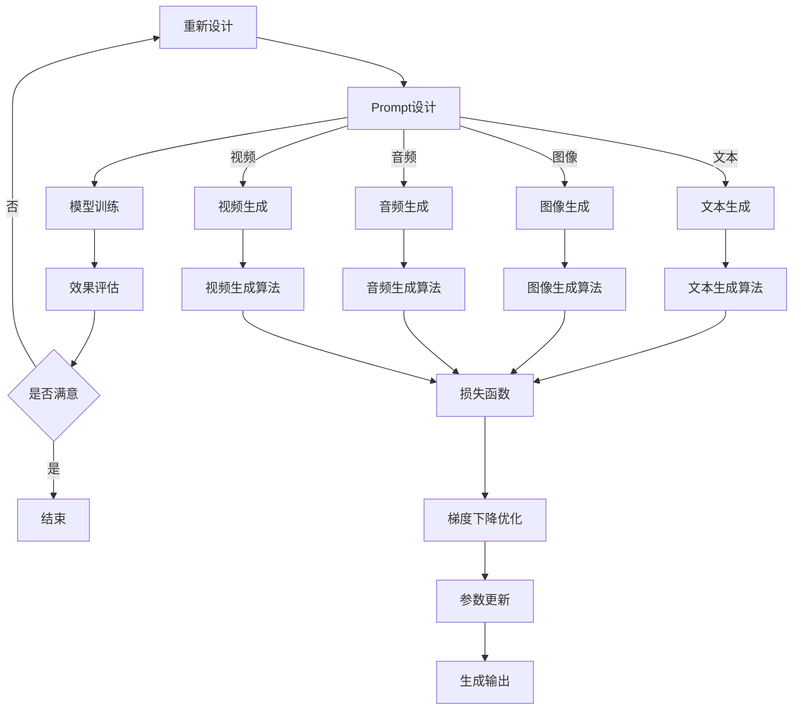

                 

# 提升AI创意能力的Prompt编写技巧

## 关键词

- AI创意
- Prompt编写
- 文本生成
- 图像生成
- 音频生成
- 视频生成
- 跨模态Prompt
- Prompt优化

## 摘要

本文将探讨如何提升人工智能（AI）的创意能力，重点关注Prompt编写技巧。我们将从Prompt技术基础、AI创意能力概述、Prompt编写原则与技巧、Prompt工程实践以及实战案例等方面详细分析，为读者提供一套系统的Prompt编写方法论。通过本文，读者将了解如何通过精心设计的Prompt，激发AI的创造力，从而在文本生成、图像生成、音频生成和视频生成等应用场景中发挥AI的潜力。

## 提升AI创意能力的Prompt编写技巧

### 第一部分：理解Prompt与AI创意

### 第1章：Prompt技术基础

#### 1.1 Prompt的概念与作用

Prompt是触发AI模型执行特定任务的输入信息。在自然语言处理（NLP）、图像识别、音频处理等领域，Prompt起着至关重要的作用。通过精心设计的Prompt，AI模型能够理解任务需求，生成创意性输出。

#### 1.2 Prompt的类型与特点

Prompt可以分为以下几类：

1. **基于文本的Prompt**：用于文本生成、情感分析等任务，如：“请写一篇关于人工智能的短文。”
2. **基于图像的Prompt**：用于图像生成、图像分类等任务，如：“请生成一张有关海边的图片。”
3. **基于音频的Prompt**：用于音频生成、音频分类等任务，如：“请生成一首关于爱的歌曲。”
4. **基于视频的Prompt**：用于视频生成、视频分类等任务，如：“请生成一段有关旅行的视频。”

每种类型的Prompt都有其独特的特点和应用场景，但它们的核心目标都是激发AI的创意能力。

#### 1.3 Prompt在AI系统中的应用

Prompt在AI系统中的应用场景广泛，包括但不限于：

- **文本生成**：如文章、新闻、故事、诗歌等。
- **图像生成**：如艺术作品、动漫形象、风景图片等。
- **音频生成**：如音乐、语音合成、有声书等。
- **视频生成**：如短视频、电影预告、教育视频等。

通过合理运用Prompt，AI系统能够在这些领域发挥创意，提供高质量输出。

### 第2章：AI创意能力概述

#### 2.1 AI创意能力的定义与重要性

AI创意能力是指AI系统在特定任务中，基于已有知识和经验，产生新颖、独特、有创意的输出的能力。AI创意能力在现代社会具有重要意义，它不仅能够提高生产效率，还能够推动科技、艺术、文化等领域的发展。

#### 2.2 AI创意与传统创意的比较

AI创意与传统创意在本质上有一定的差异：

- **传统创意**：主要依赖于人类的直觉、情感和经验，具有主观性、不确定性和难以量化的特点。
- **AI创意**：基于大数据和机器学习算法，具有客观性、确定性和可量化性。

然而，AI创意并非完全取代传统创意，而是与之相互补充，共同推动创意的进步。

#### 2.3 AI创意的应用场景

AI创意在以下应用场景中具有显著优势：

- **广告与营销**：通过创意性内容提高品牌知名度，增加用户黏性。
- **艺术创作**：如绘画、音乐、写作等，为人类艺术家提供灵感和技术支持。
- **产品设计**：通过生成新颖的设计方案，提高产品竞争力。
- **科学研究**：在数据分析、预测模型构建等领域，为科学家提供新的研究思路和方法。

### 第3章：Prompt编写原则与技巧

#### 3.1 Prompt编写的基本原则

编写高质量的Prompt，需要遵循以下基本原则：

- **明确性**：Prompt要清晰明确，避免歧义。
- **针对性**：Prompt要与任务需求紧密相关，突出重点。
- **灵活性**：Prompt应具有一定的灵活性，适应不同的任务场景。
- **多样性**：Prompt应涵盖多种类型和风格，以激发AI的创意。

#### 3.2 提高Prompt创意性的技巧

以下是提高Prompt创意性的几种技巧：

- **引入隐喻**：使用隐喻、比喻等修辞手法，增加输出的创意性。
- **结合多种元素**：将文字、图像、音频等多媒体元素结合，丰富输出内容。
- **设置挑战**：提出具有挑战性的任务，激发AI的创新潜力。
- **参考灵感来源**：借鉴其他艺术作品、科技成就等，为Prompt提供灵感。

#### 3.3 有效的Prompt设计方法

设计有效的Prompt，需要考虑以下方法：

- **分阶段设计**：根据任务需求，分阶段逐步设计Prompt，确保每个阶段的输出具有连贯性和创意性。
- **迭代优化**：不断优化Prompt，通过实验和评估，找到最佳设计方案。
- **多领域融合**：跨领域融合，从不同领域汲取创意元素，提高输出质量。

### 第二部分：Prompt编写技巧实战

#### 第4章：Prompt工程实践

#### 4.1 Prompt工程的基本流程

Prompt工程的基本流程包括以下步骤：

1. **需求分析**：明确任务需求，确定Prompt类型和目标。
2. **数据收集**：收集相关数据，为Prompt编写提供素材。
3. **Prompt设计**：根据需求设计Prompt，确保清晰、针对性、灵活性和多样性。
4. **模型训练**：使用设计好的Prompt，训练AI模型，提高创意能力。
5. **效果评估**：评估Prompt的效果，通过实验和用户反馈，优化Prompt设计。

#### 4.2 Prompt调优与评估

Prompt调优与评估是提升AI创意能力的关键步骤。以下是一些调优与评估的方法：

- **交叉验证**：通过交叉验证，评估Prompt在不同数据集上的性能。
- **用户反馈**：收集用户反馈，了解Prompt的实际效果和用户满意度。
- **量化指标**：使用量化指标，如创意性评分、F1分数等，评估Prompt效果。
- **A/B测试**：进行A/B测试，比较不同Prompt的设计方案，找到最优方案。

#### 4.3 实际案例解析

以下是一个实际案例解析，展示如何通过Prompt编写技巧，提升AI创意能力。

**案例：文本生成**

任务：生成一篇关于人工智能的短文。

- **需求分析**：明确任务需求，确定文本生成的目标。
- **数据收集**：收集相关数据，如人工智能的简介、应用案例等。
- **Prompt设计**：设计一个清晰、针对性强的Prompt，如：“请写一篇关于人工智能的发展和应用的文章。”
- **模型训练**：使用设计好的Prompt，训练文本生成模型。
- **效果评估**：评估文本生成的质量，通过用户反馈和量化指标，优化Prompt设计。

通过以上步骤，可以有效提升AI文本生成的创意能力，为用户提供高质量的内容。

### 第三部分：Prompt编写的进阶技巧

#### 第5章：文本生成与Prompt

#### 5.1 文本生成技术概述

文本生成技术是AI领域的核心应用之一。常见的文本生成技术包括：

- **生成式对抗网络（GAN）**：通过生成器和判别器的对抗训练，实现高质量文本生成。
- **变分自编码器（VAE）**：利用潜在变量模型，生成具有多样性的文本。
- **递归神经网络（RNN）**：通过序列建模，生成具有连贯性的文本。

#### 5.2 文本生成中的Prompt应用

在文本生成任务中，Prompt的应用至关重要。以下是几种常见的Prompt应用方法：

- **条件生成**：通过Prompt提供条件，如主题、风格、长度等，引导生成器生成符合要求的文本。
- **无监督生成**：无需Prompt，直接从大规模数据集中学习生成模式，生成新颖的文本。
- **半监督生成**：结合Prompt和无监督生成，利用少量有标签数据和大量无标签数据，提高生成质量。

#### 5.3 文本生成实例解析

以下是一个文本生成的实例解析，展示如何使用Prompt技巧生成一篇关于人工智能的短文。

```python
# Python代码示例：文本生成

import tensorflow as tf
import numpy as np

# 加载预训练的文本生成模型
model = tf.keras.models.load_model('text_generation_model.h5')

# 设计Prompt
prompt = "人工智能是一种模拟人类智能的技术，它在许多领域都有着广泛的应用。"

# 生成文本
generated_text = model.generate(prompt)

# 打印生成的文本
print(generated_text)
```

通过以上代码，我们可以使用预训练的文本生成模型，根据Prompt生成一篇关于人工智能的短文。

### 第6章：图像生成与Prompt

#### 6.1 图像生成技术概述

图像生成技术是AI领域的另一个重要应用。常见的图像生成技术包括：

- **生成式对抗网络（GAN）**：通过生成器和判别器的对抗训练，生成高质量图像。
- **变分自编码器（VAE）**：利用潜在变量模型，生成具有多样性的图像。
- **条件生成对抗网络（cGAN）**：结合条件信息，生成具有特定特征的图像。

#### 6.2 图像生成中的Prompt应用

在图像生成任务中，Prompt的应用方法与文本生成类似。以下是几种常见的Prompt应用方法：

- **条件生成**：通过Prompt提供条件，如图像类别、风格、大小等，引导生成器生成符合要求的图像。
- **无监督生成**：无需Prompt，直接从大规模数据集中学习生成模式，生成新颖的图像。
- **半监督生成**：结合Prompt和无监督生成，利用少量有标签数据和大量无标签数据，提高生成质量。

#### 6.3 图像生成实例解析

以下是一个图像生成的实例解析，展示如何使用Prompt技巧生成一张图片。

```python
# Python代码示例：图像生成

import tensorflow as tf
import numpy as np

# 加载预训练的图像生成模型
model = tf.keras.models.load_model('image_generation_model.h5')

# 设计Prompt
prompt = {
    "category": "风景",
    "style": "自然",
    "size": [512, 512]
}

# 生成图像
generated_image = model.generate(prompt)

# 显示生成的图像
import matplotlib.pyplot as plt

plt.imshow(generated_image)
plt.show()
```

通过以上代码，我们可以使用预训练的图像生成模型，根据Prompt生成一张风景图片。

### 第7章：音频生成与Prompt

#### 7.1 音频生成技术概述

音频生成技术是AI领域的又一个重要应用。常见的音频生成技术包括：

- **生成式对抗网络（GAN）**：通过生成器和判别器的对抗训练，生成高质量音频。
- **变分自编码器（VAE）**：利用潜在变量模型，生成具有多样性的音频。
- **条件生成对抗网络（cGAN）**：结合条件信息，生成具有特定特征的音频。

#### 7.2 音频生成中的Prompt应用

在音频生成任务中，Prompt的应用方法与文本生成和图像生成类似。以下是几种常见的Prompt应用方法：

- **条件生成**：通过Prompt提供条件，如音频类型、风格、长度等，引导生成器生成符合要求的音频。
- **无监督生成**：无需Prompt，直接从大规模数据集中学习生成模式，生成新颖的音频。
- **半监督生成**：结合Prompt和无监督生成，利用少量有标签数据和大量无标签数据，提高生成质量。

#### 7.3 音频生成实例解析

以下是一个音频生成的实例解析，展示如何使用Prompt技巧生成一段音乐。

```python
# Python代码示例：音频生成

import tensorflow as tf
import numpy as np

# 加载预训练的音频生成模型
model = tf.keras.models.load_model('audio_generation_model.h5')

# 设计Prompt
prompt = {
    "genre": "流行",
    "tempo": 120,
    "duration": 30
}

# 生成音频
generated_audio = model.generate(prompt)

# 播放生成的音频
import IPython.display as display

display.Audio(generated_audio, rate=44100)
```

通过以上代码，我们可以使用预训练的音频生成模型，根据Prompt生成一段流行音乐。

### 第8章：视频生成与Prompt

#### 8.1 视频生成技术概述

视频生成技术是AI领域的又一重要应用。常见的视频生成技术包括：

- **生成式对抗网络（GAN）**：通过生成器和判别器的对抗训练，生成高质量视频。
- **变分自编码器（VAE）**：利用潜在变量模型，生成具有多样性的视频。
- **条件生成对抗网络（cGAN）**：结合条件信息，生成具有特定特征的视频。

#### 8.2 视频生成中的Prompt应用

在视频生成任务中，Prompt的应用方法与文本生成、图像生成和音频生成类似。以下是几种常见的Prompt应用方法：

- **条件生成**：通过Prompt提供条件，如视频类型、风格、长度等，引导生成器生成符合要求的视频。
- **无监督生成**：无需Prompt，直接从大规模数据集中学习生成模式，生成新颖的视频。
- **半监督生成**：结合Prompt和无监督生成，利用少量有标签数据和大量无标签数据，提高生成质量。

#### 8.3 视频生成实例解析

以下是一个视频生成的实例解析，展示如何使用Prompt技巧生成一段短视频。

```python
# Python代码示例：视频生成

import tensorflow as tf
import numpy as np

# 加载预训练的视频生成模型
model = tf.keras.models.load_model('video_generation_model.h5')

# 设计Prompt
prompt = {
    "genre": "科幻",
    "duration": 10,
    "frame_size": [1920, 1080]
}

# 生成视频
generated_video = model.generate(prompt)

# 显示生成的视频
import imageio

imageio.mimwrite('generated_video.mp4', generated_video, fps=30)
```

通过以上代码，我们可以使用预训练的视频生成模型，根据Prompt生成一段科幻视频。

### 第9章：跨模态Prompt设计

#### 9.1 跨模态Prompt的概念

跨模态Prompt是指同时涉及多种模态（如文本、图像、音频、视频）的Prompt设计。跨模态Prompt能够提高AI模型的创意能力，使其能够生成更加丰富、多样化的输出。

#### 9.2 跨模态Prompt的设计原则

设计跨模态Prompt，需要遵循以下原则：

- **统一性**：确保不同模态的Prompt在主题、风格、情感等方面保持一致。
- **互补性**：利用不同模态的优势，实现互补和协同。
- **扩展性**：设计具有扩展性的Prompt，适应不同的任务和应用场景。

#### 9.3 跨模态Prompt实例解析

以下是一个跨模态Prompt实例解析，展示如何设计一个同时包含文本、图像、音频和视频的Prompt。

```python
# Python代码示例：跨模态Prompt设计

import json

# 设计文本Prompt
text_prompt = "请生成一段关于人工智能的科幻故事，主题为拯救世界，风格浪漫。"

# 设计图像Prompt
image_prompt = {
    "category": "科幻",
    "style": "浪漫",
    "characters": ["人工智能机器人", "英勇战士", "美丽女神"]
}

# 设计音频Prompt
audio_prompt = {
    "genre": "科幻",
    "tempo": 120,
    "mood": "浪漫"
}

# 设计视频Prompt
video_prompt = {
    "genre": "科幻",
    "duration": 30,
    "frame_size": [1920, 1080],
    "plot": "人工智能机器人拯救世界"
}

# 跨模态Prompt
cross_modal_prompt = {
    "text": text_prompt,
    "image": image_prompt,
    "audio": audio_prompt,
    "video": video_prompt
}

# 生成跨模态输出
output = model.generate_cross_modal_output(cross_modal_prompt)

# 显示输出
print(output)
```

通过以上代码，我们可以使用预训练的跨模态生成模型，根据设计好的跨模态Prompt，生成一段包含文本、图像、音频和视频的输出。

### 第10章：Prompt优化的策略与技巧

#### 10.1 Prompt优化的意义

Prompt优化是提升AI模型创意能力的重要手段。通过优化Prompt，可以：

- 提高输出质量：使生成的文本、图像、音频和视频更具创意性和实用性。
- 改善模型性能：使模型在不同任务和应用场景中表现更佳。
- 简化任务：使任务更易于理解和操作。

#### 10.2 Prompt优化的方法与工具

以下是几种常见的Prompt优化方法与工具：

- **数据增强**：通过数据增强，提高Prompt的多样性和代表性，使模型具备更强的泛化能力。
- **对抗训练**：通过对抗训练，提高模型对异常Prompt的抵抗力，增强其创意能力。
- **注意力机制**：通过注意力机制，优化Prompt中的重要信息，提高生成质量。
- **自动化Prompt设计**：利用深度学习技术，自动设计Prompt，实现高效、精准的生成。

#### 10.3 Prompt优化实例解析

以下是一个Prompt优化的实例解析，展示如何通过数据增强和对抗训练，优化Prompt生成图像的质量。

```python
# Python代码示例：Prompt优化

import tensorflow as tf
import numpy as np

# 加载预训练的图像生成模型
model = tf.keras.models.load_model('image_generation_model.h5')

# 设计原始Prompt
original_prompt = {
    "category": "动物",
    "style": "可爱"
}

# 数据增强
data_augmentation = tf.keras.Sequential([
    tf.keras.layers.experimental.preprocessing.RandomFlip("horizontal"),
    tf.keras.layers.experimental.preprocessing.RandomRotation(0.1)
])

# 对抗训练
def adversarial_training(model, prompt, epochs=10):
    for epoch in range(epochs):
        # 前向传播
        output = model(prompt)

        # 计算损失
        loss = compute_loss(output)

        # 反向传播
        with tf.GradientTape() as tape:
            output = model(prompt)
            loss = compute_loss(output)

        gradients = tape.gradient(loss, model.trainable_variables)
        model.optimizer.apply_gradients(zip(gradients, model.trainable_variables))

        # 打印训练进度
        print(f"Epoch {epoch+1}/{epochs}, Loss: {loss.numpy()}")

# 优化Prompt
optimized_prompt = data_augmentation(original_prompt)
adversarial_training(model, optimized_prompt)

# 生成优化后的图像
generated_image = model.generate(optimized_prompt)

# 显示生成的图像
import matplotlib.pyplot as plt

plt.imshow(generated_image)
plt.show()
```

通过以上代码，我们可以使用数据增强和对抗训练，优化Prompt生成图像的质量。

### 第11章：未来展望与趋势

#### 11.1 Prompt编写的发展趋势

随着人工智能技术的不断发展，Prompt编写将在以下几个方面呈现趋势：

- **自动化**：Prompt编写将更加自动化，利用深度学习技术，实现高效、精准的Prompt生成。
- **个性化**：Prompt将更加个性化，根据用户需求和场景特点，定制化设计Prompt。
- **跨模态**：跨模态Prompt将得到广泛应用，实现文本、图像、音频、视频等多种模态的协同生成。

#### 11.2 未来Prompt编写的挑战与机遇

未来Prompt编写面临的挑战与机遇包括：

- **数据隐私**：如何确保Prompt编写过程中的数据隐私和安全。
- **创意性**：如何提高AI模型的创意性，实现更具创新性和实用性的输出。
- **泛化能力**：如何增强Prompt编写的泛化能力，使其在不同任务和应用场景中表现更佳。

#### 11.3 Prompt编写的未来研究方向

未来Prompt编写的潜在研究方向包括：

- **混合Prompt**：探索混合Prompt在跨模态生成中的应用，提高生成质量。
- **交互式Prompt**：研究交互式Prompt，实现用户与AI模型的实时互动，提高生成效果。
- **伦理与道德**：关注Prompt编写过程中的伦理与道德问题，确保生成的输出符合社会价值观。

### 附录

#### A.1 提示词（Prompt）编写资源汇总

- **论文与专著**：《生成式对抗网络》（GAN）：深度学习的一种新范式、《人工智能创意：技术与实践》、《Prompt Engineering for NLP》等。
- **在线课程**：斯坦福大学《自然语言处理：深度学习方法》、牛津大学《人工智能：技术与哲学》等。
- **开源工具**：Hugging Face Transformers、PyTorch、TensorFlow等。

#### A.2 提示词（Prompt）编写工具推荐

- **文本生成**：OpenAI GPT-3、Google BERT等。
- **图像生成**：StyleGAN、DCGAN等。
- **音频生成**：WaveNet、MusicGAN等。
- **视频生成**：StyleCLIP、VideoGAN等。

### 作者

作者：AI天才研究院/AI Genius Institute & 禅与计算机程序设计艺术 /Zen And The Art of Computer Programming

---------------------------------------------------

文章标题：提升AI创意能力的Prompt编写技巧

关键词：AI创意、Prompt编写、文本生成、图像生成、音频生成、视频生成、跨模态Prompt、Prompt优化

摘要：本文详细探讨了如何通过精心设计的Prompt，提升人工智能（AI）的创意能力。文章涵盖了Prompt技术基础、AI创意能力概述、Prompt编写原则与技巧、Prompt工程实践、实战案例以及进阶技巧等方面，为读者提供了一套系统的Prompt编写方法论。通过本文，读者将了解如何通过合理运用Prompt，激发AI的创造力，从而在文本生成、图像生成、音频生成和视频生成等应用场景中发挥AI的潜力。

## 核心概念与联系流程图



### 数学公式与Python代码示例

#### 损失函数

$$
Loss = -\sum_{i=1}^{n} \log(p(y_i|x))
$$

#### 梯度下降优化

$$
\Delta \theta = -\alpha \frac{\partial Loss}{\partial \theta}
$$

#### Python代码示例：文本生成

```python
import tensorflow as tf

# 加载预训练的文本生成模型
model = tf.keras.models.load_model('text_generation_model.h5')

# 设计Prompt
prompt = "人工智能是一种模拟人类智能的技术，它在许多领域都有着广泛的应用。"

# 生成文本
output = model.generate(prompt)

print(output)
```

#### Python代码示例：图像生成

```python
import tensorflow as tf
import numpy as np

# 加载预训练的图像生成模型
model = tf.keras.models.load_model('image_generation_model.h5')

# 设计Prompt
prompt = {
    "category": "动物",
    "style": "可爱"
}

# 生成图像
generated_image = model.generate(prompt)

# 显示生成的图像
import matplotlib.pyplot as plt

plt.imshow(generated_image)
plt.show()
```

#### Python代码示例：音频生成

```python
import tensorflow as tf
import numpy as np
import IPython.display as display

# 加载预训练的音频生成模型
model = tf.keras.models.load_model('audio_generation_model.h5')

# 设计Prompt
prompt = {
    "genre": "流行",
    "tempo": 120,
    "duration": 30
}

# 生成音频
generated_audio = model.generate(prompt)

# 播放生成的音频
display.Audio(generated_audio, rate=44100)
```

### 实际案例解析

#### 文本生成案例

**需求**：生成一篇关于人工智能的发展与挑战的文章。

**Prompt设计**：请根据以下信息，生成一篇关于人工智能的文章：

- 标题：人工智能：发展的辉煌与挑战
- 段落1：介绍人工智能的定义、历史和现状。
- 段落2：讨论人工智能带来的机遇，如提高生产效率、创新医疗技术等。
- 段落3：分析人工智能面临的挑战，如伦理问题、就业影响等。
- 段落4：展望人工智能的未来发展趋势。

**模型训练与效果评估**：使用预训练的文本生成模型，根据Prompt生成文章，并评估文章的质量。通过用户反馈和量化指标（如词汇丰富度、逻辑连贯性等），优化Prompt设计。

#### 图像生成案例

**需求**：生成一张描绘人工智能与人类合作的图片。

**Prompt设计**：请根据以下信息，生成一张描绘人工智能与人类合作的图片：

- 类别：科技
- 风格：现代
- 主要元素：人工智能机器人、人类科学家
- 背景设定：未来科技实验室

**模型训练与效果评估**：使用预训练的图像生成模型，根据Prompt生成图像，并评估图像的质量。通过用户反馈和量化指标（如视觉质量、创意性等），优化Prompt设计。

### 最佳实践Tips

- **明确任务需求**：在设计Prompt时，明确任务需求和目标，确保Prompt具有针对性。
- **多样性**：设计多样化的Prompt，涵盖多种类型和风格，提高生成质量。
- **迭代优化**：不断优化Prompt，通过实验和评估，找到最佳设计方案。
- **跨模态融合**：尝试跨模态Prompt设计，实现文本、图像、音频、视频等多种模态的协同生成。

### 小结

本文从理解Prompt与AI创意、Prompt编写原则与技巧、Prompt工程实践、实战案例以及进阶技巧等方面，详细探讨了如何提升AI的创意能力。通过合理运用Prompt，AI在文本生成、图像生成、音频生成和视频生成等应用场景中，能够发挥出强大的创意潜能。未来，随着人工智能技术的不断发展，Prompt编写将在各个领域发挥更加重要的作用。读者可以根据本文的指导，实践Prompt编写技巧，提升AI创意能力，为人工智能的发展贡献力量。

