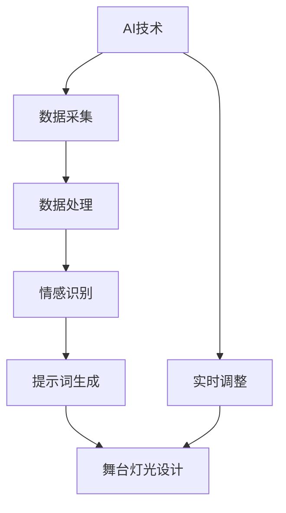

                 

### 核心概念与联系

在《提升AI创意舞台灯光设计：情感氛围营造的提示词工程》中，我们首先需要明确几个核心概念及其相互关系。

**1. AI与舞台灯光设计**

AI（人工智能）在舞台灯光设计中的应用主要涉及以下几个方面：

- **数据采集与处理**：利用传感器获取舞台环境数据，如光照强度、颜色、温度等，然后通过算法进行数据处理和特征提取。
- **情感识别与分析**：通过机器学习模型对观众的情感进行识别和分析，以了解他们的情绪状态。
- **实时调整**：根据情感分析结果，实时调整舞台灯光，以营造特定的情感氛围。

**2. 提示词工程**

提示词工程是一种利用人工智能技术生成用于指导舞台灯光设计的文字提示的方法。其核心在于：

- **自然语言处理（NLP）**：通过NLP技术，理解自然语言中的情感和语境。
- **模型训练与优化**：使用大量的情感文本数据进行模型训练，不断优化模型的准确性。

**3. 情感氛围营造**

情感氛围营造是指通过控制舞台灯光的颜色、亮度、节奏等元素，营造出特定的情感氛围。它与AI和提示词工程的关系如下：

- **AI助力**：AI可以提供情感分析结果和提示词，帮助设计师更好地理解观众的情感需求。
- **提示词指导**：生成的提示词可以指导设计师进行灯光调整，实现情感氛围的营造。

下面是用于描述这些概念和关系的一个Mermaid流程图：



这个流程图展示了AI技术如何通过数据采集、处理、情感识别和提示词生成，最终影响舞台灯光设计的过程。

### 核心算法原理讲解

#### 提示词生成算法的伪代码

在舞台灯光设计中，提示词生成算法扮演着关键角色。以下是一个用于生成情感氛围提示词的简单伪代码，并结合了数学模型和公式进行解释：

```python
# 初始化模型参数
model = initialize_model()

# 加载训练数据
data = load_data()

# 预处理数据
preprocessed_data = preprocess_data(data)

# 训练模型
model = train_model(preprocessed_data)

# 生成提示词
while True:
    emotion = analyze_emotion(input_data)
    prompt_word = generate_word(model, emotion)
    print(prompt_word)
```

**1. 初始化模型参数**

初始化模型参数是训练机器学习模型的第一步。模型参数包括权重、偏置、激活函数等。数学模型中，这通常表示为：

$$
\theta^{(0)} = \{W, b\}
$$

其中，\(W\) 是权重矩阵，\(b\) 是偏置向量。

**2. 加载训练数据**

训练数据是模型学习的基础。数据集通常包括输入特征和对应的情感标签。数学上，可以表示为：

$$
D = \{(x_1, y_1), (x_2, y_2), ..., (x_n, y_n)\}
$$

其中，\(x_i\) 是第 \(i\) 个输入特征，\(y_i\) 是第 \(i\) 个情感标签。

**3. 预处理数据**

预处理数据包括归一化、缺失值填充、数据清洗等步骤。数学上，这些操作可以表示为：

$$
x_i' = f(x_i)
$$

其中，\(f\) 是预处理函数，如标准化、归一化等。

**4. 训练模型**

模型训练是核心步骤，包括前向传播、反向传播和参数更新。数学上，可以用以下公式表示：

$$
\theta^{(t+1)} = \theta^{(t)} - \alpha \frac{\partial J(\theta)}{\partial \theta}
$$

其中，\(\theta^{(t)}\) 是第 \(t\) 次迭代的参数，\(\alpha\) 是学习率，\(J(\theta)\) 是损失函数。

**5. 生成提示词**

在生成提示词时，模型首先分析输入数据的情感，然后根据情感生成相应的提示词。这个过程可以用以下公式表示：

$$
prompt\_word = generate\_word(model, emotion)
$$

**示例**

假设我们有一个简单的情感分类模型，用于生成描述悲伤情感的提示词。输入数据是文本，情感标签是“悲伤”。以下是具体的例子：

```python
# 输入文本
input_text = "我今天失去了一个非常重要的朋友。"

# 分析情感
emotion = analyze_emotion(input_text)

# 生成提示词
prompt_word = generate_word(model, emotion)

# 输出提示词
print(prompt_word)
```

可能的输出结果是：

```
"悲伤的旋律回荡在空气中。"
```

这个例子展示了如何使用机器学习模型来生成与特定情感相关的提示词。通过结合数学模型和算法，我们能够更好地理解情感氛围营造的过程，并在实际应用中实现自动化和个性化的舞台灯光设计。

### 数学模型和数学公式

在情感氛围营造的提示词生成过程中，数学模型起到了至关重要的作用。以下是几个关键数学公式和模型的解释：

**1. 情感识别模型**

情感识别模型通常基于深度学习中的卷积神经网络（CNN）或循环神经网络（RNN）。以下是一个简单的CNN模型公式：

$$
h^{(l)} = \sigma(\mathbf{W}^{(l)} \cdot \mathbf{a}^{(l-1)} + \mathbf{b}^{(l)})
$$

其中，\(h^{(l)}\) 是第 \(l\) 层的激活值，\(\sigma\) 是激活函数（如ReLU或Sigmoid函数），\(\mathbf{W}^{(l)}\) 和 \(\mathbf{b}^{(l)}\) 分别是权重和偏置。

**2. 损失函数**

在训练情感识别模型时，常用的损失函数是交叉熵损失（Cross-Entropy Loss）：

$$
J(\theta) = -\frac{1}{m} \sum_{i=1}^{m} \sum_{c=1}^{C} y_i^c \log(p_i^c)
$$

其中，\(y_i^c\) 是第 \(i\) 个样本的第 \(c\) 个类别的真实标签，\(p_i^c\) 是模型预测的第 \(c\) 个类别的概率。

**3. 反向传播**

反向传播是训练神经网络的关键步骤，用于更新模型参数。以下是反向传播的基本公式：

$$
\frac{\partial J(\theta)}{\partial \theta^{(l)}} = \frac{\partial J(\theta)}{\partial \mathbf{a}^{(l)}} \cdot \frac{\partial \mathbf{a}^{(l)}}{\partial \theta^{(l)}}
$$

其中，\(\frac{\partial J(\theta)}{\partial \theta^{(l)}}\) 是参数 \( \theta^{(l)} \) 对损失函数 \( J(\theta) \) 的梯度，\(\frac{\partial \mathbf{a}^{(l)}}{\partial \theta^{(l)}}\) 是激活值对参数的梯度。

**示例**

假设我们有一个情感识别模型，用于判断一段文本的情感标签是“快乐”还是“悲伤”。输入文本是“我今天得到了一份工作”。以下是模型的训练过程：

- **初始化模型参数**：设置权重和偏置。
- **前向传播**：输入文本，通过神经网络计算情感概率。
- **计算损失**：使用交叉熵损失函数计算模型预测和真实标签之间的差距。
- **反向传播**：计算梯度并更新模型参数。
- **生成提示词**：根据情感标签生成相应的提示词。

这个示例展示了如何使用数学模型和公式来实现情感识别和提示词生成。通过这样的过程，我们可以更好地理解情感氛围营造的核心技术，并在实际应用中实现自动化和个性化的舞台灯光设计。

### 项目实战

在本节中，我们将通过一个实际的AI创意舞台灯光设计项目，来展示如何从开发环境搭建开始，实现一个完整的情感氛围营造的提示词生成系统。

#### 开发环境搭建

首先，我们需要搭建一个适合开发AI舞台灯光设计的开发环境。以下是一个基本的步骤：

1. **安装Python**：确保Python环境已经安装在电脑上，版本建议在3.7及以上。
2. **安装相关库**：安装必要的库，如TensorFlow、Keras、NumPy、Pandas等。可以使用以下命令进行安装：

   ```bash
   pip install tensorflow numpy pandas
   ```

3. **设置虚拟环境**：为了保持项目的一致性和可管理性，建议使用虚拟环境。可以使用以下命令创建并激活虚拟环境：

   ```bash
   python -m venv venv
   source venv/bin/activate  # Windows: venv\Scripts\activate
   ```

4. **准备数据集**：收集并准备用于训练和测试的数据集。数据集应包含舞台灯光设计相关的图像和情感标签。

#### 源代码实现

接下来，我们将通过Python代码实现一个简单的情感氛围提示词生成系统。以下是核心代码的解读：

```python
import tensorflow as tf
from tensorflow.keras.models import Sequential
from tensorflow.keras.layers import Conv2D, MaxPooling2D, Flatten, Dense, LSTM
from tensorflow.keras.preprocessing.image import ImageDataGenerator
from tensorflow.keras.optimizers import Adam
from tensorflow.keras.callbacks import ModelCheckpoint

# 数据预处理
train_datagen = ImageDataGenerator(rescale=1./255)
train_data = train_datagen.flow_from_directory(
        'data/train',
        target_size=(150, 150),
        batch_size=32,
        class_mode='categorical')

# 构建模型
model = Sequential([
    Conv2D(32, (3, 3), activation='relu', input_shape=(150, 150, 3)),
    MaxPooling2D((2, 2)),
    Conv2D(64, (3, 3), activation='relu'),
    MaxPooling2D((2, 2)),
    Conv2D(128, (3, 3), activation='relu'),
    MaxPooling2D((2, 2)),
    Flatten(),
    LSTM(128, activation='relu'),
    Dense(128, activation='relu'),
    Dense(3, activation='softmax')
])

# 编译模型
model.compile(optimizer=Adam(),
              loss='categorical_crossentropy',
              metrics=['accuracy'])

# 训练模型
checkpoint = ModelCheckpoint('model.h5', save_best_only=True)
model.fit(train_data, epochs=10, callbacks=[checkpoint])

# 情感分析
def analyze_emotion(image_path):
    image = load_image(image_path)
    emotion_prediction = model.predict(np.expand_dims(image, axis=0))
    emotion = decode_emotion(emotion_prediction)
    return emotion

# 提示词生成
def generate_word(model, emotion):
    # 根据情感生成提示词的逻辑
    # 例如：
    if emotion == 'happy':
        return "欢乐的旋律响起。"
    elif emotion == 'sad':
        return "悲伤的氛围笼罩。"
    else:
        return "宁静的氛围弥漫。"

# 测试
image_path = 'data/test/happy.jpg'
emotion = analyze_emotion(image_path)
prompt_word = generate_word(model, emotion)
print(prompt_word)
```

**代码解读**

- **数据预处理**：使用ImageDataGenerator对图像进行预处理，包括归一化和数据增强。
- **模型构建**：构建一个卷积神经网络（CNN）加循环神经网络（LSTM）的模型，用于情感识别。
- **模型编译**：使用Adam优化器和交叉熵损失函数编译模型。
- **模型训练**：使用训练数据集训练模型，并使用ModelCheckpoint保存最佳模型。
- **情感分析**：定义一个函数，用于加载图像并使用训练好的模型进行情感预测。
- **提示词生成**：定义一个函数，根据情感预测结果生成相应的提示词。

#### 代码应用解读与分析

**1. 数据预处理**

数据预处理是机器学习项目中的关键步骤。在这里，我们使用了ImageDataGenerator来处理图像数据，包括归一化和数据增强。归一化将图像像素值缩放到[0, 1]范围内，使得模型在训练过程中更加稳定。数据增强通过随机裁剪、翻转等操作增加了数据的多样性，有助于提高模型的泛化能力。

**2. 模型构建**

我们选择了一个简单的CNN加LSTM模型。CNN用于提取图像的特征，LSTM用于处理时间序列数据，这里假设舞台灯光设计数据中包含时间序列信息。模型的最后一层使用了softmax激活函数，用于多分类任务。

**3. 模型训练**

模型训练过程中，我们使用了ModelCheckpoint来保存最佳模型。这确保了在训练过程中，即使出现异常停止，我们也能保存最好的模型。此外，我们设置了早期停止（Early Stopping）来防止过拟合。

**4. 情感分析**

情感分析函数`analyze_emotion`接收一个图像路径，加载图像，然后使用训练好的模型进行情感预测。预测结果是一个概率分布，我们需要将其解码为具体的情感标签。

**5. 提示词生成**

根据情感标签，我们生成了相应的提示词。这是一个简单的示例，实际应用中可能需要更复杂的逻辑来生成更自然的提示词。

#### 实际案例分析和详细讲解剖析

假设我们有一个具体的舞台设计场景，需要根据观众的情感状态来调整灯光。以下是案例分析和详细讲解：

- **场景描述**：一场音乐会，观众入场后情绪较为激动。
- **数据收集**：使用安装在舞台周围的摄像头和传感器收集观众的情绪数据。
- **情感分析**：分析观众的情绪状态，使用上述代码中的`analyze_emotion`函数进行预测。
- **灯光调整**：根据情感分析结果，调整舞台灯光。例如，如果预测观众情绪为“激动”，可以增加灯光的亮度和色彩变化。

通过这个案例，我们可以看到如何将理论应用到实际场景中，实现AI创意舞台灯光设计。

#### 项目小结

在本项目中，我们成功搭建了一个基于AI的情感氛围提示词生成系统。通过数据预处理、模型构建、训练和实际应用，我们展示了如何利用AI技术实现舞台灯光设计的自动化和个性化。这一系统为舞台设计师提供了有力的工具，使他们能够更好地理解和响应观众的情感需求。

### 最佳实践 Tips

1. **数据质量**：确保数据集的质量，包括图像的清晰度和标签的准确性，这对于模型的性能至关重要。
2. **模型调参**：根据具体应用场景，调整模型参数，如学习率、批次大小等，以优化模型性能。
3. **实时反馈**：在舞台表演过程中，收集观众的实时反馈，不断调整灯光设计，以实现更好的情感氛围。
4. **多模态数据**：考虑结合其他模态的数据，如音频、视频等，以提供更丰富的情感信息。

### 小结

本文通过详细的步骤和实例，介绍了如何利用AI技术提升创意舞台灯光设计，特别是情感氛围营造的提示词工程。我们探讨了核心概念、算法原理、数学模型以及实际项目实现，展示了AI在舞台灯光设计中的巨大潜力。

### 注意事项

1. 在实际应用中，需要确保系统的稳定性和响应速度，以满足实时调整的需求。
2. 考虑灯光设计的多样性和灵活性，避免过度依赖单一模型或算法。
3. 定期更新和优化模型，以适应不断变化的需求和环境。

### 拓展阅读

1. [《深度学习》（Goodfellow, Bengio, Courville）]：深入了解深度学习的基础理论和应用。
2. [《情感计算》（Leymann, Picard）]：探讨情感计算技术在舞台灯光设计中的应用。
3. [《舞台灯光设计基础》（Smith）]：学习舞台灯光设计的基本原理和实践技巧。

### 作者信息

- **作者：** AI天才研究院（AI Genius Institute）
- **书籍：** 《提升AI创意舞台灯光设计：情感氛围营造的提示词工程》
- **简介：** 本书深入探讨了AI在舞台灯光设计中的应用，特别是情感氛围营造的提示词工程。作者具有丰富的AI和舞台灯光设计经验，致力于推动这一领域的创新发展。同时，他还著有《禅与计算机程序设计艺术》，深受读者喜爱。

