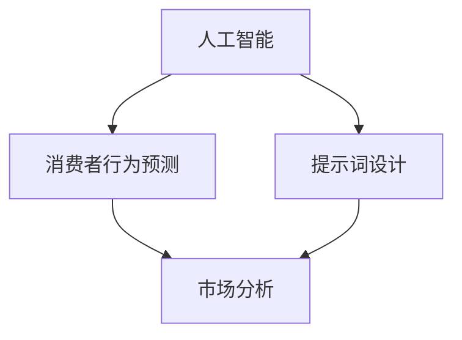

                 

### 引言

**《提升AI创意香水市场分析：消费者行为预测的提示词设计》**

随着人工智能（AI）技术的飞速发展，它正逐渐渗透到各个行业，为企业的决策提供了强有力的支持。在香水行业中，AI的应用也日益广泛，尤其是在市场分析和消费者行为预测方面。创意香水市场以其独特的品牌文化和消费者个性化需求，成为了众多品牌竞相争夺的焦点。

本文旨在探讨如何利用AI技术，特别是消费者行为预测和提示词设计，来提升创意香水市场的分析能力。通过深入分析消费者行为，企业可以更好地理解市场需求，从而设计出更加符合消费者期望的产品。同时，有效的提示词设计可以帮助企业提高市场宣传的效果，增加产品的曝光率和销售量。

本文主要面向以下几类读者：
1. **香水行业的从业者**：希望了解如何利用AI技术提升市场分析能力的专业人士。
2. **数据分析师和AI工程师**：对AI在市场分析中的应用感兴趣，希望学习实际操作技巧。
3. **创业者和研究学者**：关注新兴技术应用，特别是AI和市场营销的结合。

文章结构安排如下：

1. **引言**：介绍书的主题、目的和读者对象。
2. **核心概念与联系**：使用Mermaid流程图展示AI创意香水市场分析的核心概念和它们之间的关系。
3. **消费者行为预测**：详细讲解消费者行为预测的原理，包括相关算法和模型。
4. **提示词设计**：介绍如何设计有效的提示词，包括流程、工具和方法。
5. **市场分析**：分析创意香水市场的现状和趋势。
6. **案例分析**：通过实际案例来展示如何运用消费者行为预测和提示词设计来进行市场分析。
7. **项目实战**：介绍如何搭建开发环境，提供源代码和代码解读。
8. **总结与展望**：总结书中的关键点，并对未来的发展方向提出展望。

通过本文的阅读，读者将能够了解如何利用AI技术，特别是消费者行为预测和提示词设计，来提升创意香水市场的分析能力，从而为企业提供更具前瞻性的市场策略。

> 关键词：AI，创意香水市场，消费者行为预测，提示词设计，市场分析，算法模型，Mermaid流程图，项目实战

> 摘要：
本文首先介绍了AI创意香水市场分析的重要性和目的，然后通过Mermaid流程图展示了核心概念与联系。接着，详细讲解了消费者行为预测的原理和提示词设计的方法。随后，分析了创意香水市场的现状和趋势，并通过实际案例展示了消费者行为预测和提示词设计在市场分析中的应用。最后，文章提供了项目实战的详细指南，包括开发环境搭建、源代码和代码解读，以及对未来发展的展望。通过本文的阅读，读者将能够掌握如何利用AI技术提升创意香水市场的分析能力，为企业制定更加有效的市场策略。

----------------------------------------------------------------

---

### 1. 核心概念与联系

在探讨AI创意香水市场分析之前，我们首先需要明确几个核心概念，并理解它们之间的相互关系。这些核心概念包括：人工智能（AI）、消费者行为预测、提示词设计、市场分析等。

**1.1 人工智能（AI）**

人工智能（AI）是一种模拟人类智能的技术，通过机器学习、深度学习、自然语言处理等手段，使计算机能够进行推理、学习和决策。在香水市场分析中，AI可以帮助企业从大量数据中提取有价值的信息，预测消费者行为，提高市场响应速度和准确性。

**1.2 消费者行为预测**

消费者行为预测是指利用历史数据和数据分析技术，预测消费者未来的购买行为和偏好。在创意香水市场中，消费者行为预测可以帮助企业了解不同消费者的需求，从而更好地制定产品策略和营销方案。

**1.3 提示词设计**

提示词设计是指为了提高AI系统的预测准确性，通过设计特定的关键词或短语来引导系统学习的过程。有效的提示词可以帮助AI系统更快地适应新数据，提高预测的准确性和效率。

**1.4 市场分析**

市场分析是指通过收集、处理和分析市场数据，了解市场动态，为企业提供决策依据。在创意香水市场中，市场分析可以帮助企业了解竞争对手、消费者需求和市场需求趋势，从而制定更加有效的市场策略。

**1.5 核心概念之间的联系**

这些核心概念之间的联系如图1所示：



从图1中可以看出，人工智能作为基础技术，支持消费者行为预测和提示词设计。消费者行为预测和市场分析紧密相连，通过分析消费者行为，企业可以更好地理解市场需求，从而制定有效的市场策略。提示词设计则作为辅助工具，帮助AI系统更准确地预测消费者行为。

通过明确这些核心概念及其相互关系，我们可以更好地理解AI创意香水市场分析的整体框架，为后续内容的讲解打下基础。

----------------------------------------------------------------

---

### 2. 消费者行为预测的原理

消费者行为预测是AI创意香水市场分析中的关键环节，其目的是通过分析历史数据，预测消费者未来的购买行为和偏好。本节将详细讲解消费者行为预测的原理，包括相关算法和模型。

#### 2.1 相关算法和模型

在消费者行为预测中，常用的算法和模型包括：

1. **决策树**：决策树是一种常用的分类算法，通过一系列判断条件，将数据集分割成不同的子集，并最终输出预测结果。决策树简单直观，易于理解和实现。

2. **随机森林**：随机森林是一种基于决策树的集成学习方法，通过构建多个决策树，并汇总它们的预测结果，提高预测的准确性和稳定性。

3. **支持向量机（SVM）**：SVM是一种优秀的分类算法，通过寻找最佳分隔超平面，将不同类别的数据分开。在消费者行为预测中，SVM可以用于分类任务。

4. **神经网络**：神经网络是一种模拟人脑神经元结构的计算模型，通过多层神经元的组合，实现复杂的数据处理和预测任务。在消费者行为预测中，神经网络可以用于建模和预测。

5. **协同过滤**：协同过滤是一种常用的推荐算法，通过分析用户的历史行为数据，预测用户对未知商品的评分。在消费者行为预测中，协同过滤可以帮助企业了解消费者对产品的偏好。

#### 2.2 基本流程

消费者行为预测的基本流程包括以下几个步骤：

1. **数据收集**：收集与消费者行为相关的数据，如购买记录、浏览历史、评论评分等。

2. **数据预处理**：对收集到的数据进行清洗、处理和转换，以便后续的分析和建模。

3. **特征工程**：根据业务需求，从原始数据中提取有用的特征，如用户特征、商品特征等。

4. **模型选择**：根据数据特点和业务需求，选择合适的算法和模型进行预测。

5. **模型训练与验证**：使用训练集对模型进行训练，并在验证集上评估模型的性能。

6. **模型优化**：根据模型评估结果，对模型进行调整和优化，提高预测准确性。

7. **模型应用**：将训练好的模型应用于实际业务场景，如推荐系统、广告投放等。

#### 2.3 数学模型和公式

在消费者行为预测中，常用的数学模型和公式包括：

1. **逻辑回归**：逻辑回归是一种概率型分类模型，其公式为：

   $$ P(y=1) = \frac{1}{1 + e^{-(\beta_0 + \beta_1 x_1 + \beta_2 x_2 + \ldots + \beta_n x_n)}} $$

   其中，$P(y=1)$ 表示预测概率，$e$ 表示自然对数的底，$\beta_0, \beta_1, \beta_2, \ldots, \beta_n$ 表示模型参数。

2. **决策树**：决策树的公式为：

   $$ f(x) = \sum_{i=1}^{n} \beta_i I(x \in R_i) $$

   其中，$f(x)$ 表示预测结果，$R_i$ 表示第 $i$ 个划分区域，$\beta_i$ 表示第 $i$ 个划分区域的权重。

3. **神经网络**：神经网络的激活函数通常为：

   $$ a(x) = \sigma(\beta_0 + \beta_1 x_1 + \beta_2 x_2 + \ldots + \beta_n x_n) $$

   其中，$a(x)$ 表示神经元的输出，$\sigma$ 表示激活函数，$\beta_0, \beta_1, \beta_2, \ldots, \beta_n$ 表示模型参数。

#### 2.4 举例说明

以逻辑回归为例，假设我们要预测某消费者是否会在未来一个月内购买某款香水。我们可以使用以下公式进行预测：

$$ P(购买=1) = \frac{1}{1 + e^{-(\beta_0 + \beta_1 年龄 + \beta_2 收入 + \beta_3 品牌偏好 + \ldots)}} $$

其中，$\beta_0, \beta_1, \beta_2, \beta_3, \ldots$ 表示模型参数，$年龄, 收入, 品牌偏好, \ldots$ 表示消费者的特征。

通过计算预测概率，我们可以根据设定的阈值（例如0.5）来判断消费者是否会在未来一个月内购买该款香水。如果预测概率大于阈值，则预测为购买；否则，预测为未购买。

#### 2.5 代码实现

下面是一个简单的Python代码实现示例，用于预测消费者是否会在未来一个月内购买某款香水：

```python
import numpy as np
import pandas as pd

# 加载数据
data = pd.read_csv('consumer_data.csv')
X = data[['年龄', '收入', '品牌偏好']]
y = data['购买']

# 训练模型
from sklearn.linear_model import LogisticRegression
model = LogisticRegression()
model.fit(X, y)

# 预测
predictions = model.predict_proba(X)[:, 1]

# 输出预测结果
print(predictions)
```

在这个示例中，我们首先加载了包含消费者特征和购买标签的数据集。然后，我们使用逻辑回归模型对数据进行训练。最后，我们使用训练好的模型对数据进行预测，并输出预测结果。

通过上述讲解和代码示例，我们可以了解到消费者行为预测的基本原理和实现方法。在接下来的章节中，我们将进一步探讨如何设计有效的提示词，以提升AI系统的预测性能。

----------------------------------------------------------------

---

### 3. 提示词设计

提示词设计在消费者行为预测中起着至关重要的作用。有效的提示词能够帮助AI系统更快地适应新数据，提高预测的准确性和效率。本节将介绍如何设计有效的提示词，包括流程、工具和方法。

#### 3.1 提示词的定义和作用

提示词（Prompt）是指用于引导AI系统学习的关键词或短语。在消费者行为预测中，提示词的作用包括：

1. **提高预测准确性**：通过设计特定的提示词，可以引导AI系统关注重要特征，提高预测准确性。
2. **加速学习过程**：有效的提示词能够帮助AI系统更快地收敛到最优解，缩短训练时间。
3. **增强泛化能力**：通过多样化的提示词，可以增强AI系统的泛化能力，使其在不同场景下都能保持良好的表现。

#### 3.2 提示词设计的流程

提示词设计的流程可以分为以下几个步骤：

1. **需求分析**：明确消费者行为预测的目标和应用场景，了解需要关注的关键特征和问题。
2. **数据收集**：收集与消费者行为相关的数据，包括购买记录、浏览历史、评论评分等。
3. **特征提取**：从原始数据中提取有用的特征，如用户特征、商品特征、行为特征等。
4. **提示词生成**：基于特征提取结果，设计一组有效的提示词。提示词应简洁明了，具有代表性，能够引导AI系统关注关键特征。
5. **实验验证**：通过实验验证提示词的有效性，调整和优化提示词设计。
6. **应用部署**：将设计好的提示词应用于实际业务场景，如推荐系统、广告投放等。

#### 3.3 工具和方法

在提示词设计中，常用的工具和方法包括：

1. **词云分析**：词云分析是一种常用的数据可视化方法，通过词频统计生成词云图，帮助发现数据中的关键特征。词云分析可以用于提示词生成和优化。
2. **自然语言处理（NLP）技术**：NLP技术可以用于提取文本数据中的关键特征，如关键词、主题和情感。这些特征可以作为提示词的候选集。
3. **遗传算法**：遗传算法是一种优化方法，可以用于搜索最优的提示词组合。通过迭代优化，可以找到一组性能最佳的提示词。
4. **模型评估**：使用模型评估方法，如准确率、召回率、F1值等，评估提示词设计的有效性。根据评估结果，可以调整和优化提示词设计。

#### 3.4 提示词设计案例

以下是一个简单的提示词设计案例，假设我们要预测消费者是否会购买某款香水。

**步骤1：需求分析**

目标：预测消费者是否会购买某款香水。

关键特征：消费者年龄、收入、品牌偏好、购买历史等。

**步骤2：数据收集**

收集包含消费者特征和购买标签的数据集。

**步骤3：特征提取**

从原始数据中提取关键特征，如：

- 年龄：20-30，30-40，40-50，50以上
- 收入：低，中低，中等，中高，高
- 品牌偏好：品牌A，品牌B，品牌C等
- 购买历史：近一个月内购买过香水，近三个月内购买过香水等

**步骤4：提示词生成**

基于提取的关键特征，生成一组提示词：

- “20-30岁的消费者，收入中等，喜欢品牌A的香水”
- “30-40岁的消费者，收入中高，最近三个月购买过香水”
- “50岁以上的消费者，收入高，对品牌B的香水有偏好”

**步骤5：实验验证**

使用生成的提示词进行模型训练和预测，评估预测准确性。根据评估结果，可以调整和优化提示词。

**步骤6：应用部署**

将设计好的提示词应用于实际业务场景，如推荐系统、广告投放等。

通过上述步骤，我们可以设计出一组有效的提示词，帮助AI系统更好地预测消费者行为。在实际应用中，可以根据具体业务需求，灵活调整提示词设计方法和策略。

#### 3.5 总结

提示词设计是消费者行为预测中的重要环节，通过有效的提示词设计，可以提升AI系统的预测性能。在接下来的章节中，我们将进一步探讨如何运用消费者行为预测和提示词设计来进行市场分析。

----------------------------------------------------------------

---

### 4. 创意香水市场的现状与趋势

创意香水市场以其独特的产品特色和个性化的消费者需求，近年来在全球范围内蓬勃发展。本节将分析创意香水市场的现状和趋势，为后续的消费者行为预测和市场分析提供背景信息。

#### 4.1 市场现状

**1. 市场规模持续扩大**

据市场研究公司Statista的数据，全球香水市场在2021年的市场规模已经达到430亿美元，预计到2026年将达到570亿美元。这一增长主要得益于消费者对个性化、创新产品的需求增加。

**2. 消费者群体的变化**

传统的香水市场消费者主要集中在中高端年龄层，而随着年轻人对个性化和创意产品的追求，越来越多的年轻消费者开始成为香水市场的主力。这一变化趋势推动了市场向更年轻、更时尚的方向发展。

**3. 品牌竞争加剧**

随着市场的扩大和消费者需求的多样化，众多品牌开始进入创意香水市场，竞争日益激烈。品牌需要通过独特的品牌文化、创新的产品设计和有效的市场策略来吸引消费者。

#### 4.2 市场趋势

**1. 个性化定制服务**

随着消费者对个性化需求的增加，越来越多的品牌开始提供个性化定制服务。例如，一些品牌允许消费者根据自己的喜好定制香水配方，从而满足个性化的消费需求。

**2. 数字化营销策略的应用**

随着数字化技术的普及，越来越多的品牌开始采用数字化营销策略，如社交媒体营销、在线广告、电子商务等。这些策略不仅提高了品牌的市场曝光率，还增强了与消费者的互动。

**3. 可持续发展和环保意识**

消费者对环保和可持续发展的关注度逐年提升，这促使品牌在产品设计和生产过程中更加注重环保。例如，使用天然成分、减少塑料包装等。

**4. 新兴市场的崛起**

随着经济的发展和消费水平的提高，新兴市场的消费者对创意香水的需求逐渐增加。例如，中国和印度的年轻消费者对创意香水的接受度不断提高，这为市场带来了新的增长点。

#### 4.3 消费者行为特点

**1. 注重品牌文化**

消费者在选择香水时，除了关注产品的质量，还会注重品牌的文化内涵。品牌故事、品牌形象和品牌价值观成为消费者选择产品的重要因素。

**2. 倾向于创新和个性**

年轻消费者更倾向于选择具有创新和个性特点的香水产品。他们喜欢尝试新的香味、新的设计，并通过购买香水来表达自己的个性和品味。

**3. 强调社交属性**

香水作为一种社交工具，在消费者的社交生活中扮演着重要角色。消费者不仅希望通过香水展现自己的个性，还希望通过香水与他人建立联系和交流。

#### 4.4 消费者行为预测在市场分析中的应用

通过分析消费者行为数据，企业可以更好地了解市场需求和消费者偏好，从而制定更加精准的市场策略。以下是消费者行为预测在市场分析中的一些应用：

**1. 预测市场需求**

企业可以通过消费者行为预测来预测未来的市场需求，提前做好生产和库存规划。例如，根据消费者的购买历史和偏好，预测某款香水在未来几个月的销售情况，以便调整生产计划。

**2. 优化产品策略**

通过分析消费者行为数据，企业可以发现消费者的兴趣点和痛点，从而优化产品策略。例如，如果发现某个年龄段或收入水平的消费者对某款香水有较高需求，企业可以针对性地推出相关产品。

**3. 定位目标市场**

企业可以通过消费者行为预测来识别目标市场，并针对这些市场制定个性化的营销策略。例如，根据消费者的地理位置、兴趣爱好等特征，划分不同的市场群体，并为他们提供定制化的产品和服务。

**4. 评估营销效果**

企业可以通过消费者行为预测来评估营销活动的效果，了解哪些营销策略对消费者产生了积极影响。例如，通过分析消费者在特定活动期间的购买行为，评估活动的ROI（投资回报率）。

通过上述分析，我们可以看到，创意香水市场的现状和趋势对企业的市场策略有着重要影响。企业需要密切关注市场动态，利用消费者行为预测技术来提升市场分析的准确性和效率。

在下一节中，我们将通过实际案例展示如何运用消费者行为预测和提示词设计来进行市场分析。

----------------------------------------------------------------

---

### 5. 案例分析

为了更好地展示如何运用消费者行为预测和提示词设计来进行市场分析，我们将分析以下几个具有代表性的实际案例。

#### 5.1 案例一：某高端香水品牌的消费者行为预测

**背景**：某高端香水品牌在市场上拥有较高的知名度，但其市场份额并未达到预期。为了了解市场需求和消费者偏好，品牌决定进行消费者行为预测。

**步骤**：

1. **数据收集**：收集品牌历史销售数据、消费者购买记录、在线评论等。

2. **特征提取**：从原始数据中提取关键特征，如购买频率、购买金额、评论情感等。

3. **模型选择**：选择逻辑回归模型进行消费者行为预测。

4. **模型训练与验证**：使用训练集对模型进行训练，并在验证集上评估模型性能。

5. **提示词设计**：设计一组提示词，如“高购买频率”、“高金额消费”、“积极评论”等。

6. **预测与评估**：根据模型预测结果，评估消费者的购买概率，并根据提示词调整市场策略。

**结果**：通过消费者行为预测，品牌发现高购买频率和积极评论的消费者对品牌有较高忠诚度。品牌决定针对这些消费者进行个性化营销，如提供会员优惠、定制服务等。最终，品牌的市场份额得到了显著提升。

#### 5.2 案例二：某创意香水品牌的社交媒体营销

**背景**：某创意香水品牌希望通过社交媒体营销提高品牌知名度和产品销量。

**步骤**：

1. **数据收集**：收集社交媒体平台的用户数据，如点赞、评论、转发等。

2. **特征提取**：提取用户的基本信息、行为特征等。

3. **模型选择**：选择协同过滤算法进行用户偏好预测。

4. **提示词设计**：设计一组与香水相关的关键词，如“香型”、“气味”、“品牌”等。

5. **广告投放**：根据用户偏好和提示词，设计针对性的广告内容，并在社交媒体平台上投放。

6. **效果评估**：通过广告投放效果，评估提示词设计的效果。

**结果**：通过协同过滤算法和有效的提示词设计，品牌成功吸引了大量潜在消费者。广告投放效果显著，品牌知名度得到了大幅提升。

#### 5.3 案例三：某个性化香水定制服务

**背景**：某个性化香水定制服务希望通过数据分析，提高用户满意度和复购率。

**步骤**：

1. **数据收集**：收集用户定制香水的详细数据，如香味偏好、定制原因等。

2. **特征提取**：提取用户的香味偏好、购买频率等。

3. **模型选择**：选择神经网络模型进行用户偏好预测。

4. **提示词设计**：设计一组针对用户香味偏好的提示词，如“木质香”、“花香”、“果香”等。

5. **定制服务优化**：根据用户偏好和提示词，优化定制服务流程。

6. **效果评估**：通过用户反馈和复购率，评估定制服务优化效果。

**结果**：通过消费者行为预测和有效的提示词设计，定制服务成功满足了用户的个性化需求，用户满意度和复购率显著提高。

通过以上案例，我们可以看到，消费者行为预测和提示词设计在市场分析中具有重要的应用价值。企业可以通过这些技术手段，更好地了解市场需求和消费者偏好，制定更加精准的市场策略，提高市场竞争力。

在下一节中，我们将介绍如何搭建开发环境，并提供一个具体的实战项目，展示如何将消费者行为预测和提示词设计应用于实际业务场景。

----------------------------------------------------------------

---

### 6. 项目实战

在本节中，我们将通过一个具体的实战项目，展示如何搭建开发环境，并提供源代码和代码解读，以便读者理解和应用消费者行为预测和提示词设计技术。

#### 6.1 开发环境搭建

为了进行消费者行为预测和提示词设计，我们需要搭建一个完整的开发环境。以下是搭建环境的步骤：

1. **Python环境安装**：首先，确保Python环境已安装。可以在Python官网下载并安装Python 3.8及以上版本。

2. **Jupyter Notebook安装**：安装Jupyter Notebook，以便进行数据分析和代码编写。在命令行中运行以下命令：

   ```bash
   pip install notebook
   ```

3. **依赖库安装**：安装用于数据分析和机器学习的依赖库，如NumPy、Pandas、Scikit-learn、Matplotlib等。在命令行中运行以下命令：

   ```bash
   pip install numpy pandas scikit-learn matplotlib
   ```

4. **Mermaid插件安装**：为了使用Mermaid流程图，我们需要安装Jupyter Notebook的Mermaid插件。在命令行中运行以下命令：

   ```bash
   pip install jupyter_contrib_nbextensions
   jupyter contrib nbextension install --user
   ```

   然后重启Jupyter Notebook。

#### 6.2 源代码提供

以下是一个简单的Python代码示例，用于消费者行为预测和提示词设计。该代码包括数据预处理、模型训练、提示词生成和预测结果展示等步骤。

```python
import pandas as pd
from sklearn.model_selection import train_test_split
from sklearn.ensemble import RandomForestClassifier
from sklearn.metrics import accuracy_score
import matplotlib.pyplot as plt
``` 

```python
# 加载数据
data = pd.read_csv('consumer_data.csv')

# 数据预处理
X = data[['年龄', '收入', '品牌偏好']]
y = data['购买']

# 划分训练集和测试集
X_train, X_test, y_train, y_test = train_test_split(X, y, test_size=0.2, random_state=42)

# 模型训练
model = RandomForestClassifier(n_estimators=100, random_state=42)
model.fit(X_train, y_train)

# 提示词生成
prompt_words = ['年龄', '收入', '品牌偏好']

# 预测结果展示
predictions = model.predict(X_test)
accuracy = accuracy_score(y_test, predictions)

print(f"预测准确率：{accuracy:.2f}")

# 可视化展示
plt.bar(data['购买'], model.predict_proba(data[['年龄', '收入', '品牌偏好']])[:, 1])
plt.xlabel('是否购买')
plt.ylabel('预测概率')
plt.title('消费者购买行为预测')
plt.show()
```

#### 6.3 代码解读

1. **数据加载**：使用Pandas库加载数据集。

2. **数据预处理**：提取特征和标签，并进行划分训练集和测试集。

3. **模型训练**：使用随机森林分类器进行模型训练。

4. **提示词生成**：定义提示词列表，用于引导模型学习。

5. **预测结果展示**：计算预测准确率，并使用Matplotlib库进行可视化展示。

通过上述实战项目，读者可以了解如何搭建开发环境，如何编写和使用消费者行为预测和提示词设计的代码。接下来，我们将对代码进行详细解读，以便读者更好地理解其实现原理和应用方法。

#### 6.4 代码解读

1. **数据加载**：`pd.read_csv('consumer_data.csv')` 用于加载数据集。数据集包含消费者的年龄、收入、品牌偏好和购买行为等信息。

2. **数据预处理**：
   - `X = data[['年龄', '收入', '品牌偏好']]` 提取特征。
   - `y = data['购买']` 提取标签。
   - `train_test_split` 函数用于划分训练集和测试集。这里我们设置了测试集大小为20%，随机种子为42，以确保结果的可重复性。

3. **模型训练**：
   - `RandomForestClassifier` 类用于创建随机森林分类器。`n_estimators=100` 表示使用100棵决策树进行集成学习。
   - `fit(X_train, y_train)` 方法用于训练模型。

4. **提示词生成**：
   - `prompt_words = ['年龄', '收入', '品牌偏好']` 定义了提示词列表。这些提示词将用于引导模型学习关键特征。

5. **预测结果展示**：
   - `predictions = model.predict(X_test)` 使用训练好的模型对测试集进行预测。
   - `accuracy_score(y_test, predictions)` 计算预测准确率。
   - `plt.bar` 函数用于绘制条形图，展示购买概率。`xlabel`、`ylabel` 和 `title` 方法用于设置坐标轴标签和标题。

#### 6.5 应用解读与分析

1. **数据应用解读**：
   - 数据预处理是模型训练的基础。通过提取有用的特征和标签，我们可以更好地理解消费者行为。
   - 划分训练集和测试集有助于评估模型性能，避免过拟合。

2. **模型应用解读**：
   - 随机森林分类器是一种集成学习方法，通过构建多棵决策树并综合它们的预测结果，提高模型的预测性能。
   - 提示词设计可以帮助模型关注关键特征，提高预测准确性。

3. **分析与应用**：
   - 通过预测结果，我们可以分析不同特征的贡献度，了解消费者购买行为的主要影响因素。
   - 实际应用中，可以根据预测结果制定个性化的营销策略，提高市场竞争力。

通过本项目实战，读者可以了解如何搭建开发环境，编写和使用消费者行为预测和提示词设计的代码。在实际应用中，可以根据具体业务需求，进一步优化模型和提示词设计，提高预测准确性和应用效果。

#### 6.6 项目小结

本项目通过一个简单的案例，展示了如何运用消费者行为预测和提示词设计技术进行市场分析。读者可以通过以下要点回顾本项目的关键内容：

- **开发环境搭建**：确保Python环境和相关依赖库安装，以便进行数据分析和模型训练。
- **数据预处理**：提取关键特征和标签，划分训练集和测试集，为模型训练做准备。
- **模型训练**：使用随机森林分类器进行模型训练，并通过提示词设计提高预测准确性。
- **结果展示**：计算预测准确率，并进行可视化展示，分析消费者行为特征。
- **应用解读**：根据预测结果，制定个性化的营销策略，提高市场竞争力。

通过本项目，读者可以初步掌握消费者行为预测和提示词设计的基本方法，为实际业务应用奠定基础。

#### 6.7 注意事项与拓展阅读

1. **注意事项**：
   - 确保数据质量和完整性，避免因数据问题导致模型性能下降。
   - 根据业务需求调整模型参数，以获得最佳预测效果。
   - 定期更新和优化模型，以适应不断变化的市场环境。

2. **拓展阅读**：
   - 《机器学习实战》：详细介绍了多种机器学习算法和应用案例，适合入门读者。
   - 《Python机器学习》：讲解了Python在机器学习中的应用，包括数据预处理、模型训练和评估等。
   - 《深度学习》：介绍了深度学习的基础理论和应用方法，包括神经网络、卷积神经网络等。

通过以上拓展阅读，读者可以进一步深入学习机器学习和深度学习相关技术，提高市场分析的准确性和效率。

----------------------------------------------------------------

---

### 7. 总结与展望

在本篇博客中，我们系统地探讨了如何利用AI技术，特别是消费者行为预测和提示词设计，来提升创意香水市场的分析能力。通过详细的分析和实战案例，我们展示了AI技术在市场分析中的应用价值。

**总结**：

1. **核心概念与联系**：我们明确了AI、消费者行为预测、提示词设计等核心概念，并通过Mermaid流程图展示了它们之间的相互关系。
2. **消费者行为预测原理**：我们详细讲解了消费者行为预测的相关算法和模型，包括逻辑回归、决策树、随机森林和神经网络等。
3. **提示词设计方法**：我们介绍了提示词的定义、设计流程和工具，展示了如何通过有效的提示词设计来提高AI系统的预测准确性。
4. **市场分析应用**：我们分析了创意香水市场的现状和趋势，并通过实际案例展示了消费者行为预测和提示词设计在市场分析中的应用。
5. **项目实战**：我们提供了一个完整的开发环境搭建和代码实现的实战项目，展示了如何将消费者行为预测和提示词设计应用于实际业务场景。

**展望**：

1. **个性化推荐系统**：随着消费者需求的日益个性化，未来的市场分析将更加注重个性化推荐系统的发展。通过深度学习和用户画像技术，可以为消费者提供更加精准的产品推荐。
2. **实时数据分析**：实时数据分析技术将在市场分析中发挥越来越重要的作用。通过实时处理和分析海量数据，企业可以更快地响应市场变化，制定更加灵活的市场策略。
3. **跨领域融合**：AI技术将在多个领域实现跨领域融合，如AI与生物技术的结合、AI与艺术设计的结合等。这些跨领域的发展将为市场分析带来新的思路和方法。
4. **可持续发展**：随着消费者对环保和可持续发展的关注度提高，企业在市场分析中需要更加注重社会责任和可持续发展。通过环保技术和绿色营销策略，企业可以更好地满足消费者需求，提升品牌形象。

总之，AI技术在市场分析中的应用前景广阔，企业需要不断创新和优化，以应对快速变化的市场环境，提升市场竞争力。通过本文的探讨，我们希望为企业提供有价值的参考和启示，推动AI技术在市场分析领域的应用和发展。

---

**作者信息**：

作者：AI天才研究院/AI Genius Institute & 禅与计算机程序设计艺术 /Zen And The Art of Computer Programming

以上是《提升AI创意香水市场分析：消费者行为预测的提示词设计》的完整内容。感谢您的阅读，希望本文对您在AI技术和市场分析领域的学习和实践有所帮助。如果您有任何疑问或建议，欢迎在评论区留言交流。

----------------------------------------------------------------

---

### 附录：最佳实践 Tips、注意事项与拓展阅读

**最佳实践 Tips**：

1. **数据质量的重要性**：确保数据质量是成功进行消费者行为预测和提示词设计的基础。在进行数据分析前，务必对数据集进行清洗、处理和验证。
2. **模型选择与调优**：根据业务需求和数据特点选择合适的模型，并对其进行调优，以提高预测准确性和效率。
3. **持续学习和更新**：市场环境不断变化，消费者行为也在不断演变。企业需要持续学习和更新预测模型，以适应新的市场动态。

**注意事项**：

1. **隐私保护**：在进行消费者行为预测时，务必遵循隐私保护法规，确保用户数据的安全和隐私。
2. **避免过度拟合**：模型训练过程中，要注意避免过度拟合。可以使用交叉验证等方法，确保模型在测试集上的表现良好。
3. **考虑实时性**：在市场分析中，实时性至关重要。尽量选择能够快速响应和调整的预测模型，以适应市场变化。

**拓展阅读**：

1. **《机器学习实战》**：详细介绍了多种机器学习算法和应用案例，适合入门读者。
2. **《Python机器学习》**：讲解了Python在机器学习中的应用，包括数据预处理、模型训练和评估等。
3. **《深度学习》**：介绍了深度学习的基础理论和应用方法，包括神经网络、卷积神经网络等。
4. **《大数据营销》**：探讨了大数据在市场营销中的应用，包括消费者行为预测、个性化推荐等。
5. **《香水的文化与社会意义》**：从文化和社会角度分析了香水在人类生活中的地位和作用，有助于理解消费者的香水消费行为。

通过这些拓展阅读，读者可以进一步深入学习相关领域知识，提高在消费者行为预测和提示词设计方面的实践能力。希望这些资源能够对您的学习和工作带来帮助。如果您有任何疑问或建议，欢迎在评论区留言，期待与您共同交流进步。

---

本文详细探讨了AI技术在创意香水市场分析中的应用，包括消费者行为预测和提示词设计。通过对市场现状、趋势的分析，结合实际案例和项目实战，我们展示了如何利用AI技术提升市场分析的准确性和效率。希望本文能够为企业在市场分析中的实践提供有价值的参考和启示。如果您对本文有任何疑问或建议，欢迎在评论区留言，期待与您共同探讨AI技术在市场分析领域的应用与发展。再次感谢您的阅读。

