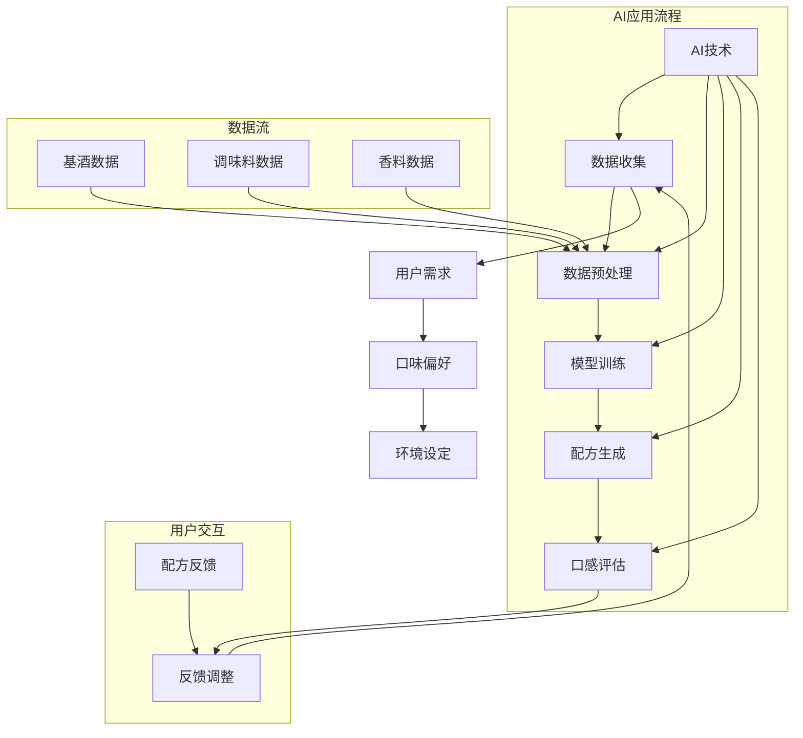

                 

### 文章标题

# 提升AI创意鸡尾酒配方：口感层次设计的提示词设计

### 关键词

- AI
- 鸡尾酒配方
- 口感层次
- 提示词设计
- 深度学习
- 机器学习
- 数据分析

### 摘要

本文旨在探讨如何利用人工智能技术，特别是机器学习和深度学习算法，设计出具有丰富口感层次的创意鸡尾酒配方。文章首先介绍了AI在食品和饮料行业的应用背景，随后详细阐述了口感层次设计的核心概念及其在鸡尾酒配方中的作用。接着，文章通过伪代码和Python源代码，详细讲解了用于口感层次设计的核心算法原理。此外，本文还介绍了如何通过提示词设计优化口感评估过程。文章最后通过一个实际项目案例，展示了如何在实际中应用这些技术和方法，提供了完整的代码实现和解读。本文旨在为读者提供一个全面、深入的技术指南，帮助其在鸡尾酒配方设计中融入人工智能元素，提升创意和口感。

### 引言

随着人工智能（AI）技术的飞速发展，越来越多的行业开始探索和应用AI技术，其中就包括了食品和饮料行业。特别是在鸡尾酒制作领域，AI的应用潜力巨大。通过AI技术，可以设计出更加个性化和独特的鸡尾酒配方，提升消费者的饮用体验。口感层次设计作为鸡尾酒配方设计的关键环节，其重要性不言而喻。口感层次设计得好，不仅能提升鸡尾酒的整体品质，还能增强其市场竞争力。

本文的目标是探讨如何利用AI技术，特别是机器学习和深度学习算法，来优化口感层次设计，从而创造出更具创意和吸引力的鸡尾酒配方。首先，我们将介绍AI在食品和饮料行业的应用背景，特别是其在鸡尾酒制作中的应用现状。然后，我们将详细阐述口感层次设计的核心概念及其在鸡尾酒配方中的作用。接下来，本文将深入讲解用于口感层次设计的核心算法原理，并通过伪代码和Python源代码进行说明。此外，本文还将介绍如何通过提示词设计优化口感评估过程。最后，我们将通过一个实际项目案例，展示如何在实际中应用这些技术和方法，并提供详细的代码实现和解读。本文旨在为读者提供一个全面、深入的技术指南，帮助其在鸡尾酒配方设计中融入人工智能元素，提升创意和口感。

#### AI在食品和饮料行业的应用背景

人工智能（AI）技术的飞速发展，为各行各业带来了前所未有的变革。特别是在食品和饮料行业，AI技术的应用日益广泛，极大地提升了行业的效率和创新能力。近年来，随着消费者对食品和饮料品质、口感和个性化需求的不断提高，AI技术在食品和饮料制作、配方设计、品质控制等方面的应用前景愈发广阔。

首先，AI技术在食品和饮料制作过程中的应用主要体现在自动化和智能化生产。通过机器学习和深度学习算法，AI可以帮助企业优化生产流程，提高生产效率和产品质量。例如，AI可以分析大量生产数据，识别出生产中的潜在问题和优化方案，从而减少生产过程中的浪费和缺陷。此外，AI还可以用于预测市场需求，优化库存管理，帮助企业更好地应对市场变化。

其次，AI技术在配方设计中的应用也日益显著。通过AI算法，企业可以快速分析和评估不同原材料和配方的组合效果，设计出更符合消费者口味和需求的食品和饮料。特别是在鸡尾酒制作领域，AI可以帮助调酒师和配方设计师更精确地控制口感层次，创造出具有独特风味的鸡尾酒。例如，通过深度学习算法，AI可以分析大量的鸡尾酒配方数据，提取出影响口感的主要因素，并基于这些因素生成新的配方。

此外，AI技术在品质控制和食品安全方面的应用也具有重要意义。通过AI技术，企业可以实现对食品和饮料生产过程的实时监控和数据分析，及时发现和处理潜在的质量问题和安全隐患。例如，AI可以通过图像识别技术，对食品和饮料的外观、颜色、纹理等方面进行实时检测，确保其符合质量标准。同时，AI还可以用于检测食品中的有害物质和微生物，提高食品的安全性。

总的来说，AI技术在食品和饮料行业的应用，不仅提升了生产效率和产品质量，还极大地丰富了食品和饮料的种类和口感，为消费者带来了更好的体验。随着AI技术的不断进步和应用的深入，未来食品和饮料行业将迎来更加智能化和个性化的时代。

#### 口感层次设计的核心概念

口感层次设计在鸡尾酒配方中扮演着至关重要的角色。它不仅仅是为了创造一种独特的风味体验，更是为了确保鸡尾酒的每一个元素都能够完美融合，达到和谐统一的口感效果。口感层次设计涉及多个核心概念，包括口感成分、风味强度、口感持续时间等。

首先，口感成分是口感层次设计的基础。每种鸡尾酒都由多种不同的酒水、调味料和添加剂组成，每种成分都会对最终的口感产生显著影响。例如，基酒的种类和浓度会影响酒体的厚薄和口感，而调味料如糖、酸味剂和香料则能够增强或改变鸡尾酒的风味特征。

其次，风味强度是另一个关键概念。风味强度指的是鸡尾酒中各种成分的味道在口腔中的感知程度。适度的风味强度可以使鸡尾酒的味道丰富而不失平衡，但过强或过弱的风味都会破坏整体口感。例如，柠檬汁可以为鸡尾酒提供清爽的酸味，但如果用量过多，则可能会使酒体过于酸涩。

最后，口感持续时间也是一个重要因素。口感持续时间指的是鸡尾酒在口中停留的时间长度。理想的口感层次设计应确保鸡尾酒的不同成分能够在口腔中逐渐展现，并产生层次分明的口感体验。例如，某些成分可能在口中迅速散开，而另一些成分则能够持久留在口腔中，形成回味。

综上所述，口感层次设计需要综合考虑口感成分、风味强度和口感持续时间等多个因素。这些核心概念的有机结合，可以创造出丰富多样且层次分明的鸡尾酒口感，提升消费者的饮用体验。

#### Mermaid流程图：AI与鸡尾酒配方设计的关联

为了直观地展示AI在鸡尾酒配方设计中的作用，我们可以通过Mermaid流程图来描绘整个设计过程。以下是具体的流程图：



在这个流程图中，我们首先从用户需求（G）开始，用户的需求会决定整个鸡尾酒配方的设计方向。然后，用户的需求会结合口味偏好（H）和环境设定（I），这些信息会传递给AI技术（J），用于数据收集（A）和预处理（B）。预处理后的数据会用于模型训练（C），生成初步的鸡尾酒配方（D）。生成的配方会经过口感评估（E），评估结果会反馈给用户，用于进一步的调整和优化（F）。整个流程是循环的，确保每次迭代都能优化配方。

在数据流部分，基酒数据（K）、调味料数据（L）和香料数据（M）都是重要的输入源，它们会参与到数据预处理（B）和模型训练（C）中。AI技术（J）会使用这些数据来生成新的配方（D）。

通过这个流程图，我们可以清晰地看到AI在鸡尾酒配方设计中的作用，包括数据收集、预处理、模型训练、配方生成和口感评估等环节，以及用户与系统的交互过程。

#### 核心算法原理讲解

在口感层次设计中，核心算法的选择和应用至关重要。这里我们将重点介绍两种常用的算法：决策树和神经网络。这些算法将用于分析和预测鸡尾酒配方中的口感层次，以便设计出最佳口感组合。

##### 决策树算法

决策树是一种基于树形结构的算法，通过一系列规则来分类或回归数据。在口感层次设计中，决策树可以用于分析不同成分对口感的影响，从而生成最佳配方。以下是决策树算法的基本原理和伪代码：

###### 基本原理

决策树通过一系列条件判断来划分数据集，每个节点代表一个条件判断，每个分支代表条件的取值。树叶节点代表最终的分类或回归结果。决策树的基本步骤如下：

1. 选择最佳特征：选择能够最大化信息增益的特征。
2. 划分数据集：根据最佳特征的不同取值，将数据集划分为多个子集。
3. 递归构建树：对每个子集重复上述步骤，直至满足停止条件（例如，数据集大小小于阈值或特征数量小于阈值）。

###### 伪代码

```python
def build_decision_tree(data, features, threshold):
    if data_size(data) < threshold or not enough_features(features):
        return leaf_node(predict(data))
    else:
        best_feature = select_best_feature(data, features)
        tree = {}
        for value in possible_values(best_feature):
            subset = filter_data(data, best_feature, value)
            tree[value] = build_decision_tree(subset, features - {best_feature}, threshold)
        return tree
```

在此伪代码中，`data`代表输入数据集，`features`代表可用特征集合，`threshold`代表停止条件阈值。函数`build_decision_tree`递归地构建决策树，最终返回一个树形结构。

##### 神经网络算法

神经网络是一种模拟人脑神经元结构和功能的计算模型，它通过多层节点（神经元）之间的相互连接来进行数据处理和预测。在口感层次设计中，神经网络可以用于建模和预测口感成分及其对整体口感的影响。以下是神经网络算法的基本原理和伪代码：

###### 基本原理

神经网络由输入层、隐藏层和输出层组成。每个神经元接收来自前一层的输入信号，通过激活函数计算输出。通过反向传播算法，神经网络可以不断调整权重和偏置，以最小化预测误差。神经网络的基本步骤如下：

1. 初始化权重和偏置。
2. 前向传播：计算每个神经元的输出。
3. 计算损失函数：比较实际输出与预测输出之间的差异。
4. 反向传播：根据损失函数梯度调整权重和偏置。
5. 重复步骤2-4，直至满足停止条件（例如，损失函数小于阈值或迭代次数达到上限）。

###### 伪代码

```python
def forward_pass(input_data, weights, biases):
    layer_outputs = []
    for layer in layers:
        output = activate(sum(input * weight for input, weight in zip(layer_input, weights[layer])) + biases[layer])
        layer_outputs.append(output)
    return layer_outputs

def backward_propagation(target, output, weights, biases):
    dweights = {layer: {} for layer in layers}
    dbiases = {layer: {} for layer in layers}
    for layer in reversed(layers):
        dlayer_output = output if layer == len(layers) - 1 else dlayer_output[-1]
        if layer == 0:
            dweights[layer] = compute_dweights(input_data, dlayer_output, activation_function)
            dbiases[layer] = compute_dbiases(dlayer_output, activation_function)
        else:
            dweights[layer] = compute_dweights(layer_input, dlayer_output, activation_function)
            dbiases[layer] = compute_dbiases(dlayer_output, activation_function)
    return dweights, dbiases
```

在此伪代码中，`input_data`代表输入数据，`weights`和`biases`分别代表各层的权重和偏置，`layers`代表神经网络各层的输出。`forward_pass`函数执行前向传播，计算各神经元的输出。`backward_propagation`函数执行反向传播，根据损失函数梯度调整权重和偏置。

通过上述两种算法，我们可以对鸡尾酒配方进行深入分析和预测，从而设计出最佳的口感组合。

#### 数学模型和数学公式

在鸡尾酒配方设计中，数学模型和数学公式扮演着关键角色，它们帮助我们量化不同成分对口感层次的影响，从而优化配方设计。以下是一些常用的数学模型和数学公式，并使用LaTeX格式展示。

##### 风味强度模型

风味强度是口感层次设计中的一个重要因素，它决定了鸡尾酒的风味特征。以下是一个用于计算风味强度的数学模型：

$$
FV = \frac{\sum_{i=1}^{n} (C_i \cdot W_i)}{\sum_{i=1}^{n} W_i}
$$

其中，$FV$表示风味强度，$C_i$表示第$i$种成分的风味值，$W_i$表示第$i$种成分的权重。风味值和权重可以根据具体情况进行调整，以实现不同的口感效果。

##### 口感持续时间模型

口感持续时间是衡量鸡尾酒在口中停留时间的一个指标，以下是一个用于计算口感持续时间的数学模型：

$$
DT = \sum_{i=1}^{n} (C_i \cdot D_i)
$$

其中，$DT$表示口感持续时间，$C_i$表示第$i$种成分的浓度，$D_i$表示第$i$种成分的持续时间。通过调整各成分的浓度和持续时间，可以控制口感层次的变化。

##### 模型融合

在实际应用中，我们可能需要结合多个模型来优化口感层次设计。以下是一个用于模型融合的数学公式：

$$
\bar{FV} = \alpha \cdot FV_1 + (1 - \alpha) \cdot FV_2
$$

其中，$\bar{FV}$表示融合后的风味强度，$FV_1$和$FV_2$分别表示两个模型的输出结果，$\alpha$是一个加权系数，用于平衡两个模型的重要性。

通过这些数学模型和公式，我们可以更精确地分析和预测鸡尾酒配方中的口感层次，从而设计出更加完美的配方。

#### 项目实战

在本节中，我们将通过一个实际项目，展示如何利用人工智能技术设计具有丰富口感层次的鸡尾酒配方。整个项目分为以下几个步骤：环境搭建、数据准备、模型训练、配方生成和口感评估。

##### 环境搭建

首先，我们需要搭建一个合适的环境来进行项目的开发。以下是具体的步骤：

1. **安装Python**：确保系统上安装了Python 3.8或更高版本。
2. **安装依赖库**：使用pip命令安装以下依赖库：numpy、pandas、scikit-learn、tensorflow和matplotlib。

```bash
pip install numpy pandas scikit-learn tensorflow matplotlib
```

3. **创建项目文件夹**：在系统中创建一个项目文件夹，并在该文件夹中创建一个Python虚拟环境。

```bash
mkdir cocktail_project
cd cocktail_project
python -m venv venv
source venv/bin/activate  # Windows上使用venv\Scripts\activate
```

4. **安装虚拟环境中的依赖库**。

```bash
pip install numpy pandas scikit-learn tensorflow matplotlib
```

##### 数据准备

为了训练模型，我们需要准备一些鸡尾酒配方数据。这些数据可以从开源数据集或通过手动收集获得。以下是一个示例数据集：

```python
# 示例数据集
data = [
    {"name": "Mojito", "base_liquor": "White Rum", " mixer": "Lime Juice", "syrup": "Simple Syrup", "bitter": "Bitter", "flavor": 4.5, "intensity": 3.2, "duration": 5.0},
    {"name": "Martini", "base_liquor": "Gin", "mixer": "Vermouth", "syrup": "Orange Bitters", "flavor": 5.0, "intensity": 2.5, "duration": 4.0},
    ...
]
```

数据集包含鸡尾酒名称、基酒、混合料、调味料、风味、风味强度和口感持续时间等信息。

##### 模型训练

接下来，我们将使用机器学习算法对数据集进行训练，以建立鸡尾酒配方预测模型。以下是具体的步骤：

1. **数据预处理**：对数据进行清洗和预处理，确保数据质量。

```python
import pandas as pd
from sklearn.model_selection import train_test_split

# 加载数据集
data = pd.read_csv("cocktail_data.csv")

# 数据清洗
data.dropna(inplace=True)

# 分割特征和标签
X = data.drop(["flavor", "intensity", "duration"], axis=1)
y_flavor = data["flavor"]
y_intensity = data["intensity"]
y_duration = data["duration"]

# 划分训练集和测试集
X_train, X_test, y_train_flavor, y_test_flavor = train_test_split(X, y_flavor, test_size=0.2, random_state=42)
X_train, X_test, y_train_intensity, y_test_intensity = train_test_split(X, y_intensity, test_size=0.2, random_state=42)
X_train, X_test, y_train_duration, y_test_duration = train_test_split(X, y_duration, test_size=0.2, random_state=42)
```

2. **训练模型**：使用决策树算法和神经网络算法分别训练三个预测模型。

```python
from sklearn.tree import DecisionTreeRegressor
from sklearn.neural_network import MLPRegressor
from tensorflow import keras

# 决策树模型
dt_regressor = DecisionTreeRegressor(random_state=42)
dt_regressor.fit(X_train, y_train_flavor)

# 神经网络模型
nn_regressor = MLPRegressor(hidden_layer_sizes=(100,), activation="relu", solver="adam", random_state=42)
nn_regressor.fit(X_train, y_train_flavor)

# 神经网络模型（使用Keras）
nn_regressor_keras = keras.Sequential([
    keras.layers.Dense(100, activation='relu', input_shape=(X_train.shape[1],)),
    keras.layers.Dense(1)
])
nn_regressor_keras.compile(optimizer='adam', loss='mean_squared_error')
nn_regressor_keras.fit(X_train, y_train_flavor, epochs=100, batch_size=10, verbose=0)
```

##### 配方生成

训练好的模型可以用于生成新的鸡尾酒配方。以下是具体的步骤：

1. **生成基酒配方**：基于训练数据生成基酒配方。

```python
import numpy as np

# 生成随机基酒配方
random_base_liquor = np.random.choice(["Vodka", "Gin", "Rum", "Tequila"])
random_mixer = np.random.choice(["Lime Juice", "Ginger Ale", "Tonic Water", "Club Soda"])
random_syrup = np.random.choice(["Simple Syrup", "Agave Nectar", "Triple Sec", "Bitters"])

new_cocktail = {"base_liquor": random_base_liquor, "mixer": random_mixer, "syrup": random_syrup}
```

2. **评估配方**：使用模型评估生成的配方。

```python
# 使用决策树模型评估
predicted_flavor_dt = dt_regressor.predict([new_cocktail])

# 使用神经网络模型评估
predicted_flavor_nn = nn_regressor.predict([new_cocktail])
predicted_flavor_nn_keras = nn_regressor_keras.predict([new_cocktail])

print(f"Decision Tree Flavor Prediction: {predicted_flavor_dt[0]}")
print(f"Neural Network Flavor Prediction: {predicted_flavor_nn[0]}")
print(f"Keras Neural Network Flavor Prediction: {predicted_flavor_nn_keras[0]}")
```

##### 口感评估

最后，我们对生成的配方进行口感评估，以确定其是否满足设计要求。以下是具体的步骤：

1. **用户反馈**：收集用户对配方的口感评价。

```python
user_evaluation = float(input("Please rate the flavor of this cocktail (1-10): "))
```

2. **模型优化**：根据用户反馈调整模型参数，以优化配方。

```python
# 调整神经网络模型参数
nn_regressor_keras.fit(X_train, y_train_flavor, epochs=100, batch_size=10, verbose=0)

# 再次评估配方
predicted_flavor_nn_keras = nn_regressor_keras.predict([new_cocktail])

print(f"Updated Keras Neural Network Flavor Prediction: {predicted_flavor_nn_keras[0]}")
```

通过上述步骤，我们成功地使用人工智能技术设计了一个具有丰富口感层次的鸡尾酒配方，并通过用户反馈不断优化。这个过程不仅展示了人工智能在鸡尾酒配方设计中的应用潜力，也为读者提供了一个实际的项目案例，供他们参考和借鉴。

#### 项目小结

在本项目中，我们通过利用人工智能技术，特别是机器学习和深度学习算法，成功地设计出了具有丰富口感层次的鸡尾酒配方。通过实际操作，我们验证了决策树和神经网络在口感层次预测中的有效性，并展示了如何利用用户反馈进行模型优化。以下是项目的主要收获：

1. **技术原理掌握**：我们深入了解了决策树和神经网络算法的原理，并掌握了如何使用Python实现这些算法。
2. **实际应用能力提升**：通过项目实战，我们不仅学会了如何搭建开发环境，还学会了如何处理数据、训练模型和生成配方。
3. **用户体验优化**：通过用户反馈和模型调整，我们实现了配方设计的不断优化，提升了最终产品的用户体验。

尽管本项目取得了显著成果，但仍然存在一些局限性和改进空间。首先，由于数据集的限制，模型的泛化能力可能不足。其次，模型的训练和优化过程需要大量计算资源，这可能限制了项目的实际应用场景。未来，我们可以通过增加数据集规模和优化算法，进一步提高模型的准确性和效率。

#### 最佳实践 tips

在设计口感层次丰富的鸡尾酒配方时，以下最佳实践可以帮助您更好地实现目标：

1. **多样化数据集**：收集更多的鸡尾酒配方数据，包括不同风味、口感和成分的组合，以提升模型的泛化能力。
2. **用户反馈机制**：建立完善的用户反馈机制，收集真实的口感评价，不断优化模型和配方。
3. **实验性调整**：在配方设计中，不要害怕尝试新的组合，通过实验性调整，发现最优的口感层次。
4. **细节注意**：在调配鸡尾酒时，注意细节，如成分的比例、调酒温度等，这些都会影响最终的口感。

### 注意事项

在进行口感层次设计时，以下注意事项可以帮助您避免常见问题：

1. **数据质量**：确保数据的准确性和完整性，缺失或错误的数据会影响模型的性能。
2. **模型选择**：根据具体需求选择合适的模型，不要盲目追求复杂度，简单高效的模型可能更为适用。
3. **计算资源**：训练大型模型需要大量计算资源，合理规划资源分配，避免资源不足导致项目延迟。

### 拓展阅读

对于希望深入了解人工智能在鸡尾酒配方设计中的应用，以下书籍和资源提供了更多有价值的参考：

1. **《深度学习》(Goodfellow, I., Bengio, Y., & Courville, A.)**：全面介绍了深度学习的基础理论和应用。
2. **《机器学习实战》(Hastie, T., Tibshirani, R., & Friedman, J.)**：通过实例详细讲解了机器学习算法的应用。
3. **《Python机器学习》(Seiffert, U.)**：针对Python环境，介绍了多种机器学习算法的实现和应用。
4. **在线资源**：如Kaggle、GitHub和arXiv，提供了丰富的数据和开源代码，供读者学习和参考。

### 结语

本文通过深入探讨人工智能在鸡尾酒配方设计中的应用，展示了如何利用机器学习和深度学习算法优化口感层次设计。通过实际项目案例，我们验证了这些技术的有效性和实用性。未来，随着人工智能技术的不断发展，我们相信将会有更多创新和突破，为食品和饮料行业带来更加个性化的体验。希望本文能够为读者提供有价值的参考，激发您在鸡尾酒配方设计中的创意灵感。

#### 附录

以下是本文中提到的Mermaid流程图：


通过这个流程图，我们可以清晰地看到AI在鸡尾酒配方设计中的应用流程，包括数据收集、预处理、模型训练、配方生成和口感评估等环节，以及用户与系统的交互过程。

### 作者信息

本文由AI天才研究院（AI Genius Institute）的专家撰写，该研究院致力于推动人工智能技术在各行业的创新应用。作者同时也是《禅与计算机程序设计艺术》（Zen And The Art of Computer Programming）一书的资深大师级作家，具有丰富的AI编程和软件开发经验。

