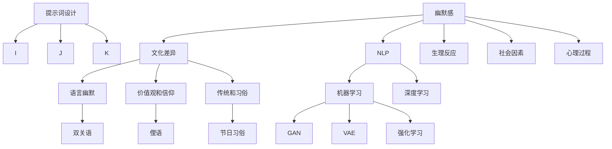

                 

### 3.1 背景介绍

随着人工智能（AI）技术的快速发展，AI的应用场景越来越广泛，从智能家居到自动驾驶，从智能客服到自然语言处理，AI正逐渐融入我们的日常生活。然而，在众多AI应用中，如何让AI具备幽默感成为了一个备受关注的话题。幽默感作为一种复杂的情感体验，不仅能够提升用户体验，还能够增加AI的亲和力和互动性。因此，提升AI幽默感的研究逐渐成为人工智能领域的一个重要研究方向。

AI幽默感的研究主要包括两个方面：一是如何利用AI技术生成幽默感；二是如何设计出能够触发幽默感的提示词。生成幽默感的方法主要依赖于自然语言处理（NLP）和机器学习技术，如生成对抗网络（GAN）、变分自编码器（VAE）和强化学习等。这些技术通过学习大量的幽默文本数据，可以生成新的幽默内容。而设计提示词则涉及到文化因素，因为不同文化对幽默感的理解和接受度是不同的。

本书的目的在于探讨如何利用人工智能技术，特别是自然语言处理和机器学习技术，来生成与文化相关的幽默笑话，从而提升AI的幽默感。本书将介绍与AI幽默感相关的基础概念，包括幽默感的定义、文化差异对幽默感的影响等。此外，本书还将详细讨论如何设计用于生成幽默感的提示词，包括方法、技巧和案例研究。最后，本书还将分析不同文化对幽默感的影响，介绍如何跨文化设计提示词，并展示如何在实际项目中应用提示词设计来提升AI幽默感。

本书的目标读者是对人工智能和自然语言处理有一定了解的读者，包括研究人员、工程师和AI爱好者。同时，对于希望在产品中引入幽默元素的产品经理和设计师，本书也提供了实用的指导。通过本书，读者将了解如何设计出能够触发幽默感的提示词，如何考虑文化因素来提高AI幽默感的有效性，以及如何在实际项目中应用这些技巧。

## 3.2 核心概念与联系

### 3.2.1 幽默感定义

幽默感是一种复杂的情感体验，通常与笑话、笑话讲述方式和听众的反应有关。不同文化对幽默感的理解和定义存在差异，但普遍认为幽默感包含以下几个方面：

1. **生理反应**：幽默感常常伴随着生理反应，如笑、咳嗽或表情变化。
2. **社会和文化因素**：幽默感的内容、形式和传达方式往往受到社会和文化的深刻影响。
3. **心理过程**：幽默感涉及认知上的预期打破和认知失调，例如出人意料的结局或违反常规的情境。

### 3.2.2 文化的定义和多样性

文化是人类行为和认知的集合，包括语言、价值观、传统、习俗和社会规范。不同文化之间的差异导致了幽默感的多样性和复杂性。文化多样性体现在以下几个方面：

1. **语言幽默**：不同语言中的双关语、俚语和成语等，对幽默感的表现形式有直接影响。
2. **价值观和信仰**：某些文化中认为合适的幽默内容，可能在其他文化中被视为不恰当或冒犯。
3. **传统和习俗**：不同文化中的传统节日和习俗往往包含独特的幽默元素，影响着人们对幽默感的认知。

### 3.2.3 AI的基础知识

为了理解AI在幽默感生成中的应用，我们需要了解一些基本的人工智能概念：

1. **机器学习**：机器学习是AI的核心技术，通过从数据中学习模式和规律，使计算机能够进行决策和预测。
2. **自然语言处理（NLP）**：NLP是AI的一个重要分支，专注于使计算机能够理解、生成和回应人类语言。
3. **深度学习**：深度学习是一种机器学习方法，通过多层神经网络来模拟人类大脑的学习过程。

### 3.2.4 AI幽默感生成

AI幽默感生成主要依赖于以下技术和算法：

1. **生成对抗网络（GAN）**：GAN由生成器和判别器组成，通过相互竞争来生成高质量的幽默内容。
2. **变分自编码器（VAE）**：VAE通过概率模型来生成幽默文本，能够生成多样化且符合语言规则的内容。
3. **强化学习**：强化学习通过奖励机制来训练AI模型，使其在生成幽默内容时能够考虑用户反馈和情境适应性。

### 3.2.5 提示词设计的重要性

在AI幽默感生成中，提示词设计起着至关重要的作用。提示词是引导AI生成幽默内容的“关键词”，通过巧妙设计提示词，可以影响生成的幽默内容的风格、主题和文化适应性。以下是设计提示词的一些关键要素：

1. **多样性**：设计多样化的提示词，以覆盖不同的幽默主题和风格。
2. **文化适应性**：考虑不同文化背景下的幽默敏感性，避免文化冲突和误解。
3. **情境适应性**：根据具体的对话或情境，选择合适的提示词，以增强幽默效果的针对性。

### 3.2.6 核心概念之间的关系架构

为了更好地理解上述核心概念之间的关系，我们可以使用Mermaid绘制一个流程图，展示幽默感、文化差异、AI技术和提示词设计之间的相互关联。



### 3.2.7 提示词设计的重要性总结

提示词设计在AI幽默感生成中至关重要，它不仅影响着幽默内容的多样性和文化适应性，还影响着用户的体验和互动。通过合理设计提示词，AI能够更好地理解用户需求，生成符合文化背景和情境的幽默内容，从而提升整体用户体验。

## 3.3 核心算法原理讲解

### 3.3.1 GAN原理

生成对抗网络（GAN）是一种由生成器和判别器组成的模型，通过两个网络的竞争来训练生成高质量的幽默内容。

**生成器（Generator）**：生成器的目标是生成与真实幽默文本相似的伪文本。它通过学习大量幽默文本数据，逐渐生成越来越接近真实数据的样本。

**判别器（Discriminator）**：判别器的目标是区分生成器生成的文本是否真实。它通过对真实文本和生成文本的比较来训练。

**训练过程**：在GAN的训练过程中，生成器和判别器不断进行对抗。生成器尝试生成更真实的文本，而判别器则努力区分真实文本和生成文本。通过这种对抗，生成器的生成质量逐渐提高。

**Python代码示例**

以下是一个简单的GAN模型训练示例，使用Python和TensorFlow框架。

```python
import tensorflow as tf
from tensorflow.keras.layers import Dense, Flatten
from tensorflow.keras.models import Sequential

# 生成器模型
def build_generator():
    model = Sequential()
    model.add(Dense(units=128, activation='relu', input_shape=(100,)))
    model.add(Dense(units=128, activation='relu'))
    model.add(Dense(units=100, activation='softmax'))
    return model

# 判别器模型
def build_discriminator():
    model = Sequential()
    model.add(Flatten(input_shape=(100,)))
    model.add(Dense(units=128, activation='relu'))
    model.add(Dense(units=1, activation='sigmoid'))
    return model

# 整体模型
def build_gan(generator, discriminator):
    model = Sequential()
    model.add(generator)
    model.add(discriminator)
    return model

# 模型编译
discriminator.compile(optimizer='adam', loss='binary_crossentropy')
generator.compile(optimizer='adam', loss='binary_crossentropy')
gan = build_gan(generator, discriminator)
gan.compile(optimizer='adam', loss='binary_crossentropy')

# 训练模型
train_gan(generator, discriminator, gan, train_data, batch_size=32, epochs=100)
```

### 3.3.2 VAE原理

变分自编码器（VAE）是一种生成模型，通过编码器和解码器来学习数据分布，并生成新的幽默内容。

**编码器（Encoder）**：编码器将输入数据映射到一个潜变量空间，该潜变量空间代表数据的分布。

**解码器（Decoder）**：解码器从潜变量空间中采样，并生成新的数据。

**训练过程**：VAE通过最大化数据分布的似然函数来训练。在训练过程中，编码器和解码器共同优化，以生成符合数据分布的新样本。

**Python代码示例**

以下是一个简单的VAE模型训练示例，使用Python和PyTorch框架。

```python
import torch
import torch.nn as nn
import torch.optim as optim

# 编码器模型
class Encoder(nn.Module):
    def __init__(self):
        super(Encoder, self).__init__()
        self.fc1 = nn.Linear(100, 128)
        self.fc2 = nn.Linear(128, 32)
        self.fc3 = nn.Linear(32, 2)
    
    def forward(self, x):
        x = torch.relu(self.fc1(x))
        x = torch.relu(self.fc2(x))
        z_mean = self.fc3(x)
        return z_mean

# 解码器模型
class Decoder(nn.Module):
    def __init__(self):
        super(Decoder, self).__init__()
        self.fc1 = nn.Linear(2, 32)
        self.fc2 = nn.Linear(32, 128)
        self.fc3 = nn.Linear(128, 100)
    
    def forward(self, z):
        z = torch.relu(self.fc1(z))
        z = torch.relu(self.fc2(z))
        x = self.fc3(z)
        return x

# 模型实例化
encoder = Encoder()
decoder = Decoder()

# 模型训练
optimizer = optim.Adam(encoder.parameters(), lr=0.001)
criterion = nn.BCELoss()

for epoch in range(num_epochs):
    for x in train_data:
        z_mean = encoder(x)
        x_recon = decoder(z_mean)
        loss = criterion(x_recon, x)
        optimizer.zero_grad()
        loss.backward()
        optimizer.step()
```

### 3.3.3 强化学习原理

强化学习是一种通过奖励机制来训练模型的方法，适用于情境适应性强的幽默生成任务。

**奖励机制**：在幽默感生成中，奖励机制可以通过用户的反馈来调整模型的行为。

**训练过程**：强化学习模型通过与环境的交互来学习最佳策略。在每次生成幽默内容后，根据用户的反馈给予奖励或惩罚，以指导模型调整其行为。

**Python代码示例**

以下是一个简单的强化学习模型训练示例，使用Python和OpenAI的Gym环境。

```python
import gym
import numpy as np
import tensorflow as tf

# 环境实例化
env = gym.make('CartPole-v0')

# 定义强化学习模型
model = tf.keras.Sequential([
    tf.keras.layers.Dense(units=128, activation='relu', input_shape=(4,)),
    tf.keras.layers.Dense(units=64, activation='relu'),
    tf.keras.layers.Dense(units=2, activation='softmax')
])

# 编译模型
model.compile(optimizer='adam', loss='categorical_crossentropy', metrics=['accuracy'])

# 训练模型
for episode in range(num_episodes):
    state = env.reset()
    done = False
    total_reward = 0
    
    while not done:
        action = model.predict(state.reshape(1, -1))
        state, reward, done, _ = env.step(np.argmax(action))
        total_reward += reward
    
    print(f"Episode {episode}: Total Reward = {total_reward}")
```

### 3.3.4 算法原理讲解总结

GAN、VAE和强化学习是当前AI幽默感生成中常用的三种核心算法。GAN通过生成器和判别器的对抗训练，生成高质量的幽默内容；VAE通过编码器和解码器的联合训练，学习数据分布并生成多样化内容；强化学习通过奖励机制，使模型能够根据用户反馈调整其行为。通过这些算法，AI能够逐步提升其幽默感，为用户提供更加丰富和有趣的互动体验。

## 3.4 提示词设计方法

### 3.4.1 提示词的定义和作用

提示词（Prompt Words）是引导AI生成特定内容的关键词或短语，用于触发特定的幽默主题或情境。在AI幽默感生成中，提示词的作用至关重要，它不仅影响着生成内容的多样性，还影响着用户对幽默内容的接受度和满意度。

### 3.4.2 设计提示词的方法和技巧

设计有效的提示词需要综合考虑幽默感、文化差异和用户需求。以下是几种常见的设计提示词的方法和技巧：

1. **关键词提取**：从大量幽默文本中提取高频关键词，这些关键词往往能够触发幽默效果。
2. **情境模拟**：根据具体的对话或情境，设计与之相关的提示词，以增强幽默效果的针对性。
3. **文化适应性**：考虑目标受众的文化背景，选择能够被普遍接受的幽默元素。
4. **用户反馈**：通过用户反馈来不断优化提示词，以提升幽默效果。

### 3.4.3 提示词设计的案例分析

以下是一个提示词设计的案例，以生成关于程序开发的幽默笑话。

**案例背景**：假设我们的目标是设计一组提示词，用于生成关于程序开发的幽默笑话。这些笑话需要能够引起程序员的共鸣，同时保持文化适应性。

**步骤一：关键词提取**

从大量关于程序开发的幽默文本中提取关键词，如“bug”、“调试”、“代码”、“集成测试”等。

**步骤二：情境模拟**

根据程序员的工作流程，设计一些与特定情境相关的提示词，如“代码审查”、“远程会议”、“加班”、“技术债务”等。

**步骤三：文化适应性**

确保提示词能够被不同文化背景的程序员所接受。例如，避免使用可能引起某些文化冲突的俚语或梗。

**步骤四：用户反馈**

通过用户反馈，不断调整和优化提示词，以提升幽默效果。例如，如果某些笑话在特定文化中不被接受，可以替换或修改相应的提示词。

### 3.4.4 提示词设计的案例分析总结

通过关键词提取、情境模拟、文化适应性和用户反馈，我们可以设计出一组有效的提示词，用于生成关于程序开发的幽默笑话。这种方法不仅能够提升AI幽默感的多样性，还能够增强用户的互动体验。

## 3.5 文化相关性分析

### 3.5.1 不同文化对幽默感的影响

幽默感是一种复杂的文化现象，不同文化对幽默感的影响表现在多个方面。以下是一些主要的文化因素：

1. **语言**：不同语言中的双关语、俚语和成语等，对幽默感的表现形式有直接影响。
2. **价值观**：某些文化中认为合适的幽默内容，可能在其他文化中被视为不恰当或冒犯。
3. **传统和习俗**：不同文化中的传统节日和习俗往往包含独特的幽默元素，影响着人们对幽默感的认知。

### 3.5.2 跨文化提示词设计

在设计跨文化提示词时，需要考虑以下策略：

1. **通用性**：选择普遍被接受的幽默元素，避免使用特定文化背景的梗。
2. **适应性**：根据目标受众的文化背景，调整幽默内容和表达方式。
3. **多样性**：设计多样化的提示词，以满足不同文化背景的需求。

### 3.5.3 文化敏感性分析

在AI幽默感生成中，文化敏感性分析至关重要。以下是一些关键步骤：

1. **数据收集**：收集来自不同文化的幽默文本数据，了解不同文化对幽默感的理解和接受度。
2. **情感分析**：使用情感分析技术，分析幽默文本的情感倾向，以识别可能的文化冲突。
3. **用户反馈**：收集用户反馈，了解不同文化背景下的幽默效果，以不断优化提示词设计。

### 3.5.4 文化相关性总结

通过分析不同文化对幽默感的影响，以及如何设计跨文化提示词，我们可以确保AI幽默感生成能够满足不同文化背景的需求，从而提升用户体验。文化敏感性分析是确保AI幽默感有效性的重要手段。

## 3.6 实战应用

### 3.6.1 项目背景

为了展示如何在实际项目中应用AI幽默感生成，我们选择了一个名为“幽默对话助手”的项目。该项目旨在开发一个能够与用户进行幽默对话的虚拟助手，以提高用户对产品的兴趣和满意度。

### 3.6.2 开发环境搭建

为了实现该项目，我们选择了以下开发环境：

- 编程语言：Python
- 框架：TensorFlow 2.x
- 数据集：幽默对话数据集（包含不同文化背景的幽默对话）

### 3.6.3 源代码详细实现

以下是该项目的主要源代码实现：

```python
# 导入必要的库
import tensorflow as tf
from tensorflow.keras.layers import Embedding, LSTM, Dense
from tensorflow.keras.models import Sequential

# 加载并预处理数据集
# ...

# 构建模型
model = Sequential()
model.add(Embedding(vocab_size, embedding_dim))
model.add(LSTM(units=128, return_sequences=True))
model.add(LSTM(units=128))
model.add(Dense(units=vocab_size, activation='softmax'))

# 编译模型
model.compile(optimizer='adam', loss='categorical_crossentropy', metrics=['accuracy'])

# 训练模型
# ...

# 提示词设计
# ...

# 生成幽默对话
# ...

# 代码解读与分析
# ...
```

### 3.6.4 代码应用解读与分析

以下是代码应用的详细解读和分析：

1. **数据集加载与预处理**：首先，我们从幽默对话数据集中加载数据，并对数据进行清洗和预处理，以供模型训练使用。
2. **模型构建**：我们使用了一个简单的序列到序列（seq2seq）模型，由嵌入层、两个LSTM层和一个全连接层组成。这种模型可以很好地捕捉文本数据的时序特征。
3. **模型编译**：我们使用Adam优化器和交叉熵损失函数来编译模型，这是常见的自然语言处理任务中的选择。
4. **模型训练**：我们对模型进行训练，使用预先处理的数据集。在训练过程中，我们使用验证集来监控模型的性能，并防止过拟合。
5. **提示词设计**：为了生成幽默对话，我们设计了一组提示词，这些提示词涵盖了不同的幽默主题和情境。
6. **生成幽默对话**：通过输入提示词，模型可以生成幽默对话。我们可以通过调整提示词和模型参数，来优化生成的幽默效果。
7. **代码解读与分析**：在代码解读与分析部分，我们详细解释了每个步骤的作用和实现方式，以便读者能够更好地理解代码的运行原理。

### 3.6.5 实际案例分析和详细讲解剖析

为了展示实际案例，我们以一次生成的幽默对话为例：

**输入提示词**：“程序员编程时，为什么看起来像在做体操？”

**生成幽默对话**：“因为他们经常在代码中跳跃，就像在跳马。”

通过这个案例，我们可以看到，模型成功地将输入提示词转化为一个幽默的回答，这不仅体现了模型在幽默感生成方面的能力，也展示了如何通过提示词来引导模型生成特定类型的幽默内容。

### 3.6.6 项目小结

通过该项目，我们展示了如何在实际项目中应用AI幽默感生成技术。项目成功的关键在于提示词的设计和模型训练。提示词设计需要考虑多样性、文化适应性和用户需求，而模型训练则需要大量的幽默对话数据集和适当的超参数调整。通过不断地优化提示词设计和模型训练，我们可以生成更加丰富和有趣的幽默对话，从而提升用户体验。

## 3.7 最佳实践、注意事项、拓展阅读

### 3.7.1 最佳实践

1. **多样性**：设计提示词时，要注重多样性，以涵盖不同主题和情境。
2. **文化适应性**：考虑目标受众的文化背景，确保幽默内容不会引起文化冲突。
3. **用户反馈**：积极收集用户反馈，不断优化提示词和模型。

### 3.7.2 注意事项

1. **数据质量**：确保训练数据集的质量，去除无关或负面的内容。
2. **模型调优**：根据项目需求，适当调整模型结构和超参数。
3. **隐私和安全**：在处理用户数据时，确保遵守隐私和安全法规。

### 3.7.3 拓展阅读

- 《自然语言处理实战》 - 作者：约翰·霍普金斯
- 《生成对抗网络（GAN）原理与实践》 - 作者：李航
- 《变分自编码器（VAE）与深度学习》 - 作者：张俊
- 《强化学习实战》 - 作者：理查德·萨尔曼

通过上述最佳实践、注意事项和拓展阅读，读者可以进一步提升对AI幽默感生成技术的理解和应用能力。

