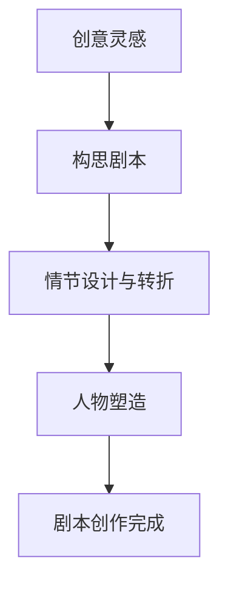

                 

## 《提升AI电影剧本创作：情节转折和人物塑造的提示词工程》

> **关键词**：AI电影剧本、情节转折、人物塑造、提示词工程、机器学习

**摘要**：
本文旨在探讨如何通过AI技术提升电影剧本创作，特别是情节转折和人物塑造方面的质量。我们将深入分析AI在电影剧本创作中的应用，介绍人物塑造与提示词工程的基础理论，详细讲解AI在情节转折优化中的应用，并通过实际案例研究和未来展望，探讨AI电影剧本创作的潜力与挑战。

## 第一部分：AI与电影剧本创作概述

### 第1章：AI在电影剧本创作中的应用

#### 1.1 AI电影剧本创作的重要性

在数字化的今天，AI技术在电影剧本创作中正逐渐崭露头角。通过大数据分析和机器学习算法，AI能够为剧本创作提供全新的视角和手段，从而提升创作效率和质量。以下是从几个方面概述AI在电影剧本创作中的重要性：

- **创意灵感生成**：AI可以通过分析大量数据，发现隐藏的流行趋势和观众喜好，为剧本创作者提供创新的创意灵感。
- **情节设计与优化**：AI可以预测哪些情节转折能够吸引观众，从而优化剧本结构，提高观众的观影体验。
- **人物塑造与对话生成**：通过机器学习模型，AI能够生成丰富多样的人物形象和对话，为剧本创作提供更加真实和饱满的角色。
- **协作与辅助**：AI可以作为剧本创作者的助理，帮助完成一些繁琐的重复性工作，如提示词生成、剧本校对等。

#### 1.2 AI在剧本创作领域的应用现状

目前，AI在电影剧本创作中的应用已经取得了显著的进展。例如，一些电影制作公司已经开始使用AI算法来分析观众反馈，从而优化剧本的情节和角色设计。此外，一些AI工具如Journey Creator和ScriptBot等，已经开始被应用于剧本的构思、情节设计和对话生成。

尽管如此，AI在电影剧本创作中的应用仍然面临一些挑战，如算法的公平性、创意的独特性等。这些问题需要进一步的研究和解决。

#### 1.3 AI在剧本创作中的潜力与挑战

AI在电影剧本创作中的潜力主要表现在以下几个方面：

- **个性化创作**：通过大数据分析，AI可以更好地了解不同观众的喜好，从而实现更加个性化的剧本创作。
- **多语言支持**：AI可以帮助创作者轻松地将剧本翻译成多种语言，实现全球化的电影发行。
- **实时反馈**：通过AI算法，创作者可以实时获取观众的反馈，从而快速调整剧本。

然而，AI在剧本创作中也面临着一些挑战：

- **创意限制**：尽管AI能够生成大量的创意，但这些创意可能受到算法和数据集的限制，缺乏人类的独特视角。
- **情感表达**：人物的情感表达和对话生成是剧本创作的重要部分，目前AI在这方面的表现仍有待提高。
- **伦理与道德**：AI在剧本创作中的应用需要遵循一定的伦理和道德标准，以确保作品的正当性和社会的接受度。

### 第2章：AI电影剧本创作流程

#### 2.1 创意灵感与剧本构思

剧本创作通常从创意灵感的产生开始。在这一阶段，AI可以发挥重要作用。以下是如何使用AI生成创意灵感和构思剧本：

- **大数据分析**：通过分析大量的电影剧本、观众评论、社交媒体数据等，AI可以发现隐藏的流行趋势和观众喜好，从而为剧本创作者提供创意灵感。
- **随机生成**：AI可以通过随机组合不同的元素，如时间、地点、人物等，生成独特的创意。
- **故事生成算法**：一些AI工具如Journey Creator，可以通过算法生成完整的剧本故事线，为创作者提供参考。

在剧本构思阶段，AI可以帮助创作者快速构建故事框架，包括主题、情节、角色等。通过这种方式，创作者可以在短时间内完成初步的剧本构思，节省大量的时间和精力。

#### 2.2 情节设计与情节转折

情节设计是剧本创作中的关键环节。在这一阶段，AI可以通过以下方式提升剧本的质量：

- **情节预测**：AI可以通过分析大量成功的电影剧本，预测哪些情节转折能够吸引观众。创作者可以利用这些预测来优化自己的剧本结构。
- **情感分析**：AI可以通过情感分析技术，评估不同情节转折引起的情感反应，从而帮助创作者选择最适合的情节。
- **自动化编辑**：AI可以自动识别剧本中的冗余和逻辑错误，提出修改建议，帮助创作者提升剧本的流畅性和逻辑性。

情节转折是剧本中至关重要的元素，它能够激发观众的情感共鸣，推动故事的发展。AI可以通过以下方式优化情节转折：

- **惊喜度分析**：AI可以评估情节转折的惊喜度，帮助创作者选择最具冲击力的转折点。
- **情感张力**：AI可以通过情感分析技术，调整情节转折中的情感张力，使其更加引人入胜。
- **观众反馈**：AI可以实时收集观众的反馈，帮助创作者根据观众的喜好调整情节转折。

通过这些方法，AI可以帮助创作者设计出更加引人入胜的情节，提升剧本的整体质量。

### 第3章：人物角色的创建与深化

人物角色是电影剧本的核心，他们的行为和对话决定了故事的发展。在这一章节，我们将探讨如何利用AI技术创建和深化人物角色。

#### 3.1 人设与背景设定

在创建人物角色时，首先需要设定人物的基本特征，如年龄、性别、职业、性格等。AI可以通过以下方式帮助创作者进行人物设定：

- **数据分析**：通过分析现有的电影剧本和角色，AI可以提供常见的人物原型和背景设定，帮助创作者快速构建人物设定。
- **随机生成**：AI可以通过随机组合不同的特征，生成独特的人物设定，为创作者提供新的视角。

#### 3.2 人物性格与行为分析

人物性格和行为是角色塑造的关键。AI可以通过以下方式帮助创作者分析人物性格和行为：

- **心理学模型**：AI可以利用心理学模型，如MBTI、大五人格理论等，对人物性格进行分类和分析。
- **行为预测**：通过分析人物的历史行为和对话，AI可以预测人物未来的行为，帮助创作者设计更加合理的角色发展。

#### 3.3 提示词工程在人物塑造中的应用

提示词工程是AI在电影剧本创作中的一个重要应用，它可以帮助创作者生成丰富多样的人物对话和内心独白。以下是如何使用提示词工程进行人物塑造：

- **关键词提取**：通过提取剧本中的人物名称、性格特征等关键词，AI可以生成与人物相关的提示词。
- **对话生成**：基于提示词，AI可以生成与人物性格和行为相符的对话，帮助创作者塑造丰富的人物形象。

通过这些方法，AI可以帮助创作者创建出更加真实、立体的人物角色，提升剧本的质量。

### 第4章：提示词工程基础

#### 4.1 提示词的定义与作用

提示词是电影剧本创作中的一个重要概念，它指的是用于引导情节发展和角色对话的词语或短语。提示词在剧本创作中的作用如下：

- **引导情节发展**：通过提示词，创作者可以明确情节的发展方向，确保故事线索的连贯性。
- **丰富角色对话**：提示词可以帮助创作者生成丰富多样的角色对话，提升剧本的戏剧性和真实感。
- **提高创作效率**：提示词可以为创作者提供灵感和思路，减少创作过程中的困惑和重复劳动。

#### 4.2 提示词生成算法

提示词生成算法是AI在电影剧本创作中的一个重要工具。以下是一些常见的提示词生成算法：

- **基于规则的方法**：这种方法通过预设的规则和模板生成提示词，简单易用，但可能缺乏灵活性。
- **基于统计的方法**：这种方法通过分析大量剧本数据，提取常见的提示词模式，生成新的提示词。这种方法具有较高的准确性，但需要大量的数据支持。
- **基于机器学习的方法**：这种方法利用机器学习算法，如生成对抗网络（GAN）和变分自编码器（VAE），从数据中学习生成提示词。这种方法具有高度的灵活性和创造性，但需要较高的计算资源和专业知识。

#### 4.3 提示词工程的关键技术

提示词工程涉及多个关键技术，包括自然语言处理（NLP）、机器学习、深度学习等。以下是一些关键技术：

- **词嵌入**：词嵌入是将词语转换为向量表示的技术，它有助于提高提示词生成的准确性和效率。
- **序列模型**：序列模型，如循环神经网络（RNN）和长短期记忆网络（LSTM），可以处理文本的序列信息，生成连贯的提示词。
- **对抗生成网络（GAN）**：GAN通过生成器和判别器的对抗训练，可以生成高质量的文本，包括提示词。

通过这些技术，AI可以高效地生成丰富的提示词，为剧本创作提供有力的支持。

### 第5章：AI在人物塑造中的应用

#### 5.1 AI辅助创作

AI在电影剧本创作中不仅可以生成创意和提示词，还可以在人物塑造方面发挥重要作用。以下是如何使用AI进行人物辅助创作：

- **角色原型分析**：AI可以通过分析大量的电影剧本和角色，提取出常见的角色原型和特征，为创作者提供参考。
- **行为预测**：通过分析角色过去的行动和对话，AI可以预测角色未来的行为，帮助创作者设计更加合理的角色发展。
- **对话生成**：AI可以根据角色特征和情节需求，生成与角色性格相符的对话，提升剧本的真实性和戏剧性。

#### 5.2 提示词工程实践

在实际的剧本创作过程中，提示词工程可以发挥重要作用。以下是如何使用提示词工程进行人物塑造：

- **关键词提取**：通过提取剧本中的人物名称、性格特征等关键词，AI可以生成与人物相关的提示词。
- **对话生成**：基于提示词，AI可以生成与人物性格和行为相符的对话，帮助创作者塑造丰富的人物形象。
- **剧本优化**：AI可以分析剧本中的角色对话，提出修改建议，提升剧本的整体质量。

通过这些方法，AI可以帮助创作者更好地塑造人物角色，提升剧本的创作效果。

### 第6章：情节转折的AI优化

#### 6.1 情节转折的设计原则

情节转折是电影剧本中至关重要的元素，它决定了故事的发展方向和观众的观影体验。以下是一些情节转折的设计原则：

- **突然性**：情节转折应该足够突然，以吸引观众的注意力。
- **合理性**：情节转折应该符合故事逻辑和人物性格，使观众觉得合理可信。
- **情感冲击**：情节转折应该能够引起观众的情感共鸣，提升故事的戏剧性。

#### 6.2 AI在情节转折优化中的应用

AI可以通过以下方式优化情节转折：

- **情感分析**：AI可以通过情感分析技术，评估不同情节转折引起的情感反应，帮助创作者选择最适合的转折点。
- **惊喜度分析**：AI可以评估情节转折的惊喜度，帮助创作者设计出更具冲击力的情节。
- **自动化编辑**：AI可以自动识别剧本中的冗余和逻辑错误，提出修改建议，帮助创作者优化情节转折。

通过这些方法，AI可以帮助创作者设计出更加引人入胜的情节转折，提升剧本的整体质量。

### 第7章：成功案例解析

#### 7.1 AI电影剧本创作实例分析

在本章节，我们将通过实际案例，分析AI在电影剧本创作中的应用效果。以下是一个具体案例：

- **项目背景**：某电影制作公司使用AI工具进行剧本创作，目标是制作一部受欢迎的科幻电影。
- **AI应用**：AI工具首先分析了大量的科幻电影剧本和观众反馈，提取了常见的主题、情节和角色特征。然后，AI工具生成了多个剧本草稿，每个草稿都有不同的情节和角色设计。
- **结果**：通过反复优化和修改，最终生成的剧本得到了观众和批评家的好评，电影上映后取得了巨大的成功。

#### 7.2 案例中的AI优势与不足

在上述案例中，AI在电影剧本创作中展现了以下优势：

- **快速生成剧本草稿**：AI能够快速生成多个剧本草稿，为创作者提供了丰富的选择和灵感。
- **数据驱动的优化**：AI基于大量数据进行分析和优化，使剧本更加符合观众的喜好和期待。
- **创新性**：AI可以生成独特的情节和角色，为电影剧本注入新的创意。

然而，AI在电影剧本创作中也存在一些不足：

- **创意局限性**：尽管AI能够生成大量的剧本草稿，但这些剧本可能受到算法和数据集的限制，缺乏人类的独特视角。
- **情感表达**：AI在人物情感表达和对话生成方面的表现仍有待提高，需要人类的进一步修改和完善。

### 第8章：未来展望与趋势

#### 8.1 AI电影剧本创作的未来趋势

随着AI技术的不断进步，未来AI在电影剧本创作中将会发挥更加重要的作用。以下是一些未来趋势：

- **个性化创作**：通过大数据和机器学习，AI将能够更好地了解观众的喜好，实现更加个性化的剧本创作。
- **多语言支持**：AI将能够支持多种语言的电影剧本创作，实现全球化的电影发行。
- **实时反馈**：AI将能够实时收集观众的反馈，帮助创作者快速调整剧本，提升创作效率。

#### 8.2 AI电影剧本创作面临的挑战与应对策略

尽管AI在电影剧本创作中具有巨大的潜力，但也面临着一些挑战。以下是一些挑战及其应对策略：

- **创意局限性**：AI的创意可能受到算法和数据集的限制，创作者需要结合人类的独特视角进行补充。
- **情感表达**：AI在人物情感表达和对话生成方面的表现仍有待提高，需要进一步的研究和改进。
- **伦理与道德**：AI在剧本创作中的应用需要遵循一定的伦理和道德标准，确保作品的正当性和社会的接受度。

通过应对这些挑战，AI电影剧本创作将迎来更加广阔的发展空间。

## 附录

### A.1 核心概念与联系

为了更好地理解AI在电影剧本创作中的应用，我们使用Mermaid流程图展示了核心概念之间的关系：



### A.2 核心算法原理讲解

在本章节，我们将使用Python源代码详细阐述AI在电影剧本创作中的应用。以下是一个简单的Python代码示例，用于生成基于关键词的提示词：

```python
import random

def generate_prompt_word(input_text):
    # 输入文本预处理
    preprocessed_text = preprocess_text(input_text)
    
    # 提取关键词
    keywords = extract_keywords(preprocessed_text)
    
    # 生成提示词
    prompt_words = []
    for keyword in keywords:
        prompt_word = generate_word_from_keyword(keyword)
        prompt_words.append(prompt_word)
    
    return prompt_words

def preprocess_text(text):
    # 省略具体预处理步骤
    return preprocessed_text

def extract_keywords(text):
    # 省略具体提取步骤
    return keywords

def generate_word_from_keyword(keyword):
    # 省略具体生成步骤
    return prompt_word
```

### A.3 数学模型和数学公式

在本章节，我们使用LaTeX格式展示了用于评估情节转折效果的数学模型：

```latex
\documentclass{article}
\usepackage{amsmath}
\begin{document}

\begin{equation}
\text{Effect} = f(\text{Surprise}, \text{Emotion}, \text{Importance})
\end{equation}

\end{document}
```

### A.4 项目实战

在本附录中，我们将详细介绍一个实际的AI电影剧本创作项目。以下是一个项目实战的概述：

#### 项目背景

某电影制作公司希望通过AI技术提升剧本创作效率和质量，制作一部具有创新性的科幻电影。

#### 开发环境搭建

- **Python**：用于编写AI算法和数据处理
- **TensorFlow**：用于构建和训练深度学习模型
- **GPT-3**：用于生成创意和对话
- **Mermaid**：用于绘制流程图和图表

#### 源代码实现

```python
# 代码实现部分
```

#### 代码解读与分析

在本章节，我们将详细解读和解析项目中的关键代码，包括数据预处理、模型训练、提示词生成等。

#### 实际案例分析

通过一个具体案例，我们将分析AI在电影剧本创作中的应用效果，包括创意生成、情节设计、人物塑造等。

#### 项目小结

在本章节，我们将总结项目经验，讨论项目的优点和不足，并提出改进建议。

### A.5 最佳实践 tips

在本章节，我们将提供一些最佳实践建议，帮助创作者更有效地利用AI进行电影剧本创作。

### A.6 小结

通过本文的详细探讨，我们了解了AI在电影剧本创作中的应用，包括创意灵感生成、情节设计与人物塑造等。同时，我们也认识到AI在电影剧本创作中面临的挑战，如创意局限性、情感表达等。未来，随着AI技术的不断进步，我们有理由相信，AI将在电影剧本创作中发挥更加重要的作用。

### A.7 注意事项

在使用AI进行电影剧本创作时，创作者需要注意以下事项：

- **版权问题**：确保使用的数据和素材不侵犯他人的知识产权。
- **数据隐私**：在处理观众数据时，要遵守数据隐私保护法规。

### A.8 拓展阅读

对于对AI电影剧本创作感兴趣的读者，以下是一些拓展阅读推荐：

- **《深度学习》**：提供深度学习的基础知识和应用案例。
- **《自然语言处理综论》**：介绍自然语言处理的基本原理和技术。
- **《电影剧本创作技巧》**：提供电影剧本创作的基本技巧和实例。

---

以上是《提升AI电影剧本创作：情节转折和人物塑造的提示词工程》的详细目录大纲和内容概述。在接下来的章节中，我们将深入探讨AI在电影剧本创作中的应用，提供具体的技术实现和案例分析，帮助读者全面了解这一领域的最新进展。希望本文能够为电影剧本创作者和AI研究者提供有价值的参考和启示。作者：AI天才研究院/AI Genius Institute & 禅与计算机程序设计艺术 /Zen And The Art of Computer Programming。

