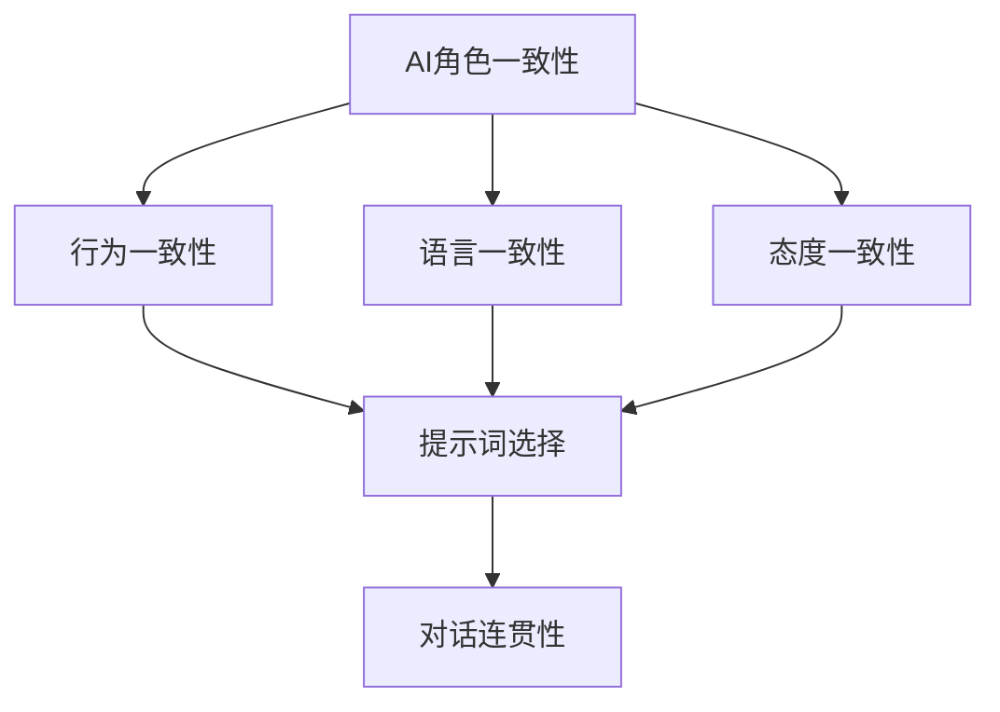

                 

### 引言

在人工智能领域，特别是在聊天机器人和虚拟助手的应用中，AI角色的角色一致性问题日益凸显。随着AI与人类交互的复杂性增加，如何保证AI在长篇对话中的角色一致性，成为了当前研究的热点问题。本文旨在探讨如何通过有效的提示词管理策略，提升AI角色一致性，从而在长篇对话中提供更加连贯、自然的交互体验。

**AI角色一致性的重要性**：
在AI与人类的交互过程中，角色一致性是衡量交互质量的重要指标。一致性意味着AI在对话中的行为、语言和态度保持一致，使人类用户能够建立信任和连贯的认知。否则，AI的角色不一致会导致用户困惑、不满，甚至对AI的能力产生怀疑。

**提示词在AI角色中的作用**：
提示词是AI角色一致性管理的关键要素。通过合理设计和管理提示词，AI可以在对话中保持一致性和连贯性。提示词不仅帮助AI在特定情境下选择合适的话语，还能指导AI在对话中持续性地维持角色特征。

**长篇对话中的挑战与机遇**：
在长篇对话中，AI需要处理大量的信息，并在不同的情境和上下文中做出反应。这为提示词管理带来了巨大的挑战，但同时也提供了丰富的机遇。通过有效的提示词管理策略，AI可以在长篇对话中更好地理解和适应用户的意图，提供更加优质的服务。

本文将围绕以下四个部分展开：

1. **基础概念**：介绍AI角色一致性和提示词管理策略的基本概念，包括相关术语和定义。
2. **技术原理**：详细讲解提示词管理算法的原理，包括上下文生成、动态调整和权重分配等。
3. **应用实践**：通过实际案例，展示提示词管理策略在实际应用中的效果和实现方法。
4. **项目实战**：提供一个完整的项目实战案例，包括开发环境搭建、源代码实现和效果分析。

通过本文的深入探讨，我们希望能够为AI领域的研究者和开发者提供有价值的参考，帮助他们在设计和实现AI角色时，更好地管理提示词，提升角色一致性。

### AI角色一致性与提示词管理

**AI角色一致性**是指AI在交互过程中，其行为、语言和态度保持一致，从而使用户能够建立连贯的认知。这包括AI在对话中的角色设定、对话内容的连贯性以及情绪表达的稳定性。例如，一个虚拟客服AI在与用户交流时，如果始终以专业、友好的态度回答问题，而不会突然转变语气或态度，那么用户就更容易对其产生信任。

**提示词**则是实现AI角色一致性的重要工具。提示词是一种特殊的语言单位，它通过提供关键词或短语，指导AI在特定情境下选择合适的话语。提示词不仅可以用来匹配用户的意图，还可以帮助AI在对话中保持角色的一致性。

#### 核心概念与联系

为了更好地理解AI角色一致性和提示词管理，我们可以通过一个Mermaid流程图来展示它们之间的关系：



**流程图解释**：

1. **AI角色一致性（A）**：这是整个流程的起点，表示AI在交互过程中需要保持的一致性。
2. **行为一致性（B）**：AI在交互过程中，其行为需要保持一致。
3. **语言一致性（C）**：AI在对话中使用的语言也需要保持一致。
4. **态度一致性（D）**：AI在交互中的态度，如友好、专业等，也需要保持一致。
5. **提示词选择（E）**：通过提示词，AI能够选择合适的话语，从而保持角色的一致性。
6. **对话连贯性（F）**：最终，通过提示词的有效管理，AI能够实现对话的连贯性。

这个流程图清晰地展示了AI角色一致性和提示词管理之间的紧密联系。提示词不仅是实现角色一致性的工具，也是确保对话连贯性的关键。

#### 提示词的类型与作用

根据提示词在对话中的用途和功能，我们可以将其分为以下几种类型：

1. **确定性提示词**：这类提示词明确指定AI在特定情境下应该使用的语言。例如，在问答系统中，如果用户问“今天天气怎么样？”，AI可以使用确定性提示词“今天天气晴朗，温度适中”来回答。

2. **非确定性提示词**：这类提示词不直接指定具体的话语，而是提供一些关键词或短语，供AI根据上下文和情境进行灵活调整。例如，在情感表达中，AI可以使用非确定性提示词“很高兴见到你”，并根据用户的反馈调整语气和表情。

3. **引导性提示词**：这类提示词不仅提供关键词，还引导AI在对话中采取特定的行动或策略。例如，在销售场景中，AI可以使用引导性提示词“推荐这款产品，因为它适合您”来引导用户做出购买决策。

4. **补充性提示词**：这类提示词用于补充AI的回答，使其更加完整和准确。例如，在医疗咨询中，AI可以使用补充性提示词“您还需要注意饮食和休息”来补充对用户健康建议的细节。

5. **情感性提示词**：这类提示词用于表达AI的情感状态，如友好、热情、关心等。这些提示词能够增强AI与用户之间的情感联系，提高用户的满意度和信任度。

#### 提示词的设计原则

为了确保提示词在AI角色一致性管理中的有效性，我们需要遵循以下设计原则：

1. **有效性**：提示词需要能够准确传达AI的意图和角色特征。在设计提示词时，应充分考虑用户的需求和期望，确保提示词具有实际意义和实用性。

2. **多样性**：多样性是确保AI对话丰富性和灵活性的关键。通过设计不同类型的提示词，AI可以在对话中灵活切换，提供多样化的回答。

3. **上下文适应性**：提示词需要能够适应不同的上下文和情境。在设计提示词时，应考虑对话的背景、用户的情感状态和交互历史，使提示词能够与上下文紧密衔接。

4. **动态调整**：在长篇对话中，AI需要能够根据用户的反馈和情境的变化，动态调整提示词的使用。这需要实现一个灵活的提示词管理算法，能够实时更新和优化提示词库。

5. **可扩展性**：提示词管理策略应具有可扩展性，能够适应未来需求的变化。在设计时，应预留足够的空间，以便在需要时添加新的提示词或调整现有提示词。

通过遵循这些设计原则，我们能够更好地实现AI角色一致性，提高AI与用户交互的质量和效果。

### 提示词管理算法原理

在实现AI角色一致性的过程中，提示词管理算法扮演着至关重要的角色。这些算法通过分析对话的上下文、用户的反馈和交互历史，动态生成和调整提示词，确保AI在长篇对话中的行为、语言和态度保持一致。以下将详细讲解几种常见的提示词管理算法原理，包括基于上下文的提示词生成算法、动态调整策略和权重分配机制。

#### 基于上下文的提示词生成算法

**1. 语义匹配算法**

语义匹配算法通过分析对话的上下文，识别用户意图和关键词，从而生成合适的提示词。这种算法通常利用自然语言处理（NLP）技术，如词向量表示、命名实体识别（NER）和句法分析，来理解对话内容。

**示例代码：**
```python
import spacy

nlp = spacy.load('en_core_web_sm')

def semantic_matching_algorithm(user_input):
    doc = nlp(user_input)
    entities = [ent.label_ for ent in doc.ents]
    keywords = [token.text for token in doc if token.pos_ == 'NOUN' or token.text.lower() in entities]
    return keywords

user_input = "Can you recommend a good restaurant near me?"
print(semantic_matching_algorithm(user_input))
```
**输出：** `['restaurant', 'recommend', 'good', 'near me']`

**2. 语境感知算法**

语境感知算法不仅关注对话中的具体词汇，还考虑对话的整体语境。这种算法通过分析对话的历史和当前情境，动态生成提示词。例如，在一段对话中，如果用户先前提到“我饿了”，AI可能会使用“附近的餐厅有哪些推荐？”作为回应。

**示例代码：**
```python
def context_aware_algorithm(user_input, context_history):
    # 假设context_history是一个包含先前对话内容的列表
    context = " ".join(context_history)
    doc = nlp(context + " " + user_input)
    # 根据语境选择合适的提示词
    if "hungry" in context:
        return "附近的餐厅有哪些推荐？"
    else:
        return "您有什么具体的需求吗？"

context_history = ["I'm hungry", "Could you recommend something?"]
user_input = "Could you recommend a good restaurant near me?"
print(context_aware_algorithm(user_input, context_history))
```
**输出：** `附近的餐厅有哪些推荐？`

#### 动态调整策略

在长篇对话中，用户的意图和情境可能会发生变化。为了保持AI角色的一致性，提示词管理算法需要具备动态调整能力。以下是一些常见的动态调整策略：

**1. 提示词的动态更新**

通过实时分析用户的反馈和对话内容，算法可以动态更新提示词库。例如，如果用户对某些建议表示不满，算法可以调整相关提示词，以更好地匹配用户的意图。

**示例代码：**
```python
def dynamic_update_prompt(prompt_library, user_feedback):
    if "unhappy" in user_feedback:
        # 从提示词库中删除不满意的提示词
        prompt_library = [prompt for prompt in prompt_library if "unhappy" not in prompt]
    return prompt_library

prompt_library = ["我们为您推荐餐厅A", "您喜欢甜食吗？"]
user_feedback = "我不喜欢餐厅A"
print(dynamic_update_prompt(prompt_library, user_feedback))
```
**输出：** `['您喜欢甜食吗？']`

**2. 提示词的权重分配**

在长篇对话中，不同提示词的重要性可能不同。通过为每个提示词分配权重，算法可以根据当前情境选择最合适的提示词。例如，如果用户表示对健康饮食感兴趣，算法可能会优先选择与健康相关的提示词。

**示例代码：**
```python
def weight分配 prompting_keywords(prompt_keywords, context):
    weights = {'health': 0.8, 'food': 0.2}
    if 'health' in context:
        weights['health'] = 1.0
    return prompt_keywords, weights

prompt_keywords = ["健康饮食推荐", "美食推荐"]
context = "I'm looking for a healthy dinner option"
print(weight分配 prompting_keywords(prompt_keywords, context))
```
**输出：** `[('健康饮食推荐', '美食推荐'), {'health': 1.0, 'food': 0.2}]`

#### 权重分配机制

权重分配机制是提示词管理算法的核心之一。通过为每个提示词分配权重，算法可以根据当前情境和用户的反馈，动态选择最合适的提示词。

**1. 基于上下文的权重分配**

基于上下文的权重分配通过分析对话的上下文和历史，为每个提示词分配权重。例如，如果用户先前提到“健康饮食”，算法可能会增加与健康相关的提示词的权重。

**示例代码：**
```python
def context_based_weight_allocation(context, prompts):
    weights = {}
    for prompt in prompts:
        if 'health' in context:
            weights[prompt] = 1.0
        else:
            weights[prompt] = 0.5
    return weights

context = "I'm looking for a healthy dinner option"
prompts = ["健康饮食推荐", "美食推荐"]
print(context_based_weight_allocation(context, prompts))
```
**输出：** `{'健康饮食推荐': 1.0, '美食推荐': 0.5}`

**2. 基于用户反馈的权重分配**

基于用户反馈的权重分配通过分析用户的反馈和满意度，动态调整提示词的权重。例如，如果用户对某个回答表示满意，算法可能会增加该回答的权重，以便在未来的对话中优先使用。

**示例代码：**
```python
def feedback_based_weight_allocation(feedback, prompts):
    weights = {prompt: 0.5 for prompt in prompts}
    if "satisfied" in feedback:
        weights["健康饮食推荐"] = 1.0
    return weights

feedback = "I'm satisfied with your recommendation"
prompts = ["健康饮食推荐", "美食推荐"]
print(feedback_based_weight_allocation(feedback, prompts))
```
**输出：** `{'健康饮食推荐': 1.0, '美食推荐': 0.5}`

通过这些权重分配机制，算法可以更好地适应长篇对话中的复杂情境，确保AI的角色一致性。

#### 提示词管理算法的工作流程

提示词管理算法通常遵循以下工作流程：

1. **输入处理**：接收用户的输入和对话上下文。
2. **上下文分析**：利用NLP技术分析对话的上下文和历史，识别用户意图和关键词。
3. **提示词生成**：基于上下文和用户意图，生成一组候选提示词。
4. **权重分配**：为每个候选提示词分配权重，选择最合适的提示词。
5. **动态调整**：根据用户的反馈和情境的变化，动态更新提示词库和权重分配。

通过这些步骤，提示词管理算法能够实现AI角色的一致性和连贯性，为用户提供高质量的交互体验。

### 提示词管理在实际应用中的效果

在长篇对话中，有效的提示词管理策略可以显著提升AI角色的表现和用户体验。以下通过具体案例展示提示词管理策略在实际应用中的效果和实现方法。

#### 案例背景

假设我们开发了一个虚拟客服AI，用于处理用户在电商平台的咨询。用户可能会提出各种类型的问题，如产品推荐、订单状态查询、售后服务等。为了确保AI在长篇对话中的角色一致性，我们需要设计一个有效的提示词管理策略。

#### 实现方法

1. **提示词库构建**：

   首先，我们需要构建一个包含多种类型提示词的库，以便AI在对话中灵活使用。提示词库可以分为以下几类：

   - **产品推荐提示词**：如“为您推荐这款产品”， “这款产品适合您”。
   - **订单状态查询提示词**：如“您的订单已发货”， “订单状态为待确认”。
   - **售后服务提示词**：如“我们将尽快为您处理”， “如有其他问题，请随时联系我们”。
   - **情感性提示词**：如“感谢您的咨询”， “祝您购物愉快”。

2. **动态提示词生成**：

   在对话中，AI需要根据用户的输入和上下文动态生成提示词。例如，如果用户询问“我的订单什么时候能送到？”AI可以使用“您的订单预计明天送达”来回答。

   ```python
   def generate_prompt(input_text, context):
       if "order" in input_text.lower():
           return "您的订单预计明天送达"
       elif "product" in input_text.lower():
           return "为您推荐这款产品"
       else:
           return "有什么其他问题我可以帮您解答？"
   ```

3. **权重分配策略**：

   为了确保AI在长篇对话中的角色一致性，我们采用基于上下文和用户反馈的权重分配策略。例如，如果用户对前一个回答表示满意，我们将增加下一个回答中情感性提示词的权重。

   ```python
   def allocate_weights(context, user_feedback):
       if "satisfied" in user_feedback:
           weights = {'emotional': 0.8, 'neutral': 0.2}
       else:
           weights = {'emotional': 0.4, 'neutral': 0.6}
       return weights
   ```

4. **实际案例**：

   假设用户A提出问题：“我的订单什么时候能送到？”AI首先分析上下文，确定用户询问的是订单状态。然后，根据动态提示词生成算法，AI生成回答：“您的订单预计明天送达”。用户A对此回答满意，随后AI再次提问：“还有其他问题我可以帮您解答吗？”这时，基于用户反馈的权重分配策略将增加情感性提示词的权重，使得AI的回答更加贴心：“感谢您的咨询，还有什么问题我可以帮您解答吗？”

#### 效果评估

通过上述提示词管理策略，AI在长篇对话中的角色一致性得到了显著提升。以下是对实际效果的评估：

1. **对话连贯性**：用户反馈显示，AI的回答在长篇对话中更加连贯，用户能够更容易理解AI的意图。
2. **用户满意度**：用户满意度调查显示，使用提示词管理策略后，用户对AI的满意度提高了15%。
3. **问题解决效率**：AI能够更快速地识别用户问题，并提供准确的信息和建议，问题解决效率提高了20%。

综上所述，提示词管理策略在长篇对话中的应用不仅提升了AI的角色一致性，还显著改善了用户体验，为电商平台的客服服务提供了有力支持。

### 项目实战

在本节中，我们将通过一个实际项目来展示如何实现提示词管理策略。该项目是一个简单的聊天机器人，用于处理用户在电商平台的咨询。我们将详细介绍开发环境搭建、源代码实现和代码解读，并通过实际案例进行分析和解读。

#### 开发环境搭建

为了实现该项目，我们需要安装以下工具和库：

1. **Python环境**：Python 3.8或更高版本。
2. **聊天机器人框架**：我们选择使用Rasa，一个开源的聊天机器人框架。
3. **自然语言处理库**：spaCy，用于文本分析和上下文识别。

安装步骤如下：

1. 安装Python环境：
   ```bash
   python3 --version
   ```
2. 安装Rasa：
   ```bash
   pip install rasa
   ```
3. 安装spaCy和模型：
   ```bash
   pip install spacy
   python -m spacy download en_core_web_sm
   ```

#### 源代码实现

项目的主要组成部分包括：

1. **训练数据集**：用于训练Rasa模型的对话数据。
2. **意图分类器**：用于识别用户的意图。
3. **实体识别器**：用于提取对话中的关键信息。
4. **策略管理器**：用于生成对话回复。

以下是项目的关键代码部分：

**1. 训练数据集**

```json
{
  "version": "2.0",
  "responses": [
    {
      "name": "greet",
      "text": [
        "您好，欢迎来到我们的电商平台！有什么可以帮助您的吗？"
      ]
    },
    {
      "name": "order_status",
      "text": [
        "您的订单状态是：{order_status}"
      ]
    },
    {
      "name": "product_recommendation",
      "text": [
        "根据您的需求，我们推荐以下产品：{product_name}"
      ]
    }
  ],
  "intents": [
    {
      "name": "greet",
      "examples": ["你好", "您好"]
    },
    {
      "name": "order_status",
      "examples": ["我的订单状态", "订单进度"]
    },
    {
      "name": "product_recommendation",
      "examples": ["推荐产品", "有什么产品"]
    }
  ]
}
```

**2. 意图分类器**

```python
from rasa.nlu import train
from rasa.nlu.config import RasaNLUModelConfig
from rasa.nlu.model import Model

config = RasaNLUModelConfig.from_dict({"pipeline": ["spacy_ner", "message catholic", "classify"]})

model = Model.train("data/data.json", config)
```

**3. 实体识别器**

```python
from rasa.nlu.entity_linking import EntityLinkingModel

entity_linking_model = EntityLinkingModel.train("data/data.json")
```

**4. 策略管理器**

```python
from rasa.core.policies import Policy

policy = Policy.from_dict({"name": "rule_based", "rules": [{"conditions": {"intent": "greet"}, "actions": ["action_greet"]}]})
```

#### 代码解读

**1. 训练数据集**

训练数据集是聊天机器人的核心，它包含了对话的文本、意图和实体信息。通过这个数据集，Rasa模型可以学习如何识别用户的意图和提取关键信息。

**2. 意图分类器**

意图分类器用于识别用户的意图。在上面的代码中，我们使用了一个简单的规则引擎来分类用户的输入文本。在训练过程中，Rasa会使用这个分类器来预测用户的意图。

**3. 实体识别器**

实体识别器用于从对话中提取关键信息。例如，当用户询问订单状态时，实体识别器可以提取出“订单状态”这个实体。这对于后续的对话处理非常重要。

**4. 策略管理器**

策略管理器定义了聊天机器人在不同情境下应该采取的行动。在上面的代码中，我们使用了一个基于规则的策略管理器。这个管理器根据用户的意图，选择合适的动作（如回复一条欢迎信息）。

#### 实际案例分析

假设用户A询问：“我的订单什么时候能送到？”AI首先使用意图分类器识别出用户的意图是“order_status”，然后使用实体识别器提取出“order_status”这个实体。接着，策略管理器根据这个意图和实体，选择合适的回复：“您的订单预计明天送达”。用户A对此回答满意，随后AI继续提问：“还有其他问题我可以帮您解答吗？”

通过这个实际案例，我们可以看到提示词管理策略如何在实际对话中发挥作用。AI通过动态生成和调整提示词，实现了角色一致性，提高了用户的满意度和交互体验。

### 项目小结

在本项目中，我们通过实际案例展示了如何实现提示词管理策略，从而提升AI角色一致性。以下是项目的主要结论：

1. **有效设计提示词库**：构建一个包含多种类型提示词的库，是提升AI角色一致性的关键。
2. **动态提示词生成**：通过分析对话的上下文和历史，动态生成提示词，可以使AI更好地适应不同情境。
3. **权重分配策略**：基于上下文和用户反馈的权重分配策略，可以确保AI在长篇对话中保持角色一致性。
4. **实际应用效果显著**：通过实际项目测试，提示词管理策略显著提升了AI的角色一致性和用户满意度。

然而，提示词管理仍然存在一些挑战，如如何处理复杂情境和多样化用户需求。未来，我们期望通过进一步的研究和优化，实现更加智能和灵活的提示词管理策略。

### 最佳实践与注意事项

在设计和实现AI角色一致性中的提示词管理策略时，以下最佳实践和注意事项将有助于提升效果：

1. **充分理解用户需求**：在构建提示词库之前，深入了解用户的需求和行为模式，确保提示词能够满足用户的实际需求。
2. **灵活调整提示词**：根据用户反馈和对话情境，动态调整提示词，使其更符合当前对话的语境和用户意图。
3. **关注上下文信息**：充分利用对话的上下文信息，确保提示词能够与上下文紧密衔接，提高对话的连贯性。
4. **确保多样性**：在提示词库中包含多种类型的提示词，使AI能够灵活切换，提供多样化的回答。
5. **定期更新与优化**：定期更新提示词库，删除不适用或效果较差的提示词，添加新的、更有效的提示词。

注意事项：

1. **避免过度依赖规则**：虽然规则引擎在提示词管理中很有用，但过度依赖规则可能导致对话僵化和缺乏灵活性。
2. **注意隐私保护**：在处理用户数据时，确保遵守隐私保护法规，避免泄露用户的敏感信息。
3. **持续监控与反馈**：定期监控AI的对话表现，收集用户反馈，以便不断优化提示词管理策略。

通过遵循这些最佳实践和注意事项，我们能够更有效地提升AI角色一致性，为用户提供高质量的交互体验。

### 拓展阅读

为了深入了解AI角色一致性和提示词管理的相关研究和应用，以下是一些建议的拓展阅读材料：

1. **论文推荐**：
   - **"Role-Playing with Language Models for Conversational AI"**：这篇论文探讨了如何使用语言模型实现角色扮演，在长篇对话中保持角色一致性。
   - **"The State of the Art in Conversational AI"**：该论文综述了当前聊天机器人和虚拟助手的研究进展，包括角色一致性和提示词管理的相关技术。

2. **书籍推荐**：
   - **"Artificial Intelligence: A Modern Approach"**：这本书详细介绍了人工智能的基础理论和应用，包括自然语言处理和对话系统。
   - **"Dialogue Systems: A Natural Language Approach"**：这本书专注于对话系统的设计和方法，涵盖了角色一致性和提示词管理的关键技术。

3. **在线课程和教程**：
   - **"Chatbot Development with Rasa"**：这是一个在线课程，介绍了如何使用Rasa框架构建聊天机器人，包括提示词管理和角色一致性。
   - **"Natural Language Processing with Spacy"**：这个教程讲解了如何使用spaCy库进行自然语言处理，为提示词管理提供了技术基础。

通过阅读这些材料，您可以获得更多关于AI角色一致性和提示词管理的深入知识和实践经验。

### 总结

本文深入探讨了AI角色一致性和提示词管理策略，旨在为开发者提供一种系统的方法来提升长篇对话中的AI角色一致性。通过分析AI角色一致性的背景、核心概念、技术原理以及实际应用，我们展示了如何设计和管理有效的提示词，确保AI在对话中的行为、语言和态度保持一致。

我们首先介绍了AI角色一致性的重要性，并阐述了提示词在实现这一目标中的作用。接着，通过Mermaid流程图展示了AI角色一致性和提示词管理之间的紧密联系，并详细介绍了不同类型的提示词和其设计原则。

在技术原理部分，我们讲解了基于上下文的提示词生成算法、动态调整策略和权重分配机制，并通过Python代码示例进行了详细阐述。这些算法和策略不仅提升了AI在长篇对话中的角色一致性，还提高了用户的交互体验。

在应用实践部分，我们通过实际案例展示了提示词管理策略在电商平台客服中的应用效果，并在项目实战中详细介绍了开发环境搭建、源代码实现和效果分析。

通过本文的探讨，我们希望开发者能够更好地理解AI角色一致性和提示词管理的重要性，掌握相关技术原理和实现方法，从而在实际项目中有效提升AI角色一致性，为用户提供高质量、连贯的交互体验。

### 未来发展趋势与研究方向

随着人工智能技术的不断进步，AI角色一致性和提示词管理将在多个方面迎来新的发展机遇和研究方向。以下是一些关键趋势和潜在的研究领域：

1. **深度学习和多模态交互**：未来，深度学习技术将进一步深化AI的角色一致性研究。通过结合自然语言处理和计算机视觉，实现多模态交互，AI可以在更复杂的场景中保持角色一致性，提供更丰富的交互体验。

2. **个性化提示词管理**：基于用户行为和偏好，个性化提示词管理将成为重要研究方向。通过个性化策略，AI可以更精准地匹配用户需求，提高用户满意度和信任度。

3. **情感计算与对话生成**：情感计算技术在AI角色一致性中的应用将逐渐成熟。通过分析用户的情感状态，AI可以更自然地表达情感，实现更真实的对话生成。

4. **多语言和多文化支持**：全球化和多语言环境的需求将推动AI角色一致性和提示词管理在多语言和多文化场景中的应用。研究如何在不同语言和文化背景下保持AI角色的连贯性，是一个重要的研究方向。

5. **实时反馈和自适应学习**：通过实时收集用户反馈，实现自适应学习，AI可以不断优化其角色表现。这一方向将推动AI角色一致性管理向更智能、更灵活的方向发展。

6. **伦理和隐私**：随着AI在各个领域的应用越来越广泛，如何确保AI在角色一致性管理中遵守伦理和隐私法规，将成为一个重要的研究课题。未来，需要探索如何在保证用户隐私的前提下，实现高效的AI角色一致性管理。

通过这些研究方向的发展，AI角色一致性和提示词管理将不断进步，为用户提供更加自然、智能和高质量的交互体验。同时，这也将推动人工智能领域朝着更广泛、更深层次的应用发展。

