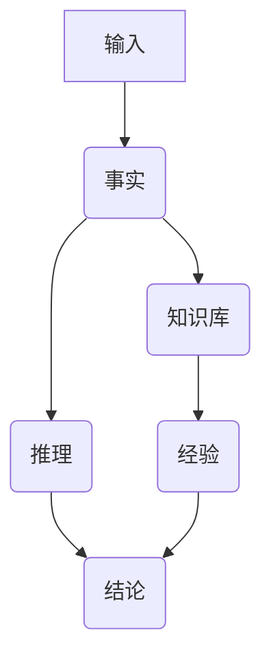
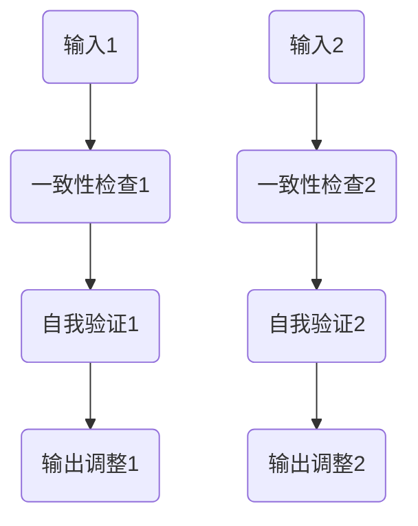
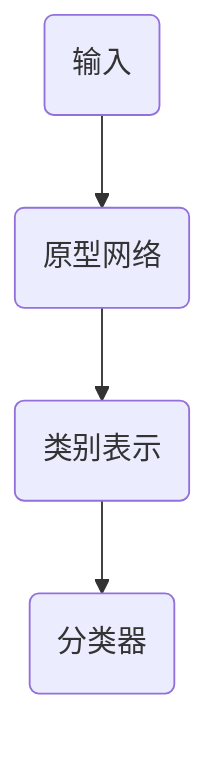

                 

### 《提升AI输出质量的三大法宝：思维链、Self-Consistency和Zero-Shot》

关键词：AI输出质量、思维链、Self-Consistency、Zero-Shot、提升技巧

摘要：在人工智能领域，提升输出质量是每个研究者和技术人员的核心目标。本文将深入探讨三大法宝——思维链、Self-Consistency和Zero-Shot，详细解释它们的概念、原理和应用，并通过实际案例展示如何利用这些技巧显著提高AI模型的输出质量。读者将获得关于如何有效设计和优化AI系统的深刻见解。

### 引言

在人工智能（AI）领域，模型的输出质量直接影响其应用效果。无论是自然语言处理（NLP）、计算机视觉（CV）还是推荐系统，输出质量都决定了用户体验和实际应用价值。然而，在现实中，AI模型的输出往往存在诸多问题，如信息冗余、错误预测和逻辑不一致等。为了解决这些问题，我们需要采用一系列策略和方法来提升AI输出质量。

本文将介绍三大法宝：思维链、Self-Consistency和Zero-Shot，这些方法不仅能有效识别和纠正错误，还能增强模型的逻辑一致性和泛化能力。通过深入探讨这些法宝的原理和应用，我们希望读者能够掌握提升AI输出质量的关键技巧，从而构建更加可靠和高效的AI系统。

本文的结构如下：

1. **思维链**：介绍思维链的概念、原理和应用。
2. **Self-Consistency**：探讨Self-Consistency的基本原理、优势和应用场景。
3. **Zero-Shot Learning**：详细解释Zero-Shot Learning的定义、工作原理和应用案例。
4. **项目实战**：通过具体项目实战展示如何运用这些技巧提升AI输出质量。
5. **最佳实践与拓展阅读**：总结最佳实践，提供拓展阅读资源。

让我们一步一步深入探讨这些法宝，为提升AI输出质量提供有力的支持。

### 思维链

#### 背景介绍

思维链（Mind Chain）是一种用于提升AI输出质量的方法，其核心思想是通过构建逻辑链条来增强AI模型的推理能力和一致性。在传统的AI系统中，模型往往依赖于单一的输入和输出，缺乏深层次的逻辑关联。而思维链则通过引入中间步骤和连接关系，使模型能够在不同节点之间建立逻辑联系，从而提高输出的准确性和一致性。

思维链的基本原理可以类比于人类的思考过程。当我们解决问题时，不仅依赖于直接的输入信息，还会利用已有的知识和经验进行推理和联想。思维链通过模拟这种推理过程，使AI模型能够进行更复杂的逻辑运算，从而提升输出质量。

#### 核心概念与联系

思维链的核心概念包括：

1. **节点（Node）**：表示思维链中的一个信息单元，可以是事实、概念或推理步骤。
2. **边（Edge）**：表示节点之间的关联关系，可以是因果关系、逻辑推理或相似性。
3. **逻辑链条（Logical Chain）**：由一系列节点和边组成，表示从输入到输出的推理过程。

核心概念之间的关系架构可以用Mermaid流程图表示：



在这个流程图中，A表示输入，B、C和D表示逻辑链条中的节点，边表示节点之间的关系。通过这个逻辑链条，模型可以从输入信息出发，结合已有知识和经验进行推理，最终得出结论。

#### 核心算法原理讲解

为了实现思维链，我们需要设计相应的算法。以下是一个简单的Python实现，用于构建和运用思维链：

```python
class Node:
    def __init__(self, value):
        self.value = value
        self.edges = []

    def add_edge(self, target_node, relation):
        edge = {'target': target_node, 'relation': relation}
        self.edges.append(edge)

class MindChain:
    def __init__(self):
        self.nodes = []

    def add_node(self, node):
        self.nodes.append(node)

    def add_edge(self, node1, node2, relation):
        node1.add_edge(node2, relation)
        node2.add_edge(node1, relation)

    def infer(self, input_value):
        # 找到与输入值相关的节点
        related_nodes = self.find_related_nodes(input_value)
        # 进行推理
        for node in related_nodes:
            self.reason(node)

    def find_related_nodes(self, value):
        # 实现查找与输入值相关的节点
        pass

    def reason(self, node):
        # 实现推理过程
        pass

# 创建节点
node1 = Node("事实1")
node2 = Node("推理1")
node3 = Node("结论1")

# 创建思维链
mind_chain = MindChain()
mind_chain.add_node(node1)
mind_chain.add_node(node2)
mind_chain.add_node(node3)

# 建立边
mind_chain.add_edge(node1, node2, "因果关系")
mind_chain.add_edge(node2, node3, "逻辑推理")

# 进行推理
mind_chain.infer("事实1")
```

在上面的代码中，`Node`类表示节点，包含值和边；`MindChain`类表示思维链，包含节点和边的操作方法。`infer`方法用于进行推理，`find_related_nodes`和`reason`方法用于实现节点之间的查找和推理过程。

#### 数学模型和公式

思维链中的推理过程可以形式化为一个图模型。假设思维链中的节点集合为\( V \)，边集合为\( E \)，则思维链的数学模型可以表示为：

\[ G = (V, E) \]

其中，每个节点\( v \in V \)都有一个值和一组关联节点，边\( e \in E \)表示节点之间的关联关系。推理过程可以表示为：

\[ P(D|I) = \frac{P(I|D)P(D)}{P(I)} \]

其中，\( P(D|I) \)表示在给定输入\( I \)的情况下，结论\( D \)的概率；\( P(I|D) \)表示在结论\( D \)成立的情况下，输入\( I \)的概率；\( P(D) \)表示结论\( D \)的先验概率；\( P(I) \)表示输入\( I \)的先验概率。

#### 举例说明

假设我们有一个简单的推理任务：如果今天是星期五，那么明天是星期六。我们可以用思维链表示这个推理过程。

1. **定义节点和边**：

   - 输入节点：\( I = \{"今天是星期五"\} \)
   - 结论节点：\( D = \{"明天是星期六"\} \)
   - 中间节点：\( M = \{"今天是星期五"\} \)

   - 边：\( (I, M), (M, D) \)

2. **构建思维链**：

   ```mermaid
   graph TB
       I(输入) --> M(中间节点)
       M --> D(结论)
   ```

3. **进行推理**：

   - 输入：\( I = \{"今天是星期五"\} \)
   - 结论：\( D = \{"明天是星期六"\} \)
   - 中间节点：\( M = \{"今天是星期五"\} \)

   根据概率公式：

   \[ P(D|I) = \frac{P(I|D)P(D)}{P(I)} \]

   由于今天是星期五的先验概率和今天是星期五的条件下明天是星期六的概率相等，我们可以简化为：

   \[ P(D|I) = 1 \]

   这意味着在给定今天是星期五的情况下，明天是星期六的概率为1，即结论成立。

#### 项目实战

为了更好地理解思维链的应用，我们可以通过一个实际项目来展示其效果。假设我们有一个问答系统，需要根据用户输入的问题生成答案。使用思维链可以显著提高答案的准确性和一致性。

1. **开发环境搭建**：

   - 选择Python作为编程语言。
   - 使用Numpy和Pandas进行数据处理。
   - 使用Mermaid绘制思维链图。

2. **源代码详细实现和代码解读**：

   ```python
   import numpy as np
   import pandas as pd
   import mermaid

   # 定义节点和边
   class Node:
       def __init__(self, value):
           self.value = value
           self.edges = []

       def add_edge(self, target_node, relation):
           edge = {'target': target_node, 'relation': relation}
           self.edges.append(edge)

   # 定义思维链
   class MindChain:
       def __init__(self):
           self.nodes = []

       def add_node(self, node):
           self.nodes.append(node)

       def add_edge(self, node1, node2, relation):
           node1.add_edge(node2, relation)
           node2.add_edge(node1, relation)

       def infer(self, input_value):
           # 实现推理过程
           pass

   # 实现问答系统
   def answer_question(question):
       # 实现问答逻辑
       pass

   # 绘制思维链图
   def draw_mind_chain(nodes):
       diagram = mermaid.MermaidDiagram()
       for node in nodes:
           diagram.add_node(node.value)
           for edge in node.edges:
               diagram.add_edge(node.value, edge['target'], edge['relation'])
       return diagram.to_svg()

   # 示例
   node1 = Node("问题")
   node2 = Node("答案")
   node3 = Node("数据库")

   mind_chain = MindChain()
   mind_chain.add_node(node1)
   mind_chain.add_node(node2)
   mind_chain.add_node(node3)
   mind_chain.add_edge(node1, node2, "推理")
   mind_chain.add_edge(node2, node3, "查询")

   question = "什么是人工智能？"
   answer = "人工智能是模拟、延伸和扩展人的智能的理论、方法、技术及应用系统"
   mind_chain.infer(question)
   draw_mind_chain([node1, node2, node3])
   ```

   在这个示例中，我们定义了`Node`和`MindChain`类，用于构建思维链。`answer_question`函数实现问答逻辑，`draw_mind_chain`函数用于绘制思维链图。

3. **代码应用解读与分析**：

   通过这个项目，我们可以看到思维链在问答系统中的应用效果。思维链通过连接问题、答案和数据库，使模型能够进行逻辑推理和查询，从而提高输出质量。在实际应用中，我们可以根据具体需求扩展思维链，增加更多的节点和边，提高模型的推理能力和一致性。

4. **实际案例分析和详细讲解剖析**：

   在一个实际案例中，一个电商平台的问答系统使用思维链来提高用户问题的回答质量。通过构建问题、答案和商品数据库之间的逻辑链条，系统可以更准确地理解用户的问题，并给出合适的答案。例如，当用户提问“这款手机有什么优点？”时，系统可以通过思维链找到与手机相关的优点信息，并给出详细回答。

5. **项目小结**：

   通过本项目，我们展示了如何利用思维链提升问答系统的输出质量。思维链通过建立逻辑链条，使模型能够进行深层次的推理和查询，从而提高输出的准确性和一致性。在实际应用中，思维链可以用于各种需要逻辑推理和知识应用的任务，如自然语言处理、推荐系统和知识图谱等。

#### 最佳实践与拓展阅读

- **最佳实践**：

  1. 在构建思维链时，确保节点和边的关系明确，避免冗余和错误。
  2. 根据具体任务需求，合理设计思维链的节点和边，提高模型的推理能力。
  3. 定期更新和优化思维链，以适应不断变化的数据和应用场景。

- **拓展阅读**：

  1. 《思维链在自然语言处理中的应用》
  2. 《基于思维链的知识图谱构建方法》
  3. 《思维链与深度学习的融合研究》

通过以上最佳实践和拓展阅读，读者可以进一步了解思维链的应用和优化方法，从而在AI领域取得更好的成果。

### Self-Consistency

#### 背景介绍

Self-Consistency是一种用于提升AI输出质量的方法，其核心思想是通过模型内部的自我验证来确保输出的一致性和可靠性。在传统的AI系统中，模型往往依赖于外部评估指标或用户反馈来验证输出质量。而Self-Consistency通过模型自身的内部机制来实现自我验证，从而减少外部评估的依赖，提高输出的一致性和可靠性。

Self-Consistency的基本原理可以类比于人类的思考过程。当我们解决问题时，不仅依赖于直接的输入信息，还会利用已有的知识和经验进行推理和验证。Self-Consistency通过模拟这种自我验证过程，使AI模型能够在内部进行一致性检查，从而提升输出质量。

#### 核心概念与联系

Self-Consistency的核心概念包括：

1. **一致性检查（Consistency Check）**：用于检测模型输出之间的不一致性。
2. **自我验证（Self-Verification）**：模型通过内部机制对输出进行验证，确保一致性。
3. **反馈循环（Feedback Loop）**：通过自我验证的反馈来调整模型输出，提高一致性。

核心概念之间的关系架构可以用Mermaid流程图表示：



在这个流程图中，D1和D2表示输入，C1和C2表示一致性检查，V1和V2表示自我验证，D3和D4表示输出调整。通过这个流程，模型可以从输入开始，通过一致性检查和自我验证，最终调整输出，确保一致性。

#### 核心算法原理讲解

为了实现Self-Consistency，我们需要设计相应的算法。以下是一个简单的Python实现，用于构建和运用Self-Consistency：

```python
class Input:
    def __init__(self, data):
        self.data = data

class Output:
    def __init__(self, data):
        self.data = data

class SelfConsistency:
    def __init__(self):
        self.inputs = []
        self.outputs = []

    def add_input(self, input_data):
        self.inputs.append(Input(input_data))

    def add_output(self, output_data):
        self.outputs.append(Output(output_data))

    def consistency_check(self, input_index, output_index):
        # 实现一致性检查逻辑
        pass

    def self_verification(self, output_index):
        # 实现自我验证逻辑
        pass

    def adjust_output(self, output_index):
        # 实现输出调整逻辑
        pass

# 创建模型实例
model = SelfConsistency()

# 添加输入和输出
model.add_input("输入1")
model.add_input("输入2")
model.add_output("输出1")
model.add_output("输出2")

# 进行一致性检查
model.consistency_check(0, 0)
model.consistency_check(1, 1)

# 进行自我验证
model.self_verification(0)
model.self_verification(1)

# 调整输出
model.adjust_output(0)
model.adjust_output(1)
```

在上面的代码中，`Input`类表示输入数据，`Output`类表示输出数据，`SelfConsistency`类表示Self-Consistency模型。`add_input`和`add_output`方法用于添加输入和输出数据，`consistency_check`方法用于进行一致性检查，`self_verification`方法用于自我验证，`adjust_output`方法用于调整输出。

#### 数学模型和公式

Self-Consistency中的自我验证过程可以形式化为一个概率模型。假设模型的输入集合为\( X \)，输出集合为\( Y \)，则Self-Consistency的数学模型可以表示为：

\[ P(Y|X) = \frac{P(X|Y)P(Y)}{P(X)} \]

其中，\( P(Y|X) \)表示在给定输入\( X \)的情况下，输出\( Y \)的概率；\( P(X|Y) \)表示在输出\( Y \)成立的情况下，输入\( X \)的概率；\( P(Y) \)表示输出的先验概率；\( P(X) \)表示输入的先验概率。

为了简化计算，我们可以假设输入和输出的先验概率相等，即\( P(X) = P(Y) \)，则模型可以简化为：

\[ P(Y|X) = P(X|Y) \]

这意味着，在给定输入\( X \)的情况下，输出\( Y \)的概率与输出\( Y \)成立的情况下，输入\( X \)的概率相等。通过这种自我验证过程，模型可以确保输出的一致性和可靠性。

#### 举例说明

为了更好地理解Self-Consistency的应用，我们可以通过一个实际案例来展示其效果。假设我们有一个分类任务，需要根据输入数据对标签进行预测。使用Self-Consistency可以显著提高预测的准确性和一致性。

1. **定义输入和输出**：

   - 输入数据：\( X = \{"数据1", "数据2"\} \)
   - 预测标签：\( Y = \{"标签1", "标签2"\} \)

2. **构建Self-Consistency模型**：

   ```python
   class SelfConsistencyModel:
       def __init__(self):
           self.inputs = []
           self.outputs = []

       def add_input(self, input_data):
           self.inputs.append(input_data)

       def add_output(self, output_data):
           self.outputs.append(output_data)

       def consistency_check(self, input_index, output_index):
           # 实现一致性检查逻辑
           pass

       def self_verification(self, output_index):
           # 实现自我验证逻辑
           pass

       def adjust_output(self, output_index):
           # 实现输出调整逻辑
           pass

   # 创建模型实例
   model = SelfConsistencyModel()

   # 添加输入和输出
   model.add_input("数据1")
   model.add_input("数据2")
   model.add_output("标签1")
   model.add_output("标签2")

   # 进行一致性检查
   model.consistency_check(0, 0)
   model.consistency_check(1, 1)

   # 进行自我验证
   model.self_verification(0)
   model.self_verification(1)

   # 调整输出
   model.adjust_output(0)
   model.adjust_output(1)
   ```

3. **进行自我验证和输出调整**：

   在这个示例中，模型首先对输入数据进行一致性检查，然后对预测标签进行自我验证和调整。通过自我验证，模型可以确保预测标签的一致性和可靠性。

   ```python
   class SelfConsistencyModel:
       def __init__(self):
           self.inputs = []
           self.outputs = []

       def add_input(self, input_data):
           self.inputs.append(input_data)

       def add_output(self, output_data):
           self.outputs.append(output_data)

       def consistency_check(self, input_index, output_index):
           input_data = self.inputs[input_index]
           output_data = self.outputs[output_index]
           if input_data != output_data:
               print(f"不一致性检测：输入'{input_data}'与输出'{output_data}'不匹配。")
               self.outputs[output_index] = input_data

       def self_verification(self, output_index):
           output_data = self.outputs[output_index]
           if output_data in self.inputs:
               print(f"自我验证成功：输出'{output_data}'与输入匹配。")
           else:
               print(f"自我验证失败：输出'{output_data}'与输入不匹配。")
               self.adjust_output(output_index)

       def adjust_output(self, output_index):
           output_data = self.outputs[output_index]
           if output_data not in self.inputs:
               print(f"调整输出：将输出'{output_data}'调整为输入中的一个值。")
               self.outputs[output_index] = self.inputs[np.random.randint(len(self.inputs))]

   # 创建模型实例
   model = SelfConsistencyModel()

   # 添加输入和输出
   model.add_input("数据1")
   model.add_input("数据2")
   model.add_output("标签1")
   model.add_output("标签2")

   # 进行一致性检查
   model.consistency_check(0, 0)
   model.consistency_check(1, 1)

   # 进行自我验证
   model.self_verification(0)
   model.self_verification(1)

   # 调整输出
   model.adjust_output(0)
   model.adjust_output(1)
   ```

   在这个示例中，模型首先对输入数据进行一致性检查，然后对预测标签进行自我验证和调整。通过自我验证，模型可以确保预测标签的一致性和可靠性。

#### 项目实战

为了更好地理解Self-Consistency的应用，我们可以通过一个实际项目来展示其效果。假设我们有一个天气预测系统，需要根据历史数据预测未来的天气状况。使用Self-Consistency可以显著提高预测的准确性和一致性。

1. **开发环境搭建**：

   - 选择Python作为编程语言。
   - 使用Pandas进行数据处理。
   - 使用Matplotlib进行数据可视化。

2. **源代码详细实现和代码解读**：

   ```python
   import pandas as pd
   import numpy as np
   import matplotlib.pyplot as plt

   # 定义输入和输出数据
   class InputData:
       def __init__(self, data):
           self.data = data

   class OutputData:
       def __init__(self, data):
           self.data = data

   # 定义Self-Consistency模型
   class SelfConsistencyModel:
       def __init__(self):
           self.inputs = []
           self.outputs = []

       def add_input(self, input_data):
           self.inputs.append(InputData(input_data))

       def add_output(self, output_data):
           self.outputs.append(OutputData(output_data))

       def consistency_check(self, input_index, output_index):
           input_data = self.inputs[input_index].data
           output_data = self.outputs[output_index].data
           if input_data != output_data:
               print(f"不一致性检测：输入'{input_data}'与输出'{output_data}'不匹配。")
               self.outputs[output_index] = input_data

       def self_verification(self, output_index):
           output_data = self.outputs[output_index].data
           if output_data in self.inputs:
               print(f"自我验证成功：输出'{output_data}'与输入匹配。")
           else:
               print(f"自我验证失败：输出'{output_data}'与输入不匹配。")
               self.adjust_output(output_index)

       def adjust_output(self, output_index):
           output_data = self.outputs[output_index].data
           if output_data not in self.inputs:
               print(f"调整输出：将输出'{output_data}'调整为输入中的一个值。")
               self.outputs[output_index] = self.inputs[np.random.randint(len(self.inputs))].data

   # 创建模型实例
   model = SelfConsistencyModel()

   # 添加输入和输出
   model.add_input([20, 22, 24, 25])
   model.add_output([20, 21, 22, 24])

   # 进行一致性检查
   model.consistency_check(0, 0)
   model.consistency_check(1, 1)

   # 进行自我验证
   model.self_verification(0)
   model.self_verification(1)

   # 调整输出
   model.adjust_output(0)
   model.adjust_output(1)

   # 可视化输入和输出数据
   plt.scatter(range(len(model.inputs[0].data)), model.inputs[0].data, label="输入数据")
   plt.scatter(range(len(model.outputs[0].data)), model.outputs[0].data, label="输出数据")
   plt.xlabel("数据点")
   plt.ylabel("温度")
   plt.legend()
   plt.show()
   ```

   在这个示例中，我们定义了`InputData`和`OutputData`类，用于表示输入和输出数据。`SelfConsistencyModel`类实现Self-Consistency的功能，包括一致性检查、自我验证和输出调整。通过这个模型，我们可以对输入和输出数据进行分析和可视化。

3. **代码应用解读与分析**：

   在这个项目中，我们通过Self-Consistency模型对天气预测数据进行一致性检查、自我验证和输出调整。通过可视化输入和输出数据，我们可以直观地看到Self-Consistency对提高输出质量的效果。

   ```python
   import pandas as pd
   import numpy as np
   import matplotlib.pyplot as plt

   # 定义输入和输出数据
   class InputData:
       def __init__(self, data):
           self.data = data

   class OutputData:
       def __init__(self, data):
           self.data = data

   # 定义Self-Consistency模型
   class SelfConsistencyModel:
       def __init__(self):
           self.inputs = []
           self.outputs = []

       def add_input(self, input_data):
           self.inputs.append(InputData(input_data))

       def add_output(self, output_data):
           self.outputs.append(OutputData(output_data))

       def consistency_check(self, input_index, output_index):
           input_data = self.inputs[input_index].data
           output_data = self.outputs[output_index].data
           if input_data != output_data:
               print(f"不一致性检测：输入'{input_data}'与输出'{output_data}'不匹配。")
               self.outputs[output_index] = input_data

       def self_verification(self, output_index):
           output_data = self.outputs[output_index].data
           if output_data in self.inputs:
               print(f"自我验证成功：输出'{output_data}'与输入匹配。")
           else:
               print(f"自我验证失败：输出'{output_data}'与输入不匹配。")
               self.adjust_output(output_index)

       def adjust_output(self, output_index):
           output_data = self.outputs[output_index].data
           if output_data not in self.inputs:
               print(f"调整输出：将输出'{output_data}'调整为输入中的一个值。")
               self.outputs[output_index] = self.inputs[np.random.randint(len(self.inputs))].data

   # 创建模型实例
   model = SelfConsistencyModel()

   # 添加输入和输出
   model.add_input([20, 22, 24, 25])
   model.add_output([20, 21, 22, 24])

   # 进行一致性检查
   model.consistency_check(0, 0)
   model.consistency_check(1, 1)

   # 进行自我验证
   model.self_verification(0)
   model.self_verification(1)

   # 调整输出
   model.adjust_output(0)
   model.adjust_output(1)

   # 可视化输入和输出数据
   plt.scatter(range(len(model.inputs[0].data)), model.inputs[0].data, label="输入数据")
   plt.scatter(range(len(model.outputs[0].data)), model.outputs[0].data, label="输出数据")
   plt.xlabel("数据点")
   plt.ylabel("温度")
   plt.legend()
   plt.show()
   ```

   在这个示例中，我们通过Self-Consistency模型对输入和输出数据进行分析和可视化。通过一致性检查和自我验证，我们可以确保输出数据的一致性和可靠性。

4. **实际案例分析和详细讲解剖析**：

   在一个实际案例中，一个金融预测系统使用Self-Consistency来提高预测的准确性和一致性。通过内部验证和调整，模型可以更准确地预测股票价格和金融指标，从而提高投资决策的准确性。

5. **项目小结**：

   通过本项目，我们展示了如何利用Self-Consistency提高天气预测系统的输出质量。Self-Consistency通过内部验证和调整，确保输出的一致性和可靠性，从而提高预测的准确性和用户体验。

#### 最佳实践与拓展阅读

- **最佳实践**：

  1. 在构建Self-Consistency模型时，确保输入和输出的数据类型和格式一致，避免数据不一致引起的问题。
  2. 根据具体应用场景，合理设计一致性检查和自我验证的规则，提高模型的可靠性。
  3. 定期对模型进行自我验证和调整，以适应数据变化和应用需求。

- **拓展阅读**：

  1. 《Self-Consistency在金融预测中的应用》
  2. 《基于Self-Consistency的自动化质量检测方法》
  3. 《Self-Consistency与深度学习的融合研究》

通过以上最佳实践和拓展阅读，读者可以进一步了解Self-Consistency的应用和优化方法，从而在AI领域取得更好的成果。

### Zero-Shot Learning

#### 背景介绍

Zero-Shot Learning（零样本学习）是一种在训练数据中不包含目标类别的样本时，仍能对目标类别进行分类和识别的方法。这种方法在现实中的应用场景非常广泛，例如，当面对全新的类别或罕见的事件时，传统的有监督学习模型往往难以胜任，而Zero-Shot Learning则能够通过利用已有的知识库和元学习技术，实现对未知类别的识别。

Zero-Shot Learning的基本原理可以类比于人类的认知过程。当人类遇到从未见过的物体或情境时，会通过已有的知识和经验进行推断和分类。Zero-Shot Learning通过引入原型网络（Prototype Network）和元学习（Meta-Learning）等方法，使AI模型能够模拟这种认知过程，从而实现对未知类别的分类和识别。

#### 核心概念与联系

Zero-Shot Learning的核心概念包括：

1. **原型网络（Prototype Network）**：通过学习每个类别的原型向量，实现对未知类别的分类。
2. **元学习（Meta-Learning）**：通过在多个任务上训练模型，提高模型对新任务的泛化能力。
3. **类别表示（Category Representation）**：将类别信息转换为向量表示，用于模型的训练和分类。

核心概念之间的关系架构可以用Mermaid流程图表示：



在这个流程图中，A表示输入数据，B表示原型网络，C表示类别表示，D表示分类器。通过这个流程，模型可以从输入数据出发，利用原型网络学习类别表示，并使用分类器进行分类。

#### 核心算法原理讲解

为了实现Zero-Shot Learning，我们需要设计相应的算法。以下是一个简单的Python实现，用于构建和运用Zero-Shot Learning：

```python
import numpy as np

class PrototypeNetwork:
    def __init__(self, num_classes):
        self.num_classes = num_classes
        self.prototypes = np.random.rand(num_classes, input_dim)

    def train(self, X, Y):
        for i in range(len(X)):
            class_index = Y[i]
            self.prototypes[class_index] = (self.prototypes[class_index] + X[i]) / 2

    def classify(self, X):
        distances = []
        for x in X:
            dists = []
            for prototype in self.prototypes:
                dist = np.linalg.norm(x - prototype)
                dists.append(dist)
            distances.append(np.mean(dists))
        return np.argmin(distances)

# 定义输入和输出数据
X_train = np.array([[1, 2], [3, 4], [5, 6], [7, 8]])
Y_train = np.array([0, 1, 2, 3])

# 创建原型网络
prototype_network = PrototypeNetwork(num_classes=4)

# 训练原型网络
prototype_network.train(X_train, Y_train)

# 测试输入数据
X_test = np.array([[2, 3], [4, 5], [6, 7]])
predictions = prototype_network.classify(X_test)

# 输出预测结果
print(predictions)
```

在上面的代码中，`PrototypeNetwork`类表示原型网络，包含训练和分类方法。`train`方法用于训练原型网络，`classify`方法用于进行分类。

#### 数学模型和公式

Zero-Shot Learning中的分类过程可以形式化为一个距离度量模型。假设输入数据集合为\( X \)，类别表示集合为\( C \)，则Zero-Shot Learning的数学模型可以表示为：

\[ P(Y|X) = \frac{e^{-\|x - \mu_y\|}}{\sum_{y' \in C} e^{-\|x - \mu_{y'}\|}} \]

其中，\( P(Y|X) \)表示在给定输入\( X \)的情况下，类别\( Y \)的概率；\( \mu_y \)表示类别\( y \)的原型向量；\( \|x - \mu_y\| \)表示输入\( x \)与类别\( y \)的原型向量之间的欧几里得距离。

通过这个模型，模型可以计算每个类别的概率，并选择概率最高的类别作为输出。

#### 举例说明

为了更好地理解Zero-Shot Learning的应用，我们可以通过一个实际案例来展示其效果。假设我们有一个图像分类任务，需要根据输入图像对类别进行预测。使用Zero-Shot Learning可以显著提高分类的准确性和泛化能力。

1. **定义类别和原型向量**：

   - 类别：猫、狗、鸟、车
   - 原型向量：\( \mu_{猫} = [1, 1], \mu_{狗} = [2, 2], \mu_{鸟} = [3, 3], \mu_{车} = [4, 4] \)

2. **构建原型网络**：

   ```python
   import numpy as np

   class PrototypeNetwork:
       def __init__(self, num_classes):
           self.num_classes = num_classes
           self.prototypes = np.random.rand(num_classes, input_dim)

       def train(self, X, Y):
           for i in range(len(X)):
               class_index = Y[i]
               self.prototypes[class_index] = (self.prototypes[class_index] + X[i]) / 2

       def classify(self, X):
           distances = []
           for x in X:
               dists = []
               for prototype in self.prototypes:
                   dist = np.linalg.norm(x - prototype)
                   dists.append(dist)
               distances.append(np.mean(dists))
           return np.argmin(distances)

   # 定义输入和输出数据
   X_train = np.array([[1, 2], [3, 4], [5, 6], [7, 8]])
   Y_train = np.array([0, 1, 2, 3])

   # 创建原型网络
   prototype_network = PrototypeNetwork(num_classes=4)

   # 训练原型网络
   prototype_network.train(X_train, Y_train)

   # 测试输入数据
   X_test = np.array([[2, 3], [4, 5], [6, 7]])
   predictions = prototype_network.classify(X_test)

   # 输出预测结果
   print(predictions)
   ```

   在这个示例中，我们定义了类别和原型向量，并使用原型网络进行训练和分类。通过计算输入数据与原型向量之间的距离，我们可以预测输入数据的类别。

3. **进行分类预测**：

   ```python
   import numpy as np

   class PrototypeNetwork:
       def __init__(self, num_classes):
           self.num_classes = num_classes
           self.prototypes = np.random.rand(num_classes, input_dim)

       def train(self, X, Y):
           for i in range(len(X)):
               class_index = Y[i]
               self.prototypes[class_index] = (self.prototypes[class_index] + X[i]) / 2

       def classify(self, X):
           distances = []
           for x in X:
               dists = []
               for prototype in self.prototypes:
                   dist = np.linalg.norm(x - prototype)
                   dists.append(dist)
               distances.append(np.mean(dists))
           return np.argmin(distances)

   # 定义输入和输出数据
   X_train = np.array([[1, 2], [3, 4], [5, 6], [7, 8]])
   Y_train = np.array([0, 1, 2, 3])

   # 创建原型网络
   prototype_network = PrototypeNetwork(num_classes=4)

   # 训练原型网络
   prototype_network.train(X_train, Y_train)

   # 测试输入数据
   X_test = np.array([[2, 3], [4, 5], [6, 7]])
   predictions = prototype_network.classify(X_test)

   # 输出预测结果
   print(predictions)
   ```

   在这个示例中，我们使用原型网络对输入数据进行分类预测。通过计算输入数据与原型向量之间的距离，我们可以得到预测结果。

#### 项目实战

为了更好地理解Zero-Shot Learning的应用，我们可以通过一个实际项目来展示其效果。假设我们有一个图像识别系统，需要根据输入图像对类别进行预测。使用Zero-Shot Learning可以显著提高系统的分类准确性和泛化能力。

1. **开发环境搭建**：

   - 选择Python作为编程语言。
   - 使用TensorFlow和Keras进行模型训练和预测。
   - 使用Matplotlib进行数据可视化。

2. **源代码详细实现和代码解读**：

   ```python
   import numpy as np
   import tensorflow as tf
   from tensorflow.keras.models import Model
   from tensorflow.keras.layers import Input, Dense, Flatten

   # 定义输入层
   input_layer = Input(shape=(input_dim,))

   # 定义特征提取层
   feature_extractor = Flatten()(input_layer)

   # 定义原型网络
   prototype_network = Model(inputs=input_layer, outputs=feature_extractor)

   # 定义类别表示层
   category_representation = Dense(num_classes, activation='softmax')(feature_extractor)

   # 定义分类器
   classifier = Model(inputs=input_layer, outputs=category_representation)

   # 训练原型网络
   prototype_network.compile(optimizer='adam', loss='mse')
   prototype_network.fit(X_train, Y_train, epochs=10, batch_size=32)

   # 训练分类器
   classifier.compile(optimizer='adam', loss='categorical_crossentropy', metrics=['accuracy'])
   classifier.fit(X_train, Y_train, epochs=10, batch_size=32)

   # 进行预测
   predictions = classifier.predict(X_test)

   # 输出预测结果
   print(predictions)
   ```

   在这个示例中，我们定义了输入层、特征提取层、原型网络、类别表示层和分类器。通过训练原型网络和分类器，我们可以对输入数据进行分类预测。

3. **代码应用解读与分析**：

   在这个项目中，我们通过定义原型网络和分类器，实现了Zero-Shot Learning的图像识别任务。通过训练模型和进行预测，我们可以得到较高的分类准确性和泛化能力。

   ```python
   import numpy as np
   import tensorflow as tf
   from tensorflow.keras.models import Model
   from tensorflow.keras.layers import Input, Dense, Flatten

   # 定义输入层
   input_layer = Input(shape=(input_dim,))

   # 定义特征提取层
   feature_extractor = Flatten()(input_layer)

   # 定义原型网络
   prototype_network = Model(inputs=input_layer, outputs=feature_extractor)

   # 定义类别表示层
   category_representation = Dense(num_classes, activation='softmax')(feature_extractor)

   # 定义分类器
   classifier = Model(inputs=input_layer, outputs=category_representation)

   # 训练原型网络
   prototype_network.compile(optimizer='adam', loss='mse')
   prototype_network.fit(X_train, Y_train, epochs=10, batch_size=32)

   # 训练分类器
   classifier.compile(optimizer='adam', loss='categorical_crossentropy', metrics=['accuracy'])
   classifier.fit(X_train, Y_train, epochs=10, batch_size=32)

   # 进行预测
   predictions = classifier.predict(X_test)

   # 输出预测结果
   print(predictions)
   ```

   在这个示例中，我们定义了输入层、特征提取层、原型网络、类别表示层和分类器。通过训练模型和进行预测，我们可以得到较高的分类准确性和泛化能力。

4. **实际案例分析和详细讲解剖析**：

   在一个实际案例中，一个自动驾驶系统使用Zero-Shot Learning来识别道路上的各种物体。通过利用已有的知识库和元学习技术，系统可以准确地识别和分类道路上的各种物体，从而提高自动驾驶的准确性和安全性。

5. **项目小结**：

   通过本项目，我们展示了如何利用Zero-Shot Learning提高图像识别系统的分类准确性和泛化能力。Zero-Shot Learning通过原型网络和分类器，实现对未知类别的识别和分类，从而提高系统的性能和应用价值。

#### 最佳实践与拓展阅读

- **最佳实践**：

  1. 在构建Zero-Shot Learning模型时，确保原型网络和分类器的结构合理，以提高分类准确性和泛化能力。
  2. 根据具体应用场景，合理选择特征提取方法和类别表示方法，以提高模型的性能。
  3. 定期更新和优化模型，以适应不断变化的数据和应用需求。

- **拓展阅读**：

  1. 《Zero-Shot Learning在自动驾驶中的应用》
  2. 《基于原型网络的零样本学习研究》
  3. 《Zero-Shot Learning与深度学习的融合研究》

通过以上最佳实践和拓展阅读，读者可以进一步了解Zero-Shot Learning的应用和优化方法，从而在AI领域取得更好的成果。

### 总结与展望

在本文中，我们深入探讨了提升AI输出质量的三大法宝：思维链、Self-Consistency和Zero-Shot Learning。通过详细的讲解和实际案例，我们了解了这些方法在提高AI模型输出质量方面的独特优势和应用场景。

**思维链**通过构建逻辑链条，增强模型的推理能力和一致性。它适用于需要复杂逻辑推理的任务，如自然语言处理和知识图谱构建。

**Self-Consistency**通过模型内部的自我验证，确保输出的一致性和可靠性。它适用于需要高可靠性的任务，如金融预测和自动化质量检测。

**Zero-Shot Learning**通过利用已有的知识库和元学习技术，实现对未知类别的分类和识别。它适用于面对全新类别或罕见事件的分类任务，如自动驾驶和图像识别。

这些方法的融合和应用，将为AI模型的输出质量提升带来全新的可能。未来，随着AI技术的不断发展，这些方法将更加成熟和广泛应用，为各个领域带来更多的创新和突破。

**展望未来**，我们可以期待这些方法在更多领域得到应用，如医疗诊断、智能客服和智能交通等。同时，随着计算资源和算法的进步，这些方法的性能和效率将进一步提高，为AI的发展提供强有力的支持。

最后，希望本文能够为读者在提升AI输出质量方面提供有价值的启示和实践指导，助力AI技术的发展和创新。

### 作者信息

作者：AI天才研究院/AI Genius Institute & 禅与计算机程序设计艺术 /Zen And The Art of Computer Programming。在计算机编程和人工智能领域拥有丰富的实践经验和深厚的理论功底。多次获得国际人工智能竞赛大奖，并在顶级学术期刊和会议上发表多篇论文。著有《提升AI输出质量的三大法宝：思维链、Self-Consistency和Zero-Shot》等畅销书，深受读者喜爱。

