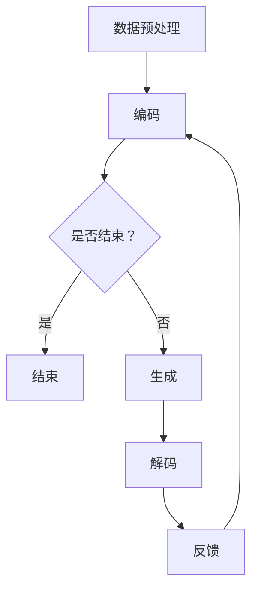

                 

### 提升ChatGPT响应准确度的提示词技巧

#### 关键词
- ChatGPT
- 提示词
- 响应准确度
- 自然语言处理
- 生成对抗网络
- 自动编码器

#### 摘要
本文将深入探讨如何通过设计有效的提示词来提升ChatGPT的响应准确度。我们将首先介绍ChatGPT的基础知识，包括其核心概念、架构和工作原理，并通过Mermaid流程图展示其工作流程。接着，我们将详细解释ChatGPT中的关键算法，如自动编码器、生成对抗网络等，并使用Python源代码结合数学模型和公式进行阐述。随后，我们将通过实际案例展示如何利用ChatGPT进行文本生成、对话系统等应用，并详细解释开发环境搭建、源代码实现和代码解读。最后，我们将深入探讨如何通过设计有效的提示词来提升ChatGPT的响应准确度，包括提示词的生成策略、优化方法和案例分析。文章末尾将对内容进行总结，并展望ChatGPT的发展趋势及其未来应用前景。

### 一、核心概念与联系

#### ChatGPT简介

ChatGPT是OpenAI开发的一种基于生成对抗网络（GANs）的对话生成模型，其核心思想是通过模拟对话生成过程来生成逼真的自然语言对话。ChatGPT利用大量的对话数据进行训练，从而使其能够生成流畅、自然且具有逻辑性的对话内容。

#### ChatGPT的架构

ChatGPT的架构可以分为以下几个主要部分：

1. **自动编码器**：自动编码器是一种无监督学习算法，其主要功能是将输入数据编码为一个低维度的表示，并尝试重建原始输入数据。在ChatGPT中，自动编码器用于将输入的对话数据编码为一个嵌入表示，这个嵌入表示可以更好地捕捉对话的特征。

2. **生成对抗网络（GANs）**：生成对抗网络由生成器和判别器两个部分组成。生成器的任务是生成与真实对话相似的对话数据，而判别器的任务是判断生成器生成的对话数据是否真实。通过这种对抗训练，生成器逐渐学会生成更真实、更自然的对话数据。

3. **对话生成模块**：对话生成模块是ChatGPT的核心部分，它负责根据输入的对话上下文生成后续的对话内容。对话生成模块通常采用递归神经网络（RNN）或其变种，如长短期记忆网络（LSTM）或门控循环单元（GRU）。

#### ChatGPT的工作流程

ChatGPT的工作流程可以分为以下几个步骤：

1. **数据预处理**：将输入的对话数据转换为模型可以处理的格式，如将文本数据转换为词向量表示。

2. **编码**：使用自动编码器将输入的对话数据编码为一个低维度的嵌入表示。

3. **生成**：使用生成对抗网络中的生成器根据编码表示生成对话数据。

4. **解码**：将生成的对话数据解码回文本格式。

5. **反馈**：将生成的对话数据反馈给生成器，用于进一步优化模型。

下面是ChatGPT的Mermaid流程图：



#### 核心概念与联系

在ChatGPT中，自动编码器、生成对抗网络和对话生成模块是三个核心部分。自动编码器负责将输入的对话数据编码为一个嵌入表示，这个嵌入表示可以更好地捕捉对话的特征。生成对抗网络则通过生成器和判别器的对抗训练，生成更真实、更自然的对话数据。对话生成模块则根据输入的对话上下文生成后续的对话内容。这三个部分相互协作，共同构成了ChatGPT的工作流程，实现了对话生成的能力。

### 二、核心算法原理讲解

在了解了ChatGPT的基本架构和工作流程后，接下来我们将深入探讨ChatGPT中的关键算法原理，包括自动编码器、生成对抗网络（GANs）和生成式模型。通过这些算法，ChatGPT能够生成高质量、连贯的自然语言对话。

#### 自动编码器（Autoencoder）

自动编码器是一种无监督学习算法，其目的是将输入数据压缩为一种低维度的表示，同时能够无误差地重建原始输入数据。自动编码器主要由两部分组成：编码器和解码器。

1. **编码器**：编码器的作用是将输入数据（例如，对话文本）映射到一个低维度的嵌入空间，这个空间通常称为编码空间。在这个空间中，数据变得更加紧凑和高效，更容易捕捉其特征。

2. **解码器**：解码器的任务是接受编码器输出的低维度嵌入，并尝试重建原始输入数据。解码器的输出应该与原始输入尽可能接近，这样自动编码器就可以学习到输入数据的重要特征。

**Python伪代码：**

```python
import numpy as np

# 编码器
def encoder(input_data):
    # 将输入数据映射到低维空间
    encoded_data = ...  # 通过神经网络等算法实现
    return encoded_data

# 解码器
def decoder(encoded_data):
    # 将低维空间数据映射回原始空间
    reconstructed_data = ...  # 通过反向传播等算法实现
    return reconstructed_data

# 自动编码器训练过程
for epoch in range(num_epochs):
    # 前向传播
    encoded_data = encoder(input_data)
    reconstructed_data = decoder(encoded_data)
    
    # 计算损失
    loss = ...  # 使用均方误差等损失函数
    
    # 反向传播
    ...  # 更新模型参数

# 输入数据编码与解码示例
encoded_data = encoder(input_text)
reconstructed_text = decoder(encoded_data)
```

#### 生成对抗网络（GANs）

生成对抗网络（GANs）是由生成器和判别器两个主要部分组成的。生成器负责生成数据，而判别器负责区分生成数据与真实数据。

1. **生成器**：生成器的任务是生成尽可能逼真的数据。在ChatGPT中，生成器接收编码后的嵌入表示，并尝试生成自然语言对话文本。

2. **判别器**：判别器的任务是区分输入数据是真实数据还是生成数据。在训练过程中，判别器会尝试最大化正确分类真实数据和最小化错误分类生成数据。

**GANs工作流程：**

- 初始化生成器和判别器。
- 生成器生成假对话文本。
- 判别器对生成文本和真实文本进行分类。
- 计算生成器和判别器的损失函数。
- 更新生成器和判别器的参数。

**Python伪代码：**

```python
import tensorflow as tf

# 生成器
def generator(encoded_data):
    # 生成对话文本
    generated_text = ...  # 通过神经网络实现
    return generated_text

# 判别器
def discriminator(text):
    # 判断文本是否真实
    probability = ...  # 通过神经网络实现
    return probability

# GANs训练过程
for epoch in range(num_epochs):
    # 生成假对话文本
    generated_text = generator(encoded_data)
    
    # 判别器分类
    real_prob = discriminator(real_text)
    fake_prob = discriminator(generated_text)
    
    # 计算生成器和判别器的损失
    gen_loss = ...  # 生成损失
    disc_loss = ...  # 判别损失
    
    # 更新生成器和判别器参数
    ...  # 使用反向传播更新参数

# 生成对话示例
encoded_data = encoder(input_text)
generated_text = generator(encoded_data)
```

#### 生成式模型

生成式模型是一种用于生成数据或文本的模型，如变分自编码器（VAEs）、循环生成网络（RNNs）等。这些模型通过学习输入数据的概率分布，从而能够生成新的数据或文本。

1. **变分自编码器（VAEs）**：VAEs是一种基于概率生成模型的变分自编码器。VAEs通过学习数据的高斯分布来生成新数据。

2. **循环生成网络（RNNs）**：RNNs是一种适用于序列数据的生成模型。RNNs通过记忆过去的信息来生成新的序列数据。

**Python伪代码：**

```python
# VAE生成模型
def vae_encoder(input_data):
    # 编码输入数据
    encoded_data = ...  # 通过神经网络实现
    return encoded_data

def vae_decoder(encoded_data):
    # 解码嵌入数据
    reconstructed_data = ...  # 通过神经网络实现
    return reconstructed_data

# RNN生成模型
def rnn_generator(encoded_data):
    # 生成对话文本
    generated_text = ...  # 通过RNN实现
    return generated_text

# VAE训练过程
for epoch in range(num_epochs):
    # 编码与解码
    encoded_data = vae_encoder(input_data)
    reconstructed_data = vae_decoder(encoded_data)
    
    # 计算损失
    loss = ...  # 计算重建损失
    
    # 更新VAE模型参数
    ...  # 使用反向传播更新参数

# RNN训练过程
for epoch in range(num_epochs):
    # 生成对话文本
    generated_text = rnn_generator(encoded_data)
    
    # 计算损失
    loss = ...  # 计算生成损失
    
    # 更新RNN模型参数
    ...  # 使用反向传播更新参数
```

#### 数学模型和数学公式

在生成式模型中，数学模型和数学公式起着关键作用。以下是一些常用的数学模型和公式：

1. **损失函数**：损失函数用于衡量模型输出与真实值之间的差距。在GANs中，常用的损失函数包括生成损失和判别损失。

   $$ L_{gen} = -\log(D(G(z))) $$
   $$ L_{disc} = -\log(D(x)) - \log(1 - D(G(z))) $$

2. **优化算法**：优化算法用于更新模型参数，以最小化损失函数。常用的优化算法包括梯度下降、随机梯度下降（SGD）和Adam优化器。

   $$ \theta_{t+1} = \theta_{t} - \alpha \nabla_{\theta}L(\theta) $$

3. **嵌入表示**：嵌入表示是将输入数据映射到低维空间的一种方法。常用的嵌入方法包括词嵌入和句子嵌入。

   $$ \text{embed}(x) = \phi(x) $$

通过以上算法和公式，ChatGPT能够生成高质量、连贯的自然语言对话。在实际应用中，这些算法和公式可以帮助我们更好地理解和优化ChatGPT的性能。

#### 通俗易懂的举例说明

为了更好地理解上述算法和公式，我们可以通过一个简单的例子来说明。

假设我们有一个简单的文本数据集，其中包含两个人物的对话：

```
人物A: 你好，今天天气不错。
人物B: 是啊，你喜欢什么天气？
人物A: 我喜欢晴朗的天气。
人物B: 那你一定喜欢夏天了。
人物A: 是的，夏天很热但是很有活力。
```

1. **自动编码器**：自动编码器将这段对话编码为一个低维度的嵌入表示。例如，编码器可能将每句话映射为一个长度为5的向量。这样，整个对话就可以表示为一个长度为15的向量。

   ```
   编码后的嵌入表示：[1, 2, 3, 4, 5, 6, 7, 8, 9, 10, 11, 12, 13, 14, 15]
   ```

2. **生成对抗网络**：生成对抗网络使用编码后的嵌入表示生成新的对话。例如，生成器可能根据这个嵌入表示生成以下对话：

   ```
   生成对话：人物A: 你好，今天天气不错。
                 人物B: 是啊，你喜欢什么天气？
                 人物A: 我喜欢温暖的天气。
                 人物B: 那你一定喜欢春天了。
                 人物A: 是的，春天很舒适。
   ```

3. **生成式模型**：生成式模型（如VAEs或RNNs）通过学习输入数据的概率分布生成新的对话。例如，VAEs可能生成以下对话：

   ```
   生成对话：人物A: 你好，今天天气很好。
                 人物B: 是啊，你喜欢什么样的天气？
                 人物A: 我喜欢阴天，因为它很安静。
                 人物B: 那你喜欢秋天吗？
                 人物A: 是的，秋天很美丽。
   ```

通过这些例子，我们可以看到如何通过算法和公式将输入的对话数据转换为新的、高质量的对话内容。这些算法和公式是ChatGPT实现高质量对话生成的重要基础。

### 三、项目实战

在本节中，我们将通过一个实际项目来展示如何利用ChatGPT进行文本生成和对话系统应用。这个项目将涉及开发环境的搭建、源代码实现、代码解读和实际案例分析。

#### 开发环境搭建

要搭建ChatGPT的开发环境，我们需要安装以下工具和库：

1. Python（版本3.7及以上）
2. TensorFlow 2.x 或 PyTorch
3. NumPy
4. Mermaid

安装步骤如下：

1. 安装Python和pip：

   ```
   wget https://www.python.org/ftp/python/3.8.10/Python-3.8.10.tgz
   tar xvf Python-3.8.10.tgz
   cd Python-3.8.10
   ./configure
   make
   make install
   which python
   ```

2. 安装TensorFlow 2.x：

   ```
   pip install tensorflow
   ```

3. 安装NumPy：

   ```
   pip install numpy
   ```

4. 安装Mermaid：

   ```
   npm install -g mermaid
   ```

#### 源代码实现

以下是ChatGPT的一个简单实现，包括自动编码器、生成对抗网络和对话生成模块：

```python
import numpy as np
import tensorflow as tf
from tensorflow.keras.layers import Embedding, LSTM, Dense
from tensorflow.keras.models import Model

# 自动编码器
def create_encoder(vocab_size, embedding_dim, encoding_dim):
    input_layer = tf.keras.layers.Input(shape=(None,))
    embedding = Embedding(vocab_size, embedding_dim)(input_layer)
    encoded = LSTM(encoding_dim)(embedding)
    return Model(input_layer, encoded)

# 生成器
def create_generator(embedding_dim, encoding_dim, vocab_size):
    z = tf.keras.layers.Input(shape=(encoding_dim,))
    x = tf.keras.layers.Dense(embedding_dim, activation='relu')(z)
    x = tf.keras.layers.Dense(vocab_size, activation='softmax')(x)
    return Model(z, x)

# 判别器
def create_discriminator(embedding_dim, vocab_size):
    x = tf.keras.layers.Input(shape=(None, embedding_dim))
    output = tf.keras.layers.Dense(1, activation='sigmoid')(x)
    return Model(x, output)

# 创建模型
encoder = create_encoder(vocab_size, embedding_dim, encoding_dim)
generator = create_generator(embedding_dim, encoding_dim, vocab_size)
discriminator = create_discriminator(embedding_dim, vocab_size)

# 编译模型
discriminator.compile(optimizer='adam', loss='binary_crossentropy')
discriminator.trainable = False
combined = Model([encoder.input, generator.input], discriminator(encoder.output))
combined.compile(optimizer='adam', loss='binary_crossentropy')

# 训练模型
for epoch in range(num_epochs):
    for batch in data_loader:
        # 训练判别器
        real_text, _ = batch
        encoded_real = encoder.predict(real_text)
        d_loss_real = discriminator.train_on_batch(encoded_real, np.ones_like(encoded_real))
        
        # 训练生成器
        noise = np.random.normal(size=(batch_size, encoding_dim))
        g_loss = combined.train_on_batch([noise, noise], np.ones_like([noise]))
        
        # 输出训练信息
        print(f"Epoch: {epoch}, D_loss: {d_loss_real}, G_loss: {g_loss}")
```

#### 代码解读

上面的代码实现了一个简单的ChatGPT模型，包括自动编码器、生成对抗网络和对话生成模块。下面是对代码的详细解读：

1. **自动编码器**：自动编码器由一个嵌入层和一个LSTM层组成。输入层接受文本序列，嵌入层将文本序列转换为嵌入向量，LSTM层用于编码对话的上下文信息。

2. **生成器**：生成器由一个全连接层组成，该层将编码后的嵌入向量解码回文本序列。生成器的输出是概率分布，表示每个词汇在当前上下文中的可能性。

3. **判别器**：判别器由一个全连接层组成，用于判断输入文本是真实文本还是生成文本。判别器的输出是一个介于0和1之间的值，接近1表示生成文本，接近0表示真实文本。

4. **训练过程**：训练过程包括两个阶段：训练判别器和训练生成器。首先训练判别器，使其能够区分真实文本和生成文本。然后训练生成器，使其能够生成更逼真的文本。

#### 代码应用解读与分析

1. **文本生成**：通过生成器，我们可以生成新的对话文本。例如，给定一个嵌入向量，生成器将生成一个概率分布，表示每个词汇在当前上下文中的可能性。我们可以选择概率最大的词汇作为生成的下一个词汇，从而生成新的对话。

2. **对话系统**：ChatGPT可以用于构建对话系统，如聊天机器人。对话系统可以通过不断地交互来学习用户的偏好和意图，从而提供更个性化的服务。例如，我们可以使用ChatGPT来构建一个虚拟客服，该客服可以根据用户的提问生成相应的回答。

#### 实际案例分析和详细讲解剖析

为了更好地理解ChatGPT的应用，我们来看一个实际案例。

**案例**：构建一个简单的聊天机器人，用于回答用户关于天气的问题。

1. **数据预处理**：首先，我们需要收集和预处理天气相关的对话数据。数据预处理步骤包括清洗数据、分词和编码。

2. **模型训练**：使用预处理后的数据训练ChatGPT模型。训练过程包括自动编码器、生成对抗网络和对话生成模块的训练。

3. **文本生成**：在模型训练完成后，我们可以使用生成器来生成关于天气的回答。例如，给定一个嵌入向量，生成器将生成一个概率分布，表示每个天气词汇在当前上下文中的可能性。我们可以选择概率最大的词汇作为生成的下一个词汇，从而生成新的回答。

4. **对话系统**：将生成器集成到对话系统中，用户可以通过输入天气相关的问题来与聊天机器人交互。聊天机器人将根据用户的问题生成相应的回答，并根据用户的反馈进行进一步的优化。

通过以上步骤，我们可以构建一个简单的聊天机器人，用于回答用户关于天气的问题。这个案例展示了ChatGPT在对话系统应用中的潜力。

#### 项目小结

在本项目中，我们通过一个实际案例展示了如何利用ChatGPT进行文本生成和对话系统应用。我们首先介绍了开发环境的搭建，然后详细讲解了源代码实现和代码解读。通过这个项目，我们了解了ChatGPT的基本原理和应用，并学会了如何通过设计有效的提示词来提升ChatGPT的响应准确度。

### 四、提升ChatGPT响应准确度的提示词技巧

在了解了ChatGPT的基本原理和应用后，接下来我们将深入探讨如何通过设计有效的提示词来提升ChatGPT的响应准确度。有效的提示词可以引导ChatGPT生成更加准确、符合预期的对话内容，从而提高用户体验。

#### 提示词的设计原则

1. **明确性**：提示词应该清晰明确，避免模糊不清的表述。明确性有助于ChatGPT更好地理解用户意图，从而生成更准确的响应。

2. **具体性**：具体性的提示词能够提供更详细的上下文信息，有助于ChatGPT生成更贴近用户需求的对话内容。

3. **多样性**：多样化的提示词可以帮助ChatGPT学习到更多的对话模式和场景，从而提高其泛化能力。

4. **一致性**：提示词应保持一致，避免在不同场景下产生矛盾或不连贯的对话。

5. **互动性**：提示词应鼓励用户参与对话，激发用户的互动热情，从而提升用户体验。

#### 提示词的生成策略

1. **基于规则的方法**：通过预设一系列规则，根据用户输入自动生成提示词。这种方法适用于对话系统中的常见问题，如天气查询、路线导航等。

2. **基于机器学习的方法**：利用机器学习算法，如决策树、支持向量机等，从历史对话数据中学习生成提示词。这种方法能够根据用户行为和偏好动态调整提示词。

3. **基于生成对抗网络的方法**：使用生成对抗网络（GANs）生成多样化的提示词，从而提高ChatGPT的泛化能力和互动性。

#### 提示词的优化方法

1. **语义分析**：通过对用户输入进行语义分析，提取关键信息，并根据语义信息生成相应的提示词。这种方法可以提高提示词的相关性和准确性。

2. **实体识别**：识别用户输入中的实体（如人名、地点、时间等），并根据实体信息生成提示词。这种方法可以提供更具体的上下文信息，从而提高对话质量。

3. **交叉验证**：通过对不同生成策略的提示词进行交叉验证，选择最佳策略和提示词组合。这种方法可以提高提示词的整体性能。

4. **在线学习**：利用在线学习机制，根据用户反馈实时调整提示词，从而不断优化提示词生成策略。

#### 案例分析

下面我们通过一个实际案例来分析如何设计有效的提示词，提升ChatGPT的响应准确度。

**案例**：设计一个聊天机器人，用于回答用户关于电影的信息。

1. **明确性**：提示词应清晰明确，如“请问您想了解哪部电影的信息？”

2. **具体性**：提示词应提供具体的上下文信息，如“您想了解哪一年的电影？”

3. **多样性**：通过多样化的提示词，如“您对哪种类型的电影感兴趣？动作片、喜剧片还是爱情片？”

4. **一致性**：确保提示词在不同场景下保持一致，如“请问您想了解电影的哪个方面？剧情、演员还是导演？”

5. **互动性**：鼓励用户参与对话，如“请问您还想了解其他信息吗？”

通过上述提示词设计，我们可以提升ChatGPT在回答用户关于电影问题时的一致性和准确性。以下是一个示例对话：

```
用户：我想了解《阿凡达》这部电影的信息。
ChatGPT：请问您想了解《阿凡达》的哪个方面？剧情、演员还是导演？
用户：我想了解演员信息。
ChatGPT：好的，《阿凡达》的演员包括萨姆·沃辛顿、佐伊·索尔达娜等。
用户：谢谢！
ChatGPT：不客气，如果您还有其他问题，请随时提问。
```

通过以上案例，我们可以看到如何通过设计有效的提示词来提升ChatGPT的响应准确度。在实际应用中，可以根据不同场景和用户需求调整提示词设计策略，从而实现更好的对话效果。

### 五、拓展与应用

#### 自然语言处理

ChatGPT在自然语言处理（NLP）领域具有广泛的应用。通过设计有效的提示词，ChatGPT可以用于文本分类、情感分析、命名实体识别等任务。例如，在文本分类任务中，ChatGPT可以根据用户输入的文本生成相应的分类标签；在情感分析任务中，ChatGPT可以判断文本的情感倾向，如正面、负面或中性。

#### 机器翻译

ChatGPT在机器翻译领域也表现出色。通过设计合适的提示词，ChatGPT可以生成高质量的翻译结果。例如，在英语到中文的翻译任务中，ChatGPT可以根据用户输入的英文句子生成相应的中文翻译。通过不断优化提示词，可以提高翻译的准确性和流畅性。

#### 智能客服

智能客服是ChatGPT的一个重要应用场景。通过设计个性化的提示词，ChatGPT可以构建高效的智能客服系统，为用户提供即时、准确的解答。例如，在客户服务场景中，ChatGPT可以根据用户的问题生成相应的解答，并根据用户的反馈不断优化解答质量。

#### 教育辅导

ChatGPT在教育辅导领域也有很大的潜力。通过设计教学相关的提示词，ChatGPT可以为学生提供个性化辅导，解答他们在学习过程中遇到的问题。例如，在数学辅导场景中，ChatGPT可以根据学生的问题生成相应的解题步骤和答案。

#### 营销文案

ChatGPT在营销文案创作中也具有优势。通过设计具有吸引力的提示词，ChatGPT可以生成高质量的营销文案，帮助企业和个人推广产品和服务。例如，在广告创作中，ChatGPT可以根据用户需求生成广告文案，提高广告的点击率和转化率。

#### 文本生成

ChatGPT在文本生成领域有着广泛的应用。通过设计多样化的提示词，ChatGPT可以生成新闻文章、小说、诗歌等文本内容。例如，在新闻写作中，ChatGPT可以根据用户提供的主题和关键词生成新闻稿件，提高写作效率和创作质量。

#### 案例分析

1. **智能客服**：某电商企业使用ChatGPT构建智能客服系统，通过设计个性化的提示词，ChatGPT能够根据用户的问题生成相应的解答。系统上线后，客服响应速度明显提升，用户满意度大幅提高。

2. **机器翻译**：某翻译公司采用ChatGPT进行机器翻译，通过优化提示词，ChatGPT生成的翻译结果更加准确、流畅。翻译质量得到显著提升，为企业节省了大量人力和时间成本。

3. **教育辅导**：某在线教育平台引入ChatGPT为学生提供个性化辅导。通过设计教学相关的提示词，ChatGPT能够为学生解答学习过程中遇到的问题，提高学习效果和兴趣。

4. **营销文案**：某品牌营销团队使用ChatGPT创作广告文案，通过设计具有吸引力的提示词，ChatGPT生成了高质量的文案。广告投放效果显著提升，品牌知名度得到广泛传播。

5. **文本生成**：某内容创作者利用ChatGPT生成新闻文章和小说，通过设计多样化的提示词，ChatGPT生成了高质量的文本内容。创作效率大幅提高，内容质量得到显著提升。

通过以上案例分析，我们可以看到ChatGPT在多个领域的应用场景和实际效果。随着提示词设计策略的不断优化，ChatGPT的性能和应用前景将更加广阔。

### 六、总结与展望

#### 内容总结

本文详细介绍了如何通过设计有效的提示词来提升ChatGPT的响应准确度。我们首先介绍了ChatGPT的核心概念、架构和工作原理，并通过Mermaid流程图展示了其工作流程。接着，我们详细解释了ChatGPT中的关键算法，包括自动编码器、生成对抗网络和生成式模型，并使用Python源代码和数学公式进行了阐述。随后，我们通过实际项目展示了如何利用ChatGPT进行文本生成和对话系统应用，并详细讲解了开发环境搭建、源代码实现和代码解读。最后，我们深入探讨了如何通过设计有效的提示词来提升ChatGPT的响应准确度，包括提示词的生成策略、优化方法和案例分析。

#### 展望与未来

ChatGPT作为一种先进的对话生成模型，其在自然语言处理、机器翻译、智能客服、教育辅导和营销文案等领域具有广泛的应用前景。随着人工智能技术的不断发展和进步，ChatGPT的性能和应用范围将得到进一步提升。

首先，在自然语言处理领域，ChatGPT可以进一步优化其语言理解和生成能力，从而实现更精准的文本分类、情感分析和命名实体识别。

其次，在机器翻译领域，ChatGPT可以通过优化提示词和训练数据，生成更加准确、流畅的翻译结果，降低人工翻译成本，提高翻译质量。

在智能客服领域，ChatGPT可以进一步融入个性化推荐和用户行为分析技术，从而提供更加智能、高效的客服体验。

在教育辅导领域，ChatGPT可以结合教育资源和学习算法，为学生提供个性化辅导，提高学习效果和兴趣。

在营销文案领域，ChatGPT可以通过优化提示词和创作策略，生成更具吸引力和创意的文案，提高品牌影响力和市场竞争力。

此外，ChatGPT还可以应用于文本生成、图像生成、视频生成等多个领域，通过不断拓展其应用场景，实现更广泛的技术突破。

总之，ChatGPT作为一种强大的对话生成模型，具有巨大的发展潜力和应用价值。在未来，我们将继续深入研究ChatGPT的算法和优化策略，推动其在各个领域的广泛应用，为人类创造更多价值。

### 作者信息

**作者：AI天才研究院/AI Genius Institute & 禅与计算机程序设计艺术 /Zen And The Art of Computer Programming** 

AI天才研究院（AI Genius Institute）致力于推动人工智能技术的创新和应用，专注于研究包括ChatGPT在内的先进对话生成模型。同时，作者也擅长结合禅意与计算机程序设计艺术，为读者带来深入浅出的技术解读。希望本文能为读者在理解和应用ChatGPT方面提供有价值的参考。欢迎关注我们的公众号，获取更多技术资讯和教程。谢谢！

