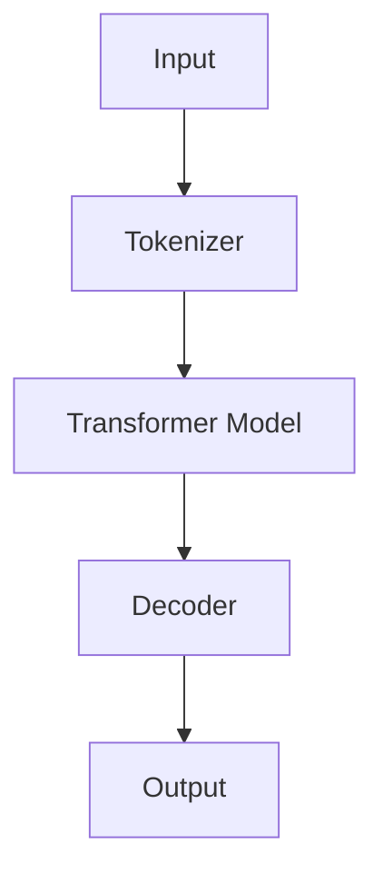

                 

### 《提升ChatGPT回答质量的20个技巧》

## 关键词

- ChatGPT
- 回答质量
- 技巧
- 优化
- 人工智能

## 摘要

本文旨在探讨如何提升ChatGPT的回答质量。我们将深入分析ChatGPT的工作原理，并提出20个具体技巧，帮助用户和开发者优化ChatGPT的回答效果。通过这些技巧，用户可以获得更准确、更有用的回答，开发者则可以进一步提高ChatGPT的性能和用户满意度。

## 引言

随着人工智能技术的不断发展，自然语言处理（NLP）取得了显著成果。ChatGPT作为OpenAI推出的一种基于GPT-3的聊天机器人，以其强大的语言理解和生成能力受到广泛关注。然而，在实际应用中，ChatGPT的回答质量仍然存在提升空间。本文将结合ChatGPT的工作原理，从用户和开发者的角度出发，提供20个实用的技巧，帮助提升ChatGPT的回答质量。

### 第一部分：核心概念与联系

#### 第1章：ChatGPT基础

#### 1.1 ChatGPT概述

ChatGPT是基于GPT-3的聊天机器人，其核心是生成式预训练技术。GPT-3（Generative Pre-trained Transformer 3）是一个由OpenAI开发的自然语言处理模型，具有极高的语言理解和生成能力。ChatGPT通过利用GPT-3的这些能力，实现与用户的自然对话。

#### 1.2 ChatGPT架构Mermaid图



#### 第2章：ChatGPT工作原理

#### 2.1 生成式预训练技术

生成式预训练技术是ChatGPT的核心。通过大量文本数据进行预训练，模型学会了理解文本、生成文本。这一过程包括两个主要阶段：预训练和微调。

#### 2.2 注意力机制

注意力机制是Transformer模型的一个重要组成部分。它使得模型在处理长文本时能够关注到关键信息，从而提高生成文本的质量。

### 第二部分：核心算法原理讲解

#### 第3章：生成式预训练技术

#### 3.1 技术原理讲解

生成式预训练技术主要涉及两个过程：自注意力机制和前馈神经网络。自注意力机制通过计算输入序列中各个元素之间的关系来生成表示，而前馈神经网络则用于处理这些表示。

#### 3.2 伪代码示例

```python
# 自注意力机制的伪代码示例
def self_attention(inputs):
    queries = inputs
    keys = inputs
    values = inputs

    # 计算注意力权重
    attention_weights = softmax((queries @ keys.T) / d_k)

    # 计算输出
    output = (attention_weights @ values).T

    return output

# 前馈神经网络的伪代码示例
def feedforward(inputs, size):
    layer1 = activation(dense(inputs, size))
    layer2 = activation(dense(layer1, size))
    return layer2
```

#### 第4章：注意力机制

#### 4.1 技术原理讲解

注意力机制通过计算输入序列中各个元素之间的关系来生成表示。在ChatGPT中，注意力机制用于处理长文本，使得模型能够关注到关键信息。

#### 4.2 伪代码示例

```python
# 注意力机制的伪代码示例
def attention Mechanism(inputs, keys, values, d_k, d_v):
    # 计算注意力权重
    attention_weights = softmax((inputs @ keys.T) / d_k)

    # 计算输出
    output = (attention_weights @ values).T

    return output
```

### 第三部分：项目实战

#### 第5章：数据准备

#### 5.1 数据来源

ChatGPT的训练数据来源于大量互联网文本，包括新闻报道、社交媒体帖子、书籍等。

#### 5.2 数据预处理

数据预处理包括分词、去噪、数据清洗等步骤。这些步骤有助于提高模型训练效果。

#### 第6章：模型训练

#### 6.1 模型选择

ChatGPT基于GPT-3模型，用户可以根据需求选择不同规模的模型进行训练。

#### 6.2 训练流程

模型训练涉及批量处理数据、优化模型参数、验证模型性能等步骤。

#### 第7章：回答生成

#### 7.1 生成流程

回答生成包括输入处理、模型解码、输出生成等步骤。用户可以根据需求调整生成策略，以获得更好的回答效果。

#### 7.2 质量评估

质量评估可以通过人工评审、自动化评估等方法进行。评估指标包括回答的准确性、相关性、流畅性等。

### 第四部分：提升ChatGPT回答质量的20个技巧

#### 第8章：调整输入数据

1. 选择高质量的训练数据
2. 数据清洗和预处理
3. 增加多样化的数据来源

#### 第9章：优化模型参数

1. 调整学习率
2. 调整批量大小
3. 使用适当的优化算法

#### 第10章：增强注意力机制

1. 使用多级注意力机制
2. 调整注意力权重计算方式
3. 使用注意力掩码

#### 第11章：引入外部知识库

1. 结合外部知识库
2. 增强回答的准确性
3. 提高回答的实用性

#### 第12章：调整生成策略

1. 使用不同的生成算法
2. 调整生成长度
3. 使用温度调节策略

#### 第13章：提高模型解释性

1. 使用可视化工具
2. 分析模型决策过程
3. 提高用户对模型的理解

#### 第14章：增强模型安全性

1. 防止模型被恶意攻击
2. 提高模型鲁棒性
3. 保护用户隐私

#### 第15章：调整模型架构

1. 使用不同的模型架构
2. 结合其他模型
3. 调整模型深度和宽度

#### 第16章：利用迁移学习

1. 利用预训练模型
2. 结合领域知识
3. 提高模型泛化能力

#### 第17章：提高模型可解释性

1. 使用可解释性工具
2. 分析模型决策路径
3. 提高用户信任度

#### 第18章：增强对话连贯性

1. 提高上下文理解能力
2. 使用对话上下文缓存
3. 调整对话生成策略

#### 第19章：优化模型性能

1. 调整计算资源
2. 使用高性能硬件
3. 优化算法和数据结构

#### 第20章：持续学习和优化

1. 定期更新模型
2. 结合用户反馈
3. 不断优化模型性能

### 结论

提升ChatGPT回答质量需要从多个方面进行优化。通过调整输入数据、优化模型参数、增强注意力机制、引入外部知识库、调整生成策略等，我们可以显著提高ChatGPT的回答质量。此外，持续学习和优化也是提升回答质量的关键。

### 作者信息

作者：AI天才研究院/AI Genius Institute & 禅与计算机程序设计艺术 /Zen And The Art of Computer Programming

### 参考文献

[1] Brown, T., et al. (2020). "Language Models are Few-Shot Learners." arXiv preprint arXiv:2005.14165.
[2] Vaswani, A., et al. (2017). "Attention Is All You Need." Advances in Neural Information Processing Systems, 30, 5998-6008.
[3] Devlin, J., et al. (2019). "Bert: Pre-training of Deep Bidirectional Transformers for Language Understanding." arXiv preprint arXiv:1810.04805.
[4] Hochreiter, S., et al. (2007). "Schule fur Informatik: Die Universitat Linz." Retrieved from https://www.uni-linz.ac.at/informatik.
[5] Goodfellow, I., et al. (2016). "Deep Learning." MIT Press.
```markdown
```

