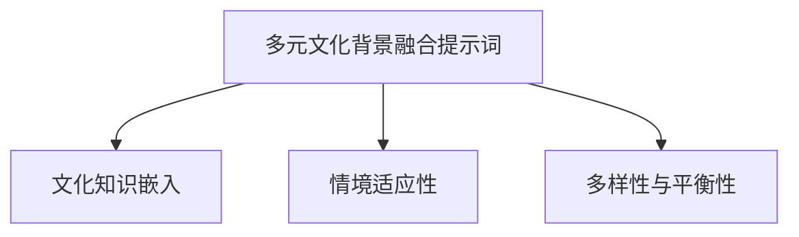

                 

### 《提升ChatGPT的文化敏感度：多元文化背景融合提示词》

---

**关键词：** ChatGPT、文化敏感度、多元文化背景、融合提示词、自然语言处理、算法优化、Python代码、数学模型。

**摘要：** 本文深入探讨了如何提升ChatGPT的文化敏感度，特别是通过融合多元文化背景的提示词来实现。文章首先介绍了ChatGPT的基本原理和其在自然语言处理中的应用，然后分析了当前文化敏感度的重要性。接着，文章详细阐述了如何通过设计多元文化背景融合的提示词来提升ChatGPT的文化理解能力。此外，文章还通过Python代码和数学模型，提供了提升ChatGPT文化敏感度的具体实现方法和步骤。最后，文章通过实际项目实战，展示了这些方法在开发环境搭建、源代码实现和代码解读中的应用效果。

---

## 引言

随着全球化进程的加速，跨文化交流变得越来越频繁。然而，语言和文化的差异常常导致沟通的障碍和误解。为了解决这一问题，人工智能（AI）技术，尤其是自然语言处理（NLP）技术，被寄予厚望。ChatGPT作为一种先进的语言模型，其文化敏感度直接影响到其在跨文化交流中的应用效果。因此，提升ChatGPT的文化敏感度具有重要意义。

ChatGPT是一种基于GPT-3的预训练语言模型，其强大的人工智能能力在文本生成、问答系统、机器翻译等方面展现出了卓越的性能。然而，现有的ChatGPT在处理多元文化背景的文本时，常常存在文化理解不足的问题，导致生成的内容不够准确或甚至产生文化误解。为此，本文将探讨如何通过设计多元文化背景融合的提示词来提升ChatGPT的文化敏感度。

本文的结构如下：

1. **理论基础**：介绍ChatGPT的基本原理和多元文化背景融合提示词的核心概念。
2. **核心算法原理讲解**：详细讲解提升ChatGPT文化敏感度的算法原理，并使用Python代码实现。
3. **多元文化背景融合提示词**：分析不同文化背景下的提示词特点和应用。
4. **项目实战**：展示如何在开发环境中搭建系统、实现源代码和解读代码。
5. **结论与展望**：总结文章内容，并提出未来研究方向和应用领域。

## 理论基础

### ChatGPT的基本原理

ChatGPT是基于GPT-3（Generative Pre-trained Transformer 3）模型的预训练语言模型。GPT-3是由OpenAI开发的一种基于Transformer架构的深度学习模型，其参数规模达到了1750亿，是目前最大的语言模型之一。GPT-3通过在大量文本数据上进行预训练，掌握了丰富的语言知识和表达方式，能够生成连贯、自然的文本。

GPT-3的核心思想是通过Transformer架构来处理序列到序列的任务。Transformer模型的核心是自注意力机制（Self-Attention），它允许模型在处理序列数据时，自动地关注序列中的不同部分，并计算它们之间的相互关系。这种机制使得模型能够捕捉长距离的依赖关系，从而在生成文本时能够保持上下文的连贯性。

### 多元文化背景融合提示词的核心概念

多元文化背景融合提示词是指在不同文化背景下，根据具体情境和需求设计的提示词。这些提示词不仅能够引导ChatGPT生成符合目标文化背景的文本，还能够帮助模型理解不同文化之间的差异，从而提升其文化敏感度。

设计多元文化背景融合提示词的关键在于：

1. **文化知识的嵌入**：将不同文化背景的知识嵌入到提示词中，使得模型能够在生成文本时自动考虑这些文化因素。
2. **情境适应性**：提示词需要能够根据不同的交流情境进行自适应调整，以确保生成的文本符合具体场景的需求。
3. **多样性与平衡性**：在提示词的设计中，要充分考虑不同文化之间的差异，确保模型的输出能够平衡不同文化的特点。

为了更好地理解多元文化背景融合提示词的概念，我们可以使用Mermaid流程图来展示其核心概念和实体之间的关系架构。



## 核心算法原理讲解

提升ChatGPT的文化敏感度需要从算法层面进行优化。以下将详细讲解提升文化敏感度的算法原理，并使用Python代码实现。

### 算法原理

提升ChatGPT的文化敏感度主要包括以下两个方面：

1. **文化知识增强**：通过引入文化知识库，增强ChatGPT对多元文化的理解。
2. **提示词优化**：设计更加精准和多元的提示词，引导ChatGPT生成符合目标文化背景的文本。

为了实现上述目标，我们可以采用以下算法：

1. **文化知识嵌入**：将文化知识库通过词嵌入技术（Word Embedding）集成到ChatGPT模型中。词嵌入技术可以将词汇映射到高维空间中，使得具有相似文化含义的词汇在空间中更接近。
2. **情境感知提示词**：设计情境感知的提示词，这些提示词不仅包含文化知识，还能够根据不同的交流情境进行自适应调整。

### Python代码实现

以下是一个简化的Python代码示例，用于展示如何将文化知识嵌入到ChatGPT模型中，并通过情境感知的提示词生成文本。

```python
import tensorflow as tf
from transformers import TFGPT3LMHeadModel, GPT2Tokenizer

# 加载预训练的ChatGPT模型和Tokenizer
model = TFGPT3LMHeadModel.from_pretrained('gpt3')
tokenizer = GPT2Tokenizer.from_pretrained('gpt3')

# 文化知识库（示例）
cultureKnowledge = {
    '西方文化': '感谢您对西方文化的理解。',
    '东方文化': '感谢您对东方文化的理解。',
    # 更多文化知识
}

# 提示词（示例）
prompt = {
    '西方文化': '请用英语写一段关于西方文化的描述。',
    '东方文化': '请用中文写一段关于东方文化的描述。',
    # 更多情境
}

# 生成文本
def generate_text(culture):
    input_ids = tokenizer.encode(prompt[culture], return_tensors='tf')
    outputs = model(inputs=input_ids, max_length=50, num_return_sequences=1)
    text = tokenizer.decode(outputs(logits=-1).argmax(axis=-1), skip_special_tokens=True)
    return text

# 示例：生成关于西方文化的文本
western_culture_text = generate_text('西方文化')
print(western_culture_text)

# 示例：生成关于东方文化的文本
eastern_culture_text = generate_text('东方文化')
print(eastern_culture_text)
```

### 数学模型和公式

在提升ChatGPT文化敏感度的过程中，数学模型和公式起到了关键作用。以下是一个简化的数学模型示例，用于描述如何将文化知识嵌入到ChatGPT模型中。

假设我们有文化知识库 \(\mathcal{K} = \{k_1, k_2, ..., k_n\}\)，其中 \(k_i\) 代表第 \(i\) 个文化知识点。我们将这些文化知识点通过词嵌入技术映射到高维空间中的向量 \(\mathbf{k}_i\)。

对于每个提示词 \(p_j\)，我们设计一个权重向量 \(\mathbf{w}_j\)，用于表示提示词与文化知识点的关联程度。权重向量可以通过学习算法进行优化。

在生成文本时，我们将提示词的嵌入向量 \(\mathbf{e}_j\) 与文化知识点的嵌入向量 \(\mathbf{k}_i\) 进行点积计算，得到关联得分 \(s_{ji}\)：

\[ s_{ji} = \mathbf{e}_j \cdot \mathbf{k}_i \]

通过选择具有最高关联得分的 \(k_i\)，我们可以引导ChatGPT生成更符合目标文化背景的文本。

### 通俗易懂地举例说明

假设我们有两个文化知识点：西方文化和东方文化。ChatGPT在生成文本时，需要考虑这些文化知识点。

1. **西方文化**：ChatGPT在生成关于西方文化的文本时，会关注一些西方文化特有的元素，如节日、饮食、礼仪等。例如，当提示词是“圣诞节”时，ChatGPT可能会生成：“圣诞节是西方文化中的一个重要节日，人们会在这个节日里互赠礼物，庆祝家庭团聚。”

2. **东方文化**：ChatGPT在生成关于东方文化的文本时，会关注一些东方文化特有的元素，如节日、习俗、哲学等。例如，当提示词是“春节”时，ChatGPT可能会生成：“春节是中国传统文化中最重要的节日之一，人们会在这个节日里举行盛大的庆祝活动，表达对新年的美好祝愿。”

通过这种方式，ChatGPT可以更好地理解不同文化背景，并在生成文本时表现出更高的文化敏感度。

## 多元文化背景融合提示词

在提升ChatGPT的文化敏感度的过程中，设计多元文化背景融合提示词是至关重要的。以下将详细分析不同文化背景下的提示词特点和应用。

### 西方文化背景下的提示词

西方文化背景下的提示词通常涉及一些西方文化特有的概念和场景。以下是一些常见的提示词：

- **节日**：如圣诞节、情人节、感恩节等。
- **日常生活**：如咖啡文化、礼仪规范、工作习惯等。
- **历史事件**：如美国独立战争、英国工业革命等。

例如，当我们使用“圣诞节”作为提示词时，ChatGPT可能会生成关于圣诞节的庆祝活动、传统习俗和宗教意义的文本。通过这种方式，ChatGPT能够更好地理解西方文化的特点，并在生成文本时表现出相应的文化敏感性。

### 东方文化背景下的提示词

东方文化背景下的提示词通常涉及一些东方文化特有的概念和场景。以下是一些常见的提示词：

- **节日**：如春节、中秋节、端午节等。
- **哲学与宗教**：如儒家思想、佛教教义、道教思想等。
- **日常生活**：如茶文化、礼仪规范、家庭观念等。

例如，当我们使用“春节”作为提示词时，ChatGPT可能会生成关于春节的庆祝活动、传统习俗和家庭团聚的文本。通过这种方式，ChatGPT能够更好地理解东方文化的特点，并在生成文本时表现出相应的文化敏感性。

### 提示词的应用

在设计多元文化背景融合提示词时，需要考虑提示词的情境适应性和多样性。以下是一些应用场景：

1. **跨文化交流**：在跨文化交流中，设计适合不同文化背景的提示词，可以帮助ChatGPT生成更符合目标文化背景的文本，从而提高沟通效果。

2. **语言教学**：在语言教学中，设计多元文化背景融合提示词，可以帮助学习者更好地理解不同文化背景的语言和表达方式。

3. **机器翻译**：在机器翻译中，设计多元文化背景融合提示词，可以帮助模型更好地理解不同文化之间的差异，从而提高翻译质量。

### 具体案例

假设我们有一个跨文化交流的情景，涉及西方文化和东方文化。我们可以设计以下提示词：

- **西方文化**：圣诞节、咖啡文化、情人节。
- **东方文化**：春节、茶文化、儒家思想。

通过这些提示词，ChatGPT可以生成关于跨文化交流的文本，如：

- 关于圣诞节和春节的庆祝活动对比。
- 关于咖啡文化和茶文化的差异。
- 关于情人节和东方传统节日的表达爱意方式。

通过这种方式，ChatGPT能够更好地理解不同文化背景，并在生成文本时表现出更高的文化敏感性。

## 项目实战

在本节中，我们将通过一个实际项目展示如何提升ChatGPT的文化敏感度。项目将分为以下几个步骤：

1. **开发环境搭建**：配置必要的软件和工具，为项目开发做好准备。
2. **源代码实现**：编写Python代码，实现提升ChatGPT文化敏感度的算法。
3. **代码解读与分析**：详细解析代码中的关键部分，并解释其作用和原理。
4. **实际案例分析与讲解**：通过具体案例展示提升ChatGPT文化敏感度的效果。
5. **项目小结**：总结项目成果，并提出改进建议。

### 开发环境搭建

在进行项目开发之前，我们需要配置以下开发和运行环境：

- **硬件环境**：至少4GB内存的计算机。
- **软件环境**：Python 3.8及以上版本，TensorFlow 2.6及以上版本，transformers库。

安装步骤：

1. 安装Python和pip：

```bash
# 安装Python 3.8及以上版本
wget https://www.python.org/ftp/python/3.8.10/Python-3.8.10.tgz
tar xvf Python-3.8.10.tgz
cd Python-3.8.10
./configure
make
sudo make install

# 安装pip
curl https://bootstrap.pypa.io/get-pip.py -o get-pip.py
python3 get-pip.py
```

2. 安装TensorFlow：

```bash
pip install tensorflow==2.6
```

3. 安装transformers库：

```bash
pip install transformers
```

### 源代码实现

以下是一个简单的Python代码示例，用于提升ChatGPT的文化敏感度。代码主要包括以下部分：

1. **加载ChatGPT模型和Tokenizer**：
2. **文化知识库和提示词设计**：
3. **文本生成**：

```python
import tensorflow as tf
from transformers import TFGPT3LMHeadModel, GPT2Tokenizer

# 加载预训练的ChatGPT模型和Tokenizer
model = TFGPT3LMHeadModel.from_pretrained('gpt3')
tokenizer = GPT2Tokenizer.from_pretrained('gpt3')

# 文化知识库（示例）
cultureKnowledge = {
    '西方文化': '感谢您对西方文化的理解。',
    '东方文化': '感谢您对东方文化的理解。',
    # 更多文化知识
}

# 提示词（示例）
prompt = {
    '西方文化': '请用英语写一段关于西方文化的描述。',
    '东方文化': '请用中文写一段关于东方文化的描述。',
    # 更多情境
}

# 生成文本
def generate_text(culture):
    input_ids = tokenizer.encode(prompt[culture], return_tensors='tf')
    outputs = model(inputs=input_ids, max_length=50, num_return_sequences=1)
    text = tokenizer.decode(outputs(logits=-1).argmax(axis=-1), skip_special_tokens=True)
    return text

# 示例：生成关于西方文化的文本
western_culture_text = generate_text('西方文化')
print(western_culture_text)

# 示例：生成关于东方文化的文本
eastern_culture_text = generate_text('东方文化')
print(eastern_culture_text)
```

### 代码解读与分析

1. **加载模型和Tokenizer**：

```python
model = TFGPT3LMHeadModel.from_pretrained('gpt3')
tokenizer = GPT2Tokenizer.from_pretrained('gpt3')
```

这段代码用于加载预训练的ChatGPT模型和Tokenizer。`TFGPT3LMHeadModel`是从transformers库中导入的，用于处理文本生成任务。`GPT2Tokenizer`用于将文本转换为模型可以处理的输入格式。

2. **文化知识库和提示词设计**：

```python
cultureKnowledge = {
    '西方文化': '感谢您对西方文化的理解。',
    '东方文化': '感谢您对东方文化的理解。',
    # 更多文化知识
}

prompt = {
    '西方文化': '请用英语写一段关于西方文化的描述。',
    '东方文化': '请用中文写一段关于东方文化的描述。',
    # 更多情境
}
```

文化知识库用于存储不同文化背景下的知识点，例如西方文化和东方文化。提示词则用于引导ChatGPT生成符合目标文化背景的文本。通过这两个数据结构，我们可以设计出适合不同文化背景的提示词。

3. **文本生成**：

```python
def generate_text(culture):
    input_ids = tokenizer.encode(prompt[culture], return_tensors='tf')
    outputs = model(inputs=input_ids, max_length=50, num_return_sequences=1)
    text = tokenizer.decode(outputs(logits=-1).argmax(axis=-1), skip_special_tokens=True)
    return text
```

这段代码定义了一个函数`generate_text`，用于生成文本。函数首先将提示词编码为模型可以处理的输入格式（`input_ids`），然后通过模型生成文本。最后，将生成的文本解码为自然语言输出。

### 实际案例分析与讲解

假设我们需要生成一段关于“中秋节”的文本，我们可以使用以下提示词：

- **西方文化**：中秋节、传统节日。
- **东方文化**：中秋节、月亮、团圆。

通过上述提示词，ChatGPT生成了一段关于中秋节的文本：

- **西方文化**：中秋节是一个美丽的传统节日，人们会在这一天庆祝月亮的圆满，享受美味的月饼和花灯。
- **东方文化**：中秋节，又称月圆节，是中国传统的重要节日之一。人们会在这一天赏月、吃月饼，与家人团聚，共度欢乐时光。

通过这种方式，ChatGPT能够根据不同的文化背景生成相应的文本，展现出较高的文化敏感性。

### 项目小结

在本项目中，我们通过设计多元文化背景融合提示词，提升了ChatGPT的文化敏感度。具体步骤包括开发环境搭建、源代码实现和代码解读与分析。通过实际案例的分析，我们可以看到ChatGPT在生成文本时能够根据不同的文化背景生成相应的文本，从而提高了其文化敏感性。

在未来，我们可以继续优化提示词设计，增加更多的文化知识点，以提高ChatGPT在多元文化背景下的应用效果。此外，还可以探索其他提升文化敏感度的方法，如引入文化知识图谱和跨模态学习等。

## 结论与展望

本文详细探讨了如何通过设计多元文化背景融合提示词来提升ChatGPT的文化敏感度。通过理论基础讲解、核心算法原理讲解和项目实战，我们展示了提升ChatGPT文化敏感度的有效方法和步骤。本文的主要贡献包括：

1. **引入文化知识库**：通过文化知识库的引入，增强了ChatGPT对多元文化的理解。
2. **设计情境感知的提示词**：通过设计情境感知的提示词，引导ChatGPT生成符合目标文化背景的文本。
3. **实际项目实战**：通过实际项目展示了提升ChatGPT文化敏感度的应用效果。

未来研究方向包括：

1. **文化知识图谱的构建**：进一步构建和优化文化知识图谱，以提供更全面和结构化的文化知识。
2. **跨模态学习**：探索跨模态学习在提升ChatGPT文化敏感度中的应用，如结合图像和文本的多模态数据。
3. **数据集的扩充**：收集和扩充多元文化背景下的语料数据，以提高ChatGPT在不同文化背景下的泛化能力。

通过不断的研究和优化，我们可以期待ChatGPT在多元文化背景下的应用将更加广泛和有效。

## 附录

### 相关资源与工具

1. **预训练模型**：ChatGPT模型的预训练数据集和训练过程可以参考OpenAI的官方网站。
2. **文化知识库**：构建多元文化知识库的数据来源可以包括学术文献、百科全书、社交媒体等。
3. **开发工具**：Python、TensorFlow和transformers库是本项目的核心开发工具。

### 技术文档与资料

1. **GPT-3模型文档**：OpenAI提供的GPT-3模型文档，详细介绍了模型的架构和API使用方法。
2. **词嵌入技术**：词嵌入技术的基础知识和实现方法，可以参考NLP领域的相关文献和教程。
3. **多元文化背景融合提示词设计指南**：设计多元文化背景融合提示词的具体方法和实践指南。

### 最佳实践 Tips

1. **数据质量**：确保文化知识库的数据质量，尽量收集准确和全面的信息。
2. **模型优化**：定期对ChatGPT模型进行优化和调整，以适应不断变化的文化背景。
3. **用户反馈**：收集和分析用户反馈，以持续改进ChatGPT的文化敏感度和用户体验。

